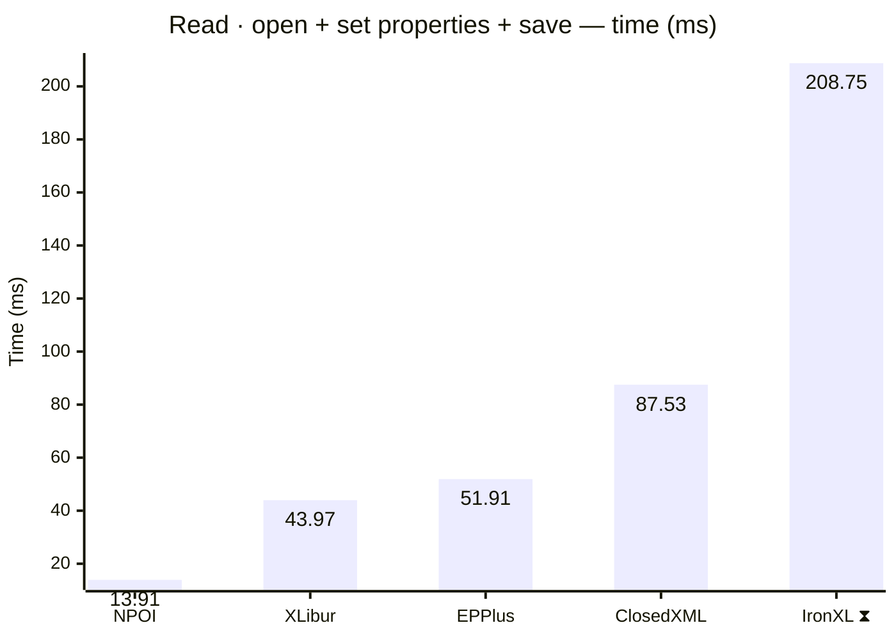
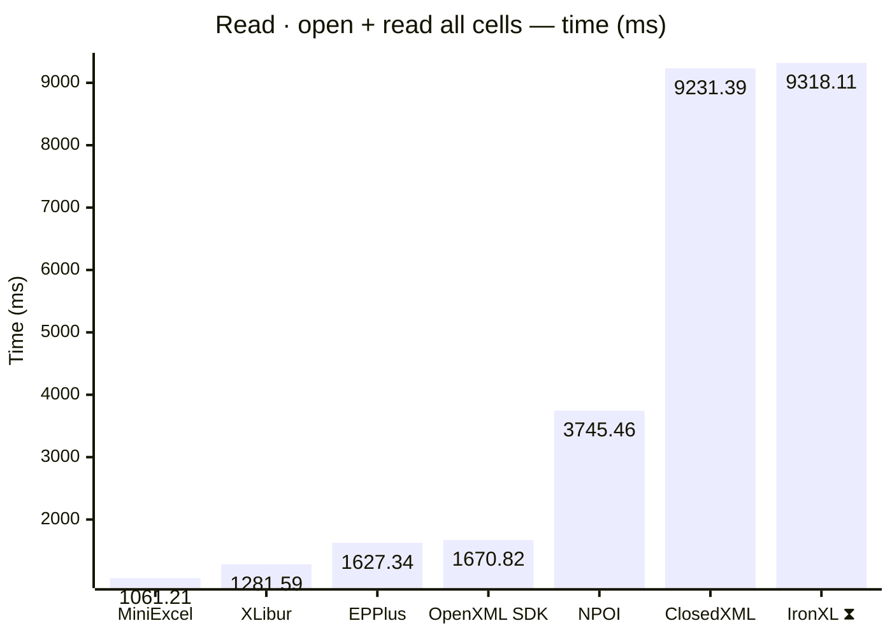
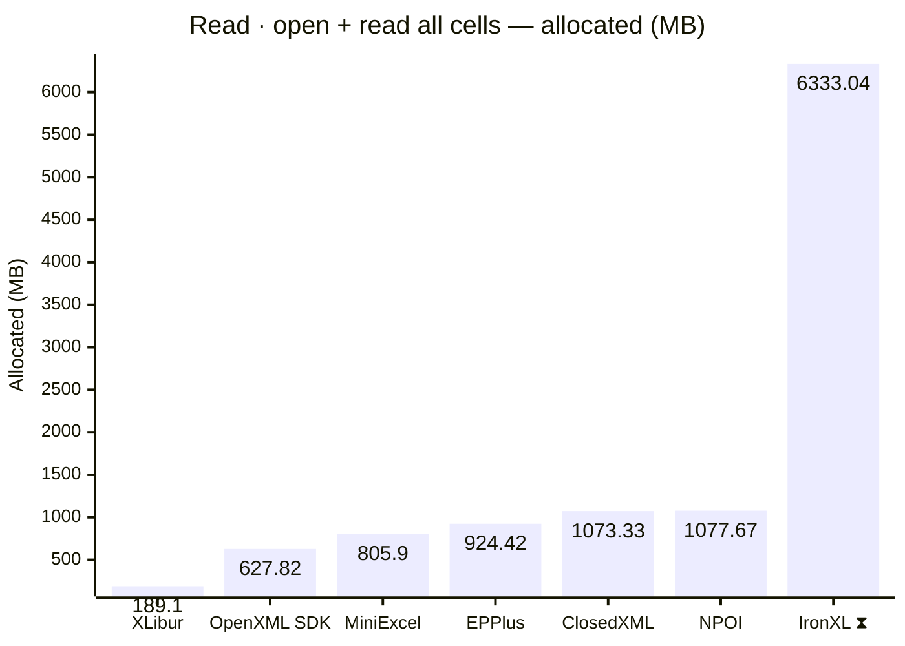
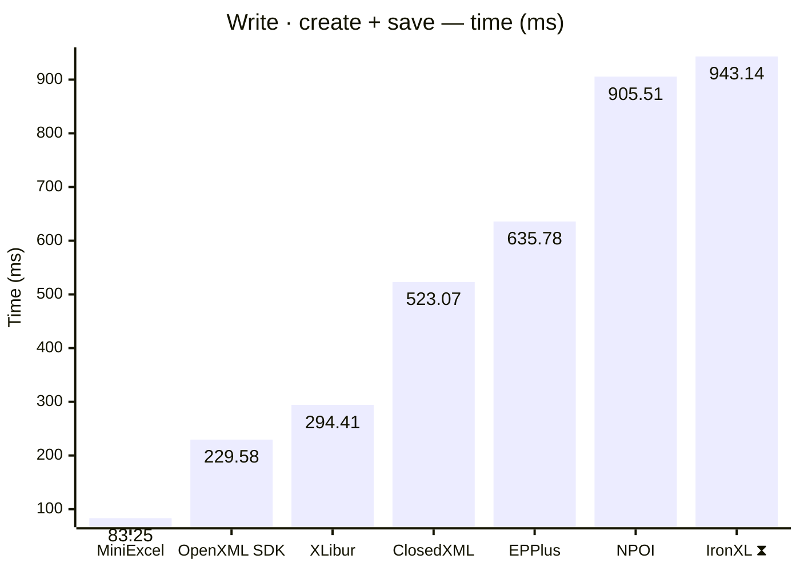
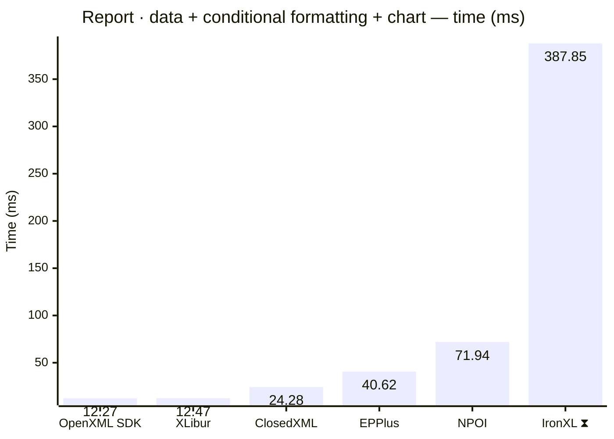
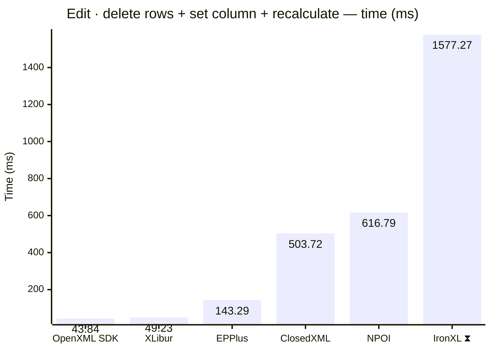
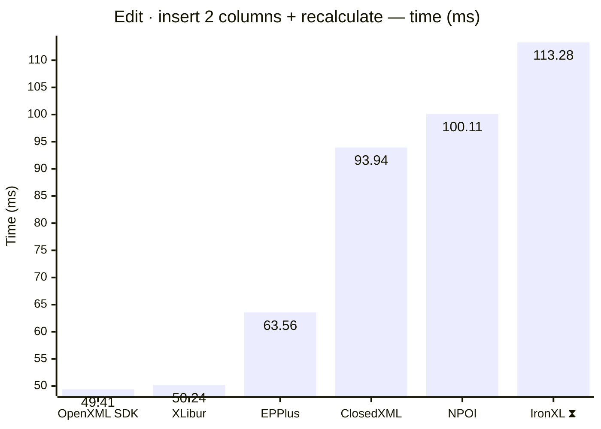
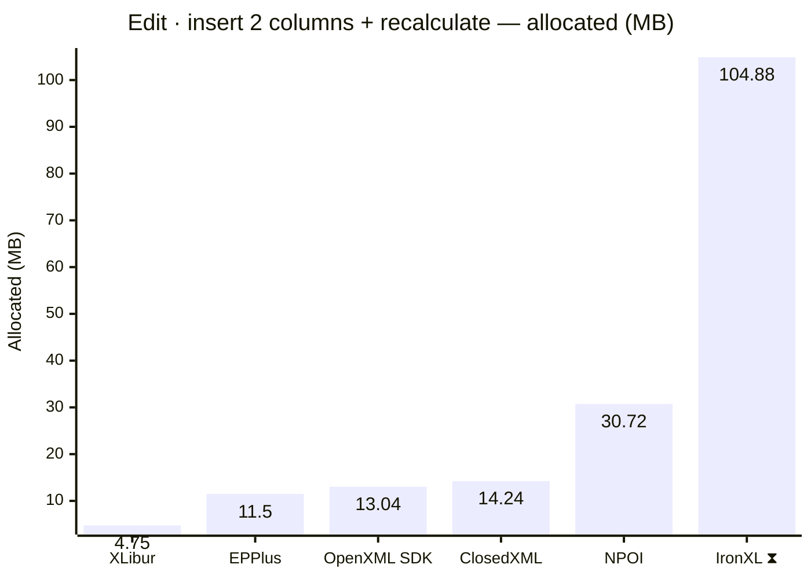

<style>
  .main-content { max-width: 90% !important; padding-left: 2rem !important; padding-right: 2rem !important; }
</style>
<!-- Generated by XLBench. Do not edit by hand; re-run scripts/run-benchmarks.ps1. -->
# XLBench Results

Each section below embeds the full BenchmarkDotNet environment block (OS, CPU,
.NET SDK and runtime). Timings are hardware-specific; treat the allocation/GC
columns as the most portable signal across machines. Regenerate locally with
`scripts/run-benchmarks.ps1`.

> ⚠️ Generated on a shared GitHub Actions runner — timings are indicative and vary run to run; allocation/memory figures are reliable. Authoritative timings come from a local run: [results.html](results.html).

📈 **[Interactive charts](charts.html)** (GitHub Pages). Static charts and the full tables follow.

Each results table (one per test method) is heat-mapped independently on the Pages site (🟩 best → 🟥 worst).

> ⧗ **Carried over from an earlier run.** The rows and chart points below marked with this symbol were not measured here — the library is commercial and needs a licence key this run did not have — so they are replayed from `snapshots/`. Compare them as indicative rather than like-for-like, and see the repository README for how to refresh a snapshot.
>
> - **IronXL** 2026.8.1, Job-HTCPYF job, captured 2026-08-03 on different hardware — Windows 11 (10.0.22631.6199/23H2/2023Update/SunValley3), AMD Ryzen 9 5950X 16-Core Processor.

## Libraries under test

| Library | Version | Source |
| --- | --- | --- |
| ClosedXML | 0.105.1 | this run |
| EPPlus | 8.7.0 | this run |
| OpenXML SDK | 3.5.1 | this run |
| NPOI | 2.8.0 | this run |
| MiniExcel | 1.46.0 | this run |
| XLibur | 0.311.2-alpha.34 | this run |
| IronXL ⧗ | 2026.8.1 | snapshot (2026.8.1, Job-HTCPYF, captured 2026-08-03) |

## Comparison charts

_Lower is better. Charts render in the GitHub file view; the Pages site has interactive versions._





















## Detailed results


```

BenchmarkDotNet v0.15.8, Linux Ubuntu 24.04.5 LTS (Noble Numbat)
AMD EPYC 7763 2.88GHz, 1 CPU, 4 logical and 2 physical cores
.NET SDK 10.0.401
  [Host]   : .NET 10.0.12 (10.0.12, 10.0.1226.42308), X64 RyuJIT x86-64-v3
  ShortRun : .NET 10.0.12 (10.0.12, 10.0.1226.42308), X64 RyuJIT x86-64-v3

Job=ShortRun  IterationCount=3  LaunchCount=1  
WarmupCount=3  

```

### Read · open + set properties + save

| Library     | Type                      | Method                      | Mean        | Error        | StdDev     | Median      | Gen0       | Gen1       | Gen2      | Allocated  |
|------------ |-------------------------- |---------------------------- |------------:|-------------:|-----------:|------------:|-----------:|-----------:|----------:|-----------:|
| NPOI        | NpoiReadBenchmarks        | OpenAmendPropertiesAndSave  |    13.91 ms |     6.824 ms |   0.374 ms |    13.85 ms |    66.6667 |          - |         - |     1.9 MB |
| XLibur      | XLiburReadBenchmarks      | OpenAmendPropertiesAndSave  |    43.97 ms |   343.903 ms |  18.850 ms |    48.53 ms |          - |          - |         - |    1.72 MB |
| EPPlus      | EpPlusReadBenchmarks      | OpenAmendPropertiesAndSave  |    51.91 ms |   260.554 ms |  14.282 ms |    52.39 ms |  1000.0000 |  1000.0000 | 1000.0000 |   13.82 MB |
| ClosedXML   | ClosedXmlReadBenchmarks   | OpenAmendPropertiesAndSave  |    87.53 ms |   526.541 ms |  28.861 ms |    85.34 ms |   750.0000 |   250.0000 |         - |   13.17 MB |
| IronXL ⧗ | IronXlReadBenchmarks | OpenAmendPropertiesAndSave | 208.746 ms | 155.7570 ms | 92.6885 ms | 168.705 ms | 9000.0000 | 2000.0000 | - | 152.81 MB |

### Read · open + read all cells

| Library     | Type                      | Method                      | Mean        | Error        | StdDev     | Median      | Gen0       | Gen1       | Gen2      | Allocated  |
|------------ |-------------------------- |---------------------------- |------------:|-------------:|-----------:|------------:|-----------:|-----------:|----------:|-----------:|
| MiniExcel   | MiniExcelReadBenchmarks   | OpenAndReadAll              | 1,061.21 ms |    42.073 ms |   2.306 ms | 1,061.35 ms | 51000.0000 |  4000.0000 | 1000.0000 |   805.9 MB |
| XLibur      | XLiburReadBenchmarks      | OpenAndReadAll              | 1,281.59 ms |   168.791 ms |   9.252 ms | 1,284.61 ms | 13000.0000 |  8000.0000 | 2000.0000 |   189.1 MB |
| EPPlus      | EpPlusReadBenchmarks      | OpenAndReadAll              | 1,627.34 ms |    73.037 ms |   4.003 ms | 1,626.94 ms | 49000.0000 | 14000.0000 | 7000.0000 |  924.42 MB |
| OpenXML SDK | OpenXmlReadBenchmarks     | OpenAndReadAll              | 1,670.82 ms |   228.275 ms |  12.513 ms | 1,677.84 ms | 40000.0000 |  6000.0000 | 1000.0000 |  627.82 MB |
| NPOI        | NpoiReadBenchmarks        | OpenAndReadAll              | 3,745.46 ms | 4,279.148 ms | 234.555 ms | 3,874.94 ms | 67000.0000 | 62000.0000 | 6000.0000 | 1077.67 MB |
| ClosedXML   | ClosedXmlReadBenchmarks   | OpenAndReadAll              | 9,231.39 ms |   521.207 ms |  28.569 ms | 9,219.93 ms | 60000.0000 | 24000.0000 | 4000.0000 | 1073.33 MB |
| IronXL ⧗ | IronXlReadBenchmarks | OpenAndReadAll | 9,318.107 ms | 477.3336 ms | 315.7266 ms | 9,377.407 ms | 393000.0000 | 202000.0000 | 10000.0000 | 6333.04 MB |

### Write · create + save

| Library     | Type                      | Method                      | Mean        | Error        | StdDev     | Median      | Gen0       | Gen1       | Gen2      | Allocated  |
|------------ |-------------------------- |---------------------------- |------------:|-------------:|-----------:|------------:|-----------:|-----------:|----------:|-----------:|
| MiniExcel   | MiniExcelWriteBenchmarks  | CreateAndSave               |    83.25 ms |    18.933 ms |   1.038 ms |    83.40 ms |  5142.8571 |  1285.7143 | 1142.8571 |   84.59 MB |
| OpenXML SDK | OpenXmlWriteBenchmarks    | CreateAndSave               |   229.58 ms |    29.071 ms |   1.593 ms |   228.74 ms |  9000.0000 |  2333.3333 | 2333.3333 |  134.19 MB |
| XLibur      | XLiburWriteBenchmarks     | CreateAndSave               |   294.41 ms |    10.767 ms |   0.590 ms |   294.18 ms |  3000.0000 |  2000.0000 | 2000.0000 |    60.5 MB |
| ClosedXML   | ClosedXmlWriteBenchmarks  | CreateAndSave               |   523.07 ms |    20.515 ms |   1.125 ms |   523.44 ms | 11000.0000 |  6000.0000 | 3000.0000 |  181.09 MB |
| EPPlus      | EpPlusWriteBenchmarks     | CreateAndSave               |   635.78 ms |    89.755 ms |   4.920 ms |   636.62 ms | 20000.0000 |  9000.0000 | 3000.0000 |  322.57 MB |
| NPOI        | NpoiWriteBenchmarks       | CreateAndSave               |   905.51 ms |   178.261 ms |   9.771 ms |   908.21 ms | 16000.0000 | 12000.0000 | 3000.0000 |  247.27 MB |
| IronXL ⧗ | IronXlWriteBenchmarks | CreateAndSave | 943.137 ms | 18.5191 ms | 11.0204 ms | 938.999 ms | 48000.0000 | 16000.0000 | 3000.0000 | 797.63 MB |

### Report · data + conditional formatting + chart

| Library     | Type                      | Method                      | Mean        | Error        | StdDev     | Median      | Gen0       | Gen1       | Gen2      | Allocated  |
|------------ |-------------------------- |---------------------------- |------------:|-------------:|-----------:|------------:|-----------:|-----------:|----------:|-----------:|
| OpenXML SDK | OpenXmlReportBenchmarks   | CreateStockReport           |    12.27 ms |     0.896 ms |   0.049 ms |    12.26 ms |   375.0000 |   359.3750 |  187.5000 |    4.92 MB |
| XLibur      | XLiburReportBenchmarks    | CreateStockReport           |    12.47 ms |     3.738 ms |   0.205 ms |    12.40 ms |   187.5000 |   187.5000 |  187.5000 |    3.48 MB |
| ClosedXML   | ClosedXmlReportBenchmarks | CreateStockReport           |    24.28 ms |     1.476 ms |   0.081 ms |    24.33 ms |   468.7500 |   343.7500 |  187.5000 |    8.01 MB |
| EPPlus      | EpPlusReportBenchmarks    | CreateStockReport           |    40.62 ms |    23.366 ms |   1.281 ms |    40.42 ms |  1000.0000 |  1000.0000 | 1000.0000 |   14.12 MB |
| NPOI        | NpoiReportBenchmarks      | CreateStockReport           |    71.94 ms |   659.709 ms |  36.161 ms |    55.97 ms |   750.0000 |   500.0000 |  250.0000 |   16.28 MB |
| IronXL ⧗ | IronXlReportBenchmarks | CreateStockReport | 387.849 ms | 36.5456 ms | 24.1726 ms | 384.092 ms | 14000.0000 | 3000.0000 | - | 237.38 MB |

### Edit · delete rows + set column + recalculate

| Library     | Type                      | Method                      | Mean        | Error        | StdDev     | Median      | Gen0       | Gen1       | Gen2      | Allocated  |
|------------ |-------------------------- |---------------------------- |------------:|-------------:|-----------:|------------:|-----------:|-----------:|----------:|-----------:|
| OpenXML SDK | OpenXmlEditBenchmarks     | EditAndRecalculate          |    43.84 ms |   159.456 ms |   8.740 ms |    38.95 ms |   500.0000 |   250.0000 |         - |     9.8 MB |
| XLibur      | XLiburEditBenchmarks      | EditAndRecalculate          |    49.23 ms |   298.174 ms |  16.344 ms |    49.43 ms |   166.6667 |          - |         - |    4.16 MB |
| EPPlus      | EpPlusEditBenchmarks      | EditAndRecalculate          |   143.29 ms |   118.739 ms |   6.509 ms |   143.61 ms |  9000.0000 |  1333.3333 | 1000.0000 |   142.5 MB |
| ClosedXML   | ClosedXmlEditBenchmarks   | EditAndRecalculate          |   503.72 ms |   208.185 ms |  11.411 ms |   504.25 ms | 21000.0000 |  1000.0000 |         - |  337.72 MB |
| NPOI        | NpoiEditBenchmarks        | EditAndRecalculate          |   616.79 ms |   282.814 ms |  15.502 ms |   617.29 ms | 25000.0000 |  1000.0000 |         - |  413.38 MB |
| IronXL ⧗ | IronXlEditBenchmarks | EditAndRecalculate | 1,577.273 ms | 62.9583 ms | 41.6430 ms | 1,583.098 ms | 57000.0000 | 36000.0000 | 15000.0000 | 753.86 MB |

### Edit · insert 2 columns + recalculate

| Library     | Type                      | Method                      | Mean        | Error        | StdDev     | Median      | Gen0       | Gen1       | Gen2      | Allocated  |
|------------ |-------------------------- |---------------------------- |------------:|-------------:|-----------:|------------:|-----------:|-----------:|----------:|-----------:|
| OpenXML SDK | OpenXmlInsertBenchmarks   | InsertColumnsAndRecalculate |    49.41 ms |    26.858 ms |   1.472 ms |    48.94 ms |   750.0000 |   500.0000 |  250.0000 |   13.04 MB |
| XLibur      | XLiburInsertBenchmarks    | InsertColumnsAndRecalculate |    50.24 ms |   139.653 ms |   7.655 ms |    47.32 ms |   200.0000 |          - |         - |    4.75 MB |
| EPPlus      | EpPlusInsertBenchmarks    | InsertColumnsAndRecalculate |    63.56 ms |   202.207 ms |  11.084 ms |    62.47 ms |  1000.0000 |  1000.0000 | 1000.0000 |    11.5 MB |
| ClosedXML   | ClosedXmlInsertBenchmarks | InsertColumnsAndRecalculate |    93.94 ms | 1,025.987 ms |  56.238 ms |    71.69 ms |   666.6667 |   333.3333 |         - |   14.24 MB |
| NPOI        | NpoiInsertBenchmarks      | InsertColumnsAndRecalculate |   100.11 ms |   274.017 ms |  15.020 ms |   101.12 ms |  2000.0000 |  1500.0000 |  500.0000 |   30.72 MB |
| IronXL ⧗ | IronXlInsertBenchmarks | InsertColumnsAndRecalculate | 113.284 ms | 41.9750 ms | 27.7638 ms | 97.052 ms | 7000.0000 | 2500.0000 | 750.0000 | 104.88 MB |


<script type="module">
  import mermaid from 'https://cdn.jsdelivr.net/npm/mermaid@11/dist/mermaid.esm.min.mjs';
  const blocks = document.querySelectorAll('.language-mermaid');
  blocks.forEach(el => {
    const code = el.querySelector('code') || el;
    const pre = document.createElement('pre');
    pre.className = 'mermaid';
    pre.textContent = code.textContent;
    el.replaceWith(pre);
  });
  if (blocks.length) {
    mermaid.initialize({ startOnLoad: false });
    await mermaid.run({ querySelector: 'pre.mermaid' });
  }
</script>

<script>
(function () {
  const parse = s => { const n = parseFloat(String(s).replace(/,/g, '')); return Number.isFinite(n) ? n : null; };
  document.querySelectorAll('table').forEach(table => {
    if (!table.tHead || !table.tBodies[0]) return;
    const heads = [...table.tHead.rows[0].cells].map(c => c.textContent.trim().toLowerCase());
    if (!heads.includes('mean')) return;
    const metricCols = heads.map((h, i) => /^(mean|allocated|gen0|gen1|gen2)$/.test(h) ? i : -1).filter(i => i >= 0);
    const rows = [...table.tBodies[0].rows];
    for (const c of metricCols) {
      const vals = rows.map(r => parse(r.cells[c]?.textContent));
      const nums = vals.filter(v => v !== null);
      if (nums.length < 2) continue;
      const min = Math.min(...nums), max = Math.max(...nums);
      if (max === min) continue;
      rows.forEach((r, i) => {
        const v = vals[i]; if (v === null) return;
        const ratio = (v - min) / (max - min);
        r.cells[c].style.backgroundColor = `hsla(${120 - 120 * ratio}, 70%, 50%, 0.45)`;
      });
    }
  });
})();
</script>
