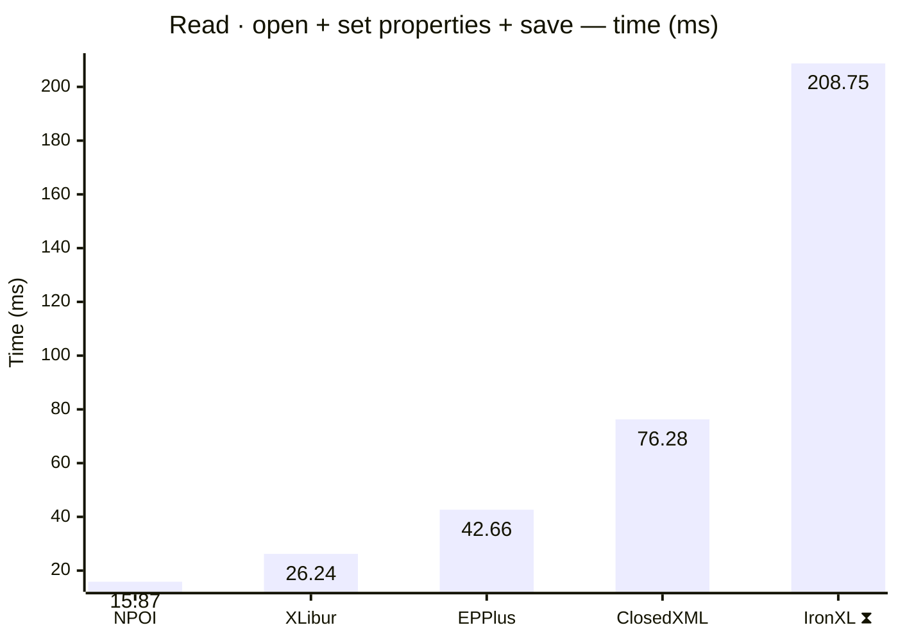
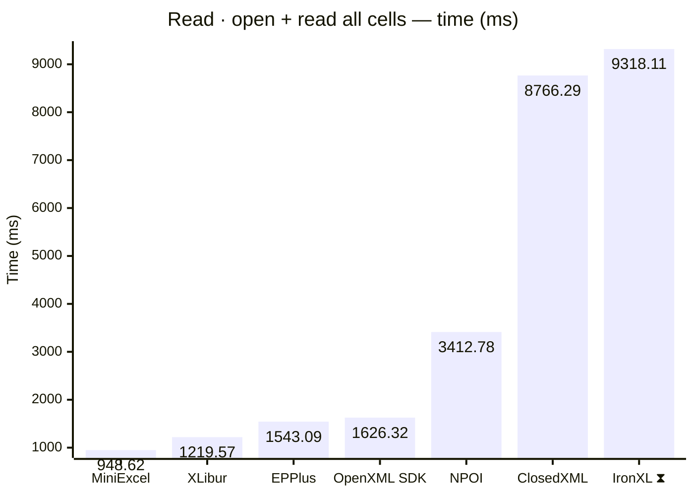
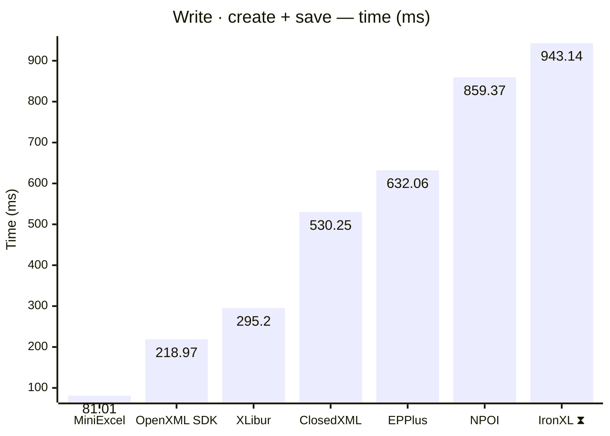
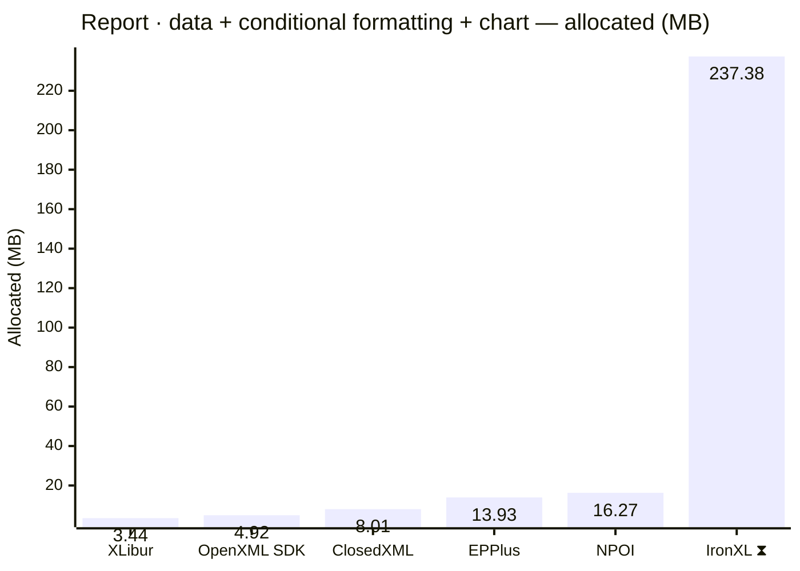
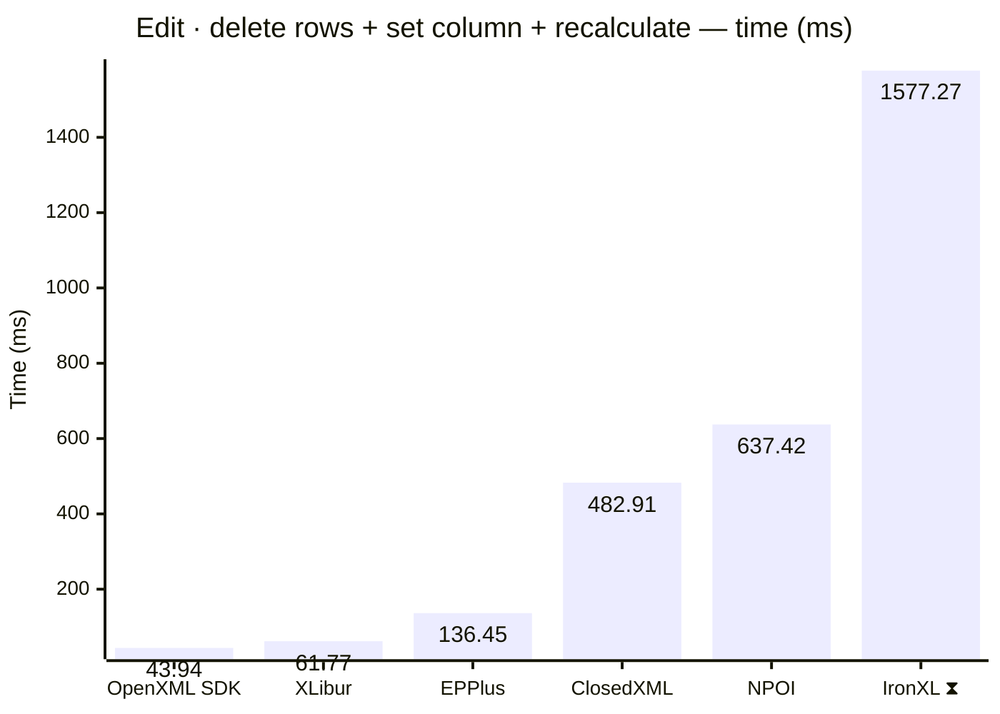
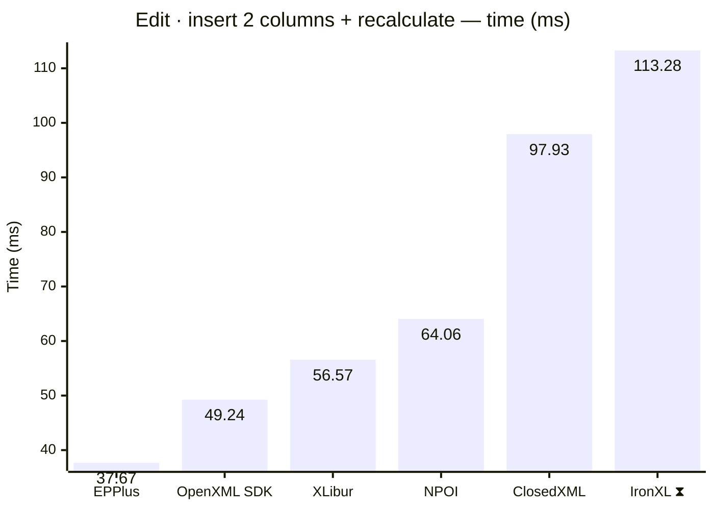

<style>
  .main-content { max-width: 90% !important; padding-left: 2rem !important; padding-right: 2rem !important; }
</style>
<!-- Generated by XLBench. Do not edit by hand; re-run scripts/run-benchmarks.ps1. -->
# XLBench Results

Each section below embeds the full BenchmarkDotNet environment block (OS, CPU,
.NET SDK and runtime). Timings are hardware-specific; treat the allocation/GC
columns as the most portable signal across machines. Regenerate locally with
`scripts/run-benchmarks.ps1`.

> ⚠️ Generated on a shared GitHub Actions runner — timings are indicative and vary run to run; allocation/memory figures are reliable. Authoritative timings come from a local run: [results.html](results.html).

📈 **[Interactive charts](charts.html)** (GitHub Pages). Static charts and the full tables follow.

Each results table (one per test method) is heat-mapped independently on the Pages site (🟩 best → 🟥 worst).

> ⧗ **Carried over from an earlier run.** The rows and chart points below marked with this symbol were not measured here — the library is commercial and needs a licence key this run did not have — so they are replayed from `snapshots/`. Compare them as indicative rather than like-for-like, and see the repository README for how to refresh a snapshot.
>
> - **IronXL** 2026.8.1, Job-HTCPYF job, captured 2026-08-03 on different hardware — Windows 11 (10.0.22631.6199/23H2/2023Update/SunValley3), AMD Ryzen 9 5950X 16-Core Processor.

## Libraries under test

| Library | Version | Source |
| --- | --- | --- |
| ClosedXML | 0.105.1 | this run |
| EPPlus | 8.6.3 | this run |
| OpenXML SDK | 3.5.1 | this run |
| NPOI | 2.8.0 | this run |
| MiniExcel | 1.45.0 | this run |
| XLibur | 0.311.1 | this run |
| IronXL ⧗ | 2026.8.1 | snapshot (2026.8.1, Job-HTCPYF, captured 2026-08-03) |

## Comparison charts

_Lower is better. Charts render in the GitHub file view; the Pages site has interactive versions._


















## Detailed results


```

BenchmarkDotNet v0.15.8, Linux Ubuntu 24.04.4 LTS (Noble Numbat)
AMD EPYC 7763 3.16GHz, 1 CPU, 4 logical and 2 physical cores
.NET SDK 10.0.400
  [Host]   : .NET 10.0.11 (10.0.11, 10.0.1126.37416), X64 RyuJIT x86-64-v3
  ShortRun : .NET 10.0.11 (10.0.11, 10.0.1126.37416), X64 RyuJIT x86-64-v3

Job=ShortRun  IterationCount=3  LaunchCount=1  
WarmupCount=3  

```

### Read · open + set properties + save

| Library     | Type                      | Method                      | Mean        | Error        | StdDev     | Median      | Gen0       | Gen1       | Gen2      | Allocated  |
|------------ |-------------------------- |---------------------------- |------------:|-------------:|-----------:|------------:|-----------:|-----------:|----------:|-----------:|
| NPOI        | NpoiReadBenchmarks        | OpenAmendPropertiesAndSave  |    15.87 ms |    90.862 ms |   4.980 ms |    13.11 ms |    71.4286 |          - |         - |    1.89 MB |
| XLibur      | XLiburReadBenchmarks      | OpenAmendPropertiesAndSave  |    26.24 ms |   128.220 ms |   7.028 ms |    23.27 ms |          - |          - |         - |    1.72 MB |
| EPPlus      | EpPlusReadBenchmarks      | OpenAmendPropertiesAndSave  |    42.66 ms |   105.172 ms |   5.765 ms |    44.40 ms |  1000.0000 |  1000.0000 | 1000.0000 |   13.85 MB |
| ClosedXML   | ClosedXmlReadBenchmarks   | OpenAmendPropertiesAndSave  |    76.28 ms |   767.951 ms |  42.094 ms |    56.26 ms |   750.0000 |   250.0000 |         - |   13.17 MB |
| IronXL ⧗ | IronXlReadBenchmarks | OpenAmendPropertiesAndSave | 208.746 ms | 155.7570 ms | 92.6885 ms | 168.705 ms | 9000.0000 | 2000.0000 | - | 152.81 MB |

### Read · open + read all cells

| Library     | Type                      | Method                      | Mean        | Error        | StdDev     | Median      | Gen0       | Gen1       | Gen2      | Allocated  |
|------------ |-------------------------- |---------------------------- |------------:|-------------:|-----------:|------------:|-----------:|-----------:|----------:|-----------:|
| MiniExcel   | MiniExcelReadBenchmarks   | OpenAndReadAll              |   948.62 ms |    72.124 ms |   3.953 ms |   947.28 ms | 38000.0000 |  3000.0000 |         - |  628.88 MB |
| XLibur      | XLiburReadBenchmarks      | OpenAndReadAll              | 1,219.57 ms |   210.327 ms |  11.529 ms | 1,225.38 ms | 13000.0000 |  8000.0000 | 2000.0000 |  192.91 MB |
| EPPlus      | EpPlusReadBenchmarks      | OpenAndReadAll              | 1,543.09 ms |   142.631 ms |   7.818 ms | 1,539.27 ms | 49000.0000 | 14000.0000 | 7000.0000 |  924.43 MB |
| OpenXML SDK | OpenXmlReadBenchmarks     | OpenAndReadAll              | 1,626.32 ms |    93.517 ms |   5.126 ms | 1,626.94 ms | 40000.0000 |  6000.0000 | 1000.0000 |  627.82 MB |
| NPOI        | NpoiReadBenchmarks        | OpenAndReadAll              | 3,412.78 ms | 4,241.490 ms | 232.490 ms | 3,541.06 ms | 67000.0000 | 62000.0000 | 6000.0000 | 1077.68 MB |
| ClosedXML   | ClosedXmlReadBenchmarks   | OpenAndReadAll              | 8,766.29 ms |    65.010 ms |   3.563 ms | 8,765.44 ms | 60000.0000 | 24000.0000 | 4000.0000 | 1073.97 MB |
| IronXL ⧗ | IronXlReadBenchmarks | OpenAndReadAll | 9,318.107 ms | 477.3336 ms | 315.7266 ms | 9,377.407 ms | 393000.0000 | 202000.0000 | 10000.0000 | 6333.04 MB |

### Write · create + save

| Library     | Type                      | Method                      | Mean        | Error        | StdDev     | Median      | Gen0       | Gen1       | Gen2      | Allocated  |
|------------ |-------------------------- |---------------------------- |------------:|-------------:|-----------:|------------:|-----------:|-----------:|----------:|-----------:|
| MiniExcel   | MiniExcelWriteBenchmarks  | CreateAndSave               |    81.01 ms |    24.101 ms |   1.321 ms |    80.72 ms |  5285.7143 |  1285.7143 | 1285.7143 |   84.59 MB |
| OpenXML SDK | OpenXmlWriteBenchmarks    | CreateAndSave               |   218.97 ms |    11.415 ms |   0.626 ms |   219.30 ms |  9000.0000 |  2333.3333 | 2333.3333 |  134.19 MB |
| XLibur      | XLiburWriteBenchmarks     | CreateAndSave               |   295.20 ms |   110.320 ms |   6.047 ms |   293.62 ms |  3000.0000 |  2000.0000 | 2000.0000 |    60.5 MB |
| ClosedXML   | ClosedXmlWriteBenchmarks  | CreateAndSave               |   530.25 ms |   427.543 ms |  23.435 ms |   518.22 ms | 11000.0000 |  6000.0000 | 3000.0000 |  181.09 MB |
| EPPlus      | EpPlusWriteBenchmarks     | CreateAndSave               |   632.06 ms |   213.959 ms |  11.728 ms |   626.37 ms | 20000.0000 |  9000.0000 | 3000.0000 |  322.57 MB |
| NPOI        | NpoiWriteBenchmarks       | CreateAndSave               |   859.37 ms |   271.136 ms |  14.862 ms |   851.88 ms | 16000.0000 | 12000.0000 | 3000.0000 |  247.27 MB |
| IronXL ⧗ | IronXlWriteBenchmarks | CreateAndSave | 943.137 ms | 18.5191 ms | 11.0204 ms | 938.999 ms | 48000.0000 | 16000.0000 | 3000.0000 | 797.63 MB |

### Report · data + conditional formatting + chart

| Library     | Type                      | Method                      | Mean        | Error        | StdDev     | Median      | Gen0       | Gen1       | Gen2      | Allocated  |
|------------ |-------------------------- |---------------------------- |------------:|-------------:|-----------:|------------:|-----------:|-----------:|----------:|-----------:|
| OpenXML SDK | OpenXmlReportBenchmarks   | CreateStockReport           |    11.58 ms |     1.257 ms |   0.069 ms |    11.59 ms |   375.0000 |   359.3750 |  187.5000 |    4.92 MB |
| XLibur      | XLiburReportBenchmarks    | CreateStockReport           |    11.85 ms |     3.160 ms |   0.173 ms |    11.85 ms |   187.5000 |   187.5000 |  187.5000 |    3.44 MB |
| ClosedXML   | ClosedXmlReportBenchmarks | CreateStockReport           |    23.22 ms |     1.149 ms |   0.063 ms |    23.19 ms |   468.7500 |   343.7500 |  187.5000 |    8.01 MB |
| EPPlus      | EpPlusReportBenchmarks    | CreateStockReport           |    30.36 ms |   102.398 ms |   5.613 ms |    29.55 ms |  1000.0000 |  1000.0000 | 1000.0000 |   13.93 MB |
| NPOI        | NpoiReportBenchmarks      | CreateStockReport           |    53.32 ms |   207.382 ms |  11.367 ms |    49.00 ms |   833.3333 |   666.6667 |  333.3333 |   16.27 MB |
| IronXL ⧗ | IronXlReportBenchmarks | CreateStockReport | 387.849 ms | 36.5456 ms | 24.1726 ms | 384.092 ms | 14000.0000 | 3000.0000 | - | 237.38 MB |

### Edit · delete rows + set column + recalculate

| Library     | Type                      | Method                      | Mean        | Error        | StdDev     | Median      | Gen0       | Gen1       | Gen2      | Allocated  |
|------------ |-------------------------- |---------------------------- |------------:|-------------:|-----------:|------------:|-----------:|-----------:|----------:|-----------:|
| OpenXML SDK | OpenXmlEditBenchmarks     | EditAndRecalculate          |    43.94 ms |   183.596 ms |  10.064 ms |    39.95 ms |   500.0000 |   250.0000 |         - |     9.8 MB |
| XLibur      | XLiburEditBenchmarks      | EditAndRecalculate          |    61.77 ms |    84.841 ms |   4.650 ms |    62.57 ms |   166.6667 |          - |         - |    4.25 MB |
| EPPlus      | EpPlusEditBenchmarks      | EditAndRecalculate          |   136.45 ms |   171.125 ms |   9.380 ms |   132.90 ms |  9000.0000 |  1333.3333 | 1000.0000 |   142.5 MB |
| ClosedXML   | ClosedXmlEditBenchmarks   | EditAndRecalculate          |   482.91 ms |     8.348 ms |   0.458 ms |   482.69 ms | 21000.0000 |  1000.0000 |         - |  340.69 MB |
| NPOI        | NpoiEditBenchmarks        | EditAndRecalculate          |   637.42 ms |   322.748 ms |  17.691 ms |   630.74 ms | 25000.0000 |  1000.0000 |         - |  413.38 MB |
| IronXL ⧗ | IronXlEditBenchmarks | EditAndRecalculate | 1,577.273 ms | 62.9583 ms | 41.6430 ms | 1,583.098 ms | 57000.0000 | 36000.0000 | 15000.0000 | 753.86 MB |

### Edit · insert 2 columns + recalculate

| Library     | Type                      | Method                      | Mean        | Error        | StdDev     | Median      | Gen0       | Gen1       | Gen2      | Allocated  |
|------------ |-------------------------- |---------------------------- |------------:|-------------:|-----------:|------------:|-----------:|-----------:|----------:|-----------:|
| EPPlus      | EpPlusInsertBenchmarks    | InsertColumnsAndRecalculate |    37.67 ms |   152.678 ms |   8.369 ms |    36.56 ms |  1000.0000 |  1000.0000 | 1000.0000 |   11.42 MB |
| OpenXML SDK | OpenXmlInsertBenchmarks   | InsertColumnsAndRecalculate |    49.24 ms |    64.195 ms |   3.519 ms |    48.80 ms |   750.0000 |   500.0000 |  250.0000 |   13.04 MB |
| XLibur      | XLiburInsertBenchmarks    | InsertColumnsAndRecalculate |    56.57 ms |    82.263 ms |   4.509 ms |    57.88 ms |   166.6667 |          - |         - |    4.73 MB |
| NPOI        | NpoiInsertBenchmarks      | InsertColumnsAndRecalculate |    64.06 ms |   100.523 ms |   5.510 ms |    61.12 ms |  2000.0000 |  1500.0000 |  500.0000 |   30.74 MB |
| ClosedXML   | ClosedXmlInsertBenchmarks | InsertColumnsAndRecalculate |    97.93 ms |   480.702 ms |  26.349 ms |    87.82 ms |   500.0000 |          - |         - |   14.34 MB |
| IronXL ⧗ | IronXlInsertBenchmarks | InsertColumnsAndRecalculate | 113.284 ms | 41.9750 ms | 27.7638 ms | 97.052 ms | 7000.0000 | 2500.0000 | 750.0000 | 104.88 MB |


<script type="module">
  import mermaid from 'https://cdn.jsdelivr.net/npm/mermaid@11/dist/mermaid.esm.min.mjs';
  const blocks = document.querySelectorAll('.language-mermaid');
  blocks.forEach(el => {
    const code = el.querySelector('code') || el;
    const pre = document.createElement('pre');
    pre.className = 'mermaid';
    pre.textContent = code.textContent;
    el.replaceWith(pre);
  });
  if (blocks.length) {
    mermaid.initialize({ startOnLoad: false });
    await mermaid.run({ querySelector: 'pre.mermaid' });
  }
</script>

<script>
(function () {
  const parse = s => { const n = parseFloat(String(s).replace(/,/g, '')); return Number.isFinite(n) ? n : null; };
  document.querySelectorAll('table').forEach(table => {
    if (!table.tHead || !table.tBodies[0]) return;
    const heads = [...table.tHead.rows[0].cells].map(c => c.textContent.trim().toLowerCase());
    if (!heads.includes('mean')) return;
    const metricCols = heads.map((h, i) => /^(mean|allocated|gen0|gen1|gen2)$/.test(h) ? i : -1).filter(i => i >= 0);
    const rows = [...table.tBodies[0].rows];
    for (const c of metricCols) {
      const vals = rows.map(r => parse(r.cells[c]?.textContent));
      const nums = vals.filter(v => v !== null);
      if (nums.length < 2) continue;
      const min = Math.min(...nums), max = Math.max(...nums);
      if (max === min) continue;
      rows.forEach((r, i) => {
        const v = vals[i]; if (v === null) return;
        const ratio = (v - min) / (max - min);
        r.cells[c].style.backgroundColor = `hsla(${120 - 120 * ratio}, 70%, 50%, 0.45)`;
      });
    }
  });
})();
</script>
