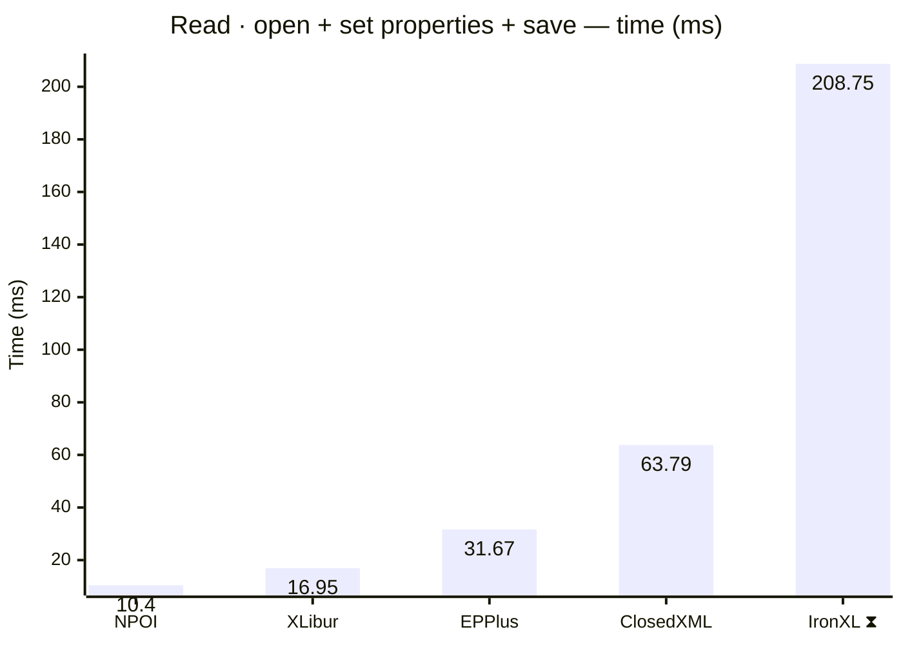
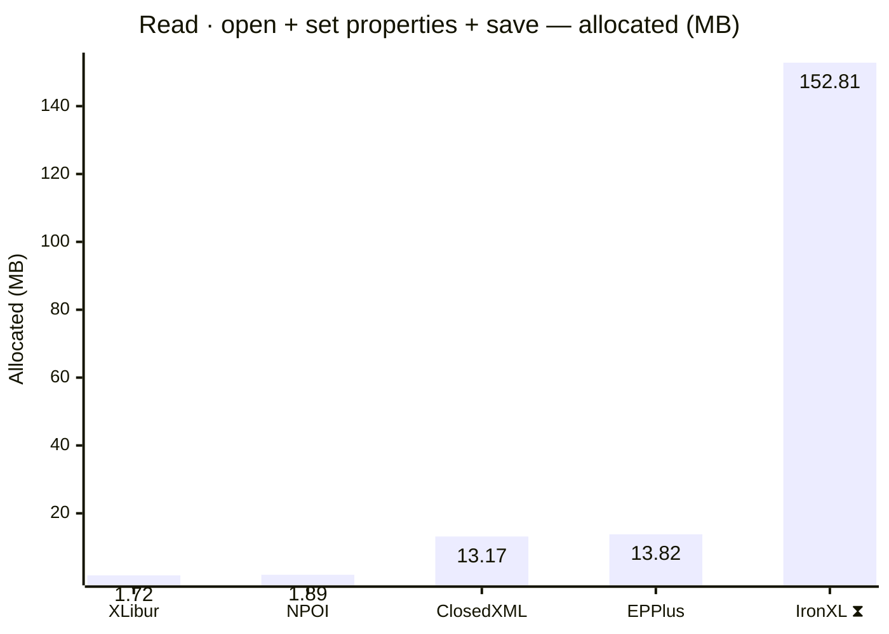
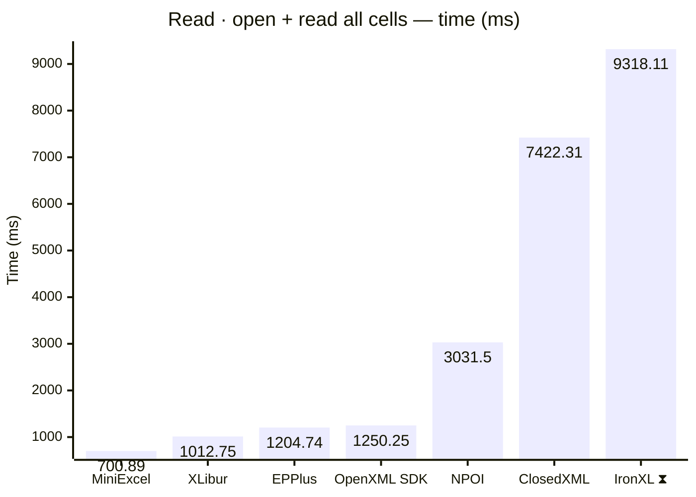
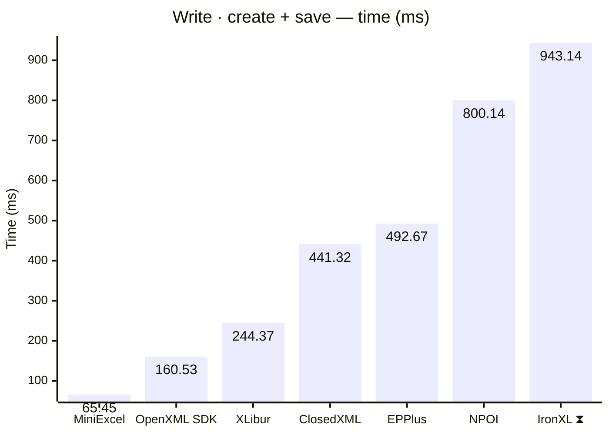
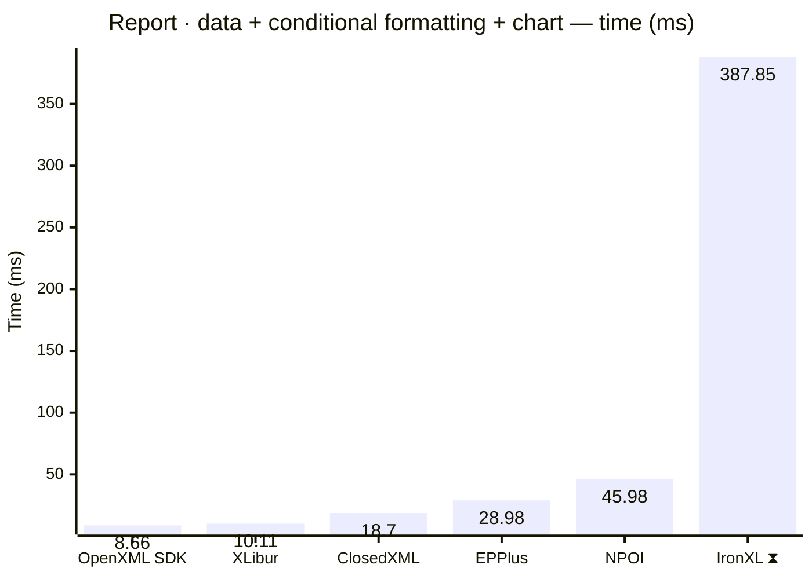
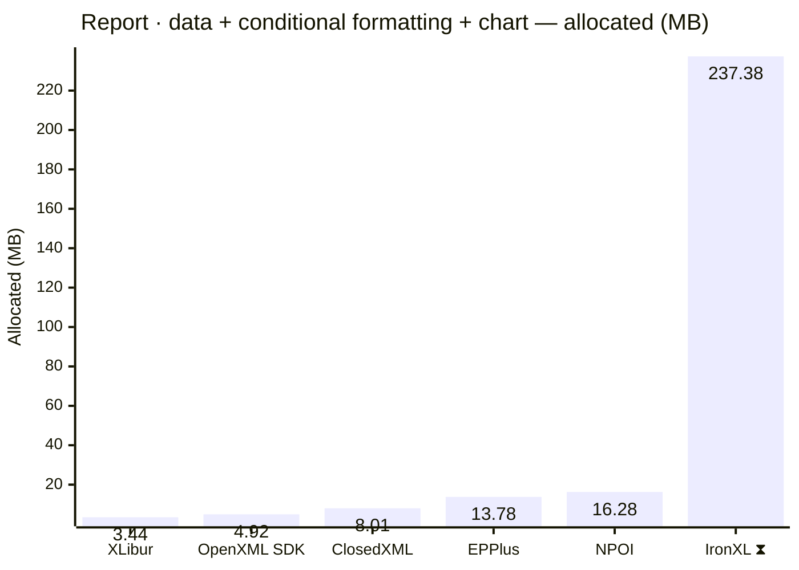
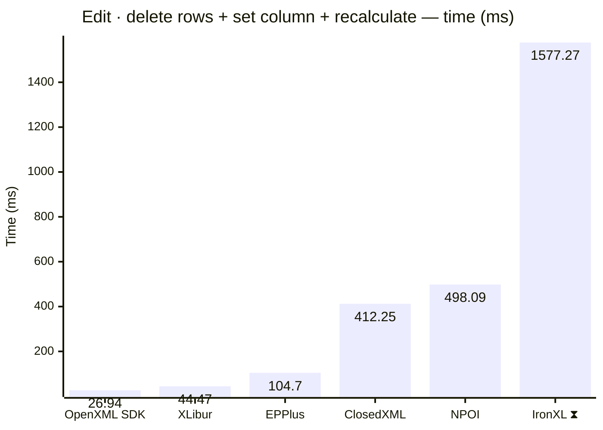
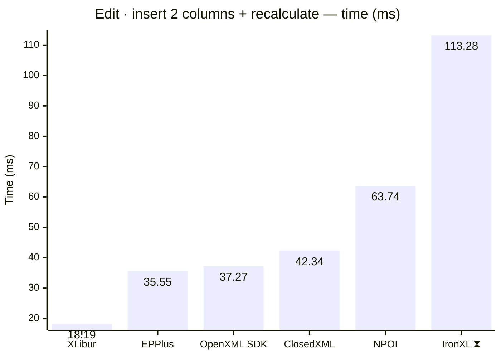

<style>
  .main-content { max-width: 90% !important; padding-left: 2rem !important; padding-right: 2rem !important; }
</style>
<!-- Generated by XLBench. Do not edit by hand; re-run scripts/run-benchmarks.ps1. -->
# XLBench Results

Each section below embeds the full BenchmarkDotNet environment block (OS, CPU,
.NET SDK and runtime). Timings are hardware-specific; treat the allocation/GC
columns as the most portable signal across machines. Regenerate locally with
`scripts/run-benchmarks.ps1`.

> ⚠️ Generated on a shared GitHub Actions runner — timings are indicative and vary run to run; allocation/memory figures are reliable. Authoritative timings come from a local run: [results.html](results.html).

📈 **[Interactive charts](charts.html)** (GitHub Pages). Static charts and the full tables follow.

Each results table (one per test method) is heat-mapped independently on the Pages site (🟩 best → 🟥 worst).

> ⧗ **Carried over from an earlier run.** The rows and chart points below marked with this symbol were not measured here — the library is commercial and needs a licence key this run did not have — so they are replayed from `snapshots/`. Compare them as indicative rather than like-for-like, and see the repository README for how to refresh a snapshot.
>
> - **IronXL** 2026.8.1, Job-HTCPYF job, captured 2026-08-03 on different hardware — Windows 11 (10.0.22631.6199/23H2/2023Update/SunValley3), AMD Ryzen 9 5950X 16-Core Processor.

## Libraries under test

| Library | Version | Source |
| --- | --- | --- |
| ClosedXML | 0.105.1 | this run |
| EPPlus | 8.6.3 | this run |
| OpenXML SDK | 3.5.1 | this run |
| NPOI | 2.8.0 | this run |
| MiniExcel | 1.45.0 | this run |
| XLibur | 0.310.1-beta.5 | this run |
| IronXL ⧗ | 2026.8.1 | snapshot (2026.8.1, Job-HTCPYF, captured 2026-08-03) |

## Comparison charts

_Lower is better. Charts render in the GitHub file view; the Pages site has interactive versions._





















## Detailed results


```

BenchmarkDotNet v0.15.8, Linux Ubuntu 24.04.4 LTS (Noble Numbat)
AMD EPYC 9V74 3.69GHz, 1 CPU, 4 logical and 2 physical cores
.NET SDK 10.0.400
  [Host]   : .NET 10.0.11 (10.0.11, 10.0.1126.37416), X64 RyuJIT x86-64-v4
  ShortRun : .NET 10.0.11 (10.0.11, 10.0.1126.37416), X64 RyuJIT x86-64-v4

Job=ShortRun  IterationCount=3  LaunchCount=1  
WarmupCount=3  

```

### Read · open + set properties + save

| Library     | Type                      | Method                      | Mean         | Error        | StdDev      | Median       | Gen0       | Gen1       | Gen2      | Allocated  |
|------------ |-------------------------- |---------------------------- |-------------:|-------------:|------------:|-------------:|-----------:|-----------:|----------:|-----------:|
| NPOI        | NpoiReadBenchmarks        | OpenAmendPropertiesAndSave  |    10.404 ms |     5.334 ms |   0.2923 ms |    10.281 ms |    62.5000 |          - |         - |    1.89 MB |
| XLibur      | XLiburReadBenchmarks      | OpenAmendPropertiesAndSave  |    16.952 ms |    23.855 ms |   1.3076 ms |    16.553 ms |          - |          - |         - |    1.72 MB |
| EPPlus      | EpPlusReadBenchmarks      | OpenAmendPropertiesAndSave  |    31.671 ms |   130.958 ms |   7.1782 ms |    28.004 ms |  1000.0000 |  1000.0000 | 1000.0000 |   13.82 MB |
| ClosedXML   | ClosedXmlReadBenchmarks   | OpenAmendPropertiesAndSave  |    63.786 ms |   632.078 ms |  34.6463 ms |    44.946 ms |   666.6667 |   333.3333 |         - |   13.17 MB |
| IronXL ⧗ | IronXlReadBenchmarks | OpenAmendPropertiesAndSave | 208.746 ms | 155.7570 ms | 92.6885 ms | 168.705 ms | 9000.0000 | 2000.0000 | - | 152.81 MB |

### Read · open + read all cells

| Library     | Type                      | Method                      | Mean         | Error        | StdDev      | Median       | Gen0       | Gen1       | Gen2      | Allocated  |
|------------ |-------------------------- |---------------------------- |-------------:|-------------:|------------:|-------------:|-----------:|-----------:|----------:|-----------:|
| MiniExcel   | MiniExcelReadBenchmarks   | OpenAndReadAll              |   700.892 ms |    26.036 ms |   1.4271 ms |   700.248 ms | 38000.0000 |  3000.0000 |         - |  628.88 MB |
| XLibur      | XLiburReadBenchmarks      | OpenAndReadAll              | 1,012.752 ms |   159.772 ms |   8.7576 ms | 1,012.465 ms | 13000.0000 |  8000.0000 | 2000.0000 |  192.91 MB |
| EPPlus      | EpPlusReadBenchmarks      | OpenAndReadAll              | 1,204.744 ms |   141.951 ms |   7.7808 ms | 1,202.613 ms | 49000.0000 | 14000.0000 | 7000.0000 |  924.42 MB |
| OpenXML SDK | OpenXmlReadBenchmarks     | OpenAndReadAll              | 1,250.247 ms |   598.767 ms |  32.8204 ms | 1,239.182 ms | 40000.0000 |  6000.0000 | 1000.0000 |  627.82 MB |
| NPOI        | NpoiReadBenchmarks        | OpenAndReadAll              | 3,031.499 ms | 3,265.020 ms | 178.9667 ms | 3,125.814 ms | 67000.0000 | 62000.0000 | 6000.0000 | 1077.68 MB |
| ClosedXML   | ClosedXmlReadBenchmarks   | OpenAndReadAll              | 7,422.312 ms |   351.727 ms |  19.2794 ms | 7,422.691 ms | 60000.0000 | 24000.0000 | 4000.0000 | 1073.97 MB |
| IronXL ⧗ | IronXlReadBenchmarks | OpenAndReadAll | 9,318.107 ms | 477.3336 ms | 315.7266 ms | 9,377.407 ms | 393000.0000 | 202000.0000 | 10000.0000 | 6333.04 MB |

### Write · create + save

| Library     | Type                      | Method                      | Mean         | Error        | StdDev      | Median       | Gen0       | Gen1       | Gen2      | Allocated  |
|------------ |-------------------------- |---------------------------- |-------------:|-------------:|------------:|-------------:|-----------:|-----------:|----------:|-----------:|
| MiniExcel   | MiniExcelWriteBenchmarks  | CreateAndSave               |    65.446 ms |    50.433 ms |   2.7644 ms |    65.552 ms |  5375.0000 |  1500.0000 | 1375.0000 |   84.59 MB |
| OpenXML SDK | OpenXmlWriteBenchmarks    | CreateAndSave               |   160.533 ms |    36.661 ms |   2.0095 ms |   159.691 ms |  8750.0000 |  2000.0000 | 2000.0000 |  134.19 MB |
| XLibur      | XLiburWriteBenchmarks     | CreateAndSave               |   244.371 ms |   123.232 ms |   6.7548 ms |   241.210 ms |  3000.0000 |  2000.0000 | 2000.0000 |    60.5 MB |
| ClosedXML   | ClosedXmlWriteBenchmarks  | CreateAndSave               |   441.319 ms |   198.820 ms |  10.8980 ms |   446.320 ms | 11000.0000 |  6000.0000 | 3000.0000 |   181.1 MB |
| EPPlus      | EpPlusWriteBenchmarks     | CreateAndSave               |   492.669 ms |   132.558 ms |   7.2660 ms |   489.339 ms | 20000.0000 |  9000.0000 | 3000.0000 |  322.57 MB |
| NPOI        | NpoiWriteBenchmarks       | CreateAndSave               |   800.138 ms |    39.012 ms |   2.1384 ms |   798.967 ms | 16000.0000 | 12000.0000 | 3000.0000 |  247.27 MB |
| IronXL ⧗ | IronXlWriteBenchmarks | CreateAndSave | 943.137 ms | 18.5191 ms | 11.0204 ms | 938.999 ms | 48000.0000 | 16000.0000 | 3000.0000 | 797.63 MB |

### Report · data + conditional formatting + chart

| Library     | Type                      | Method                      | Mean         | Error        | StdDev      | Median       | Gen0       | Gen1       | Gen2      | Allocated  |
|------------ |-------------------------- |---------------------------- |-------------:|-------------:|------------:|-------------:|-----------:|-----------:|----------:|-----------:|
| OpenXML SDK | OpenXmlReportBenchmarks   | CreateStockReport           |     8.656 ms |     1.193 ms |   0.0654 ms |     8.622 ms |   375.0000 |   359.3750 |  187.5000 |    4.92 MB |
| XLibur      | XLiburReportBenchmarks    | CreateStockReport           |    10.114 ms |     3.964 ms |   0.2173 ms |    10.123 ms |   187.5000 |   187.5000 |  187.5000 |    3.44 MB |
| ClosedXML   | ClosedXmlReportBenchmarks | CreateStockReport           |    18.703 ms |     3.640 ms |   0.1995 ms |    18.652 ms |   468.7500 |   343.7500 |  187.5000 |    8.01 MB |
| EPPlus      | EpPlusReportBenchmarks    | CreateStockReport           |    28.978 ms |   101.517 ms |   5.5645 ms |    28.627 ms |  1000.0000 |  1000.0000 | 1000.0000 |   13.78 MB |
| NPOI        | NpoiReportBenchmarks      | CreateStockReport           |    45.983 ms |   140.729 ms |   7.7138 ms |    44.803 ms |   857.1429 |   714.2857 |  428.5714 |   16.28 MB |
| IronXL ⧗ | IronXlReportBenchmarks | CreateStockReport | 387.849 ms | 36.5456 ms | 24.1726 ms | 384.092 ms | 14000.0000 | 3000.0000 | - | 237.38 MB |

### Edit · delete rows + set column + recalculate

| Library     | Type                      | Method                      | Mean         | Error        | StdDev      | Median       | Gen0       | Gen1       | Gen2      | Allocated  |
|------------ |-------------------------- |---------------------------- |-------------:|-------------:|------------:|-------------:|-----------:|-----------:|----------:|-----------:|
| OpenXML SDK | OpenXmlEditBenchmarks     | EditAndRecalculate          |    26.935 ms |     7.414 ms |   0.4064 ms |    26.719 ms |   718.7500 |   656.2500 |  156.2500 |     9.8 MB |
| XLibur      | XLiburEditBenchmarks      | EditAndRecalculate          |    44.472 ms |    26.857 ms |   1.4721 ms |    44.989 ms |   142.8571 |          - |         - |    4.25 MB |
| EPPlus      | EpPlusEditBenchmarks      | EditAndRecalculate          |   104.701 ms |    42.226 ms |   2.3145 ms |   103.999 ms |  9000.0000 |  1250.0000 | 1000.0000 |   142.5 MB |
| ClosedXML   | ClosedXmlEditBenchmarks   | EditAndRecalculate          |   412.254 ms |    67.688 ms |   3.7102 ms |   414.226 ms | 21000.0000 |  1000.0000 |         - |  337.72 MB |
| NPOI        | NpoiEditBenchmarks        | EditAndRecalculate          |   498.093 ms |   149.296 ms |   8.1834 ms |   500.045 ms | 25000.0000 |  1000.0000 |         - |  413.38 MB |
| IronXL ⧗ | IronXlEditBenchmarks | EditAndRecalculate | 1,577.273 ms | 62.9583 ms | 41.6430 ms | 1,583.098 ms | 57000.0000 | 36000.0000 | 15000.0000 | 753.86 MB |

### Edit · insert 2 columns + recalculate

| Library     | Type                      | Method                      | Mean         | Error        | StdDev      | Median       | Gen0       | Gen1       | Gen2      | Allocated  |
|------------ |-------------------------- |---------------------------- |-------------:|-------------:|------------:|-------------:|-----------:|-----------:|----------:|-----------:|
| XLibur      | XLiburInsertBenchmarks    | InsertColumnsAndRecalculate |    18.194 ms |    72.282 ms |   3.9620 ms |    18.950 ms |   281.2500 |   156.2500 |         - |    4.73 MB |
| EPPlus      | EpPlusInsertBenchmarks    | InsertColumnsAndRecalculate |    35.553 ms |   237.393 ms |  13.0123 ms |    31.920 ms |  1000.0000 |  1000.0000 | 1000.0000 |   11.49 MB |
| OpenXML SDK | OpenXmlInsertBenchmarks   | InsertColumnsAndRecalculate |    37.267 ms |    24.469 ms |   1.3412 ms |    36.984 ms |  1000.0000 |   800.0000 |  400.0000 |   13.05 MB |
| ClosedXML   | ClosedXmlInsertBenchmarks | InsertColumnsAndRecalculate |    42.336 ms |    93.449 ms |   5.1223 ms |    44.742 ms |   750.0000 |   250.0000 |         - |   14.24 MB |
| NPOI        | NpoiInsertBenchmarks      | InsertColumnsAndRecalculate |    63.736 ms |   293.768 ms |  16.1024 ms |    63.470 ms |  2000.0000 |  1400.0000 |  600.0000 |   30.73 MB |
| IronXL ⧗ | IronXlInsertBenchmarks | InsertColumnsAndRecalculate | 113.284 ms | 41.9750 ms | 27.7638 ms | 97.052 ms | 7000.0000 | 2500.0000 | 750.0000 | 104.88 MB |


<script type="module">
  import mermaid from 'https://cdn.jsdelivr.net/npm/mermaid@11/dist/mermaid.esm.min.mjs';
  const blocks = document.querySelectorAll('.language-mermaid');
  blocks.forEach(el => {
    const code = el.querySelector('code') || el;
    const pre = document.createElement('pre');
    pre.className = 'mermaid';
    pre.textContent = code.textContent;
    el.replaceWith(pre);
  });
  if (blocks.length) {
    mermaid.initialize({ startOnLoad: false });
    await mermaid.run({ querySelector: 'pre.mermaid' });
  }
</script>

<script>
(function () {
  const parse = s => { const n = parseFloat(String(s).replace(/,/g, '')); return Number.isFinite(n) ? n : null; };
  document.querySelectorAll('table').forEach(table => {
    if (!table.tHead || !table.tBodies[0]) return;
    const heads = [...table.tHead.rows[0].cells].map(c => c.textContent.trim().toLowerCase());
    if (!heads.includes('mean')) return;
    const metricCols = heads.map((h, i) => /^(mean|allocated|gen0|gen1|gen2)$/.test(h) ? i : -1).filter(i => i >= 0);
    const rows = [...table.tBodies[0].rows];
    for (const c of metricCols) {
      const vals = rows.map(r => parse(r.cells[c]?.textContent));
      const nums = vals.filter(v => v !== null);
      if (nums.length < 2) continue;
      const min = Math.min(...nums), max = Math.max(...nums);
      if (max === min) continue;
      rows.forEach((r, i) => {
        const v = vals[i]; if (v === null) return;
        const ratio = (v - min) / (max - min);
        r.cells[c].style.backgroundColor = `hsla(${120 - 120 * ratio}, 70%, 50%, 0.45)`;
      });
    }
  });
})();
</script>
