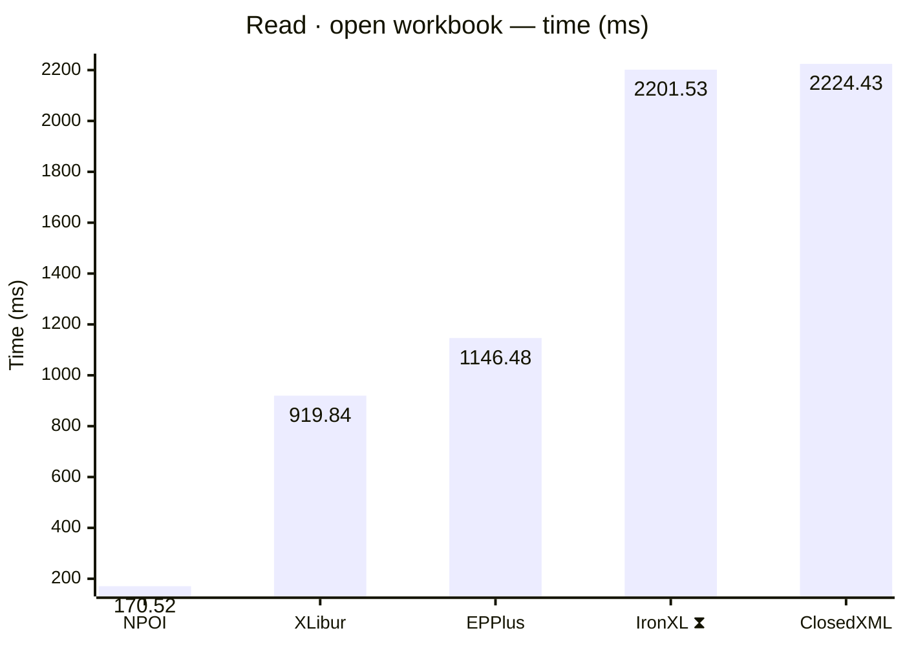
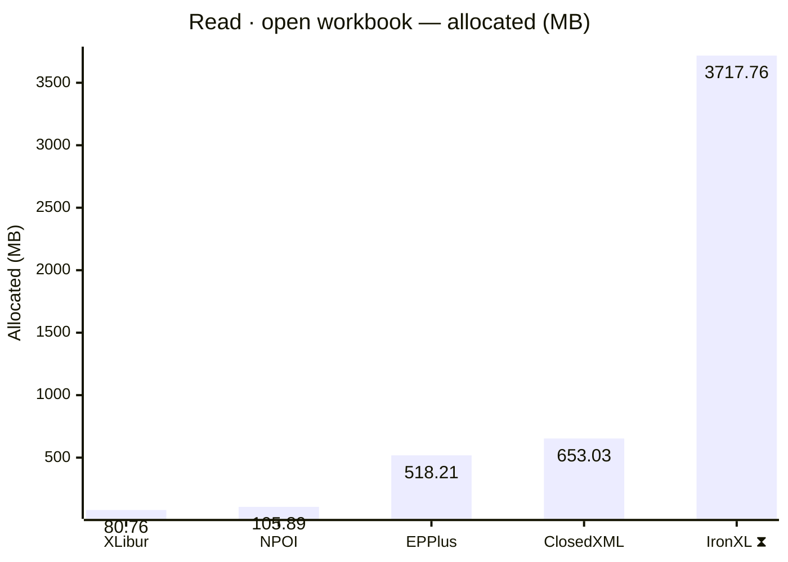
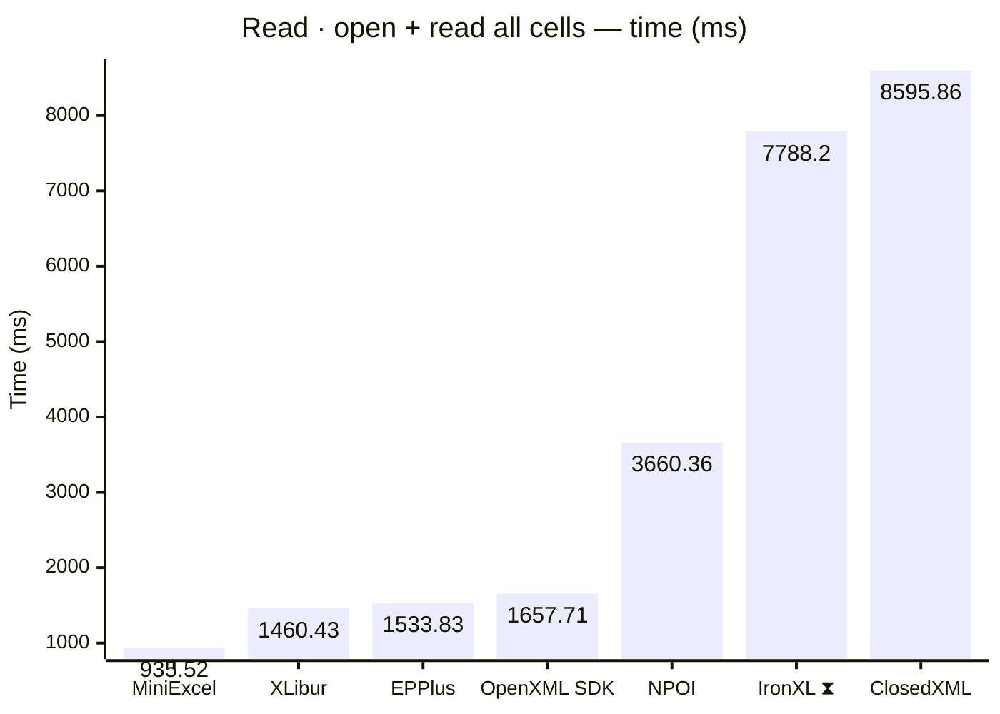
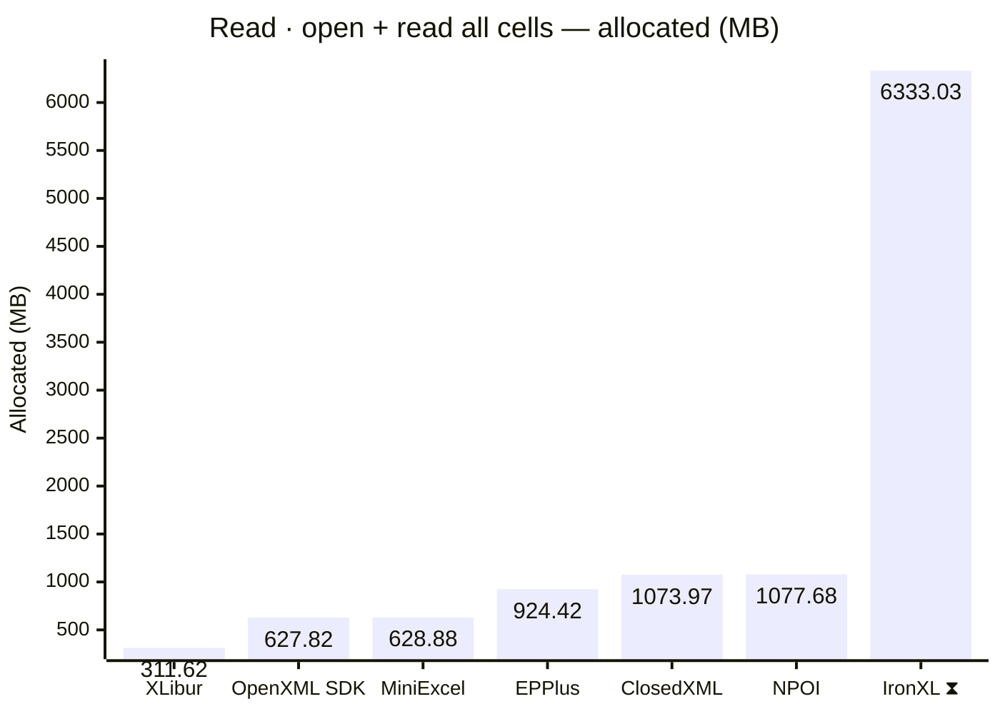
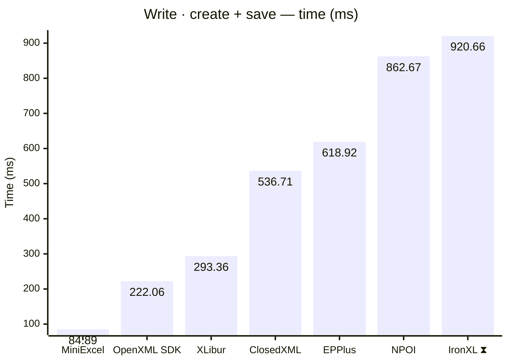
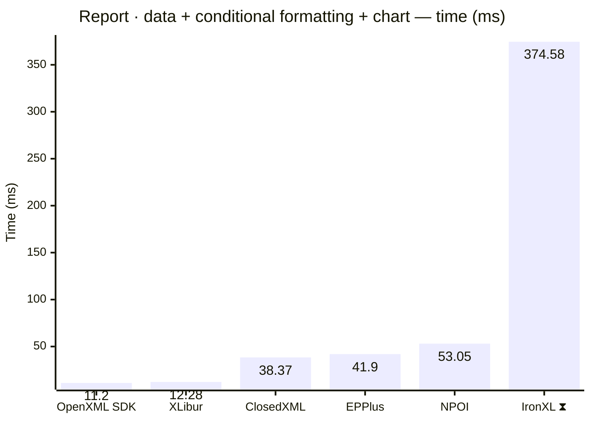
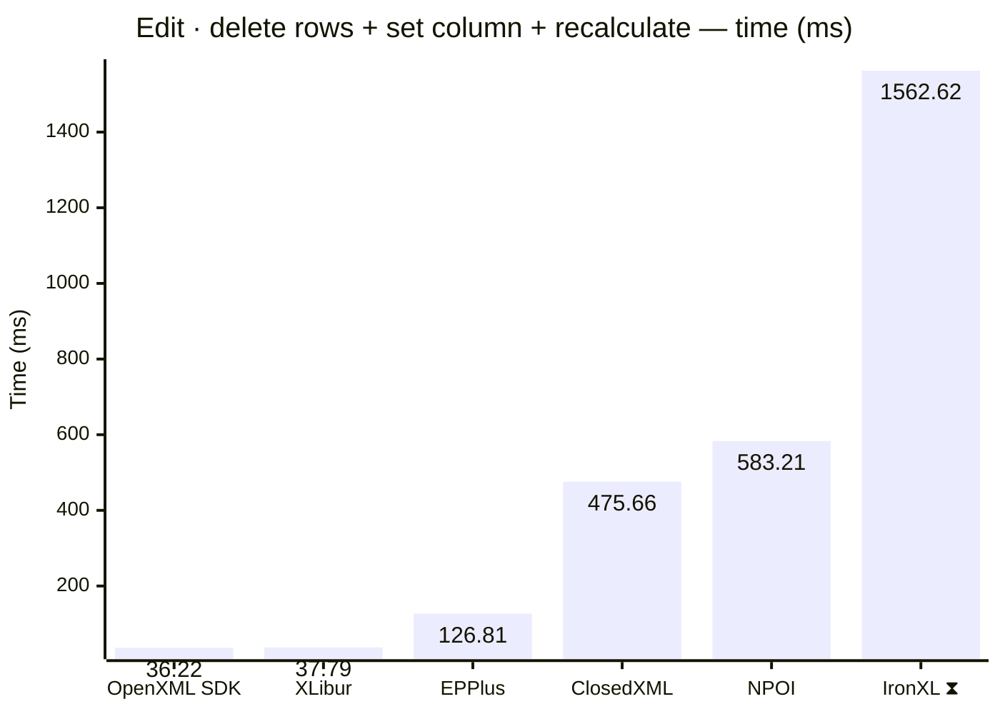
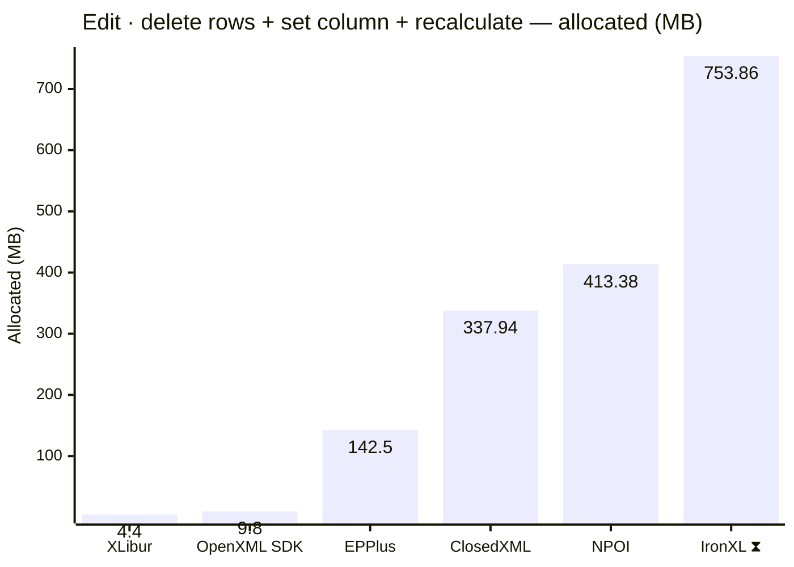

<style>
  .main-content { max-width: 90% !important; padding-left: 2rem !important; padding-right: 2rem !important; }
</style>
<!-- Generated by XLBench. Do not edit by hand; re-run scripts/run-benchmarks.ps1. -->
# XLBench Results

Each section below embeds the full BenchmarkDotNet environment block (OS, CPU,
.NET SDK and runtime). Timings are hardware-specific; treat the allocation/GC
columns as the most portable signal across machines. Regenerate locally with
`scripts/run-benchmarks.ps1`.

> ⚠️ Generated on a shared GitHub Actions runner — timings are indicative and vary run to run; allocation/memory figures are reliable. Authoritative timings come from a local run: [results.html](results.html).

📈 **[Interactive charts](charts.html)** (GitHub Pages). Static charts and the full tables follow.

Each results table (one per test method) is heat-mapped independently on the Pages site (🟩 best → 🟥 worst).

> ⧗ **Carried over from an earlier run.** The rows and chart points below marked with this symbol were not measured here — the library is commercial and needs a licence key this run did not have — so they are replayed from `snapshots/`. Compare them as indicative rather than like-for-like, and see the repository README for how to refresh a snapshot.
>
> - **IronXL** 2026.8.1, Job-HTCPYF job, captured 2026-08-01 on different hardware — Windows 11 (10.0.22631.6199/23H2/2023Update/SunValley3), AMD Ryzen 9 5950X 16-Core Processor.

## Libraries under test

| Library | Version | Source |
| --- | --- | --- |
| ClosedXML | 0.105.1 | this run |
| EPPlus | 8.6.3 | this run |
| OpenXML SDK | 3.5.1 | this run |
| NPOI | 2.8.0 | this run |
| MiniExcel | 1.45.0 | this run |
| XLibur | 0.300.0 | this run |
| IronXL ⧗ | 2026.8.1 | snapshot (2026.8.1, Job-HTCPYF, captured 2026-08-01) |

## Comparison charts

_Lower is better. Charts render in the GitHub file view; the Pages site has interactive versions._



















## Detailed results


```

BenchmarkDotNet v0.15.8, Linux Ubuntu 24.04.4 LTS (Noble Numbat)
AMD EPYC 7763 3.14GHz, 1 CPU, 4 logical and 2 physical cores
.NET SDK 10.0.302
  [Host]   : .NET 10.0.10 (10.0.10, 10.0.1026.32716), X64 RyuJIT x86-64-v3
  ShortRun : .NET 10.0.10 (10.0.10, 10.0.1026.32716), X64 RyuJIT x86-64-v3

Job=ShortRun  IterationCount=3  LaunchCount=1  
WarmupCount=3  

```

### Read · open workbook

| Library     | Type                      | Method             | Mean        | Error        | StdDev     | Gen0       | Gen1       | Gen2      | Allocated  |
|------------ |-------------------------- |------------------- |------------:|-------------:|-----------:|-----------:|-----------:|----------:|-----------:|
| NPOI        | NpoiReadBenchmarks        | OpenWorkbook       |   170.52 ms |    86.884 ms |   4.762 ms |  2000.0000 |  1666.6667 |  666.6667 |  105.89 MB |
| XLibur      | XLiburReadBenchmarks      | OpenWorkbook       |   919.84 ms |   144.924 ms |   7.944 ms |  5000.0000 |  4000.0000 | 1000.0000 |   80.76 MB |
| EPPlus      | EpPlusReadBenchmarks      | OpenWorkbook       | 1,146.48 ms |   111.155 ms |   6.093 ms | 23000.0000 | 11000.0000 | 6000.0000 |  518.21 MB |
| IronXL ⧗ | IronXlReadBenchmarks | OpenWorkbook | 2,201.535 ms | 37.5704 ms | 16.6815 ms | 235000.0000 | 67000.0000 | 7000.0000 | 3717.76 MB |
| ClosedXML   | ClosedXmlReadBenchmarks   | OpenWorkbook       | 2,224.43 ms |    91.437 ms |   5.012 ms | 41000.0000 | 14000.0000 | 2000.0000 |  653.03 MB |

### Read · open + read all cells

| Library     | Type                      | Method             | Mean        | Error        | StdDev     | Gen0       | Gen1       | Gen2      | Allocated  |
|------------ |-------------------------- |------------------- |------------:|-------------:|-----------:|-----------:|-----------:|----------:|-----------:|
| MiniExcel   | MiniExcelReadBenchmarks   | OpenAndReadAll     |   935.52 ms |    82.014 ms |   4.495 ms | 38000.0000 |  3000.0000 |         - |  628.88 MB |
| XLibur      | XLiburReadBenchmarks      | OpenAndReadAll     | 1,460.43 ms |    79.046 ms |   4.333 ms | 15000.0000 | 12000.0000 | 3000.0000 |  311.62 MB |
| EPPlus      | EpPlusReadBenchmarks      | OpenAndReadAll     | 1,533.83 ms |    85.871 ms |   4.707 ms | 49000.0000 | 14000.0000 | 7000.0000 |  924.42 MB |
| OpenXML SDK | OpenXmlReadBenchmarks     | OpenAndReadAll     | 1,657.71 ms |   111.987 ms |   6.138 ms | 40000.0000 |  6000.0000 | 1000.0000 |  627.82 MB |
| NPOI        | NpoiReadBenchmarks        | OpenAndReadAll     | 3,660.36 ms | 4,751.046 ms | 260.421 ms | 67000.0000 | 62000.0000 | 6000.0000 | 1077.68 MB |
| IronXL ⧗ | IronXlReadBenchmarks | OpenAndReadAll | 7,788.195 ms | 256.7315 ms | 169.8120 ms | 393000.0000 | 202000.0000 | 10000.0000 | 6333.03 MB |
| ClosedXML   | ClosedXmlReadBenchmarks   | OpenAndReadAll     | 8,595.86 ms |   374.582 ms |  20.532 ms | 60000.0000 | 24000.0000 | 4000.0000 | 1073.97 MB |

### Write · create + save

| Library     | Type                      | Method             | Mean        | Error        | StdDev     | Gen0       | Gen1       | Gen2      | Allocated  |
|------------ |-------------------------- |------------------- |------------:|-------------:|-----------:|-----------:|-----------:|----------:|-----------:|
| MiniExcel   | MiniExcelWriteBenchmarks  | CreateAndSave      |    84.89 ms |    11.390 ms |   0.624 ms |  5500.0000 |  1666.6667 | 1500.0000 |   84.59 MB |
| OpenXML SDK | OpenXmlWriteBenchmarks    | CreateAndSave      |   222.06 ms |    14.124 ms |   0.774 ms |  9000.0000 |  2333.3333 | 2333.3333 |  134.19 MB |
| XLibur      | XLiburWriteBenchmarks     | CreateAndSave      |   293.36 ms |    29.482 ms |   1.616 ms |  3000.0000 |  2000.0000 | 2000.0000 |   60.51 MB |
| ClosedXML   | ClosedXmlWriteBenchmarks  | CreateAndSave      |   536.71 ms |   108.925 ms |   5.971 ms | 11000.0000 |  6000.0000 | 3000.0000 |  181.09 MB |
| EPPlus      | EpPlusWriteBenchmarks     | CreateAndSave      |   618.92 ms |    55.518 ms |   3.043 ms | 20000.0000 |  9000.0000 | 3000.0000 |  322.57 MB |
| NPOI        | NpoiWriteBenchmarks       | CreateAndSave      |   862.67 ms |    18.896 ms |   1.036 ms | 16000.0000 | 12000.0000 | 3000.0000 |  247.26 MB |
| IronXL ⧗ | IronXlWriteBenchmarks | CreateAndSave | 920.655 ms | 65.9367 ms | 43.6131 ms | 48000.0000 | 16000.0000 | 3000.0000 | 797.63 MB |

### Report · data + conditional formatting + chart

| Library     | Type                      | Method             | Mean        | Error        | StdDev     | Gen0       | Gen1       | Gen2      | Allocated  |
|------------ |-------------------------- |------------------- |------------:|-------------:|-----------:|-----------:|-----------:|----------:|-----------:|
| OpenXML SDK | OpenXmlReportBenchmarks   | CreateStockReport  |    11.20 ms |     0.673 ms |   0.037 ms |   375.0000 |   359.3750 |  187.5000 |    4.92 MB |
| XLibur      | XLiburReportBenchmarks    | CreateStockReport  |    12.28 ms |     3.913 ms |   0.214 ms |   187.5000 |   187.5000 |  187.5000 |    3.48 MB |
| ClosedXML   | ClosedXmlReportBenchmarks | CreateStockReport  |    38.37 ms |   117.645 ms |   6.449 ms |   400.0000 |          - |         - |    8.02 MB |
| EPPlus      | EpPlusReportBenchmarks    | CreateStockReport  |    41.90 ms |    70.454 ms |   3.862 ms |  1000.0000 |  1000.0000 | 1000.0000 |   13.96 MB |
| NPOI        | NpoiReportBenchmarks      | CreateStockReport  |    53.05 ms |   200.058 ms |  10.966 ms |   833.3333 |   666.6667 |  333.3333 |   16.27 MB |
| IronXL ⧗ | IronXlReportBenchmarks | CreateStockReport | 374.579 ms | 38.1427 ms | 19.9494 ms | 14000.0000 | 3000.0000 | - | 237.38 MB |

### Edit · delete rows + set column + recalculate

| Library     | Type                      | Method             | Mean        | Error        | StdDev     | Gen0       | Gen1       | Gen2      | Allocated  |
|------------ |-------------------------- |------------------- |------------:|-------------:|-----------:|-----------:|-----------:|----------:|-----------:|
| OpenXML SDK | OpenXmlEditBenchmarks     | EditAndRecalculate |    36.22 ms |    14.948 ms |   0.819 ms |   400.0000 |   200.0000 |         - |     9.8 MB |
| XLibur      | XLiburEditBenchmarks      | EditAndRecalculate |    37.79 ms |    42.314 ms |   2.319 ms |   142.8571 |          - |         - |     4.4 MB |
| EPPlus      | EpPlusEditBenchmarks      | EditAndRecalculate |   126.81 ms |    47.575 ms |   2.608 ms |  9000.0000 |  1250.0000 | 1000.0000 |   142.5 MB |
| ClosedXML   | ClosedXmlEditBenchmarks   | EditAndRecalculate |   475.66 ms |    28.725 ms |   1.574 ms | 21000.0000 |  1000.0000 |         - |  337.94 MB |
| NPOI        | NpoiEditBenchmarks        | EditAndRecalculate |   583.21 ms |    74.677 ms |   4.093 ms | 25000.0000 |  1000.0000 |         - |  413.38 MB |
| IronXL ⧗ | IronXlEditBenchmarks | EditAndRecalculate | 1,562.616 ms | 46.5205 ms | 27.6836 ms | 57000.0000 | 36000.0000 | 15000.0000 | 753.86 MB |


<script type="module">
  import mermaid from 'https://cdn.jsdelivr.net/npm/mermaid@11/dist/mermaid.esm.min.mjs';
  const blocks = document.querySelectorAll('.language-mermaid');
  blocks.forEach(el => {
    const code = el.querySelector('code') || el;
    const pre = document.createElement('pre');
    pre.className = 'mermaid';
    pre.textContent = code.textContent;
    el.replaceWith(pre);
  });
  if (blocks.length) {
    mermaid.initialize({ startOnLoad: false });
    await mermaid.run({ querySelector: 'pre.mermaid' });
  }
</script>

<script>
(function () {
  const parse = s => { const n = parseFloat(String(s).replace(/,/g, '')); return Number.isFinite(n) ? n : null; };
  document.querySelectorAll('table').forEach(table => {
    if (!table.tHead || !table.tBodies[0]) return;
    const heads = [...table.tHead.rows[0].cells].map(c => c.textContent.trim().toLowerCase());
    if (!heads.includes('mean')) return;
    const metricCols = heads.map((h, i) => /^(mean|allocated|gen0|gen1|gen2)$/.test(h) ? i : -1).filter(i => i >= 0);
    const rows = [...table.tBodies[0].rows];
    for (const c of metricCols) {
      const vals = rows.map(r => parse(r.cells[c]?.textContent));
      const nums = vals.filter(v => v !== null);
      if (nums.length < 2) continue;
      const min = Math.min(...nums), max = Math.max(...nums);
      if (max === min) continue;
      rows.forEach((r, i) => {
        const v = vals[i]; if (v === null) return;
        const ratio = (v - min) / (max - min);
        r.cells[c].style.backgroundColor = `hsla(${120 - 120 * ratio}, 70%, 50%, 0.45)`;
      });
    }
  });
})();
</script>
