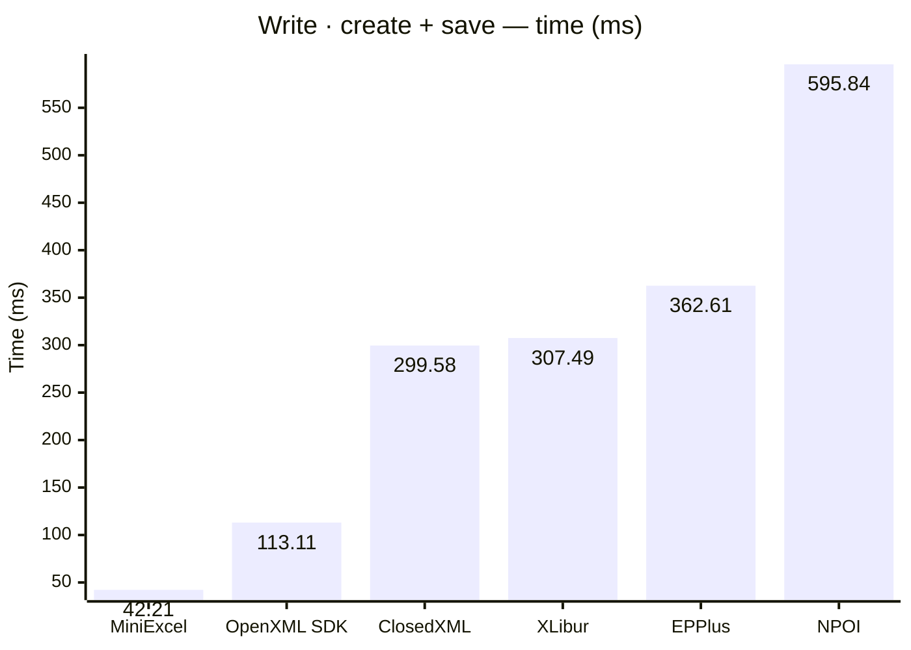
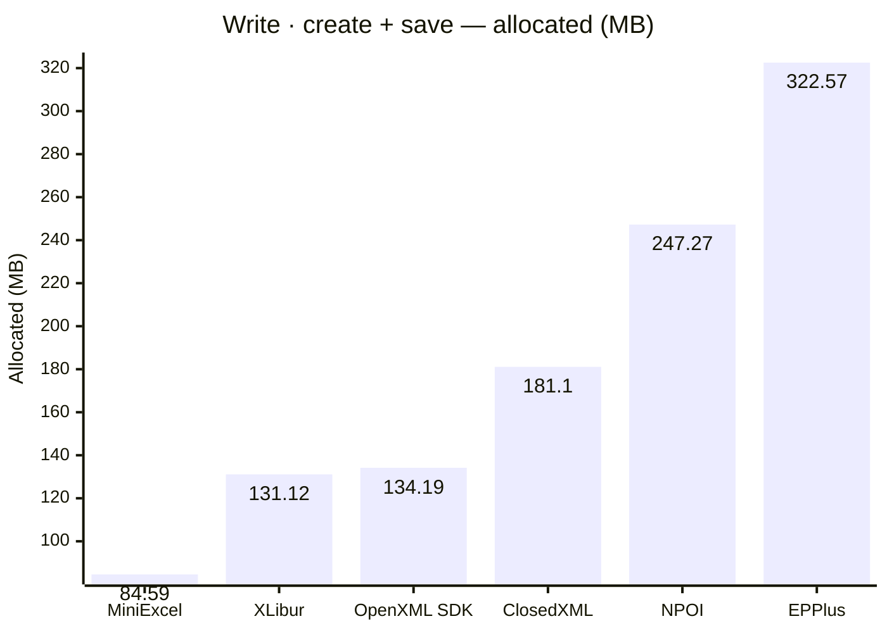

<style>
  .main-content { max-width: 90% !important; padding-left: 2rem !important; padding-right: 2rem !important; }
</style>
<!-- Generated by XLBench. Do not edit by hand; re-run scripts/run-benchmarks.ps1. -->
# XLBench Results

Each section below embeds the full BenchmarkDotNet environment block (OS, CPU,
.NET SDK and runtime). Timings are hardware-specific; treat the allocation/GC
columns as the most portable signal across machines. Regenerate locally with
`scripts/run-benchmarks.ps1`.

> ⚠️ Generated on a shared GitHub Actions runner — timings are indicative and vary run to run; allocation/memory figures are reliable. Authoritative timings come from a local run: [results.html](results.html).

📈 **[Interactive charts](charts.html)** (GitHub Pages). Static charts and the full tables follow.

Each results table (one per test method) is heat-mapped independently on the Pages site (🟩 best → 🟥 worst).

## Libraries under test

| Library | Version |
| --- | --- |
| ClosedXML | 0.105.0 |
| EPPlus | 8.6.2 |
| OpenXML SDK | 3.5.1 |
| NPOI | 2.8.0 |
| MiniExcel | 1.45.0 |
| XLibur | 0.105.1-rc.137 |

## Comparison charts

_Lower is better. Charts render in the GitHub file view; the Pages site has interactive versions._





## Detailed results


```

BenchmarkDotNet v0.15.8, Linux Ubuntu 24.04.4 LTS (Noble Numbat)
AMD EPYC 9V45 4.43GHz, 1 CPU, 4 logical and 2 physical cores
.NET SDK 10.0.302
  [Host]   : .NET 10.0.10 (10.0.10, 10.0.1026.32716), X64 RyuJIT x86-64-v4
  ShortRun : .NET 10.0.10 (10.0.10, 10.0.1026.32716), X64 RyuJIT x86-64-v4

Job=ShortRun  IterationCount=3  LaunchCount=1  
WarmupCount=3  

```

### Write · create + save

| Library     | Type                     | Method        | Mean      | Error      | StdDev    | Gen0       | Gen1       | Gen2      | Allocated |
|------------ |------------------------- |-------------- |----------:|-----------:|----------:|-----------:|-----------:|----------:|----------:|
| MiniExcel   | MiniExcelWriteBenchmarks | CreateAndSave |  42.21 ms |   1.764 ms |  0.097 ms |  5250.0000 |  1250.0000 | 1166.6667 |  84.59 MB |
| OpenXML SDK | OpenXmlWriteBenchmarks   | CreateAndSave | 113.11 ms |  29.786 ms |  1.633 ms |  8600.0000 |  2000.0000 | 2000.0000 | 134.19 MB |
| ClosedXML   | ClosedXmlWriteBenchmarks | CreateAndSave | 299.58 ms |  70.147 ms |  3.845 ms | 11000.0000 |  6000.0000 | 3000.0000 |  181.1 MB |
| XLibur      | XLiburWriteBenchmarks    | CreateAndSave | 307.49 ms | 385.450 ms | 21.128 ms |  7000.0000 |  3000.0000 | 2000.0000 | 131.12 MB |
| EPPlus      | EpPlusWriteBenchmarks    | CreateAndSave | 362.61 ms |  77.875 ms |  4.269 ms | 20000.0000 |  9000.0000 | 3000.0000 | 322.57 MB |
| NPOI        | NpoiWriteBenchmarks      | CreateAndSave | 595.84 ms |  80.685 ms |  4.423 ms | 16000.0000 | 12000.0000 | 3000.0000 | 247.27 MB |


<script type="module">
  import mermaid from 'https://cdn.jsdelivr.net/npm/mermaid@11/dist/mermaid.esm.min.mjs';
  const blocks = document.querySelectorAll('.language-mermaid');
  blocks.forEach(el => {
    const code = el.querySelector('code') || el;
    const pre = document.createElement('pre');
    pre.className = 'mermaid';
    pre.textContent = code.textContent;
    el.replaceWith(pre);
  });
  if (blocks.length) {
    mermaid.initialize({ startOnLoad: false });
    await mermaid.run({ querySelector: 'pre.mermaid' });
  }
</script>

<script>
(function () {
  const parse = s => { const n = parseFloat(String(s).replace(/,/g, '')); return Number.isFinite(n) ? n : null; };
  document.querySelectorAll('table').forEach(table => {
    if (!table.tHead || !table.tBodies[0]) return;
    const heads = [...table.tHead.rows[0].cells].map(c => c.textContent.trim().toLowerCase());
    if (!heads.includes('mean')) return;
    const metricCols = heads.map((h, i) => /^(mean|allocated|gen0|gen1|gen2)$/.test(h) ? i : -1).filter(i => i >= 0);
    const rows = [...table.tBodies[0].rows];
    for (const c of metricCols) {
      const vals = rows.map(r => parse(r.cells[c]?.textContent));
      const nums = vals.filter(v => v !== null);
      if (nums.length < 2) continue;
      const min = Math.min(...nums), max = Math.max(...nums);
      if (max === min) continue;
      rows.forEach((r, i) => {
        const v = vals[i]; if (v === null) return;
        const ratio = (v - min) / (max - min);
        r.cells[c].style.backgroundColor = `hsla(${120 - 120 * ratio}, 70%, 50%, 0.45)`;
      });
    }
  });
})();
</script>
