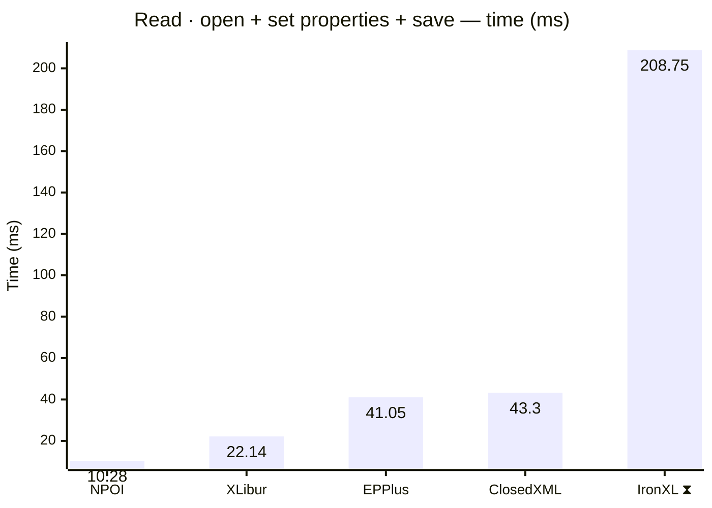
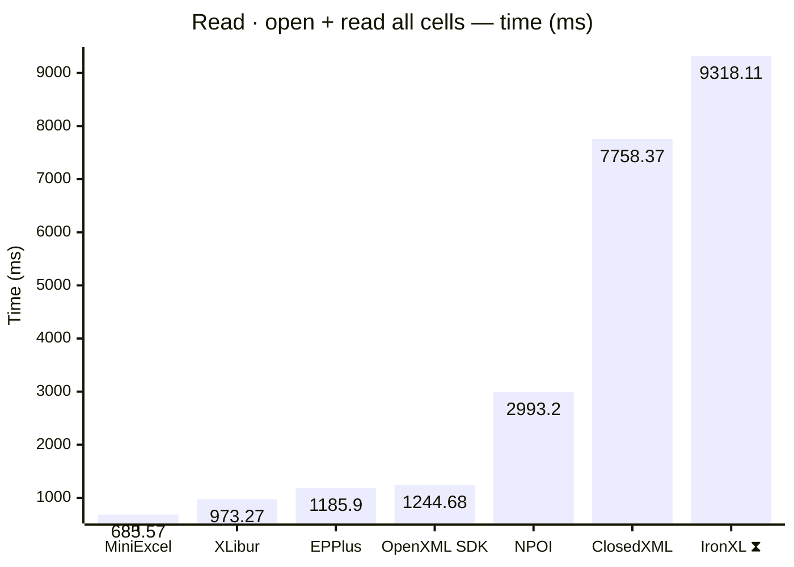
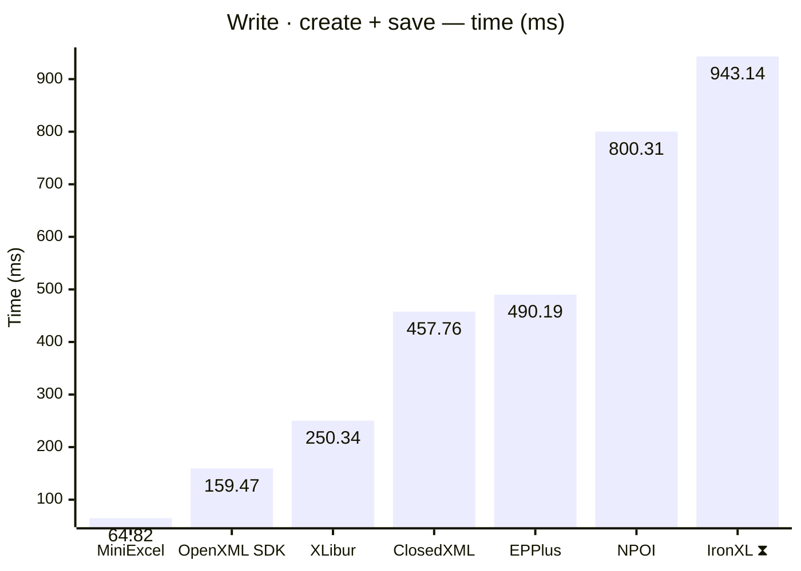
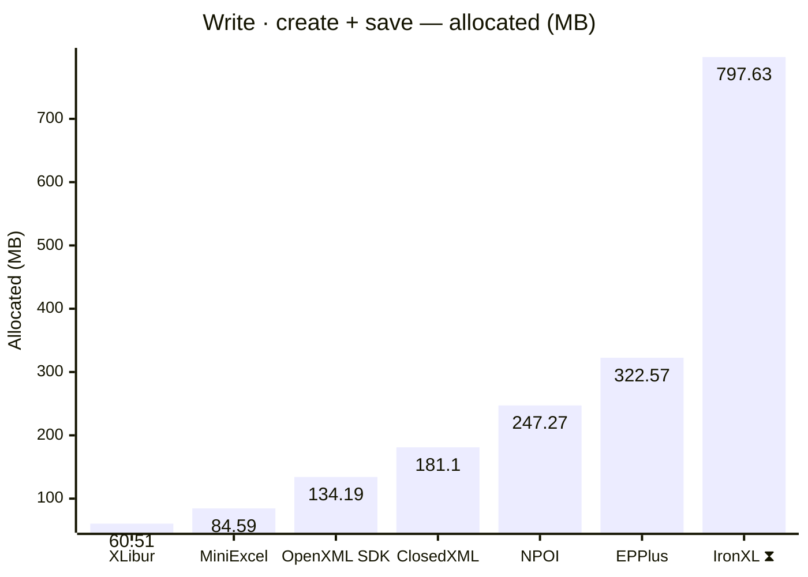
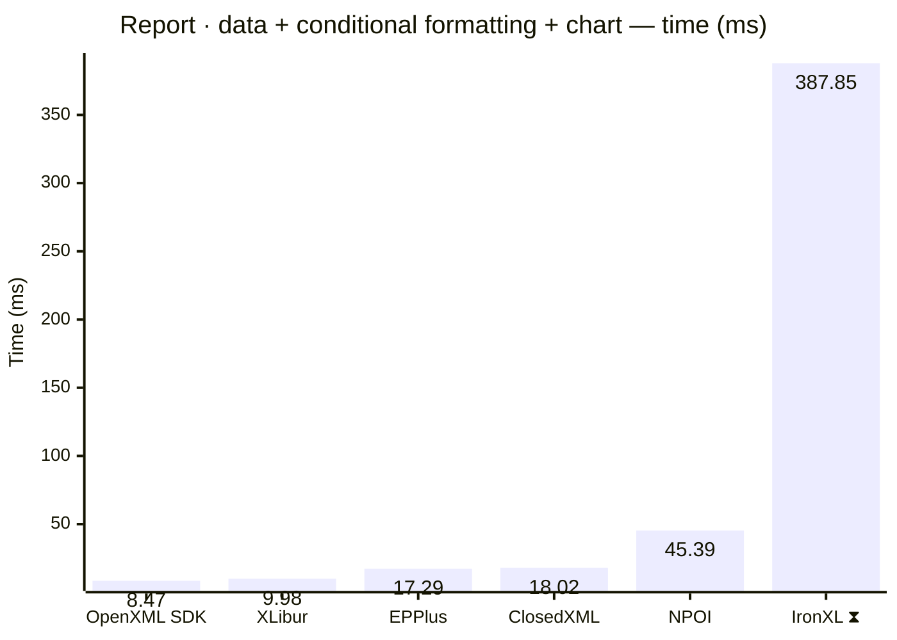
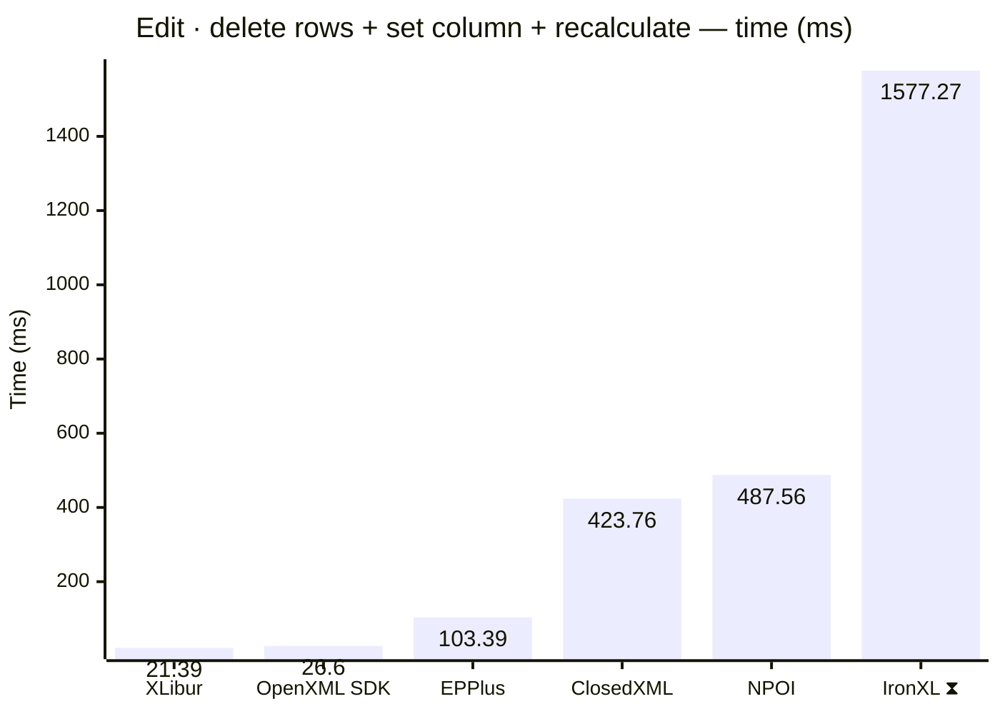
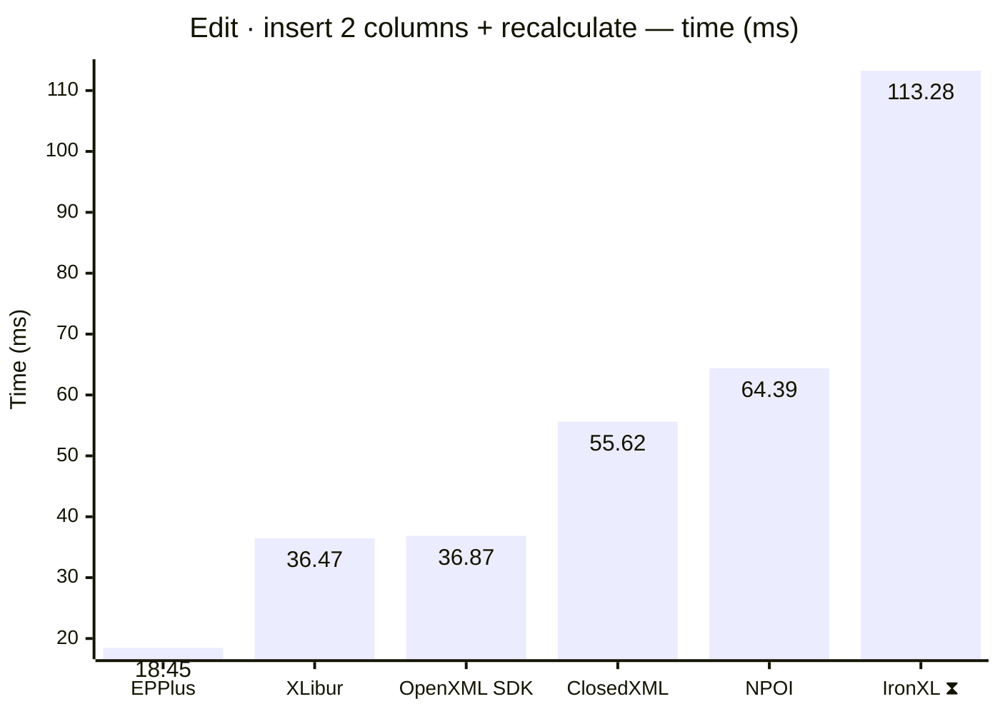

<style>
  .main-content { max-width: 90% !important; padding-left: 2rem !important; padding-right: 2rem !important; }
</style>
<!-- Generated by XLBench. Do not edit by hand; re-run scripts/run-benchmarks.ps1. -->
# XLBench Results

Each section below embeds the full BenchmarkDotNet environment block (OS, CPU,
.NET SDK and runtime). Timings are hardware-specific; treat the allocation/GC
columns as the most portable signal across machines. Regenerate locally with
`scripts/run-benchmarks.ps1`.

> ⚠️ Generated on a shared GitHub Actions runner — timings are indicative and vary run to run; allocation/memory figures are reliable. Authoritative timings come from a local run: [results.html](results.html).

📈 **[Interactive charts](charts.html)** (GitHub Pages). Static charts and the full tables follow.

Each results table (one per test method) is heat-mapped independently on the Pages site (🟩 best → 🟥 worst).

> ⧗ **Carried over from an earlier run.** The rows and chart points below marked with this symbol were not measured here — the library is commercial and needs a licence key this run did not have — so they are replayed from `snapshots/`. Compare them as indicative rather than like-for-like, and see the repository README for how to refresh a snapshot.
>
> - **IronXL** 2026.8.1, Job-HTCPYF job, captured 2026-08-03 on different hardware — Windows 11 (10.0.22631.6199/23H2/2023Update/SunValley3), AMD Ryzen 9 5950X 16-Core Processor.

## Libraries under test

| Library | Version | Source |
| --- | --- | --- |
| ClosedXML | 0.105.1 | this run |
| EPPlus | 8.6.3 | this run |
| OpenXML SDK | 3.5.1 | this run |
| NPOI | 2.8.0 | this run |
| MiniExcel | 1.45.0 | this run |
| XLibur | 0.310.1-beta.5 | this run |
| IronXL ⧗ | 2026.8.1 | snapshot (2026.8.1, Job-HTCPYF, captured 2026-08-03) |

## Comparison charts

_Lower is better. Charts render in the GitHub file view; the Pages site has interactive versions._




















## Detailed results


```

BenchmarkDotNet v0.15.8, Linux Ubuntu 24.04.4 LTS (Noble Numbat)
AMD EPYC 9V74 3.66GHz, 1 CPU, 4 logical and 2 physical cores
.NET SDK 10.0.302
  [Host]   : .NET 10.0.10 (10.0.10, 10.0.1026.32716), X64 RyuJIT x86-64-v4
  ShortRun : .NET 10.0.10 (10.0.10, 10.0.1026.32716), X64 RyuJIT x86-64-v4

Job=ShortRun  IterationCount=3  LaunchCount=1  
WarmupCount=3  

```

### Read · open + set properties + save

| Library     | Type                      | Method                      | Mean         | Error         | StdDev      | Median       | Gen0       | Gen1       | Gen2      | Allocated  |
|------------ |-------------------------- |---------------------------- |-------------:|--------------:|------------:|-------------:|-----------:|-----------:|----------:|-----------:|
| NPOI        | NpoiReadBenchmarks        | OpenAmendPropertiesAndSave  |    10.284 ms |     2.5197 ms |   0.1381 ms |    10.272 ms |    62.5000 |          - |         - |    1.89 MB |
| XLibur      | XLiburReadBenchmarks      | OpenAmendPropertiesAndSave  |    22.139 ms |   158.4172 ms |   8.6834 ms |    17.700 ms |          - |          - |         - |    1.72 MB |
| EPPlus      | EpPlusReadBenchmarks      | OpenAmendPropertiesAndSave  |    41.048 ms |    49.9627 ms |   2.7386 ms |    39.924 ms |  1000.0000 |  1000.0000 | 1000.0000 |   14.03 MB |
| ClosedXML   | ClosedXmlReadBenchmarks   | OpenAmendPropertiesAndSave  |    43.305 ms |    73.8169 ms |   4.0462 ms |    41.756 ms |   800.0000 |   400.0000 |         - |   13.17 MB |
| IronXL ⧗ | IronXlReadBenchmarks | OpenAmendPropertiesAndSave | 208.746 ms | 155.7570 ms | 92.6885 ms | 168.705 ms | 9000.0000 | 2000.0000 | - | 152.81 MB |

### Read · open + read all cells

| Library     | Type                      | Method                      | Mean         | Error         | StdDev      | Median       | Gen0       | Gen1       | Gen2      | Allocated  |
|------------ |-------------------------- |---------------------------- |-------------:|--------------:|------------:|-------------:|-----------:|-----------:|----------:|-----------:|
| MiniExcel   | MiniExcelReadBenchmarks   | OpenAndReadAll              |   685.570 ms |   120.7686 ms |   6.6197 ms |   685.844 ms | 38000.0000 |  3000.0000 |         - |  628.88 MB |
| XLibur      | XLiburReadBenchmarks      | OpenAndReadAll              |   973.268 ms |   100.4623 ms |   5.5067 ms |   974.339 ms | 13000.0000 |  8000.0000 | 2000.0000 |  192.91 MB |
| EPPlus      | EpPlusReadBenchmarks      | OpenAndReadAll              | 1,185.902 ms |   131.3608 ms |   7.2003 ms | 1,186.704 ms | 49000.0000 | 14000.0000 | 7000.0000 |  924.42 MB |
| OpenXML SDK | OpenXmlReadBenchmarks     | OpenAndReadAll              | 1,244.680 ms | 1,241.6525 ms |  68.0592 ms | 1,222.181 ms | 40000.0000 |  6000.0000 | 1000.0000 |  627.82 MB |
| NPOI        | NpoiReadBenchmarks        | OpenAndReadAll              | 2,993.197 ms | 3,108.1974 ms | 170.3708 ms | 3,087.341 ms | 67000.0000 | 62000.0000 | 6000.0000 | 1077.67 MB |
| ClosedXML   | ClosedXmlReadBenchmarks   | OpenAndReadAll              | 7,758.369 ms |   707.6081 ms |  38.7864 ms | 7,738.797 ms | 60000.0000 | 24000.0000 | 4000.0000 | 1073.97 MB |
| IronXL ⧗ | IronXlReadBenchmarks | OpenAndReadAll | 9,318.107 ms | 477.3336 ms | 315.7266 ms | 9,377.407 ms | 393000.0000 | 202000.0000 | 10000.0000 | 6333.04 MB |

### Write · create + save

| Library     | Type                      | Method                      | Mean         | Error         | StdDev      | Median       | Gen0       | Gen1       | Gen2      | Allocated  |
|------------ |-------------------------- |---------------------------- |-------------:|--------------:|------------:|-------------:|-----------:|-----------:|----------:|-----------:|
| MiniExcel   | MiniExcelWriteBenchmarks  | CreateAndSave               |    64.816 ms |    34.0130 ms |   1.8644 ms |    65.392 ms |  5375.0000 |  1500.0000 | 1375.0000 |   84.59 MB |
| OpenXML SDK | OpenXmlWriteBenchmarks    | CreateAndSave               |   159.466 ms |    31.8251 ms |   1.7444 ms |   158.866 ms |  8750.0000 |  2000.0000 | 2000.0000 |  134.19 MB |
| XLibur      | XLiburWriteBenchmarks     | CreateAndSave               |   250.337 ms |   524.3000 ms |  28.7387 ms |   237.649 ms |  4000.0000 |  3000.0000 | 3000.0000 |   60.51 MB |
| ClosedXML   | ClosedXmlWriteBenchmarks  | CreateAndSave               |   457.763 ms |   263.0917 ms |  14.4209 ms |   461.982 ms | 11000.0000 |  6000.0000 | 3000.0000 |   181.1 MB |
| EPPlus      | EpPlusWriteBenchmarks     | CreateAndSave               |   490.193 ms |    12.2823 ms |   0.6732 ms |   490.420 ms | 20000.0000 |  9000.0000 | 3000.0000 |  322.57 MB |
| NPOI        | NpoiWriteBenchmarks       | CreateAndSave               |   800.306 ms |    25.4688 ms |   1.3960 ms |   800.733 ms | 16000.0000 | 12000.0000 | 3000.0000 |  247.27 MB |
| IronXL ⧗ | IronXlWriteBenchmarks | CreateAndSave | 943.137 ms | 18.5191 ms | 11.0204 ms | 938.999 ms | 48000.0000 | 16000.0000 | 3000.0000 | 797.63 MB |

### Report · data + conditional formatting + chart

| Library     | Type                      | Method                      | Mean         | Error         | StdDev      | Median       | Gen0       | Gen1       | Gen2      | Allocated  |
|------------ |-------------------------- |---------------------------- |-------------:|--------------:|------------:|-------------:|-----------:|-----------:|----------:|-----------:|
| OpenXML SDK | OpenXmlReportBenchmarks   | CreateStockReport           |     8.470 ms |     0.8952 ms |   0.0491 ms |     8.446 ms |   375.0000 |   359.3750 |  187.5000 |    4.92 MB |
| XLibur      | XLiburReportBenchmarks    | CreateStockReport           |     9.978 ms |     6.6566 ms |   0.3649 ms |    10.080 ms |   187.5000 |   187.5000 |  187.5000 |    3.44 MB |
| EPPlus      | EpPlusReportBenchmarks    | CreateStockReport           |    17.288 ms |     3.6380 ms |   0.1994 ms |    17.306 ms |  1000.0000 |  1000.0000 | 1000.0000 |   13.92 MB |
| ClosedXML   | ClosedXmlReportBenchmarks | CreateStockReport           |    18.025 ms |     6.3285 ms |   0.3469 ms |    17.842 ms |   468.7500 |   343.7500 |  187.5000 |    8.01 MB |
| NPOI        | NpoiReportBenchmarks      | CreateStockReport           |    45.385 ms |   152.8625 ms |   8.3789 ms |    42.895 ms |   857.1429 |   714.2857 |  428.5714 |    16.3 MB |
| IronXL ⧗ | IronXlReportBenchmarks | CreateStockReport | 387.849 ms | 36.5456 ms | 24.1726 ms | 384.092 ms | 14000.0000 | 3000.0000 | - | 237.38 MB |

### Edit · delete rows + set column + recalculate

| Library     | Type                      | Method                      | Mean         | Error         | StdDev      | Median       | Gen0       | Gen1       | Gen2      | Allocated  |
|------------ |-------------------------- |---------------------------- |-------------:|--------------:|------------:|-------------:|-----------:|-----------:|----------:|-----------:|
| XLibur      | XLiburEditBenchmarks      | EditAndRecalculate          |    21.387 ms |    32.5879 ms |   1.7863 ms |    22.361 ms |   222.2222 |   111.1111 |         - |    4.25 MB |
| OpenXML SDK | OpenXmlEditBenchmarks     | EditAndRecalculate          |    26.598 ms |     6.1320 ms |   0.3361 ms |    26.482 ms |   718.7500 |   656.2500 |  156.2500 |     9.8 MB |
| EPPlus      | EpPlusEditBenchmarks      | EditAndRecalculate          |   103.394 ms |    54.8432 ms |   3.0061 ms |   103.640 ms |  9000.0000 |  1250.0000 | 1000.0000 |   142.5 MB |
| ClosedXML   | ClosedXmlEditBenchmarks   | EditAndRecalculate          |   423.759 ms |   414.6258 ms |  22.7270 ms |   414.281 ms | 21000.0000 |  1000.0000 |         - |  337.72 MB |
| NPOI        | NpoiEditBenchmarks        | EditAndRecalculate          |   487.560 ms |    99.0172 ms |   5.4275 ms |   490.222 ms | 25000.0000 |  1000.0000 |         - |  413.38 MB |
| IronXL ⧗ | IronXlEditBenchmarks | EditAndRecalculate | 1,577.273 ms | 62.9583 ms | 41.6430 ms | 1,583.098 ms | 57000.0000 | 36000.0000 | 15000.0000 | 753.86 MB |

### Edit · insert 2 columns + recalculate

| Library     | Type                      | Method                      | Mean         | Error         | StdDev      | Median       | Gen0       | Gen1       | Gen2      | Allocated  |
|------------ |-------------------------- |---------------------------- |-------------:|--------------:|------------:|-------------:|-----------:|-----------:|----------:|-----------:|
| EPPlus      | EpPlusInsertBenchmarks    | InsertColumnsAndRecalculate |    18.449 ms |     7.7054 ms |   0.4224 ms |    18.573 ms |  1000.0000 |  1000.0000 | 1000.0000 |   11.41 MB |
| XLibur      | XLiburInsertBenchmarks    | InsertColumnsAndRecalculate |    36.465 ms |   100.7661 ms |   5.5233 ms |    37.557 ms |   250.0000 |   125.0000 |         - |    4.73 MB |
| OpenXML SDK | OpenXmlInsertBenchmarks   | InsertColumnsAndRecalculate |    36.875 ms |    50.4569 ms |   2.7657 ms |    35.913 ms |  1000.0000 |   800.0000 |  400.0000 |   13.05 MB |
| ClosedXML   | ClosedXmlInsertBenchmarks | InsertColumnsAndRecalculate |    55.624 ms |    38.6533 ms |   2.1187 ms |    56.675 ms |   750.0000 |   250.0000 |         - |   13.68 MB |
| NPOI        | NpoiInsertBenchmarks      | InsertColumnsAndRecalculate |    64.390 ms |   205.8802 ms |  11.2850 ms |    61.657 ms |  2000.0000 |  1400.0000 |  600.0000 |   30.75 MB |
| IronXL ⧗ | IronXlInsertBenchmarks | InsertColumnsAndRecalculate | 113.284 ms | 41.9750 ms | 27.7638 ms | 97.052 ms | 7000.0000 | 2500.0000 | 750.0000 | 104.88 MB |


<script type="module">
  import mermaid from 'https://cdn.jsdelivr.net/npm/mermaid@11/dist/mermaid.esm.min.mjs';
  const blocks = document.querySelectorAll('.language-mermaid');
  blocks.forEach(el => {
    const code = el.querySelector('code') || el;
    const pre = document.createElement('pre');
    pre.className = 'mermaid';
    pre.textContent = code.textContent;
    el.replaceWith(pre);
  });
  if (blocks.length) {
    mermaid.initialize({ startOnLoad: false });
    await mermaid.run({ querySelector: 'pre.mermaid' });
  }
</script>

<script>
(function () {
  const parse = s => { const n = parseFloat(String(s).replace(/,/g, '')); return Number.isFinite(n) ? n : null; };
  document.querySelectorAll('table').forEach(table => {
    if (!table.tHead || !table.tBodies[0]) return;
    const heads = [...table.tHead.rows[0].cells].map(c => c.textContent.trim().toLowerCase());
    if (!heads.includes('mean')) return;
    const metricCols = heads.map((h, i) => /^(mean|allocated|gen0|gen1|gen2)$/.test(h) ? i : -1).filter(i => i >= 0);
    const rows = [...table.tBodies[0].rows];
    for (const c of metricCols) {
      const vals = rows.map(r => parse(r.cells[c]?.textContent));
      const nums = vals.filter(v => v !== null);
      if (nums.length < 2) continue;
      const min = Math.min(...nums), max = Math.max(...nums);
      if (max === min) continue;
      rows.forEach((r, i) => {
        const v = vals[i]; if (v === null) return;
        const ratio = (v - min) / (max - min);
        r.cells[c].style.backgroundColor = `hsla(${120 - 120 * ratio}, 70%, 50%, 0.45)`;
      });
    }
  });
})();
</script>
