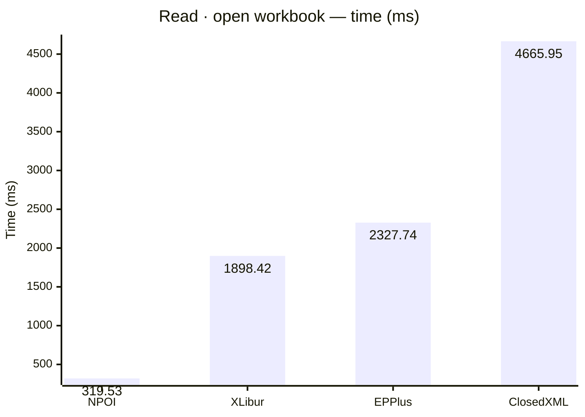
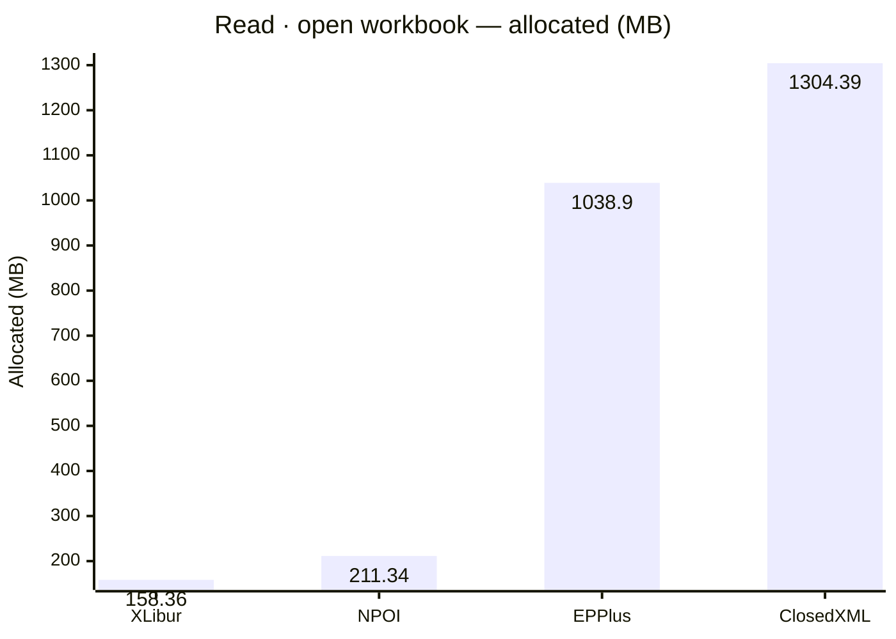
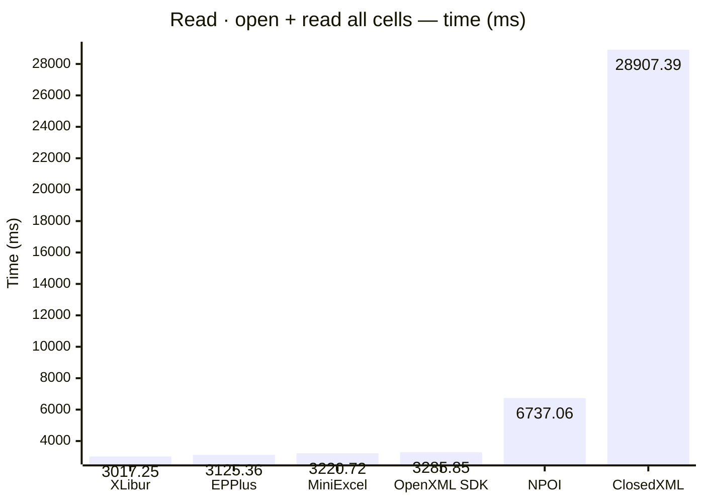
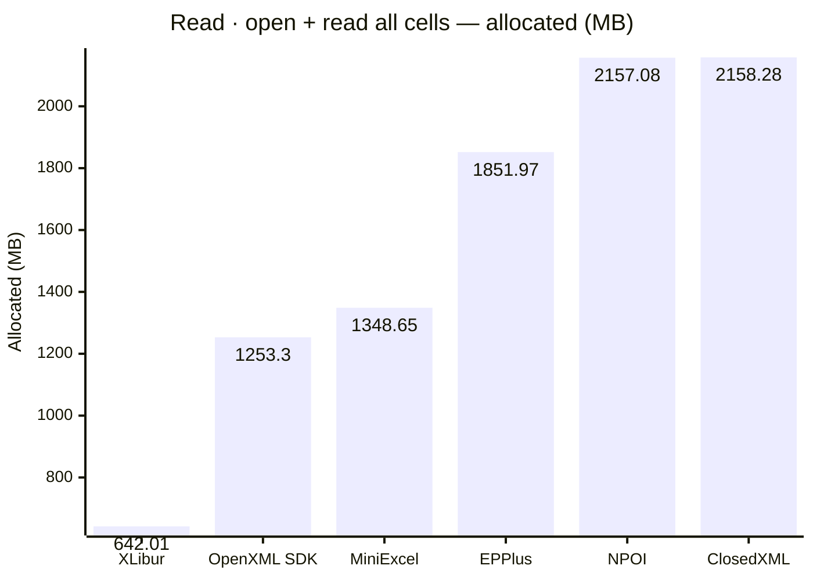
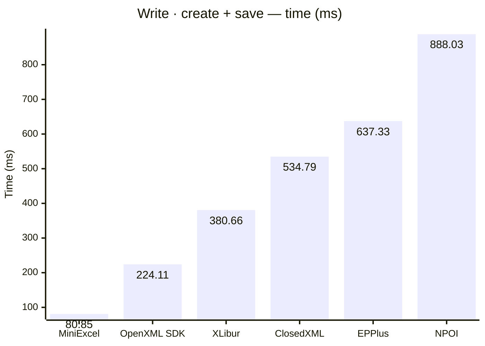
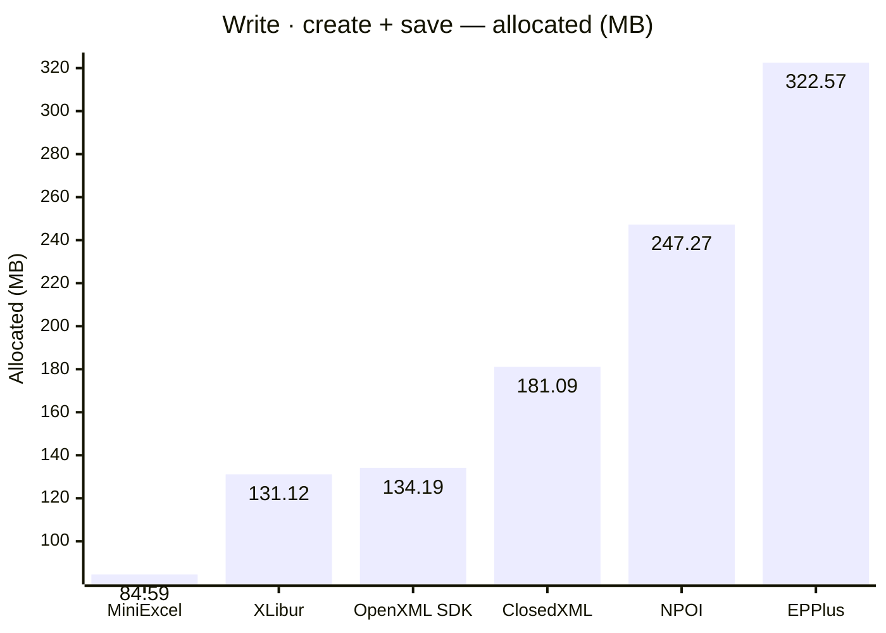

<style>
  .main-content { max-width: 90% !important; padding-left: 2rem !important; padding-right: 2rem !important; }
</style>
<!-- Generated by XLBench. Do not edit by hand; re-run scripts/run-benchmarks.ps1. -->
# XLBench Results

Each section below embeds the full BenchmarkDotNet environment block (OS, CPU,
.NET SDK and runtime). Timings are hardware-specific; treat the allocation/GC
columns as the most portable signal across machines. Regenerate locally with
`scripts/run-benchmarks.ps1`.

> ⚠️ Generated on a shared GitHub Actions runner — timings are indicative and vary run to run; allocation/memory figures are reliable. Authoritative timings come from a local run: [results.html](results.html).

📈 **[Interactive charts](charts.html)** (GitHub Pages). Static charts and the full tables follow.

Each results table (one per test method) is heat-mapped independently on the Pages site (🟩 best → 🟥 worst).

## Libraries under test

| Library | Version |
| --- | --- |
| ClosedXML | 0.105.0 |
| EPPlus | 8.6.3 |
| OpenXML SDK | 3.5.1 |
| NPOI | 2.8.0 |
| MiniExcel | 1.45.0 |
| XLibur | 0.106.0 |

## Comparison charts

_Lower is better. Charts render in the GitHub file view; the Pages site has interactive versions._













## Detailed results


```

BenchmarkDotNet v0.15.8, Linux Ubuntu 24.04.4 LTS (Noble Numbat)
AMD EPYC 7763 3.24GHz, 1 CPU, 4 logical and 2 physical cores
.NET SDK 10.0.302
  [Host]   : .NET 10.0.10 (10.0.10, 10.0.1026.32716), X64 RyuJIT x86-64-v3
  ShortRun : .NET 10.0.10 (10.0.10, 10.0.1026.32716), X64 RyuJIT x86-64-v3

Job=ShortRun  IterationCount=3  LaunchCount=1  
WarmupCount=3  

```

### Read · open workbook

| Library     | Type                     | Method         | Mean         | Error        | StdDev     | Gen0        | Gen1        | Gen2      | Allocated  |
|------------ |------------------------- |--------------- |-------------:|-------------:|-----------:|------------:|------------:|----------:|-----------:|
| NPOI        | NpoiReadBenchmarks       | OpenWorkbook   |    319.53 ms |   156.238 ms |   8.564 ms |   3000.0000 |   2000.0000 | 1000.0000 |  211.34 MB |
| XLibur      | XLiburReadBenchmarks     | OpenWorkbook   |  1,898.42 ms |   120.482 ms |   6.604 ms |  10000.0000 |   8000.0000 | 2000.0000 |  158.36 MB |
| EPPlus      | EpPlusReadBenchmarks     | OpenWorkbook   |  2,327.74 ms |   313.102 ms |  17.162 ms |  41000.0000 |  17000.0000 | 7000.0000 |  1038.9 MB |
| ClosedXML   | ClosedXmlReadBenchmarks  | OpenWorkbook   |  4,665.95 ms |   345.617 ms |  18.944 ms |  81000.0000 |  26000.0000 | 3000.0000 | 1304.39 MB |

### Read · open + read all cells

| Library     | Type                     | Method         | Mean         | Error        | StdDev     | Gen0        | Gen1        | Gen2      | Allocated  |
|------------ |------------------------- |--------------- |-------------:|-------------:|-----------:|------------:|------------:|----------:|-----------:|
| XLibur      | XLiburReadBenchmarks     | OpenAndReadAll |  3,017.25 ms |   709.521 ms |  38.891 ms |  28000.0000 |  20000.0000 | 4000.0000 |  642.01 MB |
| EPPlus      | EpPlusReadBenchmarks     | OpenAndReadAll |  3,125.36 ms |   207.708 ms |  11.385 ms |  92000.0000 |  18000.0000 | 7000.0000 | 1851.97 MB |
| MiniExcel   | MiniExcelReadBenchmarks  | OpenAndReadAll |  3,220.72 ms |   274.309 ms |  15.036 ms |  84000.0000 |   1000.0000 |         - | 1348.65 MB |
| OpenXML SDK | OpenXmlReadBenchmarks    | OpenAndReadAll |  3,285.85 ms |   656.778 ms |  36.000 ms |  80000.0000 |  10000.0000 | 2000.0000 |  1253.3 MB |
| NPOI        | NpoiReadBenchmarks       | OpenAndReadAll |  6,737.06 ms | 8,686.504 ms | 476.137 ms | 130000.0000 | 120000.0000 | 7000.0000 | 2157.08 MB |
| ClosedXML   | ClosedXmlReadBenchmarks  | OpenAndReadAll | 28,907.39 ms |   403.872 ms |  22.138 ms | 118000.0000 |  45000.0000 | 5000.0000 | 2158.28 MB |

### Write · create + save

| Library     | Type                     | Method         | Mean         | Error        | StdDev     | Gen0        | Gen1        | Gen2      | Allocated  |
|------------ |------------------------- |--------------- |-------------:|-------------:|-----------:|------------:|------------:|----------:|-----------:|
| MiniExcel   | MiniExcelWriteBenchmarks | CreateAndSave  |     80.85 ms |    10.205 ms |   0.559 ms |   5428.5714 |   1571.4286 | 1428.5714 |   84.59 MB |
| OpenXML SDK | OpenXmlWriteBenchmarks   | CreateAndSave  |    224.11 ms |     9.553 ms |   0.524 ms |   9000.0000 |   2333.3333 | 2333.3333 |  134.19 MB |
| XLibur      | XLiburWriteBenchmarks    | CreateAndSave  |    380.66 ms |   132.393 ms |   7.257 ms |   7000.0000 |   3000.0000 | 2000.0000 |  131.12 MB |
| ClosedXML   | ClosedXmlWriteBenchmarks | CreateAndSave  |    534.79 ms |    42.739 ms |   2.343 ms |  10000.0000 |   5000.0000 | 2000.0000 |  181.09 MB |
| EPPlus      | EpPlusWriteBenchmarks    | CreateAndSave  |    637.33 ms |   272.784 ms |  14.952 ms |  20000.0000 |   9000.0000 | 3000.0000 |  322.57 MB |
| NPOI        | NpoiWriteBenchmarks      | CreateAndSave  |    888.03 ms |   165.124 ms |   9.051 ms |  16000.0000 |  12000.0000 | 3000.0000 |  247.27 MB |


<script type="module">
  import mermaid from 'https://cdn.jsdelivr.net/npm/mermaid@11/dist/mermaid.esm.min.mjs';
  const blocks = document.querySelectorAll('.language-mermaid');
  blocks.forEach(el => {
    const code = el.querySelector('code') || el;
    const pre = document.createElement('pre');
    pre.className = 'mermaid';
    pre.textContent = code.textContent;
    el.replaceWith(pre);
  });
  if (blocks.length) {
    mermaid.initialize({ startOnLoad: false });
    await mermaid.run({ querySelector: 'pre.mermaid' });
  }
</script>

<script>
(function () {
  const parse = s => { const n = parseFloat(String(s).replace(/,/g, '')); return Number.isFinite(n) ? n : null; };
  document.querySelectorAll('table').forEach(table => {
    if (!table.tHead || !table.tBodies[0]) return;
    const heads = [...table.tHead.rows[0].cells].map(c => c.textContent.trim().toLowerCase());
    if (!heads.includes('mean')) return;
    const metricCols = heads.map((h, i) => /^(mean|allocated|gen0|gen1|gen2)$/.test(h) ? i : -1).filter(i => i >= 0);
    const rows = [...table.tBodies[0].rows];
    for (const c of metricCols) {
      const vals = rows.map(r => parse(r.cells[c]?.textContent));
      const nums = vals.filter(v => v !== null);
      if (nums.length < 2) continue;
      const min = Math.min(...nums), max = Math.max(...nums);
      if (max === min) continue;
      rows.forEach((r, i) => {
        const v = vals[i]; if (v === null) return;
        const ratio = (v - min) / (max - min);
        r.cells[c].style.backgroundColor = `hsla(${120 - 120 * ratio}, 70%, 50%, 0.45)`;
      });
    }
  });
})();
</script>
