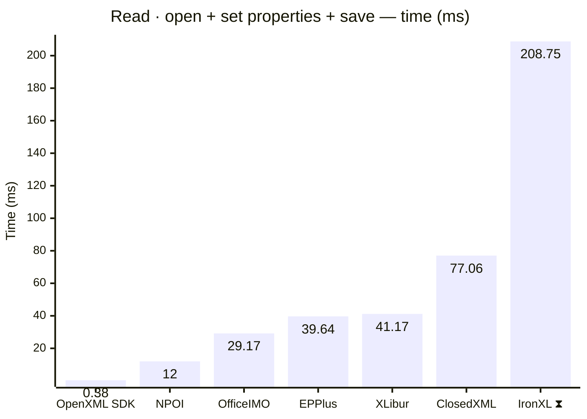
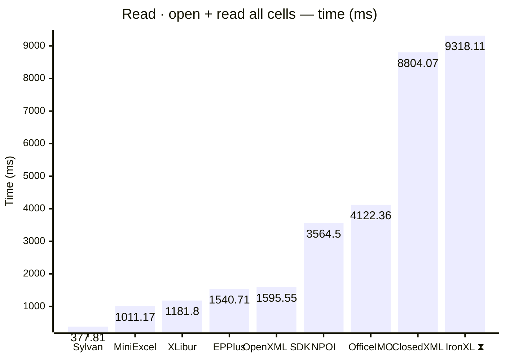
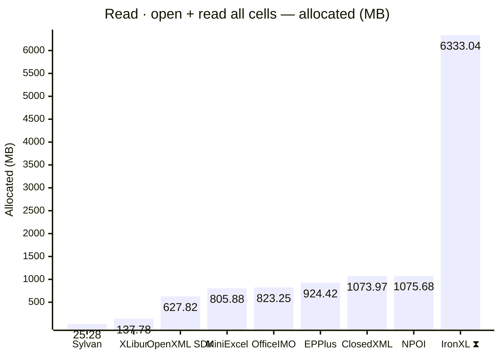
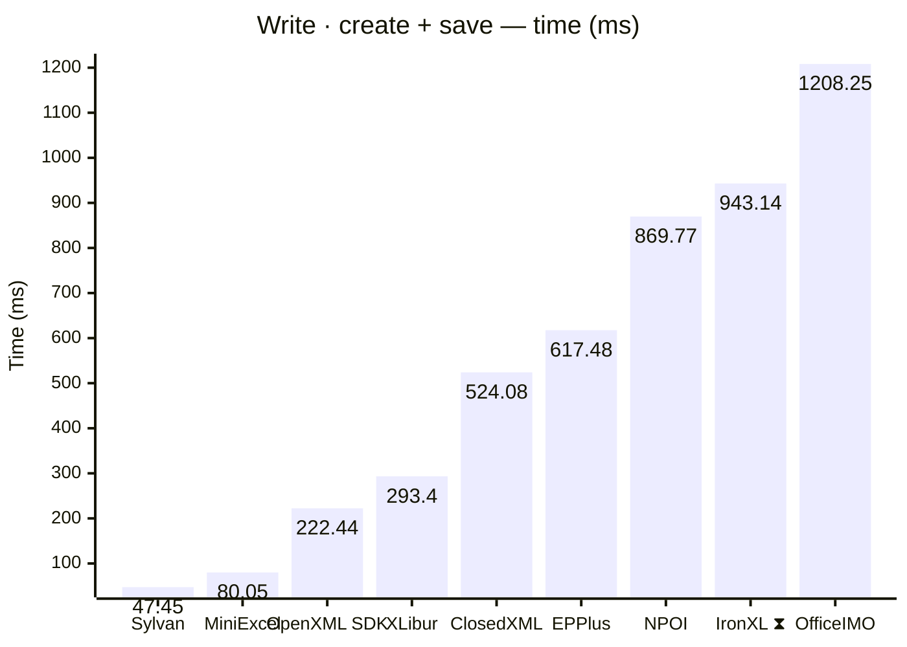
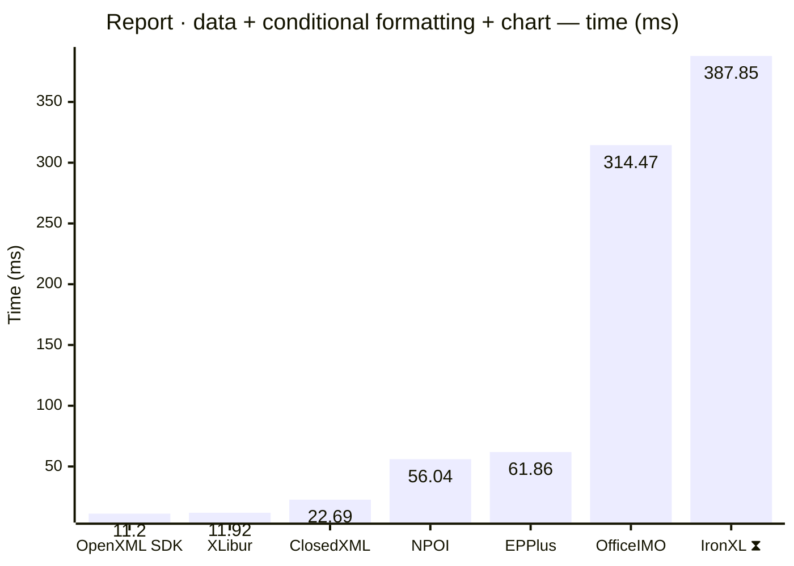
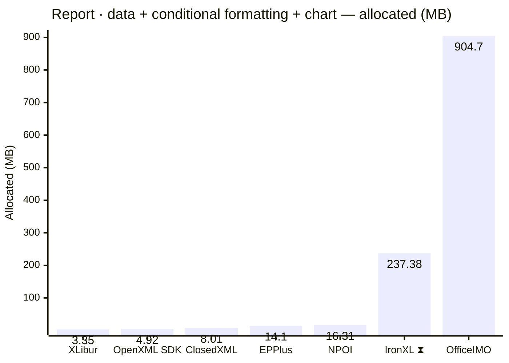
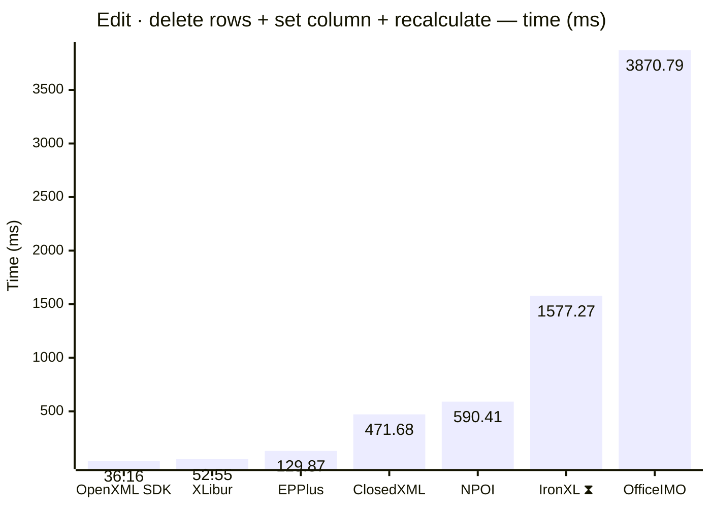
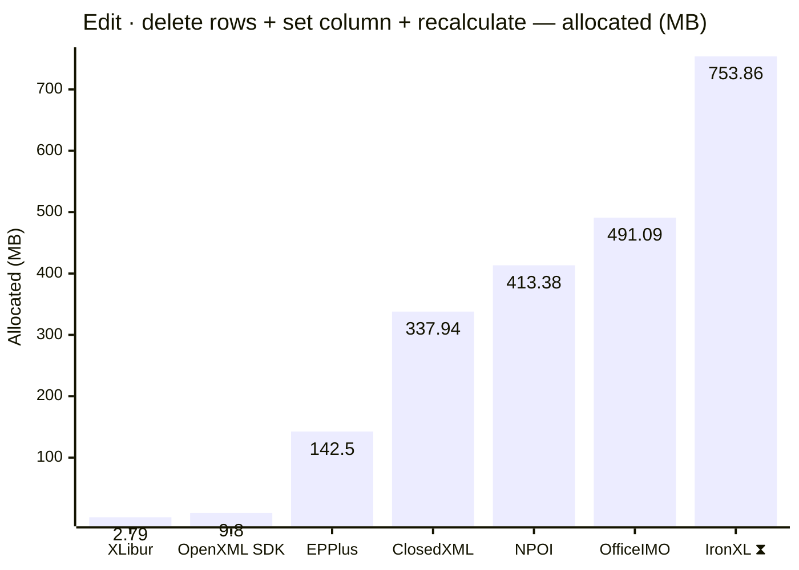
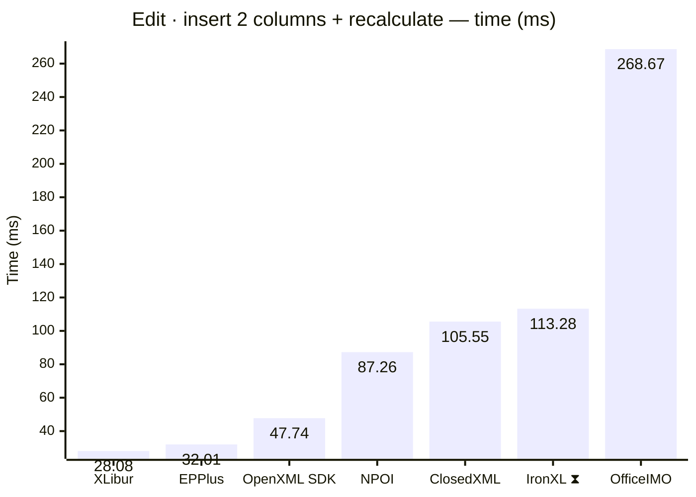
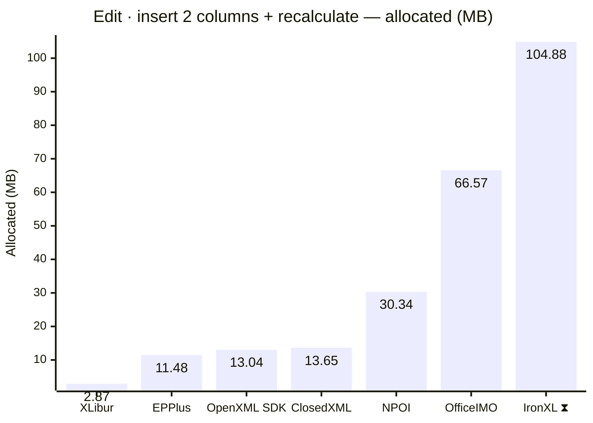

<style>
  .main-content { max-width: 90% !important; padding-left: 2rem !important; padding-right: 2rem !important; }
</style>
<!-- Generated by XLBench. Do not edit by hand; re-run scripts/run-benchmarks.ps1. -->
# XLBench Results

Each section below embeds the full BenchmarkDotNet environment block (OS, CPU,
.NET SDK and runtime). Timings are hardware-specific; treat the allocation/GC
columns as the most portable signal across machines. Regenerate locally with
`scripts/run-benchmarks.ps1`.

> ⚠️ Generated on a shared GitHub Actions runner — timings are indicative and vary run to run; allocation/memory figures are reliable. Authoritative timings come from a local run: [results.html](results.html).

📈 **[Interactive charts](charts.html)** (GitHub Pages). Static charts and the full tables follow.

Each results table (one per test method) is heat-mapped independently on the Pages site (🟩 best → 🟥 worst).

> ⧗ **Carried over from an earlier run.** The rows and chart points below marked with this symbol were not measured here — the library is commercial and needs a licence key this run did not have — so they are replayed from `snapshots/`. Compare them as indicative rather than like-for-like, and see the repository README for how to refresh a snapshot.
>
> - **IronXL** 2026.8.1, Job-HTCPYF job, captured 2026-08-03 on different hardware — Windows 11 (10.0.22631.6199/23H2/2023Update/SunValley3), AMD Ryzen 9 5950X 16-Core Processor.

## Libraries under test

| Library | Version | Source |
| --- | --- | --- |
| ClosedXML | 0.105.1 | this run |
| EPPlus | 8.7.1 | this run |
| OpenXML SDK | 3.5.1 | this run |
| NPOI | 2.8.1 | this run |
| MiniExcel | 1.46.0 | this run |
| Sylvan | 0.5.8 | this run |
| XLibur | 0.630.0 | this run |
| OfficeIMO | 3.4.3 | this run |
| IronXL ⧗ | 2026.8.1 | snapshot (2026.8.1, Job-HTCPYF, captured 2026-08-03) |

## Comparison charts

_Lower is better. Charts render in the GitHub file view; the Pages site has interactive versions._


```mermaid
---
config:
  xyChart:
    showDataLabel: true
---
xychart-beta
    title "Read · open + set properties + save — time (ms)"
    x-axis ["OpenXML SDK", "NPOI", "OfficeIMO", "EPPlus", "XLibur", "ClosedXML", "IronXL ⧗"]
    y-axis "Time (ms)"
    bar [0.38, 12, 29.17, 39.64, 41.17, 77.06, 208.75]
```


```mermaid
---
config:
  xyChart:
    showDataLabel: true
---
xychart-beta
    title "Read · open + set properties + save — allocated (MB)"
    x-axis ["OpenXML SDK", "XLibur", "NPOI", "OfficeIMO", "ClosedXML", "EPPlus", "IronXL ⧗"]
    y-axis "Allocated (MB)"
    bar [0.34, 1.73, 1.89, 6.57, 13.17, 13.84, 152.81]
```


```mermaid
---
config:
  xyChart:
    showDataLabel: true
---
xychart-beta
    title "Read · open + read all cells — time (ms)"
    x-axis ["Sylvan", "MiniExcel", "XLibur", "EPPlus", "OpenXML SDK", "NPOI", "OfficeIMO", "ClosedXML", "IronXL ⧗"]
    y-axis "Time (ms)"
    bar [377.81, 1011.17, 1181.8, 1540.71, 1595.55, 3564.5, 4122.36, 8804.07, 9318.11]
```


```mermaid
---
config:
  xyChart:
    showDataLabel: true
---
xychart-beta
    title "Read · open + read all cells — allocated (MB)"
    x-axis ["Sylvan", "XLibur", "OpenXML SDK", "MiniExcel", "OfficeIMO", "EPPlus", "ClosedXML", "NPOI", "IronXL ⧗"]
    y-axis "Allocated (MB)"
    bar [25.28, 137.78, 627.82, 805.88, 823.25, 924.42, 1073.97, 1075.68, 6333.04]
```


```mermaid
---
config:
  xyChart:
    showDataLabel: true
---
xychart-beta
    title "Write · create + save — time (ms)"
    x-axis ["Sylvan", "MiniExcel", "OpenXML SDK", "XLibur", "ClosedXML", "EPPlus", "NPOI", "IronXL ⧗", "OfficeIMO"]
    y-axis "Time (ms)"
    bar [47.45, 80.05, 222.44, 293.4, 524.08, 617.48, 869.77, 943.14, 1208.25]
```


```mermaid
---
config:
  xyChart:
    showDataLabel: true
---
xychart-beta
    title "Write · create + save — allocated (MB)"
    x-axis ["Sylvan", "XLibur", "MiniExcel", "OpenXML SDK", "ClosedXML", "NPOI", "EPPlus", "OfficeIMO", "IronXL ⧗"]
    y-axis "Allocated (MB)"
    bar [13.27, 60.5, 84.59, 134.19, 181.1, 246.27, 322.56, 357.23, 797.63]
```


```mermaid
---
config:
  xyChart:
    showDataLabel: true
---
xychart-beta
    title "Report · data + conditional formatting + chart — time (ms)"
    x-axis ["OpenXML SDK", "XLibur", "ClosedXML", "NPOI", "EPPlus", "OfficeIMO", "IronXL ⧗"]
    y-axis "Time (ms)"
    bar [11.2, 11.92, 22.69, 56.04, 61.86, 314.47, 387.85]
```


```mermaid
---
config:
  xyChart:
    showDataLabel: true
---
xychart-beta
    title "Report · data + conditional formatting + chart — allocated (MB)"
    x-axis ["XLibur", "OpenXML SDK", "ClosedXML", "EPPlus", "NPOI", "IronXL ⧗", "OfficeIMO"]
    y-axis "Allocated (MB)"
    bar [3.35, 4.92, 8.01, 14.1, 16.31, 237.38, 904.7]
```


```mermaid
---
config:
  xyChart:
    showDataLabel: true
---
xychart-beta
    title "Edit · delete rows + set column + recalculate — time (ms)"
    x-axis ["OpenXML SDK", "XLibur", "EPPlus", "ClosedXML", "NPOI", "IronXL ⧗", "OfficeIMO"]
    y-axis "Time (ms)"
    bar [36.16, 52.55, 129.87, 471.68, 590.41, 1577.27, 3870.79]
```


```mermaid
---
config:
  xyChart:
    showDataLabel: true
---
xychart-beta
    title "Edit · delete rows + set column + recalculate — allocated (MB)"
    x-axis ["XLibur", "OpenXML SDK", "EPPlus", "ClosedXML", "NPOI", "OfficeIMO", "IronXL ⧗"]
    y-axis "Allocated (MB)"
    bar [2.79, 9.8, 142.5, 337.94, 413.38, 491.09, 753.86]
```


```mermaid
---
config:
  xyChart:
    showDataLabel: true
---
xychart-beta
    title "Edit · insert 2 columns + recalculate — time (ms)"
    x-axis ["XLibur", "EPPlus", "OpenXML SDK", "NPOI", "ClosedXML", "IronXL ⧗", "OfficeIMO"]
    y-axis "Time (ms)"
    bar [28.08, 32.01, 47.74, 87.26, 105.55, 113.28, 268.67]
```


```mermaid
---
config:
  xyChart:
    showDataLabel: true
---
xychart-beta
    title "Edit · insert 2 columns + recalculate — allocated (MB)"
    x-axis ["XLibur", "EPPlus", "OpenXML SDK", "ClosedXML", "NPOI", "OfficeIMO", "IronXL ⧗"]
    y-axis "Allocated (MB)"
    bar [2.87, 11.48, 13.04, 13.65, 30.34, 66.57, 104.88]
```

## Detailed results


```

BenchmarkDotNet v0.15.8, Linux Ubuntu 24.04.5 LTS (Noble Numbat)
AMD EPYC 7763 3.20GHz, 1 CPU, 4 logical and 2 physical cores
.NET SDK 10.0.401
  [Host]   : .NET 10.0.12 (10.0.12, 10.0.1226.42308), X64 RyuJIT x86-64-v3
  ShortRun : .NET 10.0.12 (10.0.12, 10.0.1226.42308), X64 RyuJIT x86-64-v3

Job=ShortRun  IterationCount=3  LaunchCount=1  
WarmupCount=3  

```

### Read · open + set properties + save

| Library     | Type                      | Method                      | Mean          | Error         | StdDev      | Median        | Gen0       | Gen1       | Gen2      | Allocated  |
|------------ |-------------------------- |---------------------------- |--------------:|--------------:|------------:|--------------:|-----------:|-----------:|----------:|-----------:|
| OpenXML SDK | OpenXmlReadBenchmarks     | OpenAmendPropertiesAndSave  |     0.3829 ms |     0.8792 ms |   0.0482 ms |     0.3775 ms |    27.3438 |    16.6016 |   13.6719 |    0.34 MB |
| NPOI        | NpoiReadBenchmarks        | OpenAmendPropertiesAndSave  |    12.0045 ms |     0.4110 ms |   0.0225 ms |    12.0082 ms |   125.0000 |    93.7500 |   62.5000 |    1.89 MB |
| OfficeIMO   | OfficeImoReadBenchmarks   | OpenAmendPropertiesAndSave  |    29.1738 ms |     1.9630 ms |   0.1076 ms |    29.2068 ms |   562.5000 |   437.5000 |  406.2500 |    6.57 MB |
| EPPlus      | EpPlusReadBenchmarks      | OpenAmendPropertiesAndSave  |    39.6374 ms |    93.0379 ms |   5.0997 ms |    39.5463 ms |  1000.0000 |  1000.0000 | 1000.0000 |   13.84 MB |
| XLibur      | XLiburReadBenchmarks      | OpenAmendPropertiesAndSave  |    41.1698 ms |   384.5588 ms |  21.0790 ms |    36.9798 ms |          - |          - |         - |    1.73 MB |
| ClosedXML   | ClosedXmlReadBenchmarks   | OpenAmendPropertiesAndSave  |    77.0627 ms |   745.2251 ms |  40.8483 ms |    55.4462 ms |   750.0000 |   250.0000 |         - |   13.17 MB |
| IronXL ⧗ | IronXlReadBenchmarks | OpenAmendPropertiesAndSave | 208.746 ms | 155.7570 ms | 92.6885 ms | 168.705 ms | 9000.0000 | 2000.0000 | - | 152.81 MB |

### Read · open + read all cells

| Library     | Type                      | Method                      | Mean          | Error         | StdDev      | Median        | Gen0       | Gen1       | Gen2      | Allocated  |
|------------ |-------------------------- |---------------------------- |--------------:|--------------:|------------:|--------------:|-----------:|-----------:|----------:|-----------:|
| Sylvan      | SylvanReadBenchmarks      | OpenAndReadAll              |   377.8099 ms |    66.8758 ms |   3.6657 ms |   378.3147 ms |  1000.0000 |          - |         - |   25.28 MB |
| MiniExcel   | MiniExcelReadBenchmarks   | OpenAndReadAll              | 1,011.1664 ms |   106.6798 ms |   5.8475 ms | 1,014.4481 ms | 51000.0000 |  4000.0000 | 1000.0000 |  805.88 MB |
| XLibur      | XLiburReadBenchmarks      | OpenAndReadAll              | 1,181.7969 ms |   123.5379 ms |   6.7715 ms | 1,184.8990 ms |  8000.0000 |  6000.0000 | 1000.0000 |  137.78 MB |
| EPPlus      | EpPlusReadBenchmarks      | OpenAndReadAll              | 1,540.7077 ms |    38.1725 ms |   2.0924 ms | 1,540.5196 ms | 49000.0000 | 14000.0000 | 7000.0000 |  924.42 MB |
| OpenXML SDK | OpenXmlReadBenchmarks     | OpenAndReadAll              | 1,595.5459 ms |   171.3565 ms |   9.3926 ms | 1,593.3483 ms | 40000.0000 |  6000.0000 | 1000.0000 |  627.82 MB |
| NPOI        | NpoiReadBenchmarks        | OpenAndReadAll              | 3,564.4962 ms | 4,740.9447 ms | 259.8672 ms | 3,704.0252 ms | 67000.0000 | 62000.0000 | 6000.0000 | 1075.68 MB |
| OfficeIMO   | OfficeImoReadBenchmarks   | OpenAndReadAll              | 4,122.3575 ms |   181.0171 ms |   9.9222 ms | 4,124.6407 ms | 53000.0000 | 39000.0000 | 5000.0000 |  823.25 MB |
| ClosedXML   | ClosedXmlReadBenchmarks   | OpenAndReadAll              | 8,804.0746 ms |   284.1097 ms |  15.5730 ms | 8,799.0243 ms | 60000.0000 | 24000.0000 | 4000.0000 | 1073.97 MB |
| IronXL ⧗ | IronXlReadBenchmarks | OpenAndReadAll | 9,318.107 ms | 477.3336 ms | 315.7266 ms | 9,377.407 ms | 393000.0000 | 202000.0000 | 10000.0000 | 6333.04 MB |

### Write · create + save

| Library     | Type                      | Method                      | Mean          | Error         | StdDev      | Median        | Gen0       | Gen1       | Gen2      | Allocated  |
|------------ |-------------------------- |---------------------------- |--------------:|--------------:|------------:|--------------:|-----------:|-----------:|----------:|-----------:|
| Sylvan      | SylvanWriteBenchmarks     | CreateAndSave               |    47.4476 ms |     4.7432 ms |   0.2600 ms |    47.3956 ms |  1818.1818 |  1727.2727 | 1545.4545 |   13.27 MB |
| MiniExcel   | MiniExcelWriteBenchmarks  | CreateAndSave               |    80.0472 ms |    15.1748 ms |   0.8318 ms |    79.8695 ms |  5428.5714 |  1571.4286 | 1428.5714 |   84.59 MB |
| OpenXML SDK | OpenXmlWriteBenchmarks    | CreateAndSave               |   222.4366 ms |     8.7621 ms |   0.4803 ms |   222.2886 ms |  9000.0000 |  2333.3333 | 2333.3333 |  134.19 MB |
| XLibur      | XLiburWriteBenchmarks     | CreateAndSave               |   293.3957 ms |    26.5193 ms |   1.4536 ms |   292.6342 ms |  3000.0000 |  2000.0000 | 2000.0000 |    60.5 MB |
| ClosedXML   | ClosedXmlWriteBenchmarks  | CreateAndSave               |   524.0760 ms |    70.2455 ms |   3.8504 ms |   521.8809 ms | 11000.0000 |  6000.0000 | 3000.0000 |   181.1 MB |
| EPPlus      | EpPlusWriteBenchmarks     | CreateAndSave               |   617.4839 ms |    19.4359 ms |   1.0653 ms |   617.3452 ms | 20000.0000 |  9000.0000 | 3000.0000 |  322.56 MB |
| NPOI        | NpoiWriteBenchmarks       | CreateAndSave               |   869.7663 ms |   238.5851 ms |  13.0777 ms |   871.0277 ms | 16000.0000 | 12000.0000 | 3000.0000 |  246.27 MB |
| IronXL ⧗ | IronXlWriteBenchmarks | CreateAndSave | 943.137 ms | 18.5191 ms | 11.0204 ms | 938.999 ms | 48000.0000 | 16000.0000 | 3000.0000 | 797.63 MB |
| OfficeIMO   | OfficeImoWriteBenchmarks  | CreateAndSave               | 1,208.2502 ms |   409.8732 ms |  22.4665 ms | 1,201.0284 ms | 19000.0000 | 14000.0000 | 3000.0000 |  357.23 MB |

### Report · data + conditional formatting + chart

| Library     | Type                      | Method                      | Mean          | Error         | StdDev      | Median        | Gen0       | Gen1       | Gen2      | Allocated  |
|------------ |-------------------------- |---------------------------- |--------------:|--------------:|------------:|--------------:|-----------:|-----------:|----------:|-----------:|
| OpenXML SDK | OpenXmlReportBenchmarks   | CreateStockReport           |    11.1971 ms |     0.5286 ms |   0.0290 ms |    11.2105 ms |   375.0000 |   359.3750 |  187.5000 |    4.92 MB |
| XLibur      | XLiburReportBenchmarks    | CreateStockReport           |    11.9202 ms |     4.7946 ms |   0.2628 ms |    11.7784 ms |   187.5000 |   187.5000 |  187.5000 |    3.35 MB |
| ClosedXML   | ClosedXmlReportBenchmarks | CreateStockReport           |    22.6875 ms |     4.9301 ms |   0.2702 ms |    22.5676 ms |   468.7500 |   343.7500 |  187.5000 |    8.01 MB |
| NPOI        | NpoiReportBenchmarks      | CreateStockReport           |    56.0448 ms |   199.7382 ms |  10.9483 ms |    55.2081 ms |   833.3333 |   666.6667 |  333.3333 |   16.31 MB |
| EPPlus      | EpPlusReportBenchmarks    | CreateStockReport           |    61.8642 ms |   157.9079 ms |   8.6555 ms |    65.6491 ms |  1000.0000 |  1000.0000 | 1000.0000 |    14.1 MB |
| OfficeIMO   | OfficeImoReportBenchmarks | CreateStockReport           |   314.4696 ms |    80.3245 ms |   4.4029 ms |   314.4199 ms | 56000.0000 |  2000.0000 |         - |   904.7 MB |
| IronXL ⧗ | IronXlReportBenchmarks | CreateStockReport | 387.849 ms | 36.5456 ms | 24.1726 ms | 384.092 ms | 14000.0000 | 3000.0000 | - | 237.38 MB |

### Edit · delete rows + set column + recalculate

| Library     | Type                      | Method                      | Mean          | Error         | StdDev      | Median        | Gen0       | Gen1       | Gen2      | Allocated  |
|------------ |-------------------------- |---------------------------- |--------------:|--------------:|------------:|--------------:|-----------:|-----------:|----------:|-----------:|
| OpenXML SDK | OpenXmlEditBenchmarks     | EditAndRecalculate          |    36.1608 ms |     4.1530 ms |   0.2276 ms |    36.1759 ms |   714.2857 |   571.4286 |  142.8571 |     9.8 MB |
| XLibur      | XLiburEditBenchmarks      | EditAndRecalculate          |    52.5485 ms |    76.5373 ms |   4.1953 ms |    52.1830 ms |   142.8571 |          - |         - |    2.79 MB |
| EPPlus      | EpPlusEditBenchmarks      | EditAndRecalculate          |   129.8658 ms |    37.1353 ms |   2.0355 ms |   129.8227 ms |  9000.0000 |  1250.0000 | 1000.0000 |   142.5 MB |
| ClosedXML   | ClosedXmlEditBenchmarks   | EditAndRecalculate          |   471.6807 ms |    26.4133 ms |   1.4478 ms |   470.9558 ms | 21000.0000 |  1000.0000 |         - |  337.94 MB |
| NPOI        | NpoiEditBenchmarks        | EditAndRecalculate          |   590.4065 ms |   149.9363 ms |   8.2185 ms |   594.2600 ms | 25000.0000 |  1000.0000 |         - |  413.38 MB |
| IronXL ⧗ | IronXlEditBenchmarks | EditAndRecalculate | 1,577.273 ms | 62.9583 ms | 41.6430 ms | 1,583.098 ms | 57000.0000 | 36000.0000 | 15000.0000 | 753.86 MB |
| OfficeIMO   | OfficeImoEditBenchmarks   | EditAndRecalculate          | 3,870.7920 ms |   336.0262 ms |  18.4187 ms | 3,872.3932 ms | 30000.0000 |  1000.0000 |         - |  491.09 MB |

### Edit · insert 2 columns + recalculate

| Library     | Type                      | Method                      | Mean          | Error         | StdDev      | Median        | Gen0       | Gen1       | Gen2      | Allocated  |
|------------ |-------------------------- |---------------------------- |--------------:|--------------:|------------:|--------------:|-----------:|-----------:|----------:|-----------:|
| XLibur      | XLiburInsertBenchmarks    | InsertColumnsAndRecalculate |    28.0800 ms |    34.0526 ms |   1.8665 ms |    27.3931 ms |   142.8571 |          - |         - |    2.87 MB |
| EPPlus      | EpPlusInsertBenchmarks    | InsertColumnsAndRecalculate |    32.0134 ms |   173.2532 ms |   9.4966 ms |    27.2909 ms |  1000.0000 |  1000.0000 | 1000.0000 |   11.48 MB |
| OpenXML SDK | OpenXmlInsertBenchmarks   | InsertColumnsAndRecalculate |    47.7372 ms |    52.6796 ms |   2.8875 ms |    46.4954 ms |  1000.0000 |   800.0000 |  400.0000 |   13.04 MB |
| NPOI        | NpoiInsertBenchmarks      | InsertColumnsAndRecalculate |    87.2644 ms |   246.3904 ms |  13.5055 ms |    88.8551 ms |  2000.0000 |  1500.0000 |  500.0000 |   30.34 MB |
| ClosedXML   | ClosedXmlInsertBenchmarks | InsertColumnsAndRecalculate |   105.5545 ms |   912.0999 ms |  49.9953 ms |   129.1345 ms |   666.6667 |   333.3333 |         - |   13.65 MB |
| IronXL ⧗ | IronXlInsertBenchmarks | InsertColumnsAndRecalculate | 113.284 ms | 41.9750 ms | 27.7638 ms | 97.052 ms | 7000.0000 | 2500.0000 | 750.0000 | 104.88 MB |
| OfficeIMO   | OfficeImoInsertBenchmarks | InsertColumnsAndRecalculate |   268.6732 ms |    99.0152 ms |   5.4274 ms |   266.0002 ms |  3000.0000 |  1000.0000 |         - |   66.57 MB |


<script type="module">
  import mermaid from 'https://cdn.jsdelivr.net/npm/mermaid@11/dist/mermaid.esm.min.mjs';
  const blocks = document.querySelectorAll('.language-mermaid');
  blocks.forEach(el => {
    const code = el.querySelector('code') || el;
    const pre = document.createElement('pre');
    pre.className = 'mermaid';
    pre.textContent = code.textContent;
    el.replaceWith(pre);
  });
  if (blocks.length) {
    mermaid.initialize({ startOnLoad: false });
    await mermaid.run({ querySelector: 'pre.mermaid' });
  }
</script>

<script>
(function () {
  const parse = s => { const n = parseFloat(String(s).replace(/,/g, '')); return Number.isFinite(n) ? n : null; };
  document.querySelectorAll('table').forEach(table => {
    if (!table.tHead || !table.tBodies[0]) return;
    const heads = [...table.tHead.rows[0].cells].map(c => c.textContent.trim().toLowerCase());
    if (!heads.includes('mean')) return;
    const metricCols = heads.map((h, i) => /^(mean|allocated|gen0|gen1|gen2)$/.test(h) ? i : -1).filter(i => i >= 0);
    const rows = [...table.tBodies[0].rows];
    for (const c of metricCols) {
      const vals = rows.map(r => parse(r.cells[c]?.textContent));
      const nums = vals.filter(v => v !== null);
      if (nums.length < 2) continue;
      const min = Math.min(...nums), max = Math.max(...nums);
      if (max === min) continue;
      rows.forEach((r, i) => {
        const v = vals[i]; if (v === null) return;
        const ratio = (v - min) / (max - min);
        r.cells[c].style.backgroundColor = `hsla(${120 - 120 * ratio}, 70%, 50%, 0.45)`;
      });
    }
  });
})();
</script>
