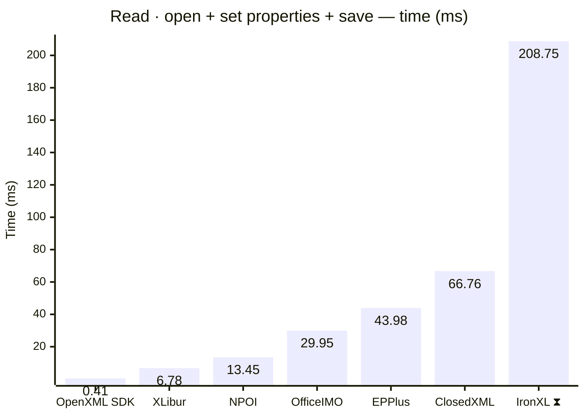
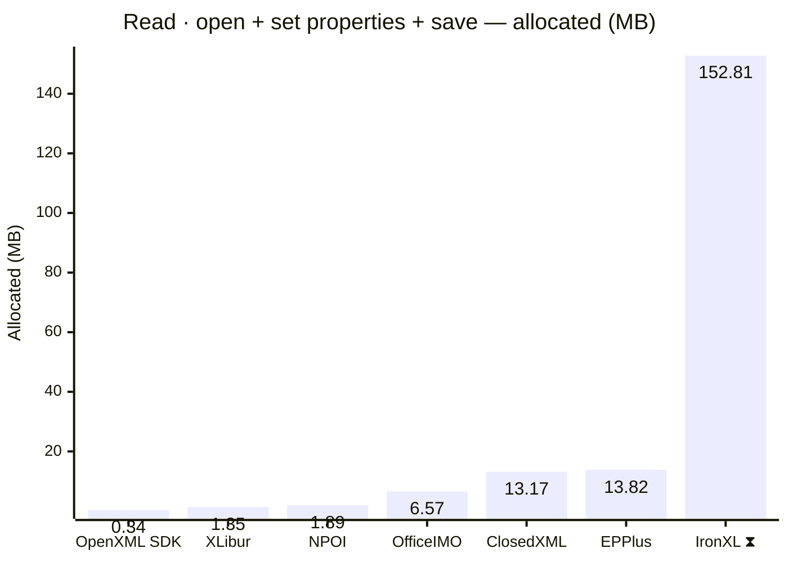
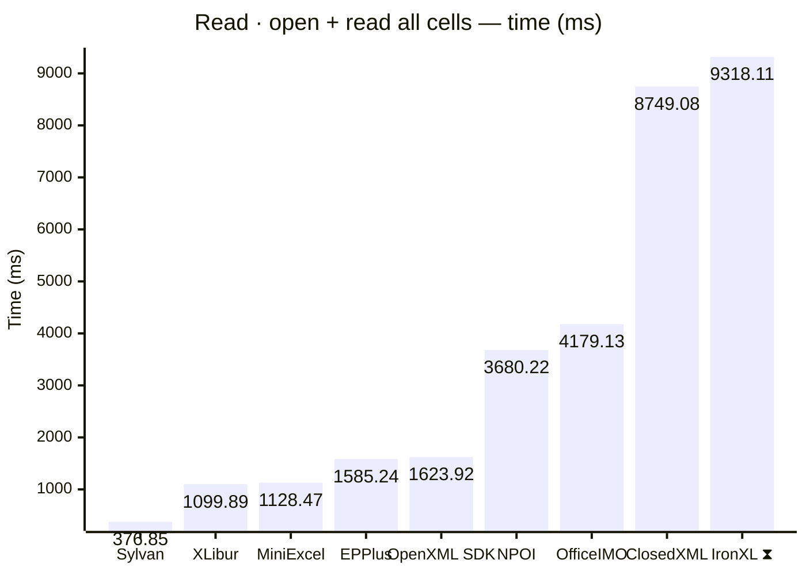
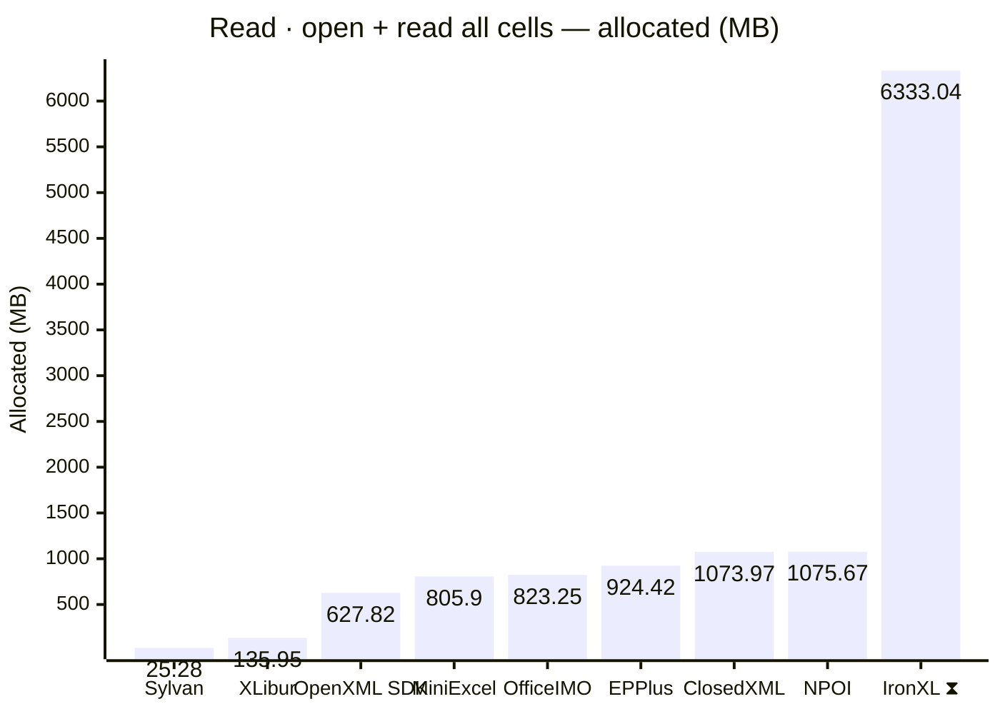
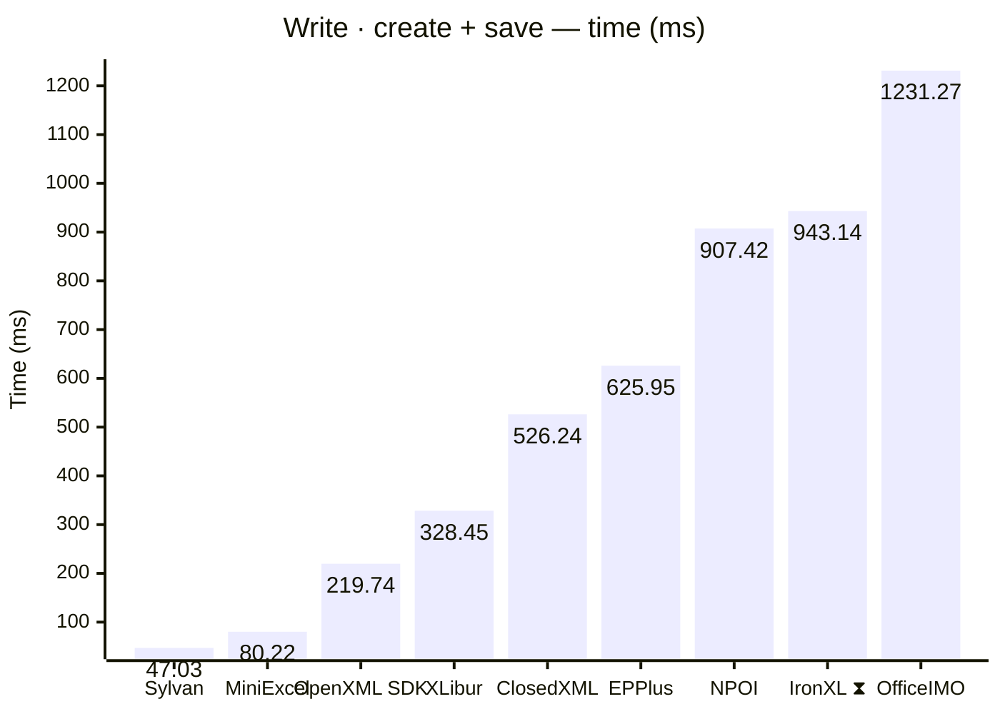
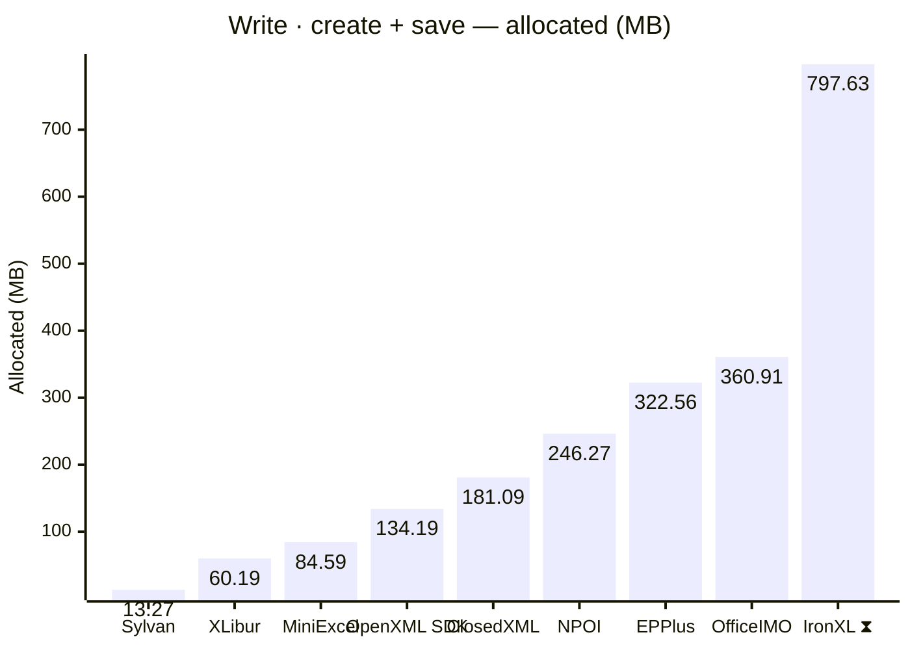
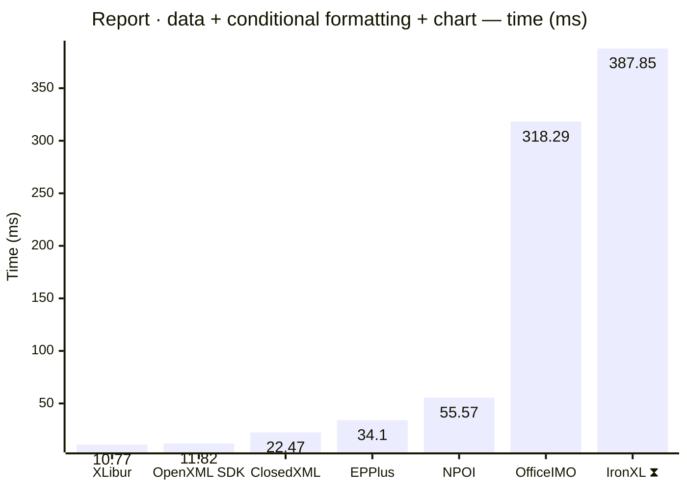
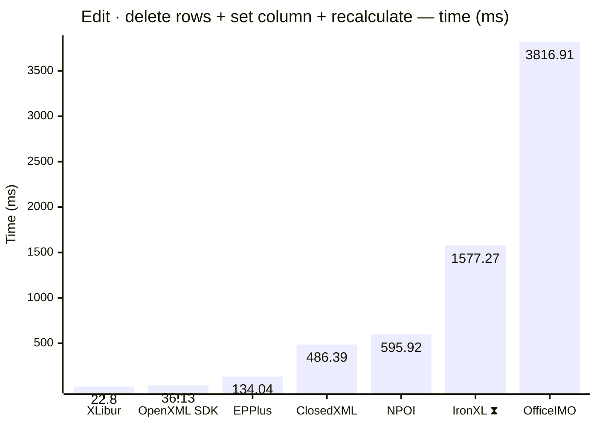
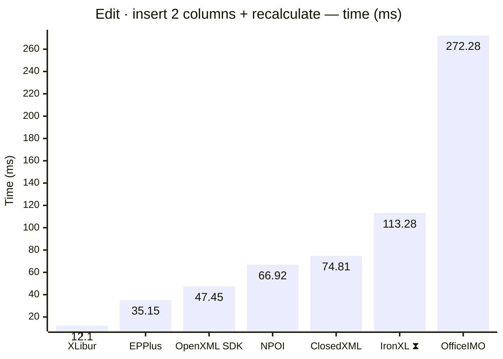
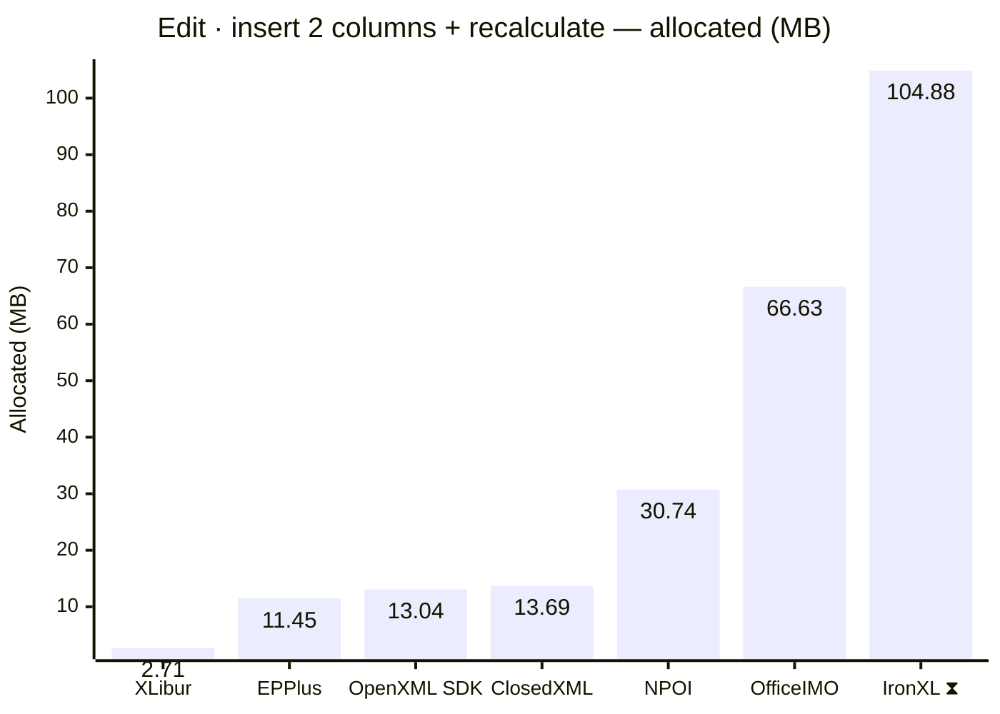

<style>
  .main-content { max-width: 90% !important; padding-left: 2rem !important; padding-right: 2rem !important; }
</style>
<!-- Generated by XLBench. Do not edit by hand; re-run scripts/run-benchmarks.ps1. -->
# XLBench Results

Each section below embeds the full BenchmarkDotNet environment block (OS, CPU,
.NET SDK and runtime). Timings are hardware-specific; treat the allocation/GC
columns as the most portable signal across machines. Regenerate locally with
`scripts/run-benchmarks.ps1`.

> ⚠️ Generated on a shared GitHub Actions runner — timings are indicative and vary run to run; allocation/memory figures are reliable. Authoritative timings come from a local run: [results.html](results.html).

📈 **[Interactive charts](charts.html)** (GitHub Pages). Static charts and the full tables follow.

Each results table (one per test method) is heat-mapped independently on the Pages site (🟩 best → 🟥 worst).

> ⧗ **Carried over from an earlier run.** The rows and chart points below marked with this symbol were not measured here — the library is commercial and needs a licence key this run did not have — so they are replayed from `snapshots/`. Compare them as indicative rather than like-for-like, and see the repository README for how to refresh a snapshot.
>
> - **IronXL** 2026.8.1, Job-HTCPYF job, captured 2026-08-03 on different hardware — Windows 11 (10.0.22631.6199/23H2/2023Update/SunValley3), AMD Ryzen 9 5950X 16-Core Processor.

## Libraries under test

| Library | Version | Source |
| --- | --- | --- |
| ClosedXML | 0.105.1 | this run |
| EPPlus | 8.7.1 | this run |
| OpenXML SDK | 3.5.1 | this run |
| NPOI | 2.8.1 | this run |
| MiniExcel | 1.46.0 | this run |
| Sylvan | 0.5.8 | this run |
| XLibur | 0.630.1-rc.18 | this run |
| OfficeIMO | 3.4.4 | this run |
| IronXL ⧗ | 2026.8.1 | snapshot (2026.8.1, Job-HTCPYF, captured 2026-08-03) |

## Comparison charts

_Lower is better. Charts render in the GitHub file view; the Pages site has interactive versions._


```mermaid
---
config:
  xyChart:
    showDataLabel: true
---
xychart-beta
    title "Read · open + set properties + save — time (ms)"
    x-axis ["OpenXML SDK", "XLibur", "NPOI", "OfficeIMO", "EPPlus", "ClosedXML", "IronXL ⧗"]
    y-axis "Time (ms)"
    bar [0.41, 6.78, 13.45, 29.95, 43.98, 66.76, 208.75]
```


```mermaid
---
config:
  xyChart:
    showDataLabel: true
---
xychart-beta
    title "Read · open + set properties + save — allocated (MB)"
    x-axis ["OpenXML SDK", "XLibur", "NPOI", "OfficeIMO", "ClosedXML", "EPPlus", "IronXL ⧗"]
    y-axis "Allocated (MB)"
    bar [0.34, 1.35, 1.89, 6.57, 13.17, 13.82, 152.81]
```


```mermaid
---
config:
  xyChart:
    showDataLabel: true
---
xychart-beta
    title "Read · open + read all cells — time (ms)"
    x-axis ["Sylvan", "XLibur", "MiniExcel", "EPPlus", "OpenXML SDK", "NPOI", "OfficeIMO", "ClosedXML", "IronXL ⧗"]
    y-axis "Time (ms)"
    bar [376.85, 1099.89, 1128.47, 1585.24, 1623.92, 3680.22, 4179.13, 8749.08, 9318.11]
```


```mermaid
---
config:
  xyChart:
    showDataLabel: true
---
xychart-beta
    title "Read · open + read all cells — allocated (MB)"
    x-axis ["Sylvan", "XLibur", "OpenXML SDK", "MiniExcel", "OfficeIMO", "EPPlus", "ClosedXML", "NPOI", "IronXL ⧗"]
    y-axis "Allocated (MB)"
    bar [25.28, 135.95, 627.82, 805.9, 823.25, 924.42, 1073.97, 1075.67, 6333.04]
```


```mermaid
---
config:
  xyChart:
    showDataLabel: true
---
xychart-beta
    title "Write · create + save — time (ms)"
    x-axis ["Sylvan", "MiniExcel", "OpenXML SDK", "XLibur", "ClosedXML", "EPPlus", "NPOI", "IronXL ⧗", "OfficeIMO"]
    y-axis "Time (ms)"
    bar [47.03, 80.22, 219.74, 328.45, 526.24, 625.95, 907.42, 943.14, 1231.27]
```


```mermaid
---
config:
  xyChart:
    showDataLabel: true
---
xychart-beta
    title "Write · create + save — allocated (MB)"
    x-axis ["Sylvan", "XLibur", "MiniExcel", "OpenXML SDK", "ClosedXML", "NPOI", "EPPlus", "OfficeIMO", "IronXL ⧗"]
    y-axis "Allocated (MB)"
    bar [13.27, 60.19, 84.59, 134.19, 181.09, 246.27, 322.56, 360.91, 797.63]
```


```mermaid
---
config:
  xyChart:
    showDataLabel: true
---
xychart-beta
    title "Report · data + conditional formatting + chart — time (ms)"
    x-axis ["XLibur", "OpenXML SDK", "ClosedXML", "EPPlus", "NPOI", "OfficeIMO", "IronXL ⧗"]
    y-axis "Time (ms)"
    bar [10.77, 11.82, 22.47, 34.1, 55.57, 318.29, 387.85]
```


```mermaid
---
config:
  xyChart:
    showDataLabel: true
---
xychart-beta
    title "Report · data + conditional formatting + chart — allocated (MB)"
    x-axis ["XLibur", "OpenXML SDK", "ClosedXML", "EPPlus", "NPOI", "IronXL ⧗", "OfficeIMO"]
    y-axis "Allocated (MB)"
    bar [3.35, 4.92, 8.01, 13.8, 16.28, 237.38, 904.72]
```


```mermaid
---
config:
  xyChart:
    showDataLabel: true
---
xychart-beta
    title "Edit · delete rows + set column + recalculate — time (ms)"
    x-axis ["XLibur", "OpenXML SDK", "EPPlus", "ClosedXML", "NPOI", "IronXL ⧗", "OfficeIMO"]
    y-axis "Time (ms)"
    bar [22.8, 36.13, 134.04, 486.39, 595.92, 1577.27, 3816.91]
```


```mermaid
---
config:
  xyChart:
    showDataLabel: true
---
xychart-beta
    title "Edit · delete rows + set column + recalculate — allocated (MB)"
    x-axis ["XLibur", "OpenXML SDK", "EPPlus", "ClosedXML", "NPOI", "OfficeIMO", "IronXL ⧗"]
    y-axis "Allocated (MB)"
    bar [2.68, 9.8, 142.5, 337.96, 413.38, 491.1, 753.86]
```


```mermaid
---
config:
  xyChart:
    showDataLabel: true
---
xychart-beta
    title "Edit · insert 2 columns + recalculate — time (ms)"
    x-axis ["XLibur", "EPPlus", "OpenXML SDK", "NPOI", "ClosedXML", "IronXL ⧗", "OfficeIMO"]
    y-axis "Time (ms)"
    bar [12.1, 35.15, 47.45, 66.92, 74.81, 113.28, 272.28]
```


```mermaid
---
config:
  xyChart:
    showDataLabel: true
---
xychart-beta
    title "Edit · insert 2 columns + recalculate — allocated (MB)"
    x-axis ["XLibur", "EPPlus", "OpenXML SDK", "ClosedXML", "NPOI", "OfficeIMO", "IronXL ⧗"]
    y-axis "Allocated (MB)"
    bar [2.71, 11.45, 13.04, 13.69, 30.74, 66.63, 104.88]
```

## Detailed results


```

BenchmarkDotNet v0.15.8, Linux Ubuntu 24.04.5 LTS (Noble Numbat)
AMD EPYC 7763 2.93GHz, 1 CPU, 4 logical and 2 physical cores
.NET SDK 10.0.401
  [Host]   : .NET 10.0.12 (10.0.12, 10.0.1226.42308), X64 RyuJIT x86-64-v3
  ShortRun : .NET 10.0.12 (10.0.12, 10.0.1226.42308), X64 RyuJIT x86-64-v3

Job=ShortRun  IterationCount=3  LaunchCount=1  
WarmupCount=3  

```

### Read · open + set properties + save

| Library     | Type                      | Method                      | Mean          | Error         | StdDev      | Median        | Gen0       | Gen1       | Gen2      | Allocated  |
|------------ |-------------------------- |---------------------------- |--------------:|--------------:|------------:|--------------:|-----------:|-----------:|----------:|-----------:|
| OpenXML SDK | OpenXmlReadBenchmarks     | OpenAmendPropertiesAndSave  |     0.4070 ms |     1.2531 ms |   0.0687 ms |     0.3994 ms |    27.3438 |    16.6016 |   13.6719 |    0.34 MB |
| XLibur      | XLiburReadBenchmarks      | OpenAmendPropertiesAndSave  |     6.7849 ms |     0.5003 ms |   0.0274 ms |     6.7725 ms |    70.3125 |    31.2500 |         - |    1.35 MB |
| NPOI        | NpoiReadBenchmarks        | OpenAmendPropertiesAndSave  |    13.4498 ms |     9.9116 ms |   0.5433 ms |    13.2501 ms |    62.5000 |          - |         - |    1.89 MB |
| OfficeIMO   | OfficeImoReadBenchmarks   | OpenAmendPropertiesAndSave  |    29.9473 ms |     5.6672 ms |   0.3106 ms |    29.9888 ms |   437.5000 |   312.5000 |  312.5000 |    6.57 MB |
| EPPlus      | EpPlusReadBenchmarks      | OpenAmendPropertiesAndSave  |    43.9755 ms |   141.5122 ms |   7.7568 ms |    42.3812 ms |  1000.0000 |  1000.0000 | 1000.0000 |   13.82 MB |
| ClosedXML   | ClosedXmlReadBenchmarks   | OpenAmendPropertiesAndSave  |    66.7563 ms |   538.0596 ms |  29.4929 ms |    50.4908 ms |   750.0000 |   250.0000 |         - |   13.17 MB |
| IronXL ⧗ | IronXlReadBenchmarks | OpenAmendPropertiesAndSave | 208.746 ms | 155.7570 ms | 92.6885 ms | 168.705 ms | 9000.0000 | 2000.0000 | - | 152.81 MB |

### Read · open + read all cells

| Library     | Type                      | Method                      | Mean          | Error         | StdDev      | Median        | Gen0       | Gen1       | Gen2      | Allocated  |
|------------ |-------------------------- |---------------------------- |--------------:|--------------:|------------:|--------------:|-----------:|-----------:|----------:|-----------:|
| Sylvan      | SylvanReadBenchmarks      | OpenAndReadAll              |   376.8518 ms |    30.8496 ms |   1.6910 ms |   377.1237 ms |  1000.0000 |          - |         - |   25.28 MB |
| XLibur      | XLiburReadBenchmarks      | OpenAndReadAll              | 1,099.8894 ms |    87.5451 ms |   4.7986 ms | 1,101.2648 ms |  8000.0000 |  5000.0000 | 1000.0000 |  135.95 MB |
| MiniExcel   | MiniExcelReadBenchmarks   | OpenAndReadAll              | 1,128.4704 ms |    31.5495 ms |   1.7293 ms | 1,127.9282 ms | 51000.0000 |  4000.0000 | 1000.0000 |   805.9 MB |
| EPPlus      | EpPlusReadBenchmarks      | OpenAndReadAll              | 1,585.2425 ms |    70.4030 ms |   3.8590 ms | 1,583.4909 ms | 49000.0000 | 14000.0000 | 7000.0000 |  924.42 MB |
| OpenXML SDK | OpenXmlReadBenchmarks     | OpenAndReadAll              | 1,623.9155 ms |    57.1800 ms |   3.1342 ms | 1,624.0045 ms | 40000.0000 |  6000.0000 | 1000.0000 |  627.82 MB |
| NPOI        | NpoiReadBenchmarks        | OpenAndReadAll              | 3,680.2191 ms | 4,739.8055 ms | 259.8047 ms | 3,826.9349 ms | 67000.0000 | 62000.0000 | 6000.0000 | 1075.67 MB |
| OfficeIMO   | OfficeImoReadBenchmarks   | OpenAndReadAll              | 4,179.1309 ms |   214.5208 ms |  11.7586 ms | 4,179.8685 ms | 53000.0000 | 39000.0000 | 5000.0000 |  823.25 MB |
| ClosedXML   | ClosedXmlReadBenchmarks   | OpenAndReadAll              | 8,749.0819 ms |    82.8778 ms |   4.5428 ms | 8,747.9861 ms | 60000.0000 | 24000.0000 | 4000.0000 | 1073.97 MB |
| IronXL ⧗ | IronXlReadBenchmarks | OpenAndReadAll | 9,318.107 ms | 477.3336 ms | 315.7266 ms | 9,377.407 ms | 393000.0000 | 202000.0000 | 10000.0000 | 6333.04 MB |

### Write · create + save

| Library     | Type                      | Method                      | Mean          | Error         | StdDev      | Median        | Gen0       | Gen1       | Gen2      | Allocated  |
|------------ |-------------------------- |---------------------------- |--------------:|--------------:|------------:|--------------:|-----------:|-----------:|----------:|-----------:|
| Sylvan      | SylvanWriteBenchmarks     | CreateAndSave               |    47.0259 ms |     0.9655 ms |   0.0529 ms |    47.0564 ms |  1818.1818 |  1727.2727 | 1545.4545 |   13.27 MB |
| MiniExcel   | MiniExcelWriteBenchmarks  | CreateAndSave               |    80.2195 ms |    13.5758 ms |   0.7441 ms |    79.8768 ms |  5428.5714 |  1571.4286 | 1428.5714 |   84.59 MB |
| OpenXML SDK | OpenXmlWriteBenchmarks    | CreateAndSave               |   219.7435 ms |    61.0317 ms |   3.3454 ms |   218.2425 ms |  9000.0000 |  2333.3333 | 2333.3333 |  134.19 MB |
| XLibur      | XLiburWriteBenchmarks     | CreateAndSave               |   328.4532 ms | 1,375.1547 ms |  75.3769 ms |   318.9854 ms |  3000.0000 |  2000.0000 | 2000.0000 |   60.19 MB |
| ClosedXML   | ClosedXmlWriteBenchmarks  | CreateAndSave               |   526.2406 ms |    32.0362 ms |   1.7560 ms |   525.8548 ms | 10000.0000 |  5000.0000 | 2000.0000 |  181.09 MB |
| EPPlus      | EpPlusWriteBenchmarks     | CreateAndSave               |   625.9491 ms |    59.2440 ms |   3.2474 ms |   625.9453 ms | 20000.0000 |  9000.0000 | 3000.0000 |  322.56 MB |
| NPOI        | NpoiWriteBenchmarks       | CreateAndSave               |   907.4161 ms |    49.3967 ms |   2.7076 ms |   907.3407 ms | 16000.0000 | 12000.0000 | 3000.0000 |  246.27 MB |
| IronXL ⧗ | IronXlWriteBenchmarks | CreateAndSave | 943.137 ms | 18.5191 ms | 11.0204 ms | 938.999 ms | 48000.0000 | 16000.0000 | 3000.0000 | 797.63 MB |
| OfficeIMO   | OfficeImoWriteBenchmarks  | CreateAndSave               | 1,231.2676 ms |   665.0928 ms |  36.4560 ms | 1,215.1720 ms | 19000.0000 | 14000.0000 | 3000.0000 |  360.91 MB |

### Report · data + conditional formatting + chart

| Library     | Type                      | Method                      | Mean          | Error         | StdDev      | Median        | Gen0       | Gen1       | Gen2      | Allocated  |
|------------ |-------------------------- |---------------------------- |--------------:|--------------:|------------:|--------------:|-----------:|-----------:|----------:|-----------:|
| XLibur      | XLiburReportBenchmarks    | CreateStockReport           |    10.7704 ms |     2.6399 ms |   0.1447 ms |    10.8281 ms |   187.5000 |   187.5000 |  187.5000 |    3.35 MB |
| OpenXML SDK | OpenXmlReportBenchmarks   | CreateStockReport           |    11.8208 ms |     0.2803 ms |   0.0154 ms |    11.8223 ms |   375.0000 |   359.3750 |  187.5000 |    4.92 MB |
| ClosedXML   | ClosedXmlReportBenchmarks | CreateStockReport           |    22.4718 ms |     1.9950 ms |   0.1094 ms |    22.4213 ms |   468.7500 |   343.7500 |  187.5000 |    8.01 MB |
| EPPlus      | EpPlusReportBenchmarks    | CreateStockReport           |    34.0972 ms |    64.3533 ms |   3.5274 ms |    35.1543 ms |  1000.0000 |  1000.0000 | 1000.0000 |    13.8 MB |
| NPOI        | NpoiReportBenchmarks      | CreateStockReport           |    55.5662 ms |   188.5598 ms |  10.3356 ms |    55.4298 ms |   833.3333 |   666.6667 |  333.3333 |   16.28 MB |
| OfficeIMO   | OfficeImoReportBenchmarks | CreateStockReport           |   318.2948 ms |    90.4563 ms |   4.9582 ms |   316.1960 ms | 56000.0000 |  2000.0000 |         - |  904.72 MB |
| IronXL ⧗ | IronXlReportBenchmarks | CreateStockReport | 387.849 ms | 36.5456 ms | 24.1726 ms | 384.092 ms | 14000.0000 | 3000.0000 | - | 237.38 MB |

### Edit · delete rows + set column + recalculate

| Library     | Type                      | Method                      | Mean          | Error         | StdDev      | Median        | Gen0       | Gen1       | Gen2      | Allocated  |
|------------ |-------------------------- |---------------------------- |--------------:|--------------:|------------:|--------------:|-----------:|-----------:|----------:|-----------:|
| XLibur      | XLiburEditBenchmarks      | EditAndRecalculate          |    22.8029 ms |   124.2535 ms |   6.8108 ms |    21.6872 ms |   125.0000 |          - |         - |    2.68 MB |
| OpenXML SDK | OpenXmlEditBenchmarks     | EditAndRecalculate          |    36.1340 ms |     6.1421 ms |   0.3367 ms |    36.1166 ms |   400.0000 |   200.0000 |         - |     9.8 MB |
| EPPlus      | EpPlusEditBenchmarks      | EditAndRecalculate          |   134.0415 ms |   102.4944 ms |   5.6181 ms |   130.9196 ms |  9000.0000 |  1333.3333 | 1000.0000 |   142.5 MB |
| ClosedXML   | ClosedXmlEditBenchmarks   | EditAndRecalculate          |   486.3941 ms |    29.4579 ms |   1.6147 ms |   486.2484 ms | 21000.0000 |  1000.0000 |         - |  337.96 MB |
| NPOI        | NpoiEditBenchmarks        | EditAndRecalculate          |   595.9224 ms |   106.8512 ms |   5.8569 ms |   598.1229 ms | 25000.0000 |  1000.0000 |         - |  413.38 MB |
| IronXL ⧗ | IronXlEditBenchmarks | EditAndRecalculate | 1,577.273 ms | 62.9583 ms | 41.6430 ms | 1,583.098 ms | 57000.0000 | 36000.0000 | 15000.0000 | 753.86 MB |
| OfficeIMO   | OfficeImoEditBenchmarks   | EditAndRecalculate          | 3,816.9110 ms |    48.5104 ms |   2.6590 ms | 3,816.3397 ms | 30000.0000 |  1000.0000 |         - |   491.1 MB |

### Edit · insert 2 columns + recalculate

| Library     | Type                      | Method                      | Mean          | Error         | StdDev      | Median        | Gen0       | Gen1       | Gen2      | Allocated  |
|------------ |-------------------------- |---------------------------- |--------------:|--------------:|------------:|--------------:|-----------:|-----------:|----------:|-----------:|
| XLibur      | XLiburInsertBenchmarks    | InsertColumnsAndRecalculate |    12.1034 ms |     0.6080 ms |   0.0333 ms |    12.1151 ms |   156.2500 |    62.5000 |         - |    2.71 MB |
| EPPlus      | EpPlusInsertBenchmarks    | InsertColumnsAndRecalculate |    35.1538 ms |   133.0260 ms |   7.2916 ms |    32.3655 ms |  1000.0000 |  1000.0000 | 1000.0000 |   11.45 MB |
| OpenXML SDK | OpenXmlInsertBenchmarks   | InsertColumnsAndRecalculate |    47.4502 ms |     9.5253 ms |   0.5221 ms |    47.5155 ms |   750.0000 |   500.0000 |  250.0000 |   13.04 MB |
| NPOI        | NpoiInsertBenchmarks      | InsertColumnsAndRecalculate |    66.9183 ms |   294.5354 ms |  16.1445 ms |    58.1650 ms |  2000.0000 |  1400.0000 |  600.0000 |   30.74 MB |
| ClosedXML   | ClosedXmlInsertBenchmarks | InsertColumnsAndRecalculate |    74.8128 ms |   242.6997 ms |  13.3032 ms |    70.2772 ms |   666.6667 |   333.3333 |         - |   13.69 MB |
| IronXL ⧗ | IronXlInsertBenchmarks | InsertColumnsAndRecalculate | 113.284 ms | 41.9750 ms | 27.7638 ms | 97.052 ms | 7000.0000 | 2500.0000 | 750.0000 | 104.88 MB |
| OfficeIMO   | OfficeImoInsertBenchmarks | InsertColumnsAndRecalculate |   272.2814 ms |   175.0047 ms |   9.5926 ms |   271.0058 ms |  3000.0000 |  1000.0000 |         - |   66.63 MB |


<script type="module">
  import mermaid from 'https://cdn.jsdelivr.net/npm/mermaid@11/dist/mermaid.esm.min.mjs';
  const blocks = document.querySelectorAll('.language-mermaid');
  blocks.forEach(el => {
    const code = el.querySelector('code') || el;
    const pre = document.createElement('pre');
    pre.className = 'mermaid';
    pre.textContent = code.textContent;
    el.replaceWith(pre);
  });
  if (blocks.length) {
    mermaid.initialize({ startOnLoad: false });
    await mermaid.run({ querySelector: 'pre.mermaid' });
  }
</script>

<script>
(function () {
  const parse = s => { const n = parseFloat(String(s).replace(/,/g, '')); return Number.isFinite(n) ? n : null; };
  document.querySelectorAll('table').forEach(table => {
    if (!table.tHead || !table.tBodies[0]) return;
    const heads = [...table.tHead.rows[0].cells].map(c => c.textContent.trim().toLowerCase());
    if (!heads.includes('mean')) return;
    const metricCols = heads.map((h, i) => /^(mean|allocated|gen0|gen1|gen2)$/.test(h) ? i : -1).filter(i => i >= 0);
    const rows = [...table.tBodies[0].rows];
    for (const c of metricCols) {
      const vals = rows.map(r => parse(r.cells[c]?.textContent));
      const nums = vals.filter(v => v !== null);
      if (nums.length < 2) continue;
      const min = Math.min(...nums), max = Math.max(...nums);
      if (max === min) continue;
      rows.forEach((r, i) => {
        const v = vals[i]; if (v === null) return;
        const ratio = (v - min) / (max - min);
        r.cells[c].style.backgroundColor = `hsla(${120 - 120 * ratio}, 70%, 50%, 0.45)`;
      });
    }
  });
})();
</script>
