<style>
  .main-content { max-width: 90% !important; padding-left: 2rem !important; padding-right: 2rem !important; }
</style>
<!-- Generated by XLBench. Do not edit by hand; re-run scripts/run-benchmarks.ps1. -->
# XLBench Results

Each section below embeds the full BenchmarkDotNet environment block (OS, CPU,
.NET SDK and runtime). Timings are hardware-specific; treat the allocation/GC
columns as the most portable signal across machines. Regenerate locally with
`scripts/run-benchmarks.ps1`.

> ⚠️ Generated on a shared GitHub Actions runner — timings are indicative and vary run to run; allocation/memory figures are reliable. Authoritative timings come from a local run: [results.html](results.html).

📈 **[Interactive charts](charts.html)** (GitHub Pages). Static charts and the full tables follow.

Each results table (one per test method) is heat-mapped independently on the Pages site (🟩 best → 🟥 worst).

> ⧗ **Carried over from an earlier run.** The rows and chart points below marked with this symbol were not measured here — the library is commercial and needs a licence key this run did not have — so they are replayed from `snapshots/`. Compare them as indicative rather than like-for-like, and see the repository README for how to refresh a snapshot.
>
> - **IronXL** 2026.8.1, Job-HTCPYF job, captured 2026-08-03 on different hardware — Windows 11 (10.0.22631.6199/23H2/2023Update/SunValley3), AMD Ryzen 9 5950X 16-Core Processor.

## Libraries under test

| Library | Version | Source |
| --- | --- | --- |
| ClosedXML | 0.105.1 | this run |
| EPPlus | 8.7.0 | this run |
| OpenXML SDK | 3.5.1 | this run |
| NPOI | 2.8.0 | this run |
| MiniExcel | 1.46.0 | this run |
| XLibur | 0.610.0 | this run |
| IronXL ⧗ | 2026.8.1 | snapshot (2026.8.1, Job-HTCPYF, captured 2026-08-03) |

## Comparison charts

_Lower is better. Charts render in the GitHub file view; the Pages site has interactive versions._

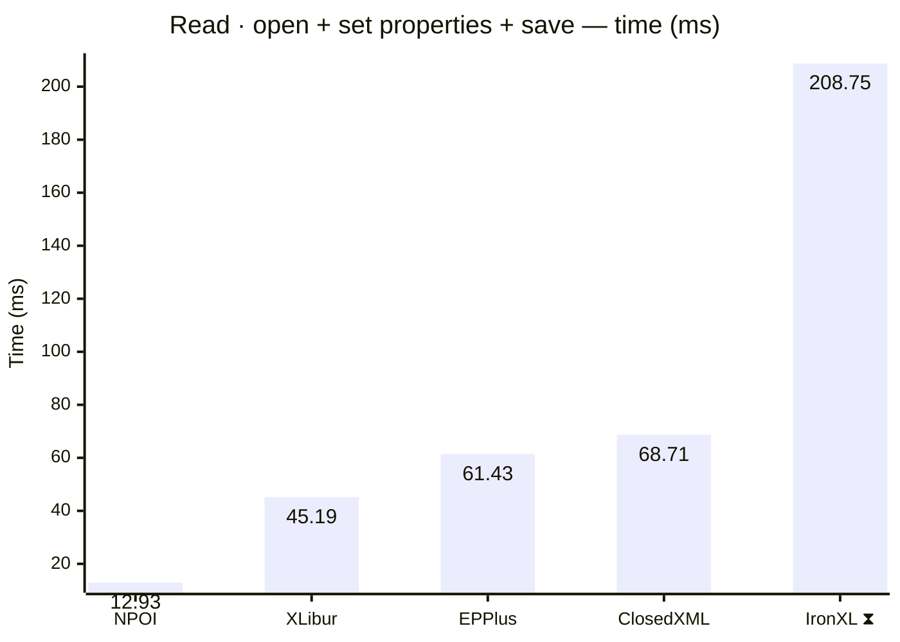
```mermaid
---
config:
  xyChart:
    showDataLabel: true
---
xychart-beta
    title "Read · open + set properties + save — time (ms)"
    x-axis ["NPOI", "XLibur", "EPPlus", "ClosedXML", "IronXL ⧗"]
    y-axis "Time (ms)"
    bar [12.93, 45.19, 61.43, 68.71, 208.75]
```

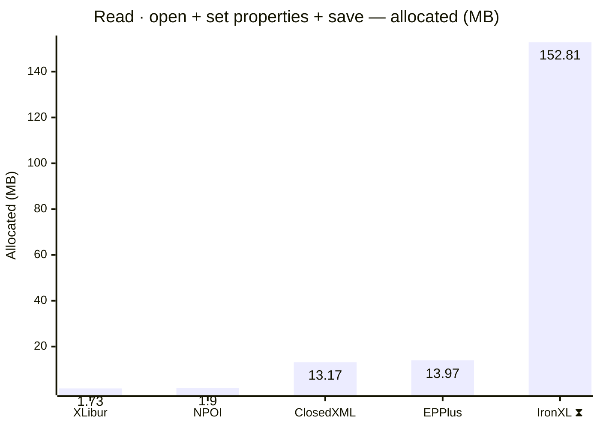
```mermaid
---
config:
  xyChart:
    showDataLabel: true
---
xychart-beta
    title "Read · open + set properties + save — allocated (MB)"
    x-axis ["XLibur", "NPOI", "ClosedXML", "EPPlus", "IronXL ⧗"]
    y-axis "Allocated (MB)"
    bar [1.73, 1.9, 13.17, 13.97, 152.81]
```

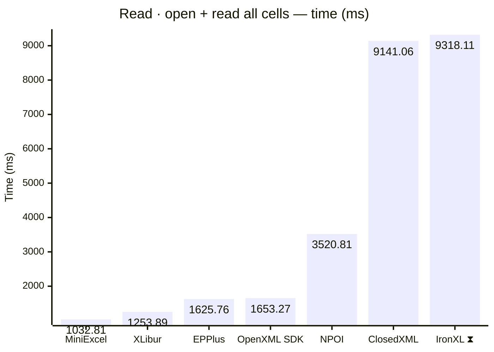
```mermaid
---
config:
  xyChart:
    showDataLabel: true
---
xychart-beta
    title "Read · open + read all cells — time (ms)"
    x-axis ["MiniExcel", "XLibur", "EPPlus", "OpenXML SDK", "NPOI", "ClosedXML", "IronXL ⧗"]
    y-axis "Time (ms)"
    bar [1032.81, 1253.89, 1625.76, 1653.27, 3520.81, 9141.06, 9318.11]
```

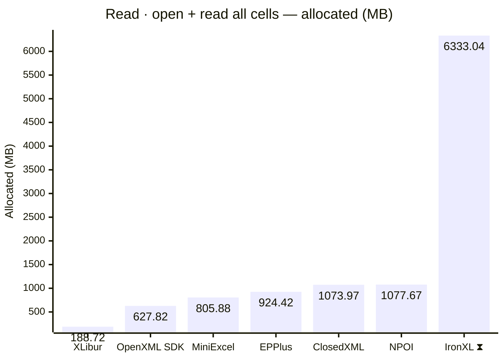
```mermaid
---
config:
  xyChart:
    showDataLabel: true
---
xychart-beta
    title "Read · open + read all cells — allocated (MB)"
    x-axis ["XLibur", "OpenXML SDK", "MiniExcel", "EPPlus", "ClosedXML", "NPOI", "IronXL ⧗"]
    y-axis "Allocated (MB)"
    bar [188.72, 627.82, 805.88, 924.42, 1073.97, 1077.67, 6333.04]
```

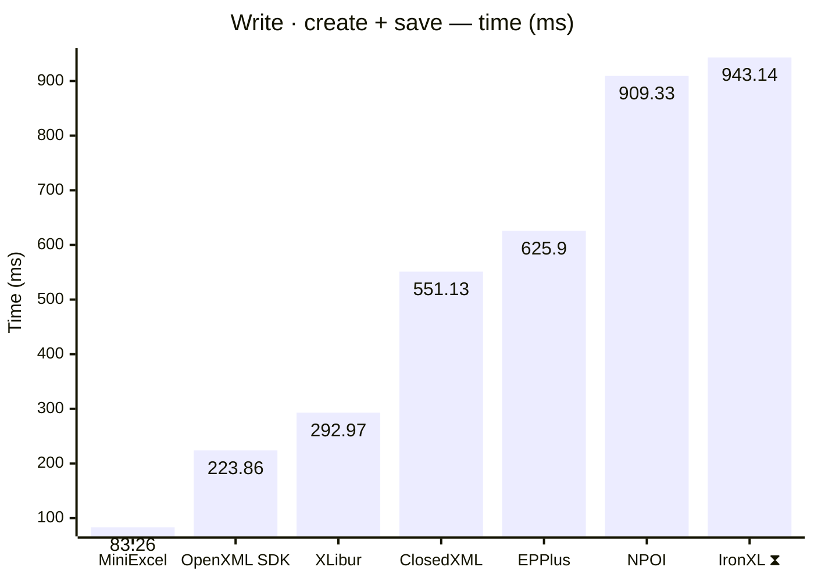
```mermaid
---
config:
  xyChart:
    showDataLabel: true
---
xychart-beta
    title "Write · create + save — time (ms)"
    x-axis ["MiniExcel", "OpenXML SDK", "XLibur", "ClosedXML", "EPPlus", "NPOI", "IronXL ⧗"]
    y-axis "Time (ms)"
    bar [83.26, 223.86, 292.97, 551.13, 625.9, 909.33, 943.14]
```

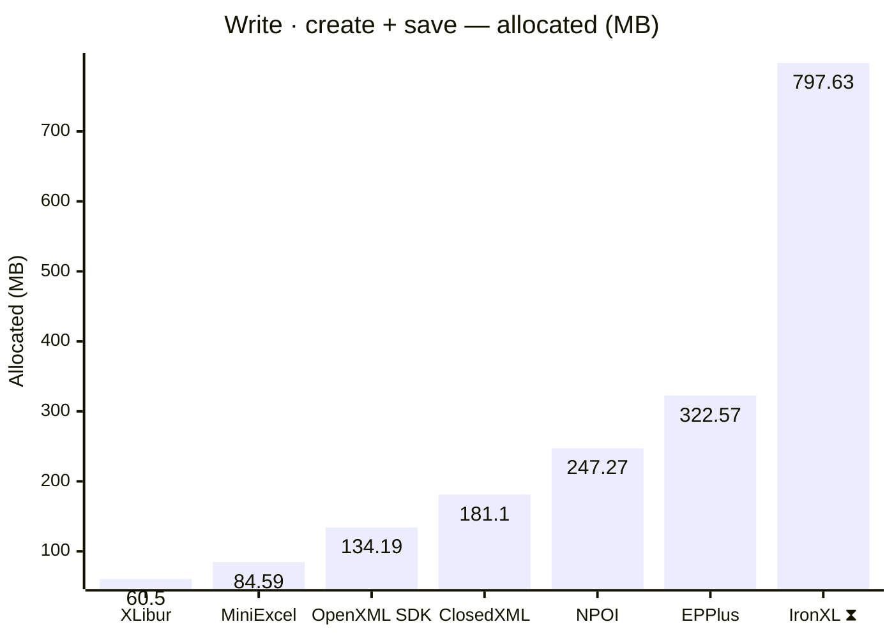
```mermaid
---
config:
  xyChart:
    showDataLabel: true
---
xychart-beta
    title "Write · create + save — allocated (MB)"
    x-axis ["XLibur", "MiniExcel", "OpenXML SDK", "ClosedXML", "NPOI", "EPPlus", "IronXL ⧗"]
    y-axis "Allocated (MB)"
    bar [60.5, 84.59, 134.19, 181.1, 247.27, 322.57, 797.63]
```

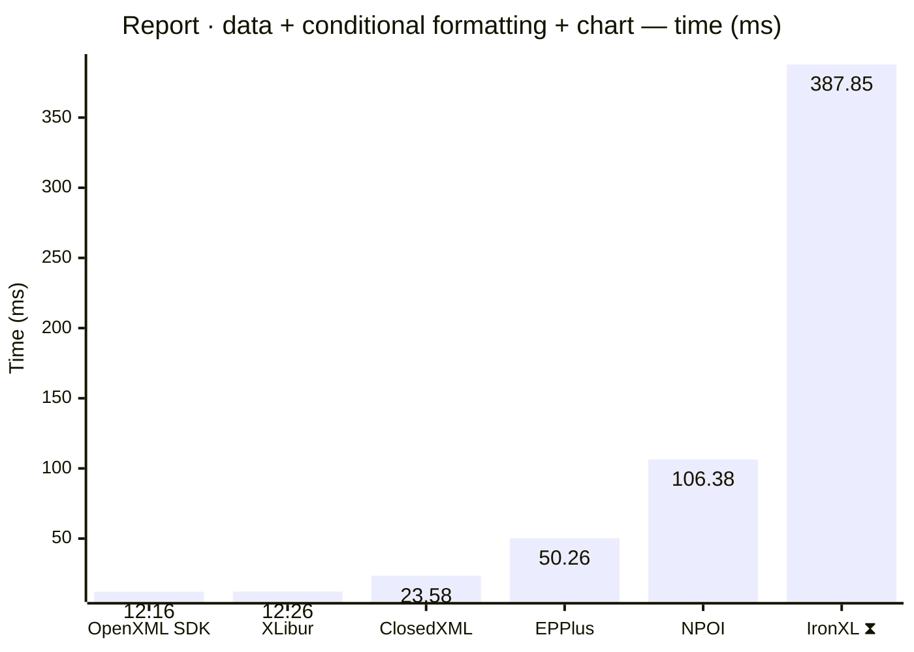
```mermaid
---
config:
  xyChart:
    showDataLabel: true
---
xychart-beta
    title "Report · data + conditional formatting + chart — time (ms)"
    x-axis ["OpenXML SDK", "XLibur", "ClosedXML", "EPPlus", "NPOI", "IronXL ⧗"]
    y-axis "Time (ms)"
    bar [12.16, 12.26, 23.58, 50.26, 106.38, 387.85]
```

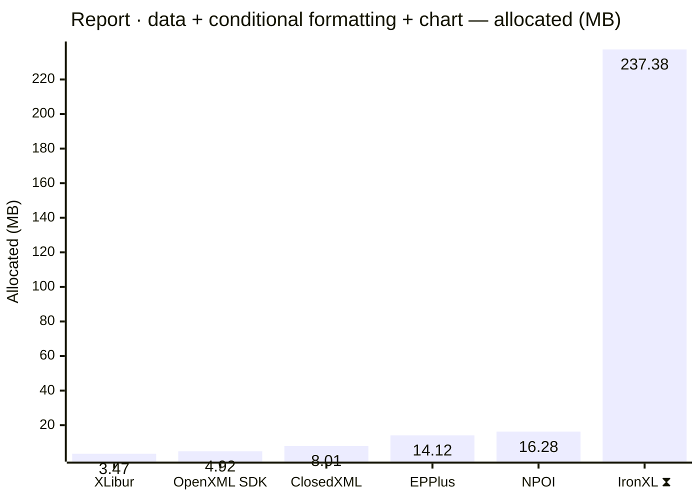
```mermaid
---
config:
  xyChart:
    showDataLabel: true
---
xychart-beta
    title "Report · data + conditional formatting + chart — allocated (MB)"
    x-axis ["XLibur", "OpenXML SDK", "ClosedXML", "EPPlus", "NPOI", "IronXL ⧗"]
    y-axis "Allocated (MB)"
    bar [3.47, 4.92, 8.01, 14.12, 16.28, 237.38]
```

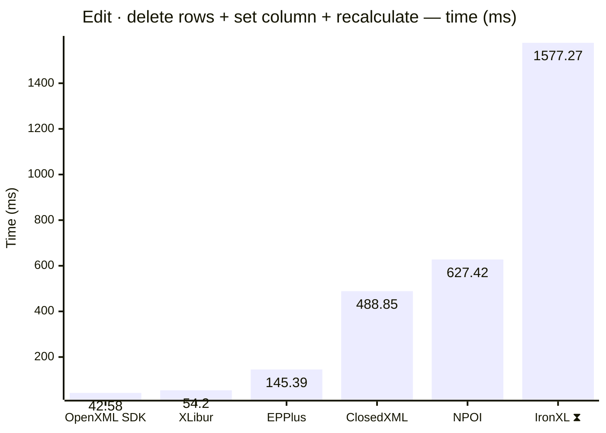
```mermaid
---
config:
  xyChart:
    showDataLabel: true
---
xychart-beta
    title "Edit · delete rows + set column + recalculate — time (ms)"
    x-axis ["OpenXML SDK", "XLibur", "EPPlus", "ClosedXML", "NPOI", "IronXL ⧗"]
    y-axis "Time (ms)"
    bar [42.58, 54.2, 145.39, 488.85, 627.42, 1577.27]
```

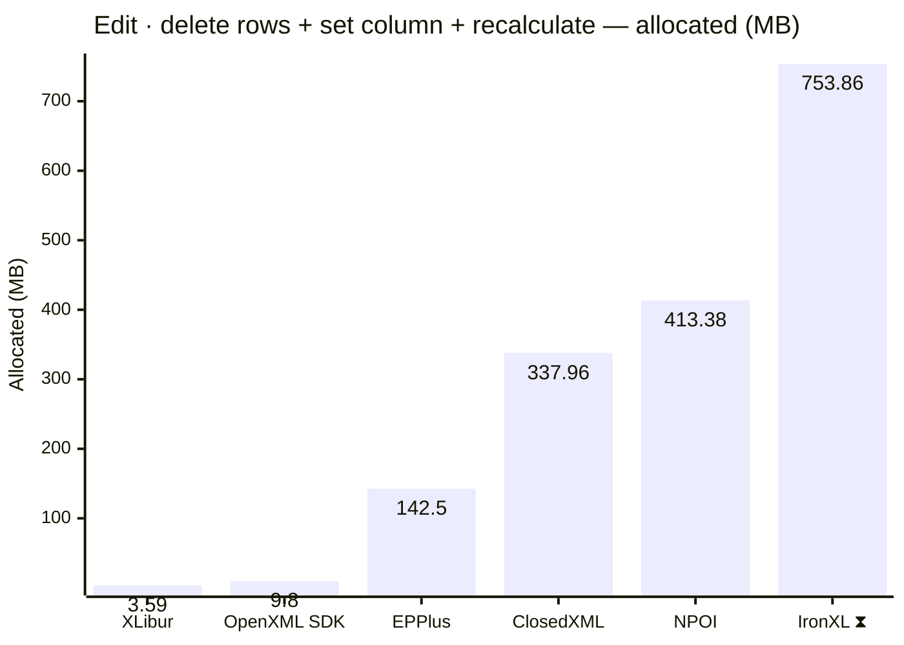
```mermaid
---
config:
  xyChart:
    showDataLabel: true
---
xychart-beta
    title "Edit · delete rows + set column + recalculate — allocated (MB)"
    x-axis ["XLibur", "OpenXML SDK", "EPPlus", "ClosedXML", "NPOI", "IronXL ⧗"]
    y-axis "Allocated (MB)"
    bar [3.59, 9.8, 142.5, 337.96, 413.38, 753.86]
```

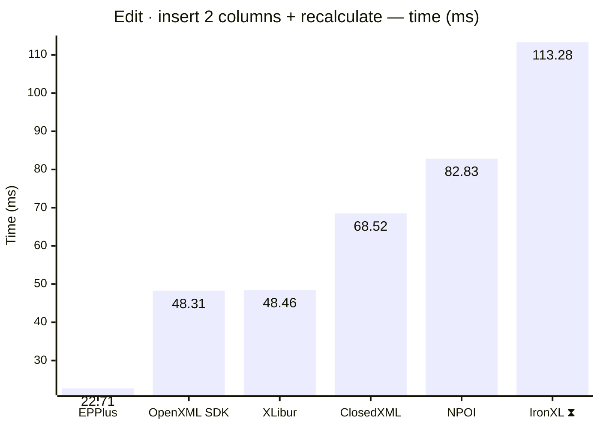
```mermaid
---
config:
  xyChart:
    showDataLabel: true
---
xychart-beta
    title "Edit · insert 2 columns + recalculate — time (ms)"
    x-axis ["EPPlus", "OpenXML SDK", "XLibur", "ClosedXML", "NPOI", "IronXL ⧗"]
    y-axis "Time (ms)"
    bar [22.71, 48.31, 48.46, 68.52, 82.83, 113.28]
```

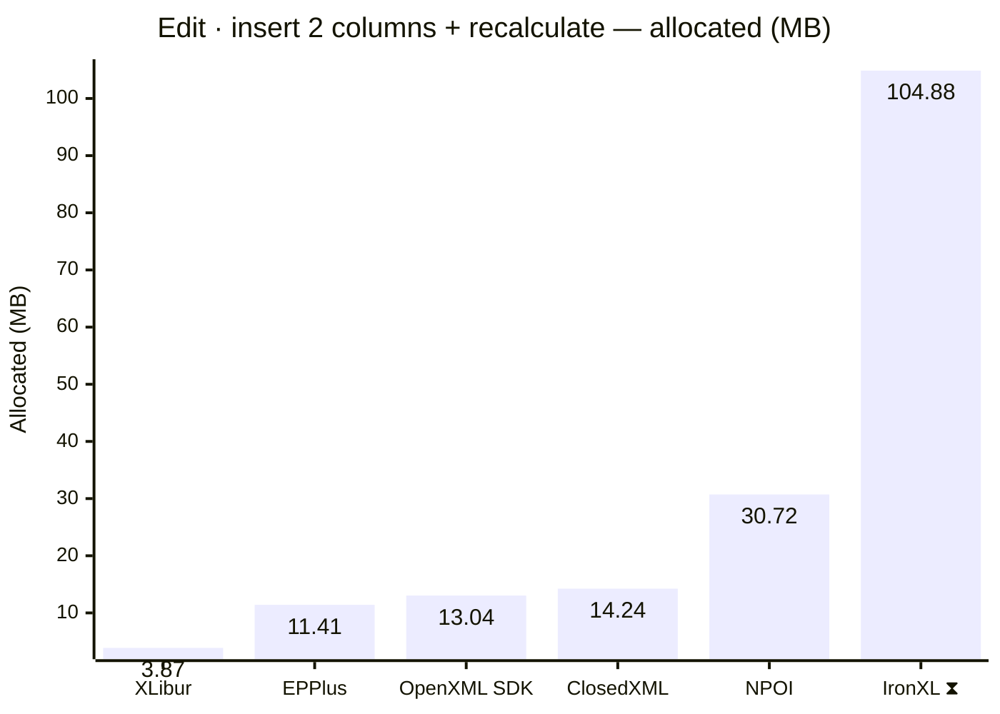
```mermaid
---
config:
  xyChart:
    showDataLabel: true
---
xychart-beta
    title "Edit · insert 2 columns + recalculate — allocated (MB)"
    x-axis ["XLibur", "EPPlus", "OpenXML SDK", "ClosedXML", "NPOI", "IronXL ⧗"]
    y-axis "Allocated (MB)"
    bar [3.87, 11.41, 13.04, 14.24, 30.72, 104.88]
```

## Detailed results


```

BenchmarkDotNet v0.15.8, Linux Ubuntu 24.04.5 LTS (Noble Numbat)
AMD EPYC 7763 3.21GHz, 1 CPU, 4 logical and 2 physical cores
.NET SDK 10.0.401
  [Host]   : .NET 10.0.12 (10.0.12, 10.0.1226.42308), X64 RyuJIT x86-64-v3
  ShortRun : .NET 10.0.12 (10.0.12, 10.0.1226.42308), X64 RyuJIT x86-64-v3

Job=ShortRun  IterationCount=3  LaunchCount=1  
WarmupCount=3  

```

### Read · open + set properties + save

| Library     | Type                      | Method                      | Mean        | Error        | StdDev     | Median      | Gen0       | Gen1       | Gen2      | Allocated  |
|------------ |-------------------------- |---------------------------- |------------:|-------------:|-----------:|------------:|-----------:|-----------:|----------:|-----------:|
| NPOI        | NpoiReadBenchmarks        | OpenAmendPropertiesAndSave  |    12.93 ms |     6.792 ms |   0.372 ms |    12.79 ms |    62.5000 |          - |         - |     1.9 MB |
| XLibur      | XLiburReadBenchmarks      | OpenAmendPropertiesAndSave  |    45.19 ms |   339.890 ms |  18.631 ms |    50.80 ms |          - |          - |         - |    1.73 MB |
| EPPlus      | EpPlusReadBenchmarks      | OpenAmendPropertiesAndSave  |    61.43 ms |   331.612 ms |  18.177 ms |    67.71 ms |  1000.0000 |  1000.0000 | 1000.0000 |   13.97 MB |
| ClosedXML   | ClosedXmlReadBenchmarks   | OpenAmendPropertiesAndSave  |    68.71 ms |   626.855 ms |  34.360 ms |    50.00 ms |   750.0000 |   250.0000 |         - |   13.17 MB |
| IronXL ⧗ | IronXlReadBenchmarks | OpenAmendPropertiesAndSave | 208.746 ms | 155.7570 ms | 92.6885 ms | 168.705 ms | 9000.0000 | 2000.0000 | - | 152.81 MB |

### Read · open + read all cells

| Library     | Type                      | Method                      | Mean        | Error        | StdDev     | Median      | Gen0       | Gen1       | Gen2      | Allocated  |
|------------ |-------------------------- |---------------------------- |------------:|-------------:|-----------:|------------:|-----------:|-----------:|----------:|-----------:|
| MiniExcel   | MiniExcelReadBenchmarks   | OpenAndReadAll              | 1,032.81 ms |   128.358 ms |   7.036 ms | 1,031.89 ms | 51000.0000 |  4000.0000 | 1000.0000 |  805.88 MB |
| XLibur      | XLiburReadBenchmarks      | OpenAndReadAll              | 1,253.89 ms |   283.872 ms |  15.560 ms | 1,245.06 ms | 13000.0000 |  8000.0000 | 2000.0000 |  188.72 MB |
| EPPlus      | EpPlusReadBenchmarks      | OpenAndReadAll              | 1,625.76 ms |    39.955 ms |   2.190 ms | 1,625.86 ms | 49000.0000 | 14000.0000 | 7000.0000 |  924.42 MB |
| OpenXML SDK | OpenXmlReadBenchmarks     | OpenAndReadAll              | 1,653.27 ms |   209.329 ms |  11.474 ms | 1,647.89 ms | 40000.0000 |  6000.0000 | 1000.0000 |  627.82 MB |
| NPOI        | NpoiReadBenchmarks        | OpenAndReadAll              | 3,520.81 ms | 4,738.994 ms | 259.760 ms | 3,665.69 ms | 67000.0000 | 62000.0000 | 6000.0000 | 1077.67 MB |
| ClosedXML   | ClosedXmlReadBenchmarks   | OpenAndReadAll              | 9,141.06 ms |   604.527 ms |  33.136 ms | 9,134.48 ms | 60000.0000 | 24000.0000 | 4000.0000 | 1073.97 MB |
| IronXL ⧗ | IronXlReadBenchmarks | OpenAndReadAll | 9,318.107 ms | 477.3336 ms | 315.7266 ms | 9,377.407 ms | 393000.0000 | 202000.0000 | 10000.0000 | 6333.04 MB |

### Write · create + save

| Library     | Type                      | Method                      | Mean        | Error        | StdDev     | Median      | Gen0       | Gen1       | Gen2      | Allocated  |
|------------ |-------------------------- |---------------------------- |------------:|-------------:|-----------:|------------:|-----------:|-----------:|----------:|-----------:|
| MiniExcel   | MiniExcelWriteBenchmarks  | CreateAndSave               |    83.26 ms |    12.725 ms |   0.697 ms |    83.34 ms |  5500.0000 |  1666.6667 | 1500.0000 |   84.59 MB |
| OpenXML SDK | OpenXmlWriteBenchmarks    | CreateAndSave               |   223.86 ms |     9.626 ms |   0.528 ms |   223.82 ms |  9000.0000 |  2333.3333 | 2333.3333 |  134.19 MB |
| XLibur      | XLiburWriteBenchmarks     | CreateAndSave               |   292.97 ms |    13.770 ms |   0.755 ms |   293.29 ms |  3000.0000 |  2000.0000 | 2000.0000 |    60.5 MB |
| ClosedXML   | ClosedXmlWriteBenchmarks  | CreateAndSave               |   551.13 ms |   142.326 ms |   7.801 ms |   547.22 ms | 11000.0000 |  6000.0000 | 3000.0000 |   181.1 MB |
| EPPlus      | EpPlusWriteBenchmarks     | CreateAndSave               |   625.90 ms |    27.750 ms |   1.521 ms |   625.85 ms | 20000.0000 |  9000.0000 | 3000.0000 |  322.57 MB |
| NPOI        | NpoiWriteBenchmarks       | CreateAndSave               |   909.33 ms |   245.926 ms |  13.480 ms |   901.99 ms | 16000.0000 | 12000.0000 | 3000.0000 |  247.27 MB |
| IronXL ⧗ | IronXlWriteBenchmarks | CreateAndSave | 943.137 ms | 18.5191 ms | 11.0204 ms | 938.999 ms | 48000.0000 | 16000.0000 | 3000.0000 | 797.63 MB |

### Report · data + conditional formatting + chart

| Library     | Type                      | Method                      | Mean        | Error        | StdDev     | Median      | Gen0       | Gen1       | Gen2      | Allocated  |
|------------ |-------------------------- |---------------------------- |------------:|-------------:|-----------:|------------:|-----------:|-----------:|----------:|-----------:|
| OpenXML SDK | OpenXmlReportBenchmarks   | CreateStockReport           |    12.16 ms |     1.493 ms |   0.082 ms |    12.15 ms |   375.0000 |   359.3750 |  187.5000 |    4.92 MB |
| XLibur      | XLiburReportBenchmarks    | CreateStockReport           |    12.26 ms |     4.911 ms |   0.269 ms |    12.11 ms |   187.5000 |   187.5000 |  187.5000 |    3.47 MB |
| ClosedXML   | ClosedXmlReportBenchmarks | CreateStockReport           |    23.58 ms |     3.329 ms |   0.182 ms |    23.48 ms |   468.7500 |   343.7500 |  187.5000 |    8.01 MB |
| EPPlus      | EpPlusReportBenchmarks    | CreateStockReport           |    50.26 ms |    26.258 ms |   1.439 ms |    50.21 ms |  1000.0000 |  1000.0000 | 1000.0000 |   14.12 MB |
| NPOI        | NpoiReportBenchmarks      | CreateStockReport           |   106.38 ms |   328.413 ms |  18.001 ms |   114.28 ms |   750.0000 |   500.0000 |  250.0000 |   16.28 MB |
| IronXL ⧗ | IronXlReportBenchmarks | CreateStockReport | 387.849 ms | 36.5456 ms | 24.1726 ms | 384.092 ms | 14000.0000 | 3000.0000 | - | 237.38 MB |

### Edit · delete rows + set column + recalculate

| Library     | Type                      | Method                      | Mean        | Error        | StdDev     | Median      | Gen0       | Gen1       | Gen2      | Allocated  |
|------------ |-------------------------- |---------------------------- |------------:|-------------:|-----------:|------------:|-----------:|-----------:|----------:|-----------:|
| OpenXML SDK | OpenXmlEditBenchmarks     | EditAndRecalculate          |    42.58 ms |   109.241 ms |   5.988 ms |    42.35 ms |   500.0000 |   250.0000 |         - |     9.8 MB |
| XLibur      | XLiburEditBenchmarks      | EditAndRecalculate          |    54.20 ms |   116.430 ms |   6.382 ms |    55.87 ms |   142.8571 |          - |         - |    3.59 MB |
| EPPlus      | EpPlusEditBenchmarks      | EditAndRecalculate          |   145.39 ms |   147.295 ms |   8.074 ms |   149.75 ms |  9000.0000 |  1333.3333 | 1000.0000 |   142.5 MB |
| ClosedXML   | ClosedXmlEditBenchmarks   | EditAndRecalculate          |   488.85 ms |    73.543 ms |   4.031 ms |   487.59 ms | 21000.0000 |  1000.0000 |         - |  337.96 MB |
| NPOI        | NpoiEditBenchmarks        | EditAndRecalculate          |   627.42 ms |   382.934 ms |  20.990 ms |   625.03 ms | 25000.0000 |  1000.0000 |         - |  413.38 MB |
| IronXL ⧗ | IronXlEditBenchmarks | EditAndRecalculate | 1,577.273 ms | 62.9583 ms | 41.6430 ms | 1,583.098 ms | 57000.0000 | 36000.0000 | 15000.0000 | 753.86 MB |

### Edit · insert 2 columns + recalculate

| Library     | Type                      | Method                      | Mean        | Error        | StdDev     | Median      | Gen0       | Gen1       | Gen2      | Allocated  |
|------------ |-------------------------- |---------------------------- |------------:|-------------:|-----------:|------------:|-----------:|-----------:|----------:|-----------:|
| EPPlus      | EpPlusInsertBenchmarks    | InsertColumnsAndRecalculate |    22.71 ms |     6.850 ms |   0.375 ms |    22.71 ms |  1000.0000 |  1000.0000 | 1000.0000 |   11.41 MB |
| OpenXML SDK | OpenXmlInsertBenchmarks   | InsertColumnsAndRecalculate |    48.31 ms |    39.414 ms |   2.160 ms |    48.43 ms |   750.0000 |   500.0000 |  250.0000 |   13.04 MB |
| XLibur      | XLiburInsertBenchmarks    | InsertColumnsAndRecalculate |    48.46 ms |   102.169 ms |   5.600 ms |    46.74 ms |   142.8571 |          - |         - |    3.87 MB |
| ClosedXML   | ClosedXmlInsertBenchmarks | InsertColumnsAndRecalculate |    68.52 ms |   116.922 ms |   6.409 ms |    68.59 ms |   666.6667 |   333.3333 |         - |   14.24 MB |
| NPOI        | NpoiInsertBenchmarks      | InsertColumnsAndRecalculate |    82.83 ms |   286.705 ms |  15.715 ms |    86.37 ms |  2000.0000 |  1500.0000 |  500.0000 |   30.72 MB |
| IronXL ⧗ | IronXlInsertBenchmarks | InsertColumnsAndRecalculate | 113.284 ms | 41.9750 ms | 27.7638 ms | 97.052 ms | 7000.0000 | 2500.0000 | 750.0000 | 104.88 MB |


<script type="module">
  import mermaid from 'https://cdn.jsdelivr.net/npm/mermaid@11/dist/mermaid.esm.min.mjs';
  const blocks = document.querySelectorAll('.language-mermaid');
  blocks.forEach(el => {
    const code = el.querySelector('code') || el;
    const pre = document.createElement('pre');
    pre.className = 'mermaid';
    pre.textContent = code.textContent;
    el.replaceWith(pre);
  });
  if (blocks.length) {
    mermaid.initialize({ startOnLoad: false });
    await mermaid.run({ querySelector: 'pre.mermaid' });
  }
</script>

<script>
(function () {
  const parse = s => { const n = parseFloat(String(s).replace(/,/g, '')); return Number.isFinite(n) ? n : null; };
  document.querySelectorAll('table').forEach(table => {
    if (!table.tHead || !table.tBodies[0]) return;
    const heads = [...table.tHead.rows[0].cells].map(c => c.textContent.trim().toLowerCase());
    if (!heads.includes('mean')) return;
    const metricCols = heads.map((h, i) => /^(mean|allocated|gen0|gen1|gen2)$/.test(h) ? i : -1).filter(i => i >= 0);
    const rows = [...table.tBodies[0].rows];
    for (const c of metricCols) {
      const vals = rows.map(r => parse(r.cells[c]?.textContent));
      const nums = vals.filter(v => v !== null);
      if (nums.length < 2) continue;
      const min = Math.min(...nums), max = Math.max(...nums);
      if (max === min) continue;
      rows.forEach((r, i) => {
        const v = vals[i]; if (v === null) return;
        const ratio = (v - min) / (max - min);
        r.cells[c].style.backgroundColor = `hsla(${120 - 120 * ratio}, 70%, 50%, 0.45)`;
      });
    }
  });
})();
</script>
