<style>
  .main-content { max-width: 90% !important; padding-left: 2rem !important; padding-right: 2rem !important; }
</style>
<!-- Generated by XLBench. Do not edit by hand; re-run scripts/run-benchmarks.ps1. -->
# XLBench Results

Each section below embeds the full BenchmarkDotNet environment block (OS, CPU,
.NET SDK and runtime). Timings are hardware-specific; treat the allocation/GC
columns as the most portable signal across machines. Regenerate locally with
`scripts/run-benchmarks.ps1`.

> ⚠️ Generated on a shared GitHub Actions runner — timings are indicative and vary run to run; allocation/memory figures are reliable. Authoritative timings come from a local run: [results.html](results.html).

📈 **[Interactive charts](charts.html)** (GitHub Pages). Static charts and the full tables follow.

Each results table (one per test method) is heat-mapped independently on the Pages site (🟩 best → 🟥 worst).

> ⧗ **Carried over from an earlier run.** The rows and chart points below marked with this symbol were not measured here — the library is commercial and needs a licence key this run did not have — so they are replayed from `snapshots/`. Compare them as indicative rather than like-for-like, and see the repository README for how to refresh a snapshot.
>
> - **IronXL** 2026.8.1, Job-HTCPYF job, captured 2026-08-03 on different hardware — Windows 11 (10.0.22631.6199/23H2/2023Update/SunValley3), AMD Ryzen 9 5950X 16-Core Processor.

## Libraries under test

| Library | Version | Source |
| --- | --- | --- |
| ClosedXML | 0.105.1 | this run |
| EPPlus | 8.7.2 | this run |
| OpenXML SDK | 3.5.1 | this run |
| NPOI | 2.8.1 | this run |
| MiniExcel | 1.46.0 | this run |
| Sylvan | 0.5.8 | this run |
| XLibur | 0.800.0 | this run |
| OfficeIMO | 3.5.3 | this run |
| IronXL ⧗ | 2026.8.1 | snapshot (2026.8.1, Job-HTCPYF, captured 2026-08-03) |

## Comparison charts

_Lower is better. Charts render in the GitHub file view; the Pages site has interactive versions._

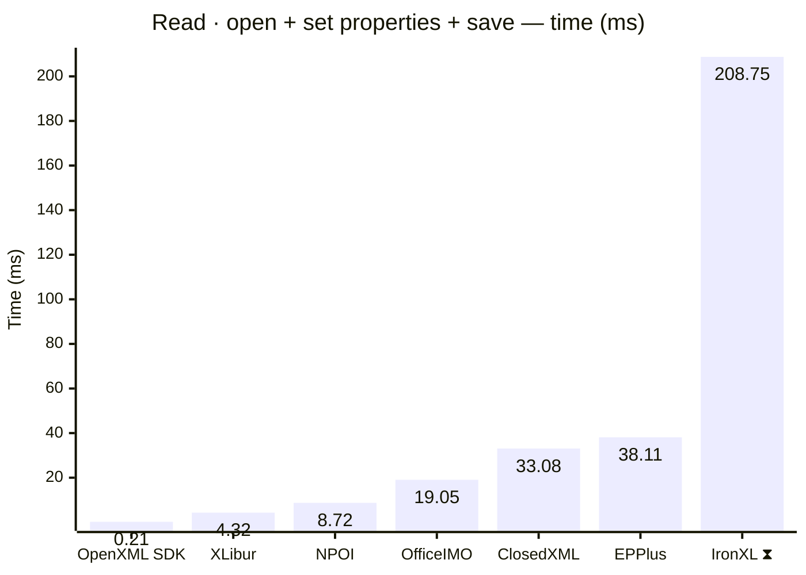
```mermaid
---
config:
  xyChart:
    showDataLabel: true
---
xychart-beta
    title "Read · open + set properties + save — time (ms)"
    x-axis ["OpenXML SDK", "XLibur", "NPOI", "OfficeIMO", "ClosedXML", "EPPlus", "IronXL ⧗"]
    y-axis "Time (ms)"
    bar [0.21, 4.32, 8.72, 19.05, 33.08, 38.11, 208.75]
```

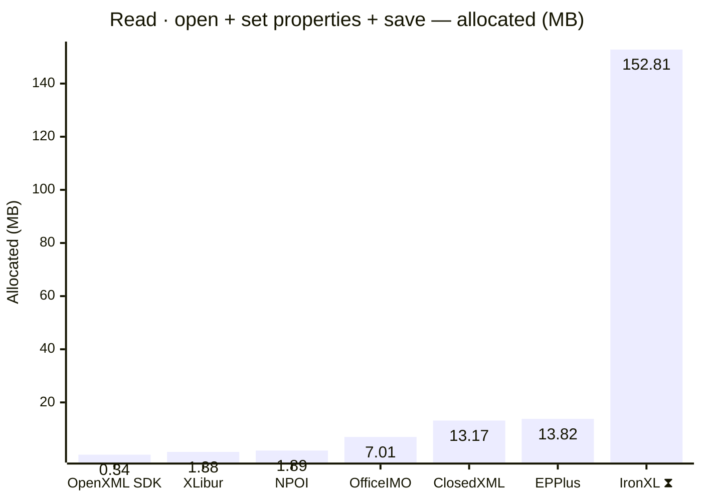
```mermaid
---
config:
  xyChart:
    showDataLabel: true
---
xychart-beta
    title "Read · open + set properties + save — allocated (MB)"
    x-axis ["OpenXML SDK", "XLibur", "NPOI", "OfficeIMO", "ClosedXML", "EPPlus", "IronXL ⧗"]
    y-axis "Allocated (MB)"
    bar [0.34, 1.38, 1.89, 7.01, 13.17, 13.82, 152.81]
```

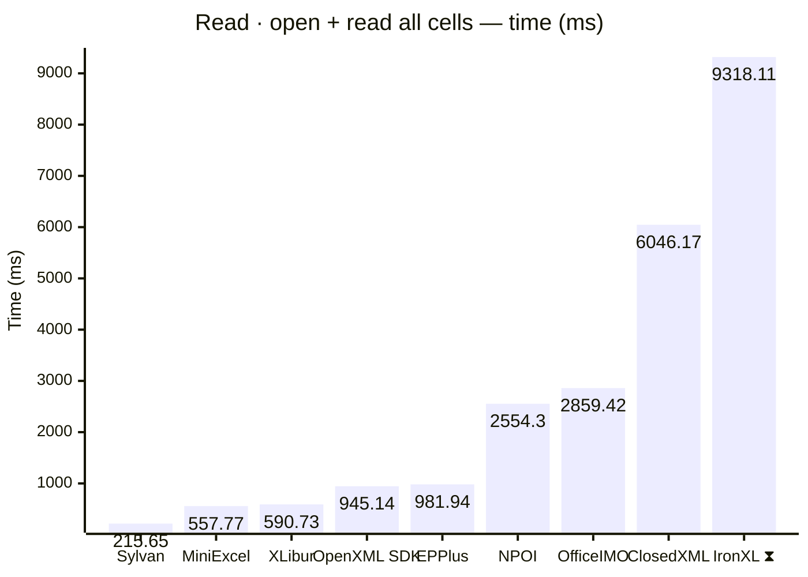
```mermaid
---
config:
  xyChart:
    showDataLabel: true
---
xychart-beta
    title "Read · open + read all cells — time (ms)"
    x-axis ["Sylvan", "MiniExcel", "XLibur", "OpenXML SDK", "EPPlus", "NPOI", "OfficeIMO", "ClosedXML", "IronXL ⧗"]
    y-axis "Time (ms)"
    bar [215.65, 557.77, 590.73, 945.14, 981.94, 2554.3, 2859.42, 6046.17, 9318.11]
```

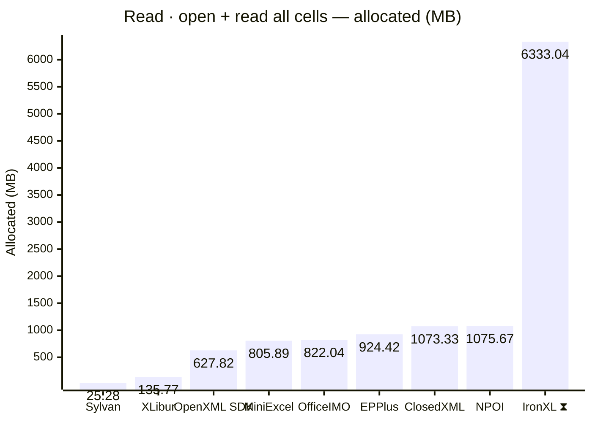
```mermaid
---
config:
  xyChart:
    showDataLabel: true
---
xychart-beta
    title "Read · open + read all cells — allocated (MB)"
    x-axis ["Sylvan", "XLibur", "OpenXML SDK", "MiniExcel", "OfficeIMO", "EPPlus", "ClosedXML", "NPOI", "IronXL ⧗"]
    y-axis "Allocated (MB)"
    bar [25.28, 135.77, 627.82, 805.89, 822.04, 924.42, 1073.33, 1075.67, 6333.04]
```

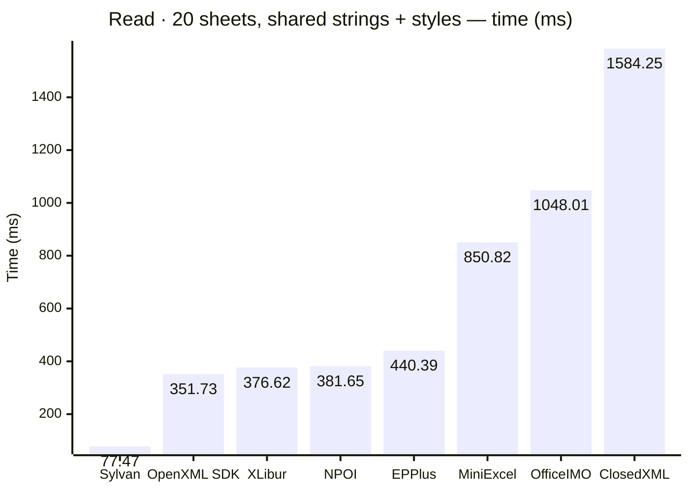
```mermaid
---
config:
  xyChart:
    showDataLabel: true
---
xychart-beta
    title "Read · 20 sheets, shared strings + styles — time (ms)"
    x-axis ["Sylvan", "OpenXML SDK", "XLibur", "NPOI", "EPPlus", "MiniExcel", "OfficeIMO", "ClosedXML"]
    y-axis "Time (ms)"
    bar [77.47, 351.73, 376.62, 381.65, 440.39, 850.82, 1048.01, 1584.25]
```


```mermaid
---
config:
  xyChart:
    showDataLabel: true
---
xychart-beta
    title "Read · 20 sheets, shared strings + styles — allocated (MB)"
    x-axis ["Sylvan", "OpenXML SDK", "XLibur", "NPOI", "EPPlus", "OfficeIMO", "ClosedXML", "MiniExcel"]
    y-axis "Allocated (MB)"
    bar [21.6, 162.81, 176.79, 211.8, 360.64, 509.38, 1017.41, 1087.22]
```

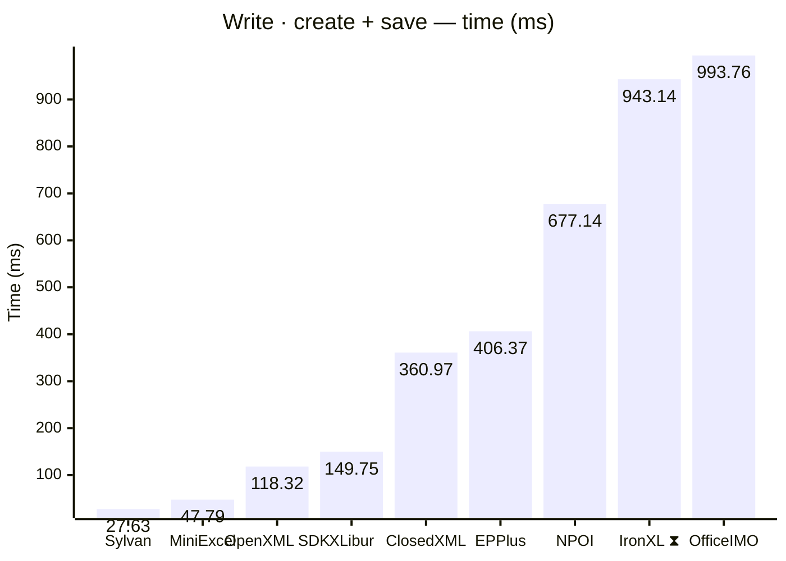
```mermaid
---
config:
  xyChart:
    showDataLabel: true
---
xychart-beta
    title "Write · create + save — time (ms)"
    x-axis ["Sylvan", "MiniExcel", "OpenXML SDK", "XLibur", "ClosedXML", "EPPlus", "NPOI", "IronXL ⧗", "OfficeIMO"]
    y-axis "Time (ms)"
    bar [27.63, 47.79, 118.32, 149.75, 360.97, 406.37, 677.14, 943.14, 993.76]
```


```mermaid
---
config:
  xyChart:
    showDataLabel: true
---
xychart-beta
    title "Write · create + save — allocated (MB)"
    x-axis ["Sylvan", "XLibur", "MiniExcel", "OpenXML SDK", "ClosedXML", "NPOI", "EPPlus", "OfficeIMO", "IronXL ⧗"]
    y-axis "Allocated (MB)"
    bar [13.27, 60.19, 84.59, 134.19, 181.09, 246.27, 322.56, 406.68, 797.63]
```

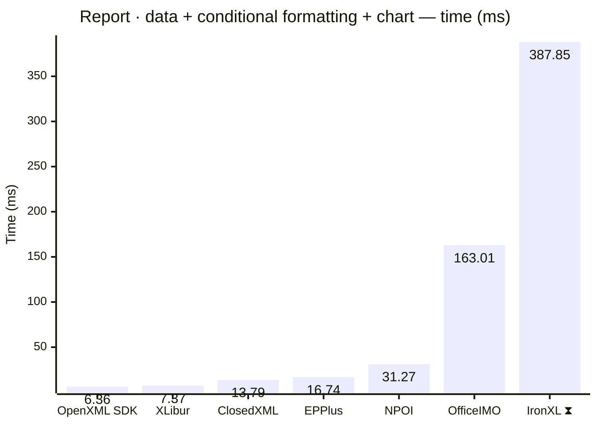
```mermaid
---
config:
  xyChart:
    showDataLabel: true
---
xychart-beta
    title "Report · data + conditional formatting + chart — time (ms)"
    x-axis ["OpenXML SDK", "XLibur", "ClosedXML", "EPPlus", "NPOI", "OfficeIMO", "IronXL ⧗"]
    y-axis "Time (ms)"
    bar [6.36, 7.37, 13.79, 16.74, 31.27, 163.01, 387.85]
```

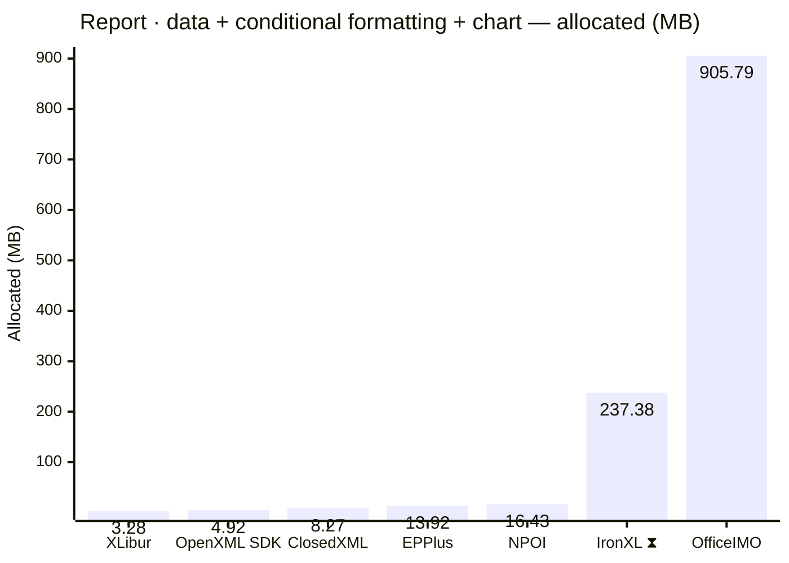
```mermaid
---
config:
  xyChart:
    showDataLabel: true
---
xychart-beta
    title "Report · data + conditional formatting + chart — allocated (MB)"
    x-axis ["XLibur", "OpenXML SDK", "ClosedXML", "EPPlus", "NPOI", "IronXL ⧗", "OfficeIMO"]
    y-axis "Allocated (MB)"
    bar [3.28, 4.92, 8.27, 13.92, 16.43, 237.38, 905.79]
```

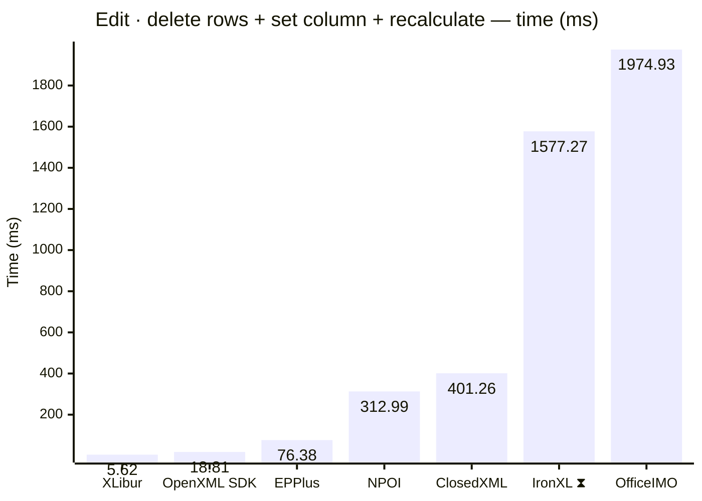
```mermaid
---
config:
  xyChart:
    showDataLabel: true
---
xychart-beta
    title "Edit · delete rows + set column + recalculate — time (ms)"
    x-axis ["XLibur", "OpenXML SDK", "EPPlus", "NPOI", "ClosedXML", "IronXL ⧗", "OfficeIMO"]
    y-axis "Time (ms)"
    bar [5.62, 18.81, 76.38, 312.99, 401.26, 1577.27, 1974.93]
```


```mermaid
---
config:
  xyChart:
    showDataLabel: true
---
xychart-beta
    title "Edit · delete rows + set column + recalculate — allocated (MB)"
    x-axis ["XLibur", "OpenXML SDK", "EPPlus", "ClosedXML", "NPOI", "OfficeIMO", "IronXL ⧗"]
    y-axis "Allocated (MB)"
    bar [2.68, 9.8, 142.49, 337.66, 413.38, 493.93, 753.86]
```

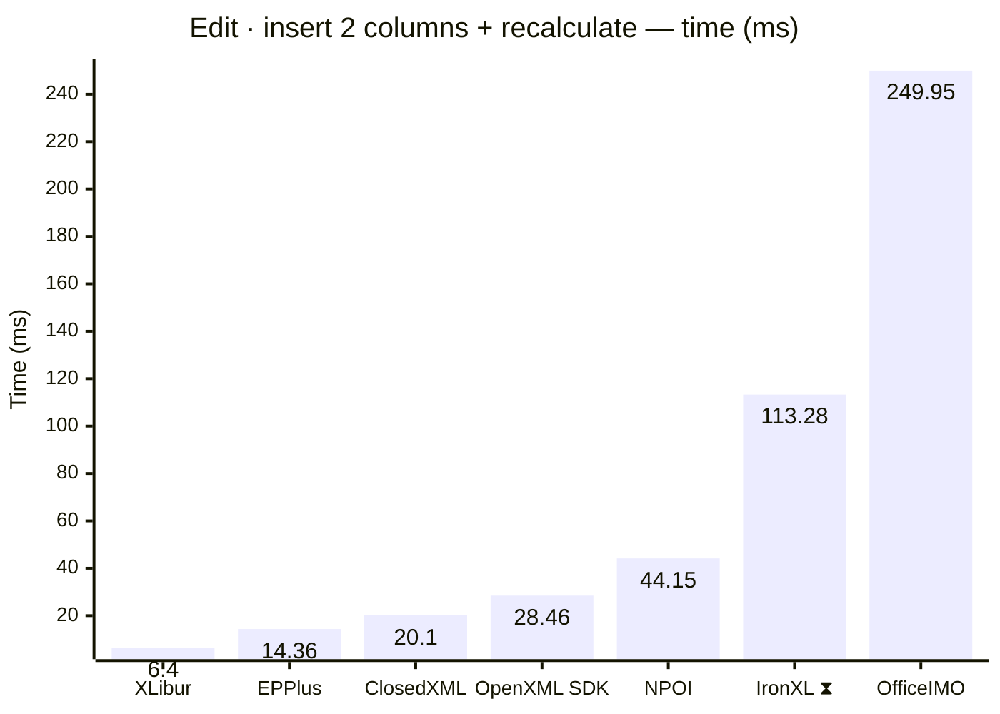
```mermaid
---
config:
  xyChart:
    showDataLabel: true
---
xychart-beta
    title "Edit · insert 2 columns + recalculate — time (ms)"
    x-axis ["XLibur", "EPPlus", "ClosedXML", "OpenXML SDK", "NPOI", "IronXL ⧗", "OfficeIMO"]
    y-axis "Time (ms)"
    bar [6.4, 14.36, 20.1, 28.46, 44.15, 113.28, 249.95]
```

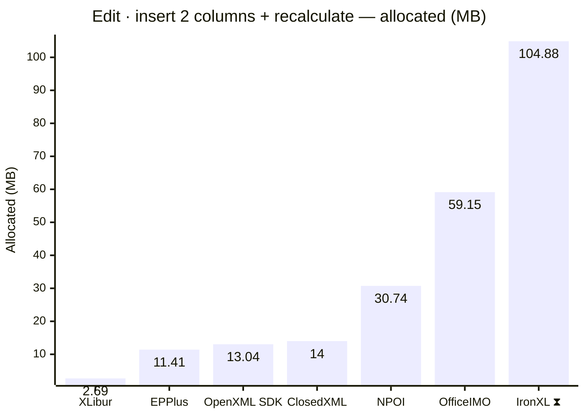
```mermaid
---
config:
  xyChart:
    showDataLabel: true
---
xychart-beta
    title "Edit · insert 2 columns + recalculate — allocated (MB)"
    x-axis ["XLibur", "EPPlus", "OpenXML SDK", "ClosedXML", "NPOI", "OfficeIMO", "IronXL ⧗"]
    y-axis "Allocated (MB)"
    bar [2.69, 11.41, 13.04, 14, 30.74, 59.15, 104.88]
```

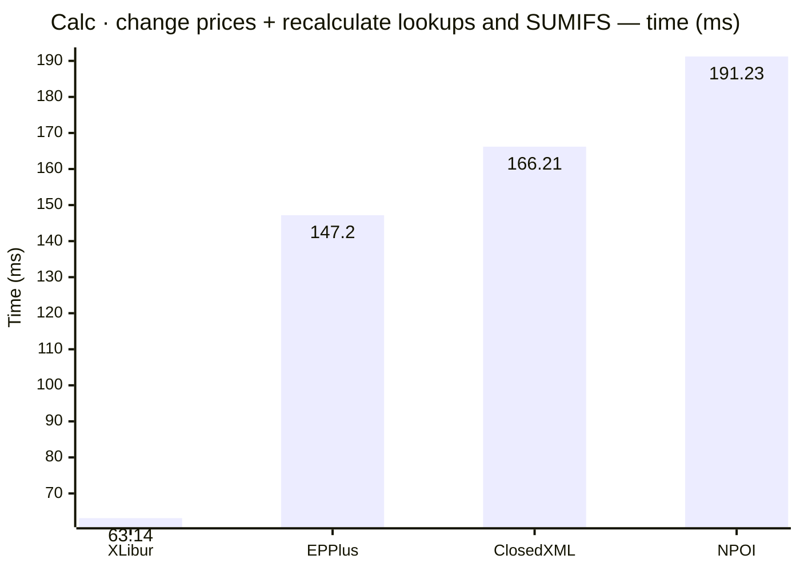
```mermaid
---
config:
  xyChart:
    showDataLabel: true
---
xychart-beta
    title "Calc · change prices + recalculate lookups and SUMIFS — time (ms)"
    x-axis ["XLibur", "EPPlus", "ClosedXML", "NPOI"]
    y-axis "Time (ms)"
    bar [63.14, 147.2, 166.21, 191.23]
```

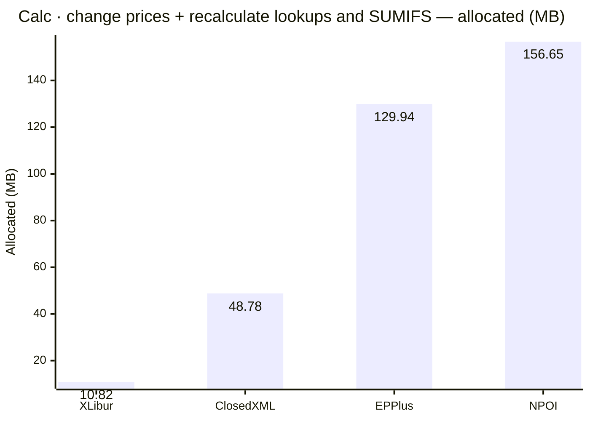
```mermaid
---
config:
  xyChart:
    showDataLabel: true
---
xychart-beta
    title "Calc · change prices + recalculate lookups and SUMIFS — allocated (MB)"
    x-axis ["XLibur", "ClosedXML", "EPPlus", "NPOI"]
    y-axis "Allocated (MB)"
    bar [10.82, 48.78, 129.94, 156.65]
```

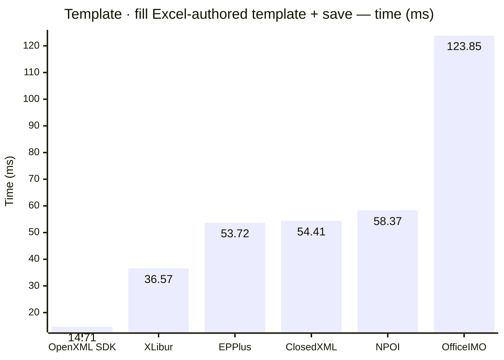
```mermaid
---
config:
  xyChart:
    showDataLabel: true
---
xychart-beta
    title "Template · fill Excel-authored template + save — time (ms)"
    x-axis ["OpenXML SDK", "XLibur", "EPPlus", "ClosedXML", "NPOI", "OfficeIMO"]
    y-axis "Time (ms)"
    bar [14.71, 36.57, 53.72, 54.41, 58.37, 123.85]
```

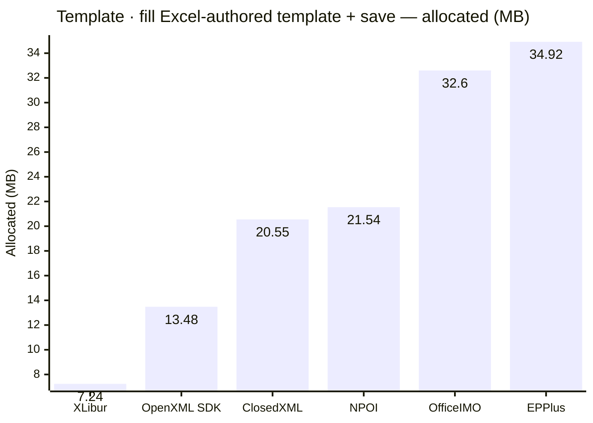
```mermaid
---
config:
  xyChart:
    showDataLabel: true
---
xychart-beta
    title "Template · fill Excel-authored template + save — allocated (MB)"
    x-axis ["XLibur", "OpenXML SDK", "ClosedXML", "NPOI", "OfficeIMO", "EPPlus"]
    y-axis "Allocated (MB)"
    bar [7.24, 13.48, 20.55, 21.54, 32.6, 34.92]
```

## Detailed results


```

BenchmarkDotNet v0.15.8, Linux Ubuntu 24.04.5 LTS (Noble Numbat)
AMD EPYC 9V45 4.30GHz, 1 CPU, 4 logical and 2 physical cores
.NET SDK 10.0.403
  [Host]   : .NET 10.0.14 (10.0.14, 10.0.1426.52326), X64 RyuJIT x86-64-v4
  ShortRun : .NET 10.0.14 (10.0.14, 10.0.1426.52326), X64 RyuJIT x86-64-v4

Job=ShortRun  IterationCount=3  LaunchCount=1  
WarmupCount=3  

```

### Read · open + set properties + save

| Library     | Type                        | Method                      | Mean          | Error         | StdDev      | Gen0       | Gen1       | Gen2      | Allocated  |
|------------ |---------------------------- |---------------------------- |--------------:|--------------:|------------:|-----------:|-----------:|----------:|-----------:|
| OpenXML SDK | OpenXmlReadBenchmarks       | OpenAmendPropertiesAndSave  |     0.2065 ms |     0.9475 ms |   0.0519 ms |    29.7852 |    20.0195 |   16.1133 |    0.34 MB |
| XLibur      | XLiburReadBenchmarks        | OpenAmendPropertiesAndSave  |     4.3233 ms |     1.3326 ms |   0.0730 ms |    62.5000 |    31.2500 |         - |    1.38 MB |
| NPOI        | NpoiReadBenchmarks          | OpenAmendPropertiesAndSave  |     8.7186 ms |     7.7031 ms |   0.4222 ms |    62.5000 |    31.2500 |         - |    1.89 MB |
| OfficeIMO   | OfficeImoReadBenchmarks     | OpenAmendPropertiesAndSave  |    19.0517 ms |    10.0278 ms |   0.5497 ms |   593.7500 |   468.7500 |  406.2500 |    7.01 MB |
| ClosedXML   | ClosedXmlReadBenchmarks     | OpenAmendPropertiesAndSave  |    33.0825 ms |   142.8493 ms |   7.8301 ms |   750.0000 |   375.0000 |         - |   13.17 MB |
| EPPlus      | EpPlusReadBenchmarks        | OpenAmendPropertiesAndSave  |    38.1108 ms |   144.3362 ms |   7.9116 ms |  1000.0000 |  1000.0000 | 1000.0000 |   13.82 MB |
| IronXL ⧗ | IronXlReadBenchmarks | OpenAmendPropertiesAndSave | 208.746 ms | 155.7570 ms | 92.6885 ms | 9000.0000 | 2000.0000 | - | 152.81 MB |

### Read · open + read all cells

| Library     | Type                        | Method                      | Mean          | Error         | StdDev      | Gen0       | Gen1       | Gen2      | Allocated  |
|------------ |---------------------------- |---------------------------- |--------------:|--------------:|------------:|-----------:|-----------:|----------:|-----------:|
| Sylvan      | SylvanReadBenchmarks        | OpenAndReadAll              |   215.6476 ms |   138.2371 ms |   7.5772 ms |  1666.6667 |  1000.0000 |  333.3333 |   25.28 MB |
| MiniExcel   | MiniExcelReadBenchmarks     | OpenAndReadAll              |   557.7678 ms |   138.3253 ms |   7.5821 ms | 50000.0000 |  3000.0000 |         - |  805.89 MB |
| XLibur      | XLiburReadBenchmarks        | OpenAndReadAll              |   590.7292 ms |   145.4775 ms |   7.9741 ms |  8000.0000 |  5000.0000 | 1000.0000 |  135.77 MB |
| OpenXML SDK | OpenXmlReadBenchmarks       | OpenAndReadAll              |   945.1355 ms |    73.3691 ms |   4.0216 ms | 40000.0000 |  6000.0000 | 1000.0000 |  627.82 MB |
| EPPlus      | EpPlusReadBenchmarks        | OpenAndReadAll              |   981.9430 ms |   259.2989 ms |  14.2131 ms | 49000.0000 | 14000.0000 | 7000.0000 |  924.42 MB |
| NPOI        | NpoiReadBenchmarks          | OpenAndReadAll              | 2,554.2975 ms | 2,500.0109 ms | 137.0340 ms | 66000.0000 | 61000.0000 | 5000.0000 | 1075.67 MB |
| OfficeIMO   | OfficeImoReadBenchmarks     | OpenAndReadAll              | 2,859.4160 ms | 1,757.5584 ms |  96.3377 ms | 52000.0000 | 39000.0000 | 5000.0000 |  822.04 MB |
| ClosedXML   | ClosedXmlReadBenchmarks     | OpenAndReadAll              | 6,046.1680 ms |   368.2362 ms |  20.1843 ms | 60000.0000 | 24000.0000 | 4000.0000 | 1073.33 MB |
| IronXL ⧗ | IronXlReadBenchmarks | OpenAndReadAll | 9,318.107 ms | 477.3336 ms | 315.7266 ms | 393000.0000 | 202000.0000 | 10000.0000 | 6333.04 MB |

### Read · 20 sheets, shared strings + styles

| Library     | Type                        | Method                      | Mean          | Error         | StdDev      | Gen0       | Gen1       | Gen2      | Allocated  |
|------------ |---------------------------- |---------------------------- |--------------:|--------------:|------------:|-----------:|-----------:|----------:|-----------:|
| Sylvan      | SylvanSheetsBenchmarks      | OpenAndReadAllSheets        |    77.4680 ms |    32.6380 ms |   1.7890 ms |  1333.3333 |   666.6667 |  333.3333 |    21.6 MB |
| OpenXML SDK | OpenXmlSheetsBenchmarks     | OpenAndReadAllSheets        |   351.7333 ms |    60.4225 ms |   3.3120 ms | 11000.0000 |  6000.0000 | 1000.0000 |  162.81 MB |
| XLibur      | XLiburSheetsBenchmarks      | OpenAndReadAllSheets        |   376.6208 ms |   180.8962 ms |   9.9155 ms | 11000.0000 |  5000.0000 | 1000.0000 |  176.79 MB |
| NPOI        | NpoiSheetsBenchmarks        | OpenAndReadAllSheets        |   381.6521 ms |   874.9584 ms |  47.9594 ms | 14000.0000 | 13000.0000 | 3000.0000 |   211.8 MB |
| EPPlus      | EpPlusSheetsBenchmarks      | OpenAndReadAllSheets        |   440.3873 ms |   301.1641 ms |  16.5078 ms | 24000.0000 | 10000.0000 | 5000.0000 |  360.64 MB |
| MiniExcel   | MiniExcelSheetsBenchmarks   | OpenAndReadAllSheets        |   850.8183 ms |   107.7823 ms |   5.9079 ms | 67000.0000 | 20000.0000 |         - | 1087.22 MB |
| OfficeIMO   | OfficeImoSheetsBenchmarks   | OpenAndReadAllSheets        | 1,048.0057 ms |   147.8067 ms |   8.1018 ms | 33000.0000 | 18000.0000 | 4000.0000 |  509.38 MB |
| ClosedXML   | ClosedXmlSheetsBenchmarks   | OpenAndReadAllSheets        | 1,584.2460 ms | 1,209.1172 ms |  66.2758 ms | 63000.0000 | 31000.0000 | 1000.0000 | 1017.41 MB |

### Write · create + save

| Library     | Type                        | Method                      | Mean          | Error         | StdDev      | Gen0       | Gen1       | Gen2      | Allocated  |
|------------ |---------------------------- |---------------------------- |--------------:|--------------:|------------:|-----------:|-----------:|----------:|-----------:|
| Sylvan      | SylvanWriteBenchmarks       | CreateAndSave               |    27.6309 ms |     4.4765 ms |   0.2454 ms |  1718.7500 |  1625.0000 | 1468.7500 |   13.27 MB |
| MiniExcel   | MiniExcelWriteBenchmarks    | CreateAndSave               |    47.7903 ms |     6.4634 ms |   0.3543 ms |  5454.5455 |  1454.5455 | 1363.6364 |   84.59 MB |
| OpenXML SDK | OpenXmlWriteBenchmarks      | CreateAndSave               |   118.3162 ms |    16.5528 ms |   0.9073 ms |  8600.0000 |  2000.0000 | 2000.0000 |  134.19 MB |
| XLibur      | XLiburWriteBenchmarks       | CreateAndSave               |   149.7510 ms |   154.1023 ms |   8.4469 ms |  3000.0000 |  2500.0000 | 2000.0000 |   60.19 MB |
| ClosedXML   | ClosedXmlWriteBenchmarks    | CreateAndSave               |   360.9703 ms |   221.0377 ms |  12.1158 ms | 11000.0000 |  6000.0000 | 3000.0000 |  181.09 MB |
| EPPlus      | EpPlusWriteBenchmarks       | CreateAndSave               |   406.3737 ms |    51.3166 ms |   2.8128 ms | 20000.0000 |  9000.0000 | 3000.0000 |  322.56 MB |
| NPOI        | NpoiWriteBenchmarks         | CreateAndSave               |   677.1403 ms |   268.1344 ms |  14.6974 ms | 16000.0000 | 12000.0000 | 3000.0000 |  246.27 MB |
| IronXL ⧗ | IronXlWriteBenchmarks | CreateAndSave | 943.137 ms | 18.5191 ms | 11.0204 ms | 48000.0000 | 16000.0000 | 3000.0000 | 797.63 MB |
| OfficeIMO   | OfficeImoWriteBenchmarks    | CreateAndSave               |   993.7622 ms | 2,160.5658 ms | 118.4279 ms | 22000.0000 | 16000.0000 | 3000.0000 |  406.68 MB |

### Report · data + conditional formatting + chart

| Library     | Type                        | Method                      | Mean          | Error         | StdDev      | Gen0       | Gen1       | Gen2      | Allocated  |
|------------ |---------------------------- |---------------------------- |--------------:|--------------:|------------:|-----------:|-----------:|----------:|-----------:|
| OpenXML SDK | OpenXmlReportBenchmarks     | CreateStockReport           |     6.3647 ms |     2.7964 ms |   0.1533 ms |   390.6250 |   382.8125 |  195.3125 |    4.92 MB |
| XLibur      | XLiburReportBenchmarks      | CreateStockReport           |     7.3669 ms |    12.8180 ms |   0.7026 ms |   187.5000 |   187.5000 |  187.5000 |    3.28 MB |
| ClosedXML   | ClosedXmlReportBenchmarks   | CreateStockReport           |    13.7950 ms |     6.2597 ms |   0.3431 ms |   468.7500 |   343.7500 |  187.5000 |    8.27 MB |
| EPPlus      | EpPlusReportBenchmarks      | CreateStockReport           |    16.7423 ms |    13.9938 ms |   0.7670 ms |  1000.0000 |  1000.0000 | 1000.0000 |   13.92 MB |
| NPOI        | NpoiReportBenchmarks        | CreateStockReport           |    31.2667 ms |     4.3876 ms |   0.2405 ms |   968.7500 |   937.5000 |  468.7500 |   16.43 MB |
| OfficeIMO   | OfficeImoReportBenchmarks   | CreateStockReport           |   163.0127 ms |   175.0544 ms |   9.5953 ms | 57000.0000 |  1500.0000 |  500.0000 |  905.79 MB |
| IronXL ⧗ | IronXlReportBenchmarks | CreateStockReport | 387.849 ms | 36.5456 ms | 24.1726 ms | 14000.0000 | 3000.0000 | - | 237.38 MB |

### Edit · delete rows + set column + recalculate

| Library     | Type                        | Method                      | Mean          | Error         | StdDev      | Gen0       | Gen1       | Gen2      | Allocated  |
|------------ |---------------------------- |---------------------------- |--------------:|--------------:|------------:|-----------:|-----------:|----------:|-----------:|
| XLibur      | XLiburEditBenchmarks        | EditAndRecalculate          |     5.6192 ms |     0.9699 ms |   0.0532 ms |   164.0625 |    78.1250 |         - |    2.68 MB |
| OpenXML SDK | OpenXmlEditBenchmarks       | EditAndRecalculate          |    18.8074 ms |     1.9780 ms |   0.1084 ms |   718.7500 |   656.2500 |  156.2500 |     9.8 MB |
| EPPlus      | EpPlusEditBenchmarks        | EditAndRecalculate          |    76.3830 ms |    61.0775 ms |   3.3479 ms |  9000.0000 |  1166.6667 | 1000.0000 |  142.49 MB |
| NPOI        | NpoiEditBenchmarks          | EditAndRecalculate          |   312.9854 ms |    66.3664 ms |   3.6378 ms | 25000.0000 |  1000.0000 |         - |  413.38 MB |
| ClosedXML   | ClosedXmlEditBenchmarks     | EditAndRecalculate          |   401.2640 ms |   815.6689 ms |  44.7096 ms | 21000.0000 |  1000.0000 |         - |  337.66 MB |
| IronXL ⧗ | IronXlEditBenchmarks | EditAndRecalculate | 1,577.273 ms | 62.9583 ms | 41.6430 ms | 57000.0000 | 36000.0000 | 15000.0000 | 753.86 MB |
| OfficeIMO   | OfficeImoEditBenchmarks     | EditAndRecalculate          | 1,974.9343 ms |   201.3056 ms |  11.0342 ms | 30000.0000 |  1000.0000 |         - |  493.93 MB |

### Edit · insert 2 columns + recalculate

| Library     | Type                        | Method                      | Mean          | Error         | StdDev      | Gen0       | Gen1       | Gen2      | Allocated  |
|------------ |---------------------------- |---------------------------- |--------------:|--------------:|------------:|-----------:|-----------:|----------:|-----------:|
| XLibur      | XLiburInsertBenchmarks      | InsertColumnsAndRecalculate |     6.4041 ms |     5.1011 ms |   0.2796 ms |   164.0625 |    78.1250 |         - |    2.69 MB |
| EPPlus      | EpPlusInsertBenchmarks      | InsertColumnsAndRecalculate |    14.3594 ms |     4.2142 ms |   0.2310 ms |  1000.0000 |  1000.0000 | 1000.0000 |   11.41 MB |
| ClosedXML   | ClosedXmlInsertBenchmarks   | InsertColumnsAndRecalculate |    20.1028 ms |    10.6648 ms |   0.5846 ms |   875.0000 |   531.2500 |         - |      14 MB |
| OpenXML SDK | OpenXmlInsertBenchmarks     | InsertColumnsAndRecalculate |    28.4598 ms |   101.4780 ms |   5.5624 ms |  1000.0000 |   857.1429 |  428.5714 |   13.04 MB |
| NPOI        | NpoiInsertBenchmarks        | InsertColumnsAndRecalculate |    44.1457 ms |    72.8707 ms |   3.9943 ms |  2000.0000 |  1333.3333 |  500.0000 |   30.74 MB |
| IronXL ⧗ | IronXlInsertBenchmarks | InsertColumnsAndRecalculate | 113.284 ms | 41.9750 ms | 27.7638 ms | 7000.0000 | 2500.0000 | 750.0000 | 104.88 MB |
| OfficeIMO   | OfficeImoInsertBenchmarks   | InsertColumnsAndRecalculate |   249.9495 ms |    71.4712 ms |   3.9176 ms |  3000.0000 |  1000.0000 |         - |   59.15 MB |

### Calc · change prices + recalculate lookups and SUMIFS

| Library     | Type                        | Method                      | Mean          | Error         | StdDev      | Gen0       | Gen1       | Gen2      | Allocated  |
|------------ |---------------------------- |---------------------------- |--------------:|--------------:|------------:|-----------:|-----------:|----------:|-----------:|
| XLibur      | XLiburCalcBenchmarks        | ChangePricesAndRecalculate  |    63.1377 ms |   238.0826 ms |  13.0501 ms |   800.0000 |   600.0000 |  200.0000 |   10.82 MB |
| EPPlus      | EpPlusCalcBenchmarks        | ChangePricesAndRecalculate  |   147.1955 ms |   176.3368 ms |   9.6656 ms |  9000.0000 |  3000.0000 | 1000.0000 |  129.94 MB |
| ClosedXML   | ClosedXmlCalcBenchmarks     | ChangePricesAndRecalculate  |   166.2082 ms |   955.4346 ms |  52.3706 ms |  3000.0000 |  1500.0000 |  500.0000 |   48.78 MB |
| NPOI        | NpoiCalcBenchmarks          | ChangePricesAndRecalculate  |   191.2297 ms |   153.6117 ms |   8.4200 ms | 10000.0000 |  4000.0000 | 1000.0000 |  156.65 MB |

### Template · fill Excel-authored template + save

| Library     | Type                        | Method                      | Mean          | Error         | StdDev      | Gen0       | Gen1       | Gen2      | Allocated  |
|------------ |---------------------------- |---------------------------- |--------------:|--------------:|------------:|-----------:|-----------:|----------:|-----------:|
| OpenXML SDK | OpenXmlTemplateBenchmarks   | FillTemplateAndSave         |    14.7134 ms |    16.3655 ms |   0.8970 ms |  1187.5000 |  1125.0000 |  500.0000 |   13.48 MB |
| XLibur      | XLiburTemplateBenchmarks    | FillTemplateAndSave         |    36.5718 ms |    65.4993 ms |   3.5902 ms |   666.6667 |   555.5556 |  444.4444 |    7.24 MB |
| EPPlus      | EpPlusTemplateBenchmarks    | FillTemplateAndSave         |    53.7231 ms |   401.3806 ms |  22.0010 ms |  3000.0000 |  1166.6667 | 1000.0000 |   34.92 MB |
| ClosedXML   | ClosedXmlTemplateBenchmarks | FillTemplateAndSave         |    54.4091 ms |   114.8081 ms |   6.2930 ms |  1625.0000 |  1125.0000 |  500.0000 |   20.55 MB |
| NPOI        | NpoiTemplateBenchmarks      | FillTemplateAndSave         |    58.3665 ms |   122.4010 ms |   6.7092 ms |  1375.0000 |  1000.0000 |  250.0000 |   21.54 MB |
| OfficeIMO   | OfficeImoTemplateBenchmarks | FillTemplateAndSave         |   123.8524 ms |   193.4338 ms |  10.6028 ms |  3666.6667 |  3333.3333 | 2333.3333 |    32.6 MB |


<script type="module">
  import mermaid from 'https://cdn.jsdelivr.net/npm/mermaid@11/dist/mermaid.esm.min.mjs';
  const blocks = document.querySelectorAll('.language-mermaid');
  blocks.forEach(el => {
    const code = el.querySelector('code') || el;
    const pre = document.createElement('pre');
    pre.className = 'mermaid';
    pre.textContent = code.textContent;
    el.replaceWith(pre);
  });
  if (blocks.length) {
    mermaid.initialize({ startOnLoad: false });
    await mermaid.run({ querySelector: 'pre.mermaid' });
  }
</script>

<script>
(function () {
  const parse = s => { const n = parseFloat(String(s).replace(/,/g, '')); return Number.isFinite(n) ? n : null; };
  document.querySelectorAll('table').forEach(table => {
    if (!table.tHead || !table.tBodies[0]) return;
    const heads = [...table.tHead.rows[0].cells].map(c => c.textContent.trim().toLowerCase());
    if (!heads.includes('mean')) return;
    const metricCols = heads.map((h, i) => /^(mean|allocated|gen0|gen1|gen2)$/.test(h) ? i : -1).filter(i => i >= 0);
    const rows = [...table.tBodies[0].rows];
    for (const c of metricCols) {
      const vals = rows.map(r => parse(r.cells[c]?.textContent));
      const nums = vals.filter(v => v !== null);
      if (nums.length < 2) continue;
      const min = Math.min(...nums), max = Math.max(...nums);
      if (max === min) continue;
      rows.forEach((r, i) => {
        const v = vals[i]; if (v === null) return;
        const ratio = (v - min) / (max - min);
        r.cells[c].style.backgroundColor = `hsla(${120 - 120 * ratio}, 70%, 50%, 0.45)`;
      });
    }
  });
})();
</script>
