<style>
  .main-content { max-width: 90% !important; padding-left: 2rem !important; padding-right: 2rem !important; }
</style>
<!-- Generated by XLBench. Do not edit by hand; re-run scripts/run-benchmarks.ps1. -->
# XLBench Results

Each section below embeds the full BenchmarkDotNet environment block (OS, CPU,
.NET SDK and runtime). Timings are hardware-specific; treat the allocation/GC
columns as the most portable signal across machines. Regenerate locally with
`scripts/run-benchmarks.ps1`.

> ⚠️ Generated on a shared GitHub Actions runner — timings are indicative and vary run to run; allocation/memory figures are reliable. Authoritative timings come from a local run: [results.html](results.html).

📈 **[Interactive charts](charts.html)** (GitHub Pages). Static charts and the full tables follow.

Each results table (one per test method) is heat-mapped independently on the Pages site (🟩 best → 🟥 worst).

> ⧗ **Carried over from an earlier run.** The rows and chart points below marked with this symbol were not measured here — the library is commercial and needs a licence key this run did not have — so they are replayed from `snapshots/`. Compare them as indicative rather than like-for-like, and see the repository README for how to refresh a snapshot.
>
> - **IronXL** 2026.8.1, Job-HTCPYF job, captured 2026-08-03 on different hardware — Windows 11 (10.0.22631.6199/23H2/2023Update/SunValley3), AMD Ryzen 9 5950X 16-Core Processor.

## Libraries under test

| Library | Version | Source |
| --- | --- | --- |
| ClosedXML | 0.105.1 | this run |
| EPPlus | 8.7.2 | this run |
| OpenXML SDK | 3.5.1 | this run |
| NPOI | 2.8.1 | this run |
| MiniExcel | 1.46.0 | this run |
| Sylvan | 0.5.8 | this run |
| XLibur | 0.800.0 | this run |
| OfficeIMO | 3.5.3 | this run |
| IronXL ⧗ | 2026.8.1 | snapshot (2026.8.1, Job-HTCPYF, captured 2026-08-03) |

## Comparison charts

_Lower is better. Charts render in the GitHub file view; the Pages site has interactive versions._

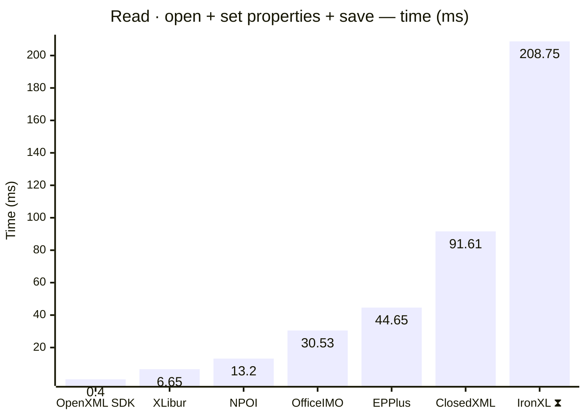
```mermaid
---
config:
  xyChart:
    showDataLabel: true
---
xychart-beta
    title "Read · open + set properties + save — time (ms)"
    x-axis ["OpenXML SDK", "XLibur", "NPOI", "OfficeIMO", "EPPlus", "ClosedXML", "IronXL ⧗"]
    y-axis "Time (ms)"
    bar [0.4, 6.65, 13.2, 30.53, 44.65, 91.61, 208.75]
```

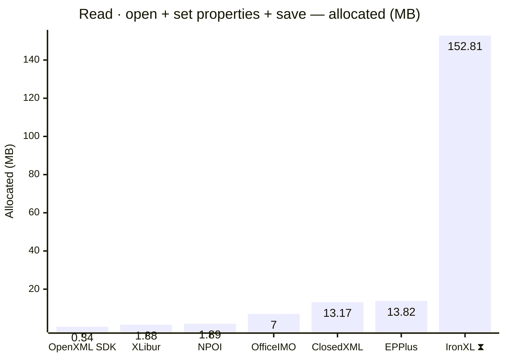
```mermaid
---
config:
  xyChart:
    showDataLabel: true
---
xychart-beta
    title "Read · open + set properties + save — allocated (MB)"
    x-axis ["OpenXML SDK", "XLibur", "NPOI", "OfficeIMO", "ClosedXML", "EPPlus", "IronXL ⧗"]
    y-axis "Allocated (MB)"
    bar [0.34, 1.38, 1.89, 7, 13.17, 13.82, 152.81]
```

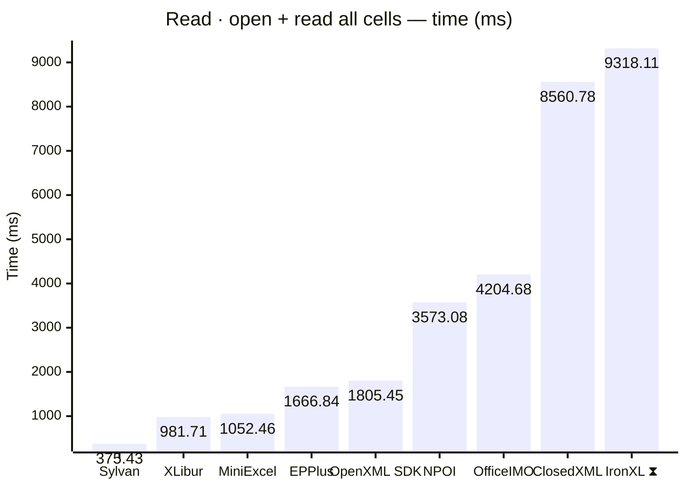
```mermaid
---
config:
  xyChart:
    showDataLabel: true
---
xychart-beta
    title "Read · open + read all cells — time (ms)"
    x-axis ["Sylvan", "XLibur", "MiniExcel", "EPPlus", "OpenXML SDK", "NPOI", "OfficeIMO", "ClosedXML", "IronXL ⧗"]
    y-axis "Time (ms)"
    bar [375.43, 981.71, 1052.46, 1666.84, 1805.45, 3573.08, 4204.68, 8560.78, 9318.11]
```


```mermaid
---
config:
  xyChart:
    showDataLabel: true
---
xychart-beta
    title "Read · open + read all cells — allocated (MB)"
    x-axis ["Sylvan", "XLibur", "OpenXML SDK", "MiniExcel", "OfficeIMO", "EPPlus", "ClosedXML", "NPOI", "IronXL ⧗"]
    y-axis "Allocated (MB)"
    bar [25.28, 135.77, 627.82, 805.86, 822.04, 924.42, 1073.97, 1075.67, 6333.04]
```

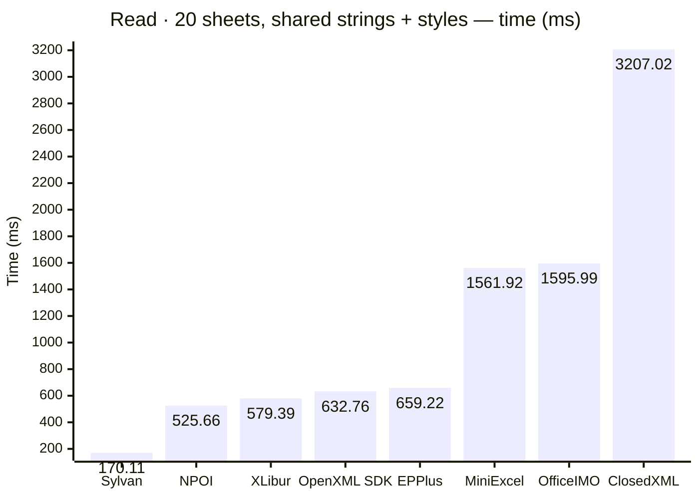
```mermaid
---
config:
  xyChart:
    showDataLabel: true
---
xychart-beta
    title "Read · 20 sheets, shared strings + styles — time (ms)"
    x-axis ["Sylvan", "NPOI", "XLibur", "OpenXML SDK", "EPPlus", "MiniExcel", "OfficeIMO", "ClosedXML"]
    y-axis "Time (ms)"
    bar [170.11, 525.66, 579.39, 632.76, 659.22, 1561.92, 1595.99, 3207.02]
```

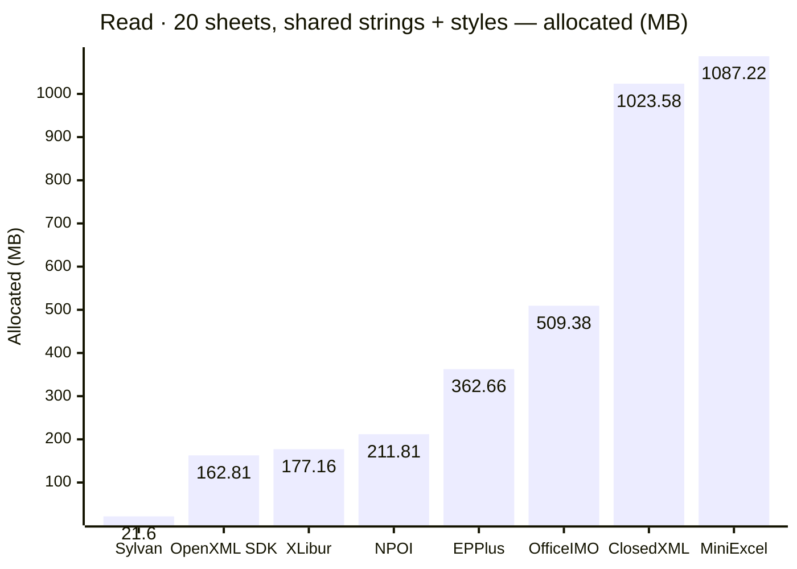
```mermaid
---
config:
  xyChart:
    showDataLabel: true
---
xychart-beta
    title "Read · 20 sheets, shared strings + styles — allocated (MB)"
    x-axis ["Sylvan", "OpenXML SDK", "XLibur", "NPOI", "EPPlus", "OfficeIMO", "ClosedXML", "MiniExcel"]
    y-axis "Allocated (MB)"
    bar [21.6, 162.81, 177.16, 211.81, 362.66, 509.38, 1023.58, 1087.22]
```

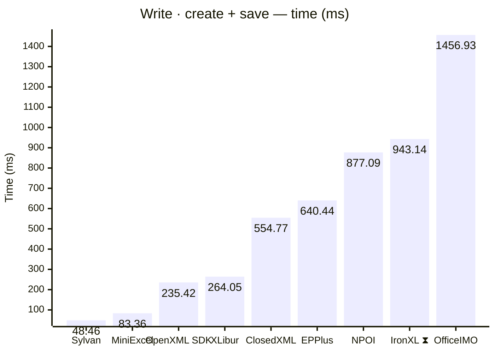
```mermaid
---
config:
  xyChart:
    showDataLabel: true
---
xychart-beta
    title "Write · create + save — time (ms)"
    x-axis ["Sylvan", "MiniExcel", "OpenXML SDK", "XLibur", "ClosedXML", "EPPlus", "NPOI", "IronXL ⧗", "OfficeIMO"]
    y-axis "Time (ms)"
    bar [48.46, 83.36, 235.42, 264.05, 554.77, 640.44, 877.09, 943.14, 1456.93]
```

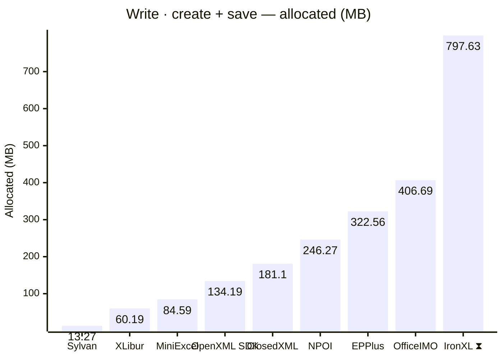
```mermaid
---
config:
  xyChart:
    showDataLabel: true
---
xychart-beta
    title "Write · create + save — allocated (MB)"
    x-axis ["Sylvan", "XLibur", "MiniExcel", "OpenXML SDK", "ClosedXML", "NPOI", "EPPlus", "OfficeIMO", "IronXL ⧗"]
    y-axis "Allocated (MB)"
    bar [13.27, 60.19, 84.59, 134.19, 181.1, 246.27, 322.56, 406.69, 797.63]
```

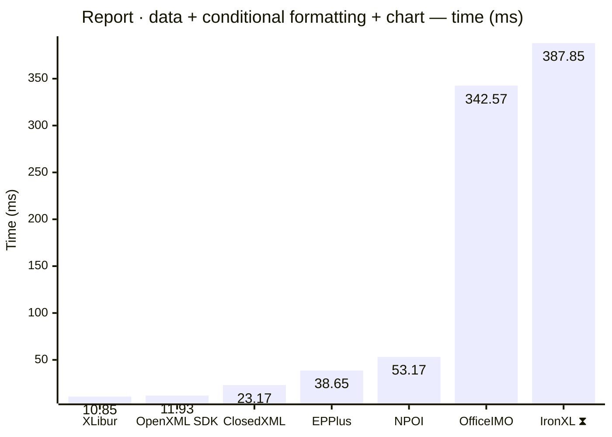
```mermaid
---
config:
  xyChart:
    showDataLabel: true
---
xychart-beta
    title "Report · data + conditional formatting + chart — time (ms)"
    x-axis ["XLibur", "OpenXML SDK", "ClosedXML", "EPPlus", "NPOI", "OfficeIMO", "IronXL ⧗"]
    y-axis "Time (ms)"
    bar [10.85, 11.93, 23.17, 38.65, 53.17, 342.57, 387.85]
```

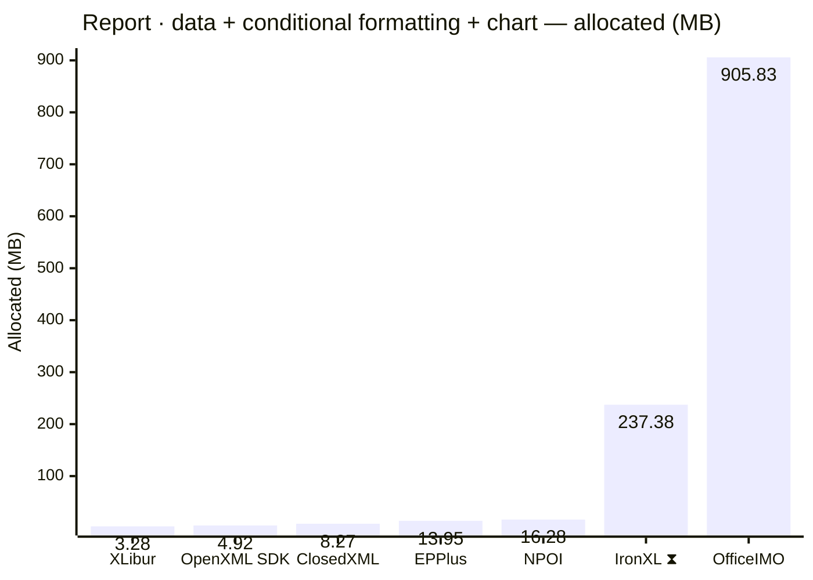
```mermaid
---
config:
  xyChart:
    showDataLabel: true
---
xychart-beta
    title "Report · data + conditional formatting + chart — allocated (MB)"
    x-axis ["XLibur", "OpenXML SDK", "ClosedXML", "EPPlus", "NPOI", "IronXL ⧗", "OfficeIMO"]
    y-axis "Allocated (MB)"
    bar [3.28, 4.92, 8.27, 13.95, 16.28, 237.38, 905.83]
```

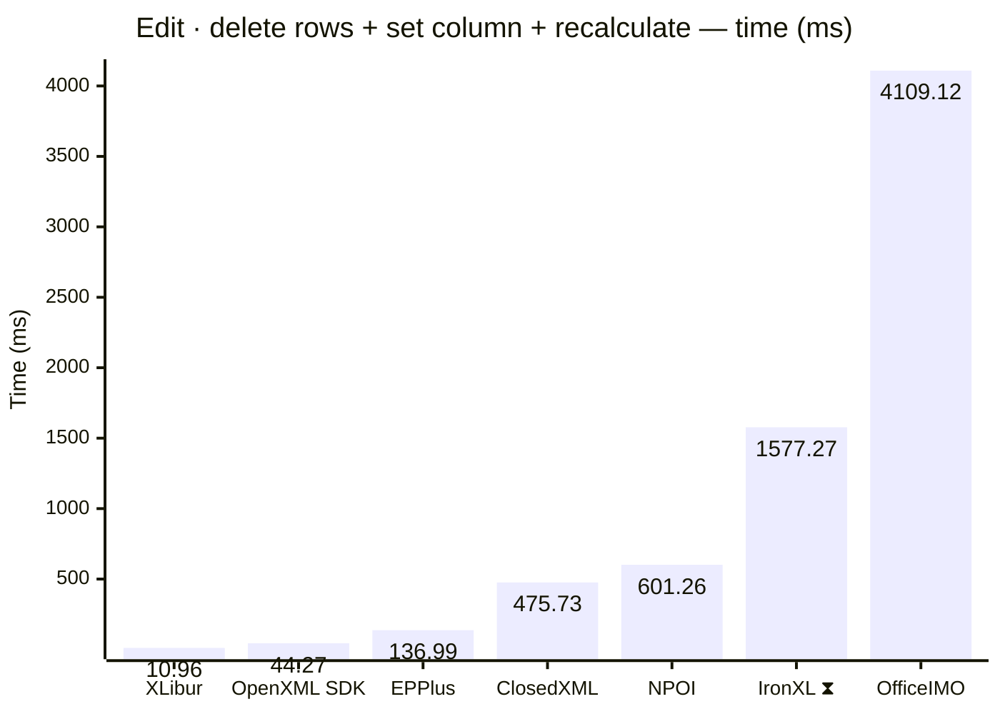
```mermaid
---
config:
  xyChart:
    showDataLabel: true
---
xychart-beta
    title "Edit · delete rows + set column + recalculate — time (ms)"
    x-axis ["XLibur", "OpenXML SDK", "EPPlus", "ClosedXML", "NPOI", "IronXL ⧗", "OfficeIMO"]
    y-axis "Time (ms)"
    bar [10.96, 44.27, 136.99, 475.73, 601.26, 1577.27, 4109.12]
```

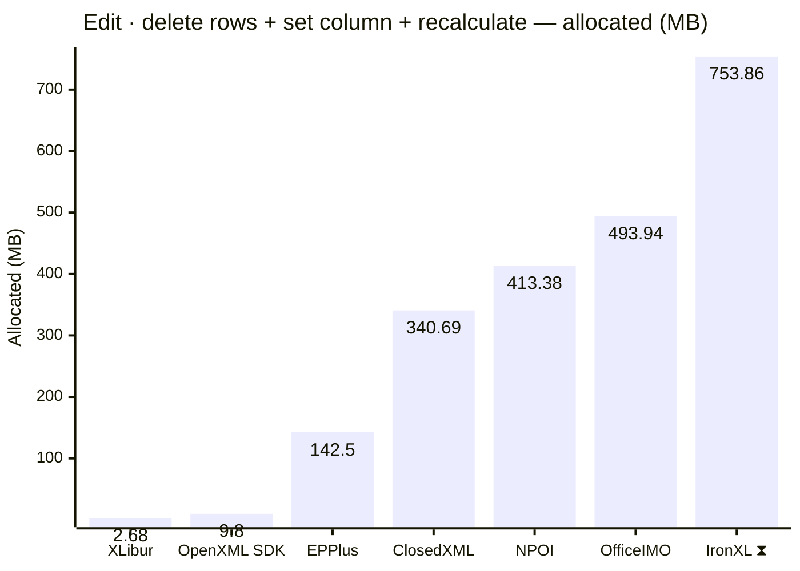
```mermaid
---
config:
  xyChart:
    showDataLabel: true
---
xychart-beta
    title "Edit · delete rows + set column + recalculate — allocated (MB)"
    x-axis ["XLibur", "OpenXML SDK", "EPPlus", "ClosedXML", "NPOI", "OfficeIMO", "IronXL ⧗"]
    y-axis "Allocated (MB)"
    bar [2.68, 9.8, 142.5, 340.69, 413.38, 493.94, 753.86]
```

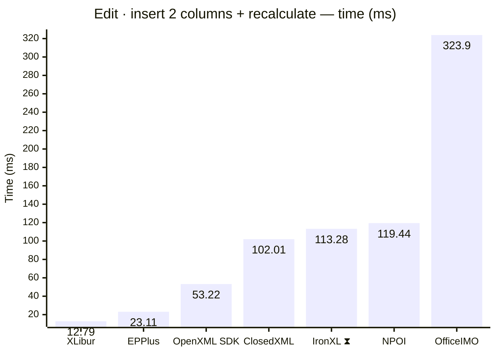
```mermaid
---
config:
  xyChart:
    showDataLabel: true
---
xychart-beta
    title "Edit · insert 2 columns + recalculate — time (ms)"
    x-axis ["XLibur", "EPPlus", "OpenXML SDK", "ClosedXML", "IronXL ⧗", "NPOI", "OfficeIMO"]
    y-axis "Time (ms)"
    bar [12.79, 23.11, 53.22, 102.01, 113.28, 119.44, 323.9]
```

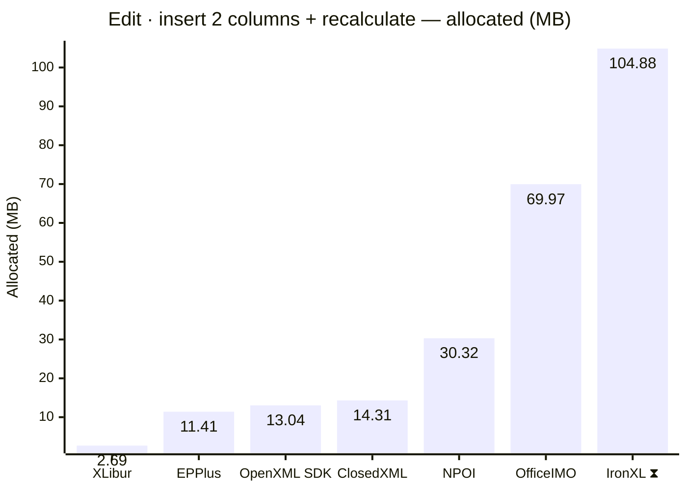
```mermaid
---
config:
  xyChart:
    showDataLabel: true
---
xychart-beta
    title "Edit · insert 2 columns + recalculate — allocated (MB)"
    x-axis ["XLibur", "EPPlus", "OpenXML SDK", "ClosedXML", "NPOI", "OfficeIMO", "IronXL ⧗"]
    y-axis "Allocated (MB)"
    bar [2.69, 11.41, 13.04, 14.31, 30.32, 69.97, 104.88]
```

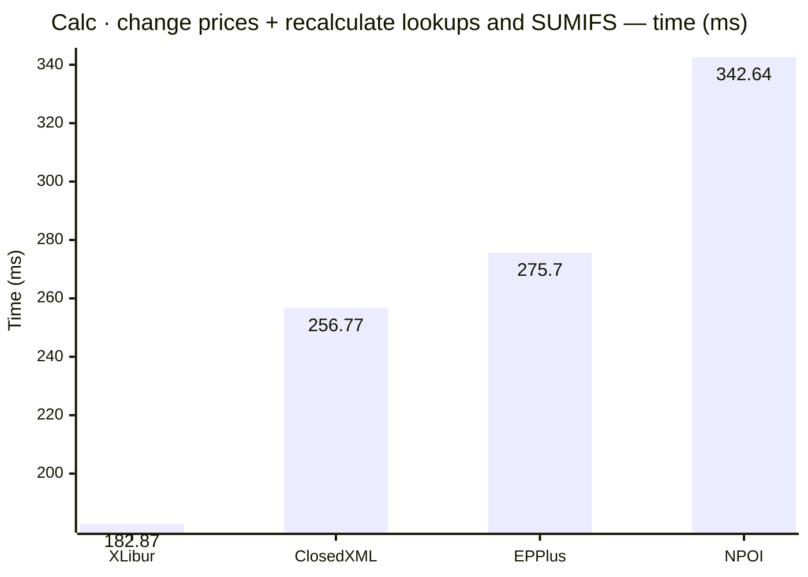
```mermaid
---
config:
  xyChart:
    showDataLabel: true
---
xychart-beta
    title "Calc · change prices + recalculate lookups and SUMIFS — time (ms)"
    x-axis ["XLibur", "ClosedXML", "EPPlus", "NPOI"]
    y-axis "Time (ms)"
    bar [182.87, 256.77, 275.7, 342.64]
```


```mermaid
---
config:
  xyChart:
    showDataLabel: true
---
xychart-beta
    title "Calc · change prices + recalculate lookups and SUMIFS — allocated (MB)"
    x-axis ["XLibur", "ClosedXML", "EPPlus", "NPOI"]
    y-axis "Allocated (MB)"
    bar [10.83, 48.67, 129.94, 156.22]
```

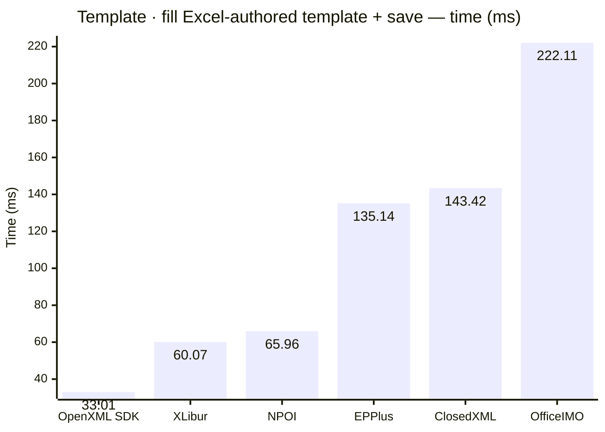
```mermaid
---
config:
  xyChart:
    showDataLabel: true
---
xychart-beta
    title "Template · fill Excel-authored template + save — time (ms)"
    x-axis ["OpenXML SDK", "XLibur", "NPOI", "EPPlus", "ClosedXML", "OfficeIMO"]
    y-axis "Time (ms)"
    bar [33.01, 60.07, 65.96, 135.14, 143.42, 222.11]
```

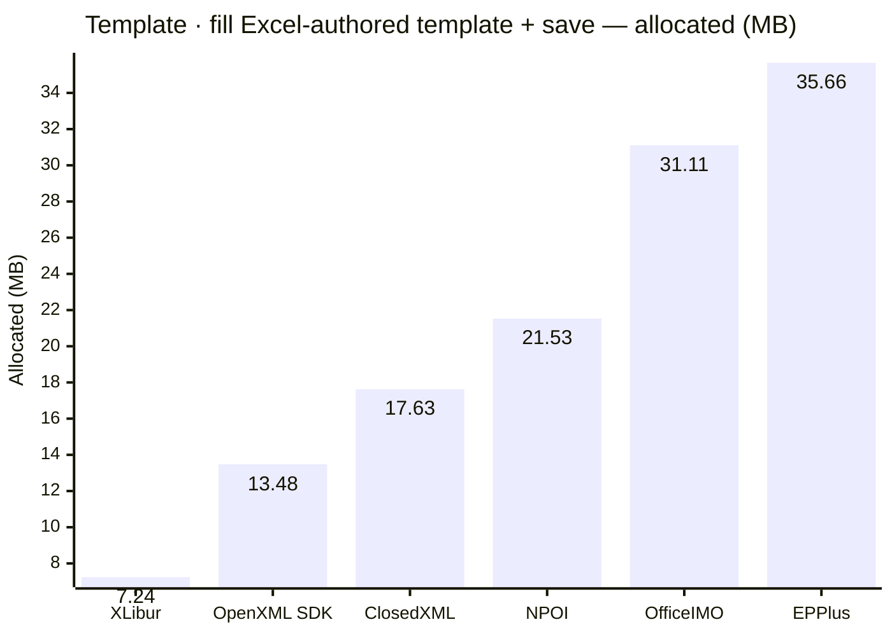
```mermaid
---
config:
  xyChart:
    showDataLabel: true
---
xychart-beta
    title "Template · fill Excel-authored template + save — allocated (MB)"
    x-axis ["XLibur", "OpenXML SDK", "ClosedXML", "NPOI", "OfficeIMO", "EPPlus"]
    y-axis "Allocated (MB)"
    bar [7.24, 13.48, 17.63, 21.53, 31.11, 35.66]
```

## Detailed results


```

BenchmarkDotNet v0.15.8, Linux Ubuntu 24.04.5 LTS (Noble Numbat)
AMD EPYC 7763 3.19GHz, 1 CPU, 4 logical and 2 physical cores
.NET SDK 10.0.403
  [Host]   : .NET 10.0.14 (10.0.14, 10.0.1426.52326), X64 RyuJIT x86-64-v3
  ShortRun : .NET 10.0.14 (10.0.14, 10.0.1426.52326), X64 RyuJIT x86-64-v3

Job=ShortRun  IterationCount=3  LaunchCount=1  
WarmupCount=3  

```

### Read · open + set properties + save

| Library     | Type                        | Method                      | Mean          | Error         | StdDev      | Gen0       | Gen1       | Gen2      | Allocated  |
|------------ |---------------------------- |---------------------------- |--------------:|--------------:|------------:|-----------:|-----------:|----------:|-----------:|
| OpenXML SDK | OpenXmlReadBenchmarks       | OpenAmendPropertiesAndSave  |     0.3973 ms |     0.9740 ms |   0.0534 ms |    27.3438 |    17.5781 |   13.6719 |    0.34 MB |
| XLibur      | XLiburReadBenchmarks        | OpenAmendPropertiesAndSave  |     6.6453 ms |     0.1224 ms |   0.0067 ms |    78.1250 |    31.2500 |         - |    1.38 MB |
| NPOI        | NpoiReadBenchmarks          | OpenAmendPropertiesAndSave  |    13.1957 ms |     6.8558 ms |   0.3758 ms |    62.5000 |          - |         - |    1.89 MB |
| OfficeIMO   | OfficeImoReadBenchmarks     | OpenAmendPropertiesAndSave  |    30.5251 ms |     7.2159 ms |   0.3955 ms |   500.0000 |   375.0000 |  312.5000 |       7 MB |
| EPPlus      | EpPlusReadBenchmarks        | OpenAmendPropertiesAndSave  |    44.6511 ms |   117.5427 ms |   6.4429 ms |  1000.0000 |  1000.0000 | 1000.0000 |   13.82 MB |
| ClosedXML   | ClosedXmlReadBenchmarks     | OpenAmendPropertiesAndSave  |    91.6079 ms |   958.1909 ms |  52.5217 ms |   750.0000 |   250.0000 |         - |   13.17 MB |
| IronXL ⧗ | IronXlReadBenchmarks | OpenAmendPropertiesAndSave | 208.746 ms | 155.7570 ms | 92.6885 ms | 9000.0000 | 2000.0000 | - | 152.81 MB |

### Read · open + read all cells

| Library     | Type                        | Method                      | Mean          | Error         | StdDev      | Gen0       | Gen1       | Gen2      | Allocated  |
|------------ |---------------------------- |---------------------------- |--------------:|--------------:|------------:|-----------:|-----------:|----------:|-----------:|
| Sylvan      | SylvanReadBenchmarks        | OpenAndReadAll              |   375.4278 ms |     3.2647 ms |   0.1789 ms |  1000.0000 |          - |         - |   25.28 MB |
| XLibur      | XLiburReadBenchmarks        | OpenAndReadAll              |   981.7076 ms |   207.4317 ms |  11.3700 ms |  8000.0000 |  5000.0000 | 1000.0000 |  135.77 MB |
| MiniExcel   | MiniExcelReadBenchmarks     | OpenAndReadAll              | 1,052.4648 ms |    57.0653 ms |   3.1279 ms | 51000.0000 |  4000.0000 | 1000.0000 |  805.86 MB |
| EPPlus      | EpPlusReadBenchmarks        | OpenAndReadAll              | 1,666.8415 ms |   183.4789 ms |  10.0571 ms | 49000.0000 | 14000.0000 | 7000.0000 |  924.42 MB |
| OpenXML SDK | OpenXmlReadBenchmarks       | OpenAndReadAll              | 1,805.4540 ms |   252.7528 ms |  13.8542 ms | 40000.0000 |  6000.0000 | 1000.0000 |  627.82 MB |
| NPOI        | NpoiReadBenchmarks          | OpenAndReadAll              | 3,573.0770 ms | 4,587.0888 ms | 251.4338 ms | 67000.0000 | 62000.0000 | 6000.0000 | 1075.67 MB |
| OfficeIMO   | OfficeImoReadBenchmarks     | OpenAndReadAll              | 4,204.6837 ms |   182.3364 ms |   9.9945 ms | 52000.0000 | 39000.0000 | 5000.0000 |  822.04 MB |
| ClosedXML   | ClosedXmlReadBenchmarks     | OpenAndReadAll              | 8,560.7837 ms |   426.5546 ms |  23.3809 ms | 60000.0000 | 24000.0000 | 4000.0000 | 1073.97 MB |
| IronXL ⧗ | IronXlReadBenchmarks | OpenAndReadAll | 9,318.107 ms | 477.3336 ms | 315.7266 ms | 393000.0000 | 202000.0000 | 10000.0000 | 6333.04 MB |

### Read · 20 sheets, shared strings + styles

| Library     | Type                        | Method                      | Mean          | Error         | StdDev      | Gen0       | Gen1       | Gen2      | Allocated  |
|------------ |---------------------------- |---------------------------- |--------------:|--------------:|------------:|-----------:|-----------:|----------:|-----------:|
| Sylvan      | SylvanSheetsBenchmarks      | OpenAndReadAllSheets        |   170.1140 ms | 1,126.0278 ms |  61.7214 ms |  1000.0000 |          - |         - |    21.6 MB |
| NPOI        | NpoiSheetsBenchmarks        | OpenAndReadAllSheets        |   525.6629 ms |   212.4791 ms |  11.6467 ms | 14000.0000 | 13000.0000 | 3000.0000 |  211.81 MB |
| XLibur      | XLiburSheetsBenchmarks      | OpenAndReadAllSheets        |   579.3943 ms |    99.5309 ms |   5.4556 ms | 11000.0000 |  5000.0000 | 1000.0000 |  177.16 MB |
| OpenXML SDK | OpenXmlSheetsBenchmarks     | OpenAndReadAllSheets        |   632.7551 ms |    53.6978 ms |   2.9434 ms | 11000.0000 |  6000.0000 | 1000.0000 |  162.81 MB |
| EPPlus      | EpPlusSheetsBenchmarks      | OpenAndReadAllSheets        |   659.2177 ms |    76.8228 ms |   4.2109 ms | 24000.0000 | 10000.0000 | 5000.0000 |  362.66 MB |
| MiniExcel   | MiniExcelSheetsBenchmarks   | OpenAndReadAllSheets        | 1,561.9185 ms |    61.0938 ms |   3.3488 ms | 67000.0000 | 20000.0000 |         - | 1087.22 MB |
| OfficeIMO   | OfficeImoSheetsBenchmarks   | OpenAndReadAllSheets        | 1,595.9853 ms |   183.1130 ms |  10.0370 ms | 33000.0000 | 18000.0000 | 4000.0000 |  509.38 MB |
| ClosedXML   | ClosedXmlSheetsBenchmarks   | OpenAndReadAllSheets        | 3,207.0165 ms |   412.0780 ms |  22.5874 ms | 63000.0000 | 29000.0000 | 1000.0000 | 1023.58 MB |

### Write · create + save

| Library     | Type                        | Method                      | Mean          | Error         | StdDev      | Gen0       | Gen1       | Gen2      | Allocated  |
|------------ |---------------------------- |---------------------------- |--------------:|--------------:|------------:|-----------:|-----------:|----------:|-----------:|
| Sylvan      | SylvanWriteBenchmarks       | CreateAndSave               |    48.4618 ms |     6.9579 ms |   0.3814 ms |  1818.1818 |  1727.2727 | 1545.4545 |   13.27 MB |
| MiniExcel   | MiniExcelWriteBenchmarks    | CreateAndSave               |    83.3624 ms |     7.7159 ms |   0.4229 ms |  5500.0000 |  1500.0000 | 1500.0000 |   84.59 MB |
| OpenXML SDK | OpenXmlWriteBenchmarks      | CreateAndSave               |   235.4161 ms |    64.4100 ms |   3.5305 ms |  9000.0000 |  2333.3333 | 2333.3333 |  134.19 MB |
| XLibur      | XLiburWriteBenchmarks       | CreateAndSave               |   264.0473 ms |   164.9160 ms |   9.0396 ms |  3000.0000 |  2000.0000 | 2000.0000 |   60.19 MB |
| ClosedXML   | ClosedXmlWriteBenchmarks    | CreateAndSave               |   554.7666 ms |   158.1019 ms |   8.6661 ms | 11000.0000 |  6000.0000 | 3000.0000 |   181.1 MB |
| EPPlus      | EpPlusWriteBenchmarks       | CreateAndSave               |   640.4431 ms |    56.3837 ms |   3.0906 ms | 20000.0000 |  9000.0000 | 3000.0000 |  322.56 MB |
| NPOI        | NpoiWriteBenchmarks         | CreateAndSave               |   877.0947 ms |    79.6907 ms |   4.3681 ms | 16000.0000 | 12000.0000 | 3000.0000 |  246.27 MB |
| IronXL ⧗ | IronXlWriteBenchmarks | CreateAndSave | 943.137 ms | 18.5191 ms | 11.0204 ms | 48000.0000 | 16000.0000 | 3000.0000 | 797.63 MB |
| OfficeIMO   | OfficeImoWriteBenchmarks    | CreateAndSave               | 1,456.9295 ms |   366.7861 ms |  20.1048 ms | 22000.0000 | 16000.0000 | 3000.0000 |  406.69 MB |

### Report · data + conditional formatting + chart

| Library     | Type                        | Method                      | Mean          | Error         | StdDev      | Gen0       | Gen1       | Gen2      | Allocated  |
|------------ |---------------------------- |---------------------------- |--------------:|--------------:|------------:|-----------:|-----------:|----------:|-----------:|
| XLibur      | XLiburReportBenchmarks      | CreateStockReport           |    10.8509 ms |     3.9707 ms |   0.2176 ms |   187.5000 |   187.5000 |  187.5000 |    3.28 MB |
| OpenXML SDK | OpenXmlReportBenchmarks     | CreateStockReport           |    11.9305 ms |     0.2664 ms |   0.0146 ms |   375.0000 |   359.3750 |  187.5000 |    4.92 MB |
| ClosedXML   | ClosedXmlReportBenchmarks   | CreateStockReport           |    23.1673 ms |     0.7996 ms |   0.0438 ms |   468.7500 |   343.7500 |  187.5000 |    8.27 MB |
| EPPlus      | EpPlusReportBenchmarks      | CreateStockReport           |    38.6505 ms |    76.3614 ms |   4.1856 ms |  1000.0000 |  1000.0000 | 1000.0000 |   13.95 MB |
| NPOI        | NpoiReportBenchmarks        | CreateStockReport           |    53.1733 ms |    77.0506 ms |   4.2234 ms |   800.0000 |   600.0000 |  400.0000 |   16.28 MB |
| OfficeIMO   | OfficeImoReportBenchmarks   | CreateStockReport           |   342.5733 ms |    82.5522 ms |   4.5250 ms | 56000.0000 |  2000.0000 |         - |  905.83 MB |
| IronXL ⧗ | IronXlReportBenchmarks | CreateStockReport | 387.849 ms | 36.5456 ms | 24.1726 ms | 14000.0000 | 3000.0000 | - | 237.38 MB |

### Edit · delete rows + set column + recalculate

| Library     | Type                        | Method                      | Mean          | Error         | StdDev      | Gen0       | Gen1       | Gen2      | Allocated  |
|------------ |---------------------------- |---------------------------- |--------------:|--------------:|------------:|-----------:|-----------:|----------:|-----------:|
| XLibur      | XLiburEditBenchmarks        | EditAndRecalculate          |    10.9582 ms |     0.4576 ms |   0.0251 ms |   156.2500 |    78.1250 |         - |    2.68 MB |
| OpenXML SDK | OpenXmlEditBenchmarks       | EditAndRecalculate          |    44.2747 ms |    72.2823 ms |   3.9620 ms |   500.0000 |   250.0000 |         - |     9.8 MB |
| EPPlus      | EpPlusEditBenchmarks        | EditAndRecalculate          |   136.9917 ms |   109.6823 ms |   6.0121 ms |  9000.0000 |  1333.3333 | 1000.0000 |   142.5 MB |
| ClosedXML   | ClosedXmlEditBenchmarks     | EditAndRecalculate          |   475.7285 ms |    59.8799 ms |   3.2822 ms | 21000.0000 |  1000.0000 |         - |  340.69 MB |
| NPOI        | NpoiEditBenchmarks          | EditAndRecalculate          |   601.2639 ms |   139.6003 ms |   7.6520 ms | 25000.0000 |  1000.0000 |         - |  413.38 MB |
| IronXL ⧗ | IronXlEditBenchmarks | EditAndRecalculate | 1,577.273 ms | 62.9583 ms | 41.6430 ms | 57000.0000 | 36000.0000 | 15000.0000 | 753.86 MB |
| OfficeIMO   | OfficeImoEditBenchmarks     | EditAndRecalculate          | 4,109.1203 ms |   178.9039 ms |   9.8063 ms | 30000.0000 |  1000.0000 |         - |  493.94 MB |

### Edit · insert 2 columns + recalculate

| Library     | Type                        | Method                      | Mean          | Error         | StdDev      | Gen0       | Gen1       | Gen2      | Allocated  |
|------------ |---------------------------- |---------------------------- |--------------:|--------------:|------------:|-----------:|-----------:|----------:|-----------:|
| XLibur      | XLiburInsertBenchmarks      | InsertColumnsAndRecalculate |    12.7876 ms |     2.8395 ms |   0.1556 ms |   156.2500 |    78.1250 |         - |    2.69 MB |
| EPPlus      | EpPlusInsertBenchmarks      | InsertColumnsAndRecalculate |    23.1123 ms |     0.5056 ms |   0.0277 ms |  1000.0000 |  1000.0000 | 1000.0000 |   11.41 MB |
| OpenXML SDK | OpenXmlInsertBenchmarks     | InsertColumnsAndRecalculate |    53.2216 ms |    68.6275 ms |   3.7617 ms |  1000.0000 |   666.6667 |  333.3333 |   13.04 MB |
| ClosedXML   | ClosedXmlInsertBenchmarks   | InsertColumnsAndRecalculate |   102.0071 ms |    56.8806 ms |   3.1178 ms |   666.6667 |   333.3333 |         - |   14.31 MB |
| IronXL ⧗ | IronXlInsertBenchmarks | InsertColumnsAndRecalculate | 113.284 ms | 41.9750 ms | 27.7638 ms | 7000.0000 | 2500.0000 | 750.0000 | 104.88 MB |
| NPOI        | NpoiInsertBenchmarks        | InsertColumnsAndRecalculate |   119.4444 ms |   191.3781 ms |  10.4901 ms |  2000.0000 |  1500.0000 |  500.0000 |   30.32 MB |
| OfficeIMO   | OfficeImoInsertBenchmarks   | InsertColumnsAndRecalculate |   323.9001 ms |   680.5727 ms |  37.3045 ms |  5000.0000 |  2000.0000 | 1000.0000 |   69.97 MB |

### Calc · change prices + recalculate lookups and SUMIFS

| Library     | Type                        | Method                      | Mean          | Error         | StdDev      | Gen0       | Gen1       | Gen2      | Allocated  |
|------------ |---------------------------- |---------------------------- |--------------:|--------------:|------------:|-----------:|-----------:|----------:|-----------:|
| XLibur      | XLiburCalcBenchmarks        | ChangePricesAndRecalculate  |   182.8721 ms |     3.4325 ms |   0.1881 ms |          - |          - |         - |   10.83 MB |
| ClosedXML   | ClosedXmlCalcBenchmarks     | ChangePricesAndRecalculate  |   256.7710 ms | 1,017.2851 ms |  55.7608 ms |  2000.0000 |  1000.0000 |         - |   48.67 MB |
| EPPlus      | EpPlusCalcBenchmarks        | ChangePricesAndRecalculate  |   275.6993 ms |   355.0960 ms |  19.4640 ms |  9000.0000 |  3000.0000 | 1000.0000 |  129.94 MB |
| NPOI        | NpoiCalcBenchmarks          | ChangePricesAndRecalculate  |   342.6382 ms |   150.7590 ms |   8.2636 ms | 10000.0000 |  4000.0000 | 1000.0000 |  156.22 MB |

### Template · fill Excel-authored template + save

| Library     | Type                        | Method                      | Mean          | Error         | StdDev      | Gen0       | Gen1       | Gen2      | Allocated  |
|------------ |---------------------------- |---------------------------- |--------------:|--------------:|------------:|-----------:|-----------:|----------:|-----------:|
| OpenXML SDK | OpenXmlTemplateBenchmarks   | FillTemplateAndSave         |    33.0072 ms |   126.9513 ms |   6.9586 ms |  1222.2222 |  1000.0000 |  555.5556 |   13.48 MB |
| XLibur      | XLiburTemplateBenchmarks    | FillTemplateAndSave         |    60.0739 ms |    57.0523 ms |   3.1272 ms |   666.6667 |   500.0000 |  500.0000 |    7.24 MB |
| NPOI        | NpoiTemplateBenchmarks      | FillTemplateAndSave         |    65.9603 ms |   387.9271 ms |  21.2636 ms |  1200.0000 |  1000.0000 |  200.0000 |   21.53 MB |
| EPPlus      | EpPlusTemplateBenchmarks    | FillTemplateAndSave         |   135.1379 ms |   406.0015 ms |  22.2543 ms |  3000.0000 |  1250.0000 | 1000.0000 |   35.66 MB |
| ClosedXML   | ClosedXmlTemplateBenchmarks | FillTemplateAndSave         |   143.4189 ms |   228.2270 ms |  12.5099 ms |  1000.0000 |   666.6667 |  333.3333 |   17.63 MB |
| OfficeIMO   | OfficeImoTemplateBenchmarks | FillTemplateAndSave         |   222.1133 ms |   289.5781 ms |  15.8728 ms |  3000.0000 |  2666.6667 | 2000.0000 |   31.11 MB |


<script type="module">
  import mermaid from 'https://cdn.jsdelivr.net/npm/mermaid@11/dist/mermaid.esm.min.mjs';
  const blocks = document.querySelectorAll('.language-mermaid');
  blocks.forEach(el => {
    const code = el.querySelector('code') || el;
    const pre = document.createElement('pre');
    pre.className = 'mermaid';
    pre.textContent = code.textContent;
    el.replaceWith(pre);
  });
  if (blocks.length) {
    mermaid.initialize({ startOnLoad: false });
    await mermaid.run({ querySelector: 'pre.mermaid' });
  }
</script>

<script>
(function () {
  const parse = s => { const n = parseFloat(String(s).replace(/,/g, '')); return Number.isFinite(n) ? n : null; };
  document.querySelectorAll('table').forEach(table => {
    if (!table.tHead || !table.tBodies[0]) return;
    const heads = [...table.tHead.rows[0].cells].map(c => c.textContent.trim().toLowerCase());
    if (!heads.includes('mean')) return;
    const metricCols = heads.map((h, i) => /^(mean|allocated|gen0|gen1|gen2)$/.test(h) ? i : -1).filter(i => i >= 0);
    const rows = [...table.tBodies[0].rows];
    for (const c of metricCols) {
      const vals = rows.map(r => parse(r.cells[c]?.textContent));
      const nums = vals.filter(v => v !== null);
      if (nums.length < 2) continue;
      const min = Math.min(...nums), max = Math.max(...nums);
      if (max === min) continue;
      rows.forEach((r, i) => {
        const v = vals[i]; if (v === null) return;
        const ratio = (v - min) / (max - min);
        r.cells[c].style.backgroundColor = `hsla(${120 - 120 * ratio}, 70%, 50%, 0.45)`;
      });
    }
  });
})();
</script>
