<style>
  .main-content { max-width: 90% !important; padding-left: 2rem !important; padding-right: 2rem !important; }
</style>
<!-- Generated by XLBench. Do not edit by hand; re-run scripts/run-benchmarks.ps1. -->
# XLBench Results

Each section below embeds the full BenchmarkDotNet environment block (OS, CPU,
.NET SDK and runtime). Timings are hardware-specific; treat the allocation/GC
columns as the most portable signal across machines. Regenerate locally with
`scripts/run-benchmarks.ps1`.

> ⚠️ Generated on a shared GitHub Actions runner — timings are indicative and vary run to run; allocation/memory figures are reliable. Authoritative timings come from a local run: [results.html](results.html).

📈 **[Interactive charts](charts.html)** (GitHub Pages). Static charts and the full tables follow.

Each results table (one per test method) is heat-mapped independently on the Pages site (🟩 best → 🟥 worst).

> ⧗ **Carried over from an earlier run.** The rows and chart points below marked with this symbol were not measured here — the library is commercial and needs a licence key this run did not have — so they are replayed from `snapshots/`. Compare them as indicative rather than like-for-like, and see the repository README for how to refresh a snapshot.
>
> - **IronXL** 2026.8.1, Job-HTCPYF job, captured 2026-08-03 on different hardware — Windows 11 (10.0.22631.6199/23H2/2023Update/SunValley3), AMD Ryzen 9 5950X 16-Core Processor.

## Libraries under test

| Library | Version | Source |
| --- | --- | --- |
| ClosedXML | 0.105.1 | this run |
| EPPlus | 8.7.2 | this run |
| OpenXML SDK | 3.5.1 | this run |
| NPOI | 2.8.1 | this run |
| MiniExcel | 1.46.0 | this run |
| Sylvan | 0.5.8 | this run |
| XLibur | 0.800.0 | this run |
| OfficeIMO | 3.5.3 | this run |
| IronXL ⧗ | 2026.8.1 | snapshot (2026.8.1, Job-HTCPYF, captured 2026-08-03) |

## Comparison charts

_Lower is better. Charts render in the GitHub file view; the Pages site has interactive versions._

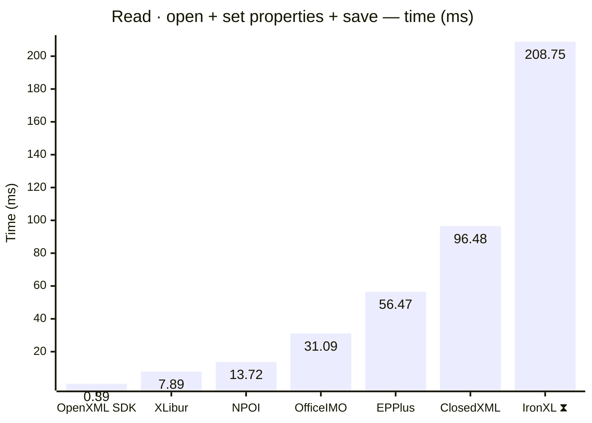
```mermaid
---
config:
  xyChart:
    showDataLabel: true
---
xychart-beta
    title "Read · open + set properties + save — time (ms)"
    x-axis ["OpenXML SDK", "XLibur", "NPOI", "OfficeIMO", "EPPlus", "ClosedXML", "IronXL ⧗"]
    y-axis "Time (ms)"
    bar [0.39, 7.89, 13.72, 31.09, 56.47, 96.48, 208.75]
```


```mermaid
---
config:
  xyChart:
    showDataLabel: true
---
xychart-beta
    title "Read · open + set properties + save — allocated (MB)"
    x-axis ["OpenXML SDK", "XLibur", "NPOI", "OfficeIMO", "ClosedXML", "EPPlus", "IronXL ⧗"]
    y-axis "Allocated (MB)"
    bar [0.34, 1.38, 1.89, 7, 13.17, 14.03, 152.81]
```

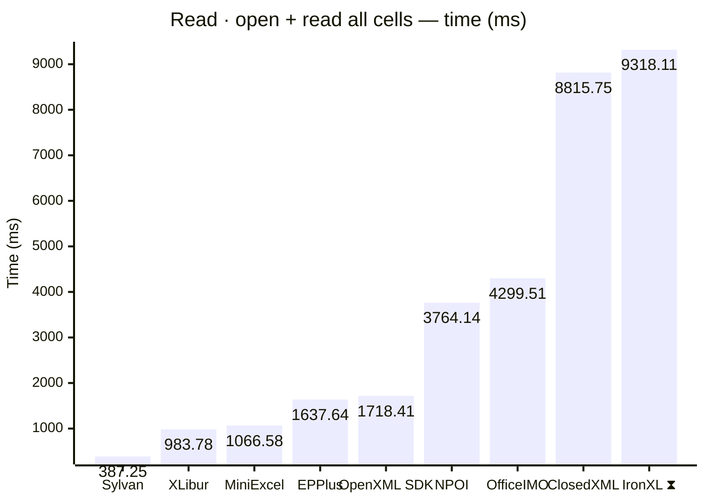
```mermaid
---
config:
  xyChart:
    showDataLabel: true
---
xychart-beta
    title "Read · open + read all cells — time (ms)"
    x-axis ["Sylvan", "XLibur", "MiniExcel", "EPPlus", "OpenXML SDK", "NPOI", "OfficeIMO", "ClosedXML", "IronXL ⧗"]
    y-axis "Time (ms)"
    bar [387.25, 983.78, 1066.58, 1637.64, 1718.41, 3764.14, 4299.51, 8815.75, 9318.11]
```

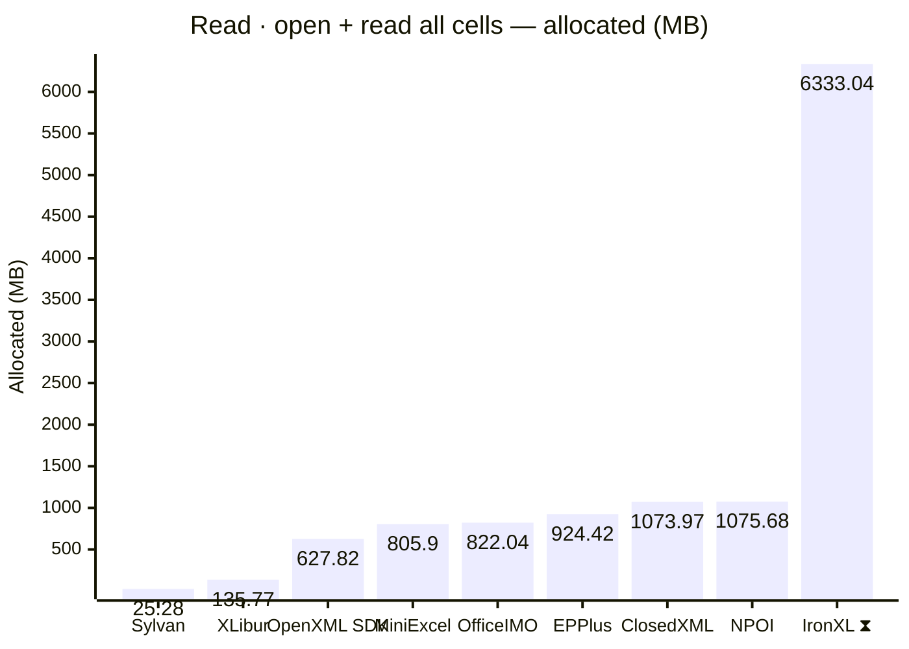
```mermaid
---
config:
  xyChart:
    showDataLabel: true
---
xychart-beta
    title "Read · open + read all cells — allocated (MB)"
    x-axis ["Sylvan", "XLibur", "OpenXML SDK", "MiniExcel", "OfficeIMO", "EPPlus", "ClosedXML", "NPOI", "IronXL ⧗"]
    y-axis "Allocated (MB)"
    bar [25.28, 135.77, 627.82, 805.9, 822.04, 924.42, 1073.97, 1075.68, 6333.04]
```

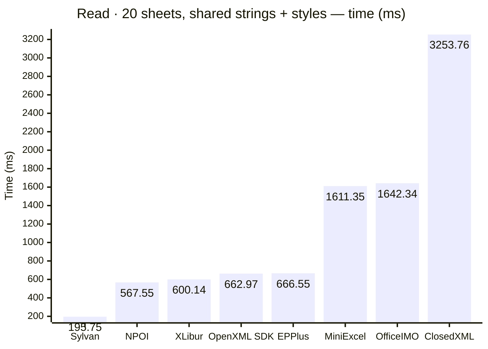
```mermaid
---
config:
  xyChart:
    showDataLabel: true
---
xychart-beta
    title "Read · 20 sheets, shared strings + styles — time (ms)"
    x-axis ["Sylvan", "NPOI", "XLibur", "OpenXML SDK", "EPPlus", "MiniExcel", "OfficeIMO", "ClosedXML"]
    y-axis "Time (ms)"
    bar [195.75, 567.55, 600.14, 662.97, 666.55, 1611.35, 1642.34, 3253.76]
```

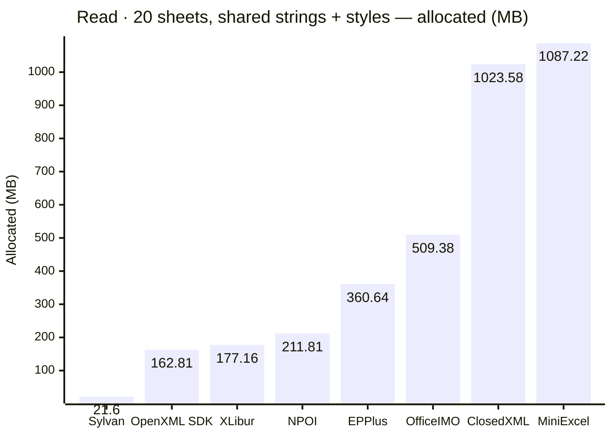
```mermaid
---
config:
  xyChart:
    showDataLabel: true
---
xychart-beta
    title "Read · 20 sheets, shared strings + styles — allocated (MB)"
    x-axis ["Sylvan", "OpenXML SDK", "XLibur", "NPOI", "EPPlus", "OfficeIMO", "ClosedXML", "MiniExcel"]
    y-axis "Allocated (MB)"
    bar [21.6, 162.81, 177.16, 211.81, 360.64, 509.38, 1023.58, 1087.22]
```

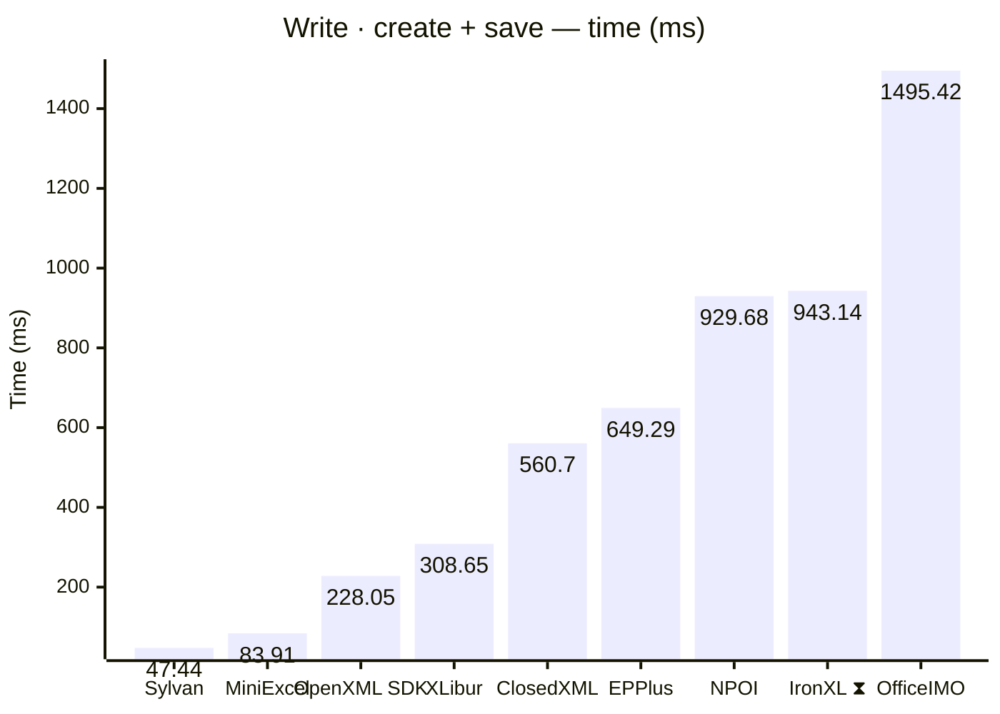
```mermaid
---
config:
  xyChart:
    showDataLabel: true
---
xychart-beta
    title "Write · create + save — time (ms)"
    x-axis ["Sylvan", "MiniExcel", "OpenXML SDK", "XLibur", "ClosedXML", "EPPlus", "NPOI", "IronXL ⧗", "OfficeIMO"]
    y-axis "Time (ms)"
    bar [47.44, 83.91, 228.05, 308.65, 560.7, 649.29, 929.68, 943.14, 1495.42]
```


```mermaid
---
config:
  xyChart:
    showDataLabel: true
---
xychart-beta
    title "Write · create + save — allocated (MB)"
    x-axis ["Sylvan", "XLibur", "MiniExcel", "OpenXML SDK", "ClosedXML", "NPOI", "EPPlus", "OfficeIMO", "IronXL ⧗"]
    y-axis "Allocated (MB)"
    bar [13.27, 60.19, 84.59, 134.19, 181.09, 246.27, 322.56, 406.68, 797.63]
```

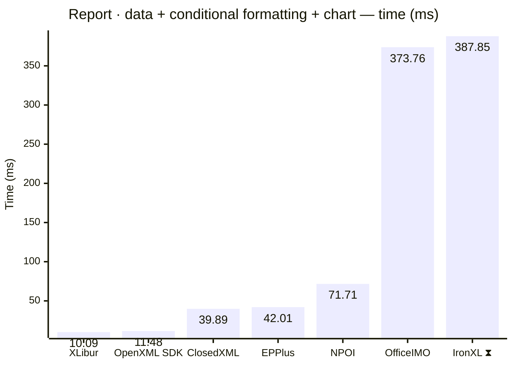
```mermaid
---
config:
  xyChart:
    showDataLabel: true
---
xychart-beta
    title "Report · data + conditional formatting + chart — time (ms)"
    x-axis ["XLibur", "OpenXML SDK", "ClosedXML", "EPPlus", "NPOI", "OfficeIMO", "IronXL ⧗"]
    y-axis "Time (ms)"
    bar [10.09, 11.48, 39.89, 42.01, 71.71, 373.76, 387.85]
```

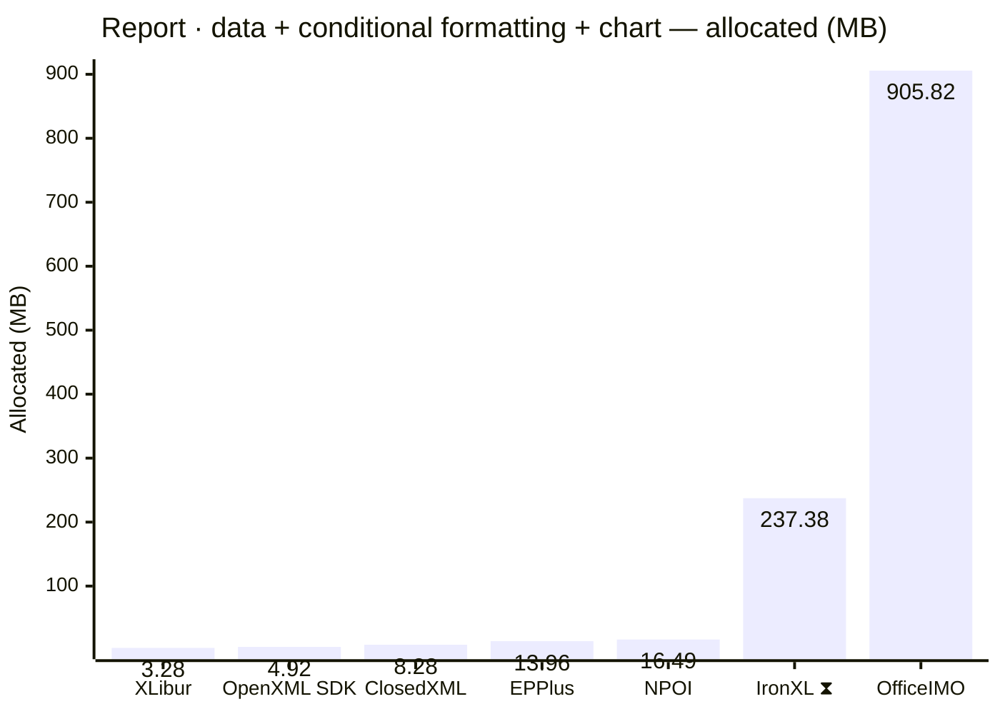
```mermaid
---
config:
  xyChart:
    showDataLabel: true
---
xychart-beta
    title "Report · data + conditional formatting + chart — allocated (MB)"
    x-axis ["XLibur", "OpenXML SDK", "ClosedXML", "EPPlus", "NPOI", "IronXL ⧗", "OfficeIMO"]
    y-axis "Allocated (MB)"
    bar [3.28, 4.92, 8.28, 13.96, 16.49, 237.38, 905.82]
```

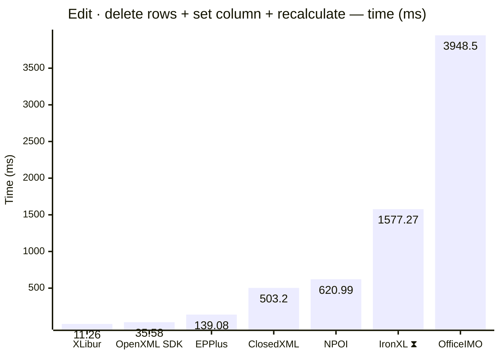
```mermaid
---
config:
  xyChart:
    showDataLabel: true
---
xychart-beta
    title "Edit · delete rows + set column + recalculate — time (ms)"
    x-axis ["XLibur", "OpenXML SDK", "EPPlus", "ClosedXML", "NPOI", "IronXL ⧗", "OfficeIMO"]
    y-axis "Time (ms)"
    bar [11.26, 35.58, 139.08, 503.2, 620.99, 1577.27, 3948.5]
```


```mermaid
---
config:
  xyChart:
    showDataLabel: true
---
xychart-beta
    title "Edit · delete rows + set column + recalculate — allocated (MB)"
    x-axis ["XLibur", "OpenXML SDK", "EPPlus", "ClosedXML", "NPOI", "OfficeIMO", "IronXL ⧗"]
    y-axis "Allocated (MB)"
    bar [2.68, 9.8, 142.5, 337.96, 413.38, 493.95, 753.86]
```

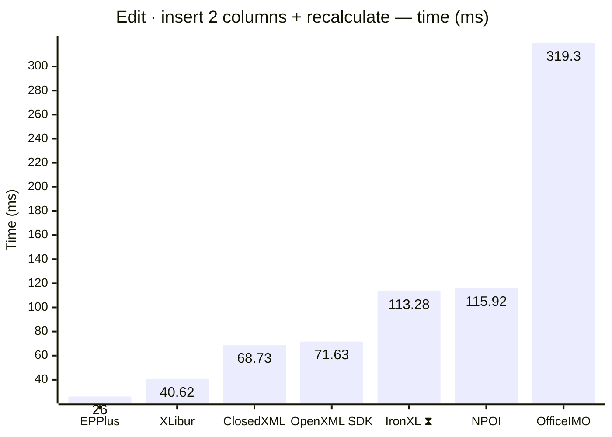
```mermaid
---
config:
  xyChart:
    showDataLabel: true
---
xychart-beta
    title "Edit · insert 2 columns + recalculate — time (ms)"
    x-axis ["EPPlus", "XLibur", "ClosedXML", "OpenXML SDK", "IronXL ⧗", "NPOI", "OfficeIMO"]
    y-axis "Time (ms)"
    bar [26, 40.62, 68.73, 71.63, 113.28, 115.92, 319.3]
```

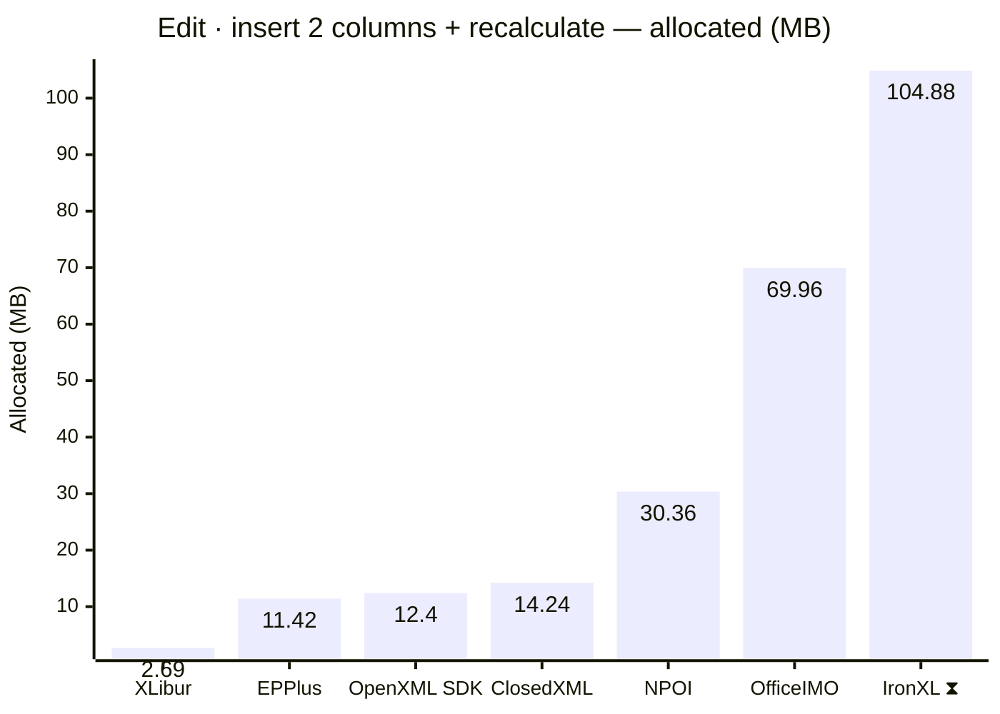
```mermaid
---
config:
  xyChart:
    showDataLabel: true
---
xychart-beta
    title "Edit · insert 2 columns + recalculate — allocated (MB)"
    x-axis ["XLibur", "EPPlus", "OpenXML SDK", "ClosedXML", "NPOI", "OfficeIMO", "IronXL ⧗"]
    y-axis "Allocated (MB)"
    bar [2.69, 11.42, 12.4, 14.24, 30.36, 69.96, 104.88]
```

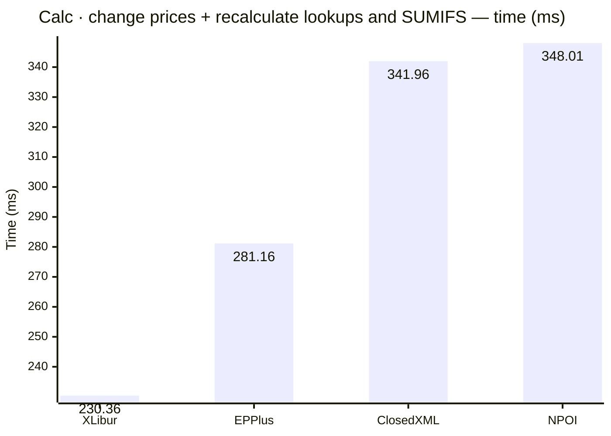
```mermaid
---
config:
  xyChart:
    showDataLabel: true
---
xychart-beta
    title "Calc · change prices + recalculate lookups and SUMIFS — time (ms)"
    x-axis ["XLibur", "EPPlus", "ClosedXML", "NPOI"]
    y-axis "Time (ms)"
    bar [230.36, 281.16, 341.96, 348.01]
```

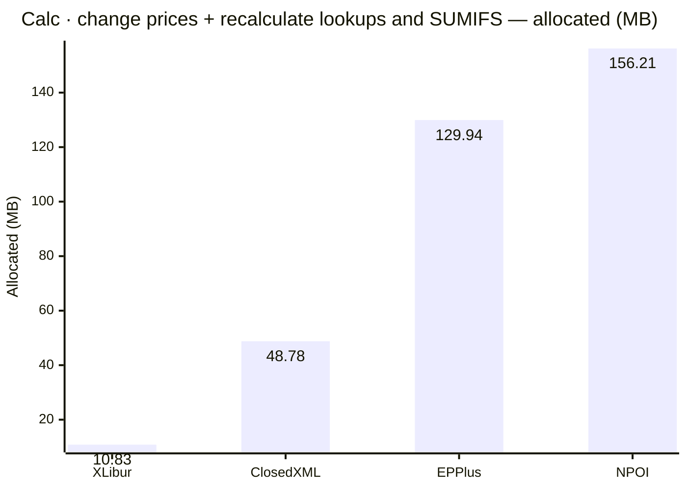
```mermaid
---
config:
  xyChart:
    showDataLabel: true
---
xychart-beta
    title "Calc · change prices + recalculate lookups and SUMIFS — allocated (MB)"
    x-axis ["XLibur", "ClosedXML", "EPPlus", "NPOI"]
    y-axis "Allocated (MB)"
    bar [10.83, 48.78, 129.94, 156.21]
```

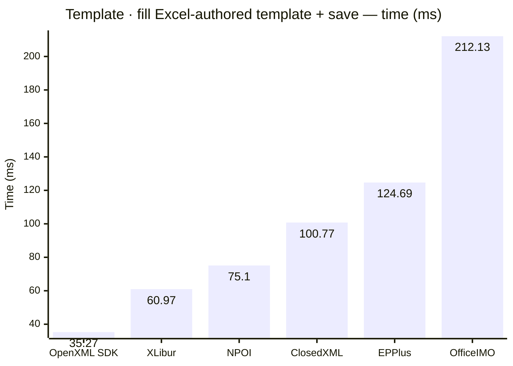
```mermaid
---
config:
  xyChart:
    showDataLabel: true
---
xychart-beta
    title "Template · fill Excel-authored template + save — time (ms)"
    x-axis ["OpenXML SDK", "XLibur", "NPOI", "ClosedXML", "EPPlus", "OfficeIMO"]
    y-axis "Time (ms)"
    bar [35.27, 60.97, 75.1, 100.77, 124.69, 212.13]
```

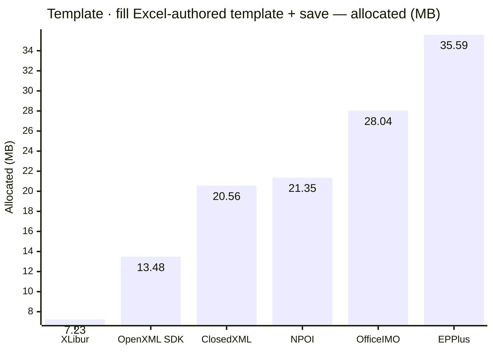
```mermaid
---
config:
  xyChart:
    showDataLabel: true
---
xychart-beta
    title "Template · fill Excel-authored template + save — allocated (MB)"
    x-axis ["XLibur", "OpenXML SDK", "ClosedXML", "NPOI", "OfficeIMO", "EPPlus"]
    y-axis "Allocated (MB)"
    bar [7.23, 13.48, 20.56, 21.35, 28.04, 35.59]
```

## Detailed results


```

BenchmarkDotNet v0.15.8, Linux Ubuntu 26.04.1 LTS (Resolute Raccoon)
AMD EPYC 7763 3.16GHz, 1 CPU, 4 logical and 2 physical cores
.NET SDK 10.0.404
  [Host]   : .NET 10.0.15 (10.0.15, 10.0.1526.53008), X64 RyuJIT x86-64-v3
  ShortRun : .NET 10.0.15 (10.0.15, 10.0.1526.53008), X64 RyuJIT x86-64-v3

Job=ShortRun  IterationCount=3  LaunchCount=1  
WarmupCount=3  

```

### Read · open + set properties + save

| Library     | Type                        | Method                      | Mean          | Error         | StdDev      | Gen0       | Gen1       | Gen2      | Allocated  |
|------------ |---------------------------- |---------------------------- |--------------:|--------------:|------------:|-----------:|-----------:|----------:|-----------:|
| OpenXML SDK | OpenXmlReadBenchmarks       | OpenAmendPropertiesAndSave  |     0.3945 ms |     0.9616 ms |   0.0527 ms |    27.3438 |    17.5781 |   13.6719 |    0.34 MB |
| XLibur      | XLiburReadBenchmarks        | OpenAmendPropertiesAndSave  |     7.8872 ms |     1.5461 ms |   0.0847 ms |    66.6667 |          - |         - |    1.38 MB |
| NPOI        | NpoiReadBenchmarks          | OpenAmendPropertiesAndSave  |    13.7161 ms |    15.1701 ms |   0.8315 ms |    66.6667 |          - |         - |    1.89 MB |
| OfficeIMO   | OfficeImoReadBenchmarks     | OpenAmendPropertiesAndSave  |    31.0902 ms |     4.7048 ms |   0.2579 ms |   533.3333 |   400.0000 |  333.3333 |       7 MB |
| EPPlus      | EpPlusReadBenchmarks        | OpenAmendPropertiesAndSave  |    56.4660 ms |   197.9262 ms |  10.8490 ms |  1000.0000 |  1000.0000 | 1000.0000 |   14.03 MB |
| ClosedXML   | ClosedXmlReadBenchmarks     | OpenAmendPropertiesAndSave  |    96.4757 ms |   697.0746 ms |  38.2090 ms |   750.0000 |   250.0000 |         - |   13.17 MB |
| IronXL ⧗ | IronXlReadBenchmarks | OpenAmendPropertiesAndSave | 208.746 ms | 155.7570 ms | 92.6885 ms | 9000.0000 | 2000.0000 | - | 152.81 MB |

### Read · open + read all cells

| Library     | Type                        | Method                      | Mean          | Error         | StdDev      | Gen0       | Gen1       | Gen2      | Allocated  |
|------------ |---------------------------- |---------------------------- |--------------:|--------------:|------------:|-----------:|-----------:|----------:|-----------:|
| Sylvan      | SylvanReadBenchmarks        | OpenAndReadAll              |   387.2507 ms |   116.5197 ms |   6.3868 ms |  1000.0000 |          - |         - |   25.28 MB |
| XLibur      | XLiburReadBenchmarks        | OpenAndReadAll              |   983.7761 ms |   213.2682 ms |  11.6899 ms |  8000.0000 |  5000.0000 | 1000.0000 |  135.77 MB |
| MiniExcel   | MiniExcelReadBenchmarks     | OpenAndReadAll              | 1,066.5838 ms |    35.7450 ms |   1.9593 ms | 51000.0000 |  4000.0000 | 1000.0000 |   805.9 MB |
| EPPlus      | EpPlusReadBenchmarks        | OpenAndReadAll              | 1,637.6415 ms |    45.8983 ms |   2.5158 ms | 49000.0000 | 14000.0000 | 7000.0000 |  924.42 MB |
| OpenXML SDK | OpenXmlReadBenchmarks       | OpenAndReadAll              | 1,718.4140 ms |    80.3765 ms |   4.4057 ms | 40000.0000 |  5000.0000 | 1000.0000 |  627.82 MB |
| NPOI        | NpoiReadBenchmarks          | OpenAndReadAll              | 3,764.1374 ms | 4,916.9718 ms | 269.5158 ms | 67000.0000 | 62000.0000 | 6000.0000 | 1075.68 MB |
| OfficeIMO   | OfficeImoReadBenchmarks     | OpenAndReadAll              | 4,299.5057 ms |   224.5697 ms |  12.3094 ms | 52000.0000 | 39000.0000 | 5000.0000 |  822.04 MB |
| ClosedXML   | ClosedXmlReadBenchmarks     | OpenAndReadAll              | 8,815.7529 ms |   199.6312 ms |  10.9425 ms | 60000.0000 | 24000.0000 | 4000.0000 | 1073.97 MB |
| IronXL ⧗ | IronXlReadBenchmarks | OpenAndReadAll | 9,318.107 ms | 477.3336 ms | 315.7266 ms | 393000.0000 | 202000.0000 | 10000.0000 | 6333.04 MB |

### Read · 20 sheets, shared strings + styles

| Library     | Type                        | Method                      | Mean          | Error         | StdDev      | Gen0       | Gen1       | Gen2      | Allocated  |
|------------ |---------------------------- |---------------------------- |--------------:|--------------:|------------:|-----------:|-----------:|----------:|-----------:|
| Sylvan      | SylvanSheetsBenchmarks      | OpenAndReadAllSheets        |   195.7473 ms | 1,037.7517 ms |  56.8827 ms |  1000.0000 |          - |         - |    21.6 MB |
| NPOI        | NpoiSheetsBenchmarks        | OpenAndReadAllSheets        |   567.5463 ms |   125.9334 ms |   6.9028 ms | 14000.0000 | 13000.0000 | 3000.0000 |  211.81 MB |
| XLibur      | XLiburSheetsBenchmarks      | OpenAndReadAllSheets        |   600.1380 ms |   175.4779 ms |   9.6185 ms | 11000.0000 |  5000.0000 | 1000.0000 |  177.16 MB |
| OpenXML SDK | OpenXmlSheetsBenchmarks     | OpenAndReadAllSheets        |   662.9727 ms |   177.7469 ms |   9.7429 ms | 11000.0000 |  6000.0000 | 1000.0000 |  162.81 MB |
| EPPlus      | EpPlusSheetsBenchmarks      | OpenAndReadAllSheets        |   666.5516 ms |   262.0465 ms |  14.3637 ms | 24000.0000 | 10000.0000 | 5000.0000 |  360.64 MB |
| MiniExcel   | MiniExcelSheetsBenchmarks   | OpenAndReadAllSheets        | 1,611.3522 ms |    10.3223 ms |   0.5658 ms | 67000.0000 | 20000.0000 |         - | 1087.22 MB |
| OfficeIMO   | OfficeImoSheetsBenchmarks   | OpenAndReadAllSheets        | 1,642.3387 ms |    94.1600 ms |   5.1612 ms | 33000.0000 | 18000.0000 | 4000.0000 |  509.38 MB |
| ClosedXML   | ClosedXmlSheetsBenchmarks   | OpenAndReadAllSheets        | 3,253.7644 ms |   594.0145 ms |  32.5599 ms | 63000.0000 | 29000.0000 | 1000.0000 | 1023.58 MB |

### Write · create + save

| Library     | Type                        | Method                      | Mean          | Error         | StdDev      | Gen0       | Gen1       | Gen2      | Allocated  |
|------------ |---------------------------- |---------------------------- |--------------:|--------------:|------------:|-----------:|-----------:|----------:|-----------:|
| Sylvan      | SylvanWriteBenchmarks       | CreateAndSave               |    47.4406 ms |    16.5262 ms |   0.9059 ms |  1700.0000 |  1600.0000 | 1500.0000 |   13.27 MB |
| MiniExcel   | MiniExcelWriteBenchmarks    | CreateAndSave               |    83.9077 ms |     8.4912 ms |   0.4654 ms |  5333.3333 |  1500.0000 | 1333.3333 |   84.59 MB |
| OpenXML SDK | OpenXmlWriteBenchmarks      | CreateAndSave               |   228.0487 ms |    25.5156 ms |   1.3986 ms |  9000.0000 |  2333.3333 | 2333.3333 |  134.19 MB |
| XLibur      | XLiburWriteBenchmarks       | CreateAndSave               |   308.6523 ms | 1,500.5467 ms |  82.2500 ms |  3000.0000 |  2000.0000 | 2000.0000 |   60.19 MB |
| ClosedXML   | ClosedXmlWriteBenchmarks    | CreateAndSave               |   560.6950 ms |   134.3397 ms |   7.3636 ms | 10000.0000 |  5000.0000 | 2000.0000 |  181.09 MB |
| EPPlus      | EpPlusWriteBenchmarks       | CreateAndSave               |   649.2931 ms |    83.1189 ms |   4.5560 ms | 20000.0000 |  9000.0000 | 3000.0000 |  322.56 MB |
| NPOI        | NpoiWriteBenchmarks         | CreateAndSave               |   929.6791 ms |   141.0540 ms |   7.7316 ms | 16000.0000 | 12000.0000 | 3000.0000 |  246.27 MB |
| IronXL ⧗ | IronXlWriteBenchmarks | CreateAndSave | 943.137 ms | 18.5191 ms | 11.0204 ms | 48000.0000 | 16000.0000 | 3000.0000 | 797.63 MB |
| OfficeIMO   | OfficeImoWriteBenchmarks    | CreateAndSave               | 1,495.4213 ms |    78.1852 ms |   4.2856 ms | 22000.0000 | 16000.0000 | 3000.0000 |  406.68 MB |

### Report · data + conditional formatting + chart

| Library     | Type                        | Method                      | Mean          | Error         | StdDev      | Gen0       | Gen1       | Gen2      | Allocated  |
|------------ |---------------------------- |---------------------------- |--------------:|--------------:|------------:|-----------:|-----------:|----------:|-----------:|
| XLibur      | XLiburReportBenchmarks      | CreateStockReport           |    10.0920 ms |     1.0152 ms |   0.0556 ms |   187.5000 |   187.5000 |  187.5000 |    3.28 MB |
| OpenXML SDK | OpenXmlReportBenchmarks     | CreateStockReport           |    11.4779 ms |     0.4548 ms |   0.0249 ms |   375.0000 |   359.3750 |  187.5000 |    4.92 MB |
| ClosedXML   | ClosedXmlReportBenchmarks   | CreateStockReport           |    39.8863 ms |   159.9445 ms |   8.7671 ms |   500.0000 |   166.6667 |  166.6667 |    8.28 MB |
| EPPlus      | EpPlusReportBenchmarks      | CreateStockReport           |    42.0116 ms |    84.9643 ms |   4.6572 ms |  1000.0000 |  1000.0000 | 1000.0000 |   13.96 MB |
| NPOI        | NpoiReportBenchmarks        | CreateStockReport           |    71.7117 ms |   156.1332 ms |   8.5582 ms |   750.0000 |   500.0000 |  250.0000 |   16.49 MB |
| OfficeIMO   | OfficeImoReportBenchmarks   | CreateStockReport           |   373.7622 ms | 1,017.9542 ms |  55.7975 ms | 56000.0000 |  2000.0000 |         - |  905.82 MB |
| IronXL ⧗ | IronXlReportBenchmarks | CreateStockReport | 387.849 ms | 36.5456 ms | 24.1726 ms | 14000.0000 | 3000.0000 | - | 237.38 MB |

### Edit · delete rows + set column + recalculate

| Library     | Type                        | Method                      | Mean          | Error         | StdDev      | Gen0       | Gen1       | Gen2      | Allocated  |
|------------ |---------------------------- |---------------------------- |--------------:|--------------:|------------:|-----------:|-----------:|----------:|-----------:|
| XLibur      | XLiburEditBenchmarks        | EditAndRecalculate          |    11.2562 ms |     1.1189 ms |   0.0613 ms |   156.2500 |    78.1250 |         - |    2.68 MB |
| OpenXML SDK | OpenXmlEditBenchmarks       | EditAndRecalculate          |    35.5845 ms |     5.0208 ms |   0.2752 ms |   400.0000 |   200.0000 |         - |     9.8 MB |
| EPPlus      | EpPlusEditBenchmarks        | EditAndRecalculate          |   139.0777 ms |   110.5223 ms |   6.0581 ms |  9000.0000 |  1333.3333 | 1000.0000 |   142.5 MB |
| ClosedXML   | ClosedXmlEditBenchmarks     | EditAndRecalculate          |   503.2037 ms |   214.0097 ms |  11.7306 ms | 21000.0000 |  1000.0000 |         - |  337.96 MB |
| NPOI        | NpoiEditBenchmarks          | EditAndRecalculate          |   620.9915 ms |   482.9223 ms |  26.4706 ms | 25000.0000 |  1000.0000 |         - |  413.38 MB |
| IronXL ⧗ | IronXlEditBenchmarks | EditAndRecalculate | 1,577.273 ms | 62.9583 ms | 41.6430 ms | 57000.0000 | 36000.0000 | 15000.0000 | 753.86 MB |
| OfficeIMO   | OfficeImoEditBenchmarks     | EditAndRecalculate          | 3,948.4976 ms |   286.0543 ms |  15.6796 ms | 30000.0000 |  1000.0000 |         - |  493.95 MB |

### Edit · insert 2 columns + recalculate

| Library     | Type                        | Method                      | Mean          | Error         | StdDev      | Gen0       | Gen1       | Gen2      | Allocated  |
|------------ |---------------------------- |---------------------------- |--------------:|--------------:|------------:|-----------:|-----------:|----------:|-----------:|
| EPPlus      | EpPlusInsertBenchmarks      | InsertColumnsAndRecalculate |    26.0008 ms |     2.9568 ms |   0.1621 ms |  1000.0000 |  1000.0000 | 1000.0000 |   11.42 MB |
| XLibur      | XLiburInsertBenchmarks      | InsertColumnsAndRecalculate |    40.6168 ms |    22.0692 ms |   1.2097 ms |   142.8571 |          - |         - |    2.69 MB |
| ClosedXML   | ClosedXmlInsertBenchmarks   | InsertColumnsAndRecalculate |    68.7289 ms |    26.2864 ms |   1.4408 ms |   666.6667 |   333.3333 |         - |   14.24 MB |
| OpenXML SDK | OpenXmlInsertBenchmarks     | InsertColumnsAndRecalculate |    71.6268 ms |   205.4113 ms |  11.2593 ms |  1000.0000 |   666.6667 |  333.3333 |    12.4 MB |
| IronXL ⧗ | IronXlInsertBenchmarks | InsertColumnsAndRecalculate | 113.284 ms | 41.9750 ms | 27.7638 ms | 7000.0000 | 2500.0000 | 750.0000 | 104.88 MB |
| NPOI        | NpoiInsertBenchmarks        | InsertColumnsAndRecalculate |   115.9155 ms |   223.7199 ms |  12.2628 ms |  2000.0000 |  1500.0000 |  500.0000 |   30.36 MB |
| OfficeIMO   | OfficeImoInsertBenchmarks   | InsertColumnsAndRecalculate |   319.2992 ms |   258.6350 ms |  14.1767 ms |  5000.0000 |  2000.0000 | 1000.0000 |   69.96 MB |

### Calc · change prices + recalculate lookups and SUMIFS

| Library     | Type                        | Method                      | Mean          | Error         | StdDev      | Gen0       | Gen1       | Gen2      | Allocated  |
|------------ |---------------------------- |---------------------------- |--------------:|--------------:|------------:|-----------:|-----------:|----------:|-----------:|
| XLibur      | XLiburCalcBenchmarks        | ChangePricesAndRecalculate  |   230.3649 ms |   454.6017 ms |  24.9183 ms |          - |          - |         - |   10.83 MB |
| EPPlus      | EpPlusCalcBenchmarks        | ChangePricesAndRecalculate  |   281.1600 ms |   276.8789 ms |  15.1767 ms |  9000.0000 |  3000.0000 | 1000.0000 |  129.94 MB |
| ClosedXML   | ClosedXmlCalcBenchmarks     | ChangePricesAndRecalculate  |   341.9619 ms |   912.1019 ms |  49.9954 ms |  2000.0000 |  1000.0000 |         - |   48.78 MB |
| NPOI        | NpoiCalcBenchmarks          | ChangePricesAndRecalculate  |   348.0073 ms |   127.7277 ms |   7.0012 ms | 10000.0000 |  4000.0000 | 1000.0000 |  156.21 MB |

### Template · fill Excel-authored template + save

| Library     | Type                        | Method                      | Mean          | Error         | StdDev      | Gen0       | Gen1       | Gen2      | Allocated  |
|------------ |---------------------------- |---------------------------- |--------------:|--------------:|------------:|-----------:|-----------:|----------:|-----------:|
| OpenXML SDK | OpenXmlTemplateBenchmarks   | FillTemplateAndSave         |    35.2652 ms |   164.4344 ms |   9.0132 ms |  1222.2222 |  1000.0000 |  555.5556 |   13.48 MB |
| XLibur      | XLiburTemplateBenchmarks    | FillTemplateAndSave         |    60.9717 ms |    36.9171 ms |   2.0235 ms |   750.0000 |   625.0000 |  500.0000 |    7.23 MB |
| NPOI        | NpoiTemplateBenchmarks      | FillTemplateAndSave         |    75.0980 ms |   361.6907 ms |  19.8255 ms |  1200.0000 |   800.0000 |  200.0000 |   21.35 MB |
| ClosedXML   | ClosedXmlTemplateBenchmarks | FillTemplateAndSave         |   100.7718 ms |   221.7395 ms |  12.1543 ms |  1500.0000 |  1000.0000 |  500.0000 |   20.56 MB |
| EPPlus      | EpPlusTemplateBenchmarks    | FillTemplateAndSave         |   124.6935 ms |   377.9678 ms |  20.7177 ms |  3000.0000 |  1250.0000 | 1000.0000 |   35.59 MB |
| OfficeIMO   | OfficeImoTemplateBenchmarks | FillTemplateAndSave         |   212.1254 ms |   295.1533 ms |  16.1783 ms |  3000.0000 |  2666.6667 | 2000.0000 |   28.04 MB |


<script type="module">
  import mermaid from 'https://cdn.jsdelivr.net/npm/mermaid@11/dist/mermaid.esm.min.mjs';
  const blocks = document.querySelectorAll('.language-mermaid');
  blocks.forEach(el => {
    const code = el.querySelector('code') || el;
    const pre = document.createElement('pre');
    pre.className = 'mermaid';
    pre.textContent = code.textContent;
    el.replaceWith(pre);
  });
  if (blocks.length) {
    mermaid.initialize({ startOnLoad: false });
    await mermaid.run({ querySelector: 'pre.mermaid' });
  }
</script>

<script>
(function () {
  const parse = s => { const n = parseFloat(String(s).replace(/,/g, '')); return Number.isFinite(n) ? n : null; };
  document.querySelectorAll('table').forEach(table => {
    if (!table.tHead || !table.tBodies[0]) return;
    const heads = [...table.tHead.rows[0].cells].map(c => c.textContent.trim().toLowerCase());
    if (!heads.includes('mean')) return;
    const metricCols = heads.map((h, i) => /^(mean|allocated|gen0|gen1|gen2)$/.test(h) ? i : -1).filter(i => i >= 0);
    const rows = [...table.tBodies[0].rows];
    for (const c of metricCols) {
      const vals = rows.map(r => parse(r.cells[c]?.textContent));
      const nums = vals.filter(v => v !== null);
      if (nums.length < 2) continue;
      const min = Math.min(...nums), max = Math.max(...nums);
      if (max === min) continue;
      rows.forEach((r, i) => {
        const v = vals[i]; if (v === null) return;
        const ratio = (v - min) / (max - min);
        r.cells[c].style.backgroundColor = `hsla(${120 - 120 * ratio}, 70%, 50%, 0.45)`;
      });
    }
  });
})();
</script>
