<style>
  .main-content { max-width: 90% !important; padding-left: 2rem !important; padding-right: 2rem !important; }
</style>
<!-- Generated by XLBench. Do not edit by hand; re-run scripts/run-benchmarks.ps1. -->
# XLBench Results

Each section below embeds the full BenchmarkDotNet environment block (OS, CPU,
.NET SDK and runtime). Timings are hardware-specific; treat the allocation/GC
columns as the most portable signal across machines. Regenerate locally with
`scripts/run-benchmarks.ps1`.

> ⚠️ Generated on a shared GitHub Actions runner — timings are indicative and vary run to run; allocation/memory figures are reliable. Authoritative timings come from a local run: [results.html](results.html).

📈 **[Interactive charts](charts.html)** (GitHub Pages). Static charts and the full tables follow.

Each results table (one per test method) is heat-mapped independently on the Pages site (🟩 best → 🟥 worst).

> ⧗ **Carried over from an earlier run.** The rows and chart points below marked with this symbol were not measured here — the library is commercial and needs a licence key this run did not have — so they are replayed from `snapshots/`. Compare them as indicative rather than like-for-like, and see the repository README for how to refresh a snapshot.
>
> - **IronXL** 2026.8.1, Job-HTCPYF job, captured 2026-08-03 on different hardware — Windows 11 (10.0.22631.6199/23H2/2023Update/SunValley3), AMD Ryzen 9 5950X 16-Core Processor.

## Libraries under test

| Library | Version | Source |
| --- | --- | --- |
| ClosedXML | 0.105.1 | this run |
| EPPlus | 8.7.2 | this run |
| OpenXML SDK | 3.5.1 | this run |
| NPOI | 2.8.1 | this run |
| MiniExcel | 1.46.0 | this run |
| Sylvan | 0.5.8 | this run |
| XLibur | 0.800.0 | this run |
| OfficeIMO | 3.5.3 | this run |
| IronXL ⧗ | 2026.8.1 | snapshot (2026.8.1, Job-HTCPYF, captured 2026-08-03) |

## Comparison charts

_Lower is better. Charts render in the GitHub file view; the Pages site has interactive versions._

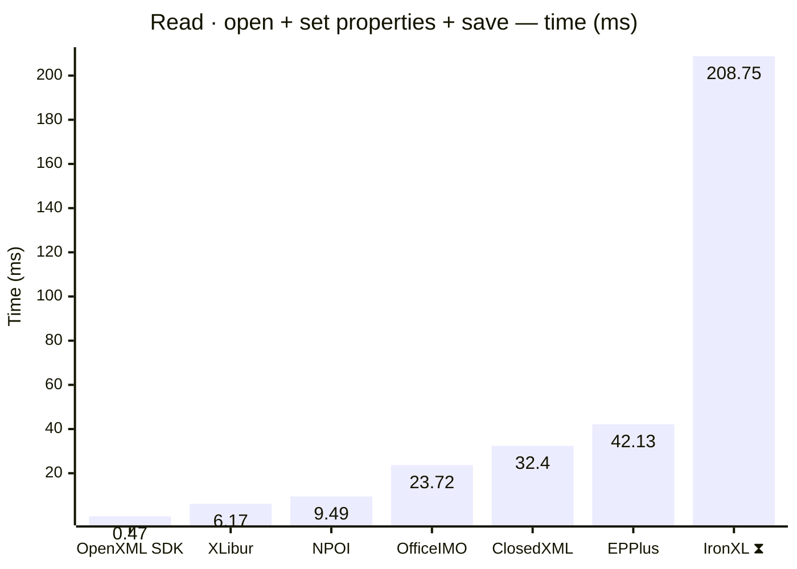
```mermaid
---
config:
  xyChart:
    showDataLabel: true
---
xychart-beta
    title "Read · open + set properties + save — time (ms)"
    x-axis ["OpenXML SDK", "XLibur", "NPOI", "OfficeIMO", "ClosedXML", "EPPlus", "IronXL ⧗"]
    y-axis "Time (ms)"
    bar [0.47, 6.17, 9.49, 23.72, 32.4, 42.13, 208.75]
```

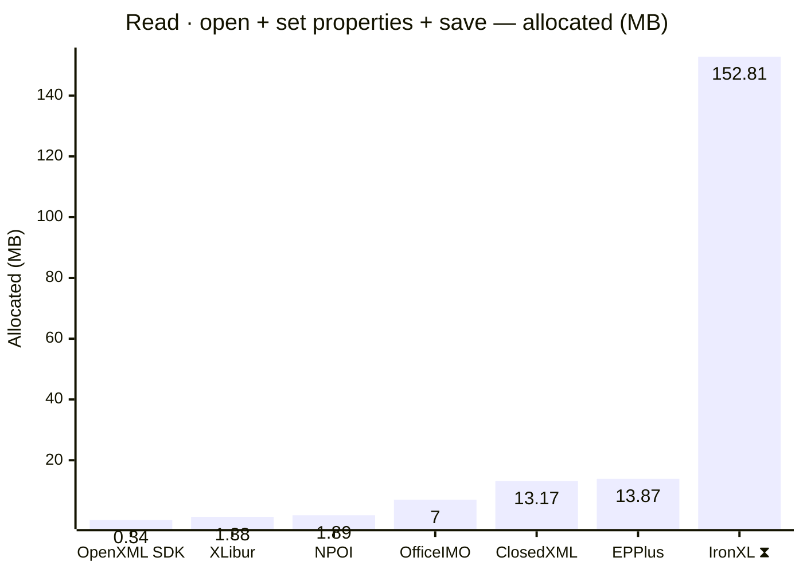
```mermaid
---
config:
  xyChart:
    showDataLabel: true
---
xychart-beta
    title "Read · open + set properties + save — allocated (MB)"
    x-axis ["OpenXML SDK", "XLibur", "NPOI", "OfficeIMO", "ClosedXML", "EPPlus", "IronXL ⧗"]
    y-axis "Allocated (MB)"
    bar [0.34, 1.38, 1.89, 7, 13.17, 13.87, 152.81]
```

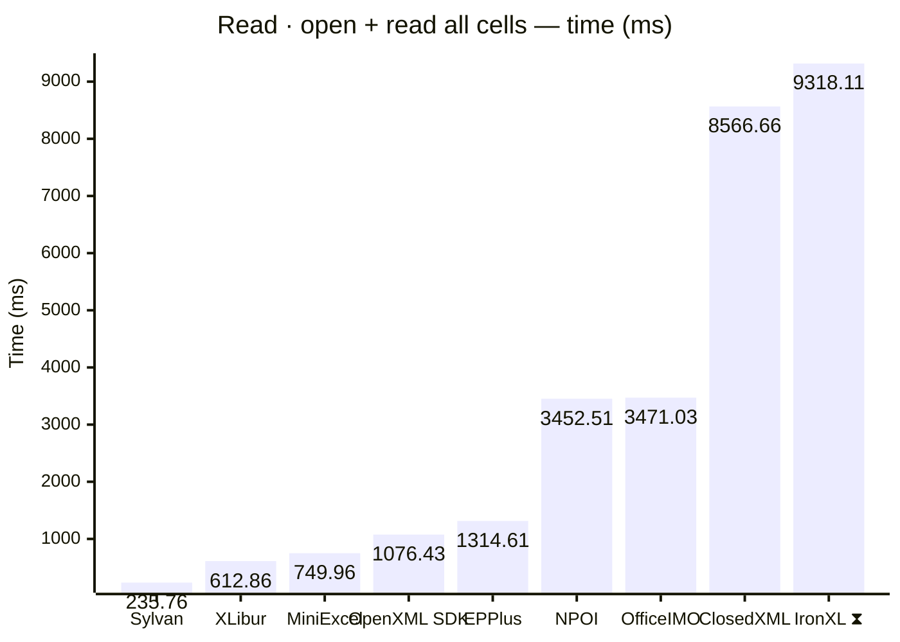
```mermaid
---
config:
  xyChart:
    showDataLabel: true
---
xychart-beta
    title "Read · open + read all cells — time (ms)"
    x-axis ["Sylvan", "XLibur", "MiniExcel", "OpenXML SDK", "EPPlus", "NPOI", "OfficeIMO", "ClosedXML", "IronXL ⧗"]
    y-axis "Time (ms)"
    bar [235.76, 612.86, 749.96, 1076.43, 1314.61, 3452.51, 3471.03, 8566.66, 9318.11]
```

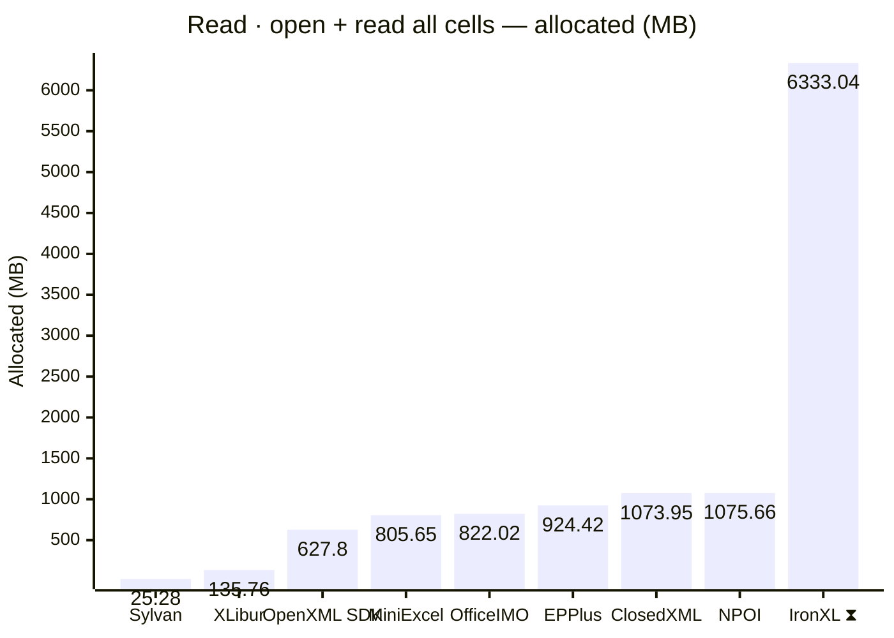
```mermaid
---
config:
  xyChart:
    showDataLabel: true
---
xychart-beta
    title "Read · open + read all cells — allocated (MB)"
    x-axis ["Sylvan", "XLibur", "OpenXML SDK", "MiniExcel", "OfficeIMO", "EPPlus", "ClosedXML", "NPOI", "IronXL ⧗"]
    y-axis "Allocated (MB)"
    bar [25.28, 135.76, 627.8, 805.65, 822.02, 924.42, 1073.95, 1075.66, 6333.04]
```

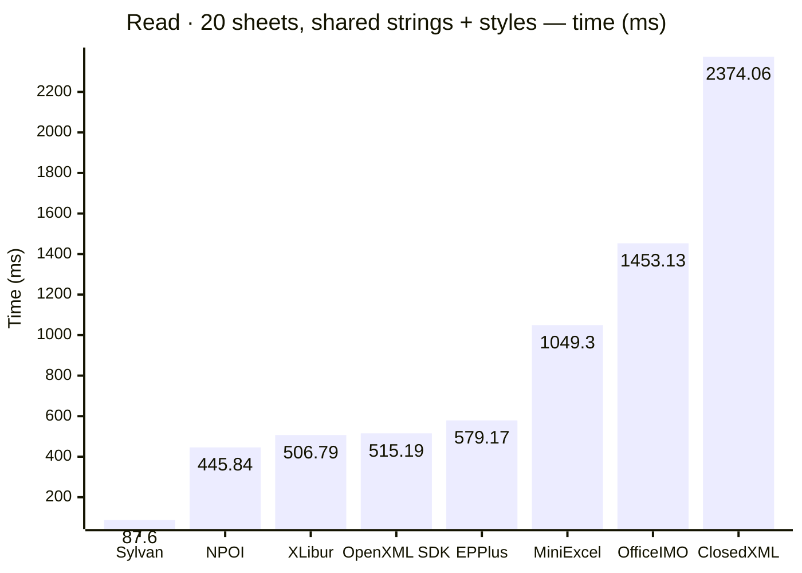
```mermaid
---
config:
  xyChart:
    showDataLabel: true
---
xychart-beta
    title "Read · 20 sheets, shared strings + styles — time (ms)"
    x-axis ["Sylvan", "NPOI", "XLibur", "OpenXML SDK", "EPPlus", "MiniExcel", "OfficeIMO", "ClosedXML"]
    y-axis "Time (ms)"
    bar [87.6, 445.84, 506.79, 515.19, 579.17, 1049.3, 1453.13, 2374.06]
```


```mermaid
---
config:
  xyChart:
    showDataLabel: true
---
xychart-beta
    title "Read · 20 sheets, shared strings + styles — allocated (MB)"
    x-axis ["Sylvan", "OpenXML SDK", "XLibur", "NPOI", "EPPlus", "OfficeIMO", "ClosedXML", "MiniExcel"]
    y-axis "Allocated (MB)"
    bar [21.6, 162.79, 176.77, 211.77, 360.62, 509.32, 1023.27, 1087.13]
```

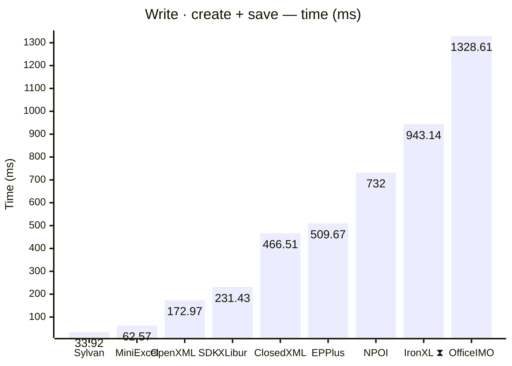
```mermaid
---
config:
  xyChart:
    showDataLabel: true
---
xychart-beta
    title "Write · create + save — time (ms)"
    x-axis ["Sylvan", "MiniExcel", "OpenXML SDK", "XLibur", "ClosedXML", "EPPlus", "NPOI", "IronXL ⧗", "OfficeIMO"]
    y-axis "Time (ms)"
    bar [33.92, 62.57, 172.97, 231.43, 466.51, 509.67, 732, 943.14, 1328.61]
```

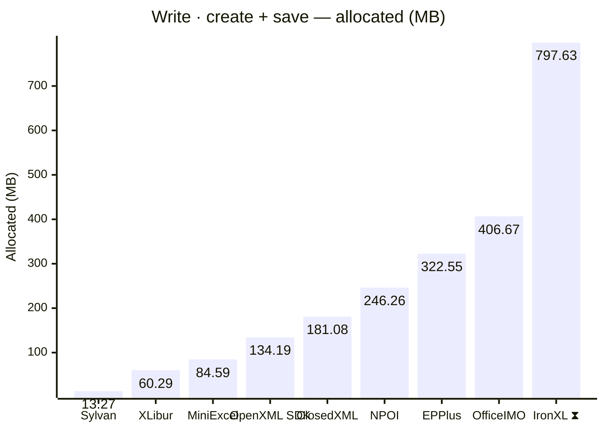
```mermaid
---
config:
  xyChart:
    showDataLabel: true
---
xychart-beta
    title "Write · create + save — allocated (MB)"
    x-axis ["Sylvan", "XLibur", "MiniExcel", "OpenXML SDK", "ClosedXML", "NPOI", "EPPlus", "OfficeIMO", "IronXL ⧗"]
    y-axis "Allocated (MB)"
    bar [13.27, 60.29, 84.59, 134.19, 181.08, 246.26, 322.55, 406.67, 797.63]
```

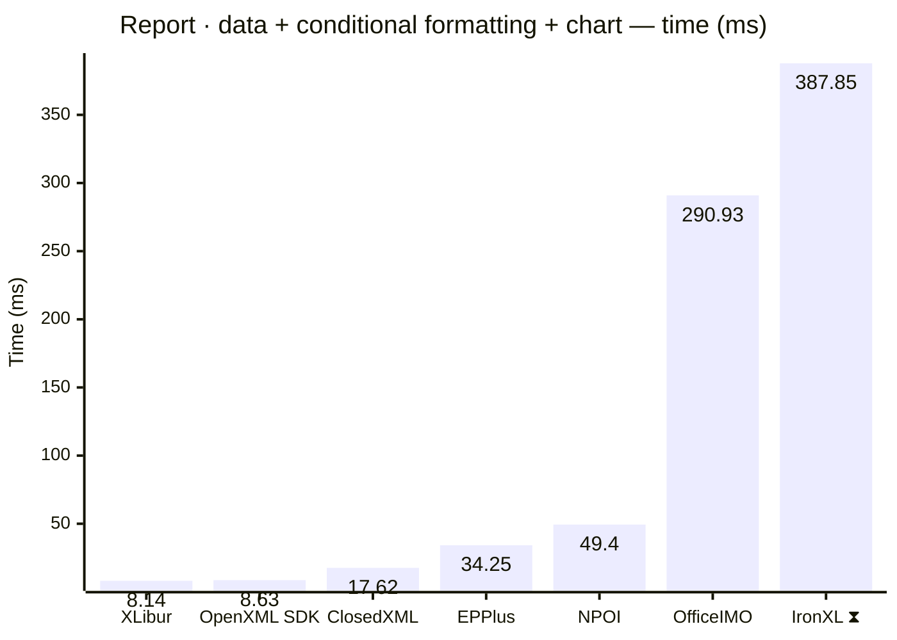
```mermaid
---
config:
  xyChart:
    showDataLabel: true
---
xychart-beta
    title "Report · data + conditional formatting + chart — time (ms)"
    x-axis ["XLibur", "OpenXML SDK", "ClosedXML", "EPPlus", "NPOI", "OfficeIMO", "IronXL ⧗"]
    y-axis "Time (ms)"
    bar [8.14, 8.63, 17.62, 34.25, 49.4, 290.93, 387.85]
```

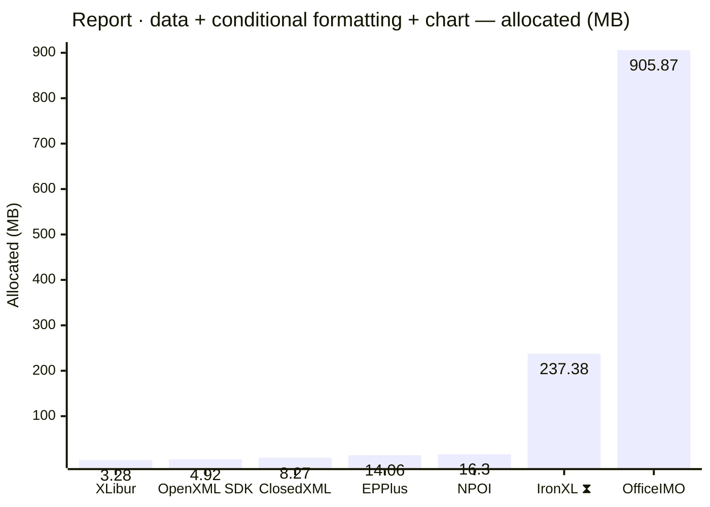
```mermaid
---
config:
  xyChart:
    showDataLabel: true
---
xychart-beta
    title "Report · data + conditional formatting + chart — allocated (MB)"
    x-axis ["XLibur", "OpenXML SDK", "ClosedXML", "EPPlus", "NPOI", "IronXL ⧗", "OfficeIMO"]
    y-axis "Allocated (MB)"
    bar [3.28, 4.92, 8.27, 14.06, 16.3, 237.38, 905.87]
```

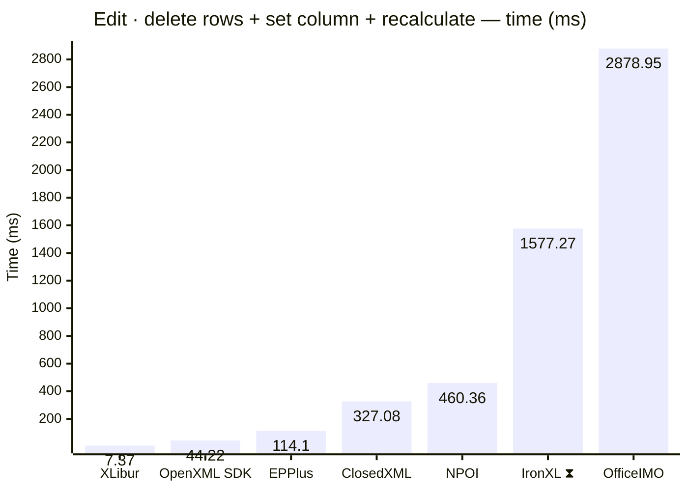
```mermaid
---
config:
  xyChart:
    showDataLabel: true
---
xychart-beta
    title "Edit · delete rows + set column + recalculate — time (ms)"
    x-axis ["XLibur", "OpenXML SDK", "EPPlus", "ClosedXML", "NPOI", "IronXL ⧗", "OfficeIMO"]
    y-axis "Time (ms)"
    bar [7.37, 44.22, 114.1, 327.08, 460.36, 1577.27, 2878.95]
```

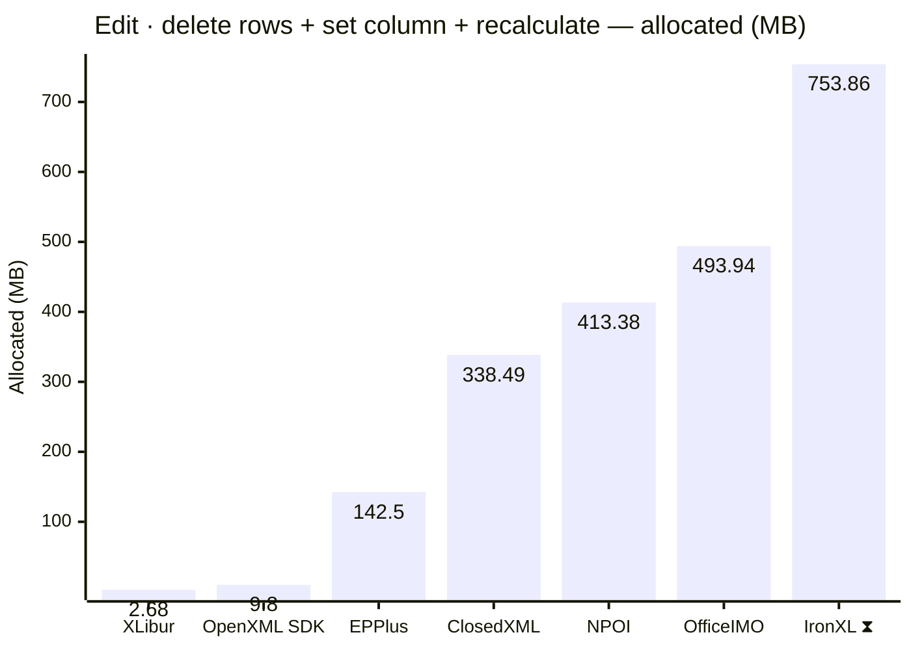
```mermaid
---
config:
  xyChart:
    showDataLabel: true
---
xychart-beta
    title "Edit · delete rows + set column + recalculate — allocated (MB)"
    x-axis ["XLibur", "OpenXML SDK", "EPPlus", "ClosedXML", "NPOI", "OfficeIMO", "IronXL ⧗"]
    y-axis "Allocated (MB)"
    bar [2.68, 9.8, 142.5, 338.49, 413.38, 493.94, 753.86]
```

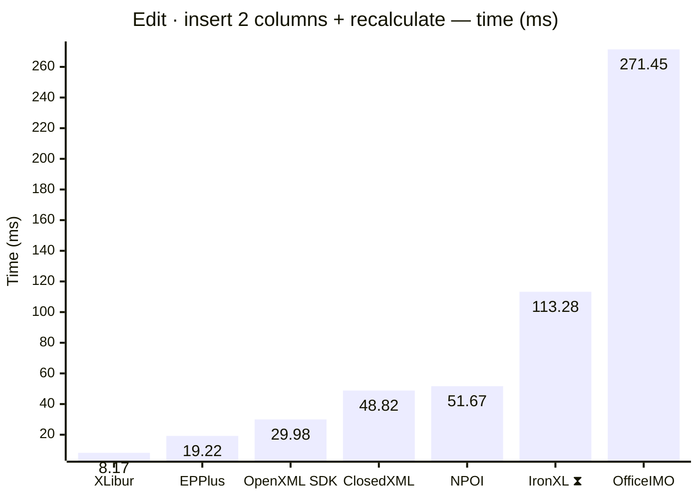
```mermaid
---
config:
  xyChart:
    showDataLabel: true
---
xychart-beta
    title "Edit · insert 2 columns + recalculate — time (ms)"
    x-axis ["XLibur", "EPPlus", "OpenXML SDK", "ClosedXML", "NPOI", "IronXL ⧗", "OfficeIMO"]
    y-axis "Time (ms)"
    bar [8.17, 19.22, 29.98, 48.82, 51.67, 113.28, 271.45]
```

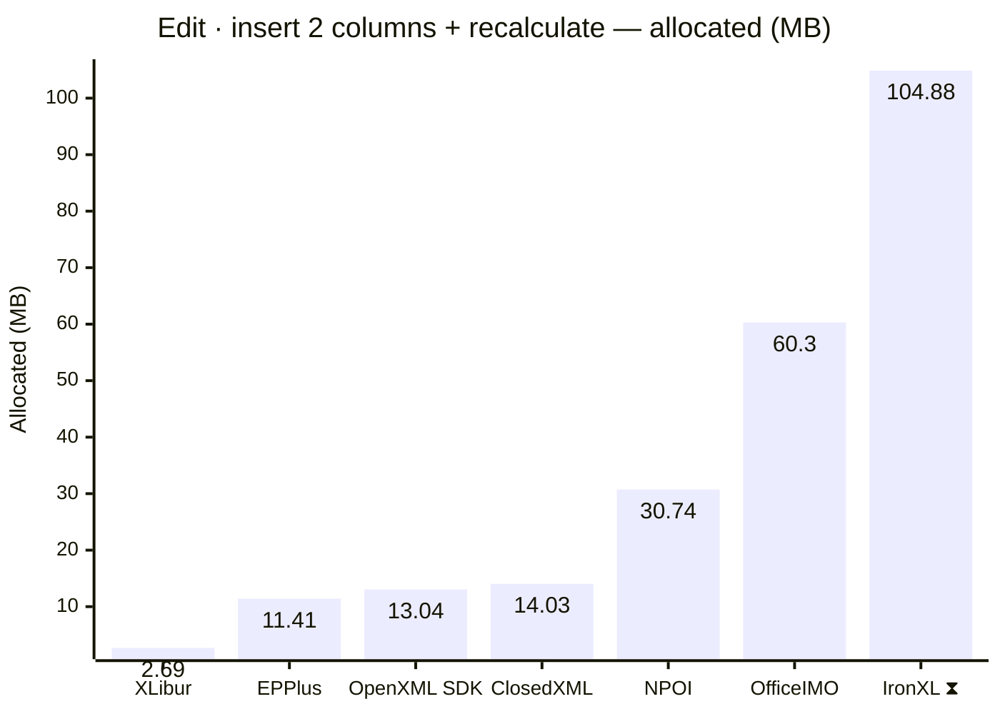
```mermaid
---
config:
  xyChart:
    showDataLabel: true
---
xychart-beta
    title "Edit · insert 2 columns + recalculate — allocated (MB)"
    x-axis ["XLibur", "EPPlus", "OpenXML SDK", "ClosedXML", "NPOI", "OfficeIMO", "IronXL ⧗"]
    y-axis "Allocated (MB)"
    bar [2.69, 11.41, 13.04, 14.03, 30.74, 60.3, 104.88]
```

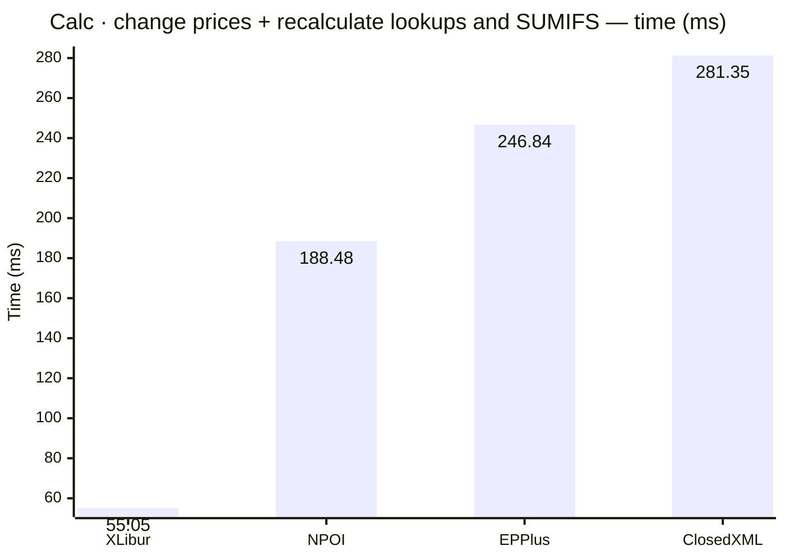
```mermaid
---
config:
  xyChart:
    showDataLabel: true
---
xychart-beta
    title "Calc · change prices + recalculate lookups and SUMIFS — time (ms)"
    x-axis ["XLibur", "NPOI", "EPPlus", "ClosedXML"]
    y-axis "Time (ms)"
    bar [55.05, 188.48, 246.84, 281.35]
```


```mermaid
---
config:
  xyChart:
    showDataLabel: true
---
xychart-beta
    title "Calc · change prices + recalculate lookups and SUMIFS — allocated (MB)"
    x-axis ["XLibur", "ClosedXML", "EPPlus", "NPOI"]
    y-axis "Allocated (MB)"
    bar [10.82, 49.13, 129.93, 156.21]
```

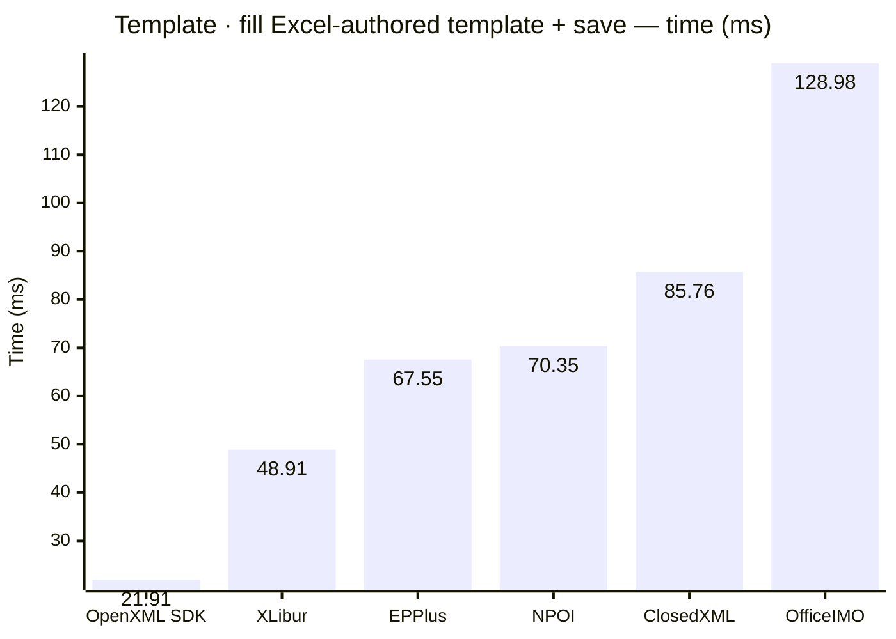
```mermaid
---
config:
  xyChart:
    showDataLabel: true
---
xychart-beta
    title "Template · fill Excel-authored template + save — time (ms)"
    x-axis ["OpenXML SDK", "XLibur", "EPPlus", "NPOI", "ClosedXML", "OfficeIMO"]
    y-axis "Time (ms)"
    bar [21.91, 48.91, 67.55, 70.35, 85.76, 128.98]
```

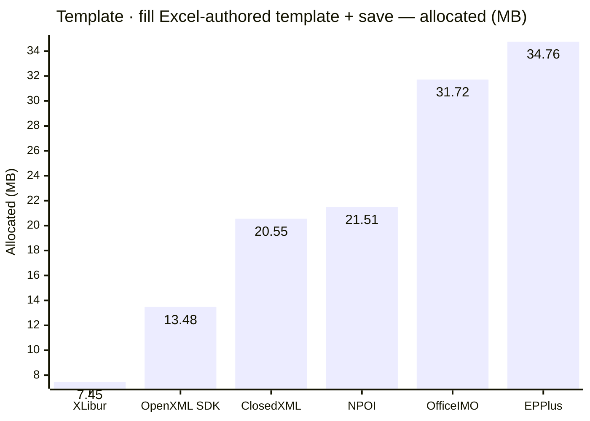
```mermaid
---
config:
  xyChart:
    showDataLabel: true
---
xychart-beta
    title "Template · fill Excel-authored template + save — allocated (MB)"
    x-axis ["XLibur", "OpenXML SDK", "ClosedXML", "NPOI", "OfficeIMO", "EPPlus"]
    y-axis "Allocated (MB)"
    bar [7.45, 13.48, 20.55, 21.51, 31.72, 34.76]
```

## Detailed results


```

BenchmarkDotNet v0.15.8, Linux Ubuntu 26.04.1 LTS (Resolute Raccoon)
Intel Xeon 6973P-C 3.53GHz, 1 CPU, 4 logical and 2 physical cores
.NET SDK 10.0.404
  [Host]   : .NET 10.0.15 (10.0.15, 10.0.1526.53008), X64 RyuJIT x86-64-v4
  ShortRun : .NET 10.0.15 (10.0.15, 10.0.1526.53008), X64 RyuJIT x86-64-v4

Job=ShortRun  IterationCount=3  LaunchCount=1  
WarmupCount=3  

```

### Read · open + set properties + save

| Library     | Type                        | Method                      | Mean          | Error         | StdDev      | Gen0       | Gen1       | Gen2      | Allocated  |
|------------ |---------------------------- |---------------------------- |--------------:|--------------:|------------:|-----------:|-----------:|----------:|-----------:|
| OpenXML SDK | OpenXmlReadBenchmarks       | OpenAmendPropertiesAndSave  |     0.4684 ms |     1.9995 ms |   0.1096 ms |    15.6250 |    13.6719 |   13.6719 |    0.34 MB |
| XLibur      | XLiburReadBenchmarks        | OpenAmendPropertiesAndSave  |     6.1662 ms |     0.4831 ms |   0.0265 ms |          - |          - |         - |    1.38 MB |
| NPOI        | NpoiReadBenchmarks          | OpenAmendPropertiesAndSave  |     9.4920 ms |     4.0549 ms |   0.2223 ms |          - |          - |         - |    1.89 MB |
| OfficeIMO   | OfficeImoReadBenchmarks     | OpenAmendPropertiesAndSave  |    23.7174 ms |     7.9918 ms |   0.4381 ms |   437.5000 |   406.2500 |  406.2500 |       7 MB |
| ClosedXML   | ClosedXmlReadBenchmarks     | OpenAmendPropertiesAndSave  |    32.3962 ms |     2.9106 ms |   0.1595 ms |          - |          - |         - |   13.17 MB |
| EPPlus      | EpPlusReadBenchmarks        | OpenAmendPropertiesAndSave  |    42.1303 ms |    78.1236 ms |   4.2822 ms |  1000.0000 |  1000.0000 | 1000.0000 |   13.87 MB |
| IronXL ⧗ | IronXlReadBenchmarks | OpenAmendPropertiesAndSave | 208.746 ms | 155.7570 ms | 92.6885 ms | 9000.0000 | 2000.0000 | - | 152.81 MB |

### Read · open + read all cells

| Library     | Type                        | Method                      | Mean          | Error         | StdDev      | Gen0       | Gen1       | Gen2      | Allocated  |
|------------ |---------------------------- |---------------------------- |--------------:|--------------:|------------:|-----------:|-----------:|----------:|-----------:|
| Sylvan      | SylvanReadBenchmarks        | OpenAndReadAll              |   235.7554 ms |    26.8275 ms |   1.4705 ms |          - |          - |         - |   25.28 MB |
| XLibur      | XLiburReadBenchmarks        | OpenAndReadAll              |   612.8578 ms |   504.6760 ms |  27.6630 ms |  1000.0000 |          - |         - |  135.76 MB |
| MiniExcel   | MiniExcelReadBenchmarks     | OpenAndReadAll              |   749.9576 ms |    43.9514 ms |   2.4091 ms | 10000.0000 |  1000.0000 |         - |  805.65 MB |
| OpenXML SDK | OpenXmlReadBenchmarks       | OpenAndReadAll              | 1,076.4303 ms |   194.1892 ms |  10.6442 ms |  7000.0000 |  1000.0000 |         - |   627.8 MB |
| EPPlus      | EpPlusReadBenchmarks        | OpenAndReadAll              | 1,314.6051 ms |   535.6845 ms |  29.3627 ms | 14000.0000 | 10000.0000 | 6000.0000 |  924.42 MB |
| NPOI        | NpoiReadBenchmarks          | OpenAndReadAll              | 3,452.5059 ms | 3,704.8708 ms | 203.0765 ms | 15000.0000 | 14000.0000 | 3000.0000 | 1075.66 MB |
| OfficeIMO   | OfficeImoReadBenchmarks     | OpenAndReadAll              | 3,471.0342 ms |   692.9906 ms |  37.9852 ms | 12000.0000 | 11000.0000 | 3000.0000 |  822.02 MB |
| ClosedXML   | ClosedXmlReadBenchmarks     | OpenAndReadAll              | 8,566.6603 ms | 1,020.2315 ms |  55.9223 ms | 14000.0000 | 13000.0000 | 3000.0000 | 1073.95 MB |
| IronXL ⧗ | IronXlReadBenchmarks | OpenAndReadAll | 9,318.107 ms | 477.3336 ms | 315.7266 ms | 393000.0000 | 202000.0000 | 10000.0000 | 6333.04 MB |

### Read · 20 sheets, shared strings + styles

| Library     | Type                        | Method                      | Mean          | Error         | StdDev      | Gen0       | Gen1       | Gen2      | Allocated  |
|------------ |---------------------------- |---------------------------- |--------------:|--------------:|------------:|-----------:|-----------:|----------:|-----------:|
| Sylvan      | SylvanSheetsBenchmarks      | OpenAndReadAllSheets        |    87.5953 ms |    24.0141 ms |   1.3163 ms |          - |          - |         - |    21.6 MB |
| NPOI        | NpoiSheetsBenchmarks        | OpenAndReadAllSheets        |   445.8382 ms |   501.6602 ms |  27.4977 ms |  3000.0000 |  2000.0000 | 1000.0000 |  211.77 MB |
| XLibur      | XLiburSheetsBenchmarks      | OpenAndReadAllSheets        |   506.7877 ms |   175.2944 ms |   9.6085 ms |  2000.0000 |  1000.0000 |         - |  176.77 MB |
| OpenXML SDK | OpenXmlSheetsBenchmarks     | OpenAndReadAllSheets        |   515.1876 ms |   176.1617 ms |   9.6560 ms |  2000.0000 |  1000.0000 |         - |  162.79 MB |
| EPPlus      | EpPlusSheetsBenchmarks      | OpenAndReadAllSheets        |   579.1666 ms |   607.2749 ms |  33.2868 ms |  7000.0000 |  5000.0000 | 4000.0000 |  360.62 MB |
| MiniExcel   | MiniExcelSheetsBenchmarks   | OpenAndReadAllSheets        | 1,049.3039 ms |   216.6406 ms |  11.8748 ms | 13000.0000 |  4000.0000 |         - | 1087.13 MB |
| OfficeIMO   | OfficeImoSheetsBenchmarks   | OpenAndReadAllSheets        | 1,453.1325 ms | 1,451.1688 ms |  79.5435 ms |  7000.0000 |  6000.0000 | 2000.0000 |  509.32 MB |
| ClosedXML   | ClosedXmlSheetsBenchmarks   | OpenAndReadAllSheets        | 2,374.0555 ms |   741.3674 ms |  40.6368 ms | 13000.0000 |  4000.0000 | 1000.0000 | 1023.27 MB |

### Write · create + save

| Library     | Type                        | Method                      | Mean          | Error         | StdDev      | Gen0       | Gen1       | Gen2      | Allocated  |
|------------ |---------------------------- |---------------------------- |--------------:|--------------:|------------:|-----------:|-----------:|----------:|-----------:|
| Sylvan      | SylvanWriteBenchmarks       | CreateAndSave               |    33.9192 ms |    52.5809 ms |   2.8821 ms |  1312.5000 |  1312.5000 | 1312.5000 |   13.27 MB |
| MiniExcel   | MiniExcelWriteBenchmarks    | CreateAndSave               |    62.5669 ms |    10.6224 ms |   0.5823 ms |  1375.0000 |   625.0000 |  625.0000 |   84.59 MB |
| OpenXML SDK | OpenXmlWriteBenchmarks      | CreateAndSave               |   172.9695 ms |   240.0954 ms |  13.1604 ms |  2666.6667 |  1333.3333 | 1333.3333 |  134.19 MB |
| XLibur      | XLiburWriteBenchmarks       | CreateAndSave               |   231.4293 ms |   872.7435 ms |  47.8380 ms |  2000.0000 |  2000.0000 | 2000.0000 |   60.29 MB |
| ClosedXML   | ClosedXmlWriteBenchmarks    | CreateAndSave               |   466.5101 ms |   227.1302 ms |  12.4498 ms |  3000.0000 |  2000.0000 | 2000.0000 |  181.08 MB |
| EPPlus      | EpPlusWriteBenchmarks       | CreateAndSave               |   509.6679 ms |    16.0096 ms |   0.8775 ms |  6000.0000 |  4000.0000 | 3000.0000 |  322.55 MB |
| NPOI        | NpoiWriteBenchmarks         | CreateAndSave               |   732.0032 ms |   572.9637 ms |  31.4061 ms |  4000.0000 |  3000.0000 | 2000.0000 |  246.26 MB |
| IronXL ⧗ | IronXlWriteBenchmarks | CreateAndSave | 943.137 ms | 18.5191 ms | 11.0204 ms | 48000.0000 | 16000.0000 | 3000.0000 | 797.63 MB |
| OfficeIMO   | OfficeImoWriteBenchmarks    | CreateAndSave               | 1,328.6125 ms | 1,761.8712 ms |  96.5741 ms |  4000.0000 |  3000.0000 | 1000.0000 |  406.67 MB |

### Report · data + conditional formatting + chart

| Library     | Type                        | Method                      | Mean          | Error         | StdDev      | Gen0       | Gen1       | Gen2      | Allocated  |
|------------ |---------------------------- |---------------------------- |--------------:|--------------:|------------:|-----------:|-----------:|----------:|-----------:|
| XLibur      | XLiburReportBenchmarks      | CreateStockReport           |     8.1445 ms |     6.8977 ms |   0.3781 ms |   187.5000 |   187.5000 |  187.5000 |    3.28 MB |
| OpenXML SDK | OpenXmlReportBenchmarks     | CreateStockReport           |     8.6321 ms |     4.6996 ms |   0.2576 ms |   187.5000 |   187.5000 |  187.5000 |    4.92 MB |
| ClosedXML   | ClosedXmlReportBenchmarks   | CreateStockReport           |    17.6246 ms |     4.8928 ms |   0.2682 ms |   187.5000 |   187.5000 |  187.5000 |    8.27 MB |
| EPPlus      | EpPlusReportBenchmarks      | CreateStockReport           |    34.2540 ms |    86.1751 ms |   4.7235 ms |  1000.0000 |  1000.0000 | 1000.0000 |   14.06 MB |
| NPOI        | NpoiReportBenchmarks        | CreateStockReport           |    49.3951 ms |   199.5589 ms |  10.9385 ms |   428.5714 |   428.5714 |  428.5714 |    16.3 MB |
| OfficeIMO   | OfficeImoReportBenchmarks   | CreateStockReport           |   290.9275 ms |    18.2971 ms |   1.0029 ms | 11000.0000 |  2000.0000 |         - |  905.87 MB |
| IronXL ⧗ | IronXlReportBenchmarks | CreateStockReport | 387.849 ms | 36.5456 ms | 24.1726 ms | 14000.0000 | 3000.0000 | - | 237.38 MB |

### Edit · delete rows + set column + recalculate

| Library     | Type                        | Method                      | Mean          | Error         | StdDev      | Gen0       | Gen1       | Gen2      | Allocated  |
|------------ |---------------------------- |---------------------------- |--------------:|--------------:|------------:|-----------:|-----------:|----------:|-----------:|
| XLibur      | XLiburEditBenchmarks        | EditAndRecalculate          |     7.3688 ms |     1.7141 ms |   0.0940 ms |    31.2500 |    15.6250 |         - |    2.68 MB |
| OpenXML SDK | OpenXmlEditBenchmarks       | EditAndRecalculate          |    44.2155 ms |   290.8450 ms |  15.9422 ms |          - |          - |         - |     9.8 MB |
| EPPlus      | EpPlusEditBenchmarks        | EditAndRecalculate          |   114.0979 ms |    49.9252 ms |   2.7366 ms |  2000.0000 |  1000.0000 | 1000.0000 |   142.5 MB |
| ClosedXML   | ClosedXmlEditBenchmarks     | EditAndRecalculate          |   327.0809 ms |    49.5487 ms |   2.7159 ms |  4000.0000 |  1000.0000 |         - |  338.49 MB |
| NPOI        | NpoiEditBenchmarks          | EditAndRecalculate          |   460.3574 ms |   865.1413 ms |  47.4213 ms |  5000.0000 |  1000.0000 |         - |  413.38 MB |
| IronXL ⧗ | IronXlEditBenchmarks | EditAndRecalculate | 1,577.273 ms | 62.9583 ms | 41.6430 ms | 57000.0000 | 36000.0000 | 15000.0000 | 753.86 MB |
| OfficeIMO   | OfficeImoEditBenchmarks     | EditAndRecalculate          | 2,878.9480 ms |   731.0118 ms |  40.0692 ms |  6000.0000 |  1000.0000 |         - |  493.94 MB |

### Edit · insert 2 columns + recalculate

| Library     | Type                        | Method                      | Mean          | Error         | StdDev      | Gen0       | Gen1       | Gen2      | Allocated  |
|------------ |---------------------------- |---------------------------- |--------------:|--------------:|------------:|-----------:|-----------:|----------:|-----------:|
| XLibur      | XLiburInsertBenchmarks      | InsertColumnsAndRecalculate |     8.1694 ms |     1.1978 ms |   0.0657 ms |    31.2500 |    15.6250 |         - |    2.69 MB |
| EPPlus      | EpPlusInsertBenchmarks      | InsertColumnsAndRecalculate |    19.2171 ms |    19.6089 ms |   1.0748 ms |  1000.0000 |  1000.0000 | 1000.0000 |   11.41 MB |
| OpenXML SDK | OpenXmlInsertBenchmarks     | InsertColumnsAndRecalculate |    29.9848 ms |     7.8544 ms |   0.4305 ms |   400.0000 |   400.0000 |  400.0000 |   13.04 MB |
| ClosedXML   | ClosedXmlInsertBenchmarks   | InsertColumnsAndRecalculate |    48.8230 ms |   219.3903 ms |  12.0255 ms |          - |          - |         - |   14.03 MB |
| NPOI        | NpoiInsertBenchmarks        | InsertColumnsAndRecalculate |    51.6663 ms |   228.4412 ms |  12.5216 ms |   571.4286 |   571.4286 |  428.5714 |   30.74 MB |
| IronXL ⧗ | IronXlInsertBenchmarks | InsertColumnsAndRecalculate | 113.284 ms | 41.9750 ms | 27.7638 ms | 7000.0000 | 2500.0000 | 750.0000 | 104.88 MB |
| OfficeIMO   | OfficeImoInsertBenchmarks   | InsertColumnsAndRecalculate |   271.4523 ms |   447.1267 ms |  24.5085 ms |          - |          - |         - |    60.3 MB |

### Calc · change prices + recalculate lookups and SUMIFS

| Library     | Type                        | Method                      | Mean          | Error         | StdDev      | Gen0       | Gen1       | Gen2      | Allocated  |
|------------ |---------------------------- |---------------------------- |--------------:|--------------:|------------:|-----------:|-----------:|----------:|-----------:|
| XLibur      | XLiburCalcBenchmarks        | ChangePricesAndRecalculate  |    55.0477 ms |    45.8606 ms |   2.5138 ms |          - |          - |         - |   10.82 MB |
| NPOI        | NpoiCalcBenchmarks          | ChangePricesAndRecalculate  |   188.4772 ms |    71.5006 ms |   3.9192 ms |  2000.0000 |  1333.3333 |  666.6667 |  156.21 MB |
| EPPlus      | EpPlusCalcBenchmarks        | ChangePricesAndRecalculate  |   246.8434 ms |   209.7968 ms |  11.4997 ms |  2000.0000 |  1000.0000 | 1000.0000 |  129.93 MB |
| ClosedXML   | ClosedXmlCalcBenchmarks     | ChangePricesAndRecalculate  |   281.3494 ms |   547.6950 ms |  30.0210 ms |          - |          - |         - |   49.13 MB |

### Template · fill Excel-authored template + save

| Library     | Type                        | Method                      | Mean          | Error         | StdDev      | Gen0       | Gen1       | Gen2      | Allocated  |
|------------ |---------------------------- |---------------------------- |--------------:|--------------:|------------:|-----------:|-----------:|----------:|-----------:|
| OpenXML SDK | OpenXmlTemplateBenchmarks   | FillTemplateAndSave         |    21.9130 ms |    13.7271 ms |   0.7524 ms |   625.0000 |   625.0000 |  500.0000 |   13.48 MB |
| XLibur      | XLiburTemplateBenchmarks    | FillTemplateAndSave         |    48.9130 ms |    31.3174 ms |   1.7166 ms |   500.0000 |   500.0000 |  500.0000 |    7.45 MB |
| EPPlus      | EpPlusTemplateBenchmarks    | FillTemplateAndSave         |    67.5462 ms |   446.8176 ms |  24.4916 ms |  1000.0000 |  1000.0000 | 1000.0000 |   34.76 MB |
| NPOI        | NpoiTemplateBenchmarks      | FillTemplateAndSave         |    70.3459 ms |    57.2992 ms |   3.1408 ms |   285.7143 |   285.7143 |  285.7143 |   21.51 MB |
| ClosedXML   | ClosedXmlTemplateBenchmarks | FillTemplateAndSave         |    85.7571 ms |   521.9278 ms |  28.6086 ms |   500.0000 |   500.0000 |  500.0000 |   20.55 MB |
| OfficeIMO   | OfficeImoTemplateBenchmarks | FillTemplateAndSave         |   128.9777 ms |   251.3761 ms |  13.7788 ms |  1500.0000 |  1250.0000 | 1250.0000 |   31.72 MB |


<script type="module">
  import mermaid from 'https://cdn.jsdelivr.net/npm/mermaid@11/dist/mermaid.esm.min.mjs';
  const blocks = document.querySelectorAll('.language-mermaid');
  blocks.forEach(el => {
    const code = el.querySelector('code') || el;
    const pre = document.createElement('pre');
    pre.className = 'mermaid';
    pre.textContent = code.textContent;
    el.replaceWith(pre);
  });
  if (blocks.length) {
    mermaid.initialize({ startOnLoad: false });
    await mermaid.run({ querySelector: 'pre.mermaid' });
  }
</script>

<script>
(function () {
  const parse = s => { const n = parseFloat(String(s).replace(/,/g, '')); return Number.isFinite(n) ? n : null; };
  document.querySelectorAll('table').forEach(table => {
    if (!table.tHead || !table.tBodies[0]) return;
    const heads = [...table.tHead.rows[0].cells].map(c => c.textContent.trim().toLowerCase());
    if (!heads.includes('mean')) return;
    const metricCols = heads.map((h, i) => /^(mean|allocated|gen0|gen1|gen2)$/.test(h) ? i : -1).filter(i => i >= 0);
    const rows = [...table.tBodies[0].rows];
    for (const c of metricCols) {
      const vals = rows.map(r => parse(r.cells[c]?.textContent));
      const nums = vals.filter(v => v !== null);
      if (nums.length < 2) continue;
      const min = Math.min(...nums), max = Math.max(...nums);
      if (max === min) continue;
      rows.forEach((r, i) => {
        const v = vals[i]; if (v === null) return;
        const ratio = (v - min) / (max - min);
        r.cells[c].style.backgroundColor = `hsla(${120 - 120 * ratio}, 70%, 50%, 0.45)`;
      });
    }
  });
})();
</script>
