<style>
  .main-content { max-width: 90% !important; padding-left: 2rem !important; padding-right: 2rem !important; }
</style>
<!-- Generated by XLBench. Do not edit by hand; re-run scripts/run-benchmarks.ps1. -->
# XLBench Results

Each section below embeds the full BenchmarkDotNet environment block (OS, CPU,
.NET SDK and runtime). Timings are hardware-specific; treat the allocation/GC
columns as the most portable signal across machines. Regenerate locally with
`scripts/run-benchmarks.ps1`.

📈 **[Interactive charts](charts.html)** (GitHub Pages). Static charts and the full tables follow.

Each results table (one per test method) is heat-mapped independently on the Pages site (🟩 best → 🟥 worst).

> ⧗ **Carried over from an earlier run.** The rows and chart points below marked with this symbol were not measured here — the library is commercial and needs a licence key this run did not have — so they are replayed from `snapshots/`. Compare them as indicative rather than like-for-like, and see the repository README for how to refresh a snapshot.
>
> - **IronXL** 2026.8.1, Job-HTCPYF job, captured 2026-08-03 on same hardware as this run.

## Libraries under test

| Library | Version | Source |
| --- | --- | --- |
| ClosedXML | 0.105.1 | this run |
| EPPlus | 8.6.3 | this run |
| OpenXML SDK | 3.5.1 | this run |
| NPOI | 2.8.0 | this run |
| MiniExcel | 1.45.0 | this run |
| XLibur | 0.310.1-beta.5 | this run |
| IronXL ⧗ | 2026.8.1 | snapshot (2026.8.1, Job-HTCPYF, captured 2026-08-03) |

## Comparison charts

_Lower is better. Charts render in the GitHub file view; the Pages site has interactive versions._

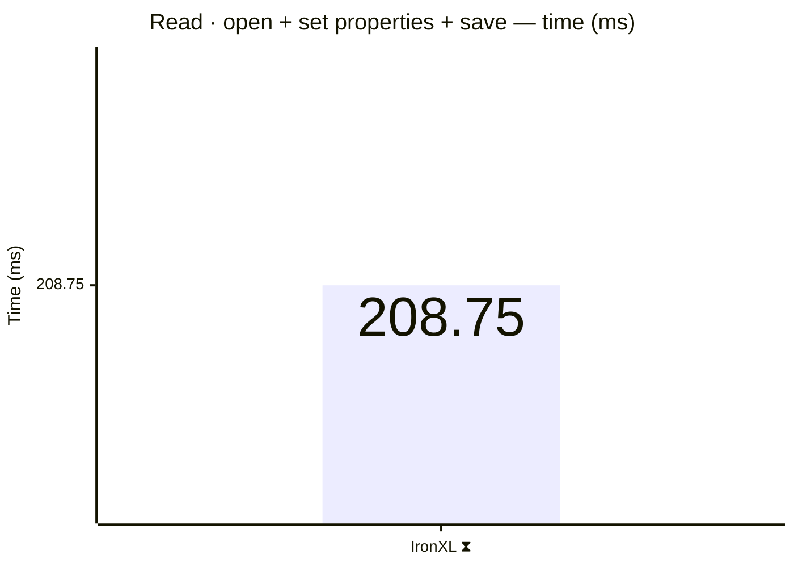

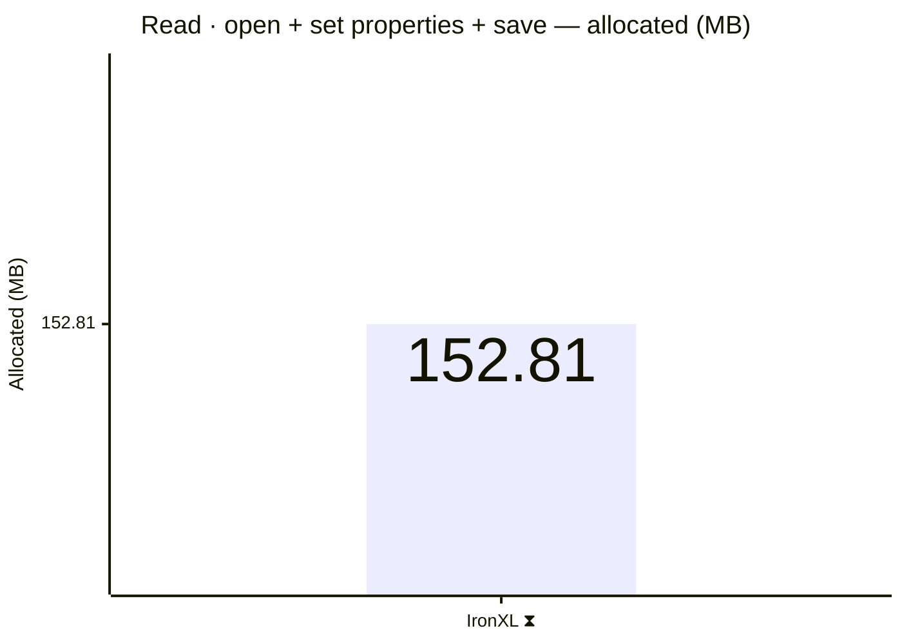

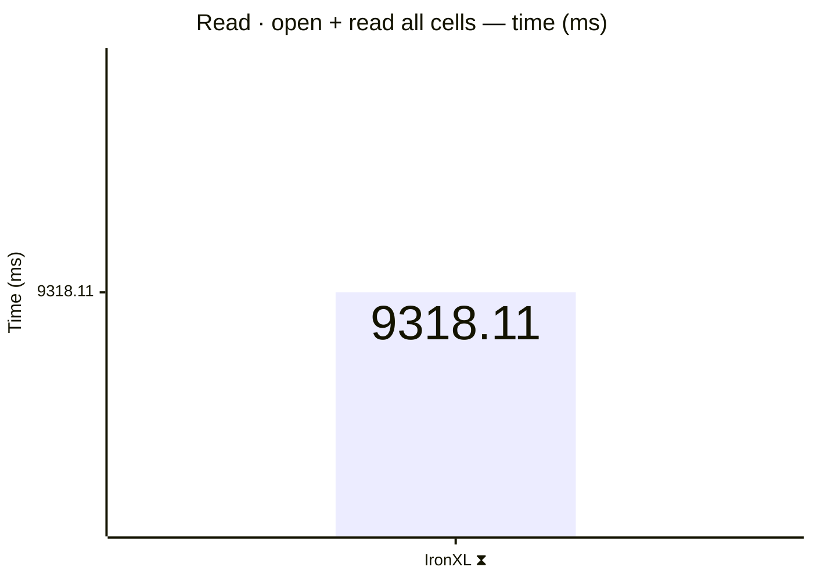

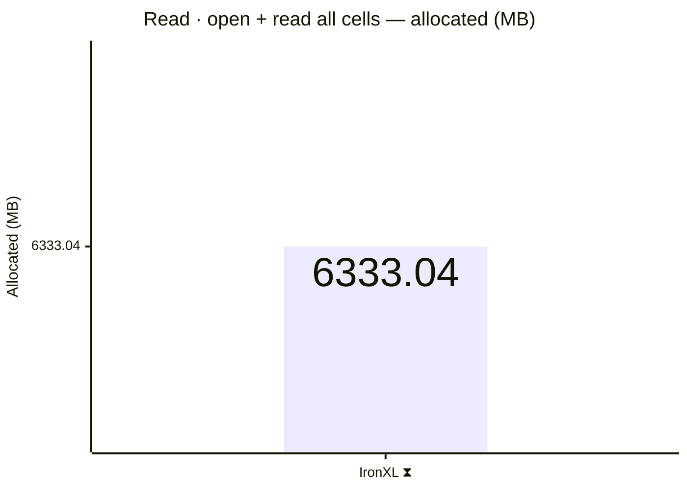

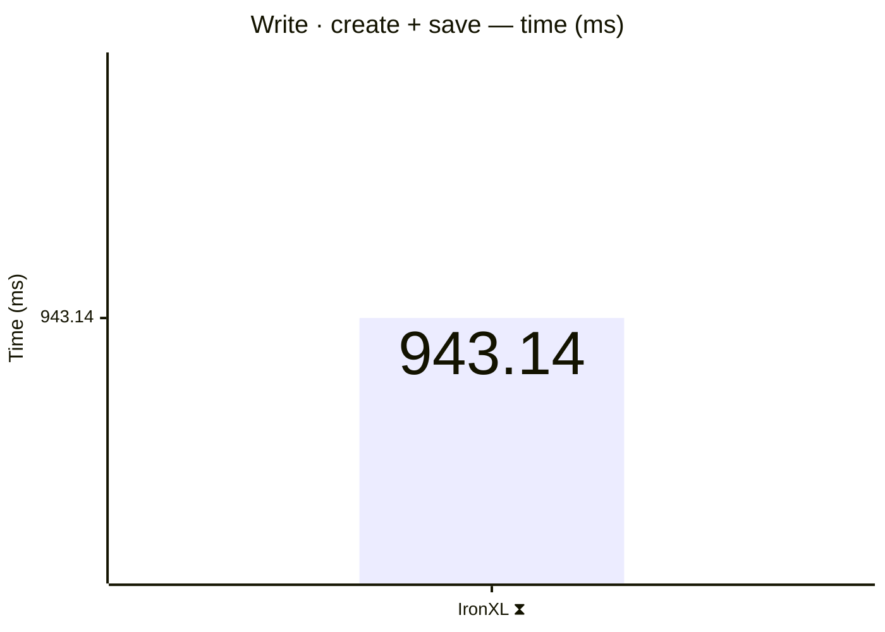

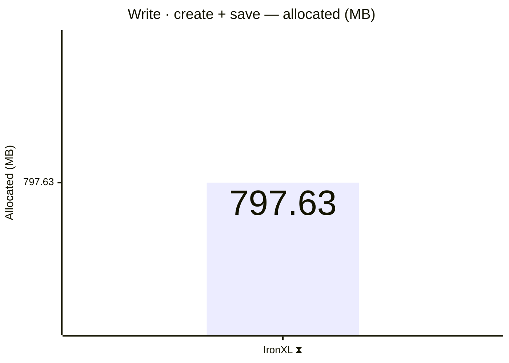

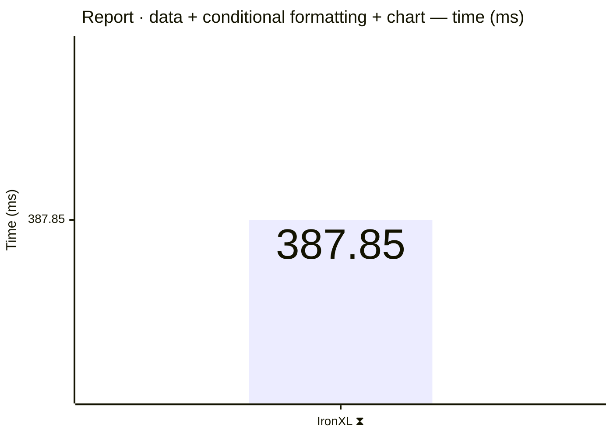

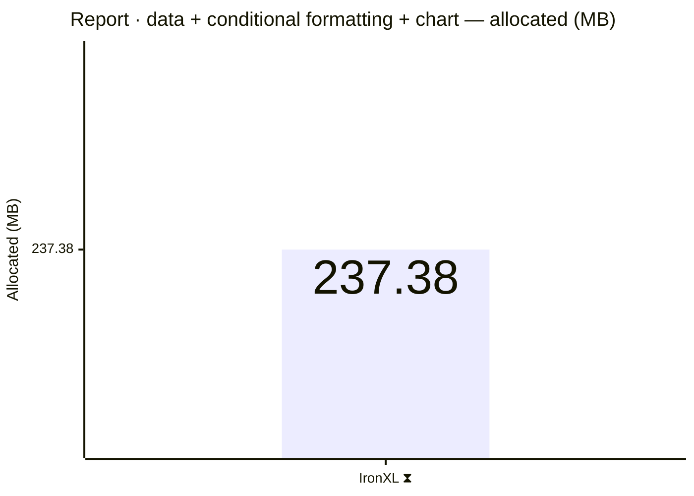

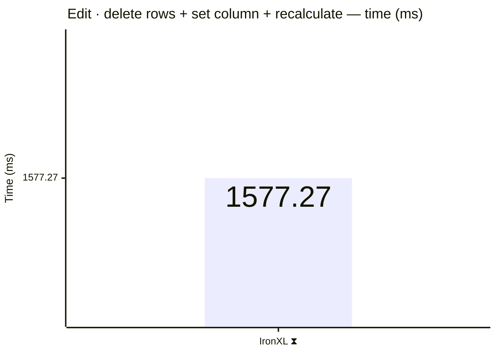

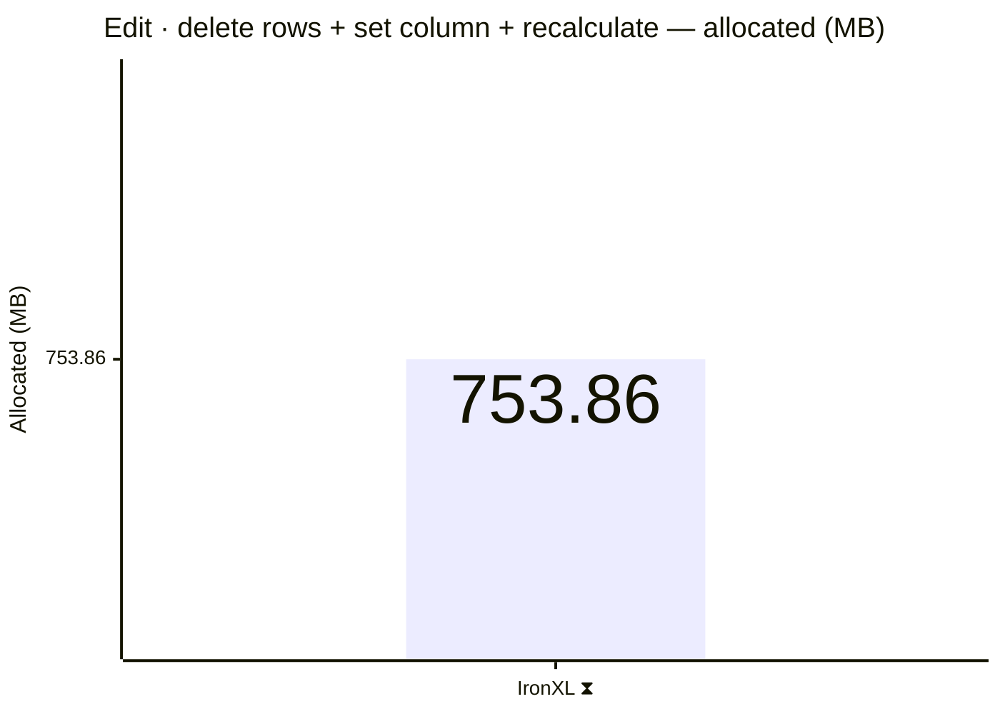

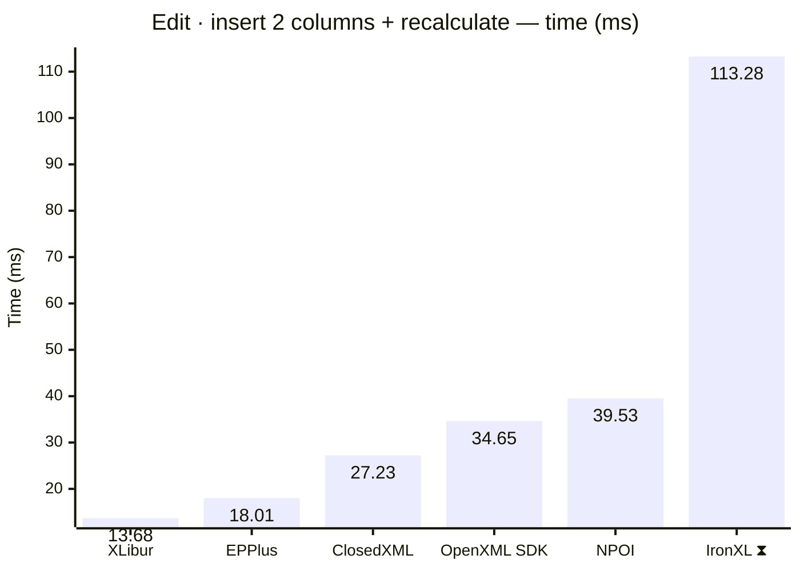


## Detailed results


```

BenchmarkDotNet v0.15.8, Windows 11 (10.0.22631.6199/23H2/2023Update/SunValley3)
AMD Ryzen 9 5950X 3.40GHz, 1 CPU, 32 logical and 16 physical cores
.NET SDK 10.0.302
  [Host]     : .NET 10.0.10 (10.0.10, 10.0.1026.32716), X64 RyuJIT x86-64-v3
  DefaultJob : .NET 10.0.10 (10.0.10, 10.0.1026.32716), X64 RyuJIT x86-64-v3


```

### Edit · insert 2 columns + recalculate

| Library     | Type                      | Method                      | Mean     | Error    | StdDev   | Gen0      | Gen1      | Gen2      | Allocated |
|------------ |-------------------------- |---------------------------- |---------:|---------:|---------:|----------:|----------:|----------:|----------:|
| XLibur      | XLiburInsertBenchmarks    | InsertColumnsAndRecalculate | 13.68 ms | 0.188 ms | 0.157 ms |  281.2500 |  156.2500 |         - |   4.73 MB |
| EPPlus      | EpPlusInsertBenchmarks    | InsertColumnsAndRecalculate | 18.01 ms | 0.360 ms | 0.743 ms | 1000.0000 | 1000.0000 | 1000.0000 |  11.41 MB |
| ClosedXML   | ClosedXmlInsertBenchmarks | InsertColumnsAndRecalculate | 27.23 ms | 0.524 ms | 1.285 ms |  750.0000 |  250.0000 |         - |  14.01 MB |
| OpenXML SDK | OpenXmlInsertBenchmarks   | InsertColumnsAndRecalculate | 34.65 ms | 0.661 ms | 1.209 ms | 1000.0000 |  800.0000 |  400.0000 |  13.05 MB |
| NPOI        | NpoiInsertBenchmarks      | InsertColumnsAndRecalculate | 39.53 ms | 0.787 ms | 1.900 ms | 2000.0000 | 1333.3333 |  500.0000 |  30.72 MB |
| IronXL ⧗ | IronXlInsertBenchmarks | InsertColumnsAndRecalculate | 113.284 ms | 41.9750 ms | 27.7638 ms | 7000.0000 | 2500.0000 | 750.0000 | 104.88 MB |


<script type="module">
  import mermaid from 'https://cdn.jsdelivr.net/npm/mermaid@11/dist/mermaid.esm.min.mjs';
  const blocks = document.querySelectorAll('.language-mermaid');
  blocks.forEach(el => {
    const code = el.querySelector('code') || el;
    const pre = document.createElement('pre');
    pre.className = 'mermaid';
    pre.textContent = code.textContent;
    el.replaceWith(pre);
  });
  if (blocks.length) {
    mermaid.initialize({ startOnLoad: false });
    await mermaid.run({ querySelector: 'pre.mermaid' });
  }
</script>

<script>
(function () {
  const parse = s => { const n = parseFloat(String(s).replace(/,/g, '')); return Number.isFinite(n) ? n : null; };
  document.querySelectorAll('table').forEach(table => {
    if (!table.tHead || !table.tBodies[0]) return;
    const heads = [...table.tHead.rows[0].cells].map(c => c.textContent.trim().toLowerCase());
    if (!heads.includes('mean')) return;
    const metricCols = heads.map((h, i) => /^(mean|allocated|gen0|gen1|gen2)$/.test(h) ? i : -1).filter(i => i >= 0);
    const rows = [...table.tBodies[0].rows];
    for (const c of metricCols) {
      const vals = rows.map(r => parse(r.cells[c]?.textContent));
      const nums = vals.filter(v => v !== null);
      if (nums.length < 2) continue;
      const min = Math.min(...nums), max = Math.max(...nums);
      if (max === min) continue;
      rows.forEach((r, i) => {
        const v = vals[i]; if (v === null) return;
        const ratio = (v - min) / (max - min);
        r.cells[c].style.backgroundColor = `hsla(${120 - 120 * ratio}, 70%, 50%, 0.45)`;
      });
    }
  });
})();
</script>
