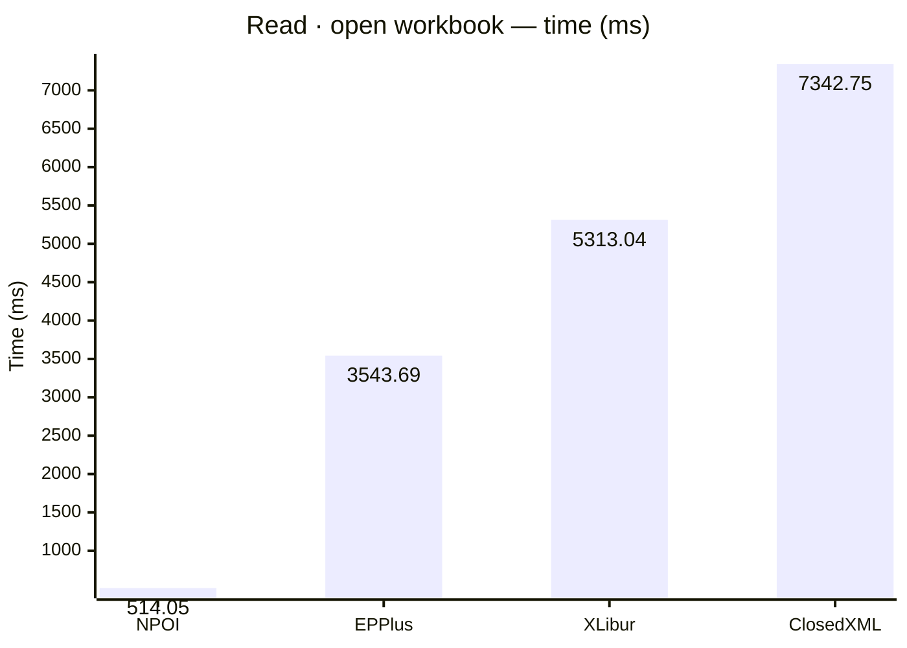
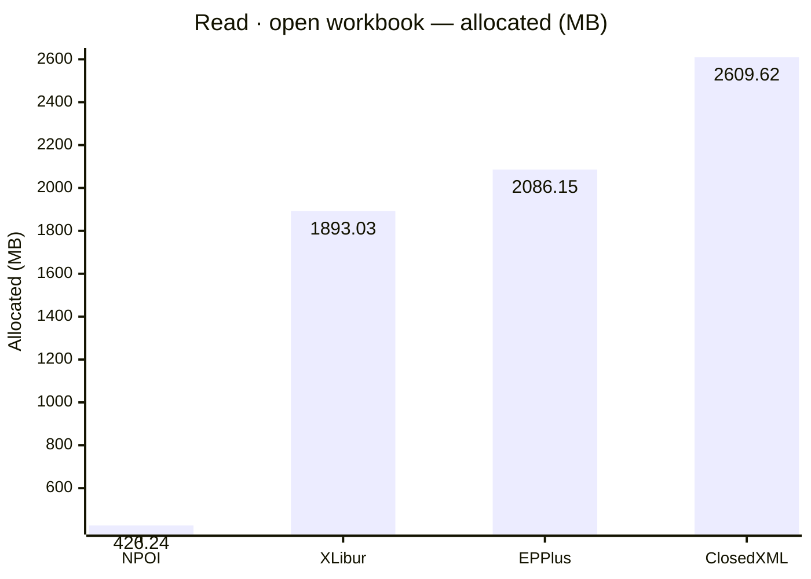
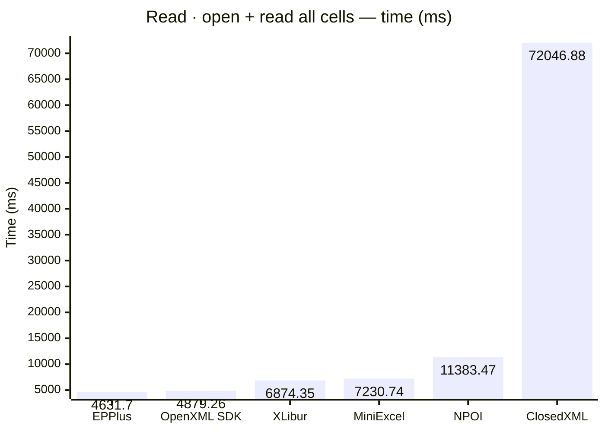
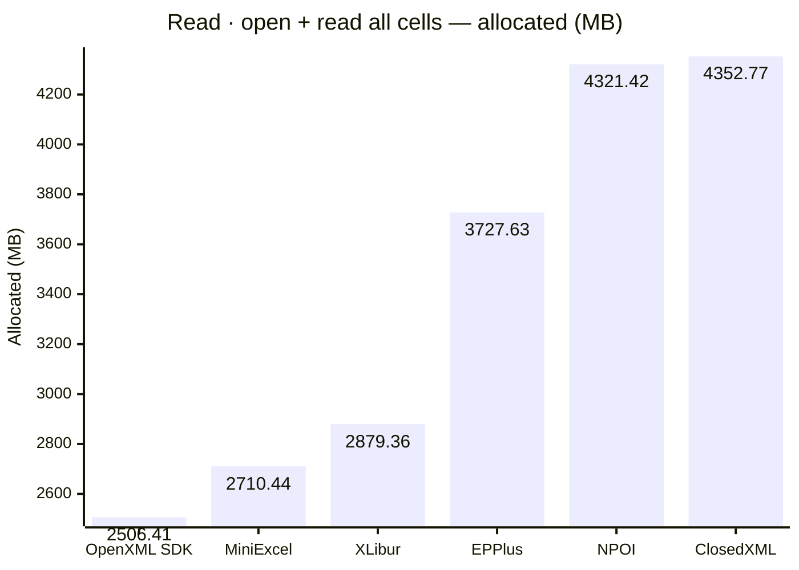
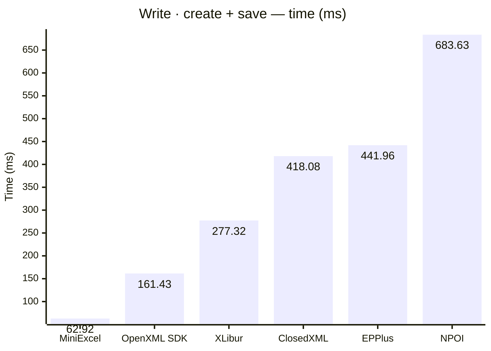
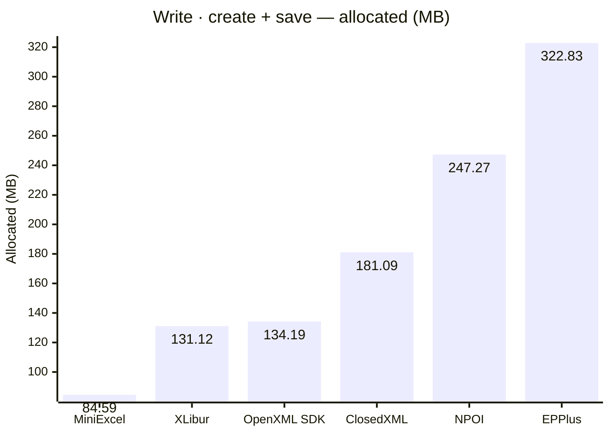

<style>
  .main-content { max-width: 90% !important; padding-left: 2rem !important; padding-right: 2rem !important; }
</style>

<!-- Generated by XLBench. Do not edit by hand; re-run scripts/run-benchmarks.ps1. -->
# XLBench Results

Each section below embeds the full BenchmarkDotNet environment block (OS, CPU,
.NET SDK and runtime). Timings are hardware-specific; treat the allocation/GC
columns as the most portable signal across machines. Regenerate locally with
`scripts/run-benchmarks.ps1`.

📈 **[Interactive charts](charts.html)** (GitHub Pages). Static charts and the full tables follow.

## Libraries under test

| Library | Version |
| --- | --- |
| ClosedXML | 0.105.0 |
| EPPlus | 8.6.2 |
| OpenXML SDK | 3.5.1 |
| NPOI | 2.8.0 |
| MiniExcel | 1.45.0 |
| XLibur | 0.105.1-rc.137 |

## Comparison charts

_Lower is better. Charts render in the GitHub file view; the Pages site has interactive versions._














```

BenchmarkDotNet v0.15.8, Windows 11 (10.0.22631.6199/23H2/2023Update/SunValley3)
AMD Ryzen 9 5950X 3.40GHz, 1 CPU, 32 logical and 16 physical cores
.NET SDK 10.0.302
  [Host]   : .NET 10.0.10 (10.0.10, 10.0.1026.32716), X64 RyuJIT x86-64-v3
  ShortRun : .NET 10.0.10 (10.0.10, 10.0.1026.32716), X64 RyuJIT x86-64-v3

Job=ShortRun  IterationCount=3  LaunchCount=1  
WarmupCount=3  

```

| Library     | Namespace                | Type                     | Method         | Mean         | Error        | StdDev     | Gen0        | Gen1        | Gen2       | Allocated  |
|------------ |------------------------- |------------------------- |--------------- |-------------:|-------------:|-----------:|------------:|------------:|-----------:|-----------:|
| ClosedXML   | XLBench.Benchmarks.Read  | ClosedXmlReadBenchmarks  | OpenWorkbook   |  7,342.75 ms |    342.10 ms |  18.752 ms | 160000.0000 |  50000.0000 |  3000.0000 | 2609.62 MB |
| ClosedXML   | XLBench.Benchmarks.Write | ClosedXmlWriteBenchmarks | CreateAndSave  |    418.08 ms |    346.52 ms |  18.994 ms |  10000.0000 |   5000.0000 |  2000.0000 |  181.09 MB |
| EPPlus      | XLBench.Benchmarks.Read  | EpPlusReadBenchmarks     | OpenWorkbook   |  3,543.69 ms |  1,087.25 ms |  59.596 ms |  77000.0000 |  27000.0000 |  8000.0000 | 2086.15 MB |
| EPPlus      | XLBench.Benchmarks.Write | EpPlusWriteBenchmarks    | CreateAndSave  |    441.96 ms |    193.11 ms |  10.585 ms |  20000.0000 |   9000.0000 |  3000.0000 |  322.83 MB |
| MiniExcel   | XLBench.Benchmarks.Read  | MiniExcelReadBenchmarks  | OpenAndReadAll |  7,230.74 ms |  1,149.23 ms |  62.993 ms | 169000.0000 |   1000.0000 |          - | 2710.44 MB |
| MiniExcel   | XLBench.Benchmarks.Write | MiniExcelWriteBenchmarks | CreateAndSave  |     62.92 ms |     48.90 ms |   2.680 ms |   5333.3333 |   1444.4444 |  1333.3333 |   84.59 MB |
| NPOI        | XLBench.Benchmarks.Read  | NpoiReadBenchmarks       | OpenWorkbook   |    514.05 ms |    165.30 ms |   9.061 ms |   7000.0000 |   6000.0000 |  2000.0000 |  426.24 MB |
| NPOI        | XLBench.Benchmarks.Write | NpoiWriteBenchmarks      | CreateAndSave  |    683.63 ms |    434.99 ms |  23.843 ms |  16000.0000 |  12000.0000 |  3000.0000 |  247.27 MB |
| OpenXML SDK | XLBench.Benchmarks.Read  | OpenXmlReadBenchmarks    | OpenAndReadAll |  4,879.26 ms |    418.76 ms |  22.954 ms | 159000.0000 |  16000.0000 |  3000.0000 | 2506.41 MB |
| OpenXML SDK | XLBench.Benchmarks.Write | OpenXmlWriteBenchmarks   | CreateAndSave  |    161.43 ms |    102.53 ms |   5.620 ms |   8000.0000 |   2000.0000 |  2000.0000 |  134.19 MB |
| XLibur      | XLBench.Benchmarks.Read  | XLiburReadBenchmarks     | OpenWorkbook   |  5,313.04 ms |  2,943.32 ms | 161.334 ms | 120000.0000 |  39000.0000 |  4000.0000 | 1893.03 MB |
| XLibur      | XLBench.Benchmarks.Write | XLiburWriteBenchmarks    | CreateAndSave  |    277.32 ms |     19.10 ms |   1.047 ms |   7000.0000 |   3000.0000 |  2000.0000 |  131.12 MB |
| ClosedXML   | XLBench.Benchmarks.Read  | ClosedXmlReadBenchmarks  | OpenAndReadAll | 72,046.88 ms |  4,726.09 ms | 259.053 ms | 233000.0000 |  87000.0000 |  6000.0000 | 4352.77 MB |
| EPPlus      | XLBench.Benchmarks.Read  | EpPlusReadBenchmarks     | OpenAndReadAll |  4,631.70 ms |    943.98 ms |  51.743 ms | 180000.0000 |  29000.0000 |  8000.0000 | 3727.63 MB |
| NPOI        | XLBench.Benchmarks.Read  | NpoiReadBenchmarks       | OpenAndReadAll | 11,383.47 ms | 12,175.78 ms | 667.396 ms | 257000.0000 | 236000.0000 | 10000.0000 | 4321.42 MB |
| XLibur      | XLBench.Benchmarks.Read  | XLiburReadBenchmarks     | OpenAndReadAll |  6,874.35 ms |    638.71 ms |  35.010 ms | 153000.0000 |  56000.0000 |  5000.0000 | 2879.36 MB |

<script type="module">
  import mermaid from 'https://cdn.jsdelivr.net/npm/mermaid@11/dist/mermaid.esm.min.mjs';
  const blocks = document.querySelectorAll('.language-mermaid');
  blocks.forEach(el => {
    const code = el.querySelector('code') || el;
    const pre = document.createElement('pre');
    pre.className = 'mermaid';
    pre.textContent = code.textContent;
    el.replaceWith(pre);
  });
  if (blocks.length) {
    mermaid.initialize({ startOnLoad: false });
    await mermaid.run({ querySelector: 'pre.mermaid' });
  }
</script>

