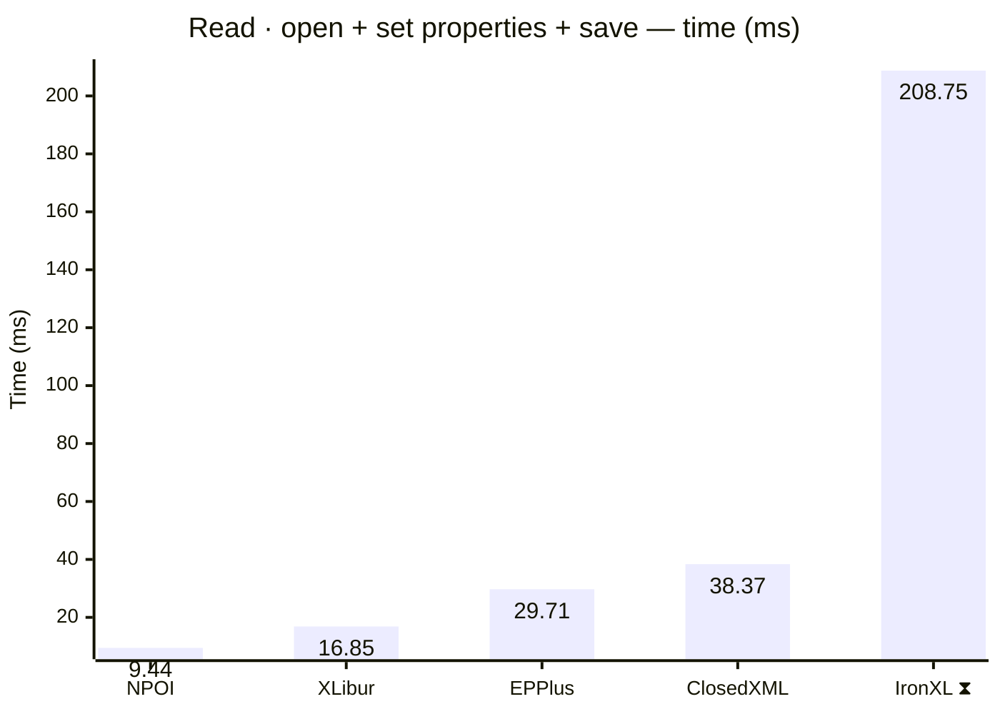
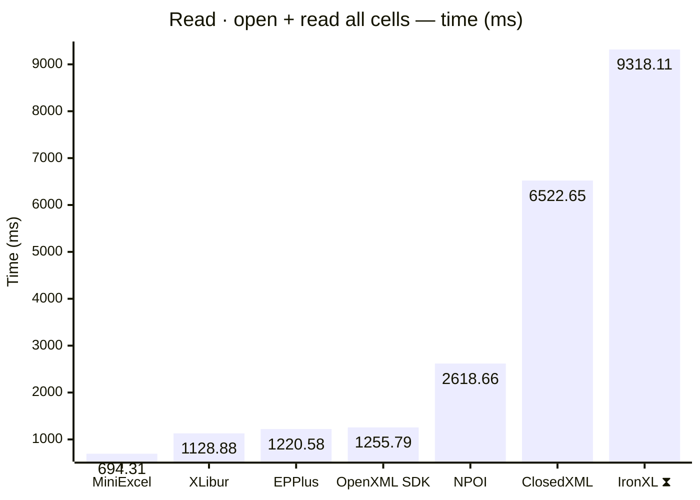
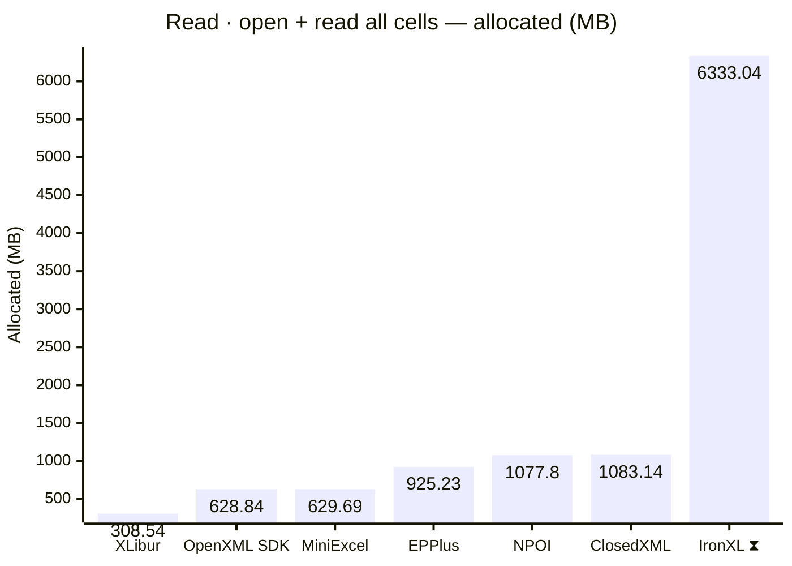
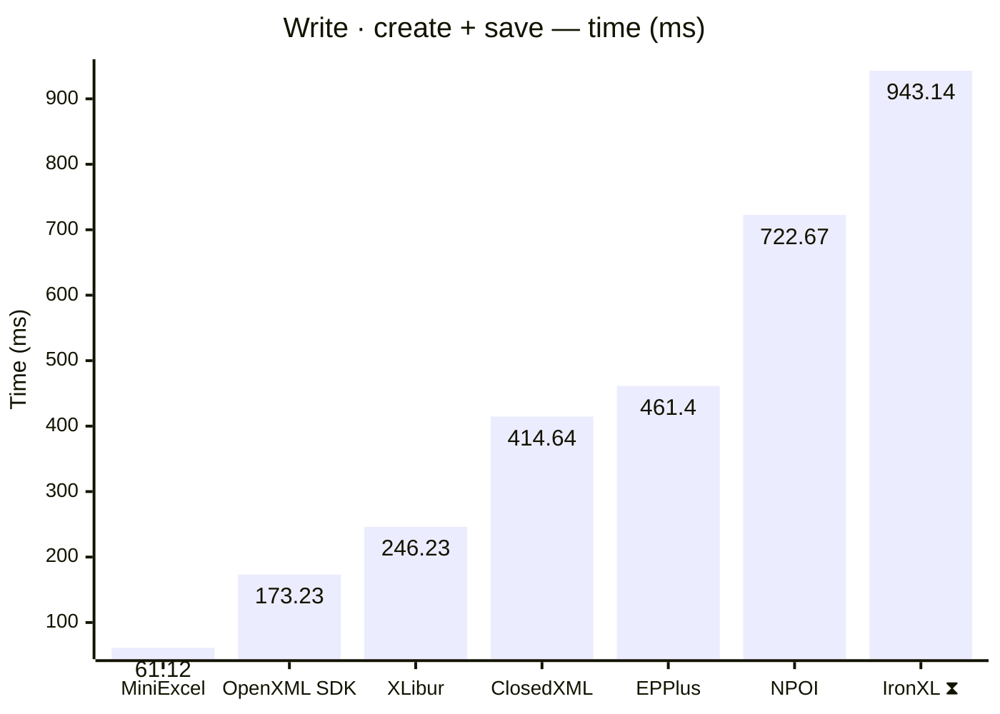
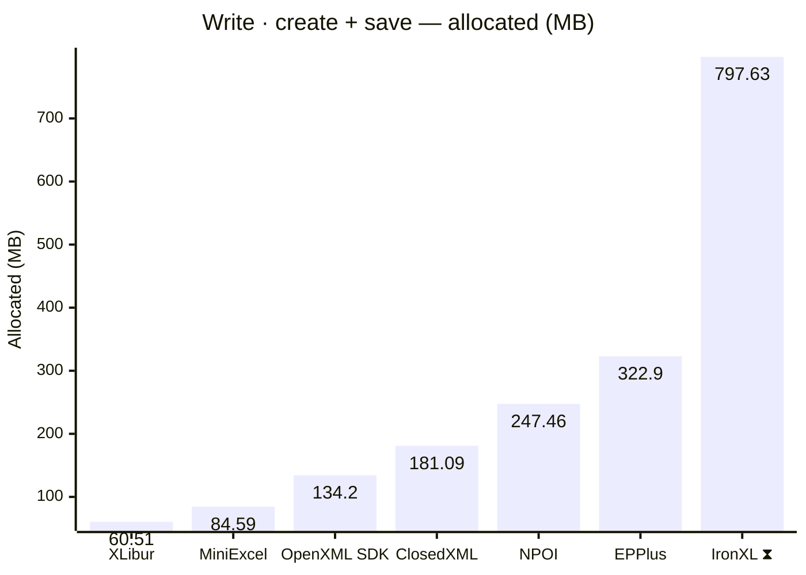
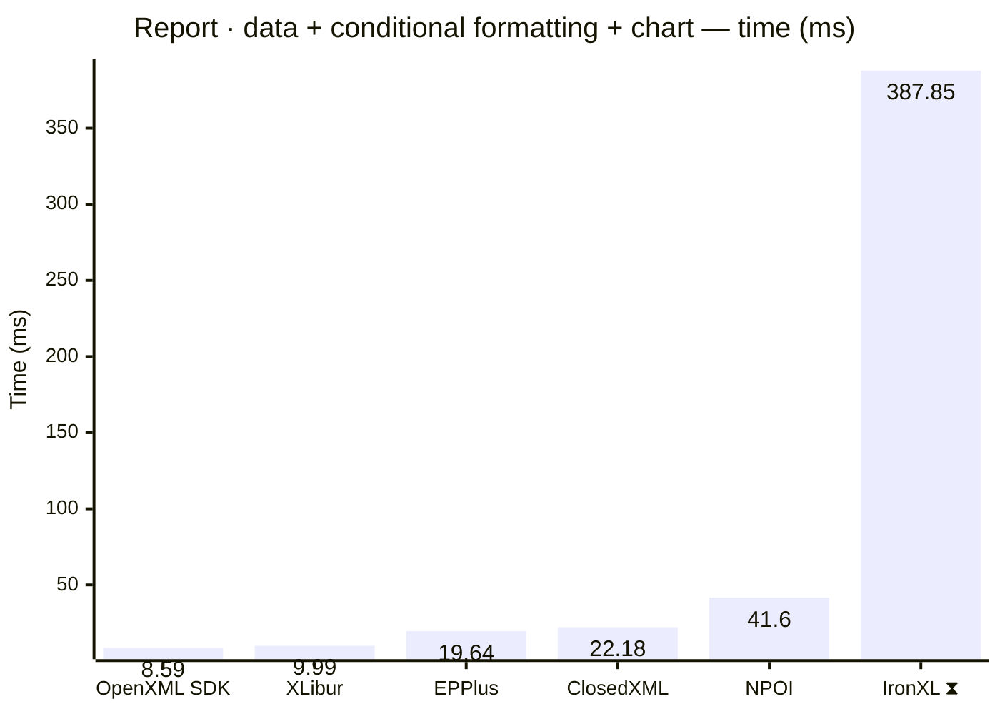
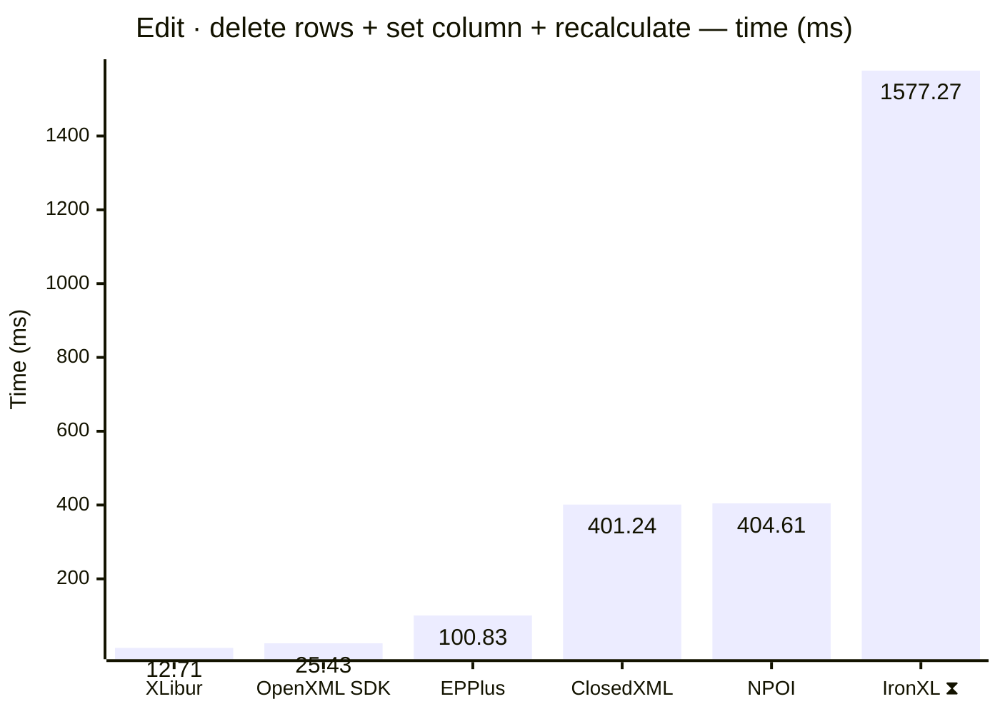
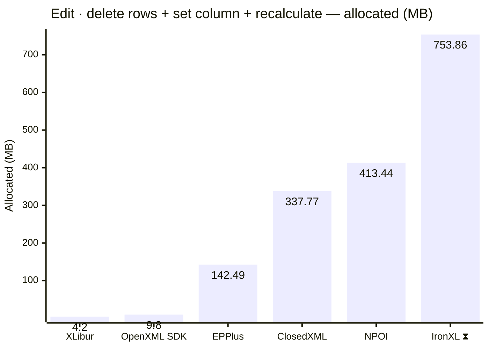
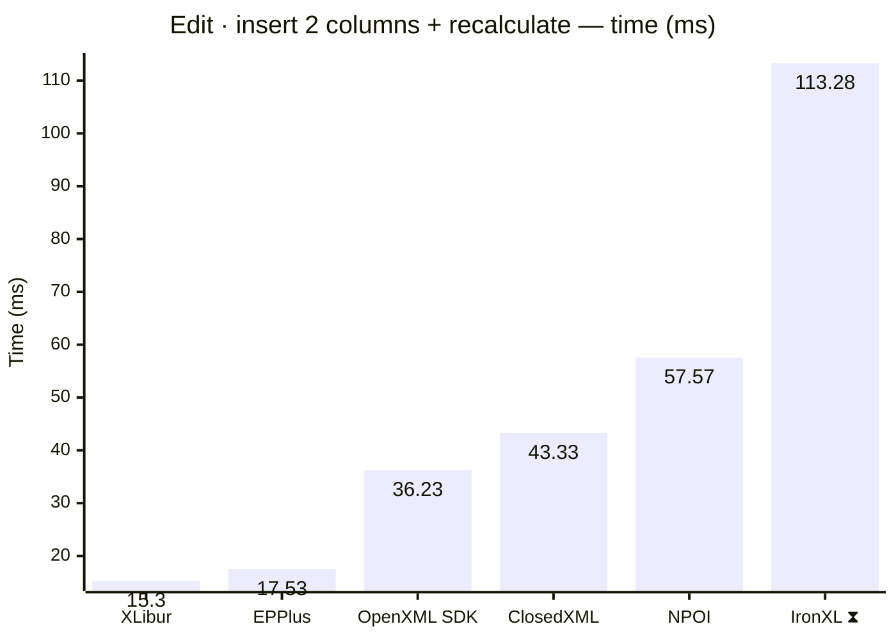

<style>
  .main-content { max-width: 90% !important; padding-left: 2rem !important; padding-right: 2rem !important; }
</style>
<!-- Generated by XLBench. Do not edit by hand; re-run scripts/run-benchmarks.ps1. -->
# XLBench Results

Each section below embeds the full BenchmarkDotNet environment block (OS, CPU,
.NET SDK and runtime). Timings are hardware-specific; treat the allocation/GC
columns as the most portable signal across machines. Regenerate locally with
`scripts/run-benchmarks.ps1`.

📈 **[Interactive charts](charts.html)** (GitHub Pages). Static charts and the full tables follow.

Each results table (one per test method) is heat-mapped independently on the Pages site (🟩 best → 🟥 worst).

> ⧗ **Carried over from an earlier run.** The rows and chart points below marked with this symbol were not measured here — the library is commercial and needs a licence key this run did not have — so they are replayed from `snapshots/`. Compare them as indicative rather than like-for-like, and see the repository README for how to refresh a snapshot.
>
> - **IronXL** 2026.8.1, Job-HTCPYF job, captured 2026-08-03 on same hardware as this run.

## Libraries under test

| Library | Version | Source |
| --- | --- | --- |
| ClosedXML | 0.105.1 | this run |
| EPPlus | 8.6.3 | this run |
| OpenXML SDK | 3.5.1 | this run |
| NPOI | 2.8.0 | this run |
| MiniExcel | 1.45.0 | this run |
| XLibur | 0.310.0 | this run |
| IronXL ⧗ | 2026.8.1 | snapshot (2026.8.1, Job-HTCPYF, captured 2026-08-03) |

## Comparison charts

_Lower is better. Charts render in the GitHub file view; the Pages site has interactive versions._






















## Detailed results


```

BenchmarkDotNet v0.15.8, Windows 11 (10.0.22631.6199/23H2/2023Update/SunValley3)
AMD Ryzen 9 5950X 3.40GHz, 1 CPU, 32 logical and 16 physical cores
.NET SDK 10.0.302
  [Host]     : .NET 10.0.10 (10.0.10, 10.0.1026.32716), X64 RyuJIT x86-64-v3
  Job-HTCPYF : .NET 10.0.10 (10.0.10, 10.0.1026.32716), X64 RyuJIT x86-64-v3

MaxIterationCount=10  MaxWarmupIterationCount=3  MinIterationCount=5  
MinWarmupIterationCount=1  

```

### Read · open + set properties + save

| Library     | Type                      | Method                      | Mean         | Error       | StdDev      | Gen0       | Gen1       | Gen2      | Allocated  |
|------------ |-------------------------- |---------------------------- |-------------:|------------:|------------:|-----------:|-----------:|----------:|-----------:|
| NPOI        | NpoiReadBenchmarks        | OpenAmendPropertiesAndSave  |     9.435 ms |   0.4471 ms |   0.2661 ms |    62.5000 |    31.2500 |         - |     1.9 MB |
| XLibur      | XLiburReadBenchmarks      | OpenAmendPropertiesAndSave  |    16.848 ms |   0.9752 ms |   0.5101 ms |          - |          - |         - |    1.74 MB |
| EPPlus      | EpPlusReadBenchmarks      | OpenAmendPropertiesAndSave  |    29.712 ms |  14.2888 ms |   8.5030 ms |  1000.0000 |  1000.0000 | 1000.0000 |   13.88 MB |
| ClosedXML   | ClosedXmlReadBenchmarks   | OpenAmendPropertiesAndSave  |    38.373 ms |   3.4944 ms |   2.0795 ms |   666.6667 |   333.3333 |         - |   13.18 MB |
| IronXL ⧗ | IronXlReadBenchmarks | OpenAmendPropertiesAndSave | 208.746 ms | 155.7570 ms | 92.6885 ms | 9000.0000 | 2000.0000 | - | 152.81 MB |

### Read · open + read all cells

| Library     | Type                      | Method                      | Mean         | Error       | StdDev      | Gen0       | Gen1       | Gen2      | Allocated  |
|------------ |-------------------------- |---------------------------- |-------------:|------------:|------------:|-----------:|-----------:|----------:|-----------:|
| MiniExcel   | MiniExcelReadBenchmarks   | OpenAndReadAll              |   694.313 ms |  11.6117 ms |   6.0732 ms | 39000.0000 |  4000.0000 | 1000.0000 |  629.69 MB |
| XLibur      | XLiburReadBenchmarks      | OpenAndReadAll              | 1,128.882 ms |  22.0751 ms |  14.6013 ms | 13000.0000 | 10000.0000 | 2000.0000 |  308.54 MB |
| EPPlus      | EpPlusReadBenchmarks      | OpenAndReadAll              | 1,220.576 ms |  28.9727 ms |  17.2412 ms | 49000.0000 | 14000.0000 | 7000.0000 |  925.23 MB |
| OpenXML SDK | OpenXmlReadBenchmarks     | OpenAndReadAll              | 1,255.792 ms |  20.4397 ms |  10.6903 ms | 40000.0000 |  6000.0000 | 1000.0000 |  628.84 MB |
| NPOI        | NpoiReadBenchmarks        | OpenAndReadAll              | 2,618.664 ms | 175.0937 ms | 104.1954 ms | 68000.0000 | 62000.0000 | 6000.0000 |  1077.8 MB |
| ClosedXML   | ClosedXmlReadBenchmarks   | OpenAndReadAll              | 6,522.648 ms | 125.7613 ms |  74.8385 ms | 59000.0000 | 23000.0000 | 3000.0000 | 1083.14 MB |
| IronXL ⧗ | IronXlReadBenchmarks | OpenAndReadAll | 9,318.107 ms | 477.3336 ms | 315.7266 ms | 393000.0000 | 202000.0000 | 10000.0000 | 6333.04 MB |

### Write · create + save

| Library     | Type                      | Method                      | Mean         | Error       | StdDev      | Gen0       | Gen1       | Gen2      | Allocated  |
|------------ |-------------------------- |---------------------------- |-------------:|------------:|------------:|-----------:|-----------:|----------:|-----------:|
| MiniExcel   | MiniExcelWriteBenchmarks  | CreateAndSave               |    61.120 ms |   1.9937 ms |   1.1864 ms |  5333.3333 |  1333.3333 | 1333.3333 |   84.59 MB |
| OpenXML SDK | OpenXmlWriteBenchmarks    | CreateAndSave               |   173.226 ms |   7.7930 ms |   5.1546 ms |  9000.0000 |  2333.3333 | 2333.3333 |   134.2 MB |
| XLibur      | XLiburWriteBenchmarks     | CreateAndSave               |   246.227 ms |  13.3057 ms |   8.8009 ms |  3000.0000 |  2000.0000 | 2000.0000 |   60.51 MB |
| ClosedXML   | ClosedXmlWriteBenchmarks  | CreateAndSave               |   414.639 ms |  12.1560 ms |   8.0405 ms | 10000.0000 |  5000.0000 | 2000.0000 |  181.09 MB |
| EPPlus      | EpPlusWriteBenchmarks     | CreateAndSave               |   461.401 ms |  15.1523 ms |  10.0223 ms | 20000.0000 |  9000.0000 | 3000.0000 |   322.9 MB |
| NPOI        | NpoiWriteBenchmarks       | CreateAndSave               |   722.667 ms |  14.1612 ms |   6.2877 ms | 16000.0000 | 12000.0000 | 3000.0000 |  247.46 MB |
| IronXL ⧗ | IronXlWriteBenchmarks | CreateAndSave | 943.137 ms | 18.5191 ms | 11.0204 ms | 48000.0000 | 16000.0000 | 3000.0000 | 797.63 MB |

### Report · data + conditional formatting + chart

| Library     | Type                      | Method                      | Mean         | Error       | StdDev      | Gen0       | Gen1       | Gen2      | Allocated  |
|------------ |-------------------------- |---------------------------- |-------------:|------------:|------------:|-----------:|-----------:|----------:|-----------:|
| OpenXML SDK | OpenXmlReportBenchmarks   | CreateStockReport           |     8.586 ms |   0.3742 ms |   0.2227 ms |   375.0000 |   359.3750 |  187.5000 |    4.92 MB |
| XLibur      | XLiburReportBenchmarks    | CreateStockReport           |     9.993 ms |   0.6205 ms |   0.4104 ms |   187.5000 |   187.5000 |  187.5000 |    3.48 MB |
| EPPlus      | EpPlusReportBenchmarks    | CreateStockReport           |    19.636 ms |   6.0135 ms |   3.9775 ms |  1000.0000 |  1000.0000 | 1000.0000 |      14 MB |
| ClosedXML   | ClosedXmlReportBenchmarks | CreateStockReport           |    22.178 ms |   4.7405 ms |   3.1355 ms |   428.5714 |   142.8571 |         - |    8.02 MB |
| NPOI        | NpoiReportBenchmarks      | CreateStockReport           |    41.600 ms |  16.4198 ms |  10.8607 ms |   875.0000 |   750.0000 |  375.0000 |   16.26 MB |
| IronXL ⧗ | IronXlReportBenchmarks | CreateStockReport | 387.849 ms | 36.5456 ms | 24.1726 ms | 14000.0000 | 3000.0000 | - | 237.38 MB |

### Edit · delete rows + set column + recalculate

| Library     | Type                      | Method                      | Mean         | Error       | StdDev      | Gen0       | Gen1       | Gen2      | Allocated  |
|------------ |-------------------------- |---------------------------- |-------------:|------------:|------------:|-----------:|-----------:|----------:|-----------:|
| XLibur      | XLiburEditBenchmarks      | EditAndRecalculate          |    12.706 ms |   0.2208 ms |   0.1155 ms |   250.0000 |   125.0000 |         - |     4.2 MB |
| OpenXML SDK | OpenXmlEditBenchmarks     | EditAndRecalculate          |    25.427 ms |   0.9302 ms |   0.5536 ms |   666.6667 |   500.0000 |  166.6667 |     9.8 MB |
| EPPlus      | EpPlusEditBenchmarks      | EditAndRecalculate          |   100.826 ms |  14.9803 ms |   9.9085 ms |  9000.0000 |  1250.0000 | 1000.0000 |  142.49 MB |
| ClosedXML   | ClosedXmlEditBenchmarks   | EditAndRecalculate          |   401.236 ms |  14.5991 ms |   9.6564 ms | 21000.0000 |  1000.0000 |         - |  337.77 MB |
| NPOI        | NpoiEditBenchmarks        | EditAndRecalculate          |   404.613 ms |   8.8191 ms |   5.2481 ms | 25000.0000 |  1000.0000 |         - |  413.44 MB |
| IronXL ⧗ | IronXlEditBenchmarks | EditAndRecalculate | 1,577.273 ms | 62.9583 ms | 41.6430 ms | 57000.0000 | 36000.0000 | 15000.0000 | 753.86 MB |

### Edit · insert 2 columns + recalculate

| Library     | Type                      | Method                      | Mean         | Error       | StdDev      | Gen0       | Gen1       | Gen2      | Allocated  |
|------------ |-------------------------- |---------------------------- |-------------:|------------:|------------:|-----------:|-----------:|----------:|-----------:|
| XLibur      | XLiburInsertBenchmarks    | InsertColumnsAndRecalculate |    15.302 ms |   0.5386 ms |   0.3563 ms |   281.2500 |   125.0000 |         - |    4.87 MB |
| EPPlus      | EpPlusInsertBenchmarks    | InsertColumnsAndRecalculate |    17.528 ms |   0.3238 ms |   0.1693 ms |  1000.0000 |  1000.0000 | 1000.0000 |   11.41 MB |
| OpenXML SDK | OpenXmlInsertBenchmarks   | InsertColumnsAndRecalculate |    36.227 ms |   1.1224 ms |   0.7424 ms |  1076.9231 |   923.0769 |  384.6154 |   13.05 MB |
| ClosedXML   | ClosedXmlInsertBenchmarks | InsertColumnsAndRecalculate |    43.333 ms |  17.3359 ms |  11.4666 ms |   800.0000 |   400.0000 |         - |   13.64 MB |
| NPOI        | NpoiInsertBenchmarks      | InsertColumnsAndRecalculate |    57.567 ms |  19.8877 ms |  13.1545 ms |  2000.0000 |  1400.0000 |  600.0000 |   30.72 MB |
| IronXL ⧗ | IronXlInsertBenchmarks | InsertColumnsAndRecalculate | 113.284 ms | 41.9750 ms | 27.7638 ms | 7000.0000 | 2500.0000 | 750.0000 | 104.88 MB |


<script type="module">
  import mermaid from 'https://cdn.jsdelivr.net/npm/mermaid@11/dist/mermaid.esm.min.mjs';
  const blocks = document.querySelectorAll('.language-mermaid');
  blocks.forEach(el => {
    const code = el.querySelector('code') || el;
    const pre = document.createElement('pre');
    pre.className = 'mermaid';
    pre.textContent = code.textContent;
    el.replaceWith(pre);
  });
  if (blocks.length) {
    mermaid.initialize({ startOnLoad: false });
    await mermaid.run({ querySelector: 'pre.mermaid' });
  }
</script>

<script>
(function () {
  const parse = s => { const n = parseFloat(String(s).replace(/,/g, '')); return Number.isFinite(n) ? n : null; };
  document.querySelectorAll('table').forEach(table => {
    if (!table.tHead || !table.tBodies[0]) return;
    const heads = [...table.tHead.rows[0].cells].map(c => c.textContent.trim().toLowerCase());
    if (!heads.includes('mean')) return;
    const metricCols = heads.map((h, i) => /^(mean|allocated|gen0|gen1|gen2)$/.test(h) ? i : -1).filter(i => i >= 0);
    const rows = [...table.tBodies[0].rows];
    for (const c of metricCols) {
      const vals = rows.map(r => parse(r.cells[c]?.textContent));
      const nums = vals.filter(v => v !== null);
      if (nums.length < 2) continue;
      const min = Math.min(...nums), max = Math.max(...nums);
      if (max === min) continue;
      rows.forEach((r, i) => {
        const v = vals[i]; if (v === null) return;
        const ratio = (v - min) / (max - min);
        r.cells[c].style.backgroundColor = `hsla(${120 - 120 * ratio}, 70%, 50%, 0.45)`;
      });
    }
  });
})();
</script>
