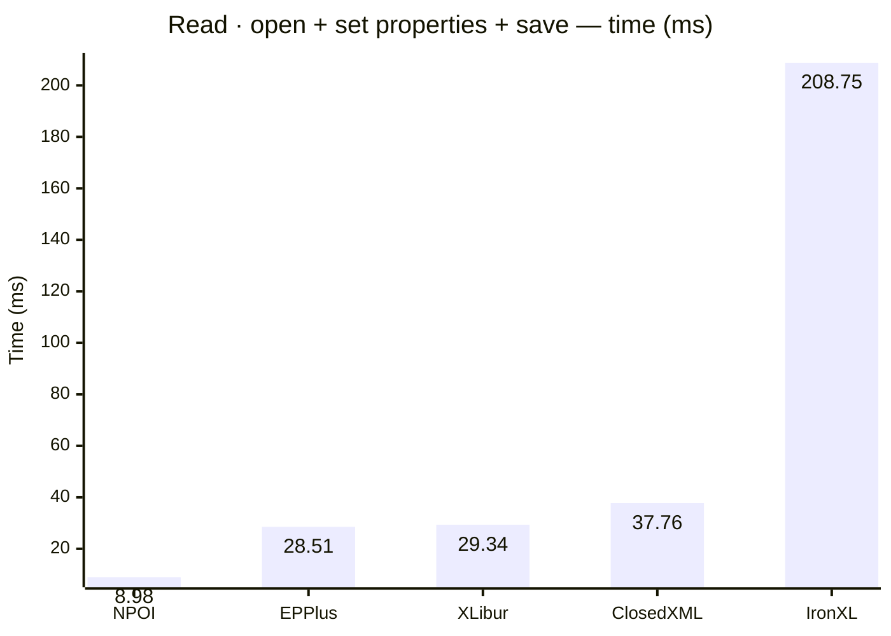
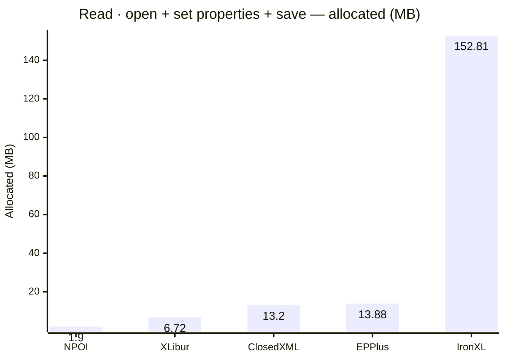
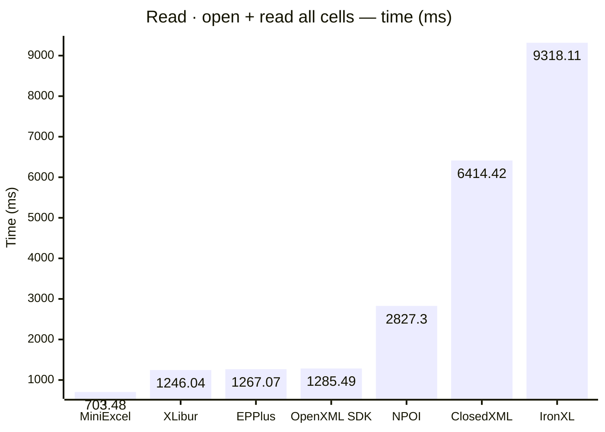
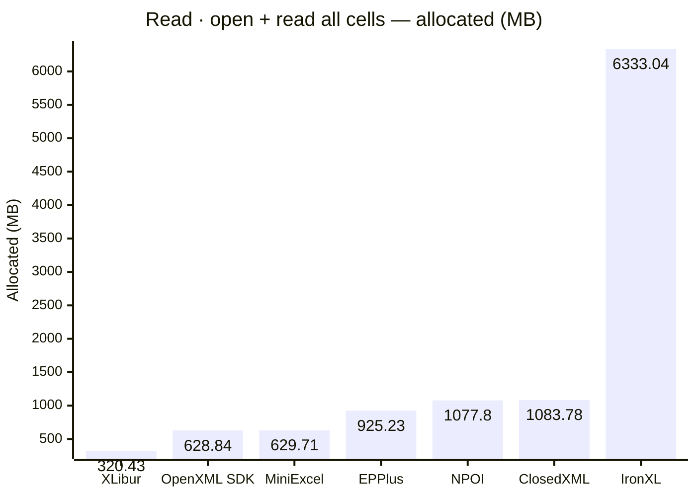
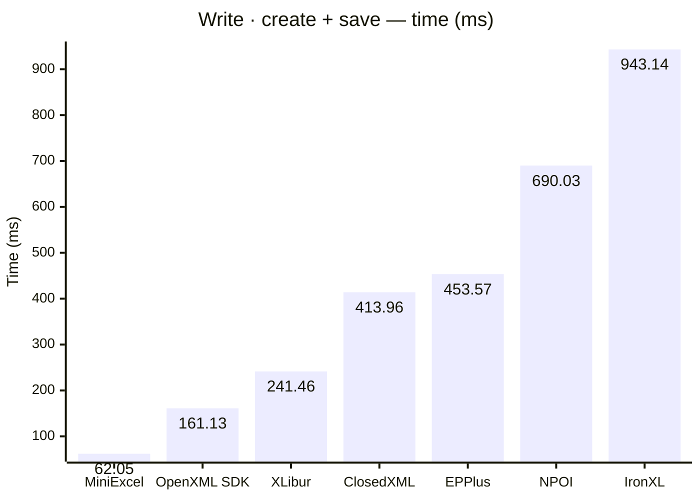
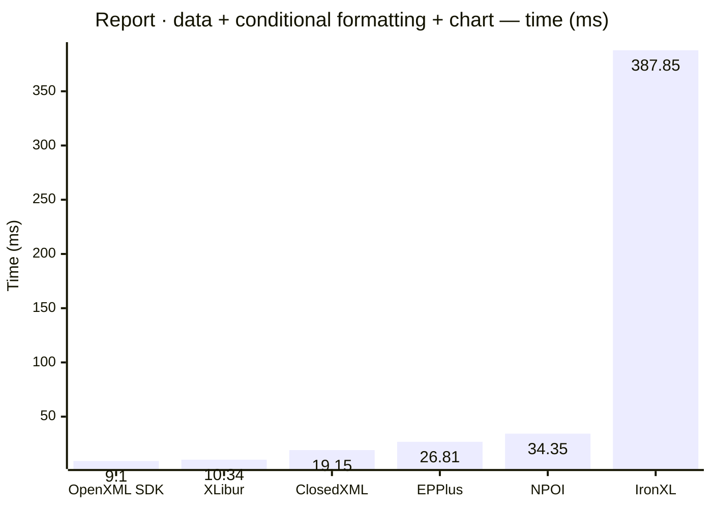
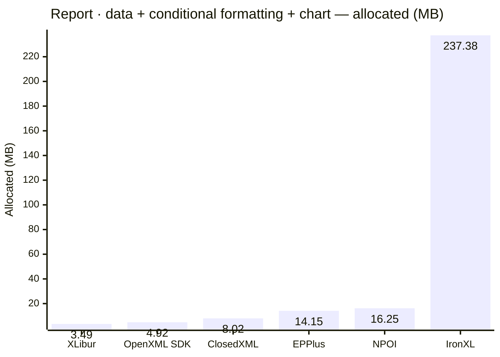
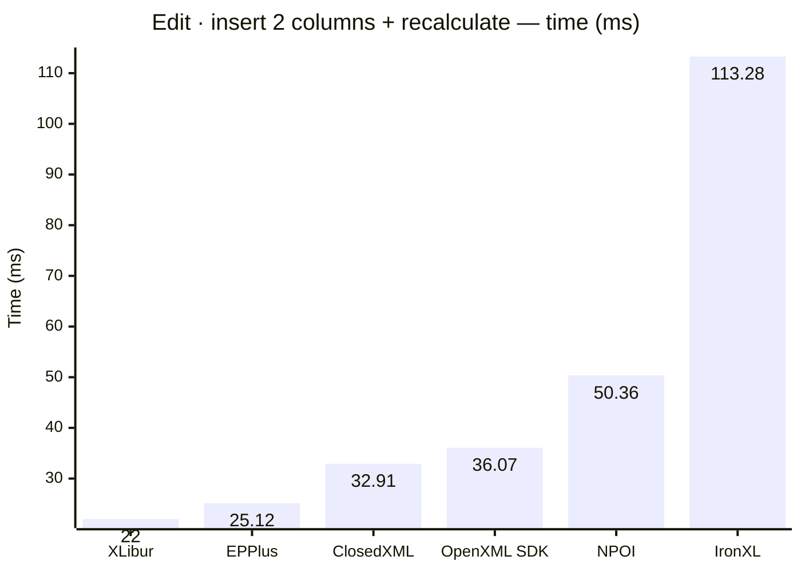
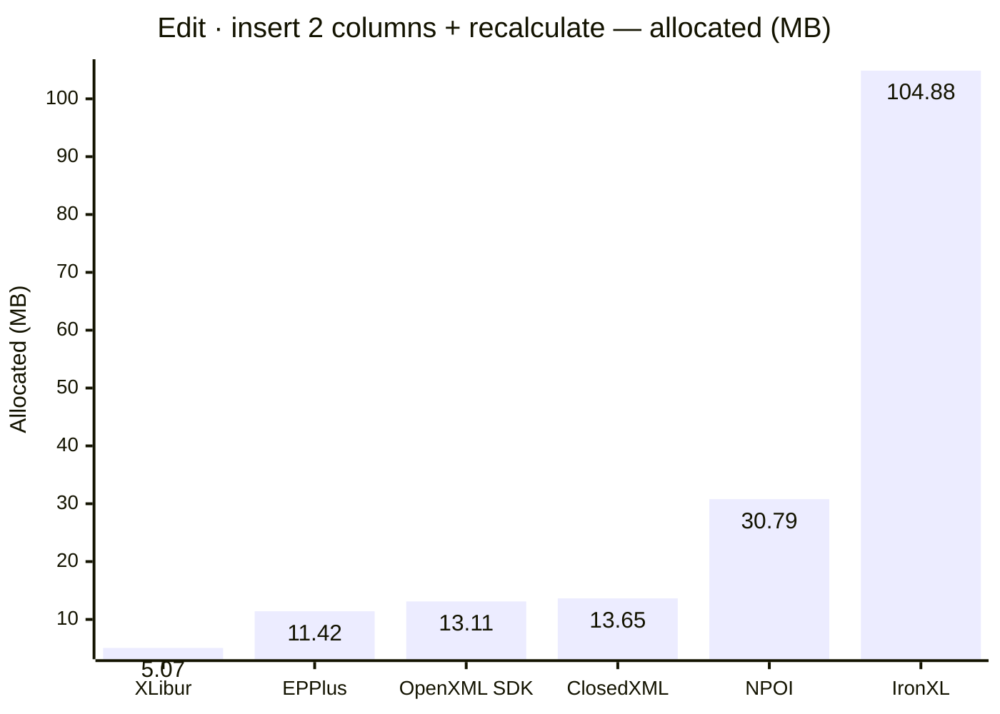

<style>
  .main-content { max-width: 90% !important; padding-left: 2rem !important; padding-right: 2rem !important; }
</style>
<!-- Generated by XLBench. Do not edit by hand; re-run scripts/run-benchmarks.ps1. -->
# XLBench Results

Each section below embeds the full BenchmarkDotNet environment block (OS, CPU,
.NET SDK and runtime). Timings are hardware-specific; treat the allocation/GC
columns as the most portable signal across machines. Regenerate locally with
`scripts/run-benchmarks.ps1`.

📈 **[Interactive charts](charts.html)** (GitHub Pages). Static charts and the full tables follow.

Each results table (one per test method) is heat-mapped independently on the Pages site (🟩 best → 🟥 worst).

## Libraries under test

| Library | Version | Source |
| --- | --- | --- |
| ClosedXML | 0.105.1 | this run |
| EPPlus | 8.6.3 | this run |
| OpenXML SDK | 3.5.1 | this run |
| NPOI | 2.8.0 | this run |
| MiniExcel | 1.45.0 | this run |
| XLibur | 0.300.0 | this run |
| IronXL | 2026.8.1 | this run |

## Comparison charts

_Lower is better. Charts render in the GitHub file view; the Pages site has interactive versions._





















## Detailed results


```

BenchmarkDotNet v0.15.8, Windows 11 (10.0.22631.6199/23H2/2023Update/SunValley3)
AMD Ryzen 9 5950X 3.40GHz, 1 CPU, 32 logical and 16 physical cores
.NET SDK 10.0.302
  [Host]     : .NET 10.0.10 (10.0.10, 10.0.1026.32716), X64 RyuJIT x86-64-v3
  Job-HTCPYF : .NET 10.0.10 (10.0.10, 10.0.1026.32716), X64 RyuJIT x86-64-v3

MaxIterationCount=10  MaxWarmupIterationCount=3  MinIterationCount=5  
MinWarmupIterationCount=1  

```

### Read · open + set properties + save

| Library     | Type                      | Method                      | Mean         | Error       | StdDev      | Median       | Gen0        | Gen1        | Gen2       | Allocated  |
|------------ |-------------------------- |---------------------------- |-------------:|------------:|------------:|-------------:|------------:|------------:|-----------:|-----------:|
| NPOI        | NpoiReadBenchmarks        | OpenAmendPropertiesAndSave  |     8.979 ms |   0.3452 ms |   0.2054 ms |     8.913 ms |     62.5000 |     31.2500 |          - |     1.9 MB |
| EPPlus      | EpPlusReadBenchmarks      | OpenAmendPropertiesAndSave  |    28.510 ms |   6.4532 ms |   4.2684 ms |    27.658 ms |   1000.0000 |   1000.0000 |  1000.0000 |   13.88 MB |
| XLibur      | XLiburReadBenchmarks      | OpenAmendPropertiesAndSave  |    29.342 ms |  10.0394 ms |   5.2508 ms |    26.863 ms |    285.7143 |    142.8571 |          - |    6.72 MB |
| ClosedXML   | ClosedXmlReadBenchmarks   | OpenAmendPropertiesAndSave  |    37.759 ms |   4.0715 ms |   2.4229 ms |    37.239 ms |    666.6667 |    333.3333 |          - |    13.2 MB |
| IronXL      | IronXlReadBenchmarks      | OpenAmendPropertiesAndSave  |   208.746 ms | 155.7570 ms |  92.6885 ms |   168.705 ms |   9000.0000 |   2000.0000 |          - |  152.81 MB |

### Read · open + read all cells

| Library     | Type                      | Method                      | Mean         | Error       | StdDev      | Median       | Gen0        | Gen1        | Gen2       | Allocated  |
|------------ |-------------------------- |---------------------------- |-------------:|------------:|------------:|-------------:|------------:|------------:|-----------:|-----------:|
| MiniExcel   | MiniExcelReadBenchmarks   | OpenAndReadAll              |   703.483 ms |  29.6390 ms |  19.6044 ms |   708.358 ms |  39000.0000 |   4000.0000 |  1000.0000 |  629.71 MB |
| XLibur      | XLiburReadBenchmarks      | OpenAndReadAll              | 1,246.042 ms |  48.3794 ms |  32.0000 ms | 1,249.042 ms |  15000.0000 |  12000.0000 |  3000.0000 |  320.43 MB |
| EPPlus      | EpPlusReadBenchmarks      | OpenAndReadAll              | 1,267.066 ms |  67.4416 ms |  44.6084 ms | 1,259.885 ms |  49000.0000 |  14000.0000 |  7000.0000 |  925.23 MB |
| OpenXML SDK | OpenXmlReadBenchmarks     | OpenAndReadAll              | 1,285.492 ms |  36.1959 ms |  23.9414 ms | 1,288.780 ms |  40000.0000 |   6000.0000 |  1000.0000 |  628.84 MB |
| NPOI        | NpoiReadBenchmarks        | OpenAndReadAll              | 2,827.301 ms | 255.3430 ms | 168.8936 ms | 2,773.336 ms |  68000.0000 |  62000.0000 |  6000.0000 |  1077.8 MB |
| ClosedXML   | ClosedXmlReadBenchmarks   | OpenAndReadAll              | 6,414.424 ms | 209.8904 ms | 124.9024 ms | 6,404.364 ms |  59000.0000 |  23000.0000 |  3000.0000 | 1083.78 MB |
| IronXL      | IronXlReadBenchmarks      | OpenAndReadAll              | 9,318.107 ms | 477.3336 ms | 315.7266 ms | 9,377.407 ms | 393000.0000 | 202000.0000 | 10000.0000 | 6333.04 MB |

### Write · create + save

| Library     | Type                      | Method                      | Mean         | Error       | StdDev      | Median       | Gen0        | Gen1        | Gen2       | Allocated  |
|------------ |-------------------------- |---------------------------- |-------------:|------------:|------------:|-------------:|------------:|------------:|-----------:|-----------:|
| MiniExcel   | MiniExcelWriteBenchmarks  | CreateAndSave               |    62.051 ms |   3.4314 ms |   2.2697 ms |    62.184 ms |   5666.6667 |   1777.7778 |  1666.6667 |   84.59 MB |
| OpenXML SDK | OpenXmlWriteBenchmarks    | CreateAndSave               |   161.135 ms |   4.3832 ms |   2.8992 ms |   161.595 ms |   9000.0000 |   2333.3333 |  2333.3333 |   134.2 MB |
| XLibur      | XLiburWriteBenchmarks     | CreateAndSave               |   241.459 ms |   9.0475 ms |   4.7320 ms |   242.529 ms |   3000.0000 |   2000.0000 |  2000.0000 |   60.52 MB |
| ClosedXML   | ClosedXmlWriteBenchmarks  | CreateAndSave               |   413.957 ms |  12.8792 ms |   8.5188 ms |   413.752 ms |  10000.0000 |   5000.0000 |  2000.0000 |   181.1 MB |
| EPPlus      | EpPlusWriteBenchmarks     | CreateAndSave               |   453.570 ms |  17.1460 ms |  11.3411 ms |   450.302 ms |  20000.0000 |   9000.0000 |  3000.0000 |   322.9 MB |
| NPOI        | NpoiWriteBenchmarks       | CreateAndSave               |   690.029 ms |  28.8217 ms |  17.1513 ms |   692.516 ms |  16000.0000 |  12000.0000 |  3000.0000 |  247.52 MB |
| IronXL      | IronXlWriteBenchmarks     | CreateAndSave               |   943.137 ms |  18.5191 ms |  11.0204 ms |   938.999 ms |  48000.0000 |  16000.0000 |  3000.0000 |  797.63 MB |

### Report · data + conditional formatting + chart

| Library     | Type                      | Method                      | Mean         | Error       | StdDev      | Median       | Gen0        | Gen1        | Gen2       | Allocated  |
|------------ |-------------------------- |---------------------------- |-------------:|------------:|------------:|-------------:|------------:|------------:|-----------:|-----------:|
| OpenXML SDK | OpenXmlReportBenchmarks   | CreateStockReport           |     9.102 ms |   1.9099 ms |   1.2632 ms |     8.279 ms |    375.0000 |    359.3750 |   187.5000 |    4.92 MB |
| XLibur      | XLiburReportBenchmarks    | CreateStockReport           |    10.337 ms |   1.0248 ms |   0.6779 ms |    10.075 ms |    187.5000 |    187.5000 |   187.5000 |    3.49 MB |
| ClosedXML   | ClosedXmlReportBenchmarks | CreateStockReport           |    19.154 ms |   1.7516 ms |   1.0423 ms |    19.157 ms |    468.7500 |    187.5000 |    31.2500 |    8.02 MB |
| EPPlus      | EpPlusReportBenchmarks    | CreateStockReport           |    26.815 ms |  11.7423 ms |   7.7668 ms |    22.843 ms |   1000.0000 |   1000.0000 |  1000.0000 |   14.15 MB |
| NPOI        | NpoiReportBenchmarks      | CreateStockReport           |    34.351 ms |   2.4051 ms |   1.2579 ms |    34.744 ms |    875.0000 |    750.0000 |   375.0000 |   16.25 MB |
| IronXL      | IronXlReportBenchmarks    | CreateStockReport           |   387.849 ms |  36.5456 ms |  24.1726 ms |   384.092 ms |  14000.0000 |   3000.0000 |          - |  237.38 MB |

### Edit · delete rows + set column + recalculate

| Library     | Type                      | Method                      | Mean         | Error       | StdDev      | Median       | Gen0        | Gen1        | Gen2       | Allocated  |
|------------ |-------------------------- |---------------------------- |-------------:|------------:|------------:|-------------:|------------:|------------:|-----------:|-----------:|
| OpenXML SDK | OpenXmlEditBenchmarks     | EditAndRecalculate          |    25.919 ms |   0.6184 ms |   0.4090 ms |    25.849 ms |    687.5000 |    593.7500 |   156.2500 |    9.83 MB |
| XLibur      | XLiburEditBenchmarks      | EditAndRecalculate          |    26.694 ms |  15.9747 ms |  10.5663 ms |    26.235 ms |    222.2222 |    111.1111 |          - |    4.39 MB |
| EPPlus      | EpPlusEditBenchmarks      | EditAndRecalculate          |    89.725 ms |   2.6904 ms |   1.6010 ms |    89.941 ms |   9000.0000 |   1200.0000 |  1000.0000 |  142.49 MB |
| ClosedXML   | ClosedXmlEditBenchmarks   | EditAndRecalculate          |   349.918 ms |  23.9007 ms |  14.2229 ms |   343.013 ms |  21000.0000 |   1000.0000 |          - |  337.77 MB |
| NPOI        | NpoiEditBenchmarks        | EditAndRecalculate          |   421.188 ms |  35.1872 ms |  20.9393 ms |   413.373 ms |  25000.0000 |   1000.0000 |          - |  413.44 MB |
| IronXL      | IronXlEditBenchmarks      | EditAndRecalculate          | 1,577.273 ms |  62.9583 ms |  41.6430 ms | 1,583.098 ms |  57000.0000 |  36000.0000 | 15000.0000 |  753.86 MB |

### Edit · insert 2 columns + recalculate

| Library     | Type                      | Method                      | Mean         | Error       | StdDev      | Median       | Gen0        | Gen1        | Gen2       | Allocated  |
|------------ |-------------------------- |---------------------------- |-------------:|------------:|------------:|-------------:|------------:|------------:|-----------:|-----------:|
| XLibur      | XLiburInsertBenchmarks    | InsertColumnsAndRecalculate |    22.003 ms |  14.4670 ms |   9.5691 ms |    16.577 ms |    222.2222 |    111.1111 |          - |    5.07 MB |
| EPPlus      | EpPlusInsertBenchmarks    | InsertColumnsAndRecalculate |    25.124 ms |  12.1116 ms |   8.0111 ms |    22.380 ms |   1000.0000 |   1000.0000 |  1000.0000 |   11.42 MB |
| ClosedXML   | ClosedXmlInsertBenchmarks | InsertColumnsAndRecalculate |    32.914 ms |   6.7322 ms |   3.5211 ms |    32.856 ms |    750.0000 |    250.0000 |          - |   13.65 MB |
| OpenXML SDK | OpenXmlInsertBenchmarks   | InsertColumnsAndRecalculate |    36.071 ms |   1.2974 ms |   0.7720 ms |    36.367 ms |   1142.8571 |   1071.4286 |   428.5714 |   13.11 MB |
| NPOI        | NpoiInsertBenchmarks      | InsertColumnsAndRecalculate |    50.359 ms |  14.5335 ms |   8.6486 ms |    47.774 ms |   2000.0000 |   1400.0000 |   600.0000 |   30.79 MB |
| IronXL      | IronXlInsertBenchmarks    | InsertColumnsAndRecalculate |   113.284 ms |  41.9750 ms |  27.7638 ms |    97.052 ms |   7000.0000 |   2500.0000 |   750.0000 |  104.88 MB |


<script type="module">
  import mermaid from 'https://cdn.jsdelivr.net/npm/mermaid@11/dist/mermaid.esm.min.mjs';
  const blocks = document.querySelectorAll('.language-mermaid');
  blocks.forEach(el => {
    const code = el.querySelector('code') || el;
    const pre = document.createElement('pre');
    pre.className = 'mermaid';
    pre.textContent = code.textContent;
    el.replaceWith(pre);
  });
  if (blocks.length) {
    mermaid.initialize({ startOnLoad: false });
    await mermaid.run({ querySelector: 'pre.mermaid' });
  }
</script>

<script>
(function () {
  const parse = s => { const n = parseFloat(String(s).replace(/,/g, '')); return Number.isFinite(n) ? n : null; };
  document.querySelectorAll('table').forEach(table => {
    if (!table.tHead || !table.tBodies[0]) return;
    const heads = [...table.tHead.rows[0].cells].map(c => c.textContent.trim().toLowerCase());
    if (!heads.includes('mean')) return;
    const metricCols = heads.map((h, i) => /^(mean|allocated|gen0|gen1|gen2)$/.test(h) ? i : -1).filter(i => i >= 0);
    const rows = [...table.tBodies[0].rows];
    for (const c of metricCols) {
      const vals = rows.map(r => parse(r.cells[c]?.textContent));
      const nums = vals.filter(v => v !== null);
      if (nums.length < 2) continue;
      const min = Math.min(...nums), max = Math.max(...nums);
      if (max === min) continue;
      rows.forEach((r, i) => {
        const v = vals[i]; if (v === null) return;
        const ratio = (v - min) / (max - min);
        r.cells[c].style.backgroundColor = `hsla(${120 - 120 * ratio}, 70%, 50%, 0.45)`;
      });
    }
  });
})();
</script>
