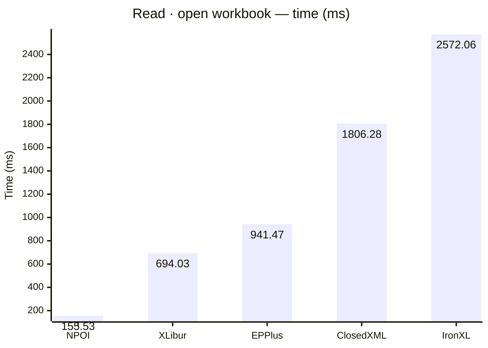
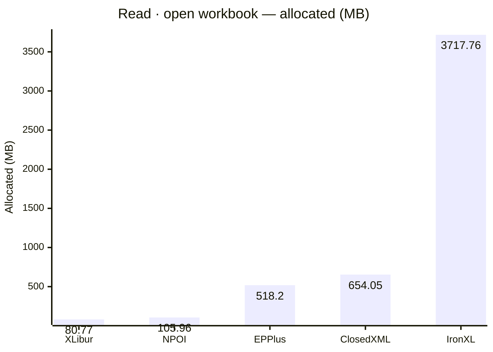
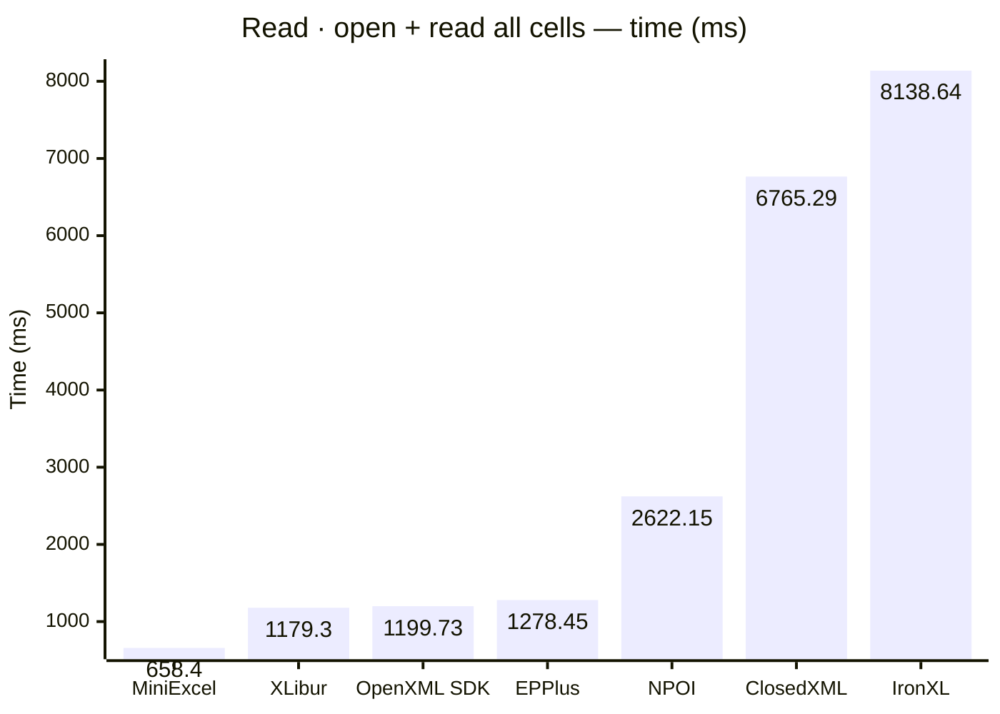
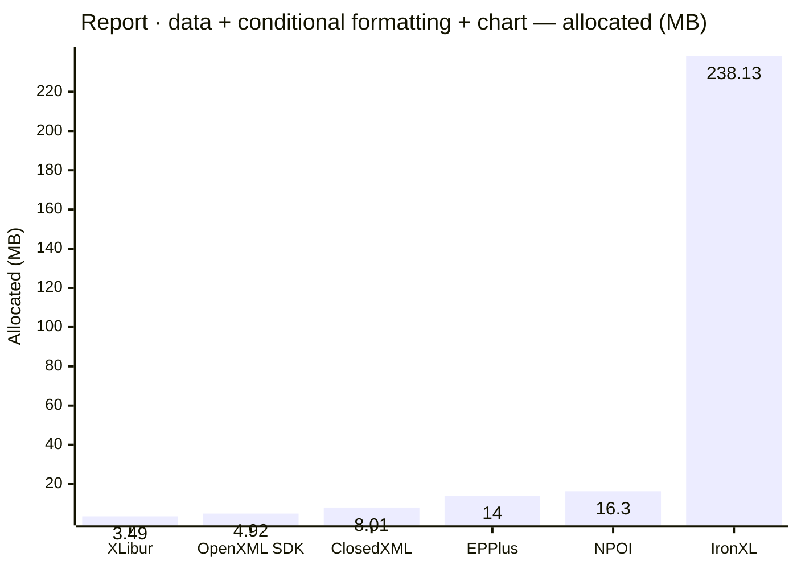
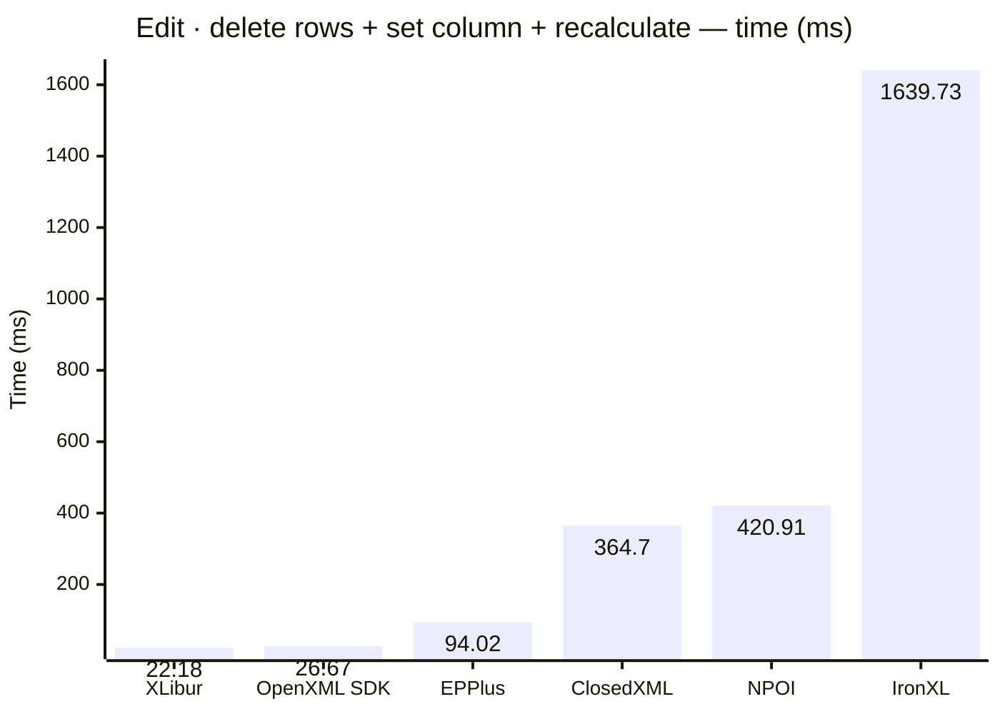
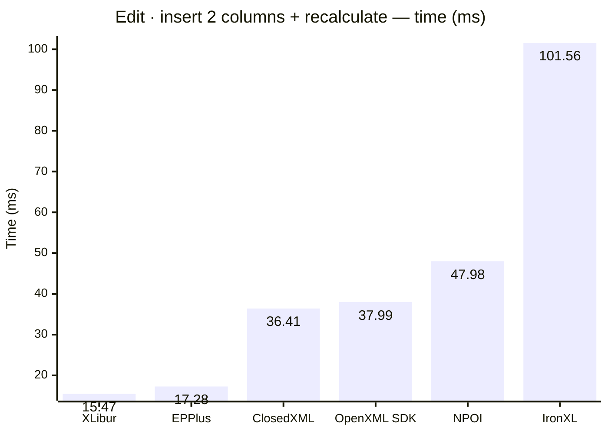

<style>
  .main-content { max-width: 90% !important; padding-left: 2rem !important; padding-right: 2rem !important; }
</style>
<!-- Generated by XLBench. Do not edit by hand; re-run scripts/run-benchmarks.ps1. -->
# XLBench Results

Each section below embeds the full BenchmarkDotNet environment block (OS, CPU,
.NET SDK and runtime). Timings are hardware-specific; treat the allocation/GC
columns as the most portable signal across machines. Regenerate locally with
`scripts/run-benchmarks.ps1`.

📈 **[Interactive charts](charts.html)** (GitHub Pages). Static charts and the full tables follow.

Each results table (one per test method) is heat-mapped independently on the Pages site (🟩 best → 🟥 worst).

## Libraries under test

| Library | Version | Source |
| --- | --- | --- |
| ClosedXML | 0.105.1 | this run |
| EPPlus | 8.6.3 | this run |
| OpenXML SDK | 3.5.1 | this run |
| NPOI | 2.8.0 | this run |
| MiniExcel | 1.45.0 | this run |
| XLibur | 0.300.0 | this run |
| IronXL | 2026.8.1 | this run |

## Comparison charts

_Lower is better. Charts render in the GitHub file view; the Pages site has interactive versions._
















## Detailed results


```

BenchmarkDotNet v0.15.8, Windows 11 (10.0.22631.6199/23H2/2023Update/SunValley3)
AMD Ryzen 9 5950X 3.40GHz, 1 CPU, 32 logical and 16 physical cores
.NET SDK 10.0.302
  [Host]     : .NET 10.0.10 (10.0.10, 10.0.1026.32716), X64 RyuJIT x86-64-v3
  Job-HTCPYF : .NET 10.0.10 (10.0.10, 10.0.1026.32716), X64 RyuJIT x86-64-v3

MaxIterationCount=10  MaxWarmupIterationCount=3  MinIterationCount=5  
MinWarmupIterationCount=1  

```

### Read · open workbook

| Library     | Type                      | Method                      | Mean         | Error       | StdDev      | Gen0        | Gen1        | Gen2       | Allocated  |
|------------ |-------------------------- |---------------------------- |-------------:|------------:|------------:|------------:|------------:|-----------:|-----------:|
| NPOI        | NpoiReadBenchmarks        | OpenWorkbook                |   155.533 ms |  29.6741 ms |  19.6276 ms |   2000.0000 |   1000.0000 |  1000.0000 |  105.96 MB |
| XLibur      | XLiburReadBenchmarks      | OpenWorkbook                |   694.026 ms |  13.6981 ms |   6.0820 ms |   5000.0000 |   4000.0000 |  1000.0000 |   80.77 MB |
| EPPlus      | EpPlusReadBenchmarks      | OpenWorkbook                |   941.474 ms |  45.4955 ms |  30.0925 ms |  23000.0000 |  11000.0000 |  6000.0000 |   518.2 MB |
| ClosedXML   | ClosedXmlReadBenchmarks   | OpenWorkbook                | 1,806.276 ms |  85.6412 ms |  56.6464 ms |  41000.0000 |  14000.0000 |  2000.0000 |  654.05 MB |
| IronXL      | IronXlReadBenchmarks      | OpenWorkbook                | 2,572.056 ms | 214.2393 ms | 127.4904 ms | 235000.0000 |  67000.0000 |  7000.0000 | 3717.76 MB |

### Read · open + read all cells

| Library     | Type                      | Method                      | Mean         | Error       | StdDev      | Gen0        | Gen1        | Gen2       | Allocated  |
|------------ |-------------------------- |---------------------------- |-------------:|------------:|------------:|------------:|------------:|-----------:|-----------:|
| MiniExcel   | MiniExcelReadBenchmarks   | OpenAndReadAll              |   658.405 ms |  18.4080 ms |  10.9543 ms |  38000.0000 |   3000.0000 |          - |   629.7 MB |
| XLibur      | XLiburReadBenchmarks      | OpenAndReadAll              | 1,179.303 ms |  30.1189 ms |  19.9218 ms |  15000.0000 |  12000.0000 |  3000.0000 |  320.43 MB |
| OpenXML SDK | OpenXmlReadBenchmarks     | OpenAndReadAll              | 1,199.733 ms |  73.5811 ms |  48.6693 ms |  40000.0000 |   6000.0000 |  1000.0000 |  628.84 MB |
| EPPlus      | EpPlusReadBenchmarks      | OpenAndReadAll              | 1,278.453 ms | 101.5619 ms |  67.1769 ms |  49000.0000 |  14000.0000 |  7000.0000 |  925.23 MB |
| NPOI        | NpoiReadBenchmarks        | OpenAndReadAll              | 2,622.151 ms | 136.0899 ms |  71.1776 ms |  68000.0000 |  62000.0000 |  6000.0000 |  1077.8 MB |
| ClosedXML   | ClosedXmlReadBenchmarks   | OpenAndReadAll              | 6,765.288 ms | 196.0248 ms | 129.6583 ms |  59000.0000 |  23000.0000 |  3000.0000 | 1083.78 MB |
| IronXL      | IronXlReadBenchmarks      | OpenAndReadAll              | 8,138.637 ms | 390.9972 ms | 258.6204 ms | 393000.0000 | 202000.0000 | 10000.0000 | 6333.03 MB |

### Write · create + save

| Library     | Type                      | Method                      | Mean         | Error       | StdDev      | Gen0        | Gen1        | Gen2       | Allocated  |
|------------ |-------------------------- |---------------------------- |-------------:|------------:|------------:|------------:|------------:|-----------:|-----------:|
| MiniExcel   | MiniExcelWriteBenchmarks  | CreateAndSave               |    63.419 ms |   2.8773 ms |   1.9032 ms |   5666.6667 |   1777.7778 |  1666.6667 |   84.59 MB |
| OpenXML SDK | OpenXmlWriteBenchmarks    | CreateAndSave               |   163.961 ms |   6.6755 ms |   3.9725 ms |   8000.0000 |   2000.0000 |  2000.0000 |   134.2 MB |
| XLibur      | XLiburWriteBenchmarks     | CreateAndSave               |   246.675 ms |   8.3723 ms |   5.5378 ms |   3000.0000 |   2000.0000 |  2000.0000 |   60.52 MB |
| ClosedXML   | ClosedXmlWriteBenchmarks  | CreateAndSave               |   416.325 ms |  24.3550 ms |  16.1093 ms |  11000.0000 |   6000.0000 |  3000.0000 |   181.1 MB |
| EPPlus      | EpPlusWriteBenchmarks     | CreateAndSave               |   461.038 ms |  14.5929 ms |   9.6523 ms |  20000.0000 |   9000.0000 |  3000.0000 |   322.9 MB |
| NPOI        | NpoiWriteBenchmarks       | CreateAndSave               |   709.979 ms |  23.8104 ms |  15.7491 ms |  16000.0000 |  12000.0000 |  3000.0000 |  247.46 MB |
| IronXL      | IronXlWriteBenchmarks     | CreateAndSave               |   946.684 ms |   7.8536 ms |   1.2153 ms |  48000.0000 |  16000.0000 |  3000.0000 |  797.63 MB |

### Report · data + conditional formatting + chart

| Library     | Type                      | Method                      | Mean         | Error       | StdDev      | Gen0        | Gen1        | Gen2       | Allocated  |
|------------ |-------------------------- |---------------------------- |-------------:|------------:|------------:|------------:|------------:|-----------:|-----------:|
| OpenXML SDK | OpenXmlReportBenchmarks   | CreateStockReport           |     8.522 ms |   0.3796 ms |   0.2259 ms |    375.0000 |    359.3750 |   187.5000 |    4.92 MB |
| XLibur      | XLiburReportBenchmarks    | CreateStockReport           |    10.000 ms |   0.3659 ms |   0.2420 ms |    187.5000 |    187.5000 |   187.5000 |    3.49 MB |
| ClosedXML   | ClosedXmlReportBenchmarks | CreateStockReport           |    17.264 ms |   0.4281 ms |   0.2832 ms |    468.7500 |    187.5000 |    31.2500 |    8.01 MB |
| EPPlus      | EpPlusReportBenchmarks    | CreateStockReport           |    21.675 ms |   9.0054 ms |   5.9565 ms |   1000.0000 |   1000.0000 |  1000.0000 |      14 MB |
| NPOI        | NpoiReportBenchmarks      | CreateStockReport           |    36.088 ms |   2.8915 ms |   1.5123 ms |    875.0000 |    750.0000 |   375.0000 |    16.3 MB |
| IronXL      | IronXlReportBenchmarks    | CreateStockReport           |   400.985 ms |  55.4557 ms |  36.6805 ms |  14000.0000 |   3000.0000 |          - |  238.13 MB |

### Edit · delete rows + set column + recalculate

| Library     | Type                      | Method                      | Mean         | Error       | StdDev      | Gen0        | Gen1        | Gen2       | Allocated  |
|------------ |-------------------------- |---------------------------- |-------------:|------------:|------------:|------------:|------------:|-----------:|-----------:|
| XLibur      | XLiburEditBenchmarks      | EditAndRecalculate          |    22.176 ms |  13.4625 ms |   8.9046 ms |    250.0000 |    125.0000 |          - |    4.39 MB |
| OpenXML SDK | OpenXmlEditBenchmarks     | EditAndRecalculate          |    26.674 ms |   1.1205 ms |   0.7412 ms |    687.5000 |    593.7500 |   156.2500 |    9.83 MB |
| EPPlus      | EpPlusEditBenchmarks      | EditAndRecalculate          |    94.021 ms |   7.5451 ms |   4.4900 ms |   9000.0000 |   1200.0000 |  1000.0000 |  142.49 MB |
| ClosedXML   | ClosedXmlEditBenchmarks   | EditAndRecalculate          |   364.705 ms |  26.5483 ms |  17.5601 ms |  21000.0000 |   1000.0000 |          - |  340.72 MB |
| NPOI        | NpoiEditBenchmarks        | EditAndRecalculate          |   420.915 ms |  20.3470 ms |  13.4583 ms |  25000.0000 |   1000.0000 |          - |  413.44 MB |
| IronXL      | IronXlEditBenchmarks      | EditAndRecalculate          | 1,639.733 ms |  52.2634 ms |  31.1011 ms |  57000.0000 |  36000.0000 | 15000.0000 |  753.86 MB |

### Edit · insert 2 columns + recalculate

| Library     | Type                      | Method                      | Mean         | Error       | StdDev      | Gen0        | Gen1        | Gen2       | Allocated  |
|------------ |-------------------------- |---------------------------- |-------------:|------------:|------------:|------------:|------------:|-----------:|-----------:|
| XLibur      | XLiburInsertBenchmarks    | InsertColumnsAndRecalculate |    15.470 ms |   0.7406 ms |   0.4899 ms |    312.5000 |    156.2500 |          - |    5.06 MB |
| EPPlus      | EpPlusInsertBenchmarks    | InsertColumnsAndRecalculate |    17.280 ms |   0.5242 ms |   0.2742 ms |   1000.0000 |   1000.0000 |  1000.0000 |   11.41 MB |
| ClosedXML   | ClosedXmlInsertBenchmarks | InsertColumnsAndRecalculate |    36.408 ms |   8.4098 ms |   5.0045 ms |    750.0000 |    250.0000 |          - |   13.66 MB |
| OpenXML SDK | OpenXmlInsertBenchmarks   | InsertColumnsAndRecalculate |    37.991 ms |   2.8571 ms |   1.8898 ms |    750.0000 |    500.0000 |   250.0000 |   13.11 MB |
| NPOI        | NpoiInsertBenchmarks      | InsertColumnsAndRecalculate |    47.976 ms |  11.3998 ms |   6.7838 ms |   2000.0000 |   1333.3333 |   500.0000 |   30.77 MB |
| IronXL      | IronXlInsertBenchmarks    | InsertColumnsAndRecalculate |   101.563 ms |   6.1249 ms |   3.2034 ms |   6500.0000 |   1500.0000 |   500.0000 |  104.88 MB |


<script type="module">
  import mermaid from 'https://cdn.jsdelivr.net/npm/mermaid@11/dist/mermaid.esm.min.mjs';
  const blocks = document.querySelectorAll('.language-mermaid');
  blocks.forEach(el => {
    const code = el.querySelector('code') || el;
    const pre = document.createElement('pre');
    pre.className = 'mermaid';
    pre.textContent = code.textContent;
    el.replaceWith(pre);
  });
  if (blocks.length) {
    mermaid.initialize({ startOnLoad: false });
    await mermaid.run({ querySelector: 'pre.mermaid' });
  }
</script>

<script>
(function () {
  const parse = s => { const n = parseFloat(String(s).replace(/,/g, '')); return Number.isFinite(n) ? n : null; };
  document.querySelectorAll('table').forEach(table => {
    if (!table.tHead || !table.tBodies[0]) return;
    const heads = [...table.tHead.rows[0].cells].map(c => c.textContent.trim().toLowerCase());
    if (!heads.includes('mean')) return;
    const metricCols = heads.map((h, i) => /^(mean|allocated|gen0|gen1|gen2)$/.test(h) ? i : -1).filter(i => i >= 0);
    const rows = [...table.tBodies[0].rows];
    for (const c of metricCols) {
      const vals = rows.map(r => parse(r.cells[c]?.textContent));
      const nums = vals.filter(v => v !== null);
      if (nums.length < 2) continue;
      const min = Math.min(...nums), max = Math.max(...nums);
      if (max === min) continue;
      rows.forEach((r, i) => {
        const v = vals[i]; if (v === null) return;
        const ratio = (v - min) / (max - min);
        r.cells[c].style.backgroundColor = `hsla(${120 - 120 * ratio}, 70%, 50%, 0.45)`;
      });
    }
  });
})();
</script>
