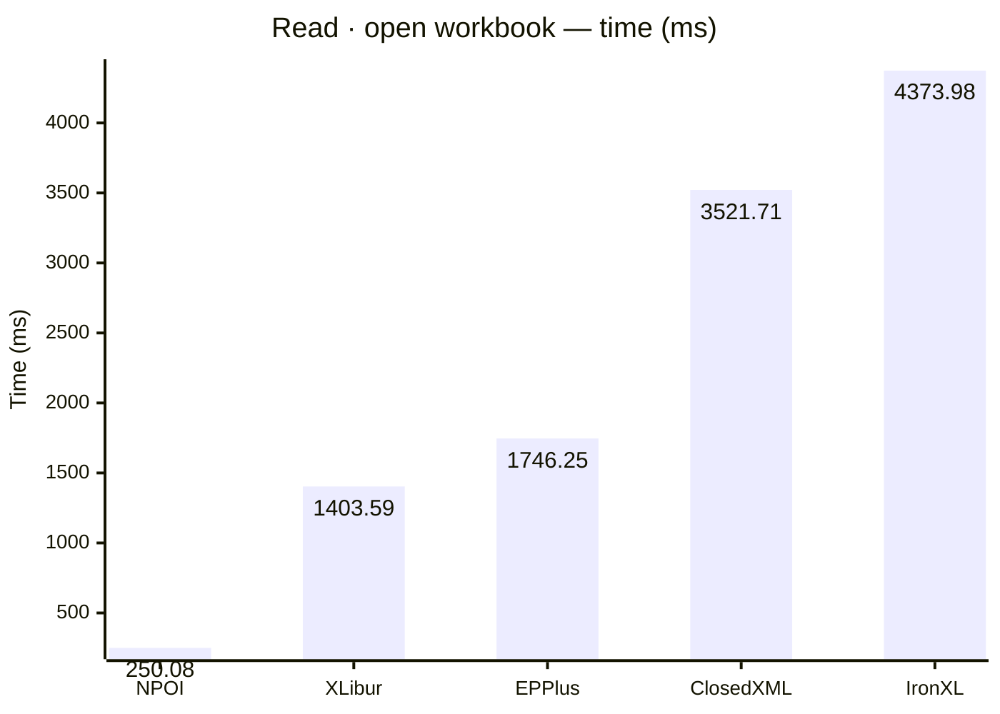
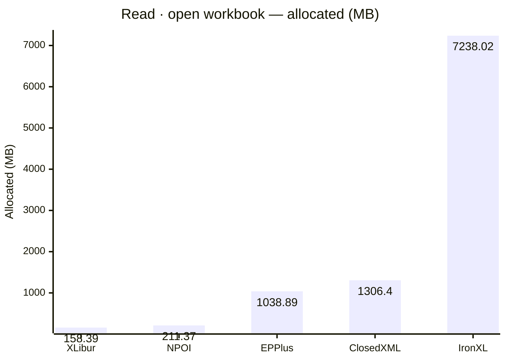
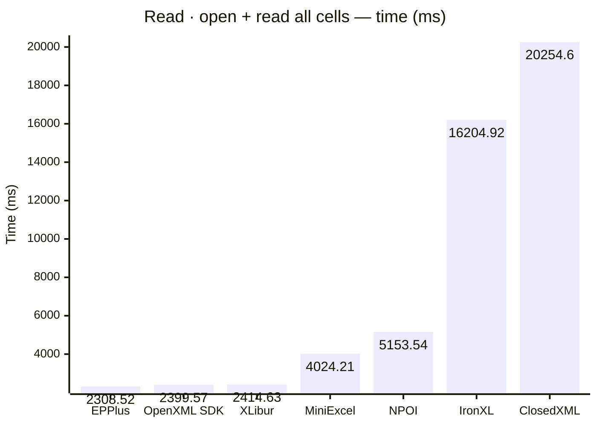
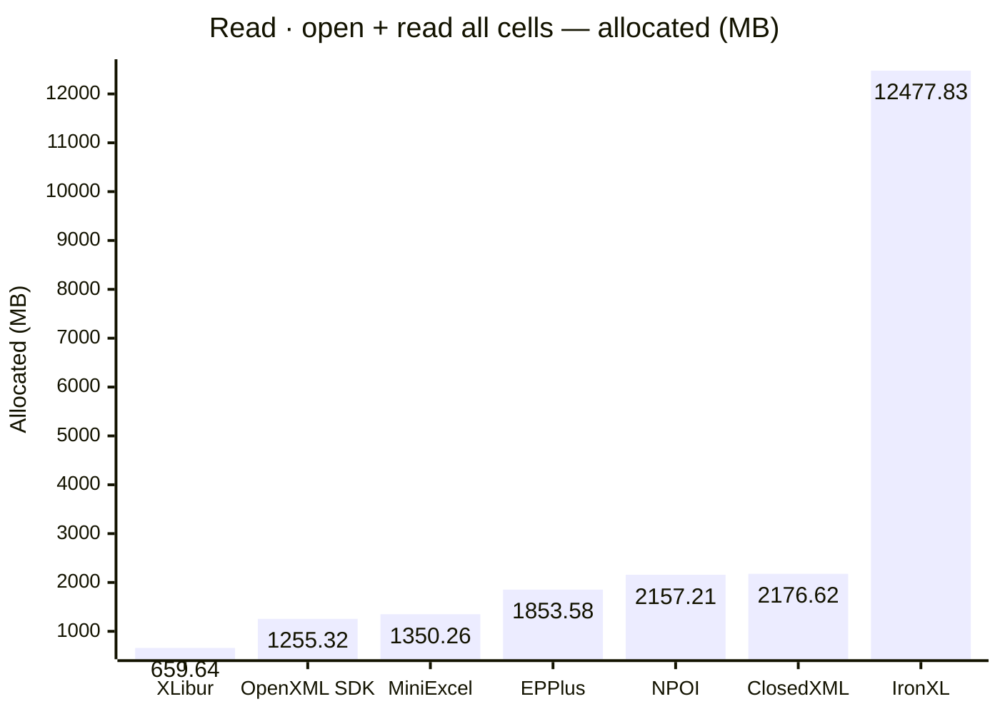
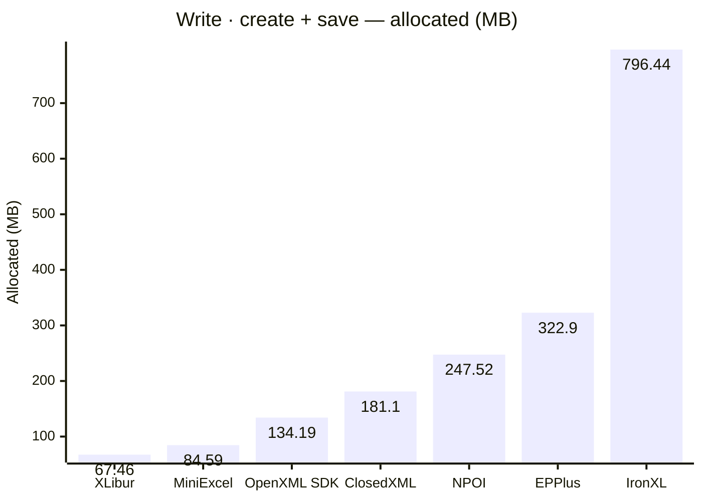
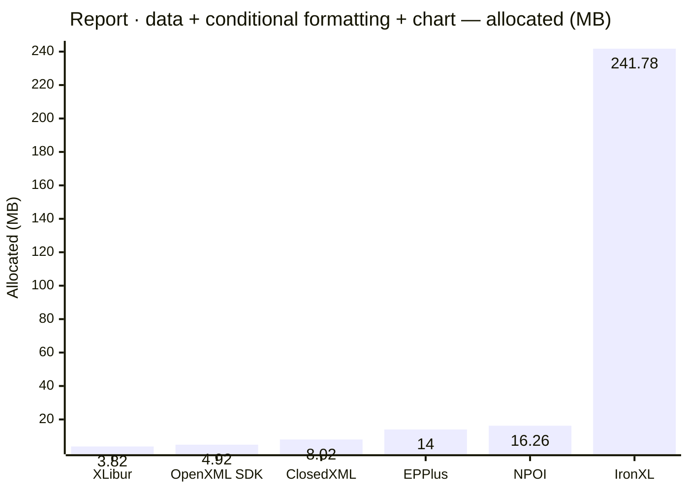

<style>
  .main-content { max-width: 90% !important; padding-left: 2rem !important; padding-right: 2rem !important; }
</style>
<!-- Generated by XLBench. Do not edit by hand; re-run scripts/run-benchmarks.ps1. -->
# XLBench Results

Each section below embeds the full BenchmarkDotNet environment block (OS, CPU,
.NET SDK and runtime). Timings are hardware-specific; treat the allocation/GC
columns as the most portable signal across machines. Regenerate locally with
`scripts/run-benchmarks.ps1`.

📈 **[Interactive charts](charts.html)** (GitHub Pages). Static charts and the full tables follow.

Each results table (one per test method) is heat-mapped independently on the Pages site (🟩 best → 🟥 worst).

## Libraries under test

| Library | Version | Source |
| --- | --- | --- |
| ClosedXML | 0.105.1 | this run |
| EPPlus | 8.6.3 | this run |
| OpenXML SDK | 3.5.1 | this run |
| NPOI | 2.8.0 | this run |
| MiniExcel | 1.45.0 | this run |
| XLibur | 0.106.1-beta.80 | this run |
| IronXL | 2026.7.2 | this run |

## Comparison charts

_Lower is better. Charts render in the GitHub file view; the Pages site has interactive versions._















## Detailed results


```

BenchmarkDotNet v0.15.8, Windows 11 (10.0.22631.6199/23H2/2023Update/SunValley3)
AMD Ryzen 9 5950X 3.40GHz, 1 CPU, 32 logical and 16 physical cores
.NET SDK 10.0.302
  [Host]     : .NET 10.0.10 (10.0.10, 10.0.1026.32716), X64 RyuJIT x86-64-v3
  DefaultJob : .NET 10.0.10 (10.0.10, 10.0.1026.32716), X64 RyuJIT x86-64-v3


```

### Read · open workbook

| Library     | Type                      | Method            | Mean          | Error       | StdDev      | Median        | Gen0        | Gen1        | Gen2       | Allocated   |
|------------ |-------------------------- |------------------ |--------------:|------------:|------------:|--------------:|------------:|------------:|-----------:|------------:|
| NPOI        | NpoiReadBenchmarks        | OpenWorkbook      |    250.084 ms |   4.8996 ms |   7.6281 ms |    249.460 ms |   4000.0000 |   3500.0000 |  1500.0000 |   211.37 MB |
| XLibur      | XLiburReadBenchmarks      | OpenWorkbook      |  1,403.594 ms |  23.8188 ms |  22.2801 ms |  1,405.109 ms |  10000.0000 |   8000.0000 |  2000.0000 |   158.39 MB |
| EPPlus      | EpPlusReadBenchmarks      | OpenWorkbook      |  1,746.251 ms |  15.2378 ms |  13.5079 ms |  1,746.620 ms |  41000.0000 |  17000.0000 |  7000.0000 |  1038.89 MB |
| ClosedXML   | ClosedXmlReadBenchmarks   | OpenWorkbook      |  3,521.714 ms |  30.6845 ms |  27.2010 ms |  3,514.045 ms |  81000.0000 |  27000.0000 |  3000.0000 |   1306.4 MB |
| IronXL      | IronXlReadBenchmarks      | OpenWorkbook      |  4,373.980 ms |  42.6374 ms |  39.8831 ms |  4,376.416 ms | 453000.0000 | 125000.0000 |  8000.0000 |  7238.02 MB |

### Read · open + read all cells

| Library     | Type                      | Method            | Mean          | Error       | StdDev      | Median        | Gen0        | Gen1        | Gen2       | Allocated   |
|------------ |-------------------------- |------------------ |--------------:|------------:|------------:|--------------:|------------:|------------:|-----------:|------------:|
| EPPlus      | EpPlusReadBenchmarks      | OpenAndReadAll    |  2,308.517 ms |  24.0630 ms |  20.0937 ms |  2,312.308 ms |  92000.0000 |  18000.0000 |  7000.0000 |  1853.58 MB |
| OpenXML SDK | OpenXmlReadBenchmarks     | OpenAndReadAll    |  2,399.568 ms |  41.4125 ms |  63.2412 ms |  2,385.979 ms |  80000.0000 |   9000.0000 |  2000.0000 |  1255.32 MB |
| XLibur      | XLiburReadBenchmarks      | OpenAndReadAll    |  2,414.634 ms |  44.7666 ms |  41.8747 ms |  2,395.584 ms |  29000.0000 |  20000.0000 |  4000.0000 |   659.64 MB |
| MiniExcel   | MiniExcelReadBenchmarks   | OpenAndReadAll    |  4,024.215 ms |  57.9295 ms |  51.3530 ms |  4,014.443 ms |  84000.0000 |   1000.0000 |          - |  1350.26 MB |
| NPOI        | NpoiReadBenchmarks        | OpenAndReadAll    |  5,153.539 ms |  93.8135 ms |  83.1633 ms |  5,118.644 ms | 132000.0000 | 121000.0000 |  8000.0000 |  2157.21 MB |
| IronXL      | IronXlReadBenchmarks      | OpenAndReadAll    | 16,204.921 ms | 268.2793 ms | 250.9487 ms | 16,214.047 ms | 764000.0000 | 389000.0000 | 11000.0000 | 12477.83 MB |
| ClosedXML   | ClosedXmlReadBenchmarks   | OpenAndReadAll    | 20,254.602 ms | 106.6587 ms |  94.5502 ms | 20,246.156 ms | 117000.0000 |  44000.0000 |  4000.0000 |  2176.62 MB |

### Write · create + save

| Library     | Type                      | Method            | Mean          | Error       | StdDev      | Median        | Gen0        | Gen1        | Gen2       | Allocated   |
|------------ |-------------------------- |------------------ |--------------:|------------:|------------:|--------------:|------------:|------------:|-----------:|------------:|
| MiniExcel   | MiniExcelWriteBenchmarks  | CreateAndSave     |     62.679 ms |   1.2482 ms |   1.3355 ms |     62.725 ms |   5666.6667 |   1777.7778 |  1666.6667 |    84.59 MB |
| OpenXML SDK | OpenXmlWriteBenchmarks    | CreateAndSave     |    166.504 ms |   3.0539 ms |   2.5502 ms |    166.462 ms |   8000.0000 |   2000.0000 |  2000.0000 |   134.19 MB |
| XLibur      | XLiburWriteBenchmarks     | CreateAndSave     |    243.717 ms |   4.7082 ms |   6.4447 ms |    242.940 ms |   4000.0000 |   3000.0000 |  3000.0000 |    67.46 MB |
| ClosedXML   | ClosedXmlWriteBenchmarks  | CreateAndSave     |    412.522 ms |   7.9312 ms |   7.7895 ms |    412.321 ms |  10000.0000 |   5000.0000 |  2000.0000 |    181.1 MB |
| EPPlus      | EpPlusWriteBenchmarks     | CreateAndSave     |    471.626 ms |   9.3361 ms |  17.0715 ms |    468.654 ms |  20000.0000 |   9000.0000 |  3000.0000 |    322.9 MB |
| NPOI        | NpoiWriteBenchmarks       | CreateAndSave     |    680.987 ms |  12.6085 ms |  12.3832 ms |    681.718 ms |  16000.0000 |  12000.0000 |  3000.0000 |   247.52 MB |
| IronXL      | IronXlWriteBenchmarks     | CreateAndSave     |  1,017.095 ms |  19.6546 ms |  43.9602 ms |  1,006.866 ms |  49000.0000 |  18000.0000 |  4000.0000 |   796.44 MB |

### Report · data + conditional formatting + chart

| Library     | Type                      | Method            | Mean          | Error       | StdDev      | Median        | Gen0        | Gen1        | Gen2       | Allocated   |
|------------ |-------------------------- |------------------ |--------------:|------------:|------------:|--------------:|------------:|------------:|-----------:|------------:|
| OpenXML SDK | OpenXmlReportBenchmarks   | CreateStockReport |      9.073 ms |   0.1798 ms |   0.3003 ms |      9.057 ms |    375.0000 |    359.3750 |   187.5000 |     4.92 MB |
| XLibur      | XLiburReportBenchmarks    | CreateStockReport |      9.968 ms |   0.1866 ms |   0.2849 ms |      9.925 ms |    187.5000 |    187.5000 |   187.5000 |     3.82 MB |
| EPPlus      | EpPlusReportBenchmarks    | CreateStockReport |     15.676 ms |   0.2703 ms |   0.3877 ms |     15.594 ms |   1000.0000 |   1000.0000 |  1000.0000 |       14 MB |
| ClosedXML   | ClosedXmlReportBenchmarks | CreateStockReport |     18.426 ms |   0.5491 ms |   1.5578 ms |     17.820 ms |    468.7500 |    187.5000 |    31.2500 |     8.02 MB |
| NPOI        | NpoiReportBenchmarks      | CreateStockReport |     31.605 ms |   0.5061 ms |   0.5416 ms |     31.620 ms |    833.3333 |    666.6667 |   333.3333 |    16.26 MB |
| IronXL      | IronXlReportBenchmarks    | CreateStockReport |    371.314 ms |   6.8265 ms |   5.7004 ms |    370.820 ms |  14000.0000 |   3000.0000 |          - |   241.78 MB |


<script type="module">
  import mermaid from 'https://cdn.jsdelivr.net/npm/mermaid@11/dist/mermaid.esm.min.mjs';
  const blocks = document.querySelectorAll('.language-mermaid');
  blocks.forEach(el => {
    const code = el.querySelector('code') || el;
    const pre = document.createElement('pre');
    pre.className = 'mermaid';
    pre.textContent = code.textContent;
    el.replaceWith(pre);
  });
  if (blocks.length) {
    mermaid.initialize({ startOnLoad: false });
    await mermaid.run({ querySelector: 'pre.mermaid' });
  }
</script>

<script>
(function () {
  const parse = s => { const n = parseFloat(String(s).replace(/,/g, '')); return Number.isFinite(n) ? n : null; };
  document.querySelectorAll('table').forEach(table => {
    if (!table.tHead || !table.tBodies[0]) return;
    const heads = [...table.tHead.rows[0].cells].map(c => c.textContent.trim().toLowerCase());
    if (!heads.includes('mean')) return;
    const metricCols = heads.map((h, i) => /^(mean|allocated|gen0|gen1|gen2)$/.test(h) ? i : -1).filter(i => i >= 0);
    const rows = [...table.tBodies[0].rows];
    for (const c of metricCols) {
      const vals = rows.map(r => parse(r.cells[c]?.textContent));
      const nums = vals.filter(v => v !== null);
      if (nums.length < 2) continue;
      const min = Math.min(...nums), max = Math.max(...nums);
      if (max === min) continue;
      rows.forEach((r, i) => {
        const v = vals[i]; if (v === null) return;
        const ratio = (v - min) / (max - min);
        r.cells[c].style.backgroundColor = `hsla(${120 - 120 * ratio}, 70%, 50%, 0.45)`;
      });
    }
  });
})();
</script>
