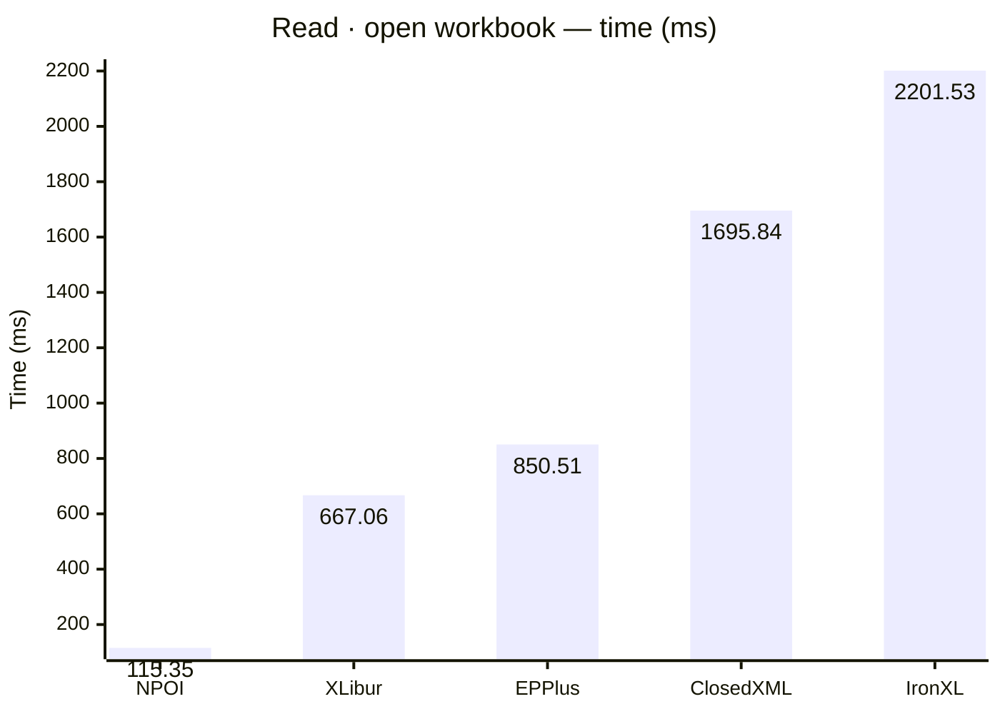
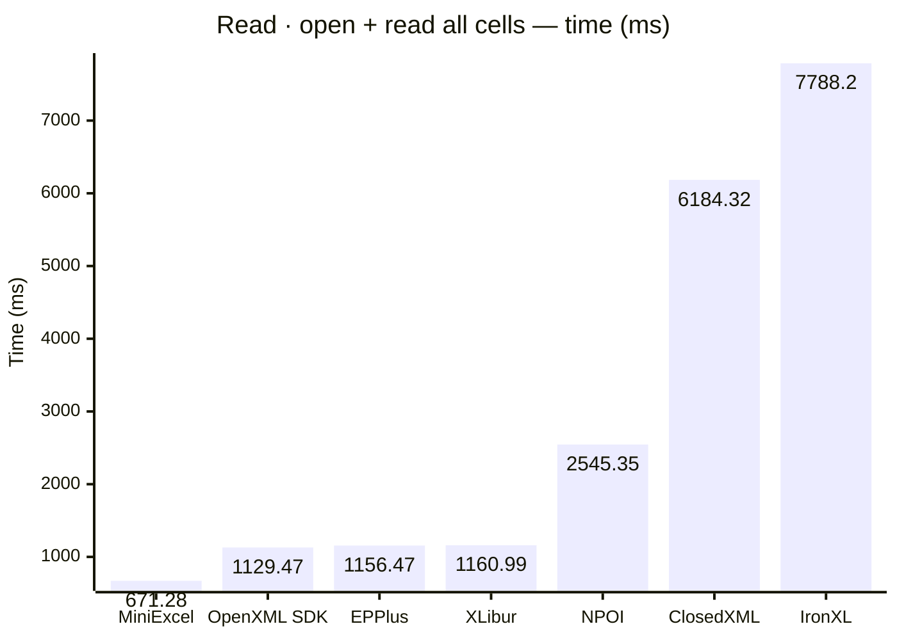
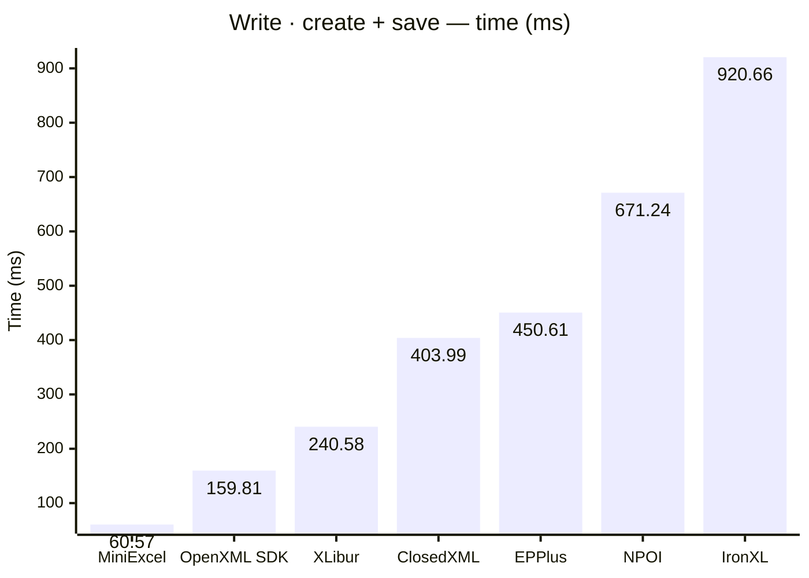
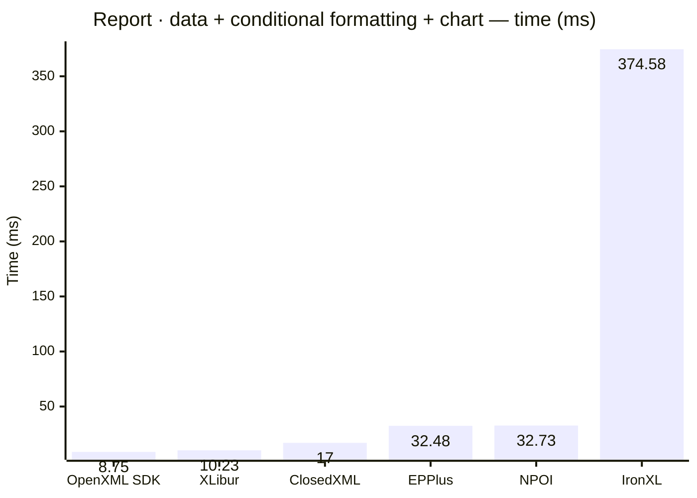
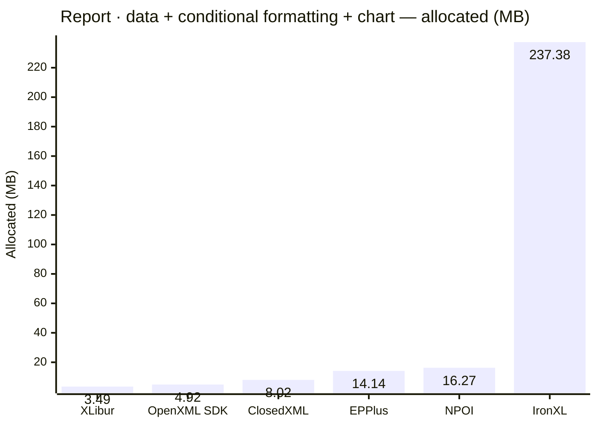
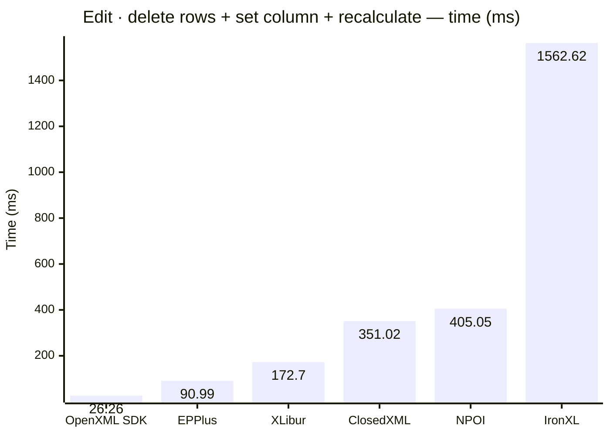

<style>
  .main-content { max-width: 90% !important; padding-left: 2rem !important; padding-right: 2rem !important; }
</style>
<!-- Generated by XLBench. Do not edit by hand; re-run scripts/run-benchmarks.ps1. -->
# XLBench Results

Each section below embeds the full BenchmarkDotNet environment block (OS, CPU,
.NET SDK and runtime). Timings are hardware-specific; treat the allocation/GC
columns as the most portable signal across machines. Regenerate locally with
`scripts/run-benchmarks.ps1`.

📈 **[Interactive charts](charts.html)** (GitHub Pages). Static charts and the full tables follow.

Each results table (one per test method) is heat-mapped independently on the Pages site (🟩 best → 🟥 worst).

## Libraries under test

| Library | Version | Source |
| --- | --- | --- |
| ClosedXML | 0.105.1 | this run |
| EPPlus | 8.6.3 | this run |
| OpenXML SDK | 3.5.1 | this run |
| NPOI | 2.8.0 | this run |
| MiniExcel | 1.45.0 | this run |
| XLibur | 0.200.0 | this run |
| IronXL | 2026.8.1 | this run |

## Comparison charts

_Lower is better. Charts render in the GitHub file view; the Pages site has interactive versions._

















## Detailed results


```

BenchmarkDotNet v0.15.8, Windows 11 (10.0.22631.6199/23H2/2023Update/SunValley3)
AMD Ryzen 9 5950X 3.40GHz, 1 CPU, 32 logical and 16 physical cores
.NET SDK 10.0.302
  [Host]     : .NET 10.0.10 (10.0.10, 10.0.1026.32716), X64 RyuJIT x86-64-v3
  Job-HTCPYF : .NET 10.0.10 (10.0.10, 10.0.1026.32716), X64 RyuJIT x86-64-v3

MaxIterationCount=10  MaxWarmupIterationCount=3  MinIterationCount=5  
MinWarmupIterationCount=1  

```

### Read · open workbook

| Library     | Type                      | Method             | Mean         | Error       | StdDev      | Gen0        | Gen1        | Gen2       | Allocated  |
|------------ |-------------------------- |------------------- |-------------:|------------:|------------:|------------:|------------:|-----------:|-----------:|
| NPOI        | NpoiReadBenchmarks        | OpenWorkbook       |   115.352 ms |   7.0058 ms |   4.6339 ms |   1500.0000 |   1000.0000 |   500.0000 |  105.92 MB |
| XLibur      | XLiburReadBenchmarks      | OpenWorkbook       |   667.065 ms |  16.3350 ms |  10.8046 ms |   5000.0000 |   4000.0000 |  1000.0000 |   80.39 MB |
| EPPlus      | EpPlusReadBenchmarks      | OpenWorkbook       |   850.507 ms |  21.9208 ms |  13.0447 ms |  23000.0000 |  11000.0000 |  6000.0000 |  518.21 MB |
| ClosedXML   | ClosedXmlReadBenchmarks   | OpenWorkbook       | 1,695.844 ms |  27.0546 ms |   9.6479 ms |  41000.0000 |  14000.0000 |  2000.0000 |  654.05 MB |
| IronXL      | IronXlReadBenchmarks      | OpenWorkbook       | 2,201.535 ms |  37.5704 ms |  16.6815 ms | 235000.0000 |  67000.0000 |  7000.0000 | 3717.76 MB |

### Read · open + read all cells

| Library     | Type                      | Method             | Mean         | Error       | StdDev      | Gen0        | Gen1        | Gen2       | Allocated  |
|------------ |-------------------------- |------------------- |-------------:|------------:|------------:|------------:|------------:|-----------:|-----------:|
| MiniExcel   | MiniExcelReadBenchmarks   | OpenAndReadAll     |   671.284 ms |  15.0368 ms |   9.9459 ms |  38000.0000 |   3000.0000 |          - |   629.7 MB |
| OpenXML SDK | OpenXmlReadBenchmarks     | OpenAndReadAll     | 1,129.465 ms |  17.0569 ms |   6.0827 ms |  40000.0000 |   6000.0000 |  1000.0000 |  628.84 MB |
| EPPlus      | EpPlusReadBenchmarks      | OpenAndReadAll     | 1,156.470 ms |  21.8833 ms |  13.0224 ms |  49000.0000 |  14000.0000 |  7000.0000 |  925.23 MB |
| XLibur      | XLiburReadBenchmarks      | OpenAndReadAll     | 1,160.993 ms |  60.5590 ms |  40.0560 ms |  15000.0000 |  12000.0000 |  3000.0000 |  320.05 MB |
| NPOI        | NpoiReadBenchmarks        | OpenAndReadAll     | 2,545.354 ms |  59.9458 ms |  31.3528 ms |  68000.0000 |  62000.0000 |  6000.0000 |  1077.8 MB |
| ClosedXML   | ClosedXmlReadBenchmarks   | OpenAndReadAll     | 6,184.324 ms |  91.1430 ms |  40.4681 ms |  59000.0000 |  23000.0000 |  3000.0000 | 1083.78 MB |
| IronXL      | IronXlReadBenchmarks      | OpenAndReadAll     | 7,788.195 ms | 256.7315 ms | 169.8120 ms | 393000.0000 | 202000.0000 | 10000.0000 | 6333.03 MB |

### Write · create + save

| Library     | Type                      | Method             | Mean         | Error       | StdDev      | Gen0        | Gen1        | Gen2       | Allocated  |
|------------ |-------------------------- |------------------- |-------------:|------------:|------------:|------------:|------------:|-----------:|-----------:|
| MiniExcel   | MiniExcelWriteBenchmarks  | CreateAndSave      |    60.567 ms |   2.5892 ms |   1.7126 ms |   5666.6667 |   1777.7778 |  1666.6667 |   84.59 MB |
| OpenXML SDK | OpenXmlWriteBenchmarks    | CreateAndSave      |   159.807 ms |   5.0679 ms |   3.3521 ms |   8750.0000 |   2000.0000 |  2000.0000 |   134.2 MB |
| XLibur      | XLiburWriteBenchmarks     | CreateAndSave      |   240.578 ms |   6.6558 ms |   4.4024 ms |   3000.0000 |   2000.0000 |  2000.0000 |   60.52 MB |
| ClosedXML   | ClosedXmlWriteBenchmarks  | CreateAndSave      |   403.994 ms |  22.1120 ms |  13.1585 ms |  10000.0000 |   5000.0000 |  2000.0000 |   181.1 MB |
| EPPlus      | EpPlusWriteBenchmarks     | CreateAndSave      |   450.612 ms |  24.3108 ms |  16.0801 ms |  20000.0000 |   9000.0000 |  3000.0000 |   322.9 MB |
| NPOI        | NpoiWriteBenchmarks       | CreateAndSave      |   671.236 ms |  20.4890 ms |  13.5522 ms |  16000.0000 |  12000.0000 |  3000.0000 |  247.46 MB |
| IronXL      | IronXlWriteBenchmarks     | CreateAndSave      |   920.655 ms |  65.9367 ms |  43.6131 ms |  48000.0000 |  16000.0000 |  3000.0000 |  797.63 MB |

### Report · data + conditional formatting + chart

| Library     | Type                      | Method             | Mean         | Error       | StdDev      | Gen0        | Gen1        | Gen2       | Allocated  |
|------------ |-------------------------- |------------------- |-------------:|------------:|------------:|------------:|------------:|-----------:|-----------:|
| OpenXML SDK | OpenXmlReportBenchmarks   | CreateStockReport  |     8.748 ms |   0.5657 ms |   0.3742 ms |    375.0000 |    359.3750 |   187.5000 |    4.92 MB |
| XLibur      | XLiburReportBenchmarks    | CreateStockReport  |    10.227 ms |   0.6561 ms |   0.4340 ms |    187.5000 |    187.5000 |   187.5000 |    3.49 MB |
| ClosedXML   | ClosedXmlReportBenchmarks | CreateStockReport  |    17.002 ms |   0.4934 ms |   0.3263 ms |    468.7500 |    187.5000 |    31.2500 |    8.02 MB |
| EPPlus      | EpPlusReportBenchmarks    | CreateStockReport  |    32.477 ms |  14.3185 ms |   9.4708 ms |   1000.0000 |   1000.0000 |  1000.0000 |   14.14 MB |
| NPOI        | NpoiReportBenchmarks      | CreateStockReport  |    32.725 ms |   2.0044 ms |   1.0484 ms |    888.8889 |    777.7778 |   444.4444 |   16.27 MB |
| IronXL      | IronXlReportBenchmarks    | CreateStockReport  |   374.579 ms |  38.1427 ms |  19.9494 ms |  14000.0000 |   3000.0000 |          - |  237.38 MB |

### Edit · delete rows + set column + recalculate

| Library     | Type                      | Method             | Mean         | Error       | StdDev      | Gen0        | Gen1        | Gen2       | Allocated  |
|------------ |-------------------------- |------------------- |-------------:|------------:|------------:|------------:|------------:|-----------:|-----------:|
| OpenXML SDK | OpenXmlEditBenchmarks     | EditAndRecalculate |    26.257 ms |   0.5420 ms |   0.3585 ms |    687.5000 |    593.7500 |   156.2500 |    9.83 MB |
| EPPlus      | EpPlusEditBenchmarks      | EditAndRecalculate |    90.994 ms |   3.2045 ms |   2.1196 ms |   9000.0000 |   1200.0000 |  1000.0000 |  142.49 MB |
| XLibur      | XLiburEditBenchmarks      | EditAndRecalculate |   172.699 ms |   3.2540 ms |   2.1523 ms |  10333.3333 |    333.3333 |          - |  164.91 MB |
| ClosedXML   | ClosedXmlEditBenchmarks   | EditAndRecalculate |   351.020 ms |  16.9362 ms |  10.0785 ms |  21000.0000 |   1000.0000 |          - |  337.93 MB |
| NPOI        | NpoiEditBenchmarks        | EditAndRecalculate |   405.051 ms |   7.3577 ms |   4.8667 ms |  25000.0000 |   1000.0000 |          - |  413.44 MB |
| IronXL      | IronXlEditBenchmarks      | EditAndRecalculate | 1,562.616 ms |  46.5205 ms |  27.6836 ms |  57000.0000 |  36000.0000 | 15000.0000 |  753.86 MB |


<script type="module">
  import mermaid from 'https://cdn.jsdelivr.net/npm/mermaid@11/dist/mermaid.esm.min.mjs';
  const blocks = document.querySelectorAll('.language-mermaid');
  blocks.forEach(el => {
    const code = el.querySelector('code') || el;
    const pre = document.createElement('pre');
    pre.className = 'mermaid';
    pre.textContent = code.textContent;
    el.replaceWith(pre);
  });
  if (blocks.length) {
    mermaid.initialize({ startOnLoad: false });
    await mermaid.run({ querySelector: 'pre.mermaid' });
  }
</script>

<script>
(function () {
  const parse = s => { const n = parseFloat(String(s).replace(/,/g, '')); return Number.isFinite(n) ? n : null; };
  document.querySelectorAll('table').forEach(table => {
    if (!table.tHead || !table.tBodies[0]) return;
    const heads = [...table.tHead.rows[0].cells].map(c => c.textContent.trim().toLowerCase());
    if (!heads.includes('mean')) return;
    const metricCols = heads.map((h, i) => /^(mean|allocated|gen0|gen1|gen2)$/.test(h) ? i : -1).filter(i => i >= 0);
    const rows = [...table.tBodies[0].rows];
    for (const c of metricCols) {
      const vals = rows.map(r => parse(r.cells[c]?.textContent));
      const nums = vals.filter(v => v !== null);
      if (nums.length < 2) continue;
      const min = Math.min(...nums), max = Math.max(...nums);
      if (max === min) continue;
      rows.forEach((r, i) => {
        const v = vals[i]; if (v === null) return;
        const ratio = (v - min) / (max - min);
        r.cells[c].style.backgroundColor = `hsla(${120 - 120 * ratio}, 70%, 50%, 0.45)`;
      });
    }
  });
})();
</script>
