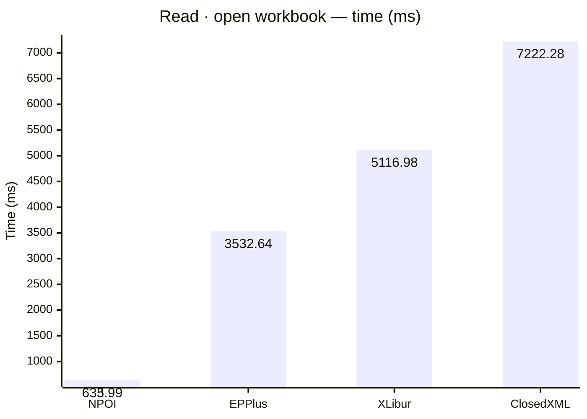
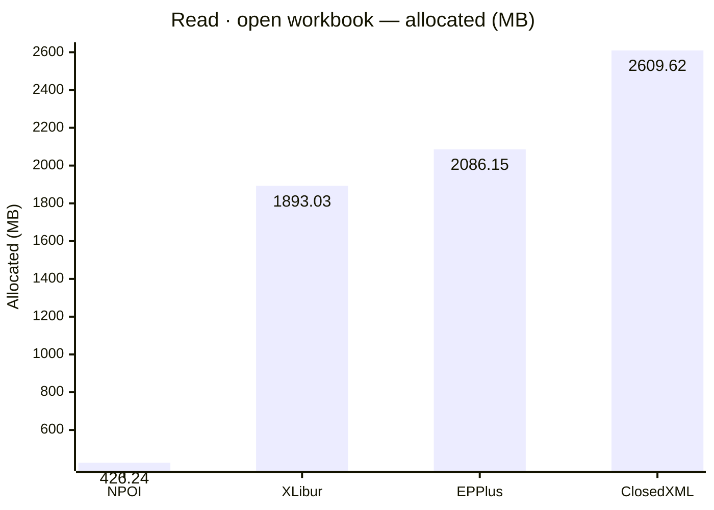
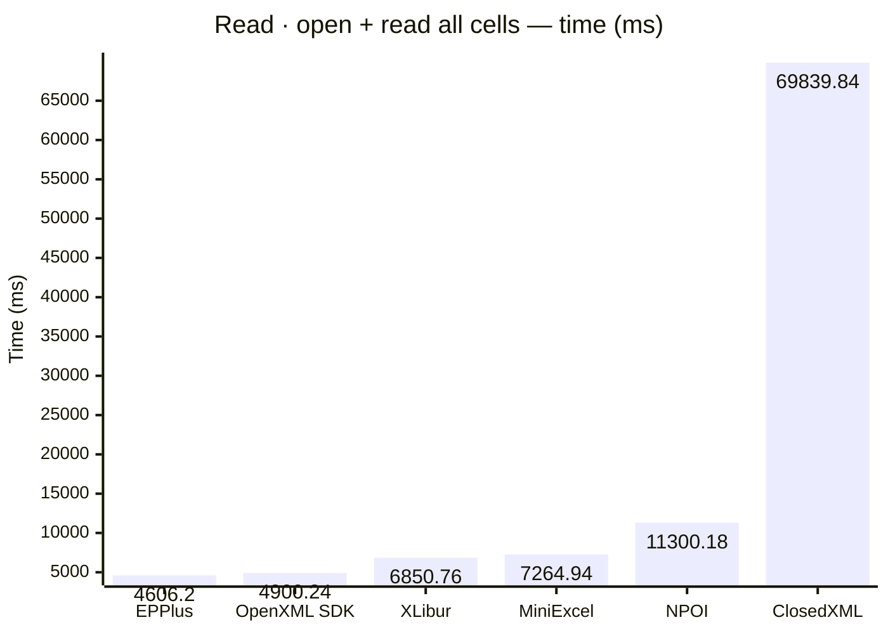
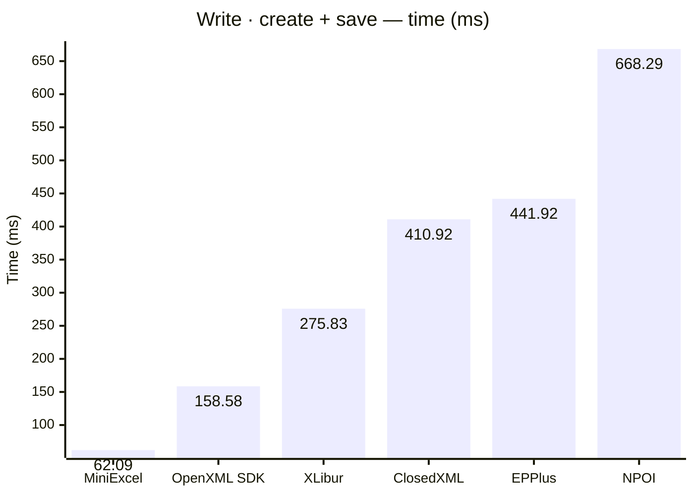
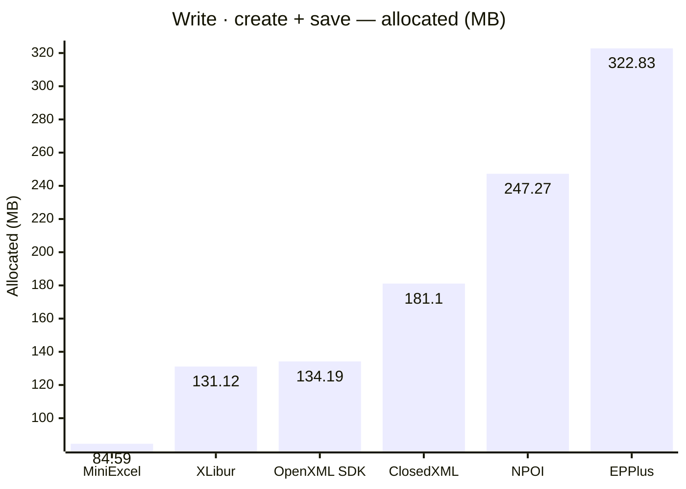

<style>
  .main-content { max-width: 90% !important; padding-left: 2rem !important; padding-right: 2rem !important; }
</style>
<!-- Generated by XLBench. Do not edit by hand; re-run scripts/run-benchmarks.ps1. -->
# XLBench Results

Each section below embeds the full BenchmarkDotNet environment block (OS, CPU,
.NET SDK and runtime). Timings are hardware-specific; treat the allocation/GC
columns as the most portable signal across machines. Regenerate locally with
`scripts/run-benchmarks.ps1`.

📈 **[Interactive charts](charts.html)** (GitHub Pages). Static charts and the full tables follow.

On the Pages site the results table is heat-mapped per scenario (🟩 best → 🟥 worst).

## Libraries under test

| Library | Version |
| --- | --- |
| ClosedXML | 0.105.0 |
| EPPlus | 8.6.2 |
| OpenXML SDK | 3.5.1 |
| NPOI | 2.8.0 |
| MiniExcel | 1.45.0 |
| XLibur | 0.105.1-rc.137 |

## Comparison charts

_Lower is better. Charts render in the GitHub file view; the Pages site has interactive versions._













```

BenchmarkDotNet v0.15.8, Windows 11 (10.0.22631.6199/23H2/2023Update/SunValley3)
AMD Ryzen 9 5950X 3.40GHz, 1 CPU, 32 logical and 16 physical cores
.NET SDK 10.0.302
  [Host]   : .NET 10.0.10 (10.0.10, 10.0.1026.32716), X64 RyuJIT x86-64-v3
  ShortRun : .NET 10.0.10 (10.0.10, 10.0.1026.32716), X64 RyuJIT x86-64-v3

Job=ShortRun  IterationCount=3  LaunchCount=1  
WarmupCount=3  

```

| Library     | Type                     | Method         | Mean         | Error        | StdDev     | Gen0        | Gen1        | Gen2       | Allocated  |
|------------ |------------------------- |--------------- |-------------:|-------------:|-----------:|------------:|------------:|-----------:|-----------:|
| ClosedXML   | ClosedXmlReadBenchmarks  | OpenWorkbook   |  7,222.28 ms |  2,813.25 ms | 154.203 ms | 160000.0000 |  50000.0000 |  3000.0000 | 2609.62 MB |
| ClosedXML   | ClosedXmlWriteBenchmarks | CreateAndSave  |    410.92 ms |     54.49 ms |   2.987 ms |  11000.0000 |   6000.0000 |  3000.0000 |   181.1 MB |
| EPPlus      | EpPlusReadBenchmarks     | OpenWorkbook   |  3,532.64 ms |  1,606.31 ms |  88.047 ms |  77000.0000 |  27000.0000 |  8000.0000 | 2086.15 MB |
| EPPlus      | EpPlusWriteBenchmarks    | CreateAndSave  |    441.92 ms |    341.47 ms |  18.717 ms |  20000.0000 |   9000.0000 |  3000.0000 |  322.83 MB |
| MiniExcel   | MiniExcelReadBenchmarks  | OpenAndReadAll |  7,264.94 ms |  1,607.06 ms |  88.088 ms | 169000.0000 |   1000.0000 |          - | 2710.44 MB |
| MiniExcel   | MiniExcelWriteBenchmarks | CreateAndSave  |     62.09 ms |     56.67 ms |   3.106 ms |   5333.3333 |   1444.4444 |  1333.3333 |   84.59 MB |
| NPOI        | NpoiReadBenchmarks       | OpenWorkbook   |    635.99 ms |  1,595.64 ms |  87.462 ms |   7000.0000 |   6000.0000 |  2000.0000 |  426.24 MB |
| NPOI        | NpoiWriteBenchmarks      | CreateAndSave  |    668.29 ms |    368.46 ms |  20.196 ms |  16000.0000 |  12000.0000 |  3000.0000 |  247.27 MB |
| OpenXML SDK | OpenXmlReadBenchmarks    | OpenAndReadAll |  4,900.24 ms |  1,274.04 ms |  69.835 ms | 159000.0000 |  16000.0000 |  3000.0000 | 2506.41 MB |
| OpenXML SDK | OpenXmlWriteBenchmarks   | CreateAndSave  |    158.58 ms |     37.35 ms |   2.047 ms |   8000.0000 |   2000.0000 |  2000.0000 |  134.19 MB |
| XLibur      | XLiburReadBenchmarks     | OpenWorkbook   |  5,116.98 ms |    353.75 ms |  19.390 ms | 120000.0000 |  39000.0000 |  4000.0000 | 1893.03 MB |
| XLibur      | XLiburWriteBenchmarks    | CreateAndSave  |    275.83 ms |     81.56 ms |   4.471 ms |   7000.0000 |   3000.0000 |  2000.0000 |  131.12 MB |
| ClosedXML   | ClosedXmlReadBenchmarks  | OpenAndReadAll | 69,839.84 ms |  2,303.82 ms | 126.280 ms | 233000.0000 |  87000.0000 |  6000.0000 | 4350.23 MB |
| EPPlus      | EpPlusReadBenchmarks     | OpenAndReadAll |  4,606.20 ms |  1,076.68 ms |  59.016 ms | 180000.0000 |  29000.0000 |  8000.0000 | 3727.63 MB |
| NPOI        | NpoiReadBenchmarks       | OpenAndReadAll | 11,300.18 ms | 14,576.44 ms | 798.984 ms | 257000.0000 | 236000.0000 | 10000.0000 | 4321.42 MB |
| XLibur      | XLiburReadBenchmarks     | OpenAndReadAll |  6,850.76 ms |    507.49 ms |  27.817 ms | 153000.0000 |  56000.0000 |  5000.0000 | 2879.36 MB |


<script type="module">
  import mermaid from 'https://cdn.jsdelivr.net/npm/mermaid@11/dist/mermaid.esm.min.mjs';
  const blocks = document.querySelectorAll('.language-mermaid');
  blocks.forEach(el => {
    const code = el.querySelector('code') || el;
    const pre = document.createElement('pre');
    pre.className = 'mermaid';
    pre.textContent = code.textContent;
    el.replaceWith(pre);
  });
  if (blocks.length) {
    mermaid.initialize({ startOnLoad: false });
    await mermaid.run({ querySelector: 'pre.mermaid' });
  }
</script>

<script>
(function () {
  const table = [...document.querySelectorAll('table')].find(t => t.tHead &&
    [...t.tHead.rows[0].cells].some(c => c.textContent.trim().toLowerCase() === 'mean'));
  if (!table || !table.tBodies[0]) return;
  const heads = [...table.tHead.rows[0].cells].map(c => c.textContent.trim().toLowerCase());
  const methodCol = heads.indexOf('method');
  const metricCols = heads.map((h, i) => /^(mean|allocated|gen0|gen1|gen2)$/.test(h) ? i : -1).filter(i => i >= 0);
  const rows = [...table.tBodies[0].rows];
  const parse = s => { const n = parseFloat(String(s).replace(/,/g, '')); return Number.isFinite(n) ? n : null; };
  const groups = {};
  rows.forEach((r, i) => {
    const key = methodCol >= 0 ? (r.cells[methodCol]?.textContent.trim() || '') : 'all';
    (groups[key] ||= []).push(i);
  });
  for (const c of metricCols) {
    for (const key in groups) {
      const idx = groups[key];
      const vals = idx.map(i => parse(rows[i].cells[c]?.textContent));
      const nums = vals.filter(v => v !== null);
      if (nums.length < 2) continue;
      const min = Math.min(...nums), max = Math.max(...nums);
      if (max === min) continue;
      idx.forEach((i, k) => {
        const v = vals[k]; if (v === null) return;
        const ratio = (v - min) / (max - min);
        rows[i].cells[c].style.backgroundColor = `hsla(${120 - 120 * ratio}, 70%, 50%, 0.45)`;
      });
    }
  }
})();
</script>
