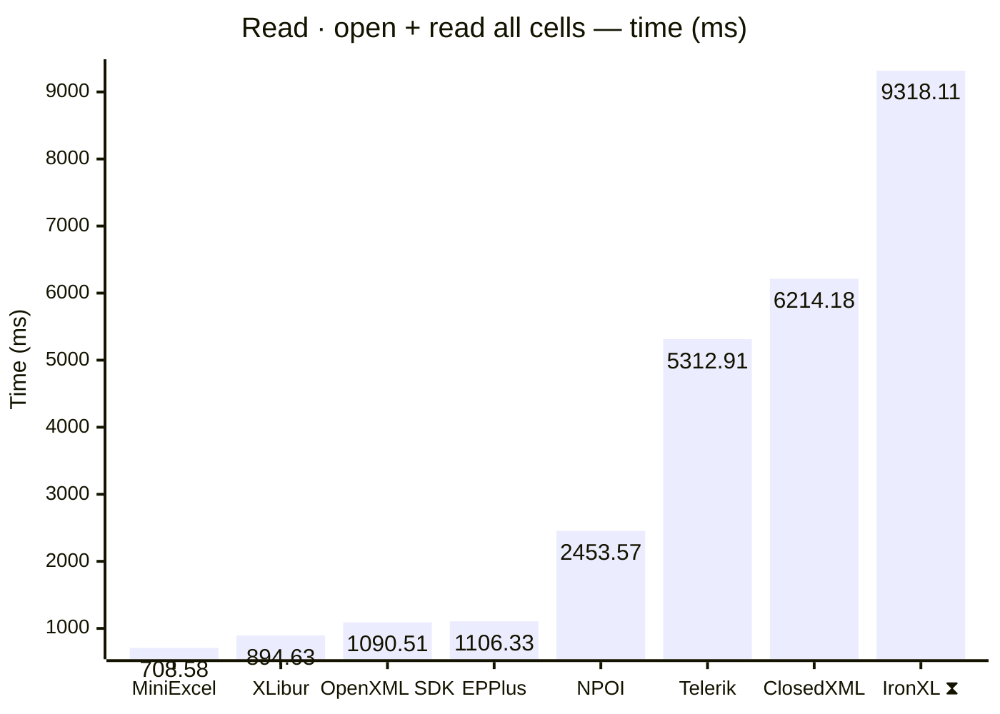
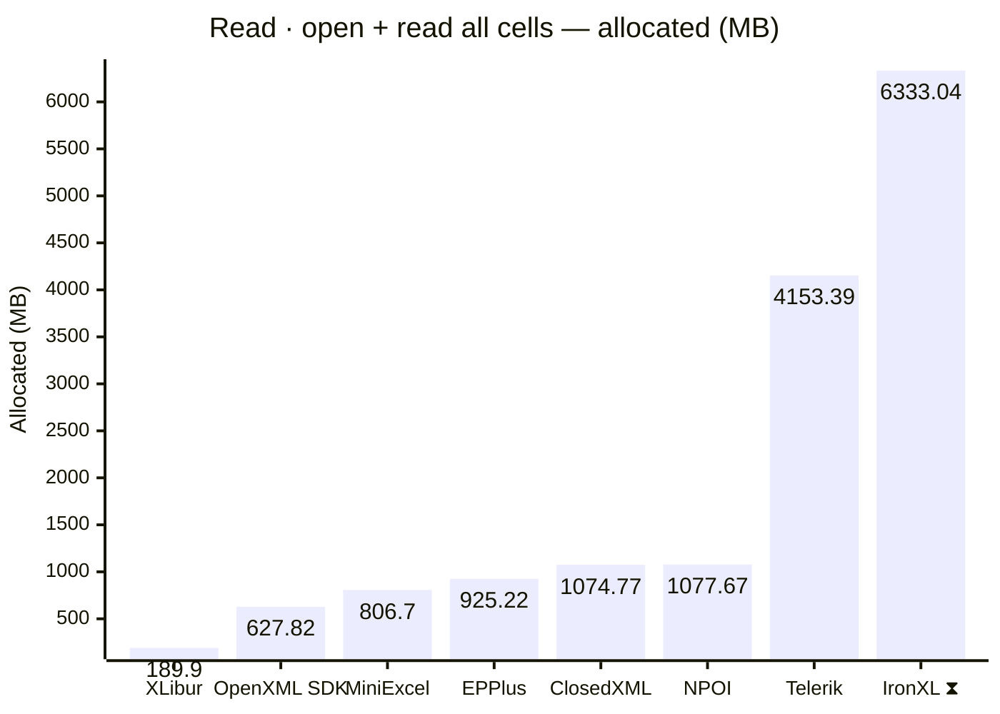
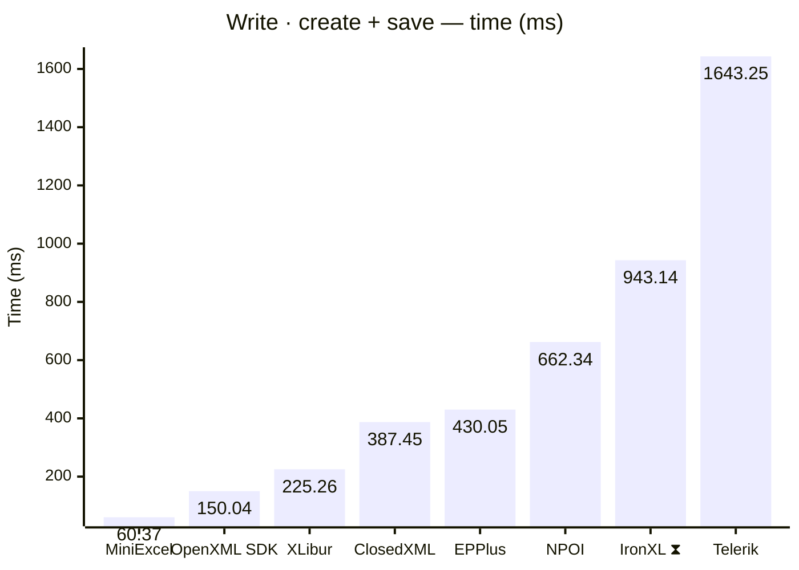
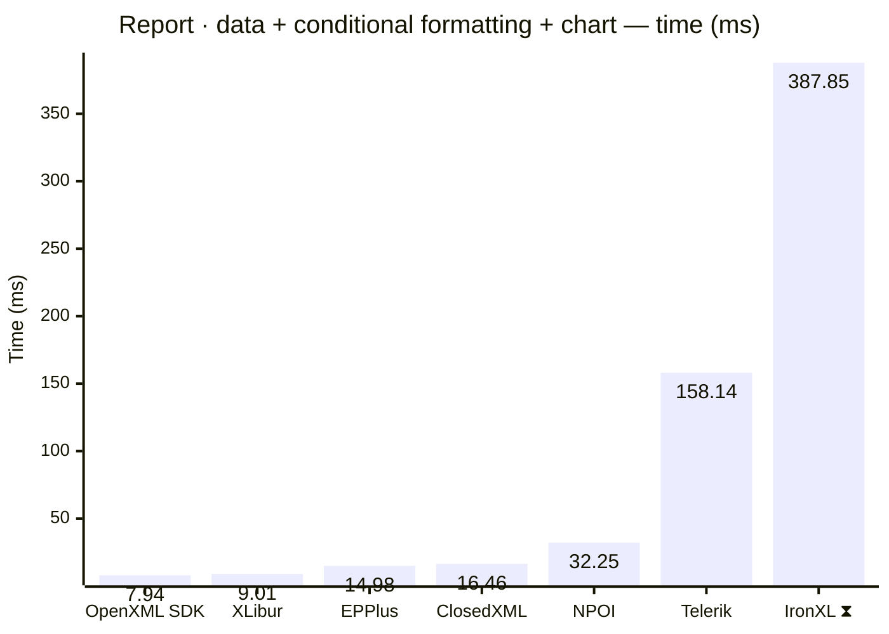
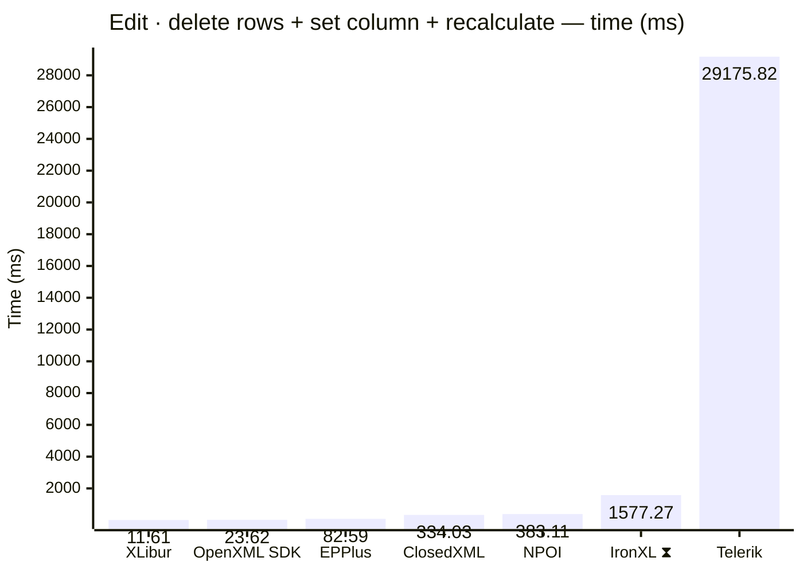
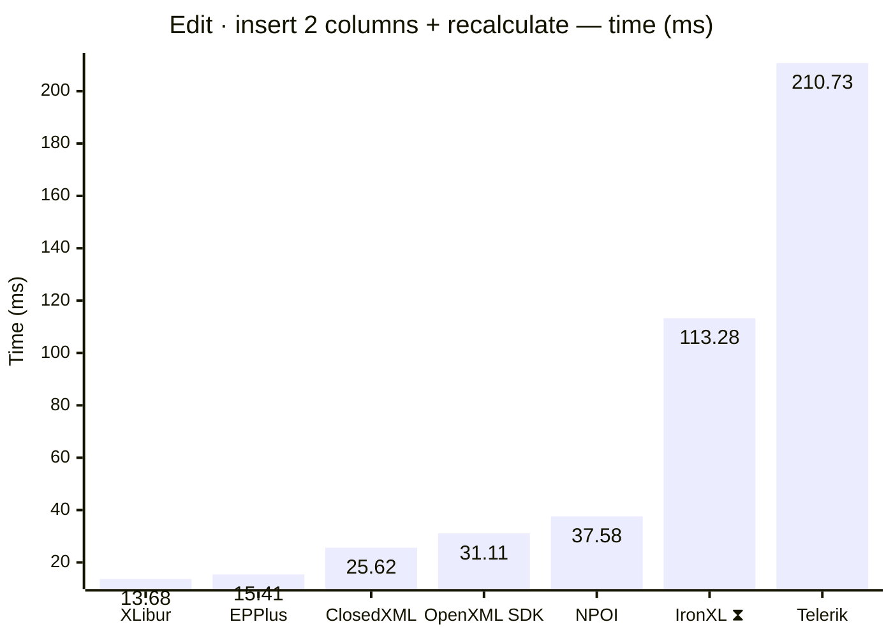
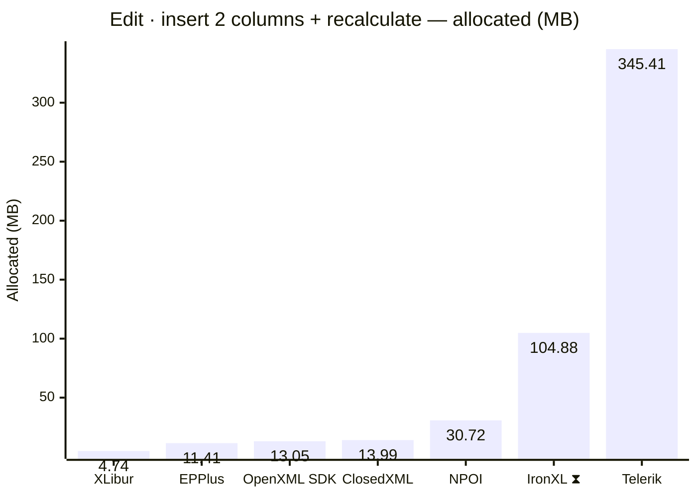

<style>
  .main-content { max-width: 90% !important; padding-left: 2rem !important; padding-right: 2rem !important; }
</style>
<!-- Generated by XLBench. Do not edit by hand; re-run scripts/run-benchmarks.ps1. -->
# XLBench Results

Each section below embeds the full BenchmarkDotNet environment block (OS, CPU,
.NET SDK and runtime). Timings are hardware-specific; treat the allocation/GC
columns as the most portable signal across machines. Regenerate locally with
`scripts/run-benchmarks.ps1`.

📈 **[Interactive charts](charts.html)** (GitHub Pages). Static charts and the full tables follow.

Each results table (one per test method) is heat-mapped independently on the Pages site (🟩 best → 🟥 worst).

> ⧗ **Carried over from an earlier run.** The rows and chart points below marked with this symbol were not measured here — the library is commercial and needs a licence key this run did not have — so they are replayed from `snapshots/`. Compare them as indicative rather than like-for-like, and see the repository README for how to refresh a snapshot.
>
> - **IronXL** 2026.8.1, Job-HTCPYF job, captured 2026-08-03 on same hardware as this run.

## Libraries under test

| Library | Version | Source |
| --- | --- | --- |
| ClosedXML | 0.105.1 | this run |
| EPPlus | 8.7.0 | this run |
| OpenXML SDK | 3.5.1 | this run |
| NPOI | 2.8.0 | this run |
| MiniExcel | 1.46.0 | this run |
| XLibur | 0.311.2-alpha.34 | this run |
| Telerik | 2026.3.826.100 | this run |
| IronXL ⧗ | 2026.8.1 | snapshot (2026.8.1, Job-HTCPYF, captured 2026-08-03) |

## Comparison charts

_Lower is better. Charts render in the GitHub file view; the Pages site has interactive versions._



















## Detailed results


```

BenchmarkDotNet v0.15.8, Windows 11 (10.0.22631.6199/23H2/2023Update/SunValley3)
AMD Ryzen 9 5950X 3.40GHz, 1 CPU, 32 logical and 16 physical cores
.NET SDK 10.0.400
  [Host]     : .NET 10.0.11 (10.0.11, 10.0.1126.37416), X64 RyuJIT x86-64-v3
  Job-TKRGYV : .NET 10.0.11 (10.0.11, 10.0.1126.37416), X64 RyuJIT x86-64-v3

MaxIterationCount=30  MaxWarmupIterationCount=10  MinIterationCount=5  
MinWarmupIterationCount=3  

```

### Read · open + set properties + save

| Library     | Type                      | Method                      | Mean          | Error       | StdDev      | Gen0         | Gen1        | Gen2        | Allocated   |
|------------ |-------------------------- |---------------------------- |--------------:|------------:|------------:|-------------:|------------:|------------:|------------:|
| NPOI        | NpoiReadBenchmarks        | OpenAmendPropertiesAndSave  |      8.613 ms |   0.1460 ms |   0.0379 ms |      62.5000 |           - |           - |     1.89 MB |
| XLibur      | XLiburReadBenchmarks      | OpenAmendPropertiesAndSave  |     15.044 ms |   0.2567 ms |   0.1527 ms |      76.9231 |           - |           - |     1.72 MB |
| EPPlus      | EpPlusReadBenchmarks      | OpenAmendPropertiesAndSave  |     22.611 ms |   0.2658 ms |   0.0948 ms |    1000.0000 |   1000.0000 |   1000.0000 |    13.82 MB |
| ClosedXML   | ClosedXmlReadBenchmarks   | OpenAmendPropertiesAndSave  |     32.620 ms |   0.5368 ms |   0.2383 ms |     666.6667 |    333.3333 |           - |    13.18 MB |
| Telerik     | TelerikReadBenchmarks     | OpenAmendPropertiesAndSave  |     80.291 ms |   1.5675 ms |   1.3089 ms |   10666.6667 |   1000.0000 |    666.6667 |   184.79 MB |
| IronXL ⧗ | IronXlReadBenchmarks | OpenAmendPropertiesAndSave | 208.746 ms | 155.7570 ms | 92.6885 ms | 9000.0000 | 2000.0000 | - | 152.81 MB |

### Read · open + read all cells

| Library     | Type                      | Method                      | Mean          | Error       | StdDev      | Gen0         | Gen1        | Gen2        | Allocated   |
|------------ |-------------------------- |---------------------------- |--------------:|------------:|------------:|-------------:|------------:|------------:|------------:|
| MiniExcel   | MiniExcelReadBenchmarks   | OpenAndReadAll              |    708.577 ms |  12.1574 ms |   6.3586 ms |   51000.0000 |   4000.0000 |   1000.0000 |    806.7 MB |
| XLibur      | XLiburReadBenchmarks      | OpenAndReadAll              |    894.634 ms |  15.5600 ms |  10.2920 ms |   13000.0000 |   8000.0000 |   2000.0000 |    189.9 MB |
| OpenXML SDK | OpenXmlReadBenchmarks     | OpenAndReadAll              |  1,090.508 ms |  21.6361 ms |   9.6066 ms |   40000.0000 |   6000.0000 |   1000.0000 |   627.82 MB |
| EPPlus      | EpPlusReadBenchmarks      | OpenAndReadAll              |  1,106.334 ms |  14.6662 ms |   3.8088 ms |   49000.0000 |  14000.0000 |   7000.0000 |   925.22 MB |
| NPOI        | NpoiReadBenchmarks        | OpenAndReadAll              |  2,453.568 ms |  48.3667 ms |  31.9916 ms |   68000.0000 |  62000.0000 |   6000.0000 |  1077.67 MB |
| Telerik     | TelerikReadBenchmarks     | OpenAndReadAll              |  5,312.909 ms | 105.2341 ms |  46.7246 ms |  252000.0000 |  53000.0000 |   6000.0000 |  4153.39 MB |
| ClosedXML   | ClosedXmlReadBenchmarks   | OpenAndReadAll              |  6,214.178 ms | 121.2648 ms |  18.7659 ms |   60000.0000 |  24000.0000 |   4000.0000 |  1074.77 MB |
| IronXL ⧗ | IronXlReadBenchmarks | OpenAndReadAll | 9,318.107 ms | 477.3336 ms | 315.7266 ms | 393000.0000 | 202000.0000 | 10000.0000 | 6333.04 MB |

### Write · create + save

| Library     | Type                      | Method                      | Mean          | Error       | StdDev      | Gen0         | Gen1        | Gen2        | Allocated   |
|------------ |-------------------------- |---------------------------- |--------------:|------------:|------------:|-------------:|------------:|------------:|------------:|
| MiniExcel   | MiniExcelWriteBenchmarks  | CreateAndSave               |     60.366 ms |   1.2043 ms |   1.2886 ms |    5111.1111 |   1222.2222 |   1111.1111 |    84.59 MB |
| OpenXML SDK | OpenXmlWriteBenchmarks    | CreateAndSave               |    150.037 ms |   2.4081 ms |   0.6254 ms |    8000.0000 |   2000.0000 |   2000.0000 |   134.19 MB |
| XLibur      | XLiburWriteBenchmarks     | CreateAndSave               |    225.258 ms |   4.3082 ms |   5.2909 ms |    4000.0000 |   3000.0000 |   3000.0000 |     60.5 MB |
| ClosedXML   | ClosedXmlWriteBenchmarks  | CreateAndSave               |    387.453 ms |   7.7106 ms |   7.5729 ms |   10000.0000 |   5000.0000 |   2000.0000 |   181.09 MB |
| EPPlus      | EpPlusWriteBenchmarks     | CreateAndSave               |    430.049 ms |   7.6403 ms |   4.5466 ms |   20000.0000 |   9000.0000 |   3000.0000 |   322.83 MB |
| NPOI        | NpoiWriteBenchmarks       | CreateAndSave               |    662.342 ms |  11.4092 ms |   5.9672 ms |   16000.0000 |  12000.0000 |   3000.0000 |   247.27 MB |
| IronXL ⧗ | IronXlWriteBenchmarks | CreateAndSave | 943.137 ms | 18.5191 ms | 11.0204 ms | 48000.0000 | 16000.0000 | 3000.0000 | 797.63 MB |
| Telerik     | TelerikWriteBenchmarks    | CreateAndSave               |  1,643.248 ms |  32.6054 ms |  17.0532 ms |  129000.0000 |  14000.0000 |   5000.0000 |  2085.84 MB |

### Report · data + conditional formatting + chart

| Library     | Type                      | Method                      | Mean          | Error       | StdDev      | Gen0         | Gen1        | Gen2        | Allocated   |
|------------ |-------------------------- |---------------------------- |--------------:|------------:|------------:|-------------:|------------:|------------:|------------:|
| OpenXML SDK | OpenXmlReportBenchmarks   | CreateStockReport           |      7.941 ms |   0.1328 ms |   0.0695 ms |     375.0000 |    359.3750 |    187.5000 |     4.92 MB |
| XLibur      | XLiburReportBenchmarks    | CreateStockReport           |      9.011 ms |   0.1433 ms |   0.1760 ms |     187.5000 |    187.5000 |    187.5000 |     3.48 MB |
| EPPlus      | EpPlusReportBenchmarks    | CreateStockReport           |     14.980 ms |   0.2560 ms |   0.0665 ms |    1000.0000 |   1000.0000 |   1000.0000 |    13.93 MB |
| ClosedXML   | ClosedXmlReportBenchmarks | CreateStockReport           |     16.460 ms |   0.2495 ms |   0.1804 ms |     468.7500 |    187.5000 |     31.2500 |     8.02 MB |
| NPOI        | NpoiReportBenchmarks      | CreateStockReport           |     32.249 ms |   0.8059 ms |   1.1813 ms |     875.0000 |    750.0000 |    375.0000 |    16.23 MB |
| Telerik     | TelerikReportBenchmarks   | CreateStockReport           |    158.138 ms |  17.7563 ms |  25.4656 ms |   27000.0000 |   7000.0000 |   2000.0000 |   428.74 MB |
| IronXL ⧗ | IronXlReportBenchmarks | CreateStockReport | 387.849 ms | 36.5456 ms | 24.1726 ms | 14000.0000 | 3000.0000 | - | 237.38 MB |

### Edit · delete rows + set column + recalculate

| Library     | Type                      | Method                      | Mean          | Error       | StdDev      | Gen0         | Gen1        | Gen2        | Allocated   |
|------------ |-------------------------- |---------------------------- |--------------:|------------:|------------:|-------------:|------------:|------------:|------------:|
| XLibur      | XLiburEditBenchmarks      | EditAndRecalculate          |     11.612 ms |   0.1912 ms |   0.1265 ms |     222.2222 |    111.1111 |           - |     4.12 MB |
| OpenXML SDK | OpenXmlEditBenchmarks     | EditAndRecalculate          |     23.615 ms |   0.2187 ms |   0.0568 ms |     718.7500 |    656.2500 |    156.2500 |      9.8 MB |
| EPPlus      | EpPlusEditBenchmarks      | EditAndRecalculate          |     82.594 ms |   1.2804 ms |   1.1977 ms |    9000.0000 |   1200.0000 |   1000.0000 |   142.49 MB |
| ClosedXML   | ClosedXmlEditBenchmarks   | EditAndRecalculate          |    334.027 ms |   2.5556 ms |   0.3955 ms |   21000.0000 |   1000.0000 |           - |   340.69 MB |
| NPOI        | NpoiEditBenchmarks        | EditAndRecalculate          |    383.109 ms |   7.5418 ms |   4.4880 ms |   25000.0000 |   1000.0000 |           - |   413.38 MB |
| IronXL ⧗ | IronXlEditBenchmarks | EditAndRecalculate | 1,577.273 ms | 62.9583 ms | 41.6430 ms | 57000.0000 | 36000.0000 | 15000.0000 | 753.86 MB |
| Telerik     | TelerikEditBenchmarks     | EditAndRecalculate          | 29,175.823 ms | 427.4962 ms | 152.4493 ms | 3767000.0000 | 341000.0000 | 165000.0000 | 59758.94 MB |

### Edit · insert 2 columns + recalculate

| Library     | Type                      | Method                      | Mean          | Error       | StdDev      | Gen0         | Gen1        | Gen2        | Allocated   |
|------------ |-------------------------- |---------------------------- |--------------:|------------:|------------:|-------------:|------------:|------------:|------------:|
| XLibur      | XLiburInsertBenchmarks    | InsertColumnsAndRecalculate |     13.684 ms |   0.1884 ms |   0.0489 ms |     250.0000 |    125.0000 |           - |     4.74 MB |
| EPPlus      | EpPlusInsertBenchmarks    | InsertColumnsAndRecalculate |     15.415 ms |   0.2909 ms |   0.1521 ms |    1000.0000 |   1000.0000 |   1000.0000 |    11.41 MB |
| ClosedXML   | ClosedXmlInsertBenchmarks | InsertColumnsAndRecalculate |     25.617 ms |   0.5862 ms |   0.8407 ms |     800.0000 |    400.0000 |           - |    13.99 MB |
| OpenXML SDK | OpenXmlInsertBenchmarks   | InsertColumnsAndRecalculate |     31.106 ms |   0.5112 ms |   0.1823 ms |    1000.0000 |    833.3333 |    333.3333 |    13.05 MB |
| NPOI        | NpoiInsertBenchmarks      | InsertColumnsAndRecalculate |     37.580 ms |   0.8311 ms |   1.1920 ms |    2000.0000 |   1333.3333 |    500.0000 |    30.72 MB |
| IronXL ⧗ | IronXlInsertBenchmarks | InsertColumnsAndRecalculate | 113.284 ms | 41.9750 ms | 27.7638 ms | 7000.0000 | 2500.0000 | 750.0000 | 104.88 MB |
| Telerik     | TelerikInsertBenchmarks   | InsertColumnsAndRecalculate |    210.727 ms |   3.7533 ms |   4.7467 ms |   21000.0000 |   6000.0000 |   2000.0000 |   345.41 MB |


<script type="module">
  import mermaid from 'https://cdn.jsdelivr.net/npm/mermaid@11/dist/mermaid.esm.min.mjs';
  const blocks = document.querySelectorAll('.language-mermaid');
  blocks.forEach(el => {
    const code = el.querySelector('code') || el;
    const pre = document.createElement('pre');
    pre.className = 'mermaid';
    pre.textContent = code.textContent;
    el.replaceWith(pre);
  });
  if (blocks.length) {
    mermaid.initialize({ startOnLoad: false });
    await mermaid.run({ querySelector: 'pre.mermaid' });
  }
</script>

<script>
(function () {
  const parse = s => { const n = parseFloat(String(s).replace(/,/g, '')); return Number.isFinite(n) ? n : null; };
  document.querySelectorAll('table').forEach(table => {
    if (!table.tHead || !table.tBodies[0]) return;
    const heads = [...table.tHead.rows[0].cells].map(c => c.textContent.trim().toLowerCase());
    if (!heads.includes('mean')) return;
    const metricCols = heads.map((h, i) => /^(mean|allocated|gen0|gen1|gen2)$/.test(h) ? i : -1).filter(i => i >= 0);
    const rows = [...table.tBodies[0].rows];
    for (const c of metricCols) {
      const vals = rows.map(r => parse(r.cells[c]?.textContent));
      const nums = vals.filter(v => v !== null);
      if (nums.length < 2) continue;
      const min = Math.min(...nums), max = Math.max(...nums);
      if (max === min) continue;
      rows.forEach((r, i) => {
        const v = vals[i]; if (v === null) return;
        const ratio = (v - min) / (max - min);
        r.cells[c].style.backgroundColor = `hsla(${120 - 120 * ratio}, 70%, 50%, 0.45)`;
      });
    }
  });
})();
</script>
