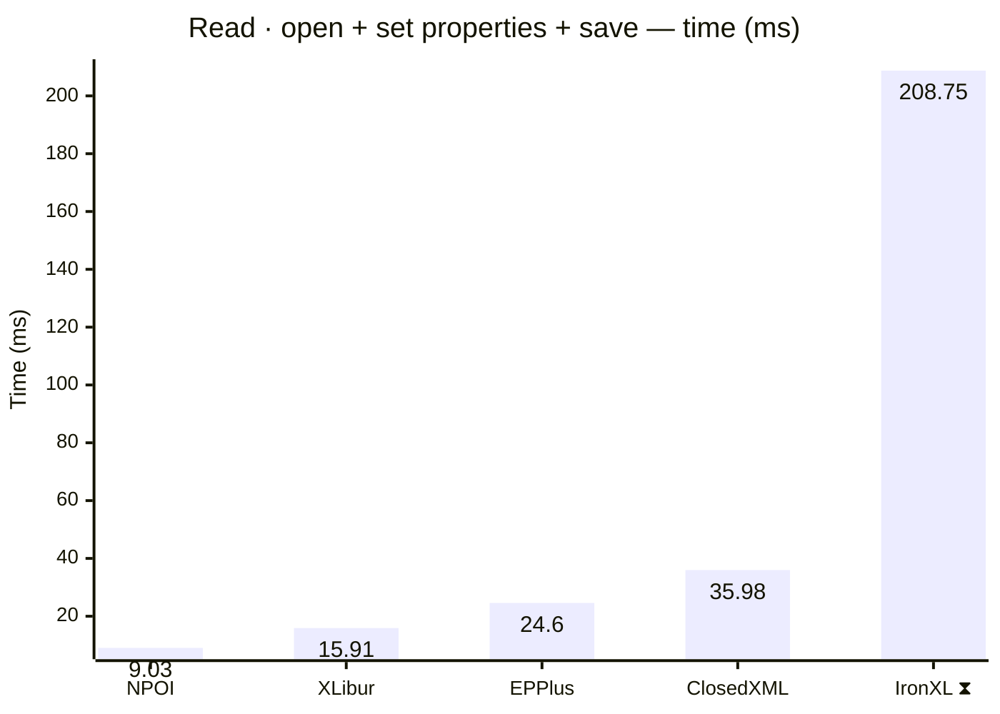
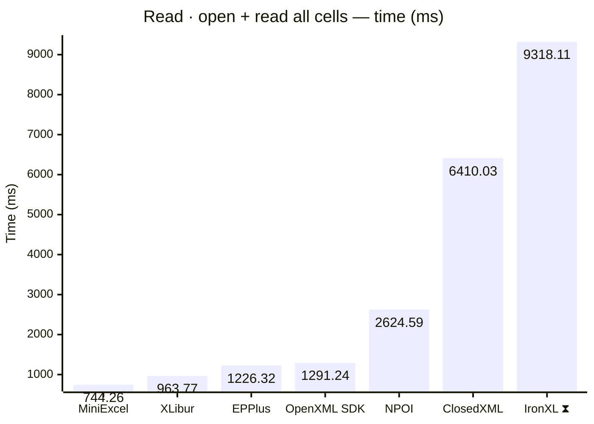
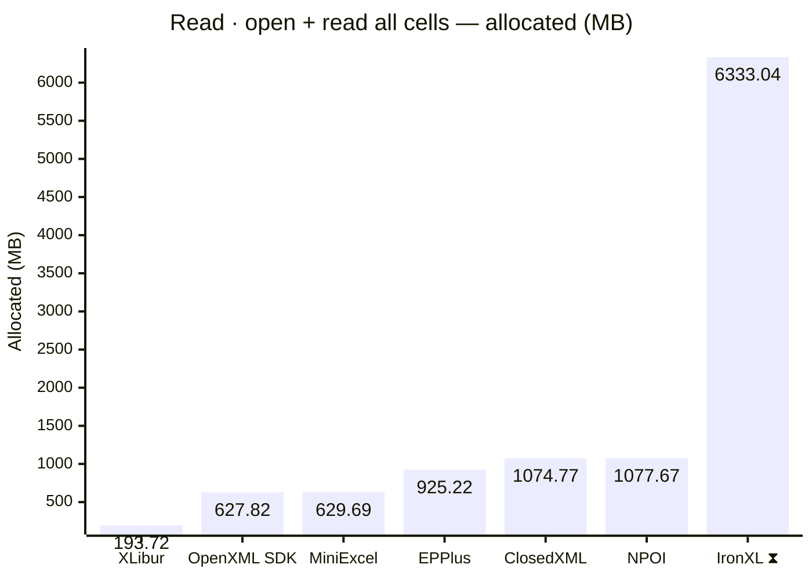
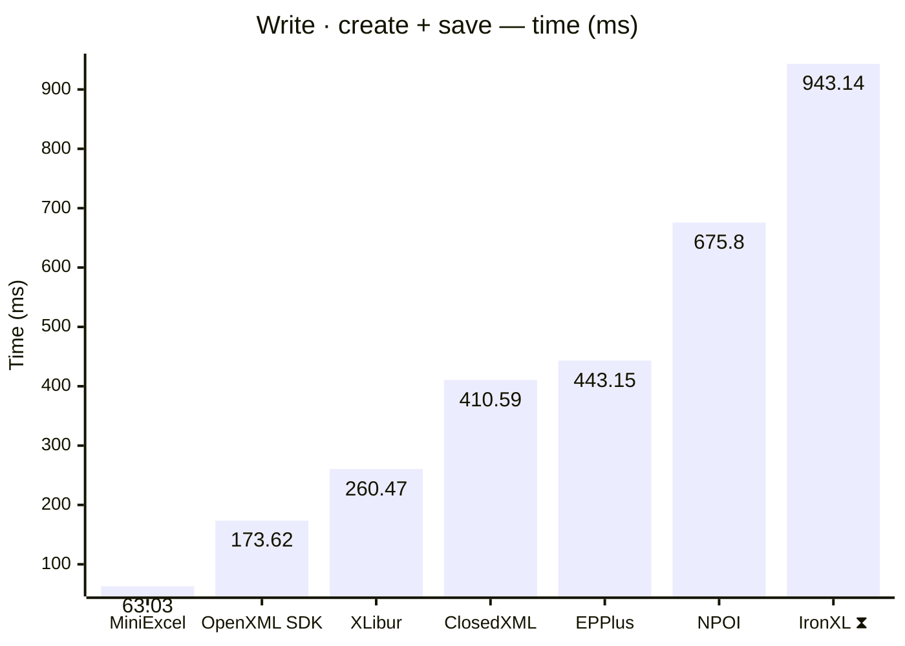
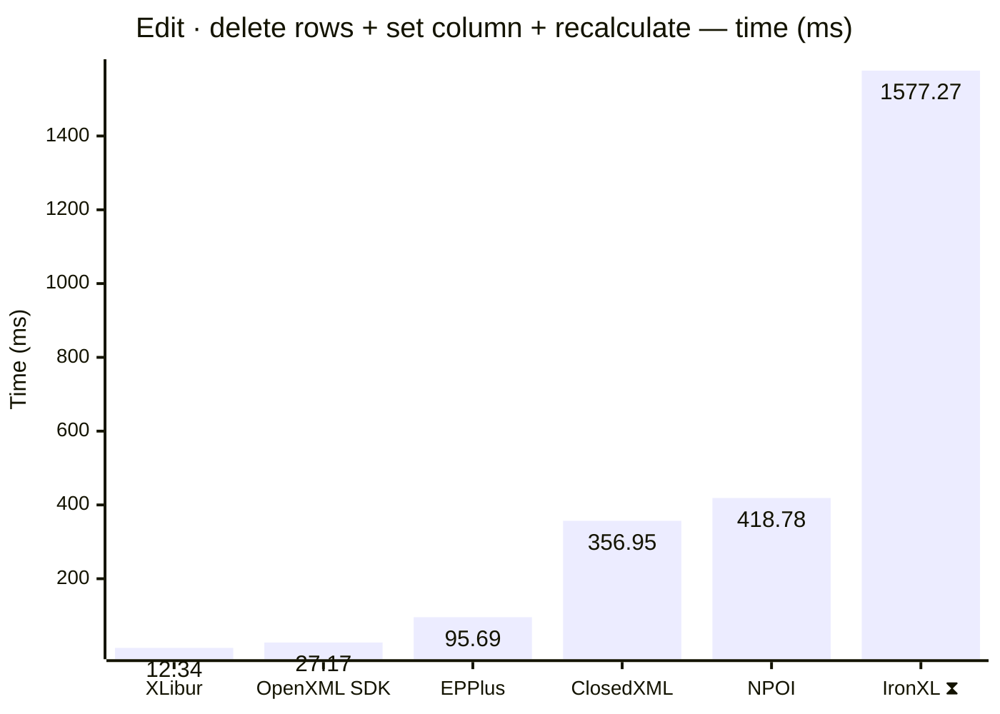

<style>
  .main-content { max-width: 90% !important; padding-left: 2rem !important; padding-right: 2rem !important; }
</style>
<!-- Generated by XLBench. Do not edit by hand; re-run scripts/run-benchmarks.ps1. -->
# XLBench Results

Each section below embeds the full BenchmarkDotNet environment block (OS, CPU,
.NET SDK and runtime). Timings are hardware-specific; treat the allocation/GC
columns as the most portable signal across machines. Regenerate locally with
`scripts/run-benchmarks.ps1`.

📈 **[Interactive charts](charts.html)** (GitHub Pages). Static charts and the full tables follow.

Each results table (one per test method) is heat-mapped independently on the Pages site (🟩 best → 🟥 worst).

> ⧗ **Carried over from an earlier run.** The rows and chart points below marked with this symbol were not measured here — the library is commercial and needs a licence key this run did not have — so they are replayed from `snapshots/`. Compare them as indicative rather than like-for-like, and see the repository README for how to refresh a snapshot.
>
> - **IronXL** 2026.8.1, Job-HTCPYF job, captured 2026-08-03 on same hardware as this run.

## Libraries under test

| Library | Version | Source |
| --- | --- | --- |
| ClosedXML | 0.105.1 | this run |
| EPPlus | 8.6.3 | this run |
| OpenXML SDK | 3.5.1 | this run |
| NPOI | 2.8.0 | this run |
| MiniExcel | 1.45.0 | this run |
| XLibur | 0.310.1-beta.5 | this run |
| IronXL ⧗ | 2026.8.1 | snapshot (2026.8.1, Job-HTCPYF, captured 2026-08-03) |

## Comparison charts

_Lower is better. Charts render in the GitHub file view; the Pages site has interactive versions._














## Detailed results


```

BenchmarkDotNet v0.15.8, Windows 11 (10.0.22631.6199/23H2/2023Update/SunValley3)
AMD Ryzen 9 5950X 3.40GHz, 1 CPU, 32 logical and 16 physical cores
.NET SDK 10.0.302
  [Host]     : .NET 10.0.10 (10.0.10, 10.0.1026.32716), X64 RyuJIT x86-64-v3
  DefaultJob : .NET 10.0.10 (10.0.10, 10.0.1026.32716), X64 RyuJIT x86-64-v3


```

### Read · open + set properties + save

| Library     | Type                      | Method                      | Mean         | Error      | StdDev     | Median       | Gen0       | Gen1       | Gen2      | Allocated  |
|------------ |-------------------------- |---------------------------- |-------------:|-----------:|-----------:|-------------:|-----------:|-----------:|----------:|-----------:|
| NPOI        | NpoiReadBenchmarks        | OpenAmendPropertiesAndSave  |     9.030 ms |  0.1251 ms |  0.1170 ms |     9.059 ms |    62.5000 |          - |         - |    1.89 MB |
| XLibur      | XLiburReadBenchmarks      | OpenAmendPropertiesAndSave  |    15.914 ms |  0.3322 ms |  0.9585 ms |    15.528 ms |          - |          - |         - |    1.73 MB |
| EPPlus      | EpPlusReadBenchmarks      | OpenAmendPropertiesAndSave  |    24.601 ms |  0.4809 ms |  0.7049 ms |    24.408 ms |  1000.0000 |  1000.0000 | 1000.0000 |   13.81 MB |
| ClosedXML   | ClosedXmlReadBenchmarks   | OpenAmendPropertiesAndSave  |    35.981 ms |  0.6837 ms |  0.9128 ms |    35.796 ms |   666.6667 |   333.3333 |         - |   13.18 MB |
| IronXL ⧗ | IronXlReadBenchmarks | OpenAmendPropertiesAndSave | 208.746 ms | 155.7570 ms | 92.6885 ms | 168.705 ms | 9000.0000 | 2000.0000 | - | 152.81 MB |

### Read · open + read all cells

| Library     | Type                      | Method                      | Mean         | Error      | StdDev     | Median       | Gen0       | Gen1       | Gen2      | Allocated  |
|------------ |-------------------------- |---------------------------- |-------------:|-----------:|-----------:|-------------:|-----------:|-----------:|----------:|-----------:|
| MiniExcel   | MiniExcelReadBenchmarks   | OpenAndReadAll              |   744.257 ms | 13.1578 ms | 19.2866 ms |   742.038 ms | 38000.0000 |  3000.0000 |         - |  629.69 MB |
| XLibur      | XLiburReadBenchmarks      | OpenAndReadAll              |   963.775 ms | 17.0556 ms | 14.2422 ms |   964.751 ms | 13000.0000 |  8000.0000 | 2000.0000 |  193.72 MB |
| EPPlus      | EpPlusReadBenchmarks      | OpenAndReadAll              | 1,226.323 ms | 23.6487 ms | 31.5703 ms | 1,223.414 ms | 49000.0000 | 14000.0000 | 7000.0000 |  925.22 MB |
| OpenXML SDK | OpenXmlReadBenchmarks     | OpenAndReadAll              | 1,291.237 ms | 25.1055 ms | 27.9047 ms | 1,294.944 ms | 40000.0000 |  6000.0000 | 1000.0000 |  627.82 MB |
| NPOI        | NpoiReadBenchmarks        | OpenAndReadAll              | 2,624.594 ms | 34.2948 ms | 35.2182 ms | 2,616.548 ms | 68000.0000 | 62000.0000 | 6000.0000 | 1077.67 MB |
| ClosedXML   | ClosedXmlReadBenchmarks   | OpenAndReadAll              | 6,410.035 ms | 97.5485 ms | 81.4575 ms | 6,415.863 ms | 60000.0000 | 24000.0000 | 4000.0000 | 1074.77 MB |
| IronXL ⧗ | IronXlReadBenchmarks | OpenAndReadAll | 9,318.107 ms | 477.3336 ms | 315.7266 ms | 9,377.407 ms | 393000.0000 | 202000.0000 | 10000.0000 | 6333.04 MB |

### Write · create + save

| Library     | Type                      | Method                      | Mean         | Error      | StdDev     | Median       | Gen0       | Gen1       | Gen2      | Allocated  |
|------------ |-------------------------- |---------------------------- |-------------:|-----------:|-----------:|-------------:|-----------:|-----------:|----------:|-----------:|
| MiniExcel   | MiniExcelWriteBenchmarks  | CreateAndSave               |    63.029 ms |  1.1719 ms |  1.6040 ms |    62.927 ms |  5666.6667 |  1777.7778 | 1666.6667 |   84.59 MB |
| OpenXML SDK | OpenXmlWriteBenchmarks    | CreateAndSave               |   173.615 ms |  3.4387 ms |  8.7527 ms |   170.377 ms |  8000.0000 |  2000.0000 | 2000.0000 |  134.19 MB |
| XLibur      | XLiburWriteBenchmarks     | CreateAndSave               |   260.470 ms |  6.0441 ms | 17.4387 ms |   258.157 ms |  4000.0000 |  3000.0000 | 3000.0000 |    60.5 MB |
| ClosedXML   | ClosedXmlWriteBenchmarks  | CreateAndSave               |   410.588 ms |  8.1729 ms | 14.9445 ms |   409.233 ms | 10000.0000 |  5000.0000 | 2000.0000 |  181.09 MB |
| EPPlus      | EpPlusWriteBenchmarks     | CreateAndSave               |   443.151 ms |  8.4036 ms |  7.8608 ms |   441.311 ms | 20000.0000 |  9000.0000 | 3000.0000 |  322.83 MB |
| NPOI        | NpoiWriteBenchmarks       | CreateAndSave               |   675.797 ms | 13.2192 ms | 16.2344 ms |   674.383 ms | 16000.0000 | 12000.0000 | 3000.0000 |  247.27 MB |
| IronXL ⧗ | IronXlWriteBenchmarks | CreateAndSave | 943.137 ms | 18.5191 ms | 11.0204 ms | 938.999 ms | 48000.0000 | 16000.0000 | 3000.0000 | 797.63 MB |

### Report · data + conditional formatting + chart

| Library     | Type                      | Method                      | Mean         | Error      | StdDev     | Median       | Gen0       | Gen1       | Gen2      | Allocated  |
|------------ |-------------------------- |---------------------------- |-------------:|-----------:|-----------:|-------------:|-----------:|-----------:|----------:|-----------:|
| OpenXML SDK | OpenXmlReportBenchmarks   | CreateStockReport           |     8.183 ms |  0.0877 ms |  0.0732 ms |     8.181 ms |   375.0000 |   359.3750 |  187.5000 |    4.92 MB |
| XLibur      | XLiburReportBenchmarks    | CreateStockReport           |     9.524 ms |  0.1608 ms |  0.2254 ms |     9.481 ms |   187.5000 |   187.5000 |  187.5000 |    3.44 MB |
| EPPlus      | EpPlusReportBenchmarks    | CreateStockReport           |    15.340 ms |  0.2851 ms |  0.4178 ms |    15.243 ms |  1000.0000 |  1000.0000 | 1000.0000 |   13.92 MB |
| ClosedXML   | ClosedXmlReportBenchmarks | CreateStockReport           |    17.613 ms |  0.2836 ms |  0.2514 ms |    17.635 ms |   468.7500 |   187.5000 |   31.2500 |    8.02 MB |
| NPOI        | NpoiReportBenchmarks      | CreateStockReport           |    32.255 ms |  0.5928 ms |  0.7497 ms |    32.067 ms |   833.3333 |   666.6667 |  333.3333 |   16.23 MB |
| IronXL ⧗ | IronXlReportBenchmarks | CreateStockReport | 387.849 ms | 36.5456 ms | 24.1726 ms | 384.092 ms | 14000.0000 | 3000.0000 | - | 237.38 MB |

### Edit · delete rows + set column + recalculate

| Library     | Type                      | Method                      | Mean         | Error      | StdDev     | Median       | Gen0       | Gen1       | Gen2      | Allocated  |
|------------ |-------------------------- |---------------------------- |-------------:|-----------:|-----------:|-------------:|-----------:|-----------:|----------:|-----------:|
| XLibur      | XLiburEditBenchmarks      | EditAndRecalculate          |    12.335 ms |  0.2449 ms |  0.5112 ms |    12.237 ms |   250.0000 |   125.0000 |         - |    4.17 MB |
| OpenXML SDK | OpenXmlEditBenchmarks     | EditAndRecalculate          |    27.169 ms |  0.5410 ms |  0.9616 ms |    26.784 ms |   718.7500 |   656.2500 |  156.2500 |     9.8 MB |
| EPPlus      | EpPlusEditBenchmarks      | EditAndRecalculate          |    95.687 ms |  1.9076 ms |  3.8535 ms |    94.892 ms |  9000.0000 |  1200.0000 | 1000.0000 |  142.49 MB |
| ClosedXML   | ClosedXmlEditBenchmarks   | EditAndRecalculate          |   356.947 ms |  7.0105 ms | 11.3206 ms |   355.142 ms | 21000.0000 |  1000.0000 |         - |  340.69 MB |
| NPOI        | NpoiEditBenchmarks        | EditAndRecalculate          |   418.779 ms |  8.2896 ms | 13.8500 ms |   417.451 ms | 25000.0000 |  1000.0000 |         - |  413.38 MB |
| IronXL ⧗ | IronXlEditBenchmarks | EditAndRecalculate | 1,577.273 ms | 62.9583 ms | 41.6430 ms | 1,583.098 ms | 57000.0000 | 36000.0000 | 15000.0000 | 753.86 MB |

### Edit · insert 2 columns + recalculate

| Library     | Type                      | Method                      | Mean         | Error      | StdDev     | Median       | Gen0       | Gen1       | Gen2      | Allocated  |
|------------ |-------------------------- |---------------------------- |-------------:|-----------:|-----------:|-------------:|-----------:|-----------:|----------:|-----------:|
| XLibur      | XLiburInsertBenchmarks    | InsertColumnsAndRecalculate |    14.124 ms |  0.2825 ms |  0.4720 ms |    14.055 ms |   200.0000 |   100.0000 |         - |    4.73 MB |
| EPPlus      | EpPlusInsertBenchmarks    | InsertColumnsAndRecalculate |    17.750 ms |  0.3488 ms |  0.7124 ms |    17.732 ms |  1000.0000 |  1000.0000 | 1000.0000 |   11.41 MB |
| ClosedXML   | ClosedXmlInsertBenchmarks | InsertColumnsAndRecalculate |    27.234 ms |  0.5215 ms |  1.1227 ms |    26.922 ms |   750.0000 |   250.0000 |         - |   14.03 MB |
| OpenXML SDK | OpenXmlInsertBenchmarks   | InsertColumnsAndRecalculate |    34.114 ms |  0.6770 ms |  1.2881 ms |    33.811 ms |   750.0000 |   500.0000 |  250.0000 |   13.05 MB |
| NPOI        | NpoiInsertBenchmarks      | InsertColumnsAndRecalculate |    39.127 ms |  0.7341 ms |  1.1429 ms |    39.467 ms |  2000.0000 |  1400.0000 |  600.0000 |   30.72 MB |
| IronXL ⧗ | IronXlInsertBenchmarks | InsertColumnsAndRecalculate | 113.284 ms | 41.9750 ms | 27.7638 ms | 97.052 ms | 7000.0000 | 2500.0000 | 750.0000 | 104.88 MB |


<script type="module">
  import mermaid from 'https://cdn.jsdelivr.net/npm/mermaid@11/dist/mermaid.esm.min.mjs';
  const blocks = document.querySelectorAll('.language-mermaid');
  blocks.forEach(el => {
    const code = el.querySelector('code') || el;
    const pre = document.createElement('pre');
    pre.className = 'mermaid';
    pre.textContent = code.textContent;
    el.replaceWith(pre);
  });
  if (blocks.length) {
    mermaid.initialize({ startOnLoad: false });
    await mermaid.run({ querySelector: 'pre.mermaid' });
  }
</script>

<script>
(function () {
  const parse = s => { const n = parseFloat(String(s).replace(/,/g, '')); return Number.isFinite(n) ? n : null; };
  document.querySelectorAll('table').forEach(table => {
    if (!table.tHead || !table.tBodies[0]) return;
    const heads = [...table.tHead.rows[0].cells].map(c => c.textContent.trim().toLowerCase());
    if (!heads.includes('mean')) return;
    const metricCols = heads.map((h, i) => /^(mean|allocated|gen0|gen1|gen2)$/.test(h) ? i : -1).filter(i => i >= 0);
    const rows = [...table.tBodies[0].rows];
    for (const c of metricCols) {
      const vals = rows.map(r => parse(r.cells[c]?.textContent));
      const nums = vals.filter(v => v !== null);
      if (nums.length < 2) continue;
      const min = Math.min(...nums), max = Math.max(...nums);
      if (max === min) continue;
      rows.forEach((r, i) => {
        const v = vals[i]; if (v === null) return;
        const ratio = (v - min) / (max - min);
        r.cells[c].style.backgroundColor = `hsla(${120 - 120 * ratio}, 70%, 50%, 0.45)`;
      });
    }
  });
})();
</script>
