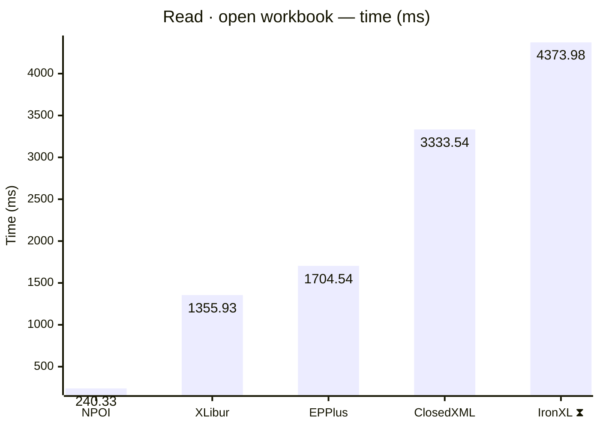
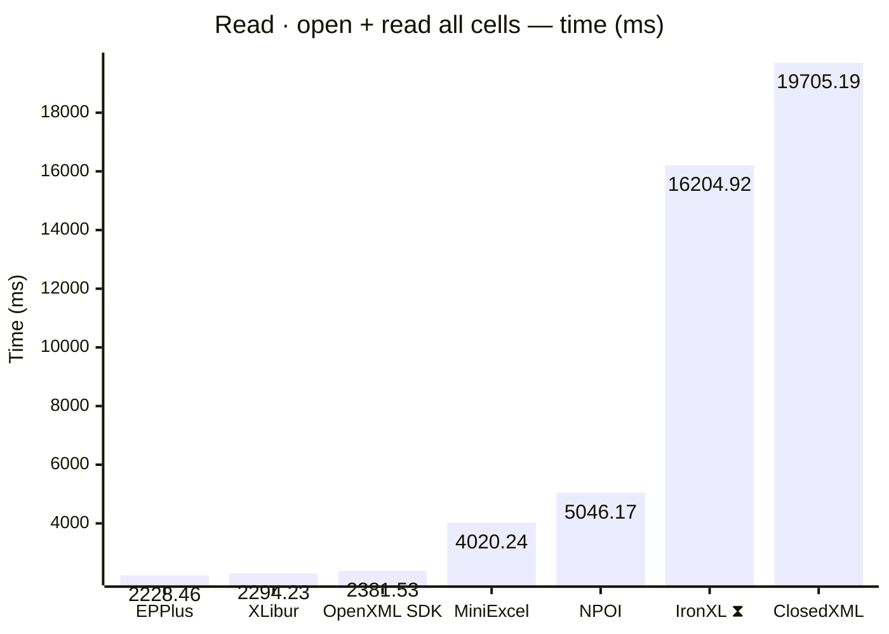
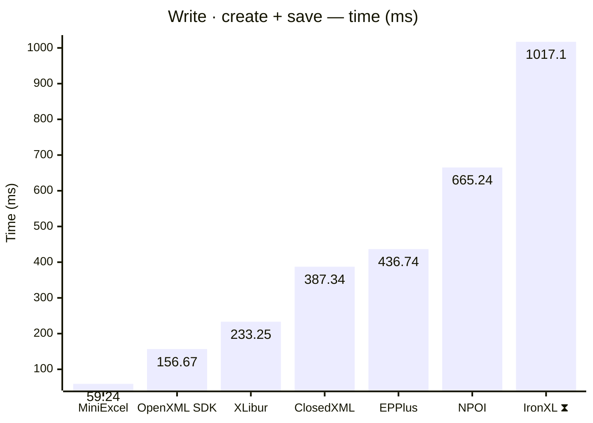
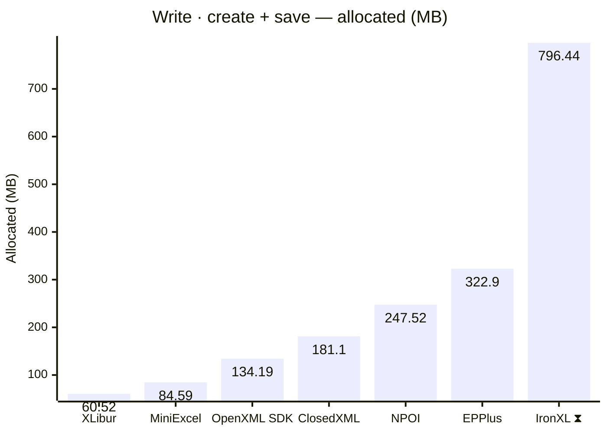
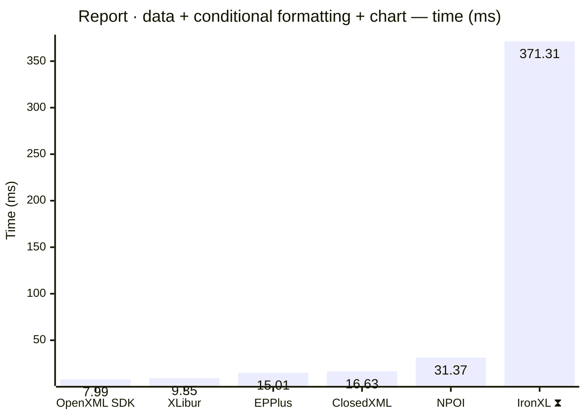
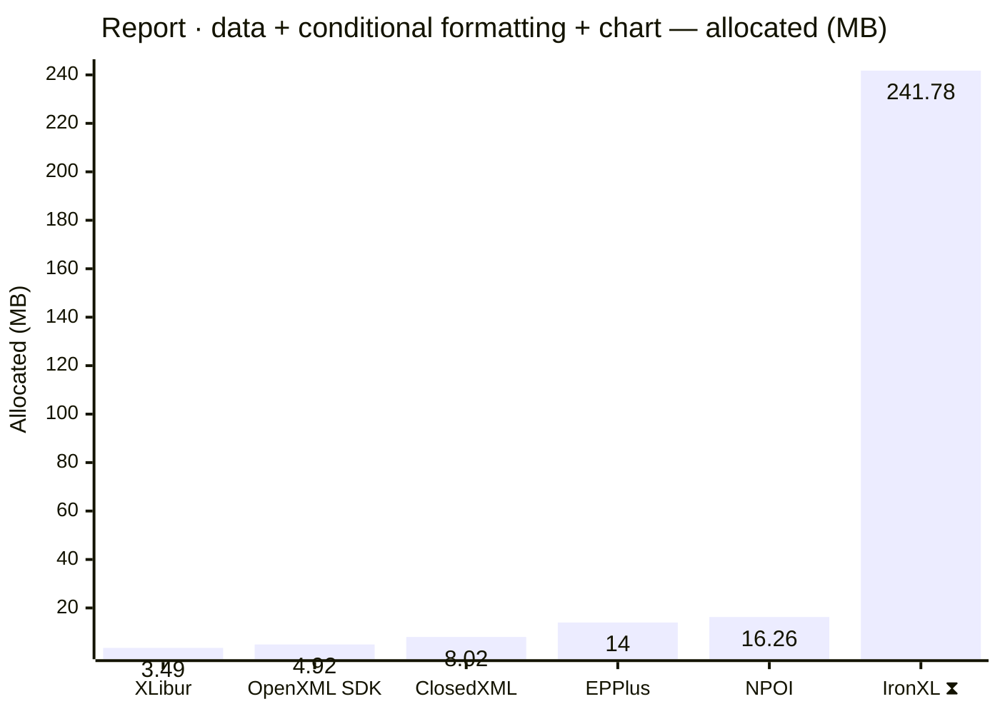

<style>
  .main-content { max-width: 90% !important; padding-left: 2rem !important; padding-right: 2rem !important; }
</style>
<!-- Generated by XLBench. Do not edit by hand; re-run scripts/run-benchmarks.ps1. -->
# XLBench Results

Each section below embeds the full BenchmarkDotNet environment block (OS, CPU,
.NET SDK and runtime). Timings are hardware-specific; treat the allocation/GC
columns as the most portable signal across machines. Regenerate locally with
`scripts/run-benchmarks.ps1`.

📈 **[Interactive charts](charts.html)** (GitHub Pages). Static charts and the full tables follow.

Each results table (one per test method) is heat-mapped independently on the Pages site (🟩 best → 🟥 worst).

> ⧗ **Carried over from an earlier run.** The rows and chart points below marked with this symbol were not measured here — the library is commercial and needs a licence key this run did not have — so they are replayed from `snapshots/`. Compare them as indicative rather than like-for-like, and see the repository README for how to refresh a snapshot.
>
> - **IronXL** 2026.7.2, DefaultJob job, captured 2026-07-30 on same hardware as this run.

## Libraries under test

| Library | Version | Source |
| --- | --- | --- |
| ClosedXML | 0.105.1 | this run |
| EPPlus | 8.6.3 | this run |
| OpenXML SDK | 3.5.1 | this run |
| NPOI | 2.8.0 | this run |
| MiniExcel | 1.45.0 | this run |
| XLibur | 0.200.0 | this run |
| IronXL ⧗ | 2026.7.2 | snapshot (2026.7.2, DefaultJob, captured 2026-07-30) |

## Comparison charts

_Lower is better. Charts render in the GitHub file view; the Pages site has interactive versions._















## Detailed results


```

BenchmarkDotNet v0.15.8, Windows 11 (10.0.22631.6199/23H2/2023Update/SunValley3)
AMD Ryzen 9 5950X 3.40GHz, 1 CPU, 32 logical and 16 physical cores
.NET SDK 10.0.302
  [Host]     : .NET 10.0.10 (10.0.10, 10.0.1026.32716), X64 RyuJIT x86-64-v3
  DefaultJob : .NET 10.0.10 (10.0.10, 10.0.1026.32716), X64 RyuJIT x86-64-v3


```

### Read · open workbook

| Library     | Type                      | Method            | Mean          | Error      | StdDev     | Gen0        | Gen1        | Gen2      | Allocated  |
|------------ |-------------------------- |------------------ |--------------:|-----------:|-----------:|------------:|------------:|----------:|-----------:|
| NPOI        | NpoiReadBenchmarks        | OpenWorkbook      |    240.329 ms |  4.4872 ms |  3.9777 ms |   4000.0000 |   3500.0000 | 1500.0000 |  211.37 MB |
| XLibur      | XLiburReadBenchmarks      | OpenWorkbook      |  1,355.925 ms | 11.5979 ms |  9.0549 ms |  10000.0000 |   8000.0000 | 2000.0000 |  158.32 MB |
| EPPlus      | EpPlusReadBenchmarks      | OpenWorkbook      |  1,704.540 ms | 17.4730 ms | 16.3443 ms |  41000.0000 |  17000.0000 | 7000.0000 | 1038.89 MB |
| ClosedXML   | ClosedXmlReadBenchmarks   | OpenWorkbook      |  3,333.538 ms | 26.8903 ms | 23.8375 ms |  81000.0000 |  27000.0000 | 3000.0000 |  1306.4 MB |
| IronXL ⧗ | IronXlReadBenchmarks | OpenWorkbook | 4,373.980 ms | 42.6374 ms | 39.8831 ms | 453000.0000 | 125000.0000 | 8000.0000 | 7238.02 MB |

### Read · open + read all cells

| Library     | Type                      | Method            | Mean          | Error      | StdDev     | Gen0        | Gen1        | Gen2      | Allocated  |
|------------ |-------------------------- |------------------ |--------------:|-----------:|-----------:|------------:|------------:|----------:|-----------:|
| EPPlus      | EpPlusReadBenchmarks      | OpenAndReadAll    |  2,228.458 ms | 23.6331 ms | 22.1064 ms |  92000.0000 |  18000.0000 | 7000.0000 | 1853.58 MB |
| XLibur      | XLiburReadBenchmarks      | OpenAndReadAll    |  2,294.227 ms | 34.9893 ms | 31.0171 ms |  28000.0000 |  21000.0000 | 4000.0000 |  644.47 MB |
| OpenXML SDK | OpenXmlReadBenchmarks     | OpenAndReadAll    |  2,381.533 ms | 21.8015 ms | 20.3931 ms |  80000.0000 |   9000.0000 | 2000.0000 | 1255.32 MB |
| MiniExcel   | MiniExcelReadBenchmarks   | OpenAndReadAll    |  4,020.237 ms | 18.2072 ms | 16.1402 ms |  84000.0000 |   1000.0000 |         - | 1350.26 MB |
| NPOI        | NpoiReadBenchmarks        | OpenAndReadAll    |  5,046.171 ms | 69.3293 ms | 64.8507 ms | 131000.0000 | 121000.0000 | 8000.0000 | 2157.21 MB |
| IronXL ⧗ | IronXlReadBenchmarks | OpenAndReadAll | 16,204.921 ms | 268.2793 ms | 250.9487 ms | 764000.0000 | 389000.0000 | 11000.0000 | 12477.83 MB |
| ClosedXML   | ClosedXmlReadBenchmarks   | OpenAndReadAll    | 19,705.188 ms | 77.2606 ms | 72.2696 ms | 117000.0000 |  44000.0000 | 4000.0000 | 2177.89 MB |

### Write · create + save

| Library     | Type                      | Method            | Mean          | Error      | StdDev     | Gen0        | Gen1        | Gen2      | Allocated  |
|------------ |-------------------------- |------------------ |--------------:|-----------:|-----------:|------------:|------------:|----------:|-----------:|
| MiniExcel   | MiniExcelWriteBenchmarks  | CreateAndSave     |     59.240 ms |  1.0306 ms |  0.9640 ms |   5444.4444 |   1666.6667 | 1444.4444 |   84.59 MB |
| OpenXML SDK | OpenXmlWriteBenchmarks    | CreateAndSave     |    156.665 ms |  1.5518 ms |  1.3756 ms |   8000.0000 |   2000.0000 | 2000.0000 |  134.19 MB |
| XLibur      | XLiburWriteBenchmarks     | CreateAndSave     |    233.255 ms |  4.5914 ms |  8.0414 ms |   4000.0000 |   3000.0000 | 3000.0000 |   60.52 MB |
| ClosedXML   | ClosedXmlWriteBenchmarks  | CreateAndSave     |    387.337 ms |  7.1850 ms |  7.0566 ms |  10000.0000 |   5000.0000 | 2000.0000 |   181.1 MB |
| EPPlus      | EpPlusWriteBenchmarks     | CreateAndSave     |    436.744 ms |  8.7030 ms | 10.0224 ms |  20000.0000 |   9000.0000 | 3000.0000 |   322.9 MB |
| NPOI        | NpoiWriteBenchmarks       | CreateAndSave     |    665.241 ms | 11.9688 ms | 11.1956 ms |  16000.0000 |  12000.0000 | 3000.0000 |  247.52 MB |
| IronXL ⧗ | IronXlWriteBenchmarks | CreateAndSave | 1,017.095 ms | 19.6546 ms | 43.9602 ms | 49000.0000 | 18000.0000 | 4000.0000 | 796.44 MB |

### Report · data + conditional formatting + chart

| Library     | Type                      | Method            | Mean          | Error      | StdDev     | Gen0        | Gen1        | Gen2      | Allocated  |
|------------ |-------------------------- |------------------ |--------------:|-----------:|-----------:|------------:|------------:|----------:|-----------:|
| OpenXML SDK | OpenXmlReportBenchmarks   | CreateStockReport |      7.992 ms |  0.0762 ms |  0.0675 ms |    375.0000 |    359.3750 |  187.5000 |    4.92 MB |
| XLibur      | XLiburReportBenchmarks    | CreateStockReport |      9.345 ms |  0.1820 ms |  0.1702 ms |    187.5000 |    187.5000 |  187.5000 |    3.49 MB |
| EPPlus      | EpPlusReportBenchmarks    | CreateStockReport |     15.009 ms |  0.2493 ms |  0.2332 ms |   1000.0000 |   1000.0000 | 1000.0000 |      14 MB |
| ClosedXML   | ClosedXmlReportBenchmarks | CreateStockReport |     16.630 ms |  0.1668 ms |  0.1478 ms |    468.7500 |    187.5000 |   31.2500 |    8.02 MB |
| NPOI        | NpoiReportBenchmarks      | CreateStockReport |     31.368 ms |  0.5752 ms |  0.5380 ms |    875.0000 |    750.0000 |  375.0000 |   16.26 MB |
| IronXL ⧗ | IronXlReportBenchmarks | CreateStockReport | 371.314 ms | 6.8265 ms | 5.7004 ms | 14000.0000 | 3000.0000 | - | 241.78 MB |


<script type="module">
  import mermaid from 'https://cdn.jsdelivr.net/npm/mermaid@11/dist/mermaid.esm.min.mjs';
  const blocks = document.querySelectorAll('.language-mermaid');
  blocks.forEach(el => {
    const code = el.querySelector('code') || el;
    const pre = document.createElement('pre');
    pre.className = 'mermaid';
    pre.textContent = code.textContent;
    el.replaceWith(pre);
  });
  if (blocks.length) {
    mermaid.initialize({ startOnLoad: false });
    await mermaid.run({ querySelector: 'pre.mermaid' });
  }
</script>

<script>
(function () {
  const parse = s => { const n = parseFloat(String(s).replace(/,/g, '')); return Number.isFinite(n) ? n : null; };
  document.querySelectorAll('table').forEach(table => {
    if (!table.tHead || !table.tBodies[0]) return;
    const heads = [...table.tHead.rows[0].cells].map(c => c.textContent.trim().toLowerCase());
    if (!heads.includes('mean')) return;
    const metricCols = heads.map((h, i) => /^(mean|allocated|gen0|gen1|gen2)$/.test(h) ? i : -1).filter(i => i >= 0);
    const rows = [...table.tBodies[0].rows];
    for (const c of metricCols) {
      const vals = rows.map(r => parse(r.cells[c]?.textContent));
      const nums = vals.filter(v => v !== null);
      if (nums.length < 2) continue;
      const min = Math.min(...nums), max = Math.max(...nums);
      if (max === min) continue;
      rows.forEach((r, i) => {
        const v = vals[i]; if (v === null) return;
        const ratio = (v - min) / (max - min);
        r.cells[c].style.backgroundColor = `hsla(${120 - 120 * ratio}, 70%, 50%, 0.45)`;
      });
    }
  });
})();
</script>
