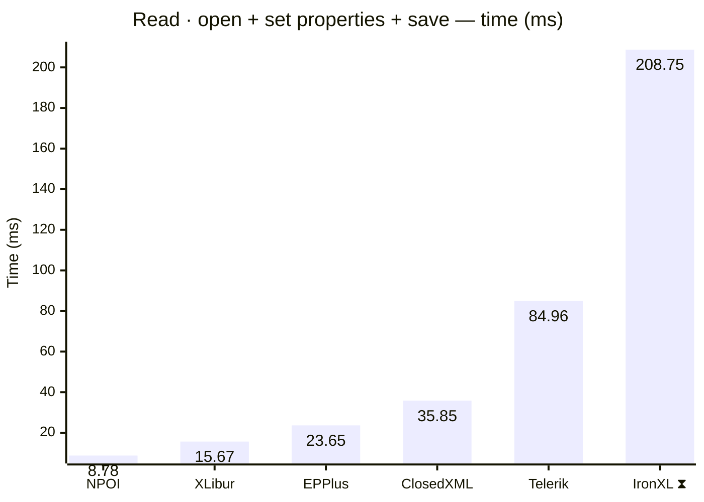
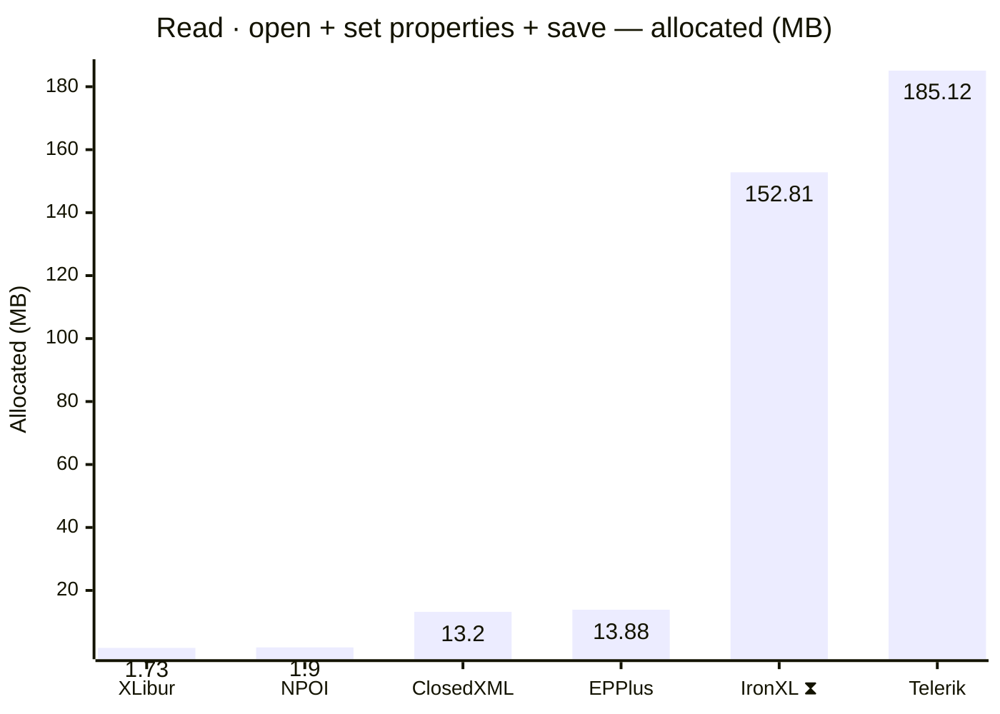
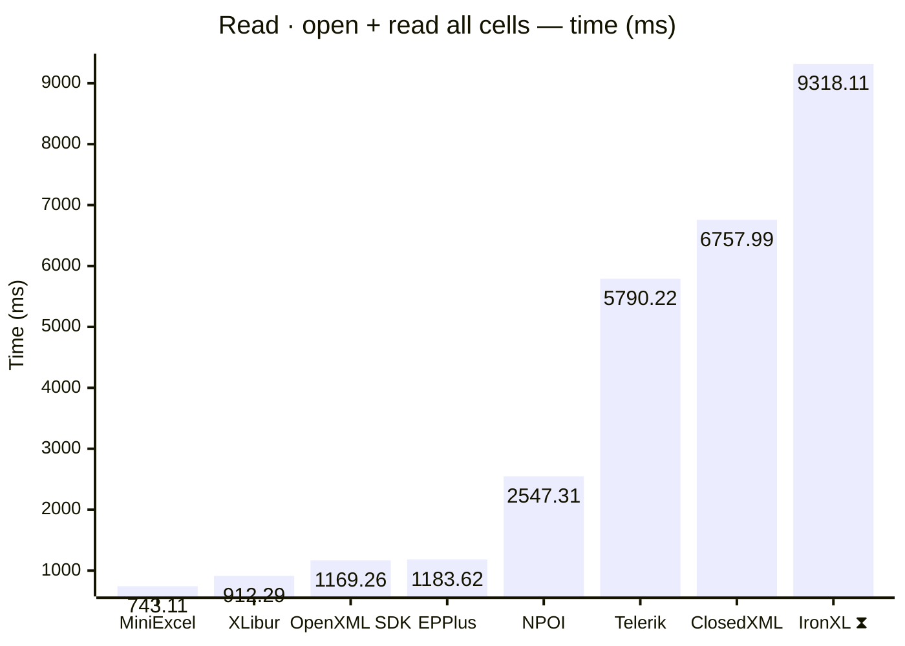
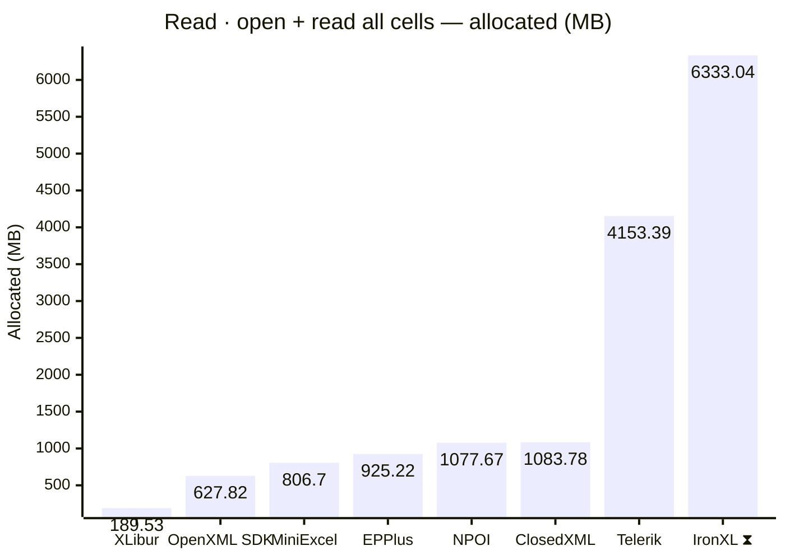
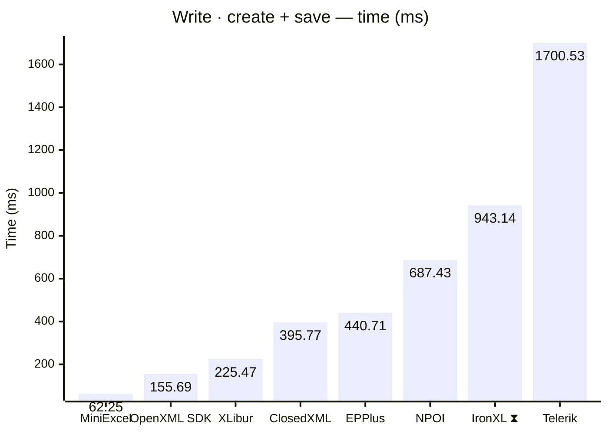
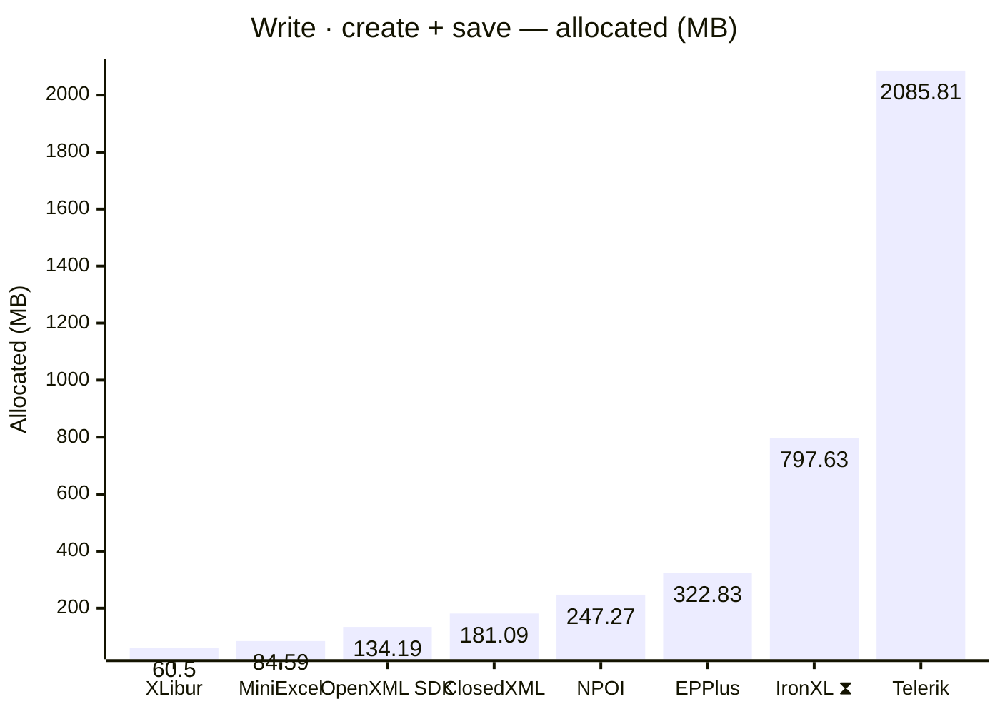
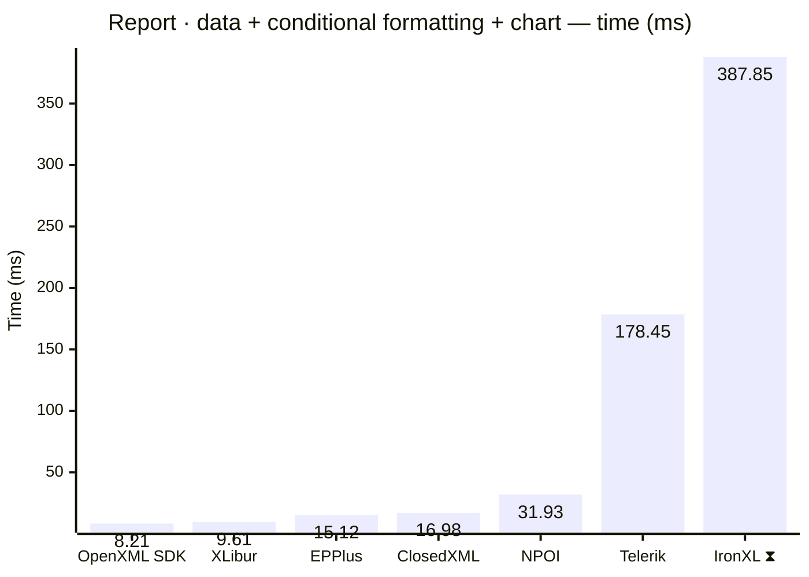
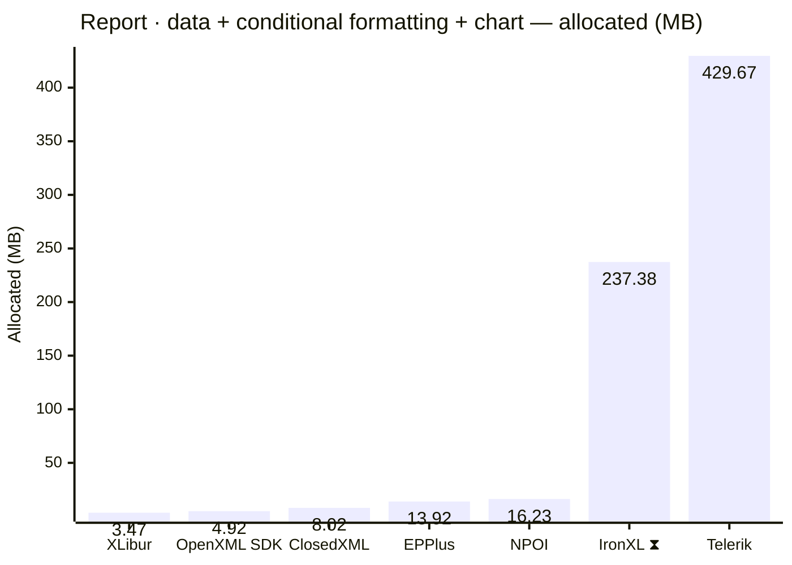
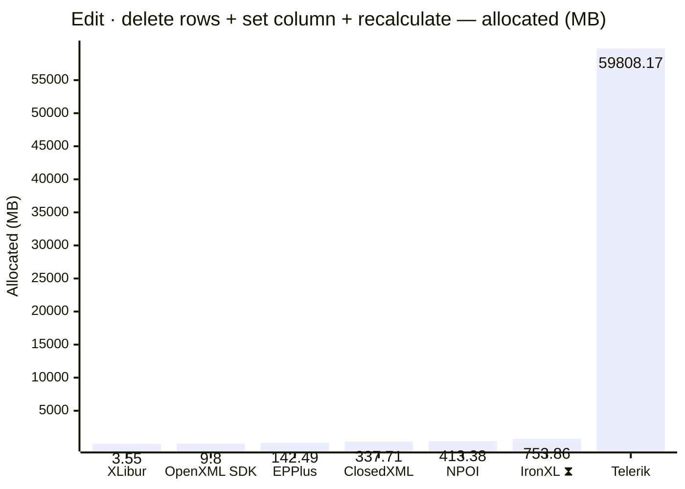
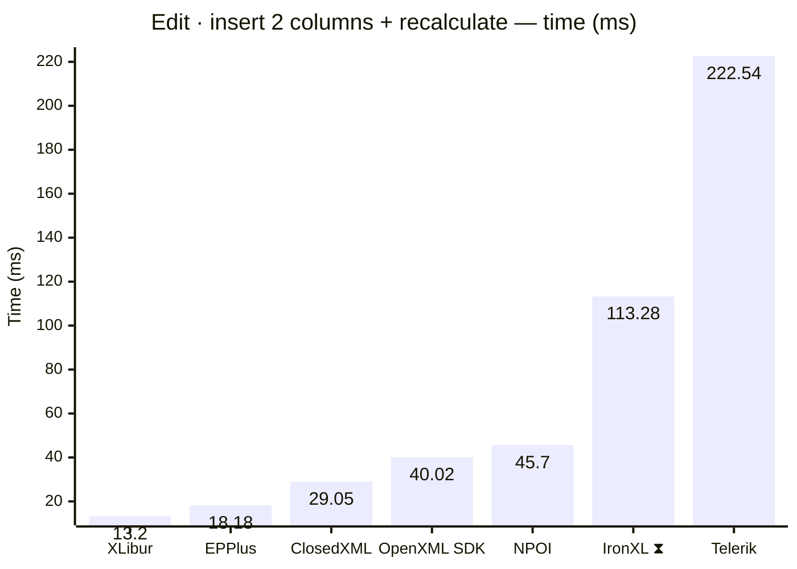

<style>
  .main-content { max-width: 90% !important; padding-left: 2rem !important; padding-right: 2rem !important; }
</style>
<!-- Generated by XLBench. Do not edit by hand; re-run scripts/run-benchmarks.ps1. -->
# XLBench Results

Each section below embeds the full BenchmarkDotNet environment block (OS, CPU,
.NET SDK and runtime). Timings are hardware-specific; treat the allocation/GC
columns as the most portable signal across machines. Regenerate locally with
`scripts/run-benchmarks.ps1`.

📈 **[Interactive charts](charts.html)** (GitHub Pages). Static charts and the full tables follow.

Each results table (one per test method) is heat-mapped independently on the Pages site (🟩 best → 🟥 worst).

> ⧗ **Carried over from an earlier run.** The rows and chart points below marked with this symbol were not measured here — the library is commercial and needs a licence key this run did not have — so they are replayed from `snapshots/`. Compare them as indicative rather than like-for-like, and see the repository README for how to refresh a snapshot.
>
> - **IronXL** 2026.8.1, Job-HTCPYF job, captured 2026-08-03 on same hardware as this run.

## Libraries under test

| Library | Version | Source |
| --- | --- | --- |
| ClosedXML | 0.105.1 | this run |
| EPPlus | 8.7.0 | this run |
| OpenXML SDK | 3.5.1 | this run |
| NPOI | 2.8.0 | this run |
| MiniExcel | 1.46.0 | this run |
| XLibur | 0.610.0 | this run |
| Telerik | 2026.3.826.100 | this run |
| IronXL ⧗ | 2026.8.1 | snapshot (2026.8.1, Job-HTCPYF, captured 2026-08-03) |

## Comparison charts

_Lower is better. Charts render in the GitHub file view; the Pages site has interactive versions._























## Detailed results


```

BenchmarkDotNet v0.15.8, Windows 11 (10.0.22631.6199/23H2/2023Update/SunValley3)
AMD Ryzen 9 5950X 3.40GHz, 1 CPU, 32 logical and 16 physical cores
.NET SDK 10.0.400
  [Host]     : .NET 10.0.12 (10.0.12, 10.0.1226.42308), X64 RyuJIT x86-64-v3
  Job-TKRGYV : .NET 10.0.12 (10.0.12, 10.0.1226.42308), X64 RyuJIT x86-64-v3

MaxIterationCount=30  MaxWarmupIterationCount=10  MinIterationCount=5  
MinWarmupIterationCount=3  

```

### Read · open + set properties + save

| Library     | Type                      | Method                      | Mean          | Error       | StdDev      | Gen0         | Gen1        | Gen2        | Allocated   |
|------------ |-------------------------- |---------------------------- |--------------:|------------:|------------:|-------------:|------------:|------------:|------------:|
| NPOI        | NpoiReadBenchmarks        | OpenAmendPropertiesAndSave  |      8.776 ms |   0.1102 ms |   0.0489 ms |      62.5000 |     31.2500 |           - |      1.9 MB |
| XLibur      | XLiburReadBenchmarks      | OpenAmendPropertiesAndSave  |     15.674 ms |   0.2926 ms |   0.2116 ms |      76.9231 |           - |           - |     1.73 MB |
| EPPlus      | EpPlusReadBenchmarks      | OpenAmendPropertiesAndSave  |     23.653 ms |   0.6600 ms |   0.9879 ms |    1000.0000 |   1000.0000 |   1000.0000 |    13.88 MB |
| ClosedXML   | ClosedXmlReadBenchmarks   | OpenAmendPropertiesAndSave  |     35.855 ms |   0.7321 ms |   0.9773 ms |     666.6667 |    333.3333 |           - |     13.2 MB |
| Telerik     | TelerikReadBenchmarks     | OpenAmendPropertiesAndSave  |     84.965 ms |   2.4066 ms |   3.3737 ms |   10666.6667 |   1000.0000 |    666.6667 |   185.12 MB |
| IronXL ⧗ | IronXlReadBenchmarks | OpenAmendPropertiesAndSave | 208.746 ms | 155.7570 ms | 92.6885 ms | 9000.0000 | 2000.0000 | - | 152.81 MB |

### Read · open + read all cells

| Library     | Type                      | Method                      | Mean          | Error       | StdDev      | Gen0         | Gen1        | Gen2        | Allocated   |
|------------ |-------------------------- |---------------------------- |--------------:|------------:|------------:|-------------:|------------:|------------:|------------:|
| MiniExcel   | MiniExcelReadBenchmarks   | OpenAndReadAll              |    743.115 ms |  16.8161 ms |  24.1172 ms |   50000.0000 |   3000.0000 |           - |    806.7 MB |
| XLibur      | XLiburReadBenchmarks      | OpenAndReadAll              |    912.287 ms |  16.2232 ms |   7.2032 ms |   13000.0000 |   8000.0000 |   2000.0000 |   189.53 MB |
| OpenXML SDK | OpenXmlReadBenchmarks     | OpenAndReadAll              |  1,169.257 ms |  19.8142 ms |  10.3632 ms |   40000.0000 |   6000.0000 |   1000.0000 |   627.82 MB |
| EPPlus      | EpPlusReadBenchmarks      | OpenAndReadAll              |  1,183.616 ms |  33.0599 ms |  49.4825 ms |   49000.0000 |  14000.0000 |   7000.0000 |   925.22 MB |
| NPOI        | NpoiReadBenchmarks        | OpenAndReadAll              |  2,547.305 ms |  50.0594 ms |  57.6485 ms |   68000.0000 |  62000.0000 |   6000.0000 |  1077.67 MB |
| Telerik     | TelerikReadBenchmarks     | OpenAndReadAll              |  5,790.222 ms | 175.0320 ms | 261.9796 ms |  252000.0000 |  53000.0000 |   6000.0000 |  4153.39 MB |
| ClosedXML   | ClosedXmlReadBenchmarks   | OpenAndReadAll              |  6,757.991 ms | 131.4553 ms | 161.4389 ms |   59000.0000 |  23000.0000 |   3000.0000 |  1083.78 MB |
| IronXL ⧗ | IronXlReadBenchmarks | OpenAndReadAll | 9,318.107 ms | 477.3336 ms | 315.7266 ms | 393000.0000 | 202000.0000 | 10000.0000 | 6333.04 MB |

### Write · create + save

| Library     | Type                      | Method                      | Mean          | Error       | StdDev      | Gen0         | Gen1        | Gen2        | Allocated   |
|------------ |-------------------------- |---------------------------- |--------------:|------------:|------------:|-------------:|------------:|------------:|------------:|
| MiniExcel   | MiniExcelWriteBenchmarks  | CreateAndSave               |     62.247 ms |   1.2325 ms |   1.6870 ms |    5111.1111 |   1222.2222 |   1111.1111 |    84.59 MB |
| OpenXML SDK | OpenXmlWriteBenchmarks    | CreateAndSave               |    155.694 ms |   2.9030 ms |   1.9201 ms |    8000.0000 |   2000.0000 |   2000.0000 |   134.19 MB |
| XLibur      | XLiburWriteBenchmarks     | CreateAndSave               |    225.472 ms |   4.2685 ms |   4.1922 ms |    3000.0000 |   2000.0000 |   2000.0000 |     60.5 MB |
| ClosedXML   | ClosedXmlWriteBenchmarks  | CreateAndSave               |    395.766 ms |   7.0990 ms |   3.1520 ms |   10000.0000 |   5000.0000 |   2000.0000 |   181.09 MB |
| EPPlus      | EpPlusWriteBenchmarks     | CreateAndSave               |    440.708 ms |   8.6173 ms |   8.4634 ms |   20000.0000 |   9000.0000 |   3000.0000 |   322.83 MB |
| NPOI        | NpoiWriteBenchmarks       | CreateAndSave               |    687.433 ms |  13.3775 ms |  15.4055 ms |   16000.0000 |  12000.0000 |   3000.0000 |   247.27 MB |
| IronXL ⧗ | IronXlWriteBenchmarks | CreateAndSave | 943.137 ms | 18.5191 ms | 11.0204 ms | 48000.0000 | 16000.0000 | 3000.0000 | 797.63 MB |
| Telerik     | TelerikWriteBenchmarks    | CreateAndSave               |  1,700.530 ms |  33.4791 ms |  41.1153 ms |  129000.0000 |  14000.0000 |   5000.0000 |  2085.81 MB |

### Report · data + conditional formatting + chart

| Library     | Type                      | Method                      | Mean          | Error       | StdDev      | Gen0         | Gen1        | Gen2        | Allocated   |
|------------ |-------------------------- |---------------------------- |--------------:|------------:|------------:|-------------:|------------:|------------:|------------:|
| OpenXML SDK | OpenXmlReportBenchmarks   | CreateStockReport           |      8.212 ms |   0.1590 ms |   0.0946 ms |     375.0000 |    359.3750 |    187.5000 |     4.92 MB |
| XLibur      | XLiburReportBenchmarks    | CreateStockReport           |      9.607 ms |   0.2787 ms |   0.4171 ms |     187.5000 |    187.5000 |    187.5000 |     3.47 MB |
| EPPlus      | EpPlusReportBenchmarks    | CreateStockReport           |     15.118 ms |   0.2679 ms |   0.0696 ms |    1000.0000 |   1000.0000 |   1000.0000 |    13.92 MB |
| ClosedXML   | ClosedXmlReportBenchmarks | CreateStockReport           |     16.975 ms |   0.3335 ms |   0.3707 ms |     468.7500 |    187.5000 |     31.2500 |     8.02 MB |
| NPOI        | NpoiReportBenchmarks      | CreateStockReport           |     31.933 ms |   0.6146 ms |   0.2729 ms |     875.0000 |    750.0000 |    375.0000 |    16.23 MB |
| Telerik     | TelerikReportBenchmarks   | CreateStockReport           |    178.448 ms |  37.2499 ms |  55.7539 ms |   27000.0000 |   6000.0000 |   2000.0000 |   429.67 MB |
| IronXL ⧗ | IronXlReportBenchmarks | CreateStockReport | 387.849 ms | 36.5456 ms | 24.1726 ms | 14000.0000 | 3000.0000 | - | 237.38 MB |

### Edit · delete rows + set column + recalculate

| Library     | Type                      | Method                      | Mean          | Error       | StdDev      | Gen0         | Gen1        | Gen2        | Allocated   |
|------------ |-------------------------- |---------------------------- |--------------:|------------:|------------:|-------------:|------------:|------------:|------------:|
| XLibur      | XLiburEditBenchmarks      | EditAndRecalculate          |     11.127 ms |   0.1298 ms |   0.0201 ms |     218.7500 |    109.3750 |           - |     3.55 MB |
| OpenXML SDK | OpenXmlEditBenchmarks     | EditAndRecalculate          |     26.069 ms |   0.4796 ms |   0.3172 ms |     718.7500 |    656.2500 |    156.2500 |      9.8 MB |
| EPPlus      | EpPlusEditBenchmarks      | EditAndRecalculate          |     87.258 ms |   1.7197 ms |   2.2958 ms |    9000.0000 |   1200.0000 |   1000.0000 |   142.49 MB |
| ClosedXML   | ClosedXmlEditBenchmarks   | EditAndRecalculate          |    346.029 ms |   6.6605 ms |   6.8399 ms |   21000.0000 |   1000.0000 |           - |   337.71 MB |
| NPOI        | NpoiEditBenchmarks        | EditAndRecalculate          |    398.959 ms |   7.2245 ms |   2.5763 ms |   25000.0000 |   1000.0000 |           - |   413.38 MB |
| IronXL ⧗ | IronXlEditBenchmarks | EditAndRecalculate | 1,577.273 ms | 62.9583 ms | 41.6430 ms | 57000.0000 | 36000.0000 | 15000.0000 | 753.86 MB |
| Telerik     | TelerikEditBenchmarks     | EditAndRecalculate          | 30,771.488 ms | 594.1358 ms | 353.5607 ms | 3751000.0000 | 312000.0000 | 145000.0000 | 59808.17 MB |

### Edit · insert 2 columns + recalculate

| Library     | Type                      | Method                      | Mean          | Error       | StdDev      | Gen0         | Gen1        | Gen2        | Allocated   |
|------------ |-------------------------- |---------------------------- |--------------:|------------:|------------:|-------------:|------------:|------------:|------------:|
| XLibur      | XLiburInsertBenchmarks    | InsertColumnsAndRecalculate |     13.195 ms |   0.2531 ms |   0.3013 ms |     218.7500 |     93.7500 |           - |     3.87 MB |
| EPPlus      | EpPlusInsertBenchmarks    | InsertColumnsAndRecalculate |     18.185 ms |   0.6356 ms |   0.8700 ms |    1000.0000 |   1000.0000 |   1000.0000 |    11.41 MB |
| ClosedXML   | ClosedXmlInsertBenchmarks | InsertColumnsAndRecalculate |     29.046 ms |   1.1864 ms |   1.7391 ms |     750.0000 |    250.0000 |           - |    13.64 MB |
| OpenXML SDK | OpenXmlInsertBenchmarks   | InsertColumnsAndRecalculate |     40.019 ms |   1.3324 ms |   1.9530 ms |    1000.0000 |    666.6667 |    333.3333 |    13.09 MB |
| NPOI        | NpoiInsertBenchmarks      | InsertColumnsAndRecalculate |     45.696 ms |   3.3244 ms |   4.8729 ms |    2000.0000 |   1500.0000 |    500.0000 |    30.77 MB |
| IronXL ⧗ | IronXlInsertBenchmarks | InsertColumnsAndRecalculate | 113.284 ms | 41.9750 ms | 27.7638 ms | 7000.0000 | 2500.0000 | 750.0000 | 104.88 MB |
| Telerik     | TelerikInsertBenchmarks   | InsertColumnsAndRecalculate |    222.535 ms |   8.7366 ms |  12.5297 ms |   21000.0000 |   6000.0000 |   2000.0000 |   345.16 MB |


<script type="module">
  import mermaid from 'https://cdn.jsdelivr.net/npm/mermaid@11/dist/mermaid.esm.min.mjs';
  const blocks = document.querySelectorAll('.language-mermaid');
  blocks.forEach(el => {
    const code = el.querySelector('code') || el;
    const pre = document.createElement('pre');
    pre.className = 'mermaid';
    pre.textContent = code.textContent;
    el.replaceWith(pre);
  });
  if (blocks.length) {
    mermaid.initialize({ startOnLoad: false });
    await mermaid.run({ querySelector: 'pre.mermaid' });
  }
</script>

<script>
(function () {
  const parse = s => { const n = parseFloat(String(s).replace(/,/g, '')); return Number.isFinite(n) ? n : null; };
  document.querySelectorAll('table').forEach(table => {
    if (!table.tHead || !table.tBodies[0]) return;
    const heads = [...table.tHead.rows[0].cells].map(c => c.textContent.trim().toLowerCase());
    if (!heads.includes('mean')) return;
    const metricCols = heads.map((h, i) => /^(mean|allocated|gen0|gen1|gen2)$/.test(h) ? i : -1).filter(i => i >= 0);
    const rows = [...table.tBodies[0].rows];
    for (const c of metricCols) {
      const vals = rows.map(r => parse(r.cells[c]?.textContent));
      const nums = vals.filter(v => v !== null);
      if (nums.length < 2) continue;
      const min = Math.min(...nums), max = Math.max(...nums);
      if (max === min) continue;
      rows.forEach((r, i) => {
        const v = vals[i]; if (v === null) return;
        const ratio = (v - min) / (max - min);
        r.cells[c].style.backgroundColor = `hsla(${120 - 120 * ratio}, 70%, 50%, 0.45)`;
      });
    }
  });
})();
</script>
