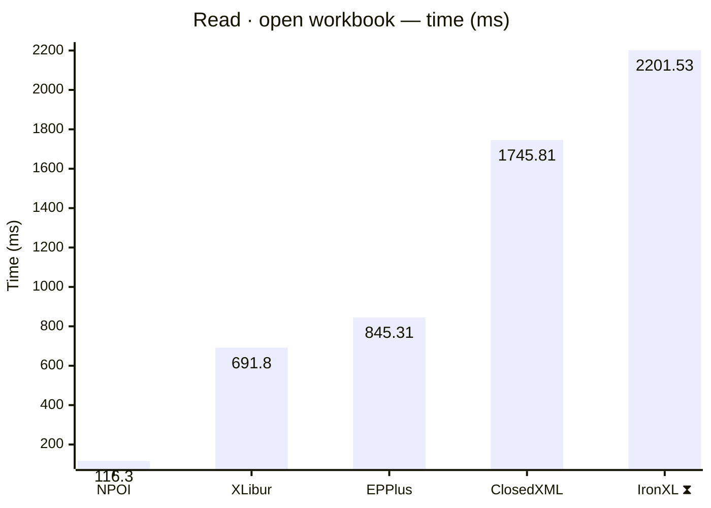
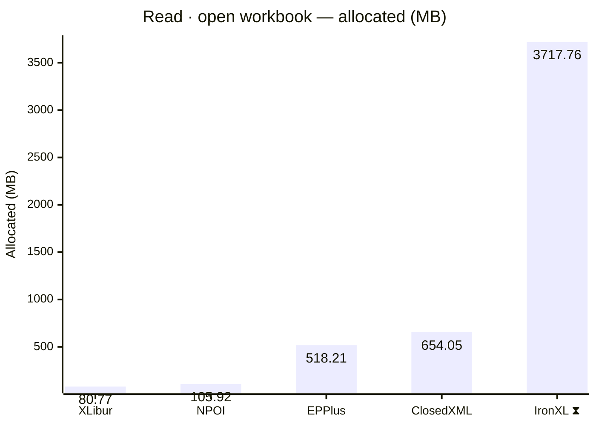
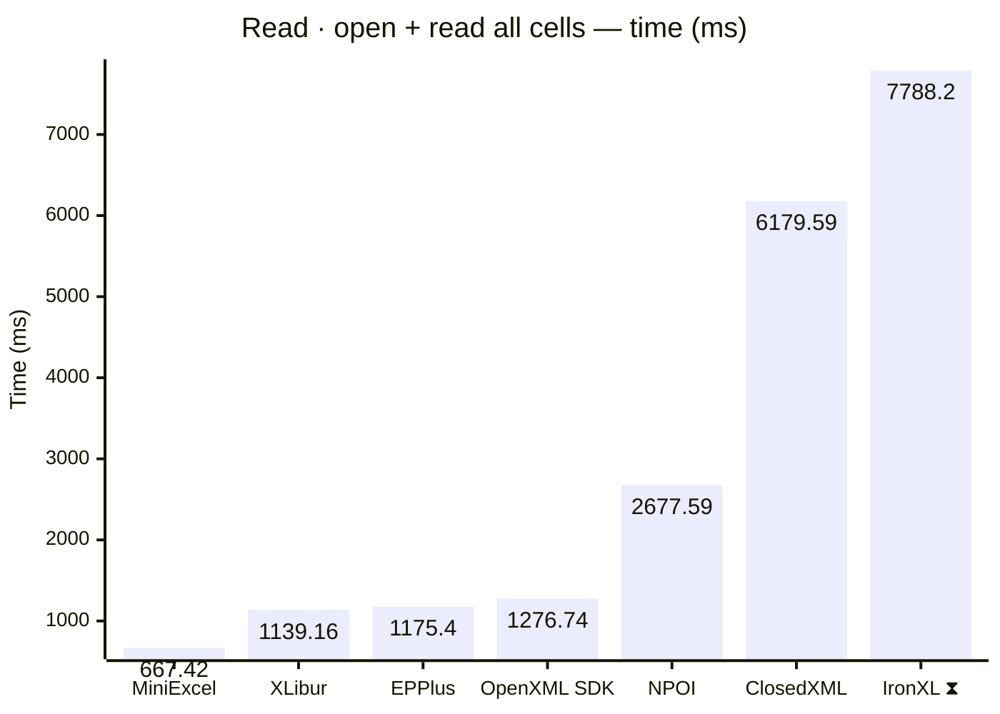
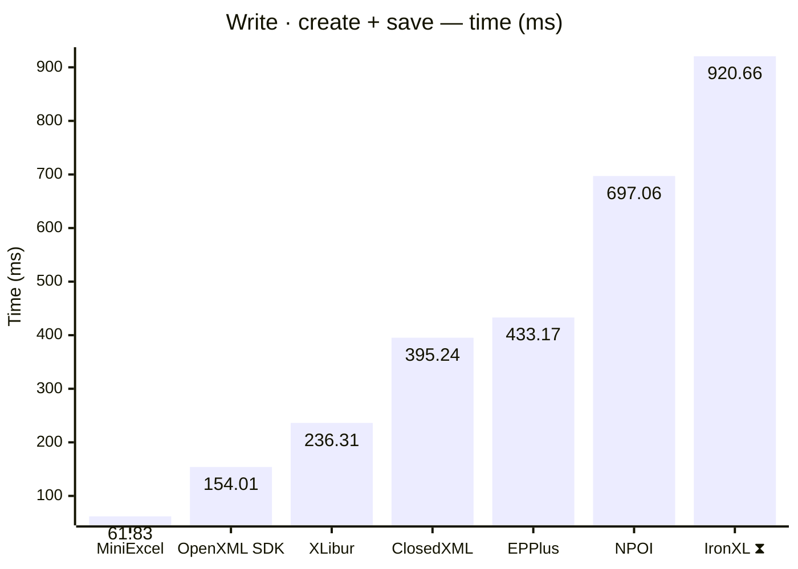
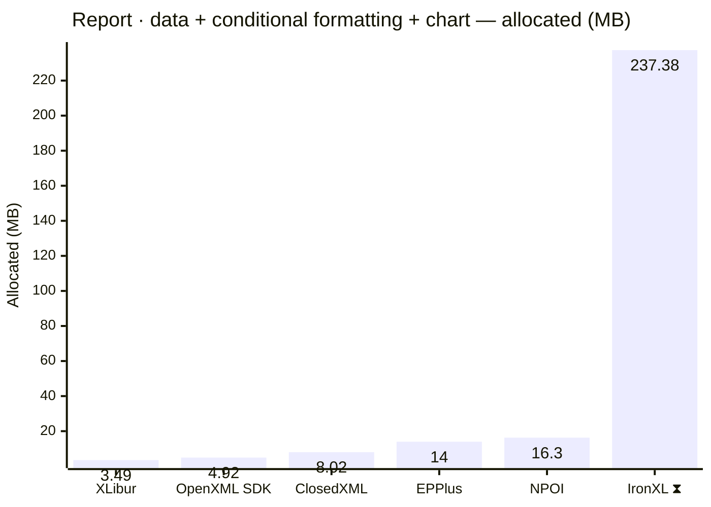
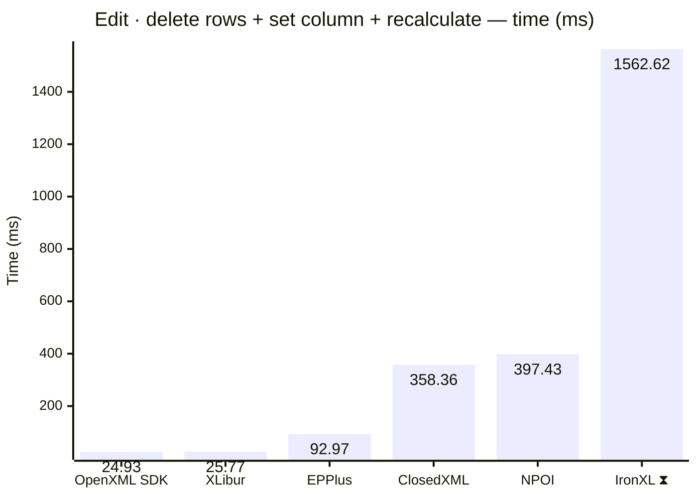

<style>
  .main-content { max-width: 90% !important; padding-left: 2rem !important; padding-right: 2rem !important; }
</style>
<!-- Generated by XLBench. Do not edit by hand; re-run scripts/run-benchmarks.ps1. -->
# XLBench Results

Each section below embeds the full BenchmarkDotNet environment block (OS, CPU,
.NET SDK and runtime). Timings are hardware-specific; treat the allocation/GC
columns as the most portable signal across machines. Regenerate locally with
`scripts/run-benchmarks.ps1`.

📈 **[Interactive charts](charts.html)** (GitHub Pages). Static charts and the full tables follow.

Each results table (one per test method) is heat-mapped independently on the Pages site (🟩 best → 🟥 worst).

> ⧗ **Carried over from an earlier run.** The rows and chart points below marked with this symbol were not measured here — the library is commercial and needs a licence key this run did not have — so they are replayed from `snapshots/`. Compare them as indicative rather than like-for-like, and see the repository README for how to refresh a snapshot.
>
> - **IronXL** 2026.8.1, Job-HTCPYF job, captured 2026-08-01 on same hardware as this run.

## Libraries under test

| Library | Version | Source |
| --- | --- | --- |
| ClosedXML | 0.105.1 | this run |
| EPPlus | 8.6.3 | this run |
| OpenXML SDK | 3.5.1 | this run |
| NPOI | 2.8.0 | this run |
| MiniExcel | 1.45.0 | this run |
| XLibur | 0.300.0 | this run |
| IronXL ⧗ | 2026.8.1 | snapshot (2026.8.1, Job-HTCPYF, captured 2026-08-01) |

## Comparison charts

_Lower is better. Charts render in the GitHub file view; the Pages site has interactive versions._
















## Detailed results


```

BenchmarkDotNet v0.15.8, Windows 11 (10.0.22631.6199/23H2/2023Update/SunValley3)
AMD Ryzen 9 5950X 3.40GHz, 1 CPU, 32 logical and 16 physical cores
.NET SDK 10.0.302
  [Host]     : .NET 10.0.10 (10.0.10, 10.0.1026.32716), X64 RyuJIT x86-64-v3
  Job-HTCPYF : .NET 10.0.10 (10.0.10, 10.0.1026.32716), X64 RyuJIT x86-64-v3

MaxIterationCount=10  MaxWarmupIterationCount=3  MinIterationCount=5  
MinWarmupIterationCount=1  

```

### Read · open workbook

| Library     | Type                      | Method             | Mean         | Error       | StdDev      | Gen0       | Gen1       | Gen2      | Allocated  |
|------------ |-------------------------- |------------------- |-------------:|------------:|------------:|-----------:|-----------:|----------:|-----------:|
| NPOI        | NpoiReadBenchmarks        | OpenWorkbook       |   116.298 ms |   8.5403 ms |   5.6489 ms |  1500.0000 |  1000.0000 |  500.0000 |  105.92 MB |
| XLibur      | XLiburReadBenchmarks      | OpenWorkbook       |   691.797 ms |  41.1305 ms |  27.2053 ms |  5000.0000 |  4000.0000 | 1000.0000 |   80.77 MB |
| EPPlus      | EpPlusReadBenchmarks      | OpenWorkbook       |   845.311 ms |  32.0898 ms |  19.0961 ms | 23000.0000 | 11000.0000 | 6000.0000 |  518.21 MB |
| ClosedXML   | ClosedXmlReadBenchmarks   | OpenWorkbook       | 1,745.814 ms | 110.6663 ms |  73.1989 ms | 41000.0000 | 14000.0000 | 2000.0000 |  654.05 MB |
| IronXL ⧗ | IronXlReadBenchmarks | OpenWorkbook | 2,201.535 ms | 37.5704 ms | 16.6815 ms | 235000.0000 | 67000.0000 | 7000.0000 | 3717.76 MB |

### Read · open + read all cells

| Library     | Type                      | Method             | Mean         | Error       | StdDev      | Gen0       | Gen1       | Gen2      | Allocated  |
|------------ |-------------------------- |------------------- |-------------:|------------:|------------:|-----------:|-----------:|----------:|-----------:|
| MiniExcel   | MiniExcelReadBenchmarks   | OpenAndReadAll     |   667.416 ms |  11.8354 ms |   5.2550 ms | 39000.0000 |  4000.0000 | 1000.0000 |   629.7 MB |
| XLibur      | XLiburReadBenchmarks      | OpenAndReadAll     | 1,139.163 ms |  34.0903 ms |  22.5486 ms | 15000.0000 | 12000.0000 | 3000.0000 |  320.43 MB |
| EPPlus      | EpPlusReadBenchmarks      | OpenAndReadAll     | 1,175.396 ms |  48.0977 ms |  31.8137 ms | 49000.0000 | 14000.0000 | 7000.0000 |  925.22 MB |
| OpenXML SDK | OpenXmlReadBenchmarks     | OpenAndReadAll     | 1,276.739 ms |  60.4714 ms |  39.9981 ms | 40000.0000 |  6000.0000 | 1000.0000 |  628.84 MB |
| NPOI        | NpoiReadBenchmarks        | OpenAndReadAll     | 2,677.591 ms | 194.7111 ms | 128.7893 ms | 68000.0000 | 62000.0000 | 6000.0000 |  1077.8 MB |
| ClosedXML   | ClosedXmlReadBenchmarks   | OpenAndReadAll     | 6,179.594 ms | 139.3935 ms |  82.9508 ms | 59000.0000 | 23000.0000 | 3000.0000 | 1083.14 MB |
| IronXL ⧗ | IronXlReadBenchmarks | OpenAndReadAll | 7,788.195 ms | 256.7315 ms | 169.8120 ms | 393000.0000 | 202000.0000 | 10000.0000 | 6333.03 MB |

### Write · create + save

| Library     | Type                      | Method             | Mean         | Error       | StdDev      | Gen0       | Gen1       | Gen2      | Allocated  |
|------------ |-------------------------- |------------------- |-------------:|------------:|------------:|-----------:|-----------:|----------:|-----------:|
| MiniExcel   | MiniExcelWriteBenchmarks  | CreateAndSave      |    61.831 ms |   3.6165 ms |   2.3921 ms |  5333.3333 |  1444.4444 | 1333.3333 |   84.59 MB |
| OpenXML SDK | OpenXmlWriteBenchmarks    | CreateAndSave      |   154.010 ms |   2.8327 ms |   1.4816 ms |  8000.0000 |  2000.0000 | 2000.0000 |  134.19 MB |
| XLibur      | XLiburWriteBenchmarks     | CreateAndSave      |   236.308 ms |  10.6335 ms |   7.0334 ms |  3000.0000 |  2000.0000 | 2000.0000 |   60.52 MB |
| ClosedXML   | ClosedXmlWriteBenchmarks  | CreateAndSave      |   395.244 ms |  17.4932 ms |  11.5707 ms | 10000.0000 |  5000.0000 | 2000.0000 |  181.09 MB |
| EPPlus      | EpPlusWriteBenchmarks     | CreateAndSave      |   433.166 ms |   9.6436 ms |   5.7388 ms | 20000.0000 |  9000.0000 | 3000.0000 |   322.9 MB |
| NPOI        | NpoiWriteBenchmarks       | CreateAndSave      |   697.061 ms |  31.2969 ms |  18.6243 ms | 16000.0000 | 12000.0000 | 3000.0000 |  247.52 MB |
| IronXL ⧗ | IronXlWriteBenchmarks | CreateAndSave | 920.655 ms | 65.9367 ms | 43.6131 ms | 48000.0000 | 16000.0000 | 3000.0000 | 797.63 MB |

### Report · data + conditional formatting + chart

| Library     | Type                      | Method             | Mean         | Error       | StdDev      | Gen0       | Gen1       | Gen2      | Allocated  |
|------------ |-------------------------- |------------------- |-------------:|------------:|------------:|-----------:|-----------:|----------:|-----------:|
| OpenXML SDK | OpenXmlReportBenchmarks   | CreateStockReport  |     8.427 ms |   0.3322 ms |   0.2197 ms |   375.0000 |   359.3750 |  187.5000 |    4.92 MB |
| XLibur      | XLiburReportBenchmarks    | CreateStockReport  |     9.358 ms |   0.4123 ms |   0.2727 ms |   187.5000 |   187.5000 |  187.5000 |    3.49 MB |
| EPPlus      | EpPlusReportBenchmarks    | CreateStockReport  |    16.774 ms |   2.4681 ms |   1.4687 ms |  1000.0000 |  1000.0000 | 1000.0000 |      14 MB |
| ClosedXML   | ClosedXmlReportBenchmarks | CreateStockReport  |    17.148 ms |   0.3372 ms |   0.0522 ms |   468.7500 |   187.5000 |   31.2500 |    8.02 MB |
| NPOI        | NpoiReportBenchmarks      | CreateStockReport  |    33.110 ms |   2.8209 ms |   1.4754 ms |   875.0000 |   750.0000 |  375.0000 |    16.3 MB |
| IronXL ⧗ | IronXlReportBenchmarks | CreateStockReport | 374.579 ms | 38.1427 ms | 19.9494 ms | 14000.0000 | 3000.0000 | - | 237.38 MB |

### Edit · delete rows + set column + recalculate

| Library     | Type                      | Method             | Mean         | Error       | StdDev      | Gen0       | Gen1       | Gen2      | Allocated  |
|------------ |-------------------------- |------------------- |-------------:|------------:|------------:|-----------:|-----------:|----------:|-----------:|
| OpenXML SDK | OpenXmlEditBenchmarks     | EditAndRecalculate |    24.926 ms |   0.3122 ms |   0.0483 ms |   687.5000 |   593.7500 |  156.2500 |    9.83 MB |
| XLibur      | XLiburEditBenchmarks      | EditAndRecalculate |    25.767 ms |  16.5686 ms |  10.9591 ms |   222.2222 |   111.1111 |         - |    4.39 MB |
| EPPlus      | EpPlusEditBenchmarks      | EditAndRecalculate |    92.968 ms |   7.9370 ms |   5.2498 ms |  9000.0000 |  1200.0000 | 1000.0000 |  142.49 MB |
| ClosedXML   | ClosedXmlEditBenchmarks   | EditAndRecalculate |   358.363 ms |  16.0072 ms |   9.5256 ms | 21000.0000 |  1000.0000 |         - |  337.78 MB |
| NPOI        | NpoiEditBenchmarks        | EditAndRecalculate |   397.428 ms |  11.2053 ms |   6.6681 ms | 25000.0000 |  1000.0000 |         - |  413.44 MB |
| IronXL ⧗ | IronXlEditBenchmarks | EditAndRecalculate | 1,562.616 ms | 46.5205 ms | 27.6836 ms | 57000.0000 | 36000.0000 | 15000.0000 | 753.86 MB |


<script type="module">
  import mermaid from 'https://cdn.jsdelivr.net/npm/mermaid@11/dist/mermaid.esm.min.mjs';
  const blocks = document.querySelectorAll('.language-mermaid');
  blocks.forEach(el => {
    const code = el.querySelector('code') || el;
    const pre = document.createElement('pre');
    pre.className = 'mermaid';
    pre.textContent = code.textContent;
    el.replaceWith(pre);
  });
  if (blocks.length) {
    mermaid.initialize({ startOnLoad: false });
    await mermaid.run({ querySelector: 'pre.mermaid' });
  }
</script>

<script>
(function () {
  const parse = s => { const n = parseFloat(String(s).replace(/,/g, '')); return Number.isFinite(n) ? n : null; };
  document.querySelectorAll('table').forEach(table => {
    if (!table.tHead || !table.tBodies[0]) return;
    const heads = [...table.tHead.rows[0].cells].map(c => c.textContent.trim().toLowerCase());
    if (!heads.includes('mean')) return;
    const metricCols = heads.map((h, i) => /^(mean|allocated|gen0|gen1|gen2)$/.test(h) ? i : -1).filter(i => i >= 0);
    const rows = [...table.tBodies[0].rows];
    for (const c of metricCols) {
      const vals = rows.map(r => parse(r.cells[c]?.textContent));
      const nums = vals.filter(v => v !== null);
      if (nums.length < 2) continue;
      const min = Math.min(...nums), max = Math.max(...nums);
      if (max === min) continue;
      rows.forEach((r, i) => {
        const v = vals[i]; if (v === null) return;
        const ratio = (v - min) / (max - min);
        r.cells[c].style.backgroundColor = `hsla(${120 - 120 * ratio}, 70%, 50%, 0.45)`;
      });
    }
  });
})();
</script>
