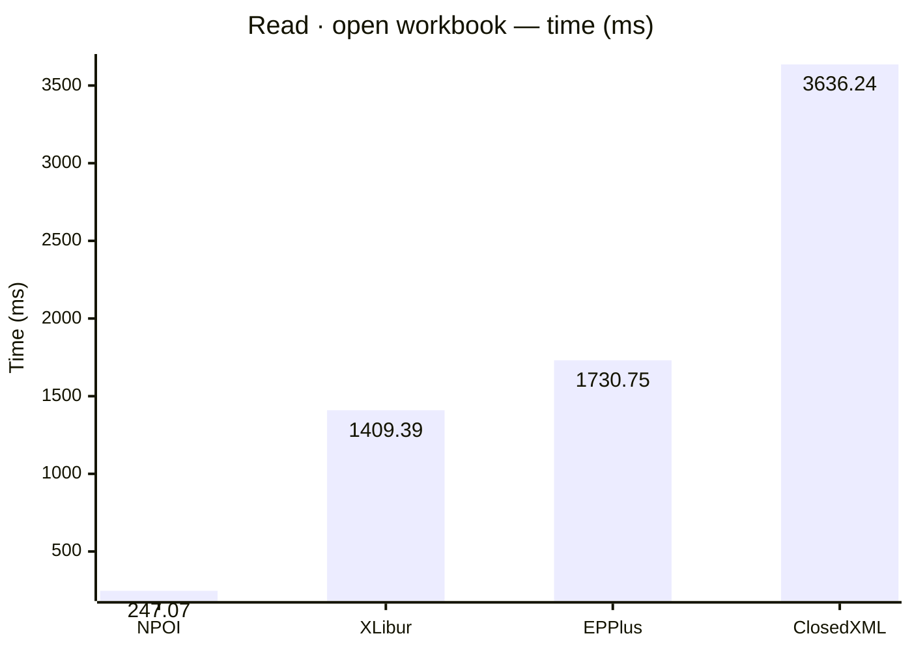
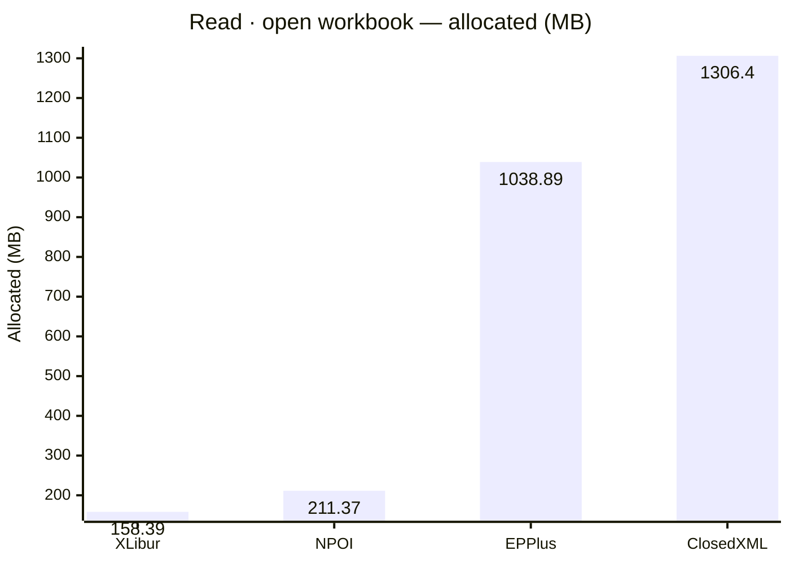
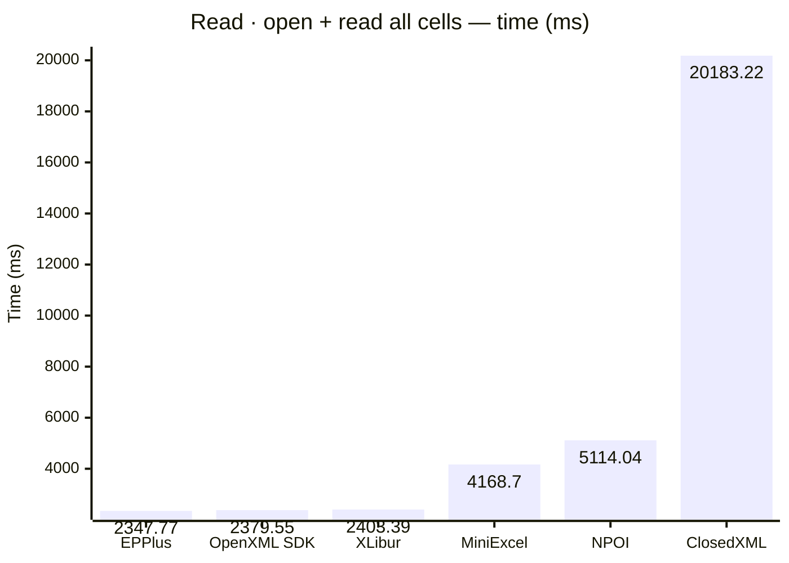
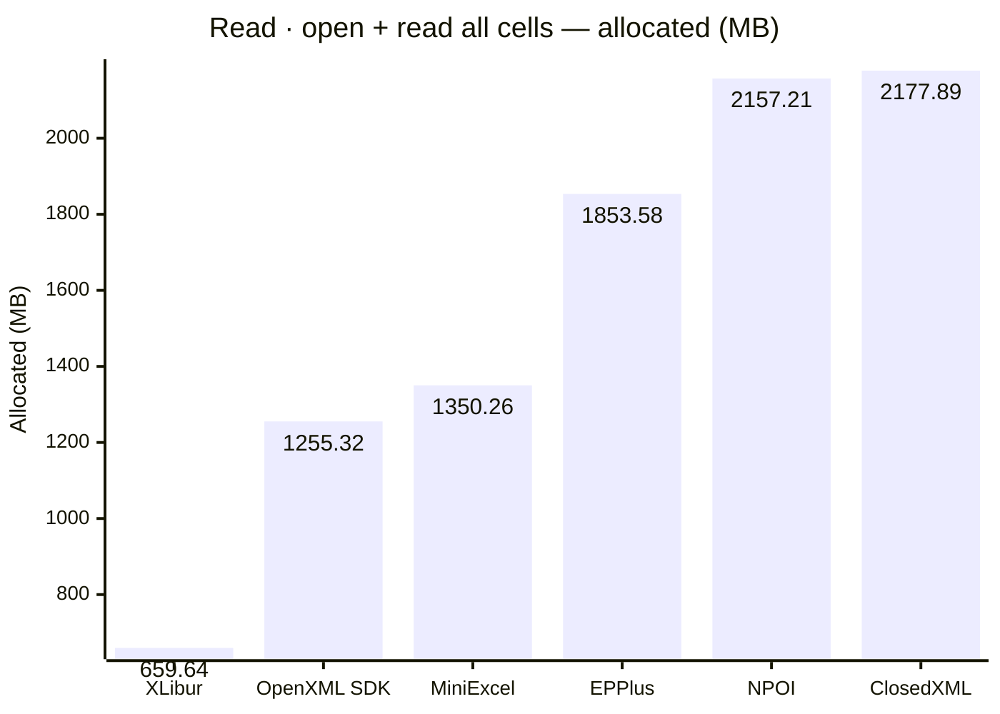
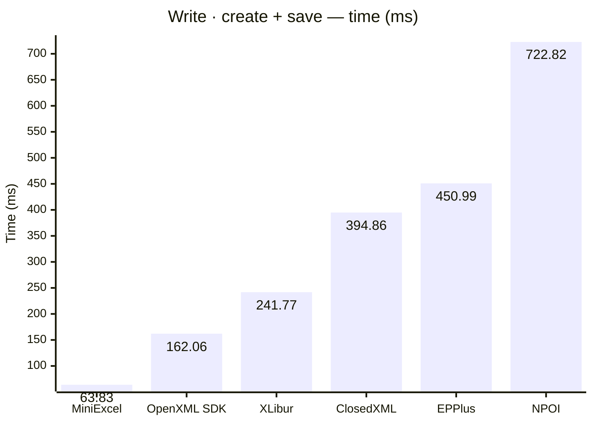
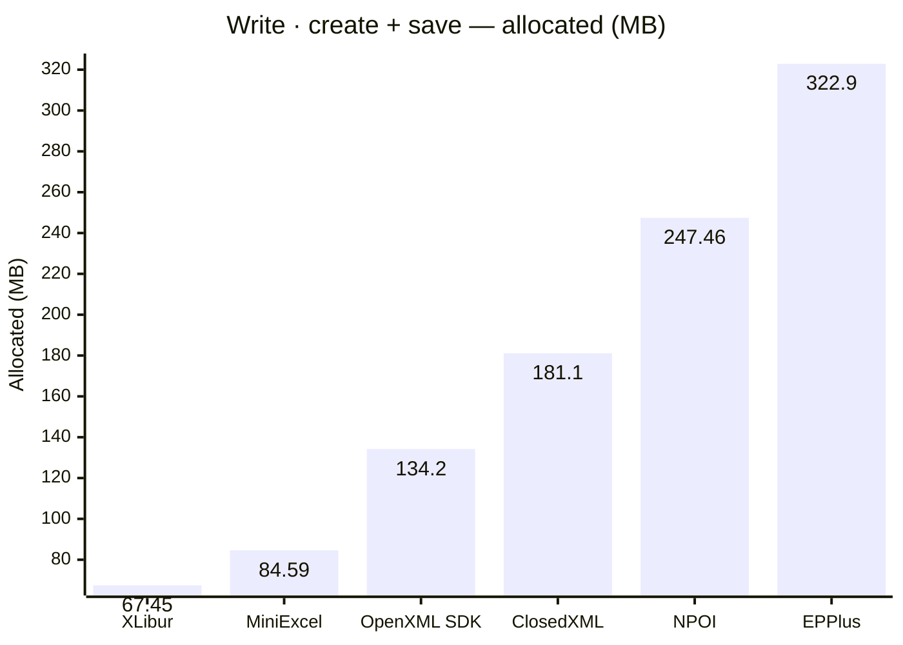
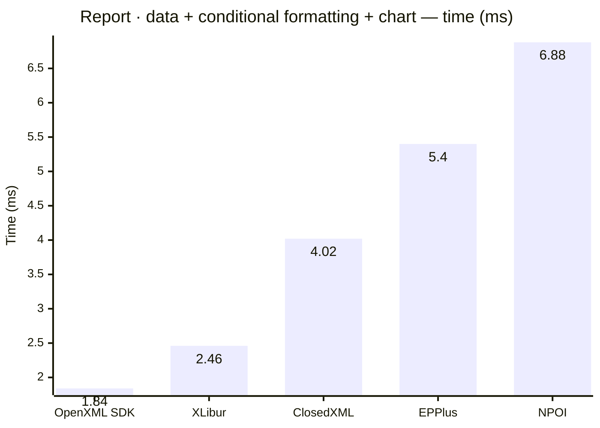
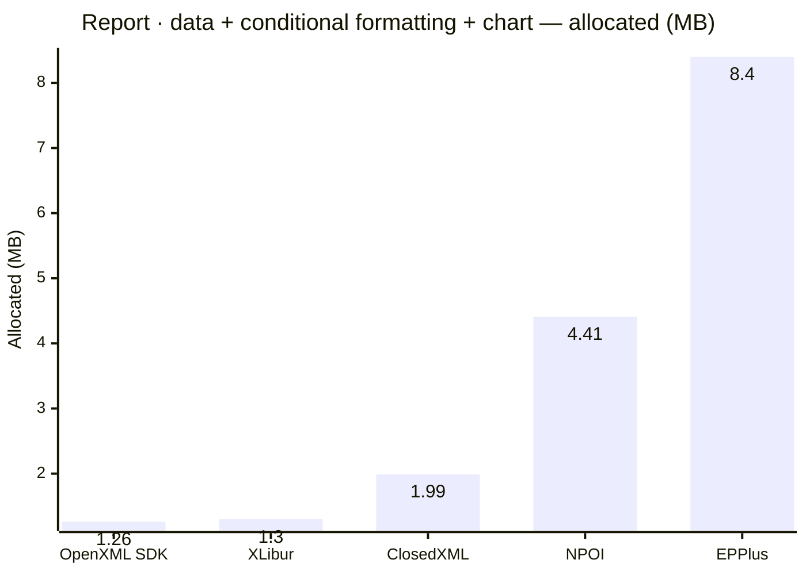

<style>
  .main-content { max-width: 90% !important; padding-left: 2rem !important; padding-right: 2rem !important; }
</style>
<!-- Generated by XLBench. Do not edit by hand; re-run scripts/run-benchmarks.ps1. -->
# XLBench Results

Each section below embeds the full BenchmarkDotNet environment block (OS, CPU,
.NET SDK and runtime). Timings are hardware-specific; treat the allocation/GC
columns as the most portable signal across machines. Regenerate locally with
`scripts/run-benchmarks.ps1`.

📈 **[Interactive charts](charts.html)** (GitHub Pages). Static charts and the full tables follow.

Each results table (one per test method) is heat-mapped independently on the Pages site (🟩 best → 🟥 worst).

## Libraries under test

| Library | Version |
| --- | --- |
| ClosedXML | 0.105.0 |
| EPPlus | 8.6.3 |
| OpenXML SDK | 3.5.1 |
| NPOI | 2.8.0 |
| MiniExcel | 1.45.0 |
| XLibur | 0.106.1-beta.80 |

## Comparison charts

_Lower is better. Charts render in the GitHub file view; the Pages site has interactive versions._

















## Detailed results


```

BenchmarkDotNet v0.15.8, Windows 11 (10.0.22631.6199/23H2/2023Update/SunValley3)
AMD Ryzen 9 5950X 3.40GHz, 1 CPU, 32 logical and 16 physical cores
.NET SDK 10.0.302
  [Host]     : .NET 10.0.10 (10.0.10, 10.0.1026.32716), X64 RyuJIT x86-64-v3
  DefaultJob : .NET 10.0.10 (10.0.10, 10.0.1026.32716), X64 RyuJIT x86-64-v3


```

### Read · open workbook

| Library     | Type                      | Method            | Mean          | Error       | StdDev      | Gen0        | Gen1        | Gen2      | Allocated  |
|------------ |-------------------------- |------------------ |--------------:|------------:|------------:|------------:|------------:|----------:|-----------:|
| NPOI        | NpoiReadBenchmarks        | OpenWorkbook      |    247.070 ms |   4.8980 ms |  10.2240 ms |   4000.0000 |   3500.0000 | 1500.0000 |  211.37 MB |
| XLibur      | XLiburReadBenchmarks      | OpenWorkbook      |  1,409.394 ms |  25.2128 ms |  23.5841 ms |  10000.0000 |   8000.0000 | 2000.0000 |  158.39 MB |
| EPPlus      | EpPlusReadBenchmarks      | OpenWorkbook      |  1,730.752 ms |  27.0050 ms |  23.9392 ms |  41000.0000 |  17000.0000 | 7000.0000 | 1038.89 MB |
| ClosedXML   | ClosedXmlReadBenchmarks   | OpenWorkbook      |  3,636.236 ms |  72.3922 ms |  67.7157 ms |  81000.0000 |  27000.0000 | 3000.0000 |  1306.4 MB |

### Read · open + read all cells

| Library     | Type                      | Method            | Mean          | Error       | StdDev      | Gen0        | Gen1        | Gen2      | Allocated  |
|------------ |-------------------------- |------------------ |--------------:|------------:|------------:|------------:|------------:|----------:|-----------:|
| EPPlus      | EpPlusReadBenchmarks      | OpenAndReadAll    |  2,347.772 ms |  46.8995 ms |  46.0615 ms |  92000.0000 |  18000.0000 | 7000.0000 | 1853.58 MB |
| OpenXML SDK | OpenXmlReadBenchmarks     | OpenAndReadAll    |  2,379.553 ms |  40.2750 ms |  35.7028 ms |  80000.0000 |  10000.0000 | 2000.0000 | 1255.32 MB |
| XLibur      | XLiburReadBenchmarks      | OpenAndReadAll    |  2,403.392 ms |  47.9026 ms |  75.9786 ms |  29000.0000 |  19000.0000 | 4000.0000 |  659.64 MB |
| MiniExcel   | MiniExcelReadBenchmarks   | OpenAndReadAll    |  4,168.701 ms |  79.1201 ms |  91.1148 ms |  84000.0000 |   1000.0000 |         - | 1350.26 MB |
| NPOI        | NpoiReadBenchmarks        | OpenAndReadAll    |  5,114.035 ms |  43.1943 ms |  38.2906 ms | 131000.0000 | 121000.0000 | 8000.0000 | 2157.21 MB |
| ClosedXML   | ClosedXmlReadBenchmarks   | OpenAndReadAll    | 20,183.216 ms | 324.6540 ms | 287.7973 ms | 117000.0000 |  44000.0000 | 4000.0000 | 2177.89 MB |

### Write · create + save

| Library     | Type                      | Method            | Mean          | Error       | StdDev      | Gen0        | Gen1        | Gen2      | Allocated  |
|------------ |-------------------------- |------------------ |--------------:|------------:|------------:|------------:|------------:|----------:|-----------:|
| MiniExcel   | MiniExcelWriteBenchmarks  | CreateAndSave     |     63.829 ms |   1.2743 ms |   2.4552 ms |   5666.6667 |   1777.7778 | 1666.6667 |   84.59 MB |
| OpenXML SDK | OpenXmlWriteBenchmarks    | CreateAndSave     |    162.056 ms |   3.1784 ms |   3.2639 ms |   9000.0000 |   2333.3333 | 2333.3333 |   134.2 MB |
| XLibur      | XLiburWriteBenchmarks     | CreateAndSave     |    241.772 ms |   3.4243 ms |   3.0355 ms |   3000.0000 |   2000.0000 | 2000.0000 |   67.45 MB |
| ClosedXML   | ClosedXmlWriteBenchmarks  | CreateAndSave     |    394.860 ms |   7.7342 ms |  11.8110 ms |  10000.0000 |   5000.0000 | 2000.0000 |   181.1 MB |
| EPPlus      | EpPlusWriteBenchmarks     | CreateAndSave     |    450.986 ms |   8.9583 ms |   9.1995 ms |  20000.0000 |   9000.0000 | 3000.0000 |   322.9 MB |
| NPOI        | NpoiWriteBenchmarks       | CreateAndSave     |    722.819 ms |  14.1558 ms |  16.3018 ms |  16000.0000 |  12000.0000 | 3000.0000 |  247.46 MB |

### Report · data + conditional formatting + chart

| Library     | Type                      | Method            | Mean          | Error       | StdDev      | Gen0        | Gen1        | Gen2      | Allocated  |
|------------ |-------------------------- |------------------ |--------------:|------------:|------------:|------------:|------------:|----------:|-----------:|
| OpenXML SDK | OpenXmlReportBenchmarks   | CreateStockReport |      1.842 ms |   0.0353 ms |   0.0362 ms |     89.8438 |     58.5938 |   27.3438 |    1.26 MB |
| XLibur      | XLiburReportBenchmarks    | CreateStockReport |      2.458 ms |   0.0443 ms |   0.0740 ms |     78.1250 |     31.2500 |   15.6250 |     1.3 MB |
| ClosedXML   | ClosedXmlReportBenchmarks | CreateStockReport |      4.018 ms |   0.0742 ms |   0.1720 ms |     93.7500 |     31.2500 |         - |    1.99 MB |
| EPPlus      | EpPlusReportBenchmarks    | CreateStockReport |      5.402 ms |   0.1011 ms |   0.2443 ms |   1000.0000 |   1000.0000 | 1000.0000 |     8.4 MB |
| NPOI        | NpoiReportBenchmarks      | CreateStockReport |      6.880 ms |   0.1314 ms |   0.1708 ms |    250.0000 |    218.7500 |   31.2500 |    4.41 MB |


<script type="module">
  import mermaid from 'https://cdn.jsdelivr.net/npm/mermaid@11/dist/mermaid.esm.min.mjs';
  const blocks = document.querySelectorAll('.language-mermaid');
  blocks.forEach(el => {
    const code = el.querySelector('code') || el;
    const pre = document.createElement('pre');
    pre.className = 'mermaid';
    pre.textContent = code.textContent;
    el.replaceWith(pre);
  });
  if (blocks.length) {
    mermaid.initialize({ startOnLoad: false });
    await mermaid.run({ querySelector: 'pre.mermaid' });
  }
</script>

<script>
(function () {
  const parse = s => { const n = parseFloat(String(s).replace(/,/g, '')); return Number.isFinite(n) ? n : null; };
  document.querySelectorAll('table').forEach(table => {
    if (!table.tHead || !table.tBodies[0]) return;
    const heads = [...table.tHead.rows[0].cells].map(c => c.textContent.trim().toLowerCase());
    if (!heads.includes('mean')) return;
    const metricCols = heads.map((h, i) => /^(mean|allocated|gen0|gen1|gen2)$/.test(h) ? i : -1).filter(i => i >= 0);
    const rows = [...table.tBodies[0].rows];
    for (const c of metricCols) {
      const vals = rows.map(r => parse(r.cells[c]?.textContent));
      const nums = vals.filter(v => v !== null);
      if (nums.length < 2) continue;
      const min = Math.min(...nums), max = Math.max(...nums);
      if (max === min) continue;
      rows.forEach((r, i) => {
        const v = vals[i]; if (v === null) return;
        const ratio = (v - min) / (max - min);
        r.cells[c].style.backgroundColor = `hsla(${120 - 120 * ratio}, 70%, 50%, 0.45)`;
      });
    }
  });
})();
</script>
