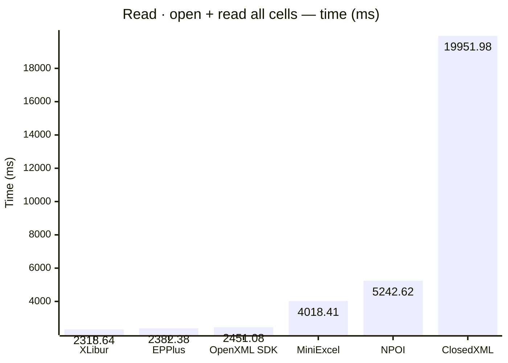
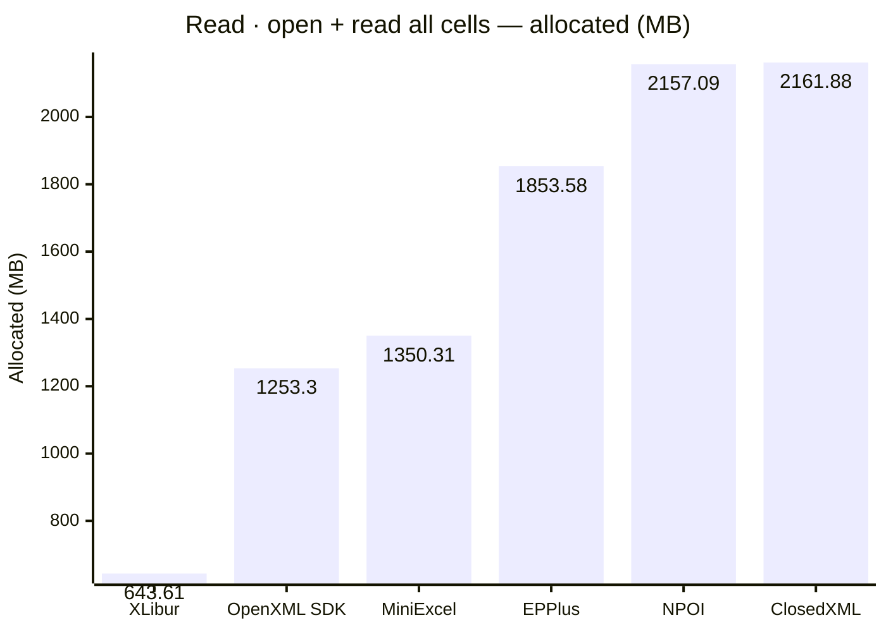
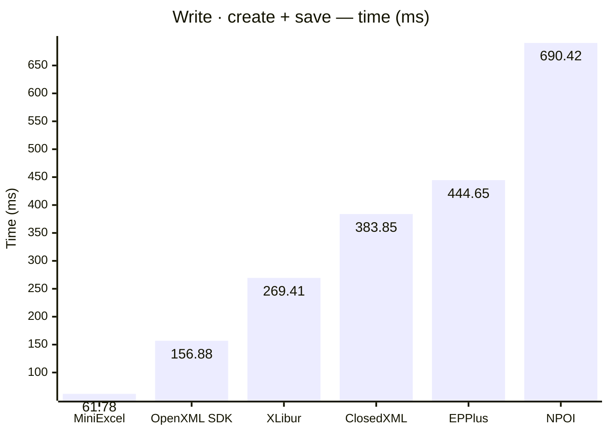
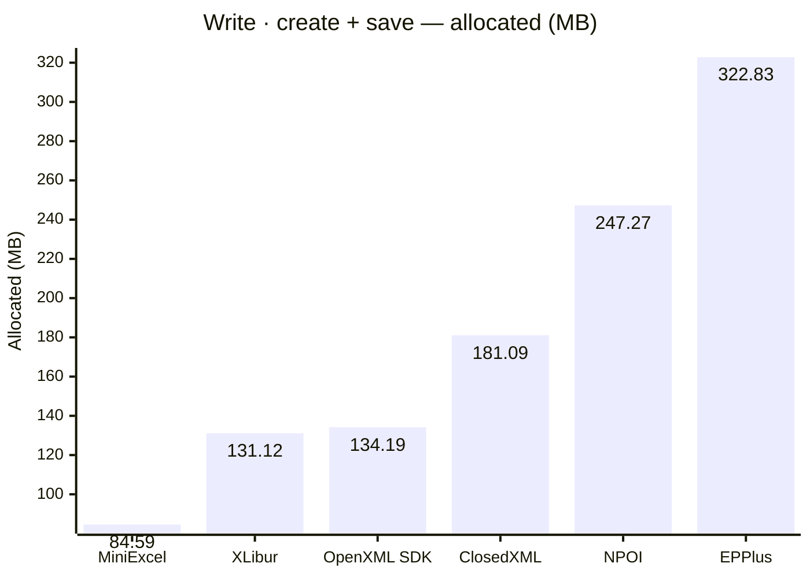

<style>
  .main-content { max-width: 90% !important; padding-left: 2rem !important; padding-right: 2rem !important; }
</style>
<!-- Generated by XLBench. Do not edit by hand; re-run scripts/run-benchmarks.ps1. -->
# XLBench Results

Each section below embeds the full BenchmarkDotNet environment block (OS, CPU,
.NET SDK and runtime). Timings are hardware-specific; treat the allocation/GC
columns as the most portable signal across machines. Regenerate locally with
`scripts/run-benchmarks.ps1`.

📈 **[Interactive charts](charts.html)** (GitHub Pages). Static charts and the full tables follow.

Each results table (one per test method) is heat-mapped independently on the Pages site (🟩 best → 🟥 worst).

## Libraries under test

| Library | Version |
| --- | --- |
| ClosedXML | 0.105.0 |
| EPPlus | 8.6.3 |
| OpenXML SDK | 3.5.1 |
| NPOI | 2.8.0 |
| MiniExcel | 1.45.0 |
| XLibur | 0.106.0 |

## Comparison charts

_Lower is better. Charts render in the GitHub file view; the Pages site has interactive versions._










## Detailed results


```

BenchmarkDotNet v0.15.8, Windows 11 (10.0.22631.6199/23H2/2023Update/SunValley3)
AMD Ryzen 9 5950X 3.40GHz, 1 CPU, 32 logical and 16 physical cores
.NET SDK 10.0.302
  [Host]     : .NET 10.0.10 (10.0.10, 10.0.1026.32716), X64 RyuJIT x86-64-v3
  DefaultJob : .NET 10.0.10 (10.0.10, 10.0.1026.32716), X64 RyuJIT x86-64-v3


```

### Read · open workbook

| Library     | Type                     | Method         | Mean         | Error      | StdDev     | Median       | Gen0        | Gen1        | Gen2      | Allocated  |
|------------ |------------------------- |--------------- |-------------:|-----------:|-----------:|-------------:|------------:|------------:|----------:|-----------:|
| NPOI        | NpoiReadBenchmarks       | OpenWorkbook   |    245.80 ms |   4.768 ms |   9.299 ms |    244.48 ms |   4000.0000 |   3500.0000 | 1500.0000 |  211.34 MB |
| XLibur      | XLiburReadBenchmarks     | OpenWorkbook   |  1,581.27 ms |  31.468 ms |  82.898 ms |  1,563.51 ms |  10000.0000 |   8000.0000 | 2000.0000 |  158.36 MB |
| EPPlus      | EpPlusReadBenchmarks     | OpenWorkbook   |  1,760.66 ms |  34.639 ms |  76.758 ms |  1,753.93 ms |  41000.0000 |  17000.0000 | 7000.0000 | 1038.89 MB |
| ClosedXML   | ClosedXmlReadBenchmarks  | OpenWorkbook   |  3,425.69 ms |  51.722 ms |  48.381 ms |  3,425.78 ms |  81000.0000 |  27000.0000 | 3000.0000 | 1304.39 MB |

### Read · open + read all cells

| Library     | Type                     | Method         | Mean         | Error      | StdDev     | Median       | Gen0        | Gen1        | Gen2      | Allocated  |
|------------ |------------------------- |--------------- |-------------:|-----------:|-----------:|-------------:|------------:|------------:|----------:|-----------:|
| XLibur      | XLiburReadBenchmarks     | OpenAndReadAll |  2,318.64 ms |  40.420 ms | 104.337 ms |  2,286.72 ms |  29000.0000 |  20000.0000 | 4000.0000 |  643.61 MB |
| EPPlus      | EpPlusReadBenchmarks     | OpenAndReadAll |  2,382.38 ms |  44.561 ms |  78.045 ms |  2,367.96 ms |  92000.0000 |  18000.0000 | 7000.0000 | 1853.58 MB |
| OpenXML SDK | OpenXmlReadBenchmarks    | OpenAndReadAll |  2,451.08 ms |  46.557 ms |  47.811 ms |  2,444.80 ms |  80000.0000 |   9000.0000 | 2000.0000 |  1253.3 MB |
| MiniExcel   | MiniExcelReadBenchmarks  | OpenAndReadAll |  4,018.41 ms |  55.796 ms |  52.191 ms |  4,002.72 ms |  84000.0000 |   1000.0000 |         - | 1350.31 MB |
| NPOI        | NpoiReadBenchmarks       | OpenAndReadAll |  5,242.62 ms | 103.766 ms | 197.425 ms |  5,200.01 ms | 132000.0000 | 121000.0000 | 8000.0000 | 2157.09 MB |
| ClosedXML   | ClosedXmlReadBenchmarks  | OpenAndReadAll | 19,951.98 ms | 318.738 ms | 298.147 ms | 19,802.69 ms | 117000.0000 |  44000.0000 | 4000.0000 | 2161.88 MB |

### Write · create + save

| Library     | Type                     | Method         | Mean         | Error      | StdDev     | Median       | Gen0        | Gen1        | Gen2      | Allocated  |
|------------ |------------------------- |--------------- |-------------:|-----------:|-----------:|-------------:|------------:|------------:|----------:|-----------:|
| MiniExcel   | MiniExcelWriteBenchmarks | CreateAndSave  |     61.78 ms |   1.219 ms |   1.197 ms |     61.45 ms |   5111.1111 |   1222.2222 | 1111.1111 |   84.59 MB |
| OpenXML SDK | OpenXmlWriteBenchmarks   | CreateAndSave  |    156.88 ms |   1.781 ms |   1.666 ms |    156.81 ms |   8000.0000 |   2000.0000 | 2000.0000 |  134.19 MB |
| XLibur      | XLiburWriteBenchmarks    | CreateAndSave  |    269.41 ms |   5.186 ms |   4.597 ms |    268.55 ms |   7000.0000 |   3000.0000 | 2000.0000 |  131.12 MB |
| ClosedXML   | ClosedXmlWriteBenchmarks | CreateAndSave  |    383.85 ms |   7.498 ms |  10.990 ms |    380.71 ms |  10000.0000 |   5000.0000 | 2000.0000 |  181.09 MB |
| EPPlus      | EpPlusWriteBenchmarks    | CreateAndSave  |    444.65 ms |   8.751 ms |   8.594 ms |    443.22 ms |  20000.0000 |   9000.0000 | 3000.0000 |  322.83 MB |
| NPOI        | NpoiWriteBenchmarks      | CreateAndSave  |    690.42 ms |  13.075 ms |  19.569 ms |    683.95 ms |  16000.0000 |  12000.0000 | 3000.0000 |  247.27 MB |


<script type="module">
  import mermaid from 'https://cdn.jsdelivr.net/npm/mermaid@11/dist/mermaid.esm.min.mjs';
  const blocks = document.querySelectorAll('.language-mermaid');
  blocks.forEach(el => {
    const code = el.querySelector('code') || el;
    const pre = document.createElement('pre');
    pre.className = 'mermaid';
    pre.textContent = code.textContent;
    el.replaceWith(pre);
  });
  if (blocks.length) {
    mermaid.initialize({ startOnLoad: false });
    await mermaid.run({ querySelector: 'pre.mermaid' });
  }
</script>

<script>
(function () {
  const parse = s => { const n = parseFloat(String(s).replace(/,/g, '')); return Number.isFinite(n) ? n : null; };
  document.querySelectorAll('table').forEach(table => {
    if (!table.tHead || !table.tBodies[0]) return;
    const heads = [...table.tHead.rows[0].cells].map(c => c.textContent.trim().toLowerCase());
    if (!heads.includes('mean')) return;
    const metricCols = heads.map((h, i) => /^(mean|allocated|gen0|gen1|gen2)$/.test(h) ? i : -1).filter(i => i >= 0);
    const rows = [...table.tBodies[0].rows];
    for (const c of metricCols) {
      const vals = rows.map(r => parse(r.cells[c]?.textContent));
      const nums = vals.filter(v => v !== null);
      if (nums.length < 2) continue;
      const min = Math.min(...nums), max = Math.max(...nums);
      if (max === min) continue;
      rows.forEach((r, i) => {
        const v = vals[i]; if (v === null) return;
        const ratio = (v - min) / (max - min);
        r.cells[c].style.backgroundColor = `hsla(${120 - 120 * ratio}, 70%, 50%, 0.45)`;
      });
    }
  });
})();
</script>
