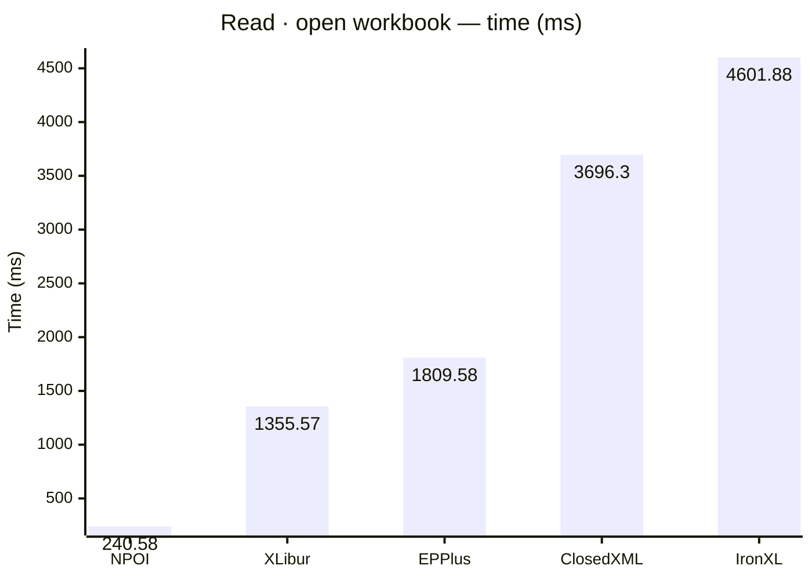
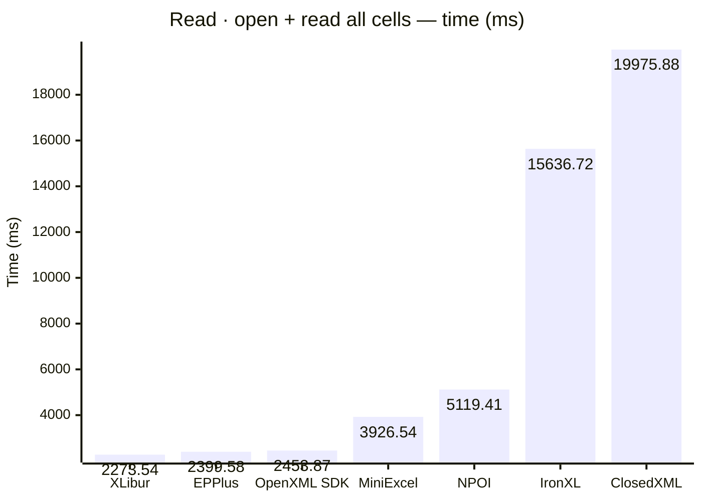
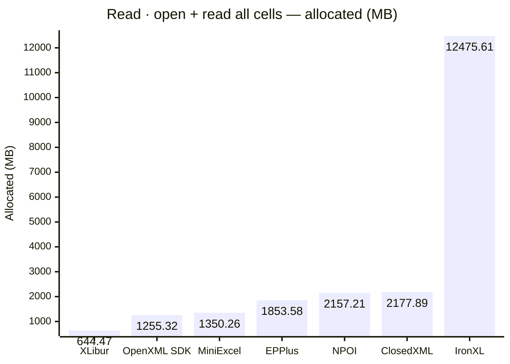
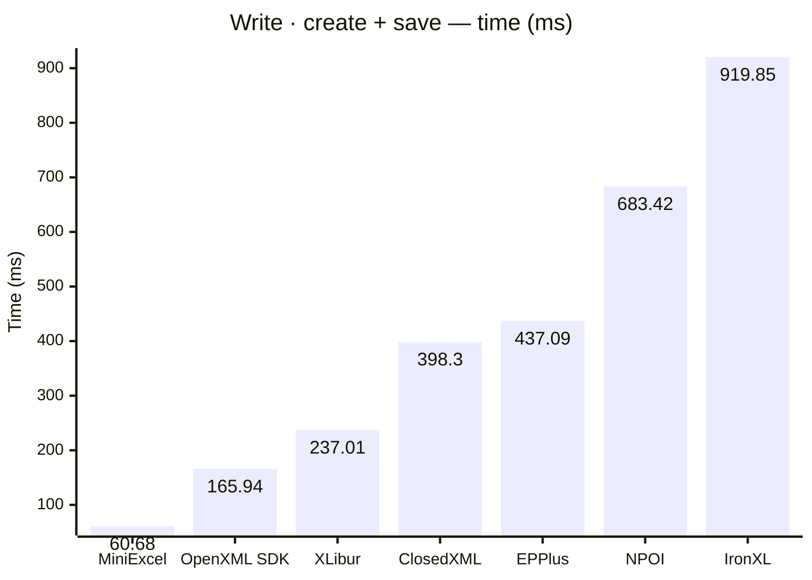
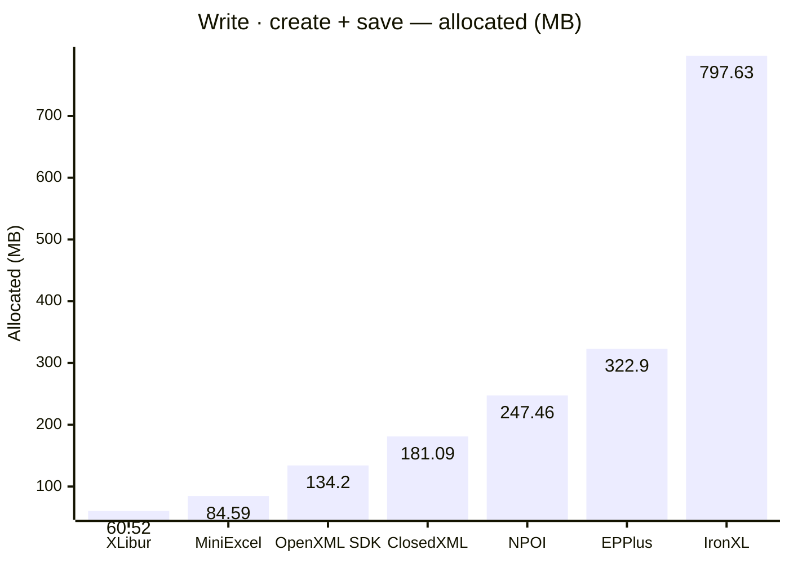
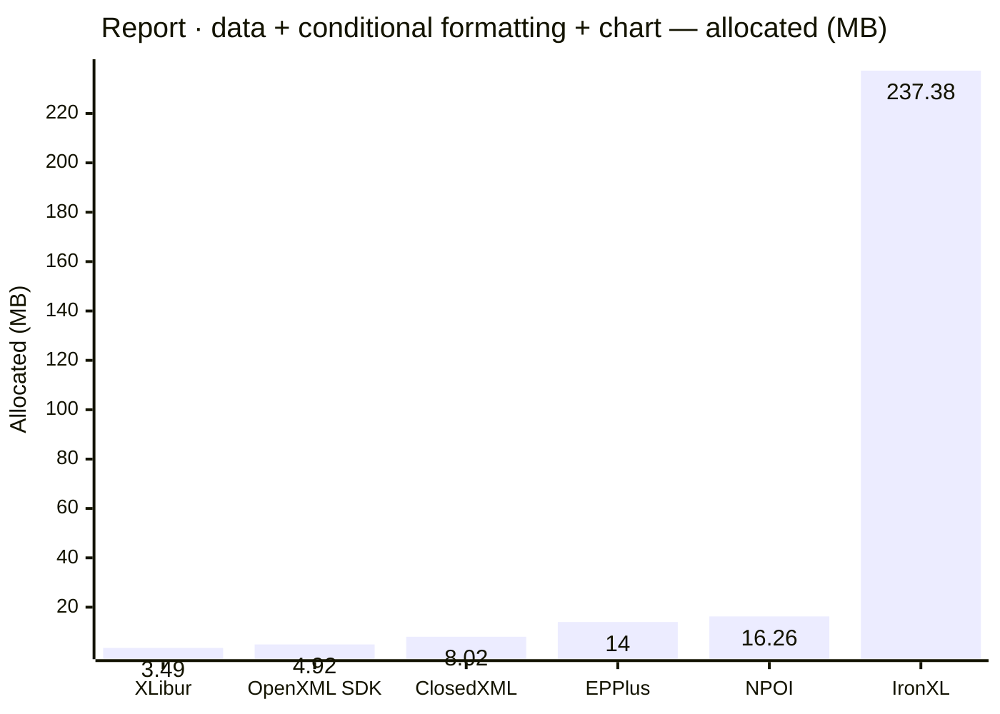
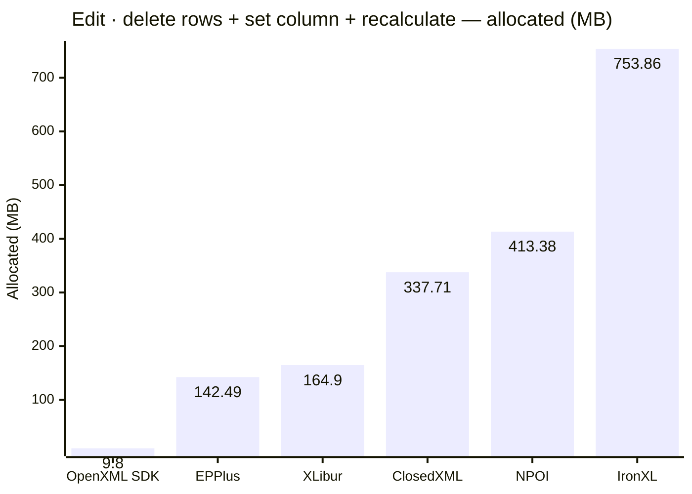

<style>
  .main-content { max-width: 90% !important; padding-left: 2rem !important; padding-right: 2rem !important; }
</style>
<!-- Generated by XLBench. Do not edit by hand; re-run scripts/run-benchmarks.ps1. -->
# XLBench Results

Each section below embeds the full BenchmarkDotNet environment block (OS, CPU,
.NET SDK and runtime). Timings are hardware-specific; treat the allocation/GC
columns as the most portable signal across machines. Regenerate locally with
`scripts/run-benchmarks.ps1`.

📈 **[Interactive charts](charts.html)** (GitHub Pages). Static charts and the full tables follow.

Each results table (one per test method) is heat-mapped independently on the Pages site (🟩 best → 🟥 worst).

## Libraries under test

| Library | Version | Source |
| --- | --- | --- |
| ClosedXML | 0.105.1 | this run |
| EPPlus | 8.6.3 | this run |
| OpenXML SDK | 3.5.1 | this run |
| NPOI | 2.8.0 | this run |
| MiniExcel | 1.45.0 | this run |
| XLibur | 0.200.0 | this run |
| IronXL | 2026.8.1 | this run |

## Comparison charts

_Lower is better. Charts render in the GitHub file view; the Pages site has interactive versions._


















## Detailed results


```

BenchmarkDotNet v0.15.8, Windows 11 (10.0.22631.6199/23H2/2023Update/SunValley3)
AMD Ryzen 9 5950X 3.40GHz, 1 CPU, 32 logical and 16 physical cores
.NET SDK 10.0.302
  [Host]     : .NET 10.0.10 (10.0.10, 10.0.1026.32716), X64 RyuJIT x86-64-v3
  Job-HTCPYF : .NET 10.0.10 (10.0.10, 10.0.1026.32716), X64 RyuJIT x86-64-v3

MaxIterationCount=10  MaxWarmupIterationCount=3  MinIterationCount=5  
MinWarmupIterationCount=1  

```

### Read · open workbook

| Library     | Type                      | Method             | Mean          | Error       | StdDev      | Gen0        | Gen1        | Gen2       | Allocated   |
|------------ |-------------------------- |------------------- |--------------:|------------:|------------:|------------:|------------:|-----------:|------------:|
| NPOI        | NpoiReadBenchmarks        | OpenWorkbook       |    240.580 ms |   6.6922 ms |   3.5001 ms |   4000.0000 |   3500.0000 |  1500.0000 |   211.37 MB |
| XLibur      | XLiburReadBenchmarks      | OpenWorkbook       |  1,355.574 ms |  19.5937 ms |   8.6997 ms |  10000.0000 |   8000.0000 |  2000.0000 |   158.32 MB |
| EPPlus      | EpPlusReadBenchmarks      | OpenWorkbook       |  1,809.577 ms | 154.6733 ms | 102.3068 ms |  41000.0000 |  17000.0000 |  7000.0000 |  1038.89 MB |
| ClosedXML   | ClosedXmlReadBenchmarks   | OpenWorkbook       |  3,696.300 ms | 336.2086 ms | 222.3812 ms |  81000.0000 |  27000.0000 |  3000.0000 |   1306.4 MB |
| IronXL      | IronXlReadBenchmarks      | OpenWorkbook       |  4,601.883 ms | 189.3216 ms | 125.2245 ms | 452000.0000 | 124000.0000 |  7000.0000 |   7235.8 MB |

### Read · open + read all cells

| Library     | Type                      | Method             | Mean          | Error       | StdDev      | Gen0        | Gen1        | Gen2       | Allocated   |
|------------ |-------------------------- |------------------- |--------------:|------------:|------------:|------------:|------------:|-----------:|------------:|
| XLibur      | XLiburReadBenchmarks      | OpenAndReadAll     |  2,273.535 ms |  52.9725 ms |  31.5231 ms |  28000.0000 |  21000.0000 |  4000.0000 |   644.47 MB |
| EPPlus      | EpPlusReadBenchmarks      | OpenAndReadAll     |  2,399.582 ms | 153.1752 ms | 101.3159 ms |  92000.0000 |  18000.0000 |  7000.0000 |  1853.58 MB |
| OpenXML SDK | OpenXmlReadBenchmarks     | OpenAndReadAll     |  2,453.869 ms |  45.4513 ms |  23.7719 ms |  80000.0000 |  11000.0000 |  2000.0000 |  1255.32 MB |
| MiniExcel   | MiniExcelReadBenchmarks   | OpenAndReadAll     |  3,926.539 ms |  92.5153 ms |  61.1932 ms |  84000.0000 |   1000.0000 |          - |  1350.26 MB |
| NPOI        | NpoiReadBenchmarks        | OpenAndReadAll     |  5,119.411 ms | 102.3483 ms |  45.4433 ms | 131000.0000 | 121000.0000 |  8000.0000 |  2157.21 MB |
| IronXL      | IronXlReadBenchmarks      | OpenAndReadAll     | 15,636.720 ms | 552.9906 ms | 329.0759 ms | 764000.0000 | 389000.0000 | 11000.0000 | 12475.61 MB |
| ClosedXML   | ClosedXmlReadBenchmarks   | OpenAndReadAll     | 19,975.885 ms | 385.8290 ms | 171.3105 ms | 117000.0000 |  44000.0000 |  4000.0000 |  2177.89 MB |

### Write · create + save

| Library     | Type                      | Method             | Mean          | Error       | StdDev      | Gen0        | Gen1        | Gen2       | Allocated   |
|------------ |-------------------------- |------------------- |--------------:|------------:|------------:|------------:|------------:|-----------:|------------:|
| MiniExcel   | MiniExcelWriteBenchmarks  | CreateAndSave      |     60.680 ms |   3.5682 ms |   2.3601 ms |   5666.6667 |   1777.7778 |  1666.6667 |    84.59 MB |
| OpenXML SDK | OpenXmlWriteBenchmarks    | CreateAndSave      |    165.942 ms |   3.2585 ms |   1.1620 ms |   8750.0000 |   2000.0000 |  2000.0000 |    134.2 MB |
| XLibur      | XLiburWriteBenchmarks     | CreateAndSave      |    237.015 ms |  10.4093 ms |   6.8851 ms |   3000.0000 |   2000.0000 |  2000.0000 |    60.52 MB |
| ClosedXML   | ClosedXmlWriteBenchmarks  | CreateAndSave      |    398.299 ms |  16.1683 ms |  10.6944 ms |  10000.0000 |   5000.0000 |  2000.0000 |   181.09 MB |
| EPPlus      | EpPlusWriteBenchmarks     | CreateAndSave      |    437.093 ms |  13.0271 ms |   8.6166 ms |  20000.0000 |   9000.0000 |  3000.0000 |    322.9 MB |
| NPOI        | NpoiWriteBenchmarks       | CreateAndSave      |    683.421 ms |  29.0891 ms |  19.2406 ms |  16000.0000 |  12000.0000 |  3000.0000 |   247.46 MB |
| IronXL      | IronXlWriteBenchmarks     | CreateAndSave      |    919.853 ms |  24.6276 ms |  14.6555 ms |  48000.0000 |  16000.0000 |  3000.0000 |   797.63 MB |

### Report · data + conditional formatting + chart

| Library     | Type                      | Method             | Mean          | Error       | StdDev      | Gen0        | Gen1        | Gen2       | Allocated   |
|------------ |-------------------------- |------------------- |--------------:|------------:|------------:|------------:|------------:|-----------:|------------:|
| OpenXML SDK | OpenXmlReportBenchmarks   | CreateStockReport  |      8.472 ms |   0.2158 ms |   0.1427 ms |    375.0000 |    359.3750 |   187.5000 |     4.92 MB |
| XLibur      | XLiburReportBenchmarks    | CreateStockReport  |      9.282 ms |   0.4554 ms |   0.3012 ms |    187.5000 |    187.5000 |   187.5000 |     3.49 MB |
| EPPlus      | EpPlusReportBenchmarks    | CreateStockReport  |     15.572 ms |   0.4645 ms |   0.3072 ms |   1000.0000 |   1000.0000 |  1000.0000 |       14 MB |
| ClosedXML   | ClosedXmlReportBenchmarks | CreateStockReport  |     16.843 ms |   0.4485 ms |   0.2967 ms |    468.7500 |    187.5000 |    31.2500 |     8.02 MB |
| NPOI        | NpoiReportBenchmarks      | CreateStockReport  |     36.942 ms |  10.3756 ms |   6.8628 ms |    875.0000 |    750.0000 |   375.0000 |    16.26 MB |
| IronXL      | IronXlReportBenchmarks    | CreateStockReport  |    376.810 ms |  33.6671 ms |  22.2687 ms |  14000.0000 |   3000.0000 |          - |   237.38 MB |

### Edit · delete rows + set column + recalculate

| Library     | Type                      | Method             | Mean          | Error       | StdDev      | Gen0        | Gen1        | Gen2       | Allocated   |
|------------ |-------------------------- |------------------- |--------------:|------------:|------------:|------------:|------------:|-----------:|------------:|
| OpenXML SDK | OpenXmlEditBenchmarks     | EditAndRecalculate |     26.137 ms |   0.5362 ms |   0.3547 ms |    718.7500 |    656.2500 |   156.2500 |      9.8 MB |
| EPPlus      | EpPlusEditBenchmarks      | EditAndRecalculate |     96.717 ms |   6.6784 ms |   4.4174 ms |   9000.0000 |   1200.0000 |  1000.0000 |   142.49 MB |
| XLibur      | XLiburEditBenchmarks      | EditAndRecalculate |    172.911 ms |   9.5981 ms |   6.3486 ms |  10333.3333 |    333.3333 |          - |    164.9 MB |
| ClosedXML   | ClosedXmlEditBenchmarks   | EditAndRecalculate |    350.470 ms |   8.9962 ms |   5.9505 ms |  21000.0000 |   1000.0000 |          - |   337.71 MB |
| NPOI        | NpoiEditBenchmarks        | EditAndRecalculate |    395.996 ms |  10.2234 ms |   6.7621 ms |  25000.0000 |   1000.0000 |          - |   413.38 MB |
| IronXL      | IronXlEditBenchmarks      | EditAndRecalculate |  1,580.177 ms |  34.8355 ms |  20.7301 ms |  57000.0000 |  35000.0000 | 15000.0000 |   753.86 MB |


<script type="module">
  import mermaid from 'https://cdn.jsdelivr.net/npm/mermaid@11/dist/mermaid.esm.min.mjs';
  const blocks = document.querySelectorAll('.language-mermaid');
  blocks.forEach(el => {
    const code = el.querySelector('code') || el;
    const pre = document.createElement('pre');
    pre.className = 'mermaid';
    pre.textContent = code.textContent;
    el.replaceWith(pre);
  });
  if (blocks.length) {
    mermaid.initialize({ startOnLoad: false });
    await mermaid.run({ querySelector: 'pre.mermaid' });
  }
</script>

<script>
(function () {
  const parse = s => { const n = parseFloat(String(s).replace(/,/g, '')); return Number.isFinite(n) ? n : null; };
  document.querySelectorAll('table').forEach(table => {
    if (!table.tHead || !table.tBodies[0]) return;
    const heads = [...table.tHead.rows[0].cells].map(c => c.textContent.trim().toLowerCase());
    if (!heads.includes('mean')) return;
    const metricCols = heads.map((h, i) => /^(mean|allocated|gen0|gen1|gen2)$/.test(h) ? i : -1).filter(i => i >= 0);
    const rows = [...table.tBodies[0].rows];
    for (const c of metricCols) {
      const vals = rows.map(r => parse(r.cells[c]?.textContent));
      const nums = vals.filter(v => v !== null);
      if (nums.length < 2) continue;
      const min = Math.min(...nums), max = Math.max(...nums);
      if (max === min) continue;
      rows.forEach((r, i) => {
        const v = vals[i]; if (v === null) return;
        const ratio = (v - min) / (max - min);
        r.cells[c].style.backgroundColor = `hsla(${120 - 120 * ratio}, 70%, 50%, 0.45)`;
      });
    }
  });
})();
</script>
