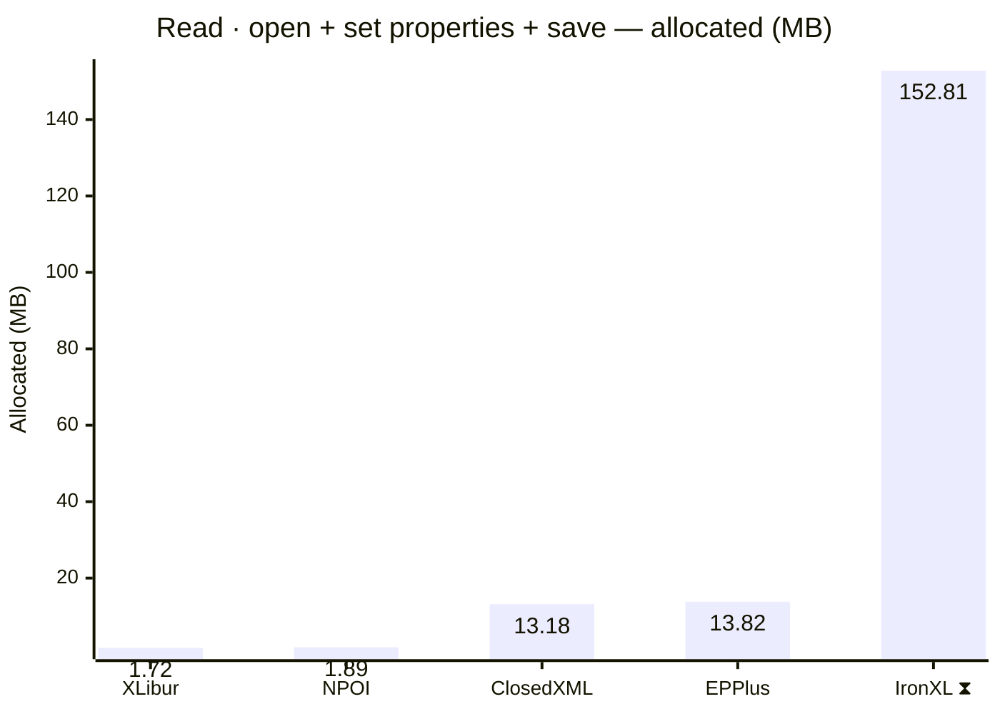
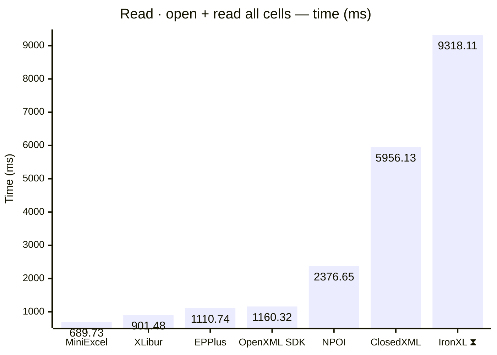
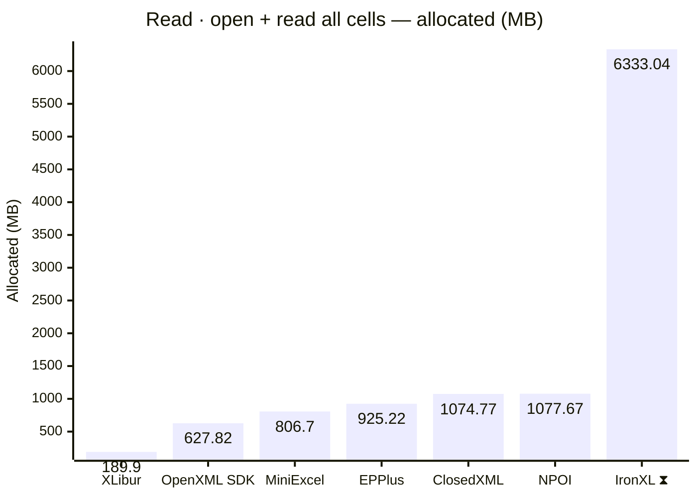
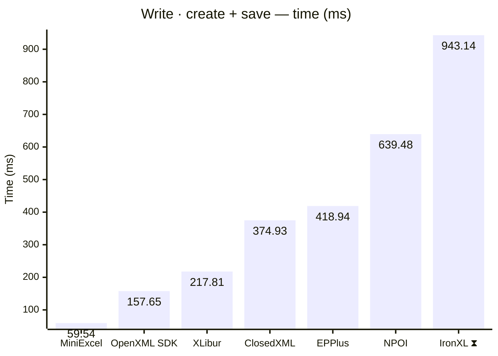
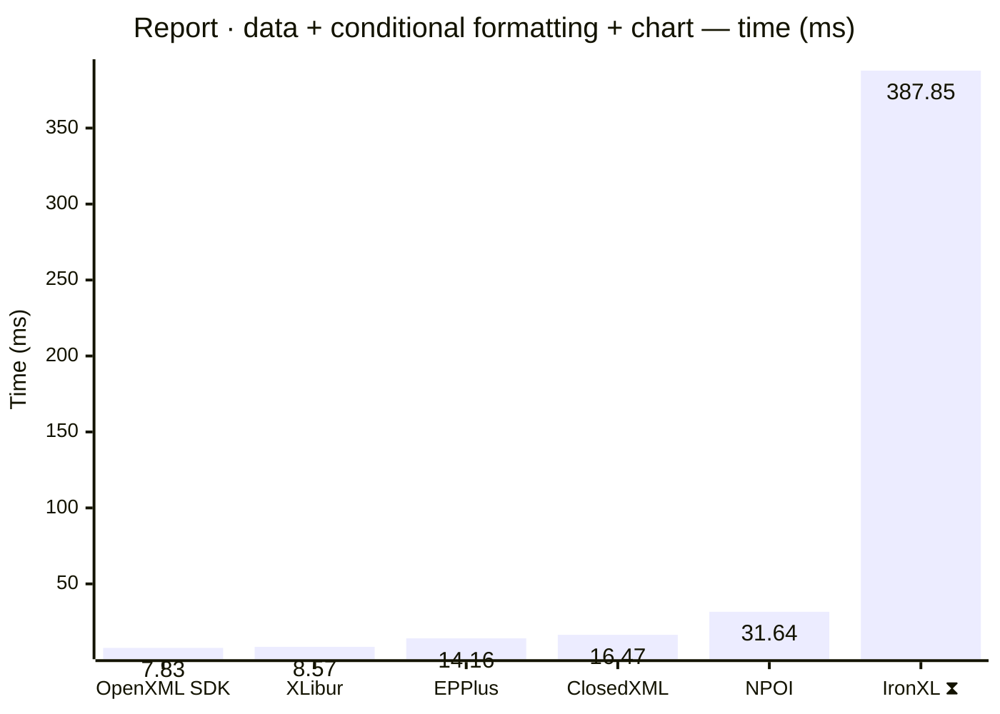
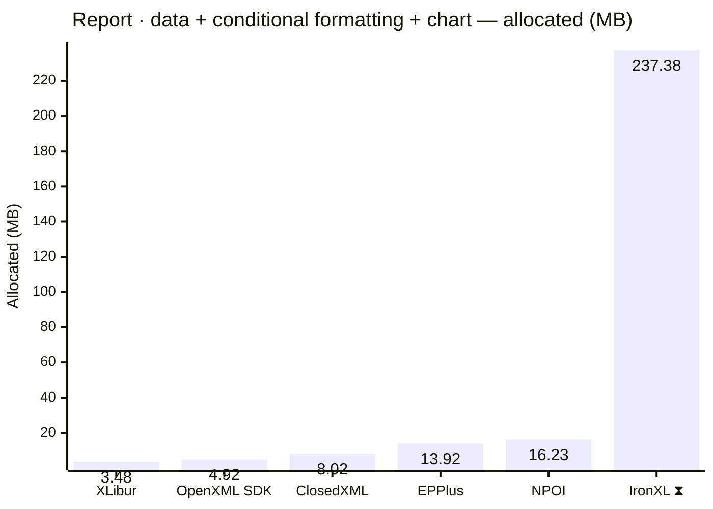
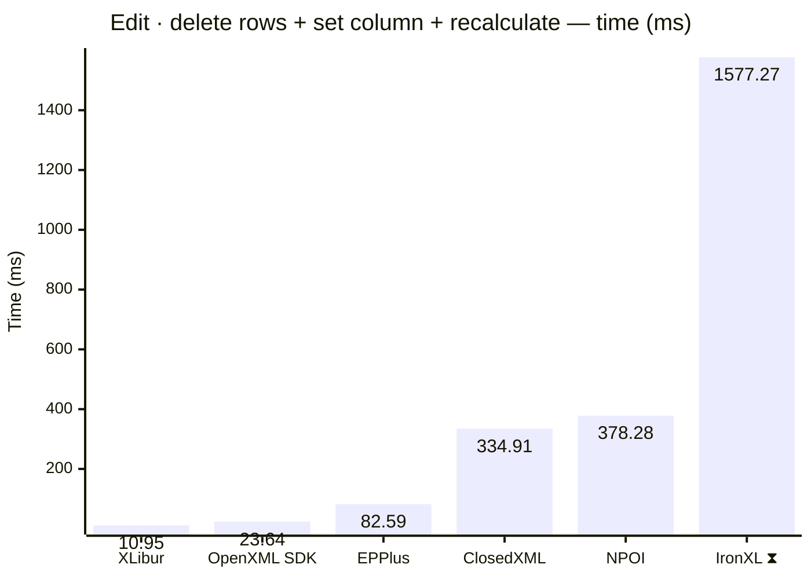
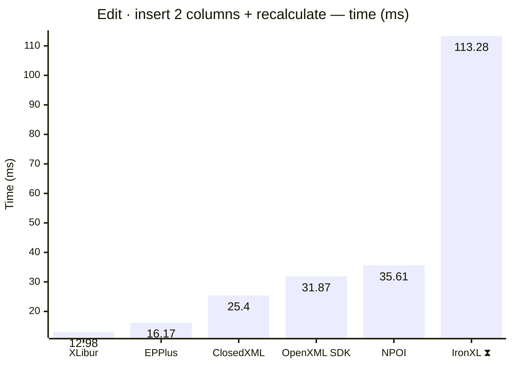

<style>
  .main-content { max-width: 90% !important; padding-left: 2rem !important; padding-right: 2rem !important; }
</style>
<!-- Generated by XLBench. Do not edit by hand; re-run scripts/run-benchmarks.ps1. -->
# XLBench Results

Each section below embeds the full BenchmarkDotNet environment block (OS, CPU,
.NET SDK and runtime). Timings are hardware-specific; treat the allocation/GC
columns as the most portable signal across machines. Regenerate locally with
`scripts/run-benchmarks.ps1`.

📈 **[Interactive charts](charts.html)** (GitHub Pages). Static charts and the full tables follow.

Each results table (one per test method) is heat-mapped independently on the Pages site (🟩 best → 🟥 worst).

> ⧗ **Carried over from an earlier run.** The rows and chart points below marked with this symbol were not measured here — the library is commercial and needs a licence key this run did not have — so they are replayed from `snapshots/`. Compare them as indicative rather than like-for-like, and see the repository README for how to refresh a snapshot.
>
> - **IronXL** 2026.8.1, Job-HTCPYF job, captured 2026-08-03 on same hardware as this run.

## Libraries under test

| Library | Version | Source |
| --- | --- | --- |
| ClosedXML | 0.105.1 | this run |
| EPPlus | 8.7.0 | this run |
| OpenXML SDK | 3.5.1 | this run |
| NPOI | 2.8.0 | this run |
| MiniExcel | 1.46.0 | this run |
| XLibur | 0.311.2-alpha.34 | this run |
| IronXL ⧗ | 2026.8.1 | snapshot (2026.8.1, Job-HTCPYF, captured 2026-08-03) |

## Comparison charts

_Lower is better. Charts render in the GitHub file view; the Pages site has interactive versions._





















## Detailed results


```

BenchmarkDotNet v0.15.8, Windows 11 (10.0.22631.6199/23H2/2023Update/SunValley3)
AMD Ryzen 9 5950X 3.40GHz, 1 CPU, 32 logical and 16 physical cores
.NET SDK 10.0.400
  [Host]     : .NET 10.0.11 (10.0.11, 10.0.1126.37416), X64 RyuJIT x86-64-v3
  Job-FOMANW : .NET 10.0.11 (10.0.11, 10.0.1126.37416), X64 RyuJIT x86-64-v3

MaxIterationCount=15  MaxWarmupIterationCount=10  MinIterationCount=5  
MinWarmupIterationCount=1  

```

### Read · open + set properties + save

| Library     | Type                      | Method                      | Mean         | Error      | StdDev     | Gen0       | Gen1       | Gen2      | Allocated  |
|------------ |-------------------------- |---------------------------- |-------------:|-----------:|-----------:|-----------:|-----------:|----------:|-----------:|
| NPOI        | NpoiReadBenchmarks        | OpenAmendPropertiesAndSave  |     8.487 ms |  0.1398 ms |  0.0216 ms |    62.5000 |          - |         - |    1.89 MB |
| XLibur      | XLiburReadBenchmarks      | OpenAmendPropertiesAndSave  |    16.132 ms |  1.3116 ms |  1.2269 ms |          - |          - |         - |    1.72 MB |
| EPPlus      | EpPlusReadBenchmarks      | OpenAmendPropertiesAndSave  |    22.397 ms |  0.4335 ms |  0.2267 ms |  1000.0000 |  1000.0000 | 1000.0000 |   13.82 MB |
| ClosedXML   | ClosedXmlReadBenchmarks   | OpenAmendPropertiesAndSave  |    33.147 ms |  0.6918 ms |  0.6132 ms |   666.6667 |   333.3333 |         - |   13.18 MB |
| IronXL ⧗ | IronXlReadBenchmarks | OpenAmendPropertiesAndSave | 208.746 ms | 155.7570 ms | 92.6885 ms | 9000.0000 | 2000.0000 | - | 152.81 MB |

### Read · open + read all cells

| Library     | Type                      | Method                      | Mean         | Error      | StdDev     | Gen0       | Gen1       | Gen2      | Allocated  |
|------------ |-------------------------- |---------------------------- |-------------:|-----------:|-----------:|-----------:|-----------:|----------:|-----------:|
| MiniExcel   | MiniExcelReadBenchmarks   | OpenAndReadAll              |   689.727 ms | 12.8991 ms |  9.3269 ms | 51000.0000 |  4000.0000 | 1000.0000 |   806.7 MB |
| XLibur      | XLiburReadBenchmarks      | OpenAndReadAll              |   901.480 ms | 21.3250 ms | 19.9474 ms | 13000.0000 |  8000.0000 | 2000.0000 |   189.9 MB |
| EPPlus      | EpPlusReadBenchmarks      | OpenAndReadAll              | 1,110.742 ms | 20.9668 ms |  9.3094 ms | 49000.0000 | 14000.0000 | 7000.0000 |  925.22 MB |
| OpenXML SDK | OpenXmlReadBenchmarks     | OpenAndReadAll              | 1,160.315 ms | 19.0133 ms |  9.9443 ms | 40000.0000 |  6000.0000 | 1000.0000 |  627.82 MB |
| NPOI        | NpoiReadBenchmarks        | OpenAndReadAll              | 2,376.653 ms | 41.3789 ms | 21.6419 ms | 68000.0000 | 62000.0000 | 6000.0000 | 1077.67 MB |
| ClosedXML   | ClosedXmlReadBenchmarks   | OpenAndReadAll              | 5,956.128 ms | 80.8681 ms | 28.8383 ms | 60000.0000 | 24000.0000 | 4000.0000 | 1074.77 MB |
| IronXL ⧗ | IronXlReadBenchmarks | OpenAndReadAll | 9,318.107 ms | 477.3336 ms | 315.7266 ms | 393000.0000 | 202000.0000 | 10000.0000 | 6333.04 MB |

### Write · create + save

| Library     | Type                      | Method                      | Mean         | Error      | StdDev     | Gen0       | Gen1       | Gen2      | Allocated  |
|------------ |-------------------------- |---------------------------- |-------------:|-----------:|-----------:|-----------:|-----------:|----------:|-----------:|
| MiniExcel   | MiniExcelWriteBenchmarks  | CreateAndSave               |    59.537 ms |  1.9828 ms |  1.7577 ms |  5625.0000 |  1750.0000 | 1625.0000 |   84.59 MB |
| OpenXML SDK | OpenXmlWriteBenchmarks    | CreateAndSave               |   157.647 ms |  2.8261 ms |  0.7339 ms |  8000.0000 |  2000.0000 | 2000.0000 |  134.19 MB |
| XLibur      | XLiburWriteBenchmarks     | CreateAndSave               |   217.805 ms |  6.2540 ms |  5.5440 ms |  3000.0000 |  2000.0000 | 2000.0000 |    60.5 MB |
| ClosedXML   | ClosedXmlWriteBenchmarks  | CreateAndSave               |   374.925 ms |  7.2018 ms |  6.7366 ms | 10000.0000 |  5000.0000 | 2000.0000 |  181.09 MB |
| EPPlus      | EpPlusWriteBenchmarks     | CreateAndSave               |   418.942 ms |  7.4927 ms |  5.8498 ms | 20000.0000 |  9000.0000 | 3000.0000 |  322.83 MB |
| NPOI        | NpoiWriteBenchmarks       | CreateAndSave               |   639.482 ms | 12.2735 ms |  8.1182 ms | 16000.0000 | 12000.0000 | 3000.0000 |  247.27 MB |
| IronXL ⧗ | IronXlWriteBenchmarks | CreateAndSave | 943.137 ms | 18.5191 ms | 11.0204 ms | 48000.0000 | 16000.0000 | 3000.0000 | 797.63 MB |

### Report · data + conditional formatting + chart

| Library     | Type                      | Method                      | Mean         | Error      | StdDev     | Gen0       | Gen1       | Gen2      | Allocated  |
|------------ |-------------------------- |---------------------------- |-------------:|-----------:|-----------:|-----------:|-----------:|----------:|-----------:|
| OpenXML SDK | OpenXmlReportBenchmarks   | CreateStockReport           |     7.829 ms |  0.1464 ms |  0.0380 ms |   375.0000 |   359.3750 |  187.5000 |    4.92 MB |
| XLibur      | XLiburReportBenchmarks    | CreateStockReport           |     8.568 ms |  0.1285 ms |  0.0570 ms |   187.5000 |   187.5000 |  187.5000 |    3.48 MB |
| EPPlus      | EpPlusReportBenchmarks    | CreateStockReport           |    14.164 ms |  0.5021 ms |  0.4696 ms |  1000.0000 |  1000.0000 | 1000.0000 |   13.92 MB |
| ClosedXML   | ClosedXmlReportBenchmarks | CreateStockReport           |    16.470 ms |  0.5734 ms |  0.5083 ms |   468.7500 |   187.5000 |   31.2500 |    8.02 MB |
| NPOI        | NpoiReportBenchmarks      | CreateStockReport           |    31.640 ms |  0.8150 ms |  0.6806 ms |   888.8889 |   777.7778 |  444.4444 |   16.23 MB |
| IronXL ⧗ | IronXlReportBenchmarks | CreateStockReport | 387.849 ms | 36.5456 ms | 24.1726 ms | 14000.0000 | 3000.0000 | - | 237.38 MB |

### Edit · delete rows + set column + recalculate

| Library     | Type                      | Method                      | Mean         | Error      | StdDev     | Gen0       | Gen1       | Gen2      | Allocated  |
|------------ |-------------------------- |---------------------------- |-------------:|-----------:|-----------:|-----------:|-----------:|----------:|-----------:|
| XLibur      | XLiburEditBenchmarks      | EditAndRecalculate          |    10.953 ms |  0.1867 ms |  0.0976 ms |   250.0000 |   125.0000 |         - |    4.11 MB |
| OpenXML SDK | OpenXmlEditBenchmarks     | EditAndRecalculate          |    23.642 ms |  0.4565 ms |  0.1186 ms |   718.7500 |   656.2500 |  156.2500 |     9.8 MB |
| EPPlus      | EpPlusEditBenchmarks      | EditAndRecalculate          |    82.591 ms |  1.6285 ms |  1.5233 ms |  9000.0000 |  1200.0000 | 1000.0000 |  142.49 MB |
| ClosedXML   | ClosedXmlEditBenchmarks   | EditAndRecalculate          |   334.907 ms |  2.8294 ms |  0.4379 ms | 21000.0000 |  1000.0000 |         - |  337.66 MB |
| NPOI        | NpoiEditBenchmarks        | EditAndRecalculate          |   378.277 ms |  7.5590 ms |  4.4983 ms | 25000.0000 |  1000.0000 |         - |  413.38 MB |
| IronXL ⧗ | IronXlEditBenchmarks | EditAndRecalculate | 1,577.273 ms | 62.9583 ms | 41.6430 ms | 57000.0000 | 36000.0000 | 15000.0000 | 753.86 MB |

### Edit · insert 2 columns + recalculate

| Library     | Type                      | Method                      | Mean         | Error      | StdDev     | Gen0       | Gen1       | Gen2      | Allocated  |
|------------ |-------------------------- |---------------------------- |-------------:|-----------:|-----------:|-----------:|-----------:|----------:|-----------:|
| XLibur      | XLiburInsertBenchmarks    | InsertColumnsAndRecalculate |    12.977 ms |  0.2357 ms |  0.1704 ms |   222.2222 |   111.1111 |         - |    4.74 MB |
| EPPlus      | EpPlusInsertBenchmarks    | InsertColumnsAndRecalculate |    16.172 ms |  0.7392 ms |  0.6172 ms |  1000.0000 |  1000.0000 | 1000.0000 |   11.41 MB |
| ClosedXML   | ClosedXmlInsertBenchmarks | InsertColumnsAndRecalculate |    25.397 ms |  0.7930 ms |  0.7030 ms |   800.0000 |   400.0000 |         - |   13.65 MB |
| OpenXML SDK | OpenXmlInsertBenchmarks   | InsertColumnsAndRecalculate |    31.872 ms |  0.5042 ms |  0.2637 ms |  1000.0000 |   833.3333 |  333.3333 |   13.05 MB |
| NPOI        | NpoiInsertBenchmarks      | InsertColumnsAndRecalculate |    35.612 ms |  1.6324 ms |  1.5269 ms |  2000.0000 |  1333.3333 |  500.0000 |   30.72 MB |
| IronXL ⧗ | IronXlInsertBenchmarks | InsertColumnsAndRecalculate | 113.284 ms | 41.9750 ms | 27.7638 ms | 7000.0000 | 2500.0000 | 750.0000 | 104.88 MB |


<script type="module">
  import mermaid from 'https://cdn.jsdelivr.net/npm/mermaid@11/dist/mermaid.esm.min.mjs';
  const blocks = document.querySelectorAll('.language-mermaid');
  blocks.forEach(el => {
    const code = el.querySelector('code') || el;
    const pre = document.createElement('pre');
    pre.className = 'mermaid';
    pre.textContent = code.textContent;
    el.replaceWith(pre);
  });
  if (blocks.length) {
    mermaid.initialize({ startOnLoad: false });
    await mermaid.run({ querySelector: 'pre.mermaid' });
  }
</script>

<script>
(function () {
  const parse = s => { const n = parseFloat(String(s).replace(/,/g, '')); return Number.isFinite(n) ? n : null; };
  document.querySelectorAll('table').forEach(table => {
    if (!table.tHead || !table.tBodies[0]) return;
    const heads = [...table.tHead.rows[0].cells].map(c => c.textContent.trim().toLowerCase());
    if (!heads.includes('mean')) return;
    const metricCols = heads.map((h, i) => /^(mean|allocated|gen0|gen1|gen2)$/.test(h) ? i : -1).filter(i => i >= 0);
    const rows = [...table.tBodies[0].rows];
    for (const c of metricCols) {
      const vals = rows.map(r => parse(r.cells[c]?.textContent));
      const nums = vals.filter(v => v !== null);
      if (nums.length < 2) continue;
      const min = Math.min(...nums), max = Math.max(...nums);
      if (max === min) continue;
      rows.forEach((r, i) => {
        const v = vals[i]; if (v === null) return;
        const ratio = (v - min) / (max - min);
        r.cells[c].style.backgroundColor = `hsla(${120 - 120 * ratio}, 70%, 50%, 0.45)`;
      });
    }
  });
})();
</script>
