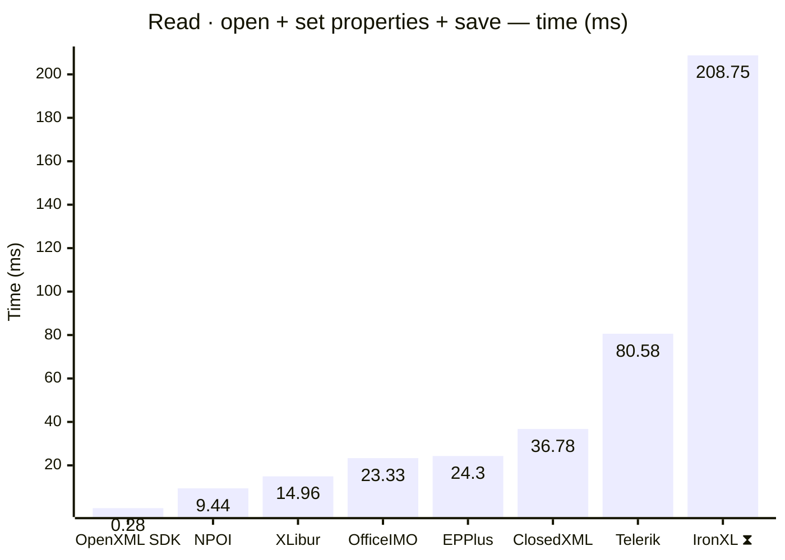
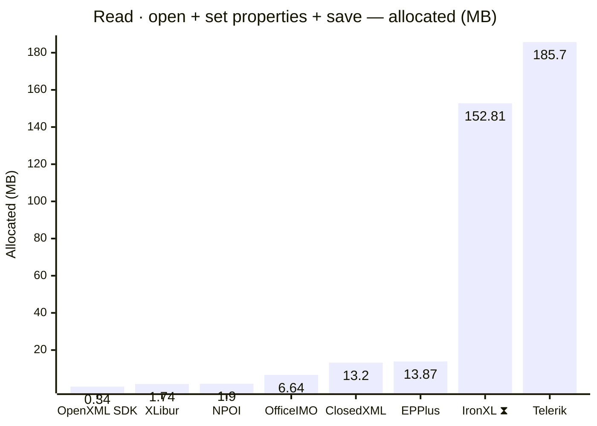
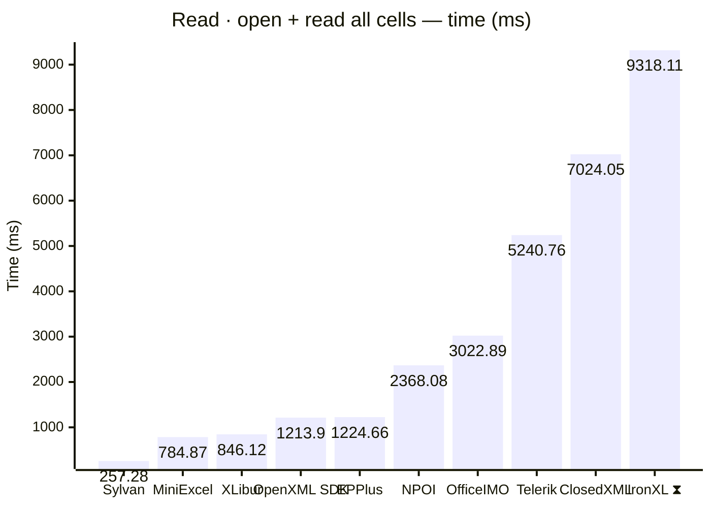
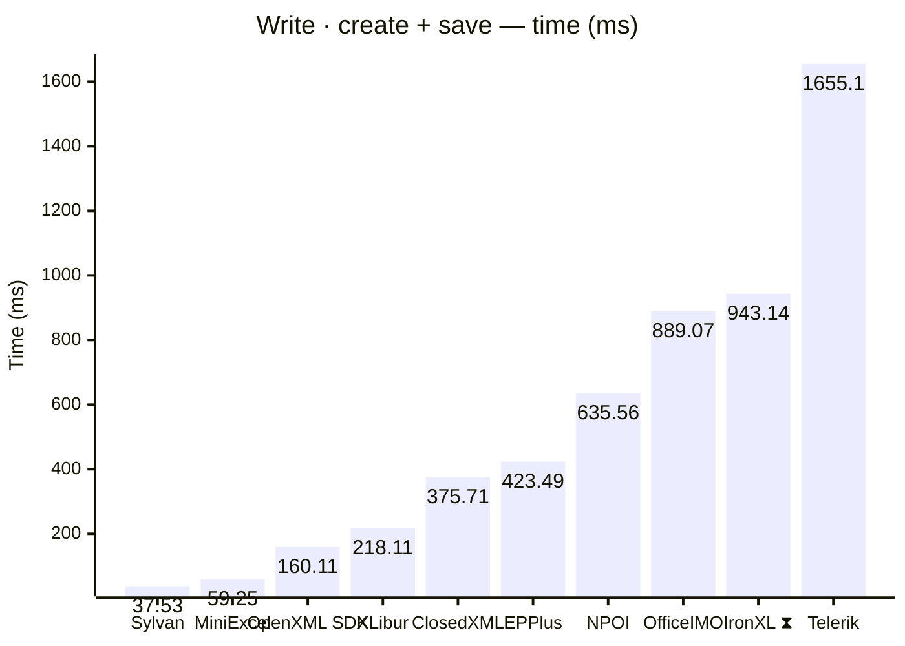
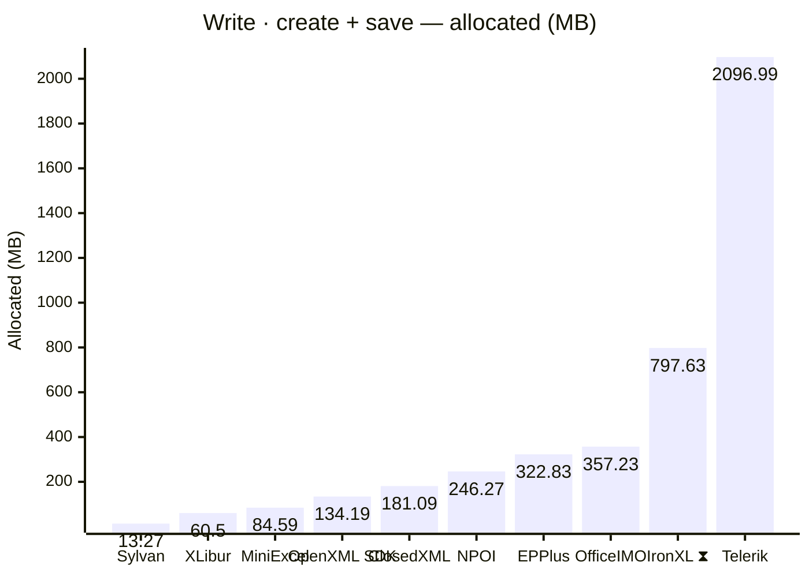
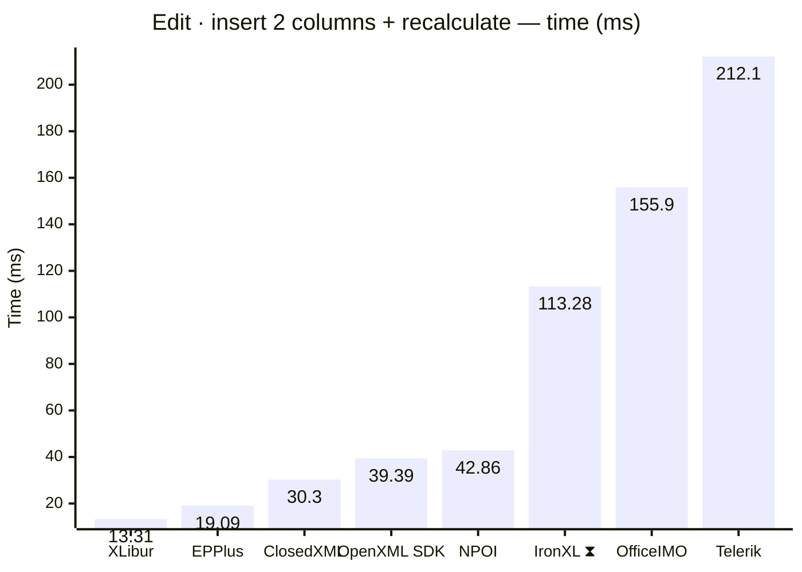

<style>
  .main-content { max-width: 90% !important; padding-left: 2rem !important; padding-right: 2rem !important; }
</style>
<!-- Generated by XLBench. Do not edit by hand; re-run scripts/run-benchmarks.ps1. -->
# XLBench Results

Each section below embeds the full BenchmarkDotNet environment block (OS, CPU,
.NET SDK and runtime). Timings are hardware-specific; treat the allocation/GC
columns as the most portable signal across machines. Regenerate locally with
`scripts/run-benchmarks.ps1`.

📈 **[Interactive charts](charts.html)** (GitHub Pages). Static charts and the full tables follow.

Each results table (one per test method) is heat-mapped independently on the Pages site (🟩 best → 🟥 worst).

> ⧗ **Carried over from an earlier run.** The rows and chart points below marked with this symbol were not measured here — the library is commercial and needs a licence key this run did not have — so they are replayed from `snapshots/`. Compare them as indicative rather than like-for-like, and see the repository README for how to refresh a snapshot.
>
> - **IronXL** 2026.8.1, Job-HTCPYF job, captured 2026-08-03 on same hardware as this run.

## Libraries under test

| Library | Version | Source |
| --- | --- | --- |
| ClosedXML | 0.105.1 | this run |
| EPPlus | 8.7.1 | this run |
| OpenXML SDK | 3.5.1 | this run |
| NPOI | 2.8.1 | this run |
| MiniExcel | 1.46.0 | this run |
| Sylvan | 0.5.8 | this run |
| XLibur | 0.630.0 | this run |
| OfficeIMO | 3.4.3 | this run |
| Telerik | 2026.3.923.100 | this run |
| IronXL ⧗ | 2026.8.1 | snapshot (2026.8.1, Job-HTCPYF, captured 2026-08-03) |

## Comparison charts

_Lower is better. Charts render in the GitHub file view; the Pages site has interactive versions._


```mermaid
---
config:
  xyChart:
    showDataLabel: true
---
xychart-beta
    title "Read · open + set properties + save — time (ms)"
    x-axis ["OpenXML SDK", "NPOI", "XLibur", "OfficeIMO", "EPPlus", "ClosedXML", "Telerik", "IronXL ⧗"]
    y-axis "Time (ms)"
    bar [0.28, 9.44, 14.96, 23.33, 24.3, 36.78, 80.58, 208.75]
```


```mermaid
---
config:
  xyChart:
    showDataLabel: true
---
xychart-beta
    title "Read · open + set properties + save — allocated (MB)"
    x-axis ["OpenXML SDK", "XLibur", "NPOI", "OfficeIMO", "ClosedXML", "EPPlus", "IronXL ⧗", "Telerik"]
    y-axis "Allocated (MB)"
    bar [0.34, 1.74, 1.9, 6.64, 13.2, 13.87, 152.81, 185.7]
```


```mermaid
---
config:
  xyChart:
    showDataLabel: true
---
xychart-beta
    title "Read · open + read all cells — time (ms)"
    x-axis ["Sylvan", "MiniExcel", "XLibur", "OpenXML SDK", "EPPlus", "NPOI", "OfficeIMO", "Telerik", "ClosedXML", "IronXL ⧗"]
    y-axis "Time (ms)"
    bar [257.28, 784.87, 846.12, 1213.9, 1224.66, 2368.08, 3022.89, 5240.76, 7024.05, 9318.11]
```


```mermaid
---
config:
  xyChart:
    showDataLabel: true
---
xychart-beta
    title "Read · open + read all cells — allocated (MB)"
    x-axis ["Sylvan", "XLibur", "OpenXML SDK", "MiniExcel", "OfficeIMO", "EPPlus", "NPOI", "ClosedXML", "Telerik", "IronXL ⧗"]
    y-axis "Allocated (MB)"
    bar [25.29, 138.59, 628.84, 806.71, 824.33, 925.23, 1075.8, 1083.78, 4165.24, 6333.04]
```


```mermaid
---
config:
  xyChart:
    showDataLabel: true
---
xychart-beta
    title "Write · create + save — time (ms)"
    x-axis ["Sylvan", "MiniExcel", "OpenXML SDK", "XLibur", "ClosedXML", "EPPlus", "NPOI", "OfficeIMO", "IronXL ⧗", "Telerik"]
    y-axis "Time (ms)"
    bar [37.53, 59.25, 160.11, 218.11, 375.71, 423.49, 635.56, 889.07, 943.14, 1655.1]
```


```mermaid
---
config:
  xyChart:
    showDataLabel: true
---
xychart-beta
    title "Write · create + save — allocated (MB)"
    x-axis ["Sylvan", "XLibur", "MiniExcel", "OpenXML SDK", "ClosedXML", "NPOI", "EPPlus", "OfficeIMO", "IronXL ⧗", "Telerik"]
    y-axis "Allocated (MB)"
    bar [13.27, 60.5, 84.59, 134.19, 181.09, 246.27, 322.83, 357.23, 797.63, 2096.99]
```


```mermaid
---
config:
  xyChart:
    showDataLabel: true
---
xychart-beta
    title "Report · data + conditional formatting + chart — time (ms)"
    x-axis ["OpenXML SDK", "XLibur", "EPPlus", "ClosedXML", "NPOI", "Telerik", "OfficeIMO", "IronXL ⧗"]
    y-axis "Time (ms)"
    bar [8.36, 8.68, 14.46, 15.86, 31.38, 132.24, 209.92, 387.85]
```


```mermaid
---
config:
  xyChart:
    showDataLabel: true
---
xychart-beta
    title "Report · data + conditional formatting + chart — allocated (MB)"
    x-axis ["XLibur", "OpenXML SDK", "ClosedXML", "EPPlus", "NPOI", "IronXL ⧗", "Telerik", "OfficeIMO"]
    y-axis "Allocated (MB)"
    bar [3.35, 4.92, 8.02, 13.99, 16.47, 237.38, 432.07, 904.85]
```


```mermaid
---
config:
  xyChart:
    showDataLabel: true
---
xychart-beta
    title "Edit · delete rows + set column + recalculate — time (ms)"
    x-axis ["XLibur", "OpenXML SDK", "EPPlus", "ClosedXML", "NPOI", "IronXL ⧗", "OfficeIMO", "Telerik"]
    y-axis "Time (ms)"
    bar [11.6, 26.07, 84.19, 346.26, 391.07, 1577.27, 2755.52, 6399.46]
```


```mermaid
---
config:
  xyChart:
    showDataLabel: true
---
xychart-beta
    title "Edit · delete rows + set column + recalculate — allocated (MB)"
    x-axis ["XLibur", "OpenXML SDK", "EPPlus", "ClosedXML", "NPOI", "OfficeIMO", "IronXL ⧗", "Telerik"]
    y-axis "Allocated (MB)"
    bar [2.77, 9.8, 142.49, 337.7, 413.38, 491.24, 753.86, 16818.4]
```


```mermaid
---
config:
  xyChart:
    showDataLabel: true
---
xychart-beta
    title "Edit · insert 2 columns + recalculate — time (ms)"
    x-axis ["XLibur", "EPPlus", "ClosedXML", "OpenXML SDK", "NPOI", "IronXL ⧗", "OfficeIMO", "Telerik"]
    y-axis "Time (ms)"
    bar [13.31, 19.09, 30.3, 39.39, 42.86, 113.28, 155.9, 212.1]
```


```mermaid
---
config:
  xyChart:
    showDataLabel: true
---
xychart-beta
    title "Edit · insert 2 columns + recalculate — allocated (MB)"
    x-axis ["XLibur", "EPPlus", "OpenXML SDK", "ClosedXML", "NPOI", "OfficeIMO", "IronXL ⧗", "Telerik"]
    y-axis "Allocated (MB)"
    bar [2.87, 11.41, 13.11, 14.03, 30.77, 66.88, 104.88, 280.49]
```

## Detailed results


```

BenchmarkDotNet v0.15.8, Windows 11 (10.0.22631.6199/23H2/2023Update/SunValley3)
AMD Ryzen 9 5950X 3.40GHz, 1 CPU, 32 logical and 16 physical cores
.NET SDK 10.0.401
  [Host]     : .NET 10.0.12 (10.0.12, 10.0.1226.42308), X64 RyuJIT x86-64-v3
  DefaultJob : .NET 10.0.12 (10.0.12, 10.0.1226.42308), X64 RyuJIT x86-64-v3


```

### Read · open + set properties + save

| Library     | Type                      | Method                      | Mean          | Error       | StdDev      | Median        | Gen0         | Gen1        | Gen2       | Allocated  |
|------------ |-------------------------- |---------------------------- |--------------:|------------:|------------:|--------------:|-------------:|------------:|-----------:|-----------:|
| OpenXML SDK | OpenXmlReadBenchmarks     | OpenAmendPropertiesAndSave  |     0.2826 ms |   0.0056 ms |   0.0116 ms |     0.2814 ms |      29.2969 |     20.5078 |    15.6250 |    0.34 MB |
| NPOI        | NpoiReadBenchmarks        | OpenAmendPropertiesAndSave  |     9.4387 ms |   0.1883 ms |   0.3930 ms |     9.5303 ms |      62.5000 |     31.2500 |          - |     1.9 MB |
| XLibur      | XLiburReadBenchmarks      | OpenAmendPropertiesAndSave  |    14.9625 ms |   0.2940 ms |   0.3386 ms |    15.0037 ms |      76.9231 |           - |          - |    1.74 MB |
| OfficeIMO   | OfficeImoReadBenchmarks   | OpenAmendPropertiesAndSave  |    23.3309 ms |   0.2608 ms |   0.2178 ms |    23.2338 ms |     562.5000 |    437.5000 |   406.2500 |    6.64 MB |
| EPPlus      | EpPlusReadBenchmarks      | OpenAmendPropertiesAndSave  |    24.2978 ms |   0.4838 ms |   1.2575 ms |    24.2449 ms |    1000.0000 |   1000.0000 |  1000.0000 |   13.87 MB |
| ClosedXML   | ClosedXmlReadBenchmarks   | OpenAmendPropertiesAndSave  |    36.7760 ms |   0.5831 ms |   0.5169 ms |    36.6346 ms |     800.0000 |    400.0000 |          - |    13.2 MB |
| Telerik     | TelerikReadBenchmarks     | OpenAmendPropertiesAndSave  |    80.5794 ms |   1.6059 ms |   2.4524 ms |    80.3947 ms |   10666.6667 |   1000.0000 |   666.6667 |   185.7 MB |
| IronXL ⧗ | IronXlReadBenchmarks | OpenAmendPropertiesAndSave | 208.746 ms | 155.7570 ms | 92.6885 ms | 168.705 ms | 9000.0000 | 2000.0000 | - | 152.81 MB |

### Read · open + read all cells

| Library     | Type                      | Method                      | Mean          | Error       | StdDev      | Median        | Gen0         | Gen1        | Gen2       | Allocated  |
|------------ |-------------------------- |---------------------------- |--------------:|------------:|------------:|--------------:|-------------:|------------:|-----------:|-----------:|
| Sylvan      | SylvanReadBenchmarks      | OpenAndReadAll              |   257.2803 ms |   3.9352 ms |   3.6810 ms |   256.9611 ms |    1000.0000 |    500.0000 |          - |   25.29 MB |
| MiniExcel   | MiniExcelReadBenchmarks   | OpenAndReadAll              |   784.8665 ms |  15.5753 ms |  21.8344 ms |   785.7832 ms |   51000.0000 |   4000.0000 |  1000.0000 |  806.71 MB |
| XLibur      | XLiburReadBenchmarks      | OpenAndReadAll              |   846.1248 ms |  11.4593 ms |  10.7191 ms |   845.8242 ms |    9000.0000 |   6000.0000 |  1000.0000 |  138.59 MB |
| OpenXML SDK | OpenXmlReadBenchmarks     | OpenAndReadAll              | 1,213.9005 ms |  16.3742 ms |  15.3164 ms | 1,217.4468 ms |   40000.0000 |   7000.0000 |  1000.0000 |  628.84 MB |
| EPPlus      | EpPlusReadBenchmarks      | OpenAndReadAll              | 1,224.6602 ms |  18.2153 ms |  16.1474 ms | 1,228.8494 ms |   49000.0000 |  14000.0000 |  7000.0000 |  925.23 MB |
| NPOI        | NpoiReadBenchmarks        | OpenAndReadAll              | 2,368.0828 ms |  23.6675 ms |  23.2447 ms | 2,368.5475 ms |   68000.0000 |  62000.0000 |  6000.0000 |  1075.8 MB |
| OfficeIMO   | OfficeImoReadBenchmarks   | OpenAndReadAll              | 3,022.8911 ms |  24.8621 ms |  23.2560 ms | 3,028.6908 ms |   53000.0000 |  39000.0000 |  5000.0000 |  824.33 MB |
| Telerik     | TelerikReadBenchmarks     | OpenAndReadAll              | 5,240.7636 ms |  36.4070 ms |  34.0551 ms | 5,242.9049 ms |  253000.0000 |  53000.0000 |  6000.0000 | 4165.24 MB |
| ClosedXML   | ClosedXmlReadBenchmarks   | OpenAndReadAll              | 7,024.0524 ms | 138.2217 ms | 259.6138 ms | 7,021.8331 ms |   59000.0000 |  23000.0000 |  3000.0000 | 1083.78 MB |
| IronXL ⧗ | IronXlReadBenchmarks | OpenAndReadAll | 9,318.107 ms | 477.3336 ms | 315.7266 ms | 9,377.407 ms | 393000.0000 | 202000.0000 | 10000.0000 | 6333.04 MB |

### Write · create + save

| Library     | Type                      | Method                      | Mean          | Error       | StdDev      | Median        | Gen0         | Gen1        | Gen2       | Allocated  |
|------------ |-------------------------- |---------------------------- |--------------:|------------:|------------:|--------------:|-------------:|------------:|-----------:|-----------:|
| Sylvan      | SylvanWriteBenchmarks     | CreateAndSave               |    37.5279 ms |   0.1611 ms |   0.1428 ms |    37.5395 ms |    1714.2857 |   1642.8571 |  1500.0000 |   13.27 MB |
| MiniExcel   | MiniExcelWriteBenchmarks  | CreateAndSave               |    59.2522 ms |   1.0552 ms |   0.9870 ms |    59.3149 ms |    5333.3333 |   1555.5556 |  1333.3333 |   84.59 MB |
| OpenXML SDK | OpenXmlWriteBenchmarks    | CreateAndSave               |   160.1105 ms |   3.1647 ms |   4.1150 ms |   159.4589 ms |    9000.0000 |   2333.3333 |  2333.3333 |  134.19 MB |
| XLibur      | XLiburWriteBenchmarks     | CreateAndSave               |   218.1148 ms |   4.2704 ms |   7.3662 ms |   219.1530 ms |    4000.0000 |   3000.0000 |  3000.0000 |    60.5 MB |
| ClosedXML   | ClosedXmlWriteBenchmarks  | CreateAndSave               |   375.7119 ms |   7.4294 ms |   6.9494 ms |   376.6064 ms |   10000.0000 |   5000.0000 |  2000.0000 |  181.09 MB |
| EPPlus      | EpPlusWriteBenchmarks     | CreateAndSave               |   423.4926 ms |   6.4802 ms |   5.7446 ms |   423.9883 ms |   20000.0000 |   9000.0000 |  3000.0000 |  322.83 MB |
| NPOI        | NpoiWriteBenchmarks       | CreateAndSave               |   635.5642 ms |   9.8620 ms |   8.7424 ms |   635.6051 ms |   16000.0000 |  12000.0000 |  3000.0000 |  246.27 MB |
| OfficeIMO   | OfficeImoWriteBenchmarks  | CreateAndSave               |   889.0674 ms |  15.5717 ms |  15.2935 ms |   888.4995 ms |   19000.0000 |  14000.0000 |  3000.0000 |  357.23 MB |
| IronXL ⧗ | IronXlWriteBenchmarks | CreateAndSave | 943.137 ms | 18.5191 ms | 11.0204 ms | 938.999 ms | 48000.0000 | 16000.0000 | 3000.0000 | 797.63 MB |
| Telerik     | TelerikWriteBenchmarks    | CreateAndSave               | 1,655.0981 ms |  25.0031 ms |  23.3879 ms | 1,658.5439 ms |  130000.0000 |  13000.0000 |  5000.0000 | 2096.99 MB |

### Report · data + conditional formatting + chart

| Library     | Type                      | Method                      | Mean          | Error       | StdDev      | Median        | Gen0         | Gen1        | Gen2       | Allocated  |
|------------ |-------------------------- |---------------------------- |--------------:|------------:|------------:|--------------:|-------------:|------------:|-----------:|-----------:|
| OpenXML SDK | OpenXmlReportBenchmarks   | CreateStockReport           |     8.3608 ms |   0.1215 ms |   0.1136 ms |     8.3740 ms |     375.0000 |    359.3750 |   187.5000 |    4.92 MB |
| XLibur      | XLiburReportBenchmarks    | CreateStockReport           |     8.6811 ms |   0.1158 ms |   0.1084 ms |     8.6588 ms |     187.5000 |    187.5000 |   187.5000 |    3.35 MB |
| EPPlus      | EpPlusReportBenchmarks    | CreateStockReport           |    14.4625 ms |   0.2797 ms |   0.3734 ms |    14.4483 ms |    1000.0000 |   1000.0000 |  1000.0000 |   13.99 MB |
| ClosedXML   | ClosedXmlReportBenchmarks | CreateStockReport           |    15.8646 ms |   0.2145 ms |   0.2006 ms |    15.8445 ms |     468.7500 |    187.5000 |    31.2500 |    8.02 MB |
| NPOI        | NpoiReportBenchmarks      | CreateStockReport           |    31.3792 ms |   0.6093 ms |   0.5984 ms |    31.2785 ms |     888.8889 |    777.7778 |   444.4444 |   16.47 MB |
| Telerik     | TelerikReportBenchmarks   | CreateStockReport           |   132.2403 ms |   3.4371 ms |  10.0803 ms |   134.2596 ms |   27000.0000 |   6000.0000 |  2000.0000 |  432.07 MB |
| OfficeIMO   | OfficeImoReportBenchmarks | CreateStockReport           |   209.9159 ms |   3.9958 ms |   5.9807 ms |   208.9503 ms |   57000.0000 |   2000.0000 |   666.6667 |  904.85 MB |
| IronXL ⧗ | IronXlReportBenchmarks | CreateStockReport | 387.849 ms | 36.5456 ms | 24.1726 ms | 384.092 ms | 14000.0000 | 3000.0000 | - | 237.38 MB |

### Edit · delete rows + set column + recalculate

| Library     | Type                      | Method                      | Mean          | Error       | StdDev      | Median        | Gen0         | Gen1        | Gen2       | Allocated  |
|------------ |-------------------------- |---------------------------- |--------------:|------------:|------------:|--------------:|-------------:|------------:|-----------:|-----------:|
| XLibur      | XLiburEditBenchmarks      | EditAndRecalculate          |    11.5958 ms |   0.2229 ms |   0.2653 ms |    11.6153 ms |     153.8462 |     76.9231 |          - |    2.77 MB |
| OpenXML SDK | OpenXmlEditBenchmarks     | EditAndRecalculate          |    26.0685 ms |   0.3807 ms |   0.3375 ms |    26.0708 ms |     718.7500 |    656.2500 |   156.2500 |     9.8 MB |
| EPPlus      | EpPlusEditBenchmarks      | EditAndRecalculate          |    84.1916 ms |   1.5928 ms |   1.4899 ms |    83.7349 ms |    9000.0000 |   1200.0000 |  1000.0000 |  142.49 MB |
| ClosedXML   | ClosedXmlEditBenchmarks   | EditAndRecalculate          |   346.2614 ms |   5.2926 ms |   4.6918 ms |   345.4153 ms |   21000.0000 |   1000.0000 |          - |   337.7 MB |
| NPOI        | NpoiEditBenchmarks        | EditAndRecalculate          |   391.0729 ms |   7.5312 ms |   6.2889 ms |   389.4015 ms |   25000.0000 |   1000.0000 |          - |  413.38 MB |
| IronXL ⧗ | IronXlEditBenchmarks | EditAndRecalculate | 1,577.273 ms | 62.9583 ms | 41.6430 ms | 1,583.098 ms | 57000.0000 | 36000.0000 | 15000.0000 | 753.86 MB |
| OfficeIMO   | OfficeImoEditBenchmarks   | EditAndRecalculate          | 2,755.5206 ms |  26.7352 ms |  23.7000 ms | 2,759.0445 ms |   30000.0000 |   1000.0000 |          - |  491.24 MB |
| Telerik     | TelerikEditBenchmarks     | EditAndRecalculate          | 6,399.4583 ms | 127.0450 ms | 250.7745 ms | 6,409.0889 ms | 1068000.0000 | 249000.0000 | 83000.0000 | 16818.4 MB |

### Edit · insert 2 columns + recalculate

| Library     | Type                      | Method                      | Mean          | Error       | StdDev      | Median        | Gen0         | Gen1        | Gen2       | Allocated  |
|------------ |-------------------------- |---------------------------- |--------------:|------------:|------------:|--------------:|-------------:|------------:|-----------:|-----------:|
| XLibur      | XLiburInsertBenchmarks    | InsertColumnsAndRecalculate |    13.3111 ms |   0.2612 ms |   0.4066 ms |    13.1570 ms |     125.0000 |           - |          - |    2.87 MB |
| EPPlus      | EpPlusInsertBenchmarks    | InsertColumnsAndRecalculate |    19.0903 ms |   0.7544 ms |   2.0903 ms |    18.3310 ms |    1000.0000 |   1000.0000 |  1000.0000 |   11.41 MB |
| ClosedXML   | ClosedXmlInsertBenchmarks | InsertColumnsAndRecalculate |    30.3005 ms |   1.0885 ms |   3.1580 ms |    30.0732 ms |     666.6667 |    333.3333 |          - |   14.03 MB |
| OpenXML SDK | OpenXmlInsertBenchmarks   | InsertColumnsAndRecalculate |    39.3905 ms |   1.0169 ms |   2.9176 ms |    38.6754 ms |     750.0000 |    500.0000 |   250.0000 |   13.11 MB |
| NPOI        | NpoiInsertBenchmarks      | InsertColumnsAndRecalculate |    42.8550 ms |   1.4197 ms |   4.1414 ms |    42.3013 ms |    2000.0000 |   1400.0000 |   600.0000 |   30.77 MB |
| IronXL ⧗ | IronXlInsertBenchmarks | InsertColumnsAndRecalculate | 113.284 ms | 41.9750 ms | 27.7638 ms | 97.052 ms | 7000.0000 | 2500.0000 | 750.0000 | 104.88 MB |
| OfficeIMO   | OfficeImoInsertBenchmarks | InsertColumnsAndRecalculate |   155.9046 ms |   6.2282 ms |  18.3641 ms |   151.6747 ms |    5000.0000 |   2000.0000 |  1000.0000 |   66.88 MB |
| Telerik     | TelerikInsertBenchmarks   | InsertColumnsAndRecalculate |   212.1049 ms |   4.3965 ms |  12.4004 ms |   209.4638 ms |   18000.0000 |   6000.0000 |  2000.0000 |  280.49 MB |


<script type="module">
  import mermaid from 'https://cdn.jsdelivr.net/npm/mermaid@11/dist/mermaid.esm.min.mjs';
  const blocks = document.querySelectorAll('.language-mermaid');
  blocks.forEach(el => {
    const code = el.querySelector('code') || el;
    const pre = document.createElement('pre');
    pre.className = 'mermaid';
    pre.textContent = code.textContent;
    el.replaceWith(pre);
  });
  if (blocks.length) {
    mermaid.initialize({ startOnLoad: false });
    await mermaid.run({ querySelector: 'pre.mermaid' });
  }
</script>

<script>
(function () {
  const parse = s => { const n = parseFloat(String(s).replace(/,/g, '')); return Number.isFinite(n) ? n : null; };
  document.querySelectorAll('table').forEach(table => {
    if (!table.tHead || !table.tBodies[0]) return;
    const heads = [...table.tHead.rows[0].cells].map(c => c.textContent.trim().toLowerCase());
    if (!heads.includes('mean')) return;
    const metricCols = heads.map((h, i) => /^(mean|allocated|gen0|gen1|gen2)$/.test(h) ? i : -1).filter(i => i >= 0);
    const rows = [...table.tBodies[0].rows];
    for (const c of metricCols) {
      const vals = rows.map(r => parse(r.cells[c]?.textContent));
      const nums = vals.filter(v => v !== null);
      if (nums.length < 2) continue;
      const min = Math.min(...nums), max = Math.max(...nums);
      if (max === min) continue;
      rows.forEach((r, i) => {
        const v = vals[i]; if (v === null) return;
        const ratio = (v - min) / (max - min);
        r.cells[c].style.backgroundColor = `hsla(${120 - 120 * ratio}, 70%, 50%, 0.45)`;
      });
    }
  });
})();
</script>
