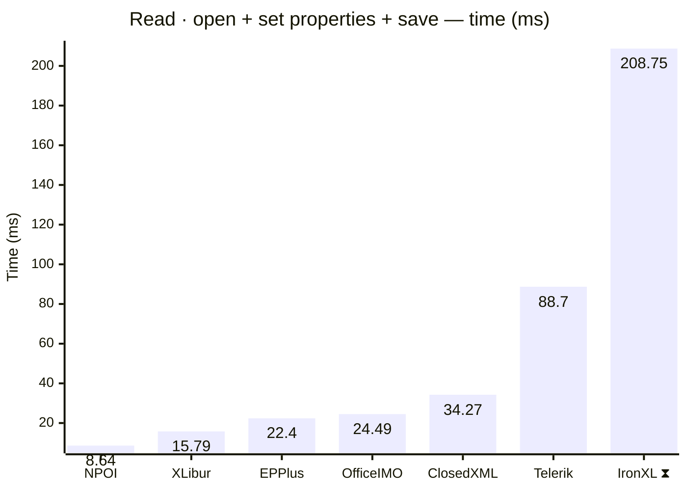
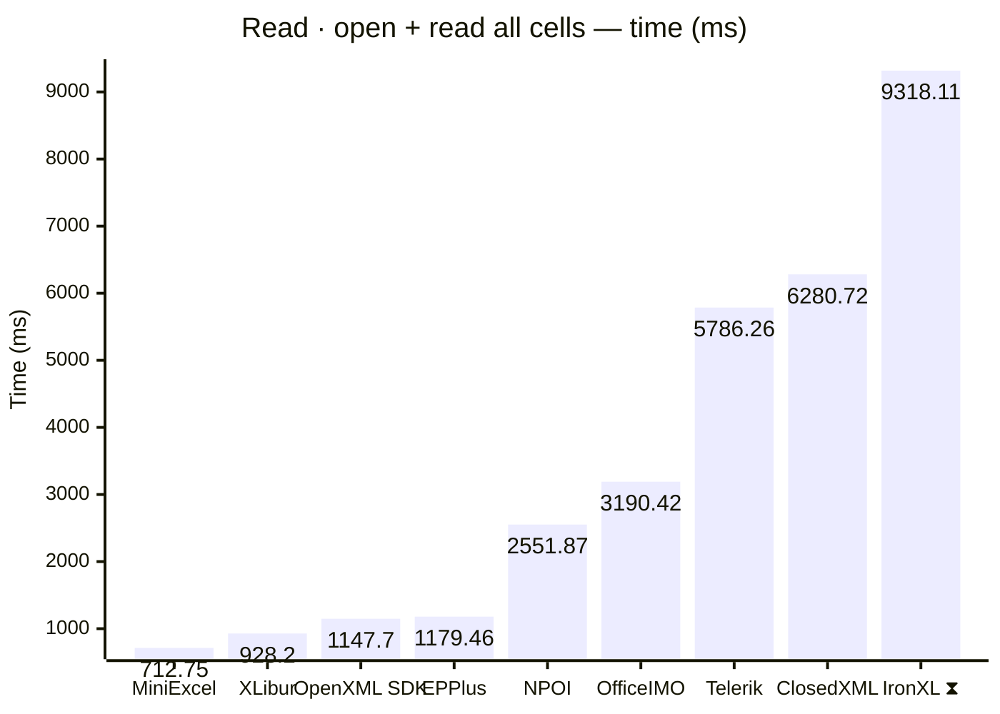
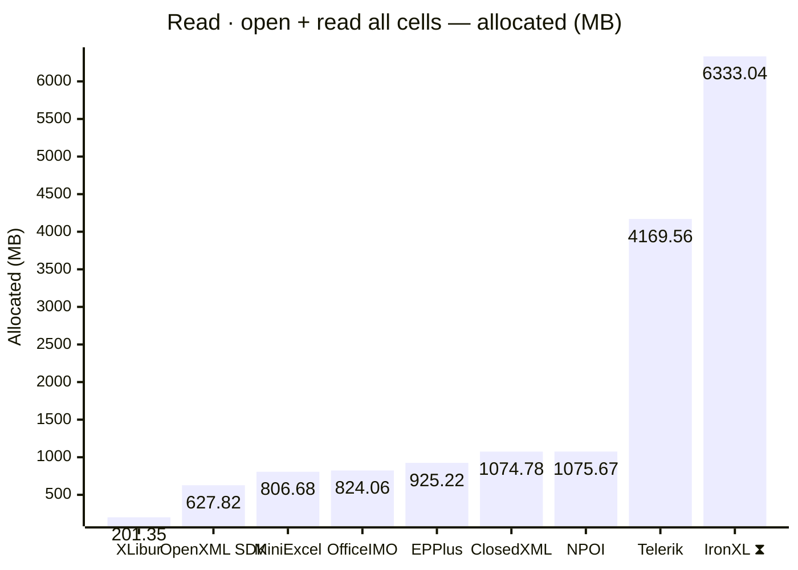
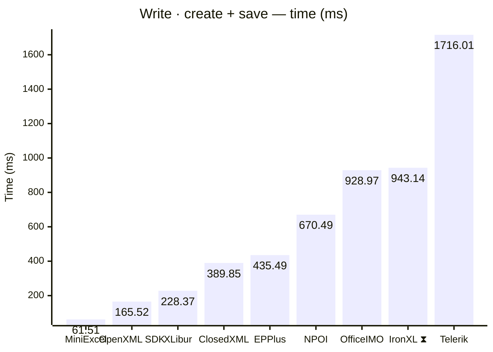
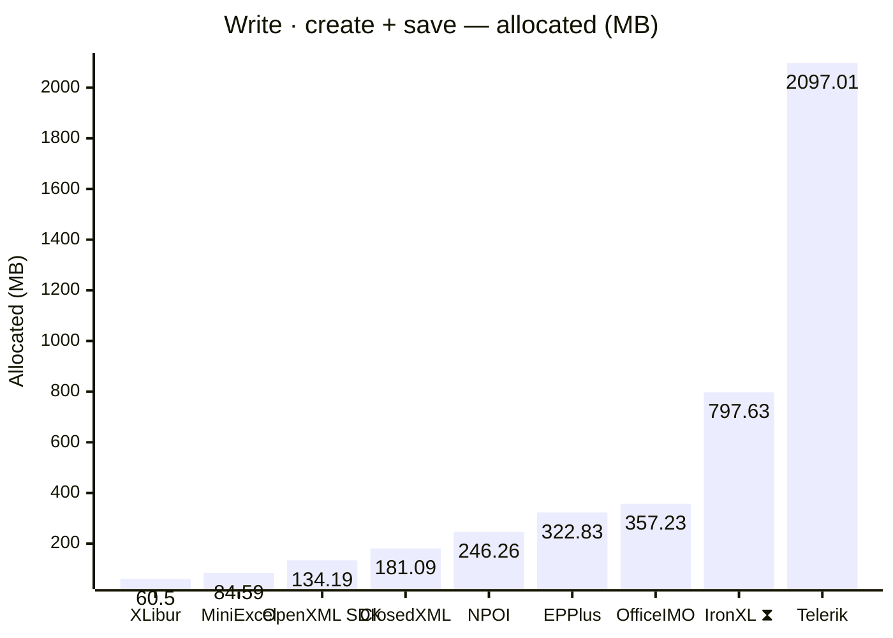
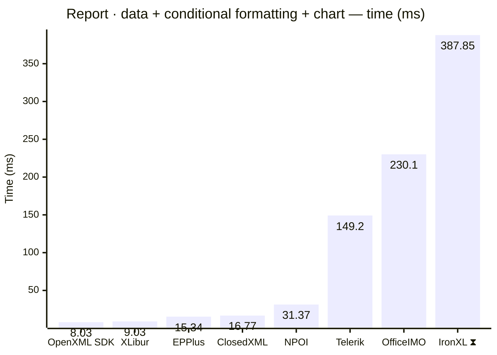
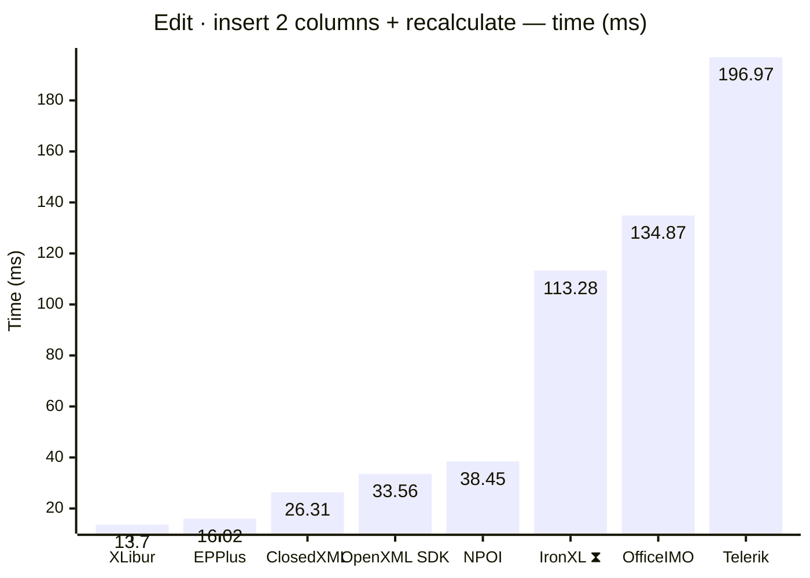
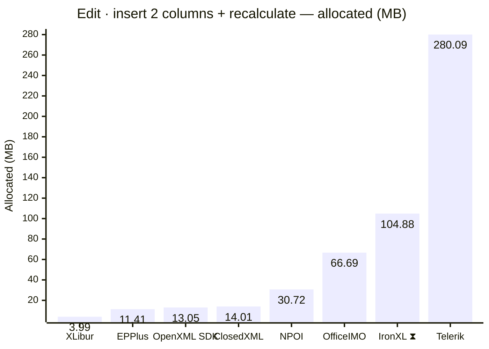

<style>
  .main-content { max-width: 90% !important; padding-left: 2rem !important; padding-right: 2rem !important; }
</style>
<!-- Generated by XLBench. Do not edit by hand; re-run scripts/run-benchmarks.ps1. -->
# XLBench Results

Each section below embeds the full BenchmarkDotNet environment block (OS, CPU,
.NET SDK and runtime). Timings are hardware-specific; treat the allocation/GC
columns as the most portable signal across machines. Regenerate locally with
`scripts/run-benchmarks.ps1`.

📈 **[Interactive charts](charts.html)** (GitHub Pages). Static charts and the full tables follow.

Each results table (one per test method) is heat-mapped independently on the Pages site (🟩 best → 🟥 worst).

> ⧗ **Carried over from an earlier run.** The rows and chart points below marked with this symbol were not measured here — the library is commercial and needs a licence key this run did not have — so they are replayed from `snapshots/`. Compare them as indicative rather than like-for-like, and see the repository README for how to refresh a snapshot.
>
> - **IronXL** 2026.8.1, Job-HTCPYF job, captured 2026-08-03 on same hardware as this run.

## Libraries under test

| Library | Version | Source |
| --- | --- | --- |
| ClosedXML | 0.105.1 | this run |
| EPPlus | 8.7.1 | this run |
| OpenXML SDK | 3.5.1 | this run |
| NPOI | 2.8.1 | this run |
| MiniExcel | 1.46.0 | this run |
| XLibur | 0.620.0 | this run |
| OfficeIMO | 3.4.3 | this run |
| Telerik | 2026.3.923.100 | this run |
| IronXL ⧗ | 2026.8.1 | snapshot (2026.8.1, Job-HTCPYF, captured 2026-08-03) |

## Comparison charts

_Lower is better. Charts render in the GitHub file view; the Pages site has interactive versions._


```mermaid
---
config:
  xyChart:
    showDataLabel: true
---
xychart-beta
    title "Read · open + set properties + save — time (ms)"
    x-axis ["NPOI", "XLibur", "EPPlus", "OfficeIMO", "ClosedXML", "Telerik", "IronXL ⧗"]
    y-axis "Time (ms)"
    bar [8.64, 15.79, 22.4, 24.49, 34.27, 88.7, 208.75]
```


```mermaid
---
config:
  xyChart:
    showDataLabel: true
---
xychart-beta
    title "Read · open + set properties + save — allocated (MB)"
    x-axis ["XLibur", "NPOI", "OfficeIMO", "ClosedXML", "EPPlus", "IronXL ⧗", "Telerik"]
    y-axis "Allocated (MB)"
    bar [1.73, 1.89, 6.58, 13.18, 13.81, 152.81, 185.2]
```


```mermaid
---
config:
  xyChart:
    showDataLabel: true
---
xychart-beta
    title "Read · open + read all cells — time (ms)"
    x-axis ["MiniExcel", "XLibur", "OpenXML SDK", "EPPlus", "NPOI", "OfficeIMO", "Telerik", "ClosedXML", "IronXL ⧗"]
    y-axis "Time (ms)"
    bar [712.75, 928.2, 1147.7, 1179.46, 2551.87, 3190.42, 5786.26, 6280.72, 9318.11]
```


```mermaid
---
config:
  xyChart:
    showDataLabel: true
---
xychart-beta
    title "Read · open + read all cells — allocated (MB)"
    x-axis ["XLibur", "OpenXML SDK", "MiniExcel", "OfficeIMO", "EPPlus", "ClosedXML", "NPOI", "Telerik", "IronXL ⧗"]
    y-axis "Allocated (MB)"
    bar [201.35, 627.82, 806.68, 824.06, 925.22, 1074.78, 1075.67, 4169.56, 6333.04]
```


```mermaid
---
config:
  xyChart:
    showDataLabel: true
---
xychart-beta
    title "Write · create + save — time (ms)"
    x-axis ["MiniExcel", "OpenXML SDK", "XLibur", "ClosedXML", "EPPlus", "NPOI", "OfficeIMO", "IronXL ⧗", "Telerik"]
    y-axis "Time (ms)"
    bar [61.51, 165.52, 228.37, 389.85, 435.49, 670.49, 928.97, 943.14, 1716.01]
```


```mermaid
---
config:
  xyChart:
    showDataLabel: true
---
xychart-beta
    title "Write · create + save — allocated (MB)"
    x-axis ["XLibur", "MiniExcel", "OpenXML SDK", "ClosedXML", "NPOI", "EPPlus", "OfficeIMO", "IronXL ⧗", "Telerik"]
    y-axis "Allocated (MB)"
    bar [60.5, 84.59, 134.19, 181.09, 246.26, 322.83, 357.23, 797.63, 2097.01]
```


```mermaid
---
config:
  xyChart:
    showDataLabel: true
---
xychart-beta
    title "Report · data + conditional formatting + chart — time (ms)"
    x-axis ["OpenXML SDK", "XLibur", "EPPlus", "ClosedXML", "NPOI", "Telerik", "OfficeIMO", "IronXL ⧗"]
    y-axis "Time (ms)"
    bar [8.03, 9.03, 15.34, 16.77, 31.37, 149.2, 230.1, 387.85]
```


```mermaid
---
config:
  xyChart:
    showDataLabel: true
---
xychart-beta
    title "Report · data + conditional formatting + chart — allocated (MB)"
    x-axis ["XLibur", "OpenXML SDK", "ClosedXML", "EPPlus", "NPOI", "IronXL ⧗", "Telerik", "OfficeIMO"]
    y-axis "Allocated (MB)"
    bar [3.35, 4.92, 8.02, 13.92, 16.43, 237.38, 432.13, 904.68]
```


```mermaid
---
config:
  xyChart:
    showDataLabel: true
---
xychart-beta
    title "Edit · delete rows + set column + recalculate — time (ms)"
    x-axis ["XLibur", "OpenXML SDK", "EPPlus", "ClosedXML", "NPOI", "IronXL ⧗", "OfficeIMO", "Telerik"]
    y-axis "Time (ms)"
    bar [11.89, 25.34, 84.19, 340.08, 389.9, 1577.27, 2741.01, 6367.98]
```


```mermaid
---
config:
  xyChart:
    showDataLabel: true
---
xychart-beta
    title "Edit · delete rows + set column + recalculate — allocated (MB)"
    x-axis ["XLibur", "OpenXML SDK", "EPPlus", "ClosedXML", "NPOI", "OfficeIMO", "IronXL ⧗", "Telerik"]
    y-axis "Allocated (MB)"
    bar [3.63, 9.8, 142.49, 337.69, 413.38, 491.24, 753.86, 16819.16]
```


```mermaid
---
config:
  xyChart:
    showDataLabel: true
---
xychart-beta
    title "Edit · insert 2 columns + recalculate — time (ms)"
    x-axis ["XLibur", "EPPlus", "ClosedXML", "OpenXML SDK", "NPOI", "IronXL ⧗", "OfficeIMO", "Telerik"]
    y-axis "Time (ms)"
    bar [13.7, 16.02, 26.31, 33.56, 38.45, 113.28, 134.87, 196.97]
```


```mermaid
---
config:
  xyChart:
    showDataLabel: true
---
xychart-beta
    title "Edit · insert 2 columns + recalculate — allocated (MB)"
    x-axis ["XLibur", "EPPlus", "OpenXML SDK", "ClosedXML", "NPOI", "OfficeIMO", "IronXL ⧗", "Telerik"]
    y-axis "Allocated (MB)"
    bar [3.99, 11.41, 13.05, 14.01, 30.72, 66.69, 104.88, 280.09]
```

## Detailed results


```

BenchmarkDotNet v0.15.8, Windows 11 (10.0.22631.6199/23H2/2023Update/SunValley3)
AMD Ryzen 9 5950X 3.40GHz, 1 CPU, 32 logical and 16 physical cores
.NET SDK 10.0.401
  [Host]     : .NET 10.0.12 (10.0.12, 10.0.1226.42308), X64 RyuJIT x86-64-v3
  DefaultJob : .NET 10.0.12 (10.0.12, 10.0.1226.42308), X64 RyuJIT x86-64-v3


```

### Read · open + set properties + save

| Library     | Type                      | Method                      | Mean         | Error       | StdDev      | Median       | Gen0         | Gen1        | Gen2       | Allocated   |
|------------ |-------------------------- |---------------------------- |-------------:|------------:|------------:|-------------:|-------------:|------------:|-----------:|------------:|
| NPOI        | NpoiReadBenchmarks        | OpenAmendPropertiesAndSave  |     8.638 ms |   0.1054 ms |   0.0985 ms |     8.606 ms |      62.5000 |     31.2500 |          - |     1.89 MB |
| XLibur      | XLiburReadBenchmarks      | OpenAmendPropertiesAndSave  |    15.792 ms |   0.3117 ms |   0.2763 ms |    15.807 ms |      76.9231 |           - |          - |     1.73 MB |
| EPPlus      | EpPlusReadBenchmarks      | OpenAmendPropertiesAndSave  |    22.396 ms |   0.4359 ms |   0.5353 ms |    22.289 ms |    1000.0000 |   1000.0000 |  1000.0000 |    13.81 MB |
| OfficeIMO   | OfficeImoReadBenchmarks   | OpenAmendPropertiesAndSave  |    24.486 ms |   0.3316 ms |   0.2769 ms |    24.461 ms |     562.5000 |    437.5000 |   406.2500 |     6.58 MB |
| ClosedXML   | ClosedXmlReadBenchmarks   | OpenAmendPropertiesAndSave  |    34.267 ms |   0.6718 ms |   0.7189 ms |    34.228 ms |     666.6667 |    333.3333 |          - |    13.18 MB |
| Telerik     | TelerikReadBenchmarks     | OpenAmendPropertiesAndSave  |    88.695 ms |   1.2467 ms |   0.9733 ms |    88.620 ms |   11000.0000 |   1500.0000 |  1000.0000 |    185.2 MB |
| IronXL ⧗ | IronXlReadBenchmarks | OpenAmendPropertiesAndSave | 208.746 ms | 155.7570 ms | 92.6885 ms | 168.705 ms | 9000.0000 | 2000.0000 | - | 152.81 MB |

### Read · open + read all cells

| Library     | Type                      | Method                      | Mean         | Error       | StdDev      | Median       | Gen0         | Gen1        | Gen2       | Allocated   |
|------------ |-------------------------- |---------------------------- |-------------:|------------:|------------:|-------------:|-------------:|------------:|-----------:|------------:|
| MiniExcel   | MiniExcelReadBenchmarks   | OpenAndReadAll              |   712.751 ms |  11.5137 ms |  10.7699 ms |   713.661 ms |   50000.0000 |   3000.0000 |          - |   806.68 MB |
| XLibur      | XLiburReadBenchmarks      | OpenAndReadAll              |   928.197 ms |  17.2491 ms |  16.9410 ms |   928.205 ms |   13000.0000 |   8000.0000 |  2000.0000 |   201.35 MB |
| OpenXML SDK | OpenXmlReadBenchmarks     | OpenAndReadAll              | 1,147.704 ms |  12.6305 ms |  11.1966 ms | 1,148.175 ms |   40000.0000 |   6000.0000 |  1000.0000 |   627.82 MB |
| EPPlus      | EpPlusReadBenchmarks      | OpenAndReadAll              | 1,179.462 ms |  11.3458 ms |  10.6128 ms | 1,183.520 ms |   49000.0000 |  14000.0000 |  7000.0000 |   925.22 MB |
| NPOI        | NpoiReadBenchmarks        | OpenAndReadAll              | 2,551.870 ms |  50.8915 ms |  56.5658 ms | 2,530.541 ms |   68000.0000 |  62000.0000 |  6000.0000 |  1075.67 MB |
| OfficeIMO   | OfficeImoReadBenchmarks   | OpenAndReadAll              | 3,190.423 ms |  62.3709 ms |  74.2482 ms | 3,188.026 ms |   53000.0000 |  39000.0000 |  5000.0000 |   824.06 MB |
| Telerik     | TelerikReadBenchmarks     | OpenAndReadAll              | 5,786.262 ms | 115.7225 ms | 146.3519 ms | 5,761.102 ms |  253000.0000 |  52000.0000 |  6000.0000 |  4169.56 MB |
| ClosedXML   | ClosedXmlReadBenchmarks   | OpenAndReadAll              | 6,280.719 ms | 121.2464 ms | 113.4140 ms | 6,275.507 ms |   60000.0000 |  24000.0000 |  4000.0000 |  1074.78 MB |
| IronXL ⧗ | IronXlReadBenchmarks | OpenAndReadAll | 9,318.107 ms | 477.3336 ms | 315.7266 ms | 9,377.407 ms | 393000.0000 | 202000.0000 | 10000.0000 | 6333.04 MB |

### Write · create + save

| Library     | Type                      | Method                      | Mean         | Error       | StdDev      | Median       | Gen0         | Gen1        | Gen2       | Allocated   |
|------------ |-------------------------- |---------------------------- |-------------:|------------:|------------:|-------------:|-------------:|------------:|-----------:|------------:|
| MiniExcel   | MiniExcelWriteBenchmarks  | CreateAndSave               |    61.510 ms |   1.1734 ms |   1.3969 ms |    61.848 ms |    5666.6667 |   1777.7778 |  1666.6667 |    84.59 MB |
| OpenXML SDK | OpenXmlWriteBenchmarks    | CreateAndSave               |   165.523 ms |   3.2589 ms |   3.2007 ms |   164.367 ms |    9000.0000 |   2333.3333 |  2333.3333 |   134.19 MB |
| XLibur      | XLiburWriteBenchmarks     | CreateAndSave               |   228.370 ms |   4.5117 ms |   7.4129 ms |   226.585 ms |    3000.0000 |   2000.0000 |  2000.0000 |     60.5 MB |
| ClosedXML   | ClosedXmlWriteBenchmarks  | CreateAndSave               |   389.849 ms |   7.4736 ms |   9.1783 ms |   388.933 ms |   10000.0000 |   5000.0000 |  2000.0000 |   181.09 MB |
| EPPlus      | EpPlusWriteBenchmarks     | CreateAndSave               |   435.492 ms |   5.4466 ms |   5.0947 ms |   435.669 ms |   20000.0000 |   9000.0000 |  3000.0000 |   322.83 MB |
| NPOI        | NpoiWriteBenchmarks       | CreateAndSave               |   670.493 ms |  13.0406 ms |  12.1982 ms |   668.970 ms |   16000.0000 |  12000.0000 |  3000.0000 |   246.26 MB |
| OfficeIMO   | OfficeImoWriteBenchmarks  | CreateAndSave               |   928.970 ms |  18.5121 ms |  19.0105 ms |   929.545 ms |   19000.0000 |  13000.0000 |  3000.0000 |   357.23 MB |
| IronXL ⧗ | IronXlWriteBenchmarks | CreateAndSave | 943.137 ms | 18.5191 ms | 11.0204 ms | 938.999 ms | 48000.0000 | 16000.0000 | 3000.0000 | 797.63 MB |
| Telerik     | TelerikWriteBenchmarks    | CreateAndSave               | 1,716.014 ms |  28.6202 ms |  25.3711 ms | 1,710.023 ms |  130000.0000 |  13000.0000 |  5000.0000 |  2097.01 MB |

### Report · data + conditional formatting + chart

| Library     | Type                      | Method                      | Mean         | Error       | StdDev      | Median       | Gen0         | Gen1        | Gen2       | Allocated   |
|------------ |-------------------------- |---------------------------- |-------------:|------------:|------------:|-------------:|-------------:|------------:|-----------:|------------:|
| OpenXML SDK | OpenXmlReportBenchmarks   | CreateStockReport           |     8.029 ms |   0.0752 ms |   0.0666 ms |     8.023 ms |     375.0000 |    359.3750 |   187.5000 |     4.92 MB |
| XLibur      | XLiburReportBenchmarks    | CreateStockReport           |     9.025 ms |   0.1658 ms |   0.1551 ms |     9.025 ms |     187.5000 |    187.5000 |   187.5000 |     3.35 MB |
| EPPlus      | EpPlusReportBenchmarks    | CreateStockReport           |    15.340 ms |   0.3066 ms |   0.7405 ms |    15.237 ms |    1000.0000 |   1000.0000 |  1000.0000 |    13.92 MB |
| ClosedXML   | ClosedXmlReportBenchmarks | CreateStockReport           |    16.771 ms |   0.3288 ms |   0.3518 ms |    16.789 ms |     468.7500 |    187.5000 |    31.2500 |     8.02 MB |
| NPOI        | NpoiReportBenchmarks      | CreateStockReport           |    31.366 ms |   0.6025 ms |   0.5917 ms |    31.600 ms |     875.0000 |    750.0000 |   375.0000 |    16.43 MB |
| Telerik     | TelerikReportBenchmarks   | CreateStockReport           |   149.198 ms |   2.9560 ms |   6.2351 ms |   151.540 ms |   27000.0000 |   6000.0000 |  2000.0000 |   432.13 MB |
| OfficeIMO   | OfficeImoReportBenchmarks | CreateStockReport           |   230.101 ms |   4.5737 ms |   4.0545 ms |   229.687 ms |   56000.0000 |   2000.0000 |          - |   904.68 MB |
| IronXL ⧗ | IronXlReportBenchmarks | CreateStockReport | 387.849 ms | 36.5456 ms | 24.1726 ms | 384.092 ms | 14000.0000 | 3000.0000 | - | 237.38 MB |

### Edit · delete rows + set column + recalculate

| Library     | Type                      | Method                      | Mean         | Error       | StdDev      | Median       | Gen0         | Gen1        | Gen2       | Allocated   |
|------------ |-------------------------- |---------------------------- |-------------:|------------:|------------:|-------------:|-------------:|------------:|-----------:|------------:|
| XLibur      | XLiburEditBenchmarks      | EditAndRecalculate          |    11.890 ms |   0.1785 ms |   0.1490 ms |    11.891 ms |     218.7500 |     93.7500 |          - |     3.63 MB |
| OpenXML SDK | OpenXmlEditBenchmarks     | EditAndRecalculate          |    25.342 ms |   0.4831 ms |   0.5933 ms |    25.311 ms |     718.7500 |    656.2500 |   156.2500 |      9.8 MB |
| EPPlus      | EpPlusEditBenchmarks      | EditAndRecalculate          |    84.189 ms |   1.6259 ms |   1.5209 ms |    84.354 ms |    9000.0000 |   1200.0000 |  1000.0000 |   142.49 MB |
| ClosedXML   | ClosedXmlEditBenchmarks   | EditAndRecalculate          |   340.078 ms |   6.5275 ms |   8.2552 ms |   342.498 ms |   21000.0000 |   1000.0000 |          - |   337.69 MB |
| NPOI        | NpoiEditBenchmarks        | EditAndRecalculate          |   389.896 ms |   7.6983 ms |   8.5566 ms |   388.930 ms |   25000.0000 |   1000.0000 |          - |   413.38 MB |
| IronXL ⧗ | IronXlEditBenchmarks | EditAndRecalculate | 1,577.273 ms | 62.9583 ms | 41.6430 ms | 1,583.098 ms | 57000.0000 | 36000.0000 | 15000.0000 | 753.86 MB |
| OfficeIMO   | OfficeImoEditBenchmarks   | EditAndRecalculate          | 2,741.005 ms |  31.0020 ms |  27.4824 ms | 2,746.280 ms |   30000.0000 |   1000.0000 |          - |   491.24 MB |
| Telerik     | TelerikEditBenchmarks     | EditAndRecalculate          | 6,367.984 ms | 127.1526 ms | 229.2823 ms | 6,406.474 ms | 1066000.0000 | 248000.0000 | 81000.0000 | 16819.16 MB |

### Edit · insert 2 columns + recalculate

| Library     | Type                      | Method                      | Mean         | Error       | StdDev      | Median       | Gen0         | Gen1        | Gen2       | Allocated   |
|------------ |-------------------------- |---------------------------- |-------------:|------------:|------------:|-------------:|-------------:|------------:|-----------:|------------:|
| XLibur      | XLiburInsertBenchmarks    | InsertColumnsAndRecalculate |    13.698 ms |   0.2710 ms |   0.4747 ms |    13.638 ms |     200.0000 |    100.0000 |          - |     3.99 MB |
| EPPlus      | EpPlusInsertBenchmarks    | InsertColumnsAndRecalculate |    16.016 ms |   0.3180 ms |   0.6051 ms |    15.979 ms |    1000.0000 |   1000.0000 |  1000.0000 |    11.41 MB |
| ClosedXML   | ClosedXmlInsertBenchmarks | InsertColumnsAndRecalculate |    26.313 ms |   0.5252 ms |   1.0244 ms |    26.157 ms |     750.0000 |    250.0000 |          - |    14.01 MB |
| OpenXML SDK | OpenXmlInsertBenchmarks   | InsertColumnsAndRecalculate |    33.557 ms |   0.6554 ms |   0.7548 ms |    33.486 ms |    1066.6667 |    933.3333 |   400.0000 |    13.05 MB |
| NPOI        | NpoiInsertBenchmarks      | InsertColumnsAndRecalculate |    38.446 ms |   0.8055 ms |   2.2587 ms |    38.113 ms |    2000.0000 |   1333.3333 |   500.0000 |    30.72 MB |
| IronXL ⧗ | IronXlInsertBenchmarks | InsertColumnsAndRecalculate | 113.284 ms | 41.9750 ms | 27.7638 ms | 97.052 ms | 7000.0000 | 2500.0000 | 750.0000 | 104.88 MB |
| OfficeIMO   | OfficeImoInsertBenchmarks | InsertColumnsAndRecalculate |   134.865 ms |   2.6747 ms |   5.4636 ms |   133.291 ms |    3000.0000 |   1000.0000 |          - |    66.69 MB |
| Telerik     | TelerikInsertBenchmarks   | InsertColumnsAndRecalculate |   196.973 ms |   4.2642 ms |  12.0272 ms |   195.026 ms |   18000.0000 |   6000.0000 |  2000.0000 |   280.09 MB |


<script type="module">
  import mermaid from 'https://cdn.jsdelivr.net/npm/mermaid@11/dist/mermaid.esm.min.mjs';
  const blocks = document.querySelectorAll('.language-mermaid');
  blocks.forEach(el => {
    const code = el.querySelector('code') || el;
    const pre = document.createElement('pre');
    pre.className = 'mermaid';
    pre.textContent = code.textContent;
    el.replaceWith(pre);
  });
  if (blocks.length) {
    mermaid.initialize({ startOnLoad: false });
    await mermaid.run({ querySelector: 'pre.mermaid' });
  }
</script>

<script>
(function () {
  const parse = s => { const n = parseFloat(String(s).replace(/,/g, '')); return Number.isFinite(n) ? n : null; };
  document.querySelectorAll('table').forEach(table => {
    if (!table.tHead || !table.tBodies[0]) return;
    const heads = [...table.tHead.rows[0].cells].map(c => c.textContent.trim().toLowerCase());
    if (!heads.includes('mean')) return;
    const metricCols = heads.map((h, i) => /^(mean|allocated|gen0|gen1|gen2)$/.test(h) ? i : -1).filter(i => i >= 0);
    const rows = [...table.tBodies[0].rows];
    for (const c of metricCols) {
      const vals = rows.map(r => parse(r.cells[c]?.textContent));
      const nums = vals.filter(v => v !== null);
      if (nums.length < 2) continue;
      const min = Math.min(...nums), max = Math.max(...nums);
      if (max === min) continue;
      rows.forEach((r, i) => {
        const v = vals[i]; if (v === null) return;
        const ratio = (v - min) / (max - min);
        r.cells[c].style.backgroundColor = `hsla(${120 - 120 * ratio}, 70%, 50%, 0.45)`;
      });
    }
  });
})();
</script>
