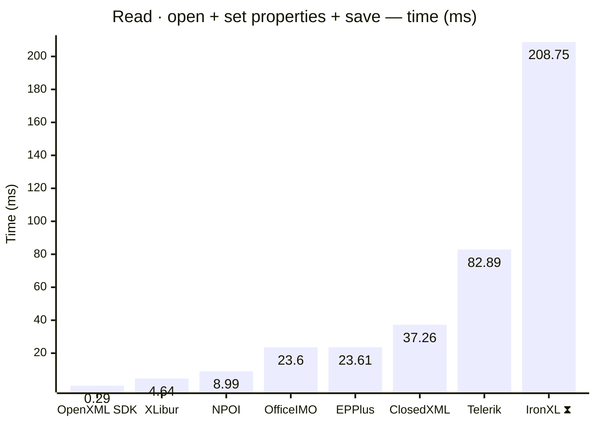
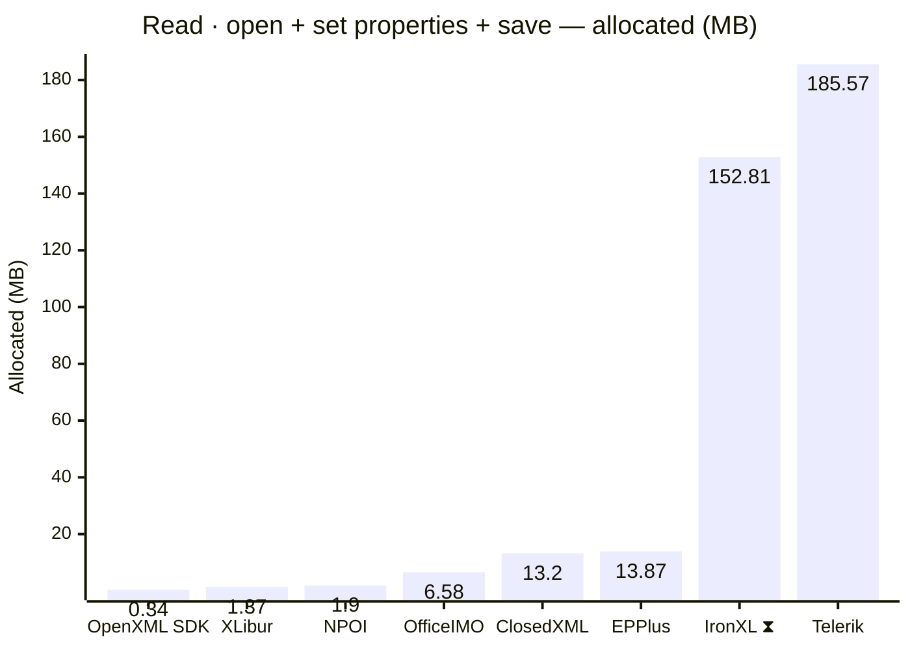
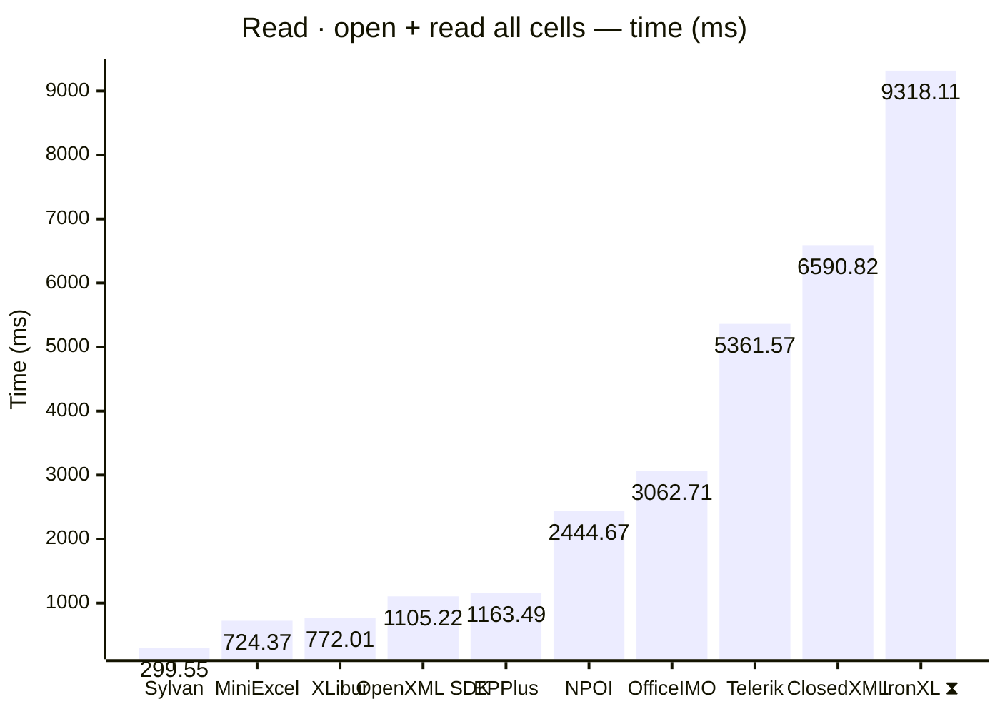
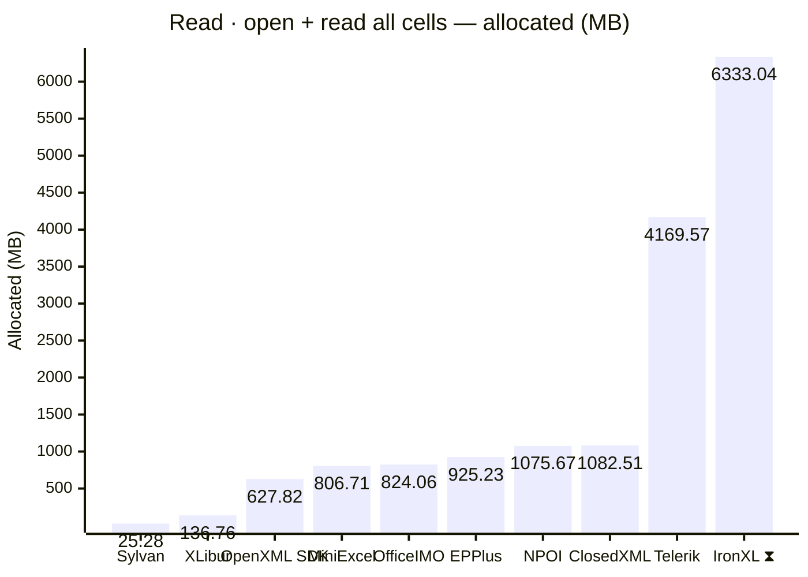
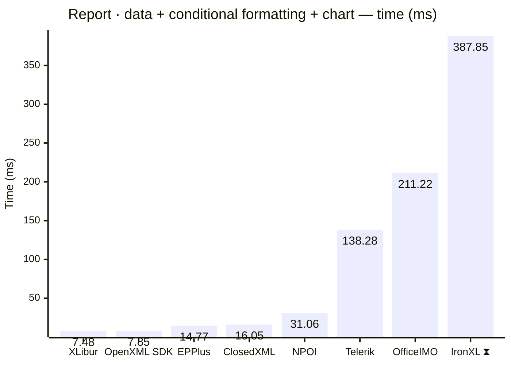
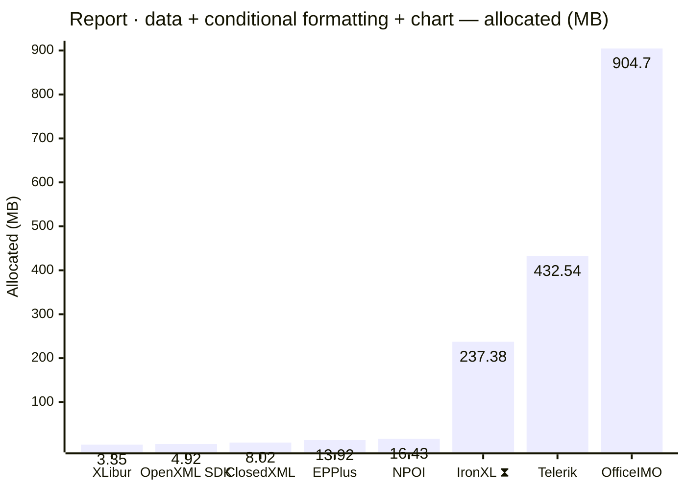
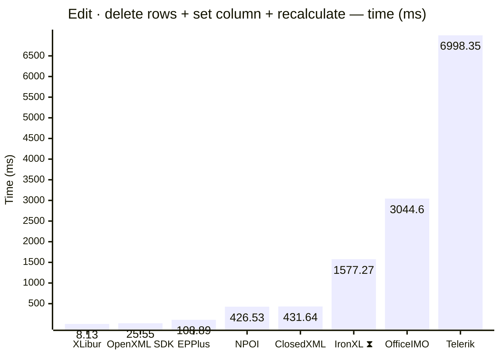
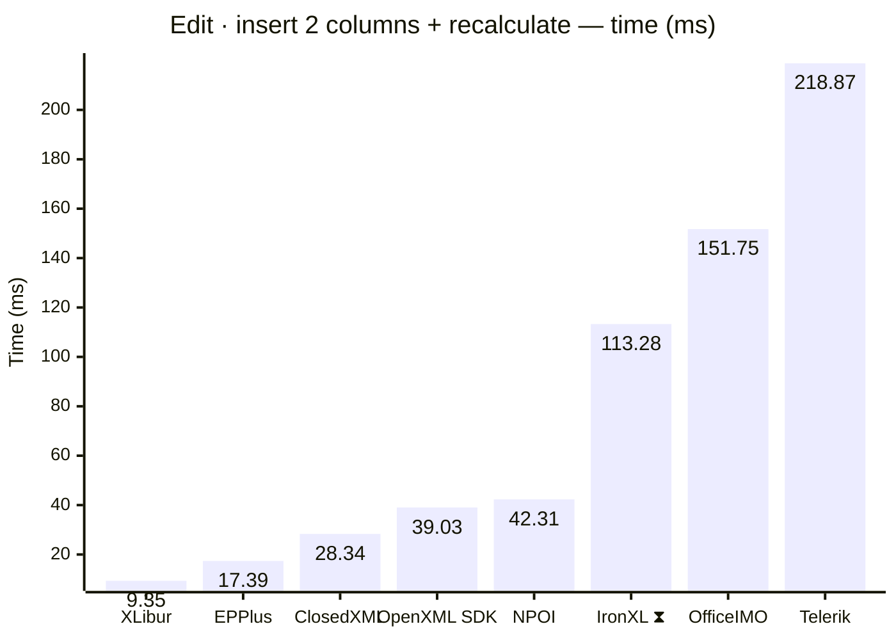

<style>
  .main-content { max-width: 90% !important; padding-left: 2rem !important; padding-right: 2rem !important; }
</style>
<!-- Generated by XLBench. Do not edit by hand; re-run scripts/run-benchmarks.ps1. -->
# XLBench Results

Each section below embeds the full BenchmarkDotNet environment block (OS, CPU,
.NET SDK and runtime). Timings are hardware-specific; treat the allocation/GC
columns as the most portable signal across machines. Regenerate locally with
`scripts/run-benchmarks.ps1`.

📈 **[Interactive charts](charts.html)** (GitHub Pages). Static charts and the full tables follow.

Each results table (one per test method) is heat-mapped independently on the Pages site (🟩 best → 🟥 worst).

> ⧗ **Carried over from an earlier run.** The rows and chart points below marked with this symbol were not measured here — the library is commercial and needs a licence key this run did not have — so they are replayed from `snapshots/`. Compare them as indicative rather than like-for-like, and see the repository README for how to refresh a snapshot.
>
> - **IronXL** 2026.8.1, Job-HTCPYF job, captured 2026-08-03 on same hardware as this run.

## Libraries under test

| Library | Version | Source |
| --- | --- | --- |
| ClosedXML | 0.105.1 | this run |
| EPPlus | 8.7.1 | this run |
| OpenXML SDK | 3.5.1 | this run |
| NPOI | 2.8.1 | this run |
| MiniExcel | 1.46.0 | this run |
| Sylvan | 0.5.8 | this run |
| XLibur | 0.630.1-rc.18 | this run |
| OfficeIMO | 3.4.4 | this run |
| Telerik | 2026.3.923.100 | this run |
| IronXL ⧗ | 2026.8.1 | snapshot (2026.8.1, Job-HTCPYF, captured 2026-08-03) |

## Comparison charts

_Lower is better. Charts render in the GitHub file view; the Pages site has interactive versions._


```mermaid
---
config:
  xyChart:
    showDataLabel: true
---
xychart-beta
    title "Read · open + set properties + save — time (ms)"
    x-axis ["OpenXML SDK", "XLibur", "NPOI", "OfficeIMO", "EPPlus", "ClosedXML", "Telerik", "IronXL ⧗"]
    y-axis "Time (ms)"
    bar [0.29, 4.64, 8.99, 23.6, 23.61, 37.26, 82.89, 208.75]
```


```mermaid
---
config:
  xyChart:
    showDataLabel: true
---
xychart-beta
    title "Read · open + set properties + save — allocated (MB)"
    x-axis ["OpenXML SDK", "XLibur", "NPOI", "OfficeIMO", "ClosedXML", "EPPlus", "IronXL ⧗", "Telerik"]
    y-axis "Allocated (MB)"
    bar [0.34, 1.37, 1.9, 6.58, 13.2, 13.87, 152.81, 185.57]
```


```mermaid
---
config:
  xyChart:
    showDataLabel: true
---
xychart-beta
    title "Read · open + read all cells — time (ms)"
    x-axis ["Sylvan", "MiniExcel", "XLibur", "OpenXML SDK", "EPPlus", "NPOI", "OfficeIMO", "Telerik", "ClosedXML", "IronXL ⧗"]
    y-axis "Time (ms)"
    bar [299.55, 724.37, 772.01, 1105.22, 1163.49, 2444.67, 3062.71, 5361.57, 6590.82, 9318.11]
```


```mermaid
---
config:
  xyChart:
    showDataLabel: true
---
xychart-beta
    title "Read · open + read all cells — allocated (MB)"
    x-axis ["Sylvan", "XLibur", "OpenXML SDK", "MiniExcel", "OfficeIMO", "EPPlus", "NPOI", "ClosedXML", "Telerik", "IronXL ⧗"]
    y-axis "Allocated (MB)"
    bar [25.28, 136.76, 627.82, 806.71, 824.06, 925.23, 1075.67, 1082.51, 4169.57, 6333.04]
```


```mermaid
---
config:
  xyChart:
    showDataLabel: true
---
xychart-beta
    title "Write · create + save — time (ms)"
    x-axis ["Sylvan", "MiniExcel", "OpenXML SDK", "XLibur", "ClosedXML", "EPPlus", "NPOI", "OfficeIMO", "IronXL ⧗", "Telerik"]
    y-axis "Time (ms)"
    bar [38.37, 58.78, 150.72, 180.73, 379.28, 432.71, 641.24, 938.79, 943.14, 1686.14]
```


```mermaid
---
config:
  xyChart:
    showDataLabel: true
---
xychart-beta
    title "Write · create + save — allocated (MB)"
    x-axis ["Sylvan", "XLibur", "MiniExcel", "OpenXML SDK", "ClosedXML", "NPOI", "EPPlus", "OfficeIMO", "IronXL ⧗", "Telerik"]
    y-axis "Allocated (MB)"
    bar [13.27, 60.19, 84.59, 134.19, 181.09, 246.26, 322.89, 361.06, 797.63, 2097]
```


```mermaid
---
config:
  xyChart:
    showDataLabel: true
---
xychart-beta
    title "Report · data + conditional formatting + chart — time (ms)"
    x-axis ["XLibur", "OpenXML SDK", "EPPlus", "ClosedXML", "NPOI", "Telerik", "OfficeIMO", "IronXL ⧗"]
    y-axis "Time (ms)"
    bar [7.48, 7.85, 14.77, 16.05, 31.06, 138.28, 211.22, 387.85]
```


```mermaid
---
config:
  xyChart:
    showDataLabel: true
---
xychart-beta
    title "Report · data + conditional formatting + chart — allocated (MB)"
    x-axis ["XLibur", "OpenXML SDK", "ClosedXML", "EPPlus", "NPOI", "IronXL ⧗", "Telerik", "OfficeIMO"]
    y-axis "Allocated (MB)"
    bar [3.35, 4.92, 8.02, 13.92, 16.43, 237.38, 432.54, 904.7]
```


```mermaid
---
config:
  xyChart:
    showDataLabel: true
---
xychart-beta
    title "Edit · delete rows + set column + recalculate — time (ms)"
    x-axis ["XLibur", "OpenXML SDK", "EPPlus", "NPOI", "ClosedXML", "IronXL ⧗", "OfficeIMO", "Telerik"]
    y-axis "Time (ms)"
    bar [8.13, 25.55, 108.89, 426.53, 431.64, 1577.27, 3044.6, 6998.35]
```


```mermaid
---
config:
  xyChart:
    showDataLabel: true
---
xychart-beta
    title "Edit · delete rows + set column + recalculate — allocated (MB)"
    x-axis ["XLibur", "OpenXML SDK", "EPPlus", "ClosedXML", "NPOI", "OfficeIMO", "IronXL ⧗", "Telerik"]
    y-axis "Allocated (MB)"
    bar [2.68, 9.83, 142.49, 337.87, 413.44, 491.27, 753.86, 16837.76]
```


```mermaid
---
config:
  xyChart:
    showDataLabel: true
---
xychart-beta
    title "Edit · insert 2 columns + recalculate — time (ms)"
    x-axis ["XLibur", "EPPlus", "ClosedXML", "OpenXML SDK", "NPOI", "IronXL ⧗", "OfficeIMO", "Telerik"]
    y-axis "Time (ms)"
    bar [9.35, 17.39, 28.34, 39.03, 42.31, 113.28, 151.75, 218.87]
```


```mermaid
---
config:
  xyChart:
    showDataLabel: true
---
xychart-beta
    title "Edit · insert 2 columns + recalculate — allocated (MB)"
    x-axis ["XLibur", "EPPlus", "OpenXML SDK", "ClosedXML", "NPOI", "OfficeIMO", "IronXL ⧗", "Telerik"]
    y-axis "Allocated (MB)"
    bar [2.72, 11.41, 13.11, 14.02, 30.77, 66.87, 104.88, 280.56]
```

## Detailed results


```

BenchmarkDotNet v0.15.8, Windows 11 (10.0.22631.6199/23H2/2023Update/SunValley3)
AMD Ryzen 9 5950X 3.40GHz, 1 CPU, 32 logical and 16 physical cores
.NET SDK 10.0.401
  [Host]     : .NET 10.0.12 (10.0.12, 10.0.1226.42308), X64 RyuJIT x86-64-v3
  DefaultJob : .NET 10.0.12 (10.0.12, 10.0.1226.42308), X64 RyuJIT x86-64-v3


```

### Read · open + set properties + save

| Library     | Type                      | Method                      | Mean          | Error       | StdDev      | Median        | Gen0         | Gen1        | Gen2       | Allocated   |
|------------ |-------------------------- |---------------------------- |--------------:|------------:|------------:|--------------:|-------------:|------------:|-----------:|------------:|
| OpenXML SDK | OpenXmlReadBenchmarks     | OpenAmendPropertiesAndSave  |     0.2926 ms |   0.0057 ms |   0.0132 ms |     0.2921 ms |      29.2969 |     18.5547 |    15.6250 |     0.34 MB |
| XLibur      | XLiburReadBenchmarks      | OpenAmendPropertiesAndSave  |     4.6433 ms |   0.0910 ms |   0.1664 ms |     4.6250 ms |      62.5000 |     31.2500 |          - |     1.37 MB |
| NPOI        | NpoiReadBenchmarks        | OpenAmendPropertiesAndSave  |     8.9877 ms |   0.1337 ms |   0.1251 ms |     8.9705 ms |      62.5000 |     31.2500 |          - |      1.9 MB |
| OfficeIMO   | OfficeImoReadBenchmarks   | OpenAmendPropertiesAndSave  |    23.5969 ms |   0.2362 ms |   0.1844 ms |    23.5568 ms |     562.5000 |    437.5000 |   406.2500 |     6.58 MB |
| EPPlus      | EpPlusReadBenchmarks      | OpenAmendPropertiesAndSave  |    23.6104 ms |   0.3413 ms |   0.3025 ms |    23.5916 ms |    1000.0000 |   1000.0000 |  1000.0000 |    13.87 MB |
| ClosedXML   | ClosedXmlReadBenchmarks   | OpenAmendPropertiesAndSave  |    37.2554 ms |   0.6842 ms |   1.7538 ms |    36.7543 ms |     800.0000 |    400.0000 |          - |     13.2 MB |
| Telerik     | TelerikReadBenchmarks     | OpenAmendPropertiesAndSave  |    82.8894 ms |   1.6500 ms |   2.2585 ms |    83.3659 ms |   10666.6667 |   1000.0000 |   666.6667 |   185.57 MB |
| IronXL ⧗ | IronXlReadBenchmarks | OpenAmendPropertiesAndSave | 208.746 ms | 155.7570 ms | 92.6885 ms | 168.705 ms | 9000.0000 | 2000.0000 | - | 152.81 MB |

### Read · open + read all cells

| Library     | Type                      | Method                      | Mean          | Error       | StdDev      | Median        | Gen0         | Gen1        | Gen2       | Allocated   |
|------------ |-------------------------- |---------------------------- |--------------:|------------:|------------:|--------------:|-------------:|------------:|-----------:|------------:|
| Sylvan      | SylvanReadBenchmarks      | OpenAndReadAll              |   299.5476 ms |   3.0312 ms |   2.8354 ms |   298.6628 ms |    1000.0000 |    500.0000 |          - |    25.28 MB |
| MiniExcel   | MiniExcelReadBenchmarks   | OpenAndReadAll              |   724.3653 ms |   7.2053 ms |   6.7399 ms |   722.3058 ms |   51000.0000 |   4000.0000 |  1000.0000 |   806.71 MB |
| XLibur      | XLiburReadBenchmarks      | OpenAndReadAll              |   772.0097 ms |   9.7858 ms |   9.1536 ms |   773.4865 ms |    8000.0000 |   5000.0000 |  1000.0000 |   136.76 MB |
| OpenXML SDK | OpenXmlReadBenchmarks     | OpenAndReadAll              | 1,105.2172 ms |  13.3264 ms |  12.4655 ms | 1,105.8823 ms |   40000.0000 |   6000.0000 |  1000.0000 |   627.82 MB |
| EPPlus      | EpPlusReadBenchmarks      | OpenAndReadAll              | 1,163.4871 ms |  20.3593 ms |  18.0480 ms | 1,166.6611 ms |   49000.0000 |  14000.0000 |  7000.0000 |   925.23 MB |
| NPOI        | NpoiReadBenchmarks        | OpenAndReadAll              | 2,444.6708 ms |  46.6560 ms |  49.9214 ms | 2,432.8925 ms |   68000.0000 |  62000.0000 |  6000.0000 |  1075.67 MB |
| OfficeIMO   | OfficeImoReadBenchmarks   | OpenAndReadAll              | 3,062.7098 ms |  43.6077 ms |  38.6571 ms | 3,061.4738 ms |   53000.0000 |  39000.0000 |  5000.0000 |   824.06 MB |
| Telerik     | TelerikReadBenchmarks     | OpenAndReadAll              | 5,361.5710 ms |  45.6645 ms |  40.4804 ms | 5,351.9473 ms |  253000.0000 |  52000.0000 |  6000.0000 |  4169.57 MB |
| ClosedXML   | ClosedXmlReadBenchmarks   | OpenAndReadAll              | 6,590.8175 ms |  43.1224 ms |  38.2269 ms | 6,591.2324 ms |   59000.0000 |  23000.0000 |  3000.0000 |  1082.51 MB |
| IronXL ⧗ | IronXlReadBenchmarks | OpenAndReadAll | 9,318.107 ms | 477.3336 ms | 315.7266 ms | 9,377.407 ms | 393000.0000 | 202000.0000 | 10000.0000 | 6333.04 MB |

### Write · create + save

| Library     | Type                      | Method                      | Mean          | Error       | StdDev      | Median        | Gen0         | Gen1        | Gen2       | Allocated   |
|------------ |-------------------------- |---------------------------- |--------------:|------------:|------------:|--------------:|-------------:|------------:|-----------:|------------:|
| Sylvan      | SylvanWriteBenchmarks     | CreateAndSave               |    38.3708 ms |   0.7672 ms |   1.0755 ms |    38.3984 ms |    1714.2857 |   1642.8571 |  1500.0000 |    13.27 MB |
| MiniExcel   | MiniExcelWriteBenchmarks  | CreateAndSave               |    58.7767 ms |   1.1611 ms |   1.5501 ms |    59.2379 ms |    5333.3333 |   1444.4444 |  1333.3333 |    84.59 MB |
| OpenXML SDK | OpenXmlWriteBenchmarks    | CreateAndSave               |   150.7181 ms |   1.5970 ms |   1.4157 ms |   150.6293 ms |    8000.0000 |   2000.0000 |  2000.0000 |   134.19 MB |
| XLibur      | XLiburWriteBenchmarks     | CreateAndSave               |   180.7263 ms |   3.4520 ms |   7.2055 ms |   179.0123 ms |    3000.0000 |   2500.0000 |  2000.0000 |    60.19 MB |
| ClosedXML   | ClosedXmlWriteBenchmarks  | CreateAndSave               |   379.2798 ms |   7.5325 ms |  10.5595 ms |   378.5064 ms |   11000.0000 |   6000.0000 |  3000.0000 |   181.09 MB |
| EPPlus      | EpPlusWriteBenchmarks     | CreateAndSave               |   432.7059 ms |   6.5272 ms |   6.1055 ms |   432.9096 ms |   20000.0000 |   9000.0000 |  3000.0000 |   322.89 MB |
| NPOI        | NpoiWriteBenchmarks       | CreateAndSave               |   641.2387 ms |  12.5557 ms |  13.4344 ms |   637.9651 ms |   14000.0000 |  10000.0000 |  1000.0000 |   246.26 MB |
| OfficeIMO   | OfficeImoWriteBenchmarks  | CreateAndSave               |   938.7875 ms |  18.1743 ms |  17.0002 ms |   935.1267 ms |   19000.0000 |  13000.0000 |  3000.0000 |   361.06 MB |
| IronXL ⧗ | IronXlWriteBenchmarks | CreateAndSave | 943.137 ms | 18.5191 ms | 11.0204 ms | 938.999 ms | 48000.0000 | 16000.0000 | 3000.0000 | 797.63 MB |
| Telerik     | TelerikWriteBenchmarks    | CreateAndSave               | 1,686.1373 ms |  23.1003 ms |  21.6080 ms | 1,685.9446 ms |  130000.0000 |  13000.0000 |  5000.0000 |     2097 MB |

### Report · data + conditional formatting + chart

| Library     | Type                      | Method                      | Mean          | Error       | StdDev      | Median        | Gen0         | Gen1        | Gen2       | Allocated   |
|------------ |-------------------------- |---------------------------- |--------------:|------------:|------------:|--------------:|-------------:|------------:|-----------:|------------:|
| XLibur      | XLiburReportBenchmarks    | CreateStockReport           |     7.4850 ms |   0.1187 ms |   0.1111 ms |     7.4696 ms |     187.5000 |    187.5000 |   187.5000 |     3.35 MB |
| OpenXML SDK | OpenXmlReportBenchmarks   | CreateStockReport           |     7.8456 ms |   0.1078 ms |   0.1009 ms |     7.8519 ms |     375.0000 |    359.3750 |   187.5000 |     4.92 MB |
| EPPlus      | EpPlusReportBenchmarks    | CreateStockReport           |    14.7744 ms |   0.2665 ms |   0.2618 ms |    14.7755 ms |    1000.0000 |   1000.0000 |  1000.0000 |    13.92 MB |
| ClosedXML   | ClosedXmlReportBenchmarks | CreateStockReport           |    16.0515 ms |   0.2600 ms |   0.2305 ms |    16.0634 ms |     468.7500 |    187.5000 |    31.2500 |     8.02 MB |
| NPOI        | NpoiReportBenchmarks      | CreateStockReport           |    31.0555 ms |   0.5784 ms |   0.5411 ms |    30.9846 ms |     875.0000 |    750.0000 |   375.0000 |    16.43 MB |
| Telerik     | TelerikReportBenchmarks   | CreateStockReport           |   138.2812 ms |   3.1119 ms |   9.1266 ms |   136.9434 ms |   27000.0000 |   7000.0000 |  2000.0000 |   432.54 MB |
| OfficeIMO   | OfficeImoReportBenchmarks | CreateStockReport           |   211.2154 ms |   3.7558 ms |   4.6125 ms |   211.0322 ms |   57000.0000 |   2000.0000 |   666.6667 |    904.7 MB |
| IronXL ⧗ | IronXlReportBenchmarks | CreateStockReport | 387.849 ms | 36.5456 ms | 24.1726 ms | 384.092 ms | 14000.0000 | 3000.0000 | - | 237.38 MB |

### Edit · delete rows + set column + recalculate

| Library     | Type                      | Method                      | Mean          | Error       | StdDev      | Median        | Gen0         | Gen1        | Gen2       | Allocated   |
|------------ |-------------------------- |---------------------------- |--------------:|------------:|------------:|--------------:|-------------:|------------:|-----------:|------------:|
| XLibur      | XLiburEditBenchmarks      | EditAndRecalculate          |     8.1345 ms |   0.1546 ms |   0.1840 ms |     8.0815 ms |     156.2500 |     78.1250 |          - |     2.68 MB |
| OpenXML SDK | OpenXmlEditBenchmarks     | EditAndRecalculate          |    25.5515 ms |   0.5048 ms |   0.4957 ms |    25.5053 ms |     687.5000 |    593.7500 |   156.2500 |     9.83 MB |
| EPPlus      | EpPlusEditBenchmarks      | EditAndRecalculate          |   108.8889 ms |   8.7654 ms |  24.1424 ms |   100.1175 ms |    9000.0000 |   1200.0000 |  1000.0000 |   142.49 MB |
| NPOI        | NpoiEditBenchmarks        | EditAndRecalculate          |   426.5312 ms |   8.4631 ms |  17.6657 ms |   421.4851 ms |   25000.0000 |   1000.0000 |          - |   413.44 MB |
| ClosedXML   | ClosedXmlEditBenchmarks   | EditAndRecalculate          |   431.6441 ms |  28.8196 ms |  79.3775 ms |   411.7576 ms |   21000.0000 |   1000.0000 |          - |   337.87 MB |
| IronXL ⧗ | IronXlEditBenchmarks | EditAndRecalculate | 1,577.273 ms | 62.9583 ms | 41.6430 ms | 1,583.098 ms | 57000.0000 | 36000.0000 | 15000.0000 | 753.86 MB |
| OfficeIMO   | OfficeImoEditBenchmarks   | EditAndRecalculate          | 3,044.6008 ms |  54.7408 ms |  85.2249 ms | 3,032.6962 ms |   30000.0000 |   1000.0000 |          - |   491.27 MB |
| Telerik     | TelerikEditBenchmarks     | EditAndRecalculate          | 6,998.3527 ms | 222.5297 ms | 620.3238 ms | 6,738.1386 ms | 1062000.0000 | 242000.0000 | 76000.0000 | 16837.76 MB |

### Edit · insert 2 columns + recalculate

| Library     | Type                      | Method                      | Mean          | Error       | StdDev      | Median        | Gen0         | Gen1        | Gen2       | Allocated   |
|------------ |-------------------------- |---------------------------- |--------------:|------------:|------------:|--------------:|-------------:|------------:|-----------:|------------:|
| XLibur      | XLiburInsertBenchmarks    | InsertColumnsAndRecalculate |     9.3540 ms |   0.1301 ms |   0.1217 ms |     9.3692 ms |     156.2500 |     62.5000 |          - |     2.72 MB |
| EPPlus      | EpPlusInsertBenchmarks    | InsertColumnsAndRecalculate |    17.3917 ms |   0.2584 ms |   0.2291 ms |    17.4103 ms |    1000.0000 |   1000.0000 |  1000.0000 |    11.41 MB |
| ClosedXML   | ClosedXmlInsertBenchmarks | InsertColumnsAndRecalculate |    28.3425 ms |   0.5302 ms |   1.1859 ms |    28.1032 ms |     750.0000 |    250.0000 |          - |    14.02 MB |
| OpenXML SDK | OpenXmlInsertBenchmarks   | InsertColumnsAndRecalculate |    39.0301 ms |   0.7195 ms |   1.6240 ms |    39.0171 ms |    1153.8462 |   1076.9231 |   461.5385 |    13.11 MB |
| NPOI        | NpoiInsertBenchmarks      | InsertColumnsAndRecalculate |    42.3117 ms |   0.8375 ms |   1.9243 ms |    42.1737 ms |    2000.0000 |   1400.0000 |   600.0000 |    30.77 MB |
| IronXL ⧗ | IronXlInsertBenchmarks | InsertColumnsAndRecalculate | 113.284 ms | 41.9750 ms | 27.7638 ms | 97.052 ms | 7000.0000 | 2500.0000 | 750.0000 | 104.88 MB |
| OfficeIMO   | OfficeImoInsertBenchmarks | InsertColumnsAndRecalculate |   151.7491 ms |   3.0104 ms |   6.5443 ms |   150.5488 ms |    5000.0000 |   2000.0000 |  1000.0000 |    66.87 MB |
| Telerik     | TelerikInsertBenchmarks   | InsertColumnsAndRecalculate |   218.8704 ms |   4.3701 ms |  10.9637 ms |   221.2416 ms |   18000.0000 |   6000.0000 |  2000.0000 |   280.56 MB |


<script type="module">
  import mermaid from 'https://cdn.jsdelivr.net/npm/mermaid@11/dist/mermaid.esm.min.mjs';
  const blocks = document.querySelectorAll('.language-mermaid');
  blocks.forEach(el => {
    const code = el.querySelector('code') || el;
    const pre = document.createElement('pre');
    pre.className = 'mermaid';
    pre.textContent = code.textContent;
    el.replaceWith(pre);
  });
  if (blocks.length) {
    mermaid.initialize({ startOnLoad: false });
    await mermaid.run({ querySelector: 'pre.mermaid' });
  }
</script>

<script>
(function () {
  const parse = s => { const n = parseFloat(String(s).replace(/,/g, '')); return Number.isFinite(n) ? n : null; };
  document.querySelectorAll('table').forEach(table => {
    if (!table.tHead || !table.tBodies[0]) return;
    const heads = [...table.tHead.rows[0].cells].map(c => c.textContent.trim().toLowerCase());
    if (!heads.includes('mean')) return;
    const metricCols = heads.map((h, i) => /^(mean|allocated|gen0|gen1|gen2)$/.test(h) ? i : -1).filter(i => i >= 0);
    const rows = [...table.tBodies[0].rows];
    for (const c of metricCols) {
      const vals = rows.map(r => parse(r.cells[c]?.textContent));
      const nums = vals.filter(v => v !== null);
      if (nums.length < 2) continue;
      const min = Math.min(...nums), max = Math.max(...nums);
      if (max === min) continue;
      rows.forEach((r, i) => {
        const v = vals[i]; if (v === null) return;
        const ratio = (v - min) / (max - min);
        r.cells[c].style.backgroundColor = `hsla(${120 - 120 * ratio}, 70%, 50%, 0.45)`;
      });
    }
  });
})();
</script>
