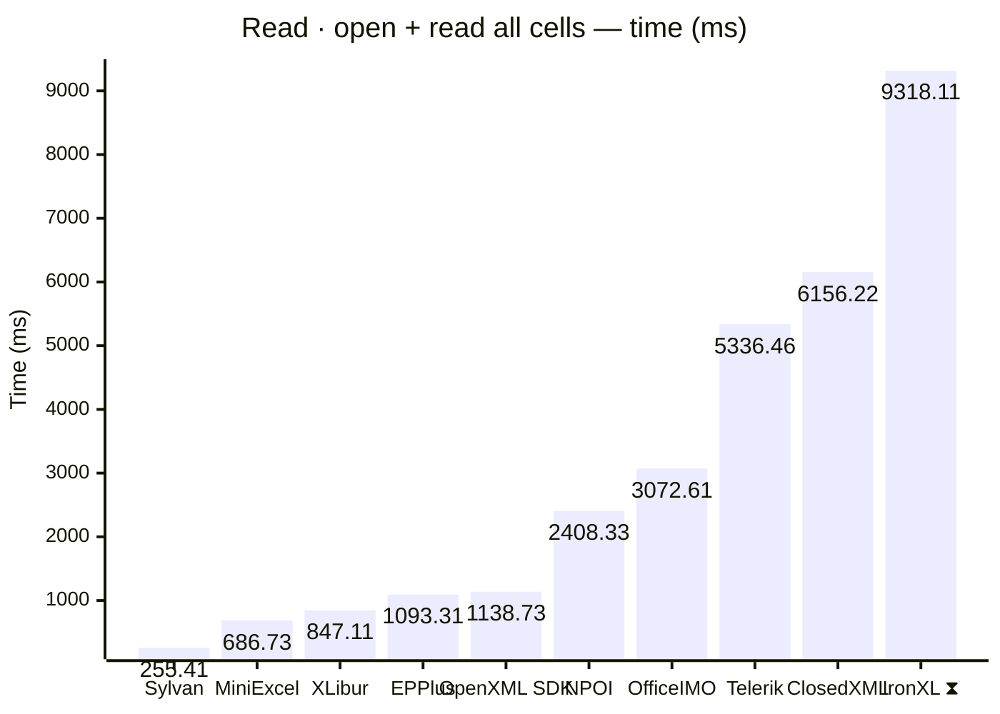
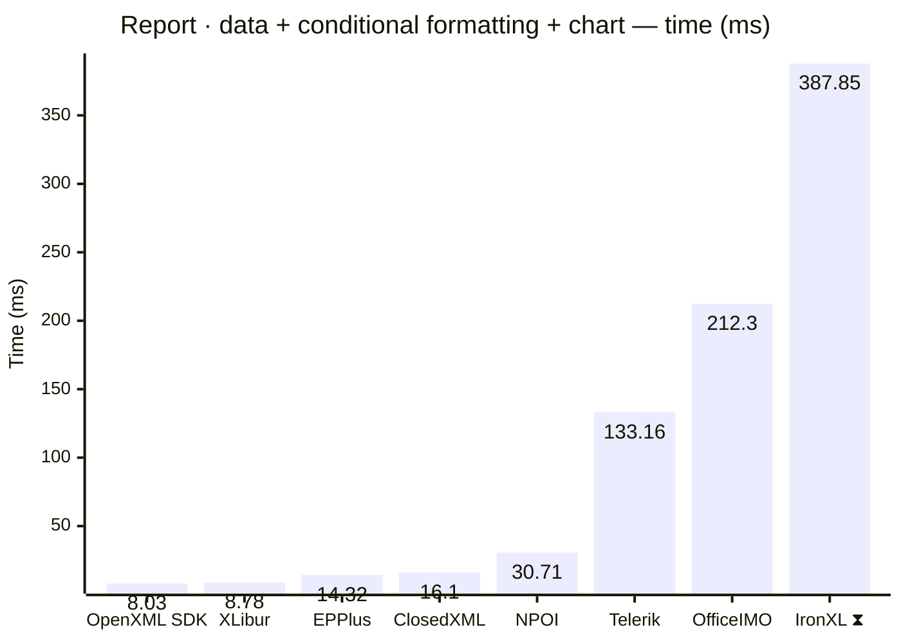
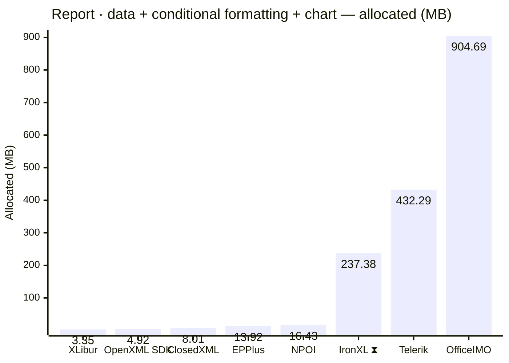
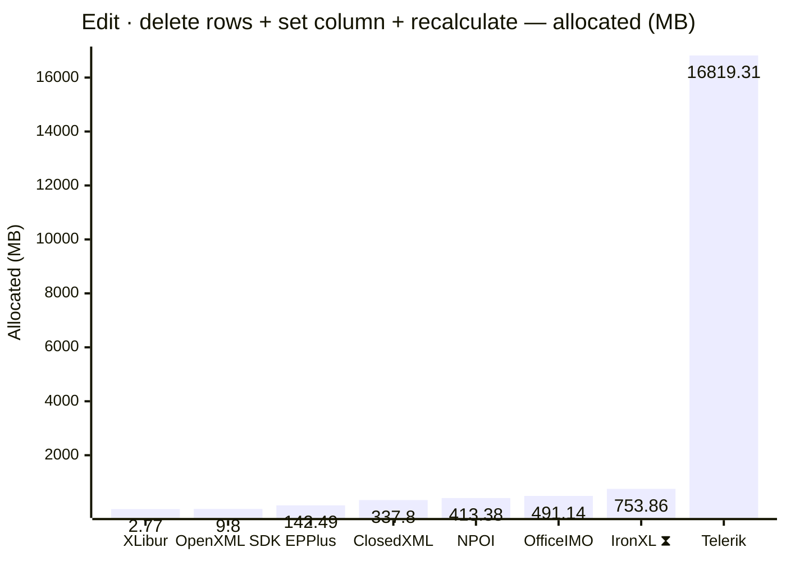
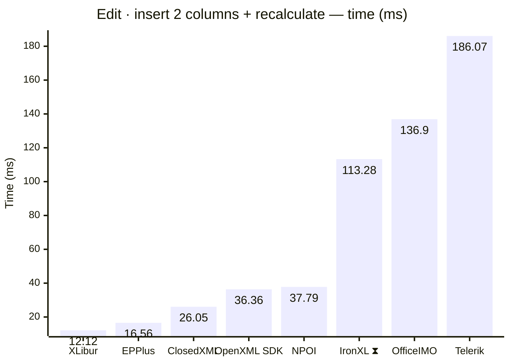

<style>
  .main-content { max-width: 90% !important; padding-left: 2rem !important; padding-right: 2rem !important; }
</style>
<!-- Generated by XLBench. Do not edit by hand; re-run scripts/run-benchmarks.ps1. -->
# XLBench Results

Each section below embeds the full BenchmarkDotNet environment block (OS, CPU,
.NET SDK and runtime). Timings are hardware-specific; treat the allocation/GC
columns as the most portable signal across machines. Regenerate locally with
`scripts/run-benchmarks.ps1`.

📈 **[Interactive charts](charts.html)** (GitHub Pages). Static charts and the full tables follow.

Each results table (one per test method) is heat-mapped independently on the Pages site (🟩 best → 🟥 worst).

> ⧗ **Carried over from an earlier run.** The rows and chart points below marked with this symbol were not measured here — the library is commercial and needs a licence key this run did not have — so they are replayed from `snapshots/`. Compare them as indicative rather than like-for-like, and see the repository README for how to refresh a snapshot.
>
> - **IronXL** 2026.8.1, Job-HTCPYF job, captured 2026-08-03 on same hardware as this run.

## Libraries under test

| Library | Version | Source |
| --- | --- | --- |
| ClosedXML | 0.105.1 | this run |
| EPPlus | 8.7.1 | this run |
| OpenXML SDK | 3.5.1 | this run |
| NPOI | 2.8.1 | this run |
| MiniExcel | 1.46.0 | this run |
| Sylvan | 0.5.8 | this run |
| XLibur | 0.630.0 | this run |
| OfficeIMO | 3.4.3 | this run |
| Telerik | 2026.3.923.100 | this run |
| IronXL ⧗ | 2026.8.1 | snapshot (2026.8.1, Job-HTCPYF, captured 2026-08-03) |

## Comparison charts

_Lower is better. Charts render in the GitHub file view; the Pages site has interactive versions._


```mermaid
---
config:
  xyChart:
    showDataLabel: true
---
xychart-beta
    title "Read · open + set properties + save — time (ms)"
    x-axis ["OpenXML SDK", "NPOI", "XLibur", "EPPlus", "OfficeIMO", "ClosedXML", "Telerik", "IronXL ⧗"]
    y-axis "Time (ms)"
    bar [0.29, 8.56, 15.2, 22.63, 23.25, 34.8, 83.07, 208.75]
```


```mermaid
---
config:
  xyChart:
    showDataLabel: true
---
xychart-beta
    title "Read · open + set properties + save — allocated (MB)"
    x-axis ["OpenXML SDK", "XLibur", "NPOI", "OfficeIMO", "ClosedXML", "EPPlus", "IronXL ⧗", "Telerik"]
    y-axis "Allocated (MB)"
    bar [0.34, 1.73, 1.9, 6.64, 13.2, 13.88, 152.81, 185.6]
```


```mermaid
---
config:
  xyChart:
    showDataLabel: true
---
xychart-beta
    title "Read · open + read all cells — time (ms)"
    x-axis ["Sylvan", "MiniExcel", "XLibur", "EPPlus", "OpenXML SDK", "NPOI", "OfficeIMO", "Telerik", "ClosedXML", "IronXL ⧗"]
    y-axis "Time (ms)"
    bar [255.41, 686.73, 847.11, 1093.31, 1138.73, 2408.33, 3072.61, 5336.46, 6156.22, 9318.11]
```


```mermaid
---
config:
  xyChart:
    showDataLabel: true
---
xychart-beta
    title "Read · open + read all cells — allocated (MB)"
    x-axis ["Sylvan", "XLibur", "OpenXML SDK", "MiniExcel", "OfficeIMO", "EPPlus", "NPOI", "ClosedXML", "Telerik", "IronXL ⧗"]
    y-axis "Allocated (MB)"
    bar [25.28, 138.58, 627.82, 806.71, 824.33, 925.23, 1075.8, 1083.78, 4169.56, 6333.04]
```


```mermaid
---
config:
  xyChart:
    showDataLabel: true
---
xychart-beta
    title "Write · create + save — time (ms)"
    x-axis ["Sylvan", "MiniExcel", "OpenXML SDK", "XLibur", "ClosedXML", "EPPlus", "NPOI", "OfficeIMO", "IronXL ⧗", "Telerik"]
    y-axis "Time (ms)"
    bar [37.24, 60.46, 160.36, 219.46, 383.28, 425.09, 636.39, 900.8, 943.14, 1669.57]
```


```mermaid
---
config:
  xyChart:
    showDataLabel: true
---
xychart-beta
    title "Write · create + save — allocated (MB)"
    x-axis ["Sylvan", "XLibur", "MiniExcel", "OpenXML SDK", "ClosedXML", "NPOI", "EPPlus", "OfficeIMO", "IronXL ⧗", "Telerik"]
    y-axis "Allocated (MB)"
    bar [13.27, 60.5, 84.59, 134.19, 181.09, 246.27, 322.83, 357.24, 797.63, 2097.01]
```


```mermaid
---
config:
  xyChart:
    showDataLabel: true
---
xychart-beta
    title "Report · data + conditional formatting + chart — time (ms)"
    x-axis ["OpenXML SDK", "XLibur", "EPPlus", "ClosedXML", "NPOI", "Telerik", "OfficeIMO", "IronXL ⧗"]
    y-axis "Time (ms)"
    bar [8.03, 8.78, 14.32, 16.1, 30.71, 133.16, 212.3, 387.85]
```


```mermaid
---
config:
  xyChart:
    showDataLabel: true
---
xychart-beta
    title "Report · data + conditional formatting + chart — allocated (MB)"
    x-axis ["XLibur", "OpenXML SDK", "ClosedXML", "EPPlus", "NPOI", "IronXL ⧗", "Telerik", "OfficeIMO"]
    y-axis "Allocated (MB)"
    bar [3.35, 4.92, 8.01, 13.92, 16.43, 237.38, 432.29, 904.69]
```


```mermaid
---
config:
  xyChart:
    showDataLabel: true
---
xychart-beta
    title "Edit · delete rows + set column + recalculate — time (ms)"
    x-axis ["XLibur", "OpenXML SDK", "EPPlus", "ClosedXML", "NPOI", "IronXL ⧗", "OfficeIMO", "Telerik"]
    y-axis "Time (ms)"
    bar [10.94, 24.6, 88.04, 341.24, 390.29, 1577.27, 2648.36, 6238.29]
```


```mermaid
---
config:
  xyChart:
    showDataLabel: true
---
xychart-beta
    title "Edit · delete rows + set column + recalculate — allocated (MB)"
    x-axis ["XLibur", "OpenXML SDK", "EPPlus", "ClosedXML", "NPOI", "OfficeIMO", "IronXL ⧗", "Telerik"]
    y-axis "Allocated (MB)"
    bar [2.77, 9.8, 142.49, 337.8, 413.38, 491.14, 753.86, 16819.31]
```


```mermaid
---
config:
  xyChart:
    showDataLabel: true
---
xychart-beta
    title "Edit · insert 2 columns + recalculate — time (ms)"
    x-axis ["XLibur", "EPPlus", "ClosedXML", "OpenXML SDK", "NPOI", "IronXL ⧗", "OfficeIMO", "Telerik"]
    y-axis "Time (ms)"
    bar [12.12, 16.56, 26.05, 36.36, 37.79, 113.28, 136.9, 186.07]
```


```mermaid
---
config:
  xyChart:
    showDataLabel: true
---
xychart-beta
    title "Edit · insert 2 columns + recalculate — allocated (MB)"
    x-axis ["XLibur", "EPPlus", "OpenXML SDK", "ClosedXML", "NPOI", "OfficeIMO", "IronXL ⧗", "Telerik"]
    y-axis "Allocated (MB)"
    bar [2.87, 11.41, 13.11, 13.7, 30.76, 66.71, 104.88, 280.43]
```

## Detailed results


```

BenchmarkDotNet v0.15.8, Windows 11 (10.0.22631.6199/23H2/2023Update/SunValley3)
AMD Ryzen 9 5950X 3.40GHz, 1 CPU, 32 logical and 16 physical cores
.NET SDK 10.0.401
  [Host]     : .NET 10.0.12 (10.0.12, 10.0.1226.42308), X64 RyuJIT x86-64-v3
  DefaultJob : .NET 10.0.12 (10.0.12, 10.0.1226.42308), X64 RyuJIT x86-64-v3


```

### Read · open + set properties + save

| Library     | Type                      | Method                      | Mean          | Error       | StdDev      | Median        | Gen0         | Gen1        | Gen2       | Allocated   |
|------------ |-------------------------- |---------------------------- |--------------:|------------:|------------:|--------------:|-------------:|------------:|-----------:|------------:|
| OpenXML SDK | OpenXmlReadBenchmarks     | OpenAmendPropertiesAndSave  |     0.2855 ms |   0.0055 ms |   0.0126 ms |     0.2848 ms |      29.2969 |     19.0430 |    15.6250 |     0.34 MB |
| NPOI        | NpoiReadBenchmarks        | OpenAmendPropertiesAndSave  |     8.5629 ms |   0.0819 ms |   0.0766 ms |     8.5779 ms |      62.5000 |     31.2500 |          - |      1.9 MB |
| XLibur      | XLiburReadBenchmarks      | OpenAmendPropertiesAndSave  |    15.1980 ms |   0.2577 ms |   0.2410 ms |    15.1835 ms |      76.9231 |           - |          - |     1.73 MB |
| EPPlus      | EpPlusReadBenchmarks      | OpenAmendPropertiesAndSave  |    22.6339 ms |   0.3653 ms |   0.3238 ms |    22.5566 ms |    1000.0000 |   1000.0000 |  1000.0000 |    13.88 MB |
| OfficeIMO   | OfficeImoReadBenchmarks   | OpenAmendPropertiesAndSave  |    23.2540 ms |   0.2014 ms |   0.1682 ms |    23.2666 ms |     562.5000 |    468.7500 |   406.2500 |     6.64 MB |
| ClosedXML   | ClosedXmlReadBenchmarks   | OpenAmendPropertiesAndSave  |    34.8030 ms |   0.6865 ms |   0.7630 ms |    34.5031 ms |     666.6667 |    333.3333 |          - |     13.2 MB |
| Telerik     | TelerikReadBenchmarks     | OpenAmendPropertiesAndSave  |    83.0714 ms |   1.6501 ms |   2.2028 ms |    82.8007 ms |   10666.6667 |   1000.0000 |   666.6667 |    185.6 MB |
| IronXL ⧗ | IronXlReadBenchmarks | OpenAmendPropertiesAndSave | 208.746 ms | 155.7570 ms | 92.6885 ms | 168.705 ms | 9000.0000 | 2000.0000 | - | 152.81 MB |

### Read · open + read all cells

| Library     | Type                      | Method                      | Mean          | Error       | StdDev      | Median        | Gen0         | Gen1        | Gen2       | Allocated   |
|------------ |-------------------------- |---------------------------- |--------------:|------------:|------------:|--------------:|-------------:|------------:|-----------:|------------:|
| Sylvan      | SylvanReadBenchmarks      | OpenAndReadAll              |   255.4052 ms |   2.8181 ms |   2.3533 ms |   254.8133 ms |    1000.0000 |    500.0000 |          - |    25.28 MB |
| MiniExcel   | MiniExcelReadBenchmarks   | OpenAndReadAll              |   686.7261 ms |   7.2547 ms |   6.4311 ms |   684.6671 ms |   51000.0000 |   4000.0000 |  1000.0000 |   806.71 MB |
| XLibur      | XLiburReadBenchmarks      | OpenAndReadAll              |   847.1147 ms |  16.3980 ms |  19.5206 ms |   845.5339 ms |    9000.0000 |   6000.0000 |  1000.0000 |   138.58 MB |
| EPPlus      | EpPlusReadBenchmarks      | OpenAndReadAll              | 1,093.3083 ms |  18.4604 ms |  17.2679 ms | 1,092.6914 ms |   49000.0000 |  14000.0000 |  7000.0000 |   925.23 MB |
| OpenXML SDK | OpenXmlReadBenchmarks     | OpenAndReadAll              | 1,138.7284 ms |  13.6507 ms |  12.7689 ms | 1,135.0648 ms |   40000.0000 |   6000.0000 |  1000.0000 |   627.82 MB |
| NPOI        | NpoiReadBenchmarks        | OpenAndReadAll              | 2,408.3328 ms |  33.3906 ms |  31.2336 ms | 2,405.0904 ms |   68000.0000 |  62000.0000 |  6000.0000 |   1075.8 MB |
| OfficeIMO   | OfficeImoReadBenchmarks   | OpenAndReadAll              | 3,072.6077 ms |  32.1294 ms |  28.4819 ms | 3,074.6926 ms |   53000.0000 |  39000.0000 |  5000.0000 |   824.33 MB |
| Telerik     | TelerikReadBenchmarks     | OpenAndReadAll              | 5,336.4600 ms |  68.0054 ms |  63.6123 ms | 5,343.3900 ms |  253000.0000 |  52000.0000 |  6000.0000 |  4169.56 MB |
| ClosedXML   | ClosedXmlReadBenchmarks   | OpenAndReadAll              | 6,156.2215 ms |  44.3195 ms |  39.2881 ms | 6,163.2329 ms |   59000.0000 |  23000.0000 |  3000.0000 |  1083.78 MB |
| IronXL ⧗ | IronXlReadBenchmarks | OpenAndReadAll | 9,318.107 ms | 477.3336 ms | 315.7266 ms | 9,377.407 ms | 393000.0000 | 202000.0000 | 10000.0000 | 6333.04 MB |

### Write · create + save

| Library     | Type                      | Method                      | Mean          | Error       | StdDev      | Median        | Gen0         | Gen1        | Gen2       | Allocated   |
|------------ |-------------------------- |---------------------------- |--------------:|------------:|------------:|--------------:|-------------:|------------:|-----------:|------------:|
| Sylvan      | SylvanWriteBenchmarks     | CreateAndSave               |    37.2391 ms |   0.7218 ms |   0.8023 ms |    37.4744 ms |    1714.2857 |   1642.8571 |  1500.0000 |    13.27 MB |
| MiniExcel   | MiniExcelWriteBenchmarks  | CreateAndSave               |    60.4645 ms |   1.1852 ms |   1.1640 ms |    60.1381 ms |    5625.0000 |   1750.0000 |  1625.0000 |    84.59 MB |
| OpenXML SDK | OpenXmlWriteBenchmarks    | CreateAndSave               |   160.3570 ms |   2.8594 ms |   2.6747 ms |   161.2527 ms |    8750.0000 |   2000.0000 |  2000.0000 |   134.19 MB |
| XLibur      | XLiburWriteBenchmarks     | CreateAndSave               |   219.4599 ms |   4.3591 ms |   6.5244 ms |   221.1532 ms |    4000.0000 |   3000.0000 |  3000.0000 |     60.5 MB |
| ClosedXML   | ClosedXmlWriteBenchmarks  | CreateAndSave               |   383.2804 ms |   4.9252 ms |   4.6071 ms |   383.2196 ms |   10000.0000 |   5000.0000 |  2000.0000 |   181.09 MB |
| EPPlus      | EpPlusWriteBenchmarks     | CreateAndSave               |   425.0866 ms |   7.0335 ms |   6.5792 ms |   423.6259 ms |   20000.0000 |   9000.0000 |  3000.0000 |   322.83 MB |
| NPOI        | NpoiWriteBenchmarks       | CreateAndSave               |   636.3858 ms |  11.7589 ms |  10.4240 ms |   636.5274 ms |   16000.0000 |  12000.0000 |  3000.0000 |   246.27 MB |
| OfficeIMO   | OfficeImoWriteBenchmarks  | CreateAndSave               |   900.7959 ms |  16.3099 ms |  15.2563 ms |   898.6272 ms |   19000.0000 |  13000.0000 |  3000.0000 |   357.24 MB |
| IronXL ⧗ | IronXlWriteBenchmarks | CreateAndSave | 943.137 ms | 18.5191 ms | 11.0204 ms | 938.999 ms | 48000.0000 | 16000.0000 | 3000.0000 | 797.63 MB |
| Telerik     | TelerikWriteBenchmarks    | CreateAndSave               | 1,669.5663 ms |  22.9541 ms |  21.4713 ms | 1,667.9064 ms |  130000.0000 |  13000.0000 |  5000.0000 |  2097.01 MB |

### Report · data + conditional formatting + chart

| Library     | Type                      | Method                      | Mean          | Error       | StdDev      | Median        | Gen0         | Gen1        | Gen2       | Allocated   |
|------------ |-------------------------- |---------------------------- |--------------:|------------:|------------:|--------------:|-------------:|------------:|-----------:|------------:|
| OpenXML SDK | OpenXmlReportBenchmarks   | CreateStockReport           |     8.0269 ms |   0.1013 ms |   0.0947 ms |     8.0015 ms |     375.0000 |    359.3750 |   187.5000 |     4.92 MB |
| XLibur      | XLiburReportBenchmarks    | CreateStockReport           |     8.7760 ms |   0.1658 ms |   0.1551 ms |     8.7810 ms |     187.5000 |    187.5000 |   187.5000 |     3.35 MB |
| EPPlus      | EpPlusReportBenchmarks    | CreateStockReport           |    14.3186 ms |   0.2177 ms |   0.2036 ms |    14.3157 ms |    1000.0000 |   1000.0000 |  1000.0000 |    13.92 MB |
| ClosedXML   | ClosedXmlReportBenchmarks | CreateStockReport           |    16.0951 ms |   0.2666 ms |   0.2494 ms |    16.1308 ms |     468.7500 |    187.5000 |    31.2500 |     8.01 MB |
| NPOI        | NpoiReportBenchmarks      | CreateStockReport           |    30.7072 ms |   0.4193 ms |   0.3717 ms |    30.6823 ms |     875.0000 |    750.0000 |   375.0000 |    16.43 MB |
| Telerik     | TelerikReportBenchmarks   | CreateStockReport           |   133.1645 ms |   3.2981 ms |   9.6727 ms |   134.2190 ms |   27000.0000 |   6000.0000 |  2000.0000 |   432.29 MB |
| OfficeIMO   | OfficeImoReportBenchmarks | CreateStockReport           |   212.2967 ms |   3.3122 ms |   2.7658 ms |   211.9560 ms |   57000.0000 |   2000.0000 |   666.6667 |   904.69 MB |
| IronXL ⧗ | IronXlReportBenchmarks | CreateStockReport | 387.849 ms | 36.5456 ms | 24.1726 ms | 384.092 ms | 14000.0000 | 3000.0000 | - | 237.38 MB |

### Edit · delete rows + set column + recalculate

| Library     | Type                      | Method                      | Mean          | Error       | StdDev      | Median        | Gen0         | Gen1        | Gen2       | Allocated   |
|------------ |-------------------------- |---------------------------- |--------------:|------------:|------------:|--------------:|-------------:|------------:|-----------:|------------:|
| XLibur      | XLiburEditBenchmarks      | EditAndRecalculate          |    10.9445 ms |   0.0585 ms |   0.0489 ms |    10.9460 ms |     171.8750 |     78.1250 |          - |     2.77 MB |
| OpenXML SDK | OpenXmlEditBenchmarks     | EditAndRecalculate          |    24.5998 ms |   0.4511 ms |   0.4220 ms |    24.4711 ms |     718.7500 |    656.2500 |   156.2500 |      9.8 MB |
| EPPlus      | EpPlusEditBenchmarks      | EditAndRecalculate          |    88.0377 ms |   1.7147 ms |   2.1685 ms |    87.6673 ms |    9000.0000 |   1200.0000 |  1000.0000 |   142.49 MB |
| ClosedXML   | ClosedXmlEditBenchmarks   | EditAndRecalculate          |   341.2429 ms |   6.6881 ms |   8.2136 ms |   341.1825 ms |   21000.0000 |   1000.0000 |          - |    337.8 MB |
| NPOI        | NpoiEditBenchmarks        | EditAndRecalculate          |   390.2929 ms |   7.2967 ms |   6.8254 ms |   392.6216 ms |   25000.0000 |   1000.0000 |          - |   413.38 MB |
| IronXL ⧗ | IronXlEditBenchmarks | EditAndRecalculate | 1,577.273 ms | 62.9583 ms | 41.6430 ms | 1,583.098 ms | 57000.0000 | 36000.0000 | 15000.0000 | 753.86 MB |
| OfficeIMO   | OfficeImoEditBenchmarks   | EditAndRecalculate          | 2,648.3594 ms |  27.9293 ms |  26.1251 ms | 2,647.9771 ms |   30000.0000 |   1000.0000 |          - |   491.14 MB |
| Telerik     | TelerikEditBenchmarks     | EditAndRecalculate          | 6,238.2888 ms | 145.6026 ms | 410.6748 ms | 6,169.6264 ms | 1067000.0000 | 249000.0000 | 82000.0000 | 16819.31 MB |

### Edit · insert 2 columns + recalculate

| Library     | Type                      | Method                      | Mean          | Error       | StdDev      | Median        | Gen0         | Gen1        | Gen2       | Allocated   |
|------------ |-------------------------- |---------------------------- |--------------:|------------:|------------:|--------------:|-------------:|------------:|-----------:|------------:|
| XLibur      | XLiburInsertBenchmarks    | InsertColumnsAndRecalculate |    12.1152 ms |   0.1316 ms |   0.1099 ms |    12.0729 ms |     156.2500 |     62.5000 |          - |     2.87 MB |
| EPPlus      | EpPlusInsertBenchmarks    | InsertColumnsAndRecalculate |    16.5576 ms |   0.3231 ms |   0.3318 ms |    16.6341 ms |    1000.0000 |   1000.0000 |  1000.0000 |    11.41 MB |
| ClosedXML   | ClosedXmlInsertBenchmarks | InsertColumnsAndRecalculate |    26.0483 ms |   0.5206 ms |   0.5786 ms |    26.0773 ms |     800.0000 |    400.0000 |          - |     13.7 MB |
| OpenXML SDK | OpenXmlInsertBenchmarks   | InsertColumnsAndRecalculate |    36.3612 ms |   0.7241 ms |   1.5894 ms |    36.8253 ms |     750.0000 |    500.0000 |   250.0000 |    13.11 MB |
| NPOI        | NpoiInsertBenchmarks      | InsertColumnsAndRecalculate |    37.7889 ms |   0.7556 ms |   1.7361 ms |    37.6229 ms |    2000.0000 |   1333.3333 |   500.0000 |    30.76 MB |
| IronXL ⧗ | IronXlInsertBenchmarks | InsertColumnsAndRecalculate | 113.284 ms | 41.9750 ms | 27.7638 ms | 97.052 ms | 7000.0000 | 2500.0000 | 750.0000 | 104.88 MB |
| OfficeIMO   | OfficeImoInsertBenchmarks | InsertColumnsAndRecalculate |   136.8991 ms |   2.7043 ms |   5.2102 ms |   136.6102 ms |    3000.0000 |   1000.0000 |          - |    66.71 MB |
| Telerik     | TelerikInsertBenchmarks   | InsertColumnsAndRecalculate |   186.0690 ms |   3.6964 ms |   8.9273 ms |   182.5882 ms |   18000.0000 |   6000.0000 |  2000.0000 |   280.43 MB |


<script type="module">
  import mermaid from 'https://cdn.jsdelivr.net/npm/mermaid@11/dist/mermaid.esm.min.mjs';
  const blocks = document.querySelectorAll('.language-mermaid');
  blocks.forEach(el => {
    const code = el.querySelector('code') || el;
    const pre = document.createElement('pre');
    pre.className = 'mermaid';
    pre.textContent = code.textContent;
    el.replaceWith(pre);
  });
  if (blocks.length) {
    mermaid.initialize({ startOnLoad: false });
    await mermaid.run({ querySelector: 'pre.mermaid' });
  }
</script>

<script>
(function () {
  const parse = s => { const n = parseFloat(String(s).replace(/,/g, '')); return Number.isFinite(n) ? n : null; };
  document.querySelectorAll('table').forEach(table => {
    if (!table.tHead || !table.tBodies[0]) return;
    const heads = [...table.tHead.rows[0].cells].map(c => c.textContent.trim().toLowerCase());
    if (!heads.includes('mean')) return;
    const metricCols = heads.map((h, i) => /^(mean|allocated|gen0|gen1|gen2)$/.test(h) ? i : -1).filter(i => i >= 0);
    const rows = [...table.tBodies[0].rows];
    for (const c of metricCols) {
      const vals = rows.map(r => parse(r.cells[c]?.textContent));
      const nums = vals.filter(v => v !== null);
      if (nums.length < 2) continue;
      const min = Math.min(...nums), max = Math.max(...nums);
      if (max === min) continue;
      rows.forEach((r, i) => {
        const v = vals[i]; if (v === null) return;
        const ratio = (v - min) / (max - min);
        r.cells[c].style.backgroundColor = `hsla(${120 - 120 * ratio}, 70%, 50%, 0.45)`;
      });
    }
  });
})();
</script>
