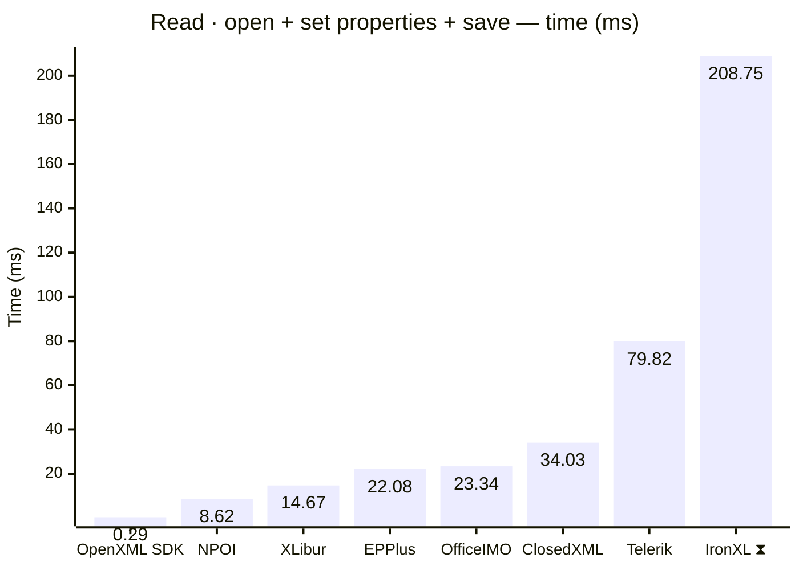
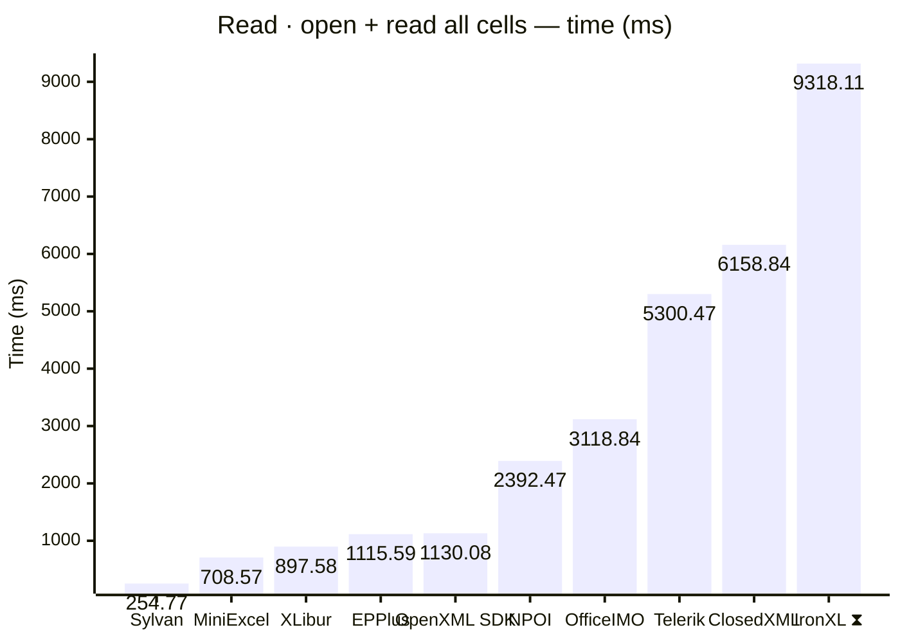
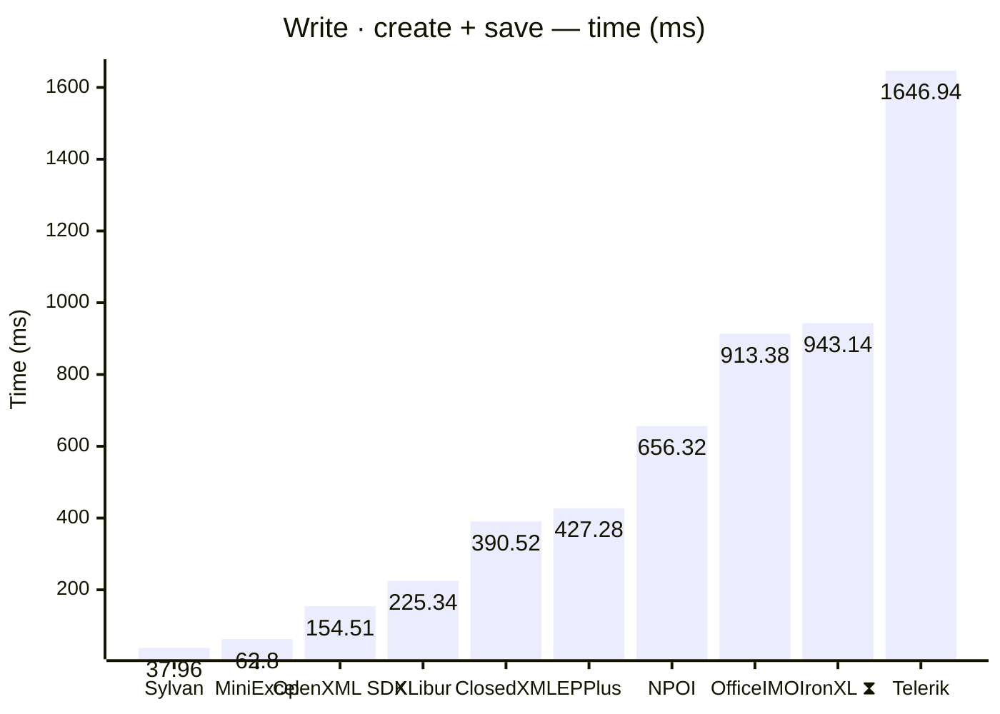
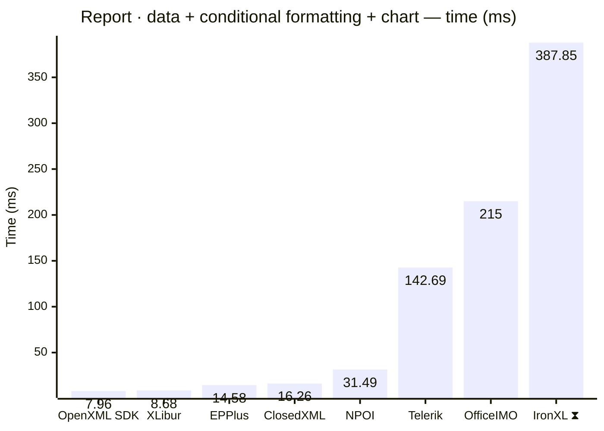
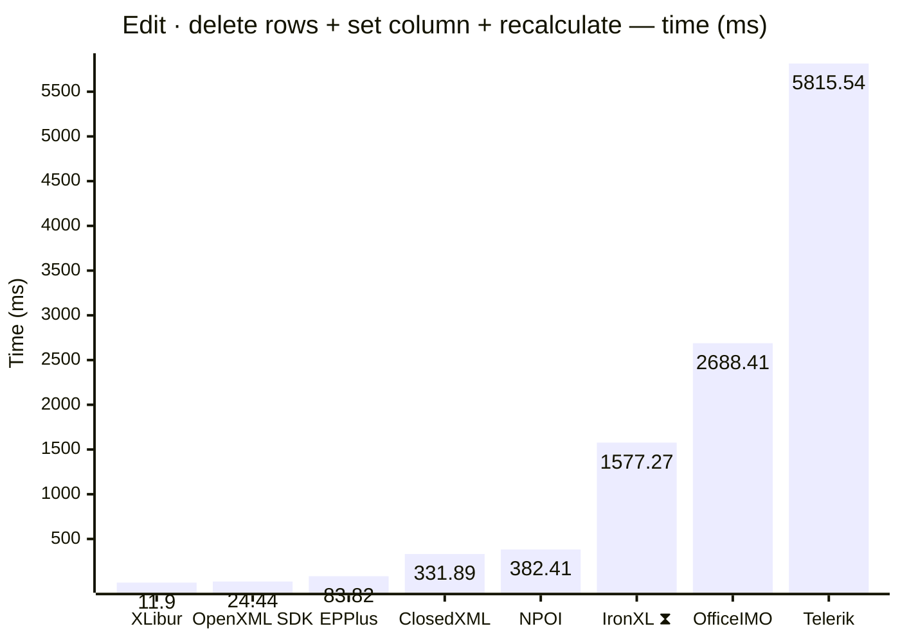
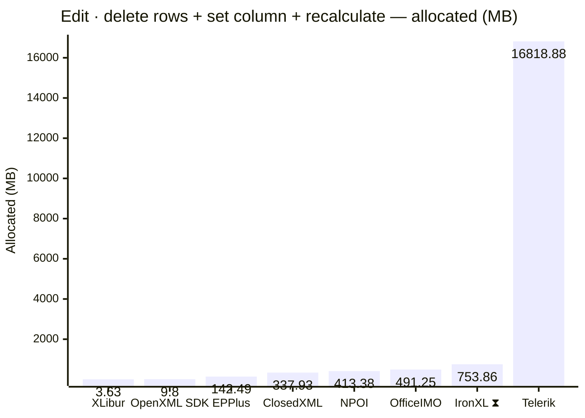
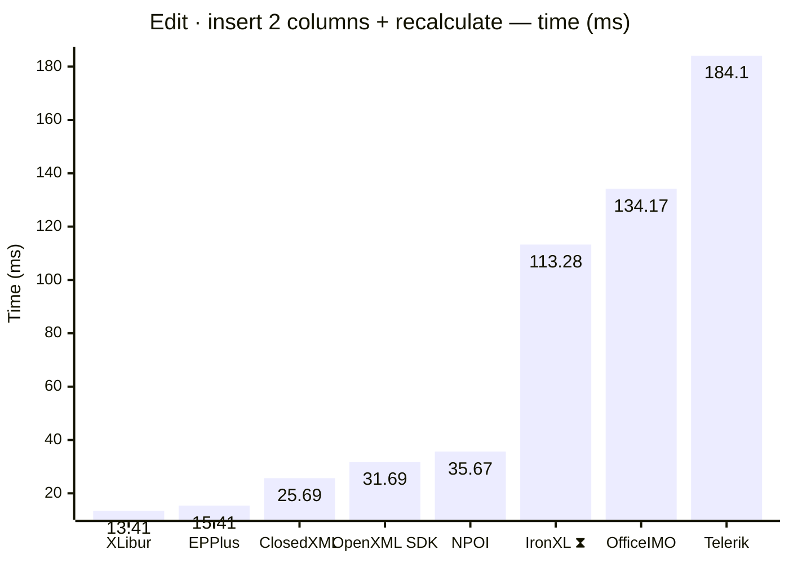

<style>
  .main-content { max-width: 90% !important; padding-left: 2rem !important; padding-right: 2rem !important; }
</style>
<!-- Generated by XLBench. Do not edit by hand; re-run scripts/run-benchmarks.ps1. -->
# XLBench Results

Each section below embeds the full BenchmarkDotNet environment block (OS, CPU,
.NET SDK and runtime). Timings are hardware-specific; treat the allocation/GC
columns as the most portable signal across machines. Regenerate locally with
`scripts/run-benchmarks.ps1`.

📈 **[Interactive charts](charts.html)** (GitHub Pages). Static charts and the full tables follow.

Each results table (one per test method) is heat-mapped independently on the Pages site (🟩 best → 🟥 worst).

> ⧗ **Carried over from an earlier run.** The rows and chart points below marked with this symbol were not measured here — the library is commercial and needs a licence key this run did not have — so they are replayed from `snapshots/`. Compare them as indicative rather than like-for-like, and see the repository README for how to refresh a snapshot.
>
> - **IronXL** 2026.8.1, Job-HTCPYF job, captured 2026-08-03 on same hardware as this run.

## Libraries under test

| Library | Version | Source |
| --- | --- | --- |
| ClosedXML | 0.105.1 | this run |
| EPPlus | 8.7.1 | this run |
| OpenXML SDK | 3.5.1 | this run |
| NPOI | 2.8.1 | this run |
| MiniExcel | 1.46.0 | this run |
| Sylvan | 0.5.8 | this run |
| XLibur | 0.620.0 | this run |
| OfficeIMO | 3.4.3 | this run |
| Telerik | 2026.3.923.100 | this run |
| IronXL ⧗ | 2026.8.1 | snapshot (2026.8.1, Job-HTCPYF, captured 2026-08-03) |

## Comparison charts

_Lower is better. Charts render in the GitHub file view; the Pages site has interactive versions._


```mermaid
---
config:
  xyChart:
    showDataLabel: true
---
xychart-beta
    title "Read · open + set properties + save — time (ms)"
    x-axis ["OpenXML SDK", "NPOI", "XLibur", "EPPlus", "OfficeIMO", "ClosedXML", "Telerik", "IronXL ⧗"]
    y-axis "Time (ms)"
    bar [0.29, 8.62, 14.67, 22.08, 23.34, 34.03, 79.82, 208.75]
```


```mermaid
---
config:
  xyChart:
    showDataLabel: true
---
xychart-beta
    title "Read · open + set properties + save — allocated (MB)"
    x-axis ["OpenXML SDK", "XLibur", "NPOI", "OfficeIMO", "ClosedXML", "EPPlus", "IronXL ⧗", "Telerik"]
    y-axis "Allocated (MB)"
    bar [0.34, 1.73, 1.89, 6.58, 13.18, 13.81, 152.81, 185.61]
```


```mermaid
---
config:
  xyChart:
    showDataLabel: true
---
xychart-beta
    title "Read · open + read all cells — time (ms)"
    x-axis ["Sylvan", "MiniExcel", "XLibur", "EPPlus", "OpenXML SDK", "NPOI", "OfficeIMO", "Telerik", "ClosedXML", "IronXL ⧗"]
    y-axis "Time (ms)"
    bar [254.77, 708.57, 897.58, 1115.59, 1130.08, 2392.47, 3118.84, 5300.47, 6158.84, 9318.11]
```


```mermaid
---
config:
  xyChart:
    showDataLabel: true
---
xychart-beta
    title "Read · open + read all cells — allocated (MB)"
    x-axis ["Sylvan", "XLibur", "OpenXML SDK", "MiniExcel", "OfficeIMO", "EPPlus", "ClosedXML", "NPOI", "Telerik", "IronXL ⧗"]
    y-axis "Allocated (MB)"
    bar [25.28, 201.35, 627.82, 806.67, 824.06, 925.22, 1073.5, 1075.67, 4164.98, 6333.04]
```


```mermaid
---
config:
  xyChart:
    showDataLabel: true
---
xychart-beta
    title "Write · create + save — time (ms)"
    x-axis ["Sylvan", "MiniExcel", "OpenXML SDK", "XLibur", "ClosedXML", "EPPlus", "NPOI", "OfficeIMO", "IronXL ⧗", "Telerik"]
    y-axis "Time (ms)"
    bar [37.96, 62.8, 154.51, 225.34, 390.52, 427.28, 656.32, 913.38, 943.14, 1646.94]
```


```mermaid
---
config:
  xyChart:
    showDataLabel: true
---
xychart-beta
    title "Write · create + save — allocated (MB)"
    x-axis ["Sylvan", "XLibur", "MiniExcel", "OpenXML SDK", "ClosedXML", "NPOI", "EPPlus", "OfficeIMO", "IronXL ⧗", "Telerik"]
    y-axis "Allocated (MB)"
    bar [13.27, 60.5, 84.59, 134.19, 181.09, 246.26, 322.83, 357.24, 797.63, 2089.35]
```


```mermaid
---
config:
  xyChart:
    showDataLabel: true
---
xychart-beta
    title "Report · data + conditional formatting + chart — time (ms)"
    x-axis ["OpenXML SDK", "XLibur", "EPPlus", "ClosedXML", "NPOI", "Telerik", "OfficeIMO", "IronXL ⧗"]
    y-axis "Time (ms)"
    bar [7.96, 8.68, 14.58, 16.26, 31.49, 142.69, 215, 387.85]
```


```mermaid
---
config:
  xyChart:
    showDataLabel: true
---
xychart-beta
    title "Report · data + conditional formatting + chart — allocated (MB)"
    x-axis ["XLibur", "OpenXML SDK", "ClosedXML", "EPPlus", "NPOI", "IronXL ⧗", "Telerik", "OfficeIMO"]
    y-axis "Allocated (MB)"
    bar [3.35, 4.92, 8.02, 13.92, 16.43, 237.38, 432.28, 904.69]
```


```mermaid
---
config:
  xyChart:
    showDataLabel: true
---
xychart-beta
    title "Edit · delete rows + set column + recalculate — time (ms)"
    x-axis ["XLibur", "OpenXML SDK", "EPPlus", "ClosedXML", "NPOI", "IronXL ⧗", "OfficeIMO", "Telerik"]
    y-axis "Time (ms)"
    bar [11.9, 24.44, 83.82, 331.89, 382.41, 1577.27, 2688.41, 5815.54]
```


```mermaid
---
config:
  xyChart:
    showDataLabel: true
---
xychart-beta
    title "Edit · delete rows + set column + recalculate — allocated (MB)"
    x-axis ["XLibur", "OpenXML SDK", "EPPlus", "ClosedXML", "NPOI", "OfficeIMO", "IronXL ⧗", "Telerik"]
    y-axis "Allocated (MB)"
    bar [3.63, 9.8, 142.49, 337.93, 413.38, 491.25, 753.86, 16818.88]
```


```mermaid
---
config:
  xyChart:
    showDataLabel: true
---
xychart-beta
    title "Edit · insert 2 columns + recalculate — time (ms)"
    x-axis ["XLibur", "EPPlus", "ClosedXML", "OpenXML SDK", "NPOI", "IronXL ⧗", "OfficeIMO", "Telerik"]
    y-axis "Time (ms)"
    bar [13.41, 15.41, 25.69, 31.69, 35.67, 113.28, 134.17, 184.1]
```


```mermaid
---
config:
  xyChart:
    showDataLabel: true
---
xychart-beta
    title "Edit · insert 2 columns + recalculate — allocated (MB)"
    x-axis ["XLibur", "EPPlus", "OpenXML SDK", "ClosedXML", "NPOI", "OfficeIMO", "IronXL ⧗", "Telerik"]
    y-axis "Allocated (MB)"
    bar [3.99, 11.41, 13.05, 14, 30.72, 66.84, 104.88, 280.26]
```

## Detailed results


```

BenchmarkDotNet v0.15.8, Windows 11 (10.0.22631.6199/23H2/2023Update/SunValley3)
AMD Ryzen 9 5950X 3.40GHz, 1 CPU, 32 logical and 16 physical cores
.NET SDK 10.0.401
  [Host]     : .NET 10.0.12 (10.0.12, 10.0.1226.42308), X64 RyuJIT x86-64-v3
  DefaultJob : .NET 10.0.12 (10.0.12, 10.0.1226.42308), X64 RyuJIT x86-64-v3


```

### Read · open + set properties + save

| Library     | Type                      | Method                      | Mean          | Error       | StdDev      | Gen0         | Gen1        | Gen2       | Allocated   |
|------------ |-------------------------- |---------------------------- |--------------:|------------:|------------:|-------------:|------------:|-----------:|------------:|
| OpenXML SDK | OpenXmlReadBenchmarks     | OpenAmendPropertiesAndSave  |     0.2854 ms |   0.0056 ms |   0.0103 ms |      29.2969 |     19.0430 |    15.6250 |     0.34 MB |
| NPOI        | NpoiReadBenchmarks        | OpenAmendPropertiesAndSave  |     8.6175 ms |   0.1123 ms |   0.1051 ms |      62.5000 |     31.2500 |          - |     1.89 MB |
| XLibur      | XLiburReadBenchmarks      | OpenAmendPropertiesAndSave  |    14.6665 ms |   0.1876 ms |   0.1567 ms |      76.9231 |           - |          - |     1.73 MB |
| EPPlus      | EpPlusReadBenchmarks      | OpenAmendPropertiesAndSave  |    22.0807 ms |   0.4390 ms |   0.6435 ms |    1000.0000 |   1000.0000 |  1000.0000 |    13.81 MB |
| OfficeIMO   | OfficeImoReadBenchmarks   | OpenAmendPropertiesAndSave  |    23.3440 ms |   0.3251 ms |   0.2538 ms |     562.5000 |    437.5000 |   406.2500 |     6.58 MB |
| ClosedXML   | ClosedXmlReadBenchmarks   | OpenAmendPropertiesAndSave  |    34.0310 ms |   0.6735 ms |   0.9218 ms |     666.6667 |    333.3333 |          - |    13.18 MB |
| Telerik     | TelerikReadBenchmarks     | OpenAmendPropertiesAndSave  |    79.8220 ms |   1.4913 ms |   2.8374 ms |   10666.6667 |   1000.0000 |   666.6667 |   185.61 MB |
| IronXL ⧗ | IronXlReadBenchmarks | OpenAmendPropertiesAndSave | 208.746 ms | 155.7570 ms | 92.6885 ms | 9000.0000 | 2000.0000 | - | 152.81 MB |

### Read · open + read all cells

| Library     | Type                      | Method                      | Mean          | Error       | StdDev      | Gen0         | Gen1        | Gen2       | Allocated   |
|------------ |-------------------------- |---------------------------- |--------------:|------------:|------------:|-------------:|------------:|-----------:|------------:|
| Sylvan      | SylvanReadBenchmarks      | OpenAndReadAll              |   254.7736 ms |   2.1550 ms |   1.7996 ms |    1000.0000 |    500.0000 |          - |    25.28 MB |
| MiniExcel   | MiniExcelReadBenchmarks   | OpenAndReadAll              |   708.5694 ms |   8.9892 ms |   8.4085 ms |   51000.0000 |   4000.0000 |  1000.0000 |   806.67 MB |
| XLibur      | XLiburReadBenchmarks      | OpenAndReadAll              |   897.5833 ms |  15.8736 ms |  14.8482 ms |   13000.0000 |   8000.0000 |  2000.0000 |   201.35 MB |
| EPPlus      | EpPlusReadBenchmarks      | OpenAndReadAll              | 1,115.5923 ms |  10.9986 ms |   9.7499 ms |   49000.0000 |  14000.0000 |  7000.0000 |   925.22 MB |
| OpenXML SDK | OpenXmlReadBenchmarks     | OpenAndReadAll              | 1,130.0803 ms |  14.4996 ms |  12.8535 ms |   40000.0000 |   6000.0000 |  1000.0000 |   627.82 MB |
| NPOI        | NpoiReadBenchmarks        | OpenAndReadAll              | 2,392.4695 ms |  44.6048 ms |  37.2470 ms |   68000.0000 |  62000.0000 |  6000.0000 |  1075.67 MB |
| OfficeIMO   | OfficeImoReadBenchmarks   | OpenAndReadAll              | 3,118.8436 ms |  60.5747 ms |  53.6979 ms |   53000.0000 |  39000.0000 |  5000.0000 |   824.06 MB |
| Telerik     | TelerikReadBenchmarks     | OpenAndReadAll              | 5,300.4735 ms |  39.8871 ms |  37.3104 ms |  253000.0000 |  53000.0000 |  6000.0000 |  4164.98 MB |
| ClosedXML   | ClosedXmlReadBenchmarks   | OpenAndReadAll              | 6,158.8428 ms |  32.8605 ms |  30.7377 ms |   60000.0000 |  24000.0000 |  4000.0000 |   1073.5 MB |
| IronXL ⧗ | IronXlReadBenchmarks | OpenAndReadAll | 9,318.107 ms | 477.3336 ms | 315.7266 ms | 393000.0000 | 202000.0000 | 10000.0000 | 6333.04 MB |

### Write · create + save

| Library     | Type                      | Method                      | Mean          | Error       | StdDev      | Gen0         | Gen1        | Gen2       | Allocated   |
|------------ |-------------------------- |---------------------------- |--------------:|------------:|------------:|-------------:|------------:|-----------:|------------:|
| Sylvan      | SylvanWriteBenchmarks     | CreateAndSave               |    37.9574 ms |   0.6834 ms |   0.6392 ms |    1692.3077 |   1615.3846 |  1461.5385 |    13.27 MB |
| MiniExcel   | MiniExcelWriteBenchmarks  | CreateAndSave               |    62.7958 ms |   1.2102 ms |   1.6156 ms |    5666.6667 |   1777.7778 |  1666.6667 |    84.59 MB |
| OpenXML SDK | OpenXmlWriteBenchmarks    | CreateAndSave               |   154.5106 ms |   2.6192 ms |   2.4500 ms |    8000.0000 |   2000.0000 |  2000.0000 |   134.19 MB |
| XLibur      | XLiburWriteBenchmarks     | CreateAndSave               |   225.3416 ms |   4.3798 ms |   6.9469 ms |    3000.0000 |   2000.0000 |  2000.0000 |     60.5 MB |
| ClosedXML   | ClosedXmlWriteBenchmarks  | CreateAndSave               |   390.5163 ms |   7.5745 ms |  10.3680 ms |   10000.0000 |   5000.0000 |  2000.0000 |   181.09 MB |
| EPPlus      | EpPlusWriteBenchmarks     | CreateAndSave               |   427.2831 ms |   8.4383 ms |   9.3792 ms |   20000.0000 |   9000.0000 |  3000.0000 |   322.83 MB |
| NPOI        | NpoiWriteBenchmarks       | CreateAndSave               |   656.3198 ms |  12.8838 ms |  16.2939 ms |   16000.0000 |  12000.0000 |  3000.0000 |   246.26 MB |
| OfficeIMO   | OfficeImoWriteBenchmarks  | CreateAndSave               |   913.3809 ms |   8.3933 ms |   6.5529 ms |   19000.0000 |  13000.0000 |  3000.0000 |   357.24 MB |
| IronXL ⧗ | IronXlWriteBenchmarks | CreateAndSave | 943.137 ms | 18.5191 ms | 11.0204 ms | 48000.0000 | 16000.0000 | 3000.0000 | 797.63 MB |
| Telerik     | TelerikWriteBenchmarks    | CreateAndSave               | 1,646.9359 ms |  20.5097 ms |  18.1813 ms |  129000.0000 |  14000.0000 |  5000.0000 |  2089.35 MB |

### Report · data + conditional formatting + chart

| Library     | Type                      | Method                      | Mean          | Error       | StdDev      | Gen0         | Gen1        | Gen2       | Allocated   |
|------------ |-------------------------- |---------------------------- |--------------:|------------:|------------:|-------------:|------------:|-----------:|------------:|
| OpenXML SDK | OpenXmlReportBenchmarks   | CreateStockReport           |     7.9626 ms |   0.0861 ms |   0.0763 ms |     375.0000 |    359.3750 |   187.5000 |     4.92 MB |
| XLibur      | XLiburReportBenchmarks    | CreateStockReport           |     8.6763 ms |   0.1164 ms |   0.0972 ms |     187.5000 |    187.5000 |   187.5000 |     3.35 MB |
| EPPlus      | EpPlusReportBenchmarks    | CreateStockReport           |    14.5820 ms |   0.2833 ms |   0.3032 ms |    1000.0000 |   1000.0000 |  1000.0000 |    13.92 MB |
| ClosedXML   | ClosedXmlReportBenchmarks | CreateStockReport           |    16.2614 ms |   0.3147 ms |   0.3232 ms |     468.7500 |    187.5000 |    31.2500 |     8.02 MB |
| NPOI        | NpoiReportBenchmarks      | CreateStockReport           |    31.4940 ms |   0.5903 ms |   0.5798 ms |     857.1429 |    714.2857 |   428.5714 |    16.43 MB |
| Telerik     | TelerikReportBenchmarks   | CreateStockReport           |   142.6936 ms |   3.9572 ms |  11.0964 ms |   27000.0000 |   6000.0000 |  2000.0000 |   432.28 MB |
| OfficeIMO   | OfficeImoReportBenchmarks | CreateStockReport           |   215.0036 ms |   4.2877 ms |   4.2111 ms |   57000.0000 |   2000.0000 |   666.6667 |   904.69 MB |
| IronXL ⧗ | IronXlReportBenchmarks | CreateStockReport | 387.849 ms | 36.5456 ms | 24.1726 ms | 14000.0000 | 3000.0000 | - | 237.38 MB |

### Edit · delete rows + set column + recalculate

| Library     | Type                      | Method                      | Mean          | Error       | StdDev      | Gen0         | Gen1        | Gen2       | Allocated   |
|------------ |-------------------------- |---------------------------- |--------------:|------------:|------------:|-------------:|------------:|-----------:|------------:|
| XLibur      | XLiburEditBenchmarks      | EditAndRecalculate          |    11.8960 ms |   0.2351 ms |   0.5768 ms |     222.2222 |    111.1111 |          - |     3.63 MB |
| OpenXML SDK | OpenXmlEditBenchmarks     | EditAndRecalculate          |    24.4405 ms |   0.2699 ms |   0.2524 ms |     718.7500 |    656.2500 |   156.2500 |      9.8 MB |
| EPPlus      | EpPlusEditBenchmarks      | EditAndRecalculate          |    83.8227 ms |   1.4933 ms |   1.3238 ms |    9000.0000 |   1200.0000 |  1000.0000 |   142.49 MB |
| ClosedXML   | ClosedXmlEditBenchmarks   | EditAndRecalculate          |   331.8945 ms |   4.2439 ms |   3.5438 ms |   21000.0000 |   1000.0000 |          - |   337.93 MB |
| NPOI        | NpoiEditBenchmarks        | EditAndRecalculate          |   382.4121 ms |   5.7385 ms |   5.3678 ms |   25000.0000 |   1000.0000 |          - |   413.38 MB |
| IronXL ⧗ | IronXlEditBenchmarks | EditAndRecalculate | 1,577.273 ms | 62.9583 ms | 41.6430 ms | 57000.0000 | 36000.0000 | 15000.0000 | 753.86 MB |
| OfficeIMO   | OfficeImoEditBenchmarks   | EditAndRecalculate          | 2,688.4078 ms |  11.4688 ms |   9.5770 ms |   30000.0000 |   1000.0000 |          - |   491.25 MB |
| Telerik     | TelerikEditBenchmarks     | EditAndRecalculate          | 5,815.5405 ms | 113.5436 ms | 166.4308 ms | 1066000.0000 | 248000.0000 | 81000.0000 | 16818.88 MB |

### Edit · insert 2 columns + recalculate

| Library     | Type                      | Method                      | Mean          | Error       | StdDev      | Gen0         | Gen1        | Gen2       | Allocated   |
|------------ |-------------------------- |---------------------------- |--------------:|------------:|------------:|-------------:|------------:|-----------:|------------:|
| XLibur      | XLiburInsertBenchmarks    | InsertColumnsAndRecalculate |    13.4083 ms |   0.2478 ms |   0.4774 ms |     250.0000 |    125.0000 |          - |     3.99 MB |
| EPPlus      | EpPlusInsertBenchmarks    | InsertColumnsAndRecalculate |    15.4142 ms |   0.2502 ms |   0.2218 ms |    1000.0000 |   1000.0000 |  1000.0000 |    11.41 MB |
| ClosedXML   | ClosedXmlInsertBenchmarks | InsertColumnsAndRecalculate |    25.6910 ms |   0.5111 ms |   1.2148 ms |     800.0000 |    400.0000 |          - |       14 MB |
| OpenXML SDK | OpenXmlInsertBenchmarks   | InsertColumnsAndRecalculate |    31.6940 ms |   0.4422 ms |   0.4137 ms |    1125.0000 |   1000.0000 |   437.5000 |    13.05 MB |
| NPOI        | NpoiInsertBenchmarks      | InsertColumnsAndRecalculate |    35.6689 ms |   0.7116 ms |   1.6634 ms |    2000.0000 |   1333.3333 |   500.0000 |    30.72 MB |
| IronXL ⧗ | IronXlInsertBenchmarks | InsertColumnsAndRecalculate | 113.284 ms | 41.9750 ms | 27.7638 ms | 7000.0000 | 2500.0000 | 750.0000 | 104.88 MB |
| OfficeIMO   | OfficeImoInsertBenchmarks | InsertColumnsAndRecalculate |   134.1711 ms |   2.6129 ms |   5.2782 ms |    5000.0000 |   2000.0000 |  1000.0000 |    66.84 MB |
| Telerik     | TelerikInsertBenchmarks   | InsertColumnsAndRecalculate |   184.0992 ms |   3.6650 ms |   9.1272 ms |   18000.0000 |   6000.0000 |  2000.0000 |   280.26 MB |


<script type="module">
  import mermaid from 'https://cdn.jsdelivr.net/npm/mermaid@11/dist/mermaid.esm.min.mjs';
  const blocks = document.querySelectorAll('.language-mermaid');
  blocks.forEach(el => {
    const code = el.querySelector('code') || el;
    const pre = document.createElement('pre');
    pre.className = 'mermaid';
    pre.textContent = code.textContent;
    el.replaceWith(pre);
  });
  if (blocks.length) {
    mermaid.initialize({ startOnLoad: false });
    await mermaid.run({ querySelector: 'pre.mermaid' });
  }
</script>

<script>
(function () {
  const parse = s => { const n = parseFloat(String(s).replace(/,/g, '')); return Number.isFinite(n) ? n : null; };
  document.querySelectorAll('table').forEach(table => {
    if (!table.tHead || !table.tBodies[0]) return;
    const heads = [...table.tHead.rows[0].cells].map(c => c.textContent.trim().toLowerCase());
    if (!heads.includes('mean')) return;
    const metricCols = heads.map((h, i) => /^(mean|allocated|gen0|gen1|gen2)$/.test(h) ? i : -1).filter(i => i >= 0);
    const rows = [...table.tBodies[0].rows];
    for (const c of metricCols) {
      const vals = rows.map(r => parse(r.cells[c]?.textContent));
      const nums = vals.filter(v => v !== null);
      if (nums.length < 2) continue;
      const min = Math.min(...nums), max = Math.max(...nums);
      if (max === min) continue;
      rows.forEach((r, i) => {
        const v = vals[i]; if (v === null) return;
        const ratio = (v - min) / (max - min);
        r.cells[c].style.backgroundColor = `hsla(${120 - 120 * ratio}, 70%, 50%, 0.45)`;
      });
    }
  });
})();
</script>
