<style>
  .main-content { max-width: 90% !important; padding-left: 2rem !important; padding-right: 2rem !important; }
</style>
<!-- Generated by XLBench. Do not edit by hand; re-run scripts/run-benchmarks.ps1. -->
# XLBench Results

Each section below embeds the full BenchmarkDotNet environment block (OS, CPU,
.NET SDK and runtime). Timings are hardware-specific; treat the allocation/GC
columns as the most portable signal across machines. Regenerate locally with
`scripts/run-benchmarks.ps1`.

📈 **[Interactive charts](charts.html)** (GitHub Pages). Static charts and the full tables follow.

Each results table (one per test method) is heat-mapped independently on the Pages site (🟩 best → 🟥 worst).

> ⧗ **Carried over from an earlier run.** The rows and chart points below marked with this symbol were not measured here — the library is commercial and needs a licence key this run did not have — so they are replayed from `snapshots/`. Compare them as indicative rather than like-for-like, and see the repository README for how to refresh a snapshot.
>
> - **IronXL** 2026.8.1, Job-HTCPYF job, captured 2026-08-03 on same hardware as this run.

## Libraries under test

| Library | Version | Source |
| --- | --- | --- |
| ClosedXML | 0.105.1 | this run |
| EPPlus | 8.7.1 | this run |
| OpenXML SDK | 3.5.1 | this run |
| NPOI | 2.8.1 | this run |
| MiniExcel | 1.46.0 | this run |
| XLibur | 0.620.0 | this run |
| Telerik | 2026.3.923.100 | this run |
| IronXL ⧗ | 2026.8.1 | snapshot (2026.8.1, Job-HTCPYF, captured 2026-08-03) |

## Comparison charts

_Lower is better. Charts render in the GitHub file view; the Pages site has interactive versions._

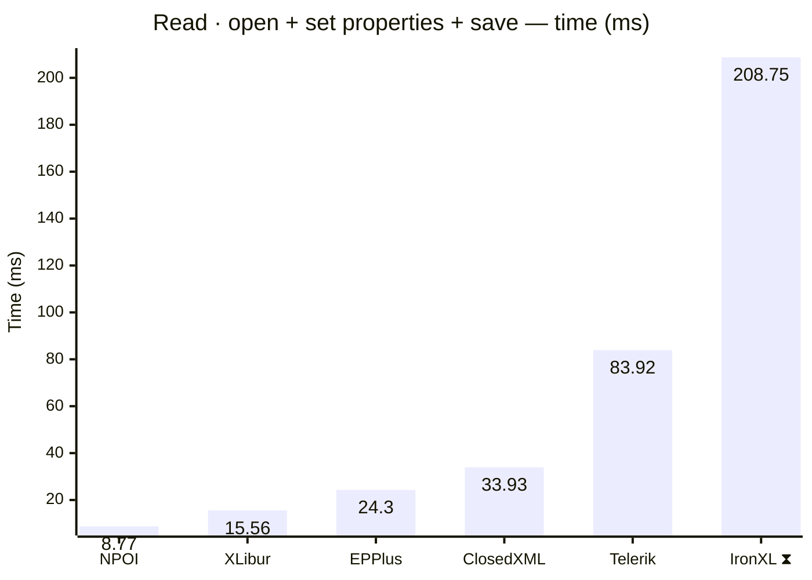
```mermaid
---
config:
  xyChart:
    showDataLabel: true
---
xychart-beta
    title "Read · open + set properties + save — time (ms)"
    x-axis ["NPOI", "XLibur", "EPPlus", "ClosedXML", "Telerik", "IronXL ⧗"]
    y-axis "Time (ms)"
    bar [8.77, 15.56, 24.3, 33.93, 83.92, 208.75]
```

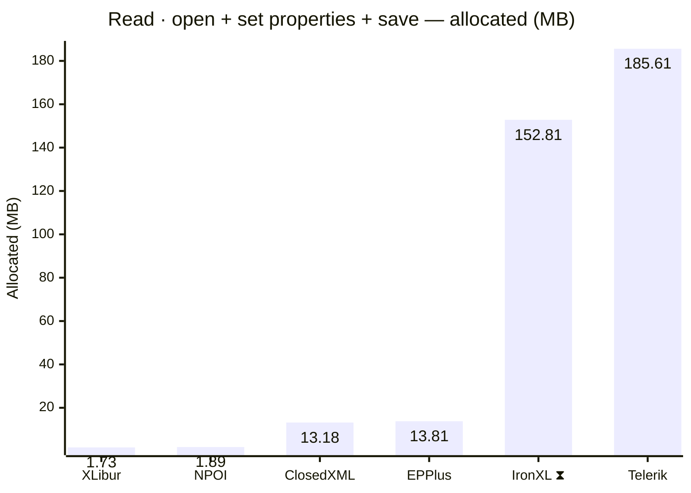
```mermaid
---
config:
  xyChart:
    showDataLabel: true
---
xychart-beta
    title "Read · open + set properties + save — allocated (MB)"
    x-axis ["XLibur", "NPOI", "ClosedXML", "EPPlus", "IronXL ⧗", "Telerik"]
    y-axis "Allocated (MB)"
    bar [1.73, 1.89, 13.18, 13.81, 152.81, 185.61]
```

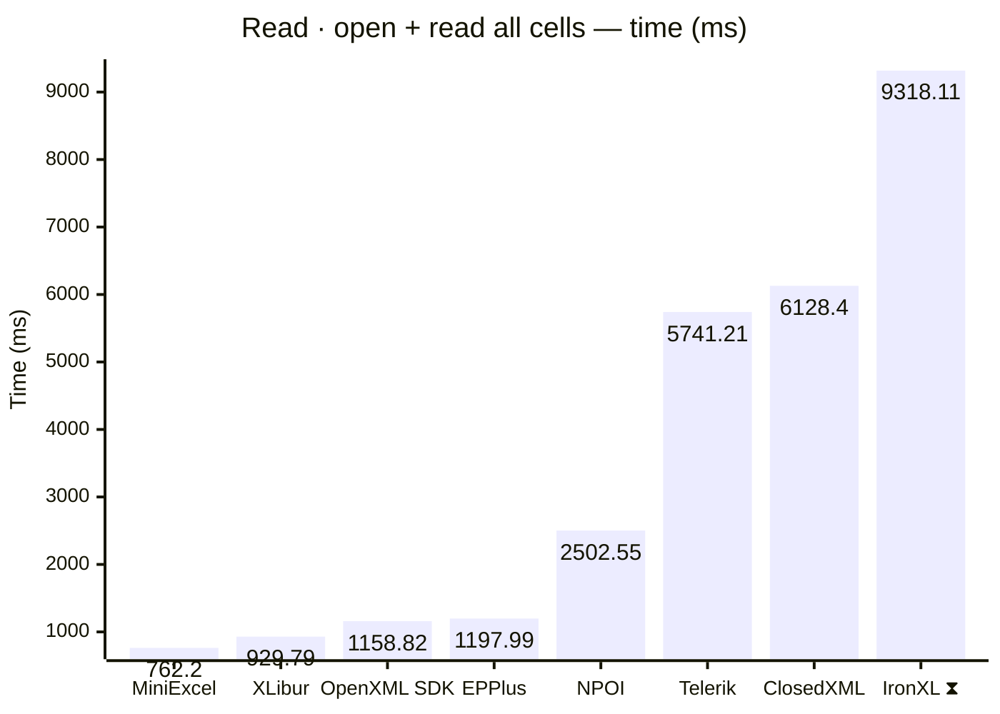
```mermaid
---
config:
  xyChart:
    showDataLabel: true
---
xychart-beta
    title "Read · open + read all cells — time (ms)"
    x-axis ["MiniExcel", "XLibur", "OpenXML SDK", "EPPlus", "NPOI", "Telerik", "ClosedXML", "IronXL ⧗"]
    y-axis "Time (ms)"
    bar [762.2, 929.79, 1158.82, 1197.99, 2502.55, 5741.21, 6128.4, 9318.11]
```

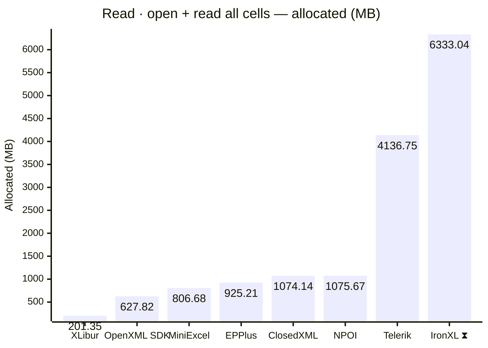
```mermaid
---
config:
  xyChart:
    showDataLabel: true
---
xychart-beta
    title "Read · open + read all cells — allocated (MB)"
    x-axis ["XLibur", "OpenXML SDK", "MiniExcel", "EPPlus", "ClosedXML", "NPOI", "Telerik", "IronXL ⧗"]
    y-axis "Allocated (MB)"
    bar [201.35, 627.82, 806.68, 925.21, 1074.14, 1075.67, 4136.75, 6333.04]
```

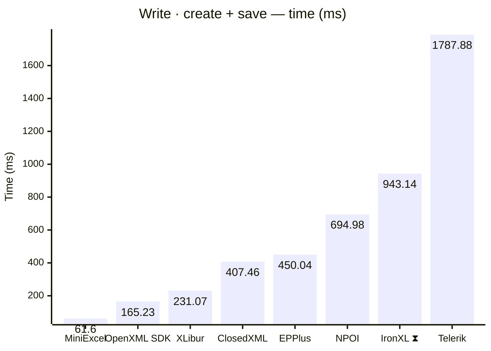
```mermaid
---
config:
  xyChart:
    showDataLabel: true
---
xychart-beta
    title "Write · create + save — time (ms)"
    x-axis ["MiniExcel", "OpenXML SDK", "XLibur", "ClosedXML", "EPPlus", "NPOI", "IronXL ⧗", "Telerik"]
    y-axis "Time (ms)"
    bar [61.6, 165.23, 231.07, 407.46, 450.04, 694.98, 943.14, 1787.88]
```

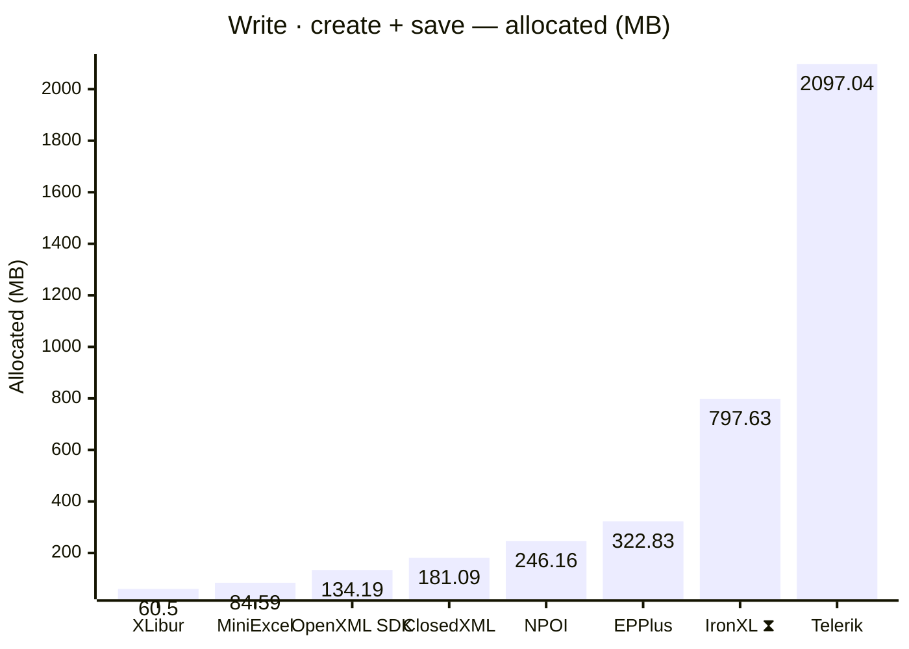
```mermaid
---
config:
  xyChart:
    showDataLabel: true
---
xychart-beta
    title "Write · create + save — allocated (MB)"
    x-axis ["XLibur", "MiniExcel", "OpenXML SDK", "ClosedXML", "NPOI", "EPPlus", "IronXL ⧗", "Telerik"]
    y-axis "Allocated (MB)"
    bar [60.5, 84.59, 134.19, 181.09, 246.16, 322.83, 797.63, 2097.04]
```

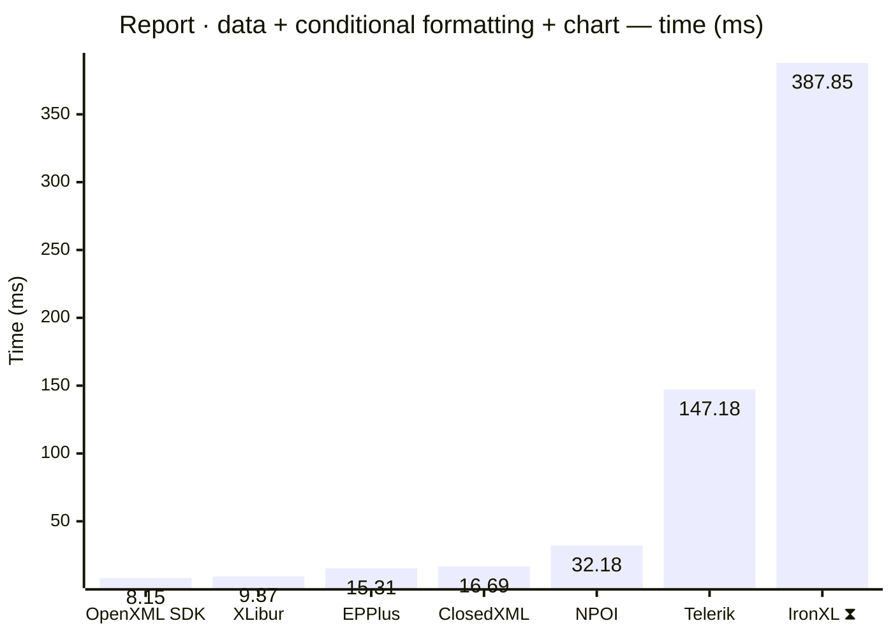
```mermaid
---
config:
  xyChart:
    showDataLabel: true
---
xychart-beta
    title "Report · data + conditional formatting + chart — time (ms)"
    x-axis ["OpenXML SDK", "XLibur", "EPPlus", "ClosedXML", "NPOI", "Telerik", "IronXL ⧗"]
    y-axis "Time (ms)"
    bar [8.15, 9.37, 15.31, 16.69, 32.18, 147.18, 387.85]
```

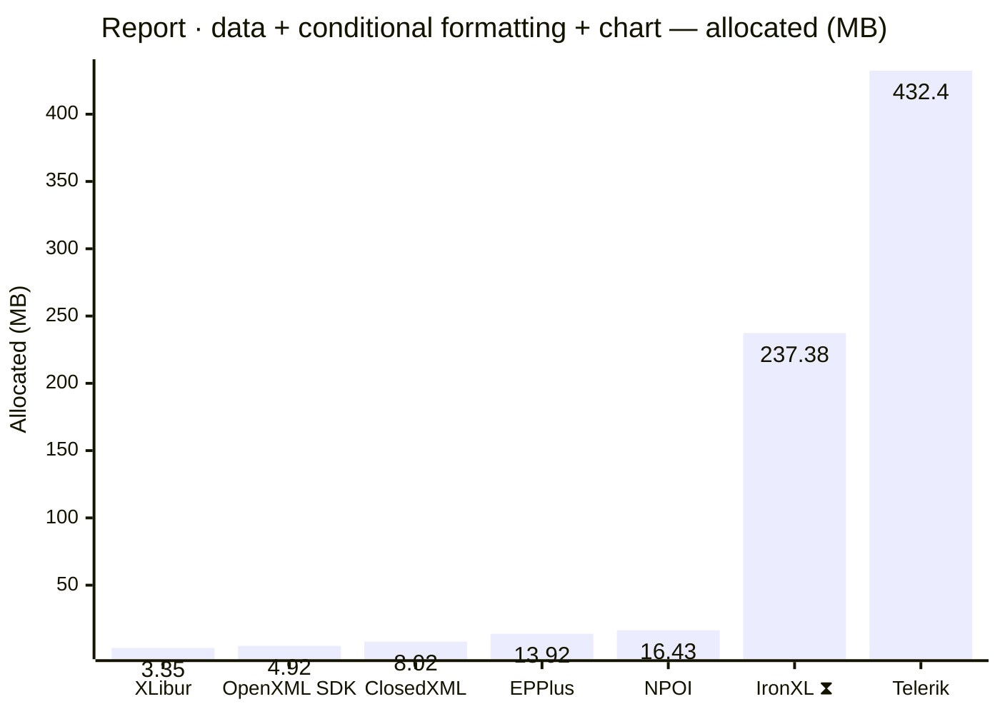
```mermaid
---
config:
  xyChart:
    showDataLabel: true
---
xychart-beta
    title "Report · data + conditional formatting + chart — allocated (MB)"
    x-axis ["XLibur", "OpenXML SDK", "ClosedXML", "EPPlus", "NPOI", "IronXL ⧗", "Telerik"]
    y-axis "Allocated (MB)"
    bar [3.35, 4.92, 8.02, 13.92, 16.43, 237.38, 432.4]
```

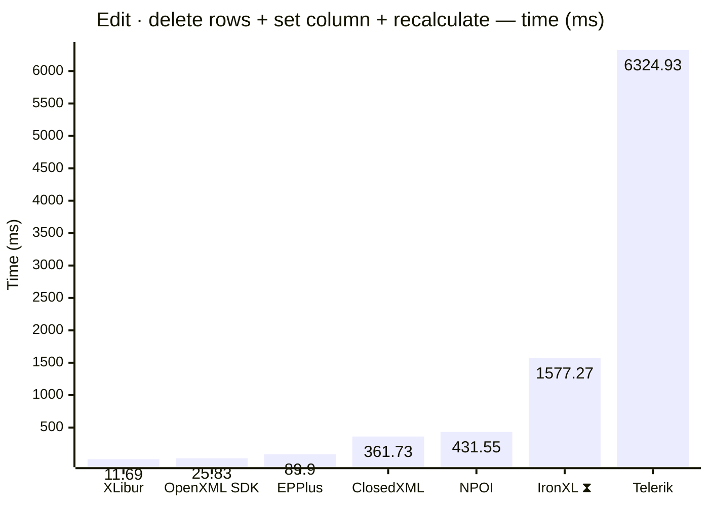
```mermaid
---
config:
  xyChart:
    showDataLabel: true
---
xychart-beta
    title "Edit · delete rows + set column + recalculate — time (ms)"
    x-axis ["XLibur", "OpenXML SDK", "EPPlus", "ClosedXML", "NPOI", "IronXL ⧗", "Telerik"]
    y-axis "Time (ms)"
    bar [11.69, 25.83, 89.9, 361.73, 431.55, 1577.27, 6324.93]
```

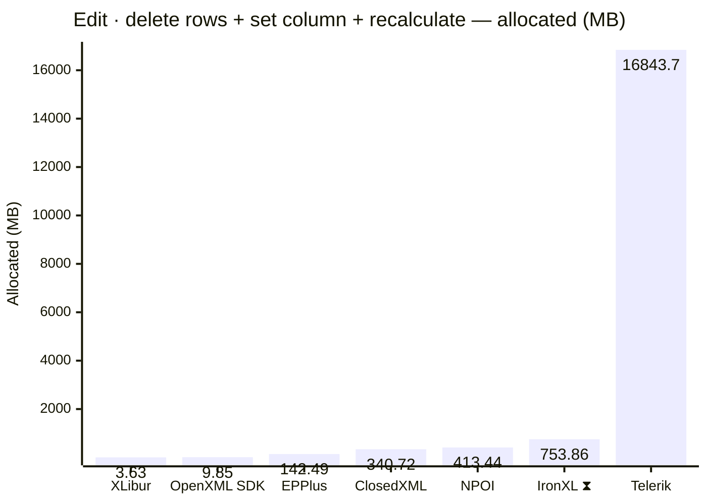
```mermaid
---
config:
  xyChart:
    showDataLabel: true
---
xychart-beta
    title "Edit · delete rows + set column + recalculate — allocated (MB)"
    x-axis ["XLibur", "OpenXML SDK", "EPPlus", "ClosedXML", "NPOI", "IronXL ⧗", "Telerik"]
    y-axis "Allocated (MB)"
    bar [3.63, 9.85, 142.49, 340.72, 413.44, 753.86, 16843.7]
```

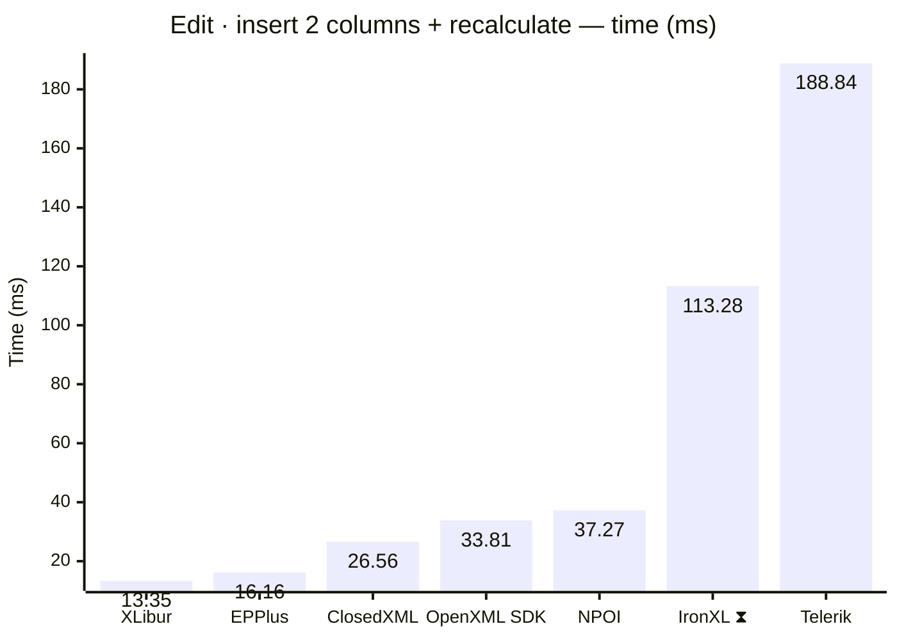
```mermaid
---
config:
  xyChart:
    showDataLabel: true
---
xychart-beta
    title "Edit · insert 2 columns + recalculate — time (ms)"
    x-axis ["XLibur", "EPPlus", "ClosedXML", "OpenXML SDK", "NPOI", "IronXL ⧗", "Telerik"]
    y-axis "Time (ms)"
    bar [13.35, 16.16, 26.56, 33.81, 37.27, 113.28, 188.84]
```

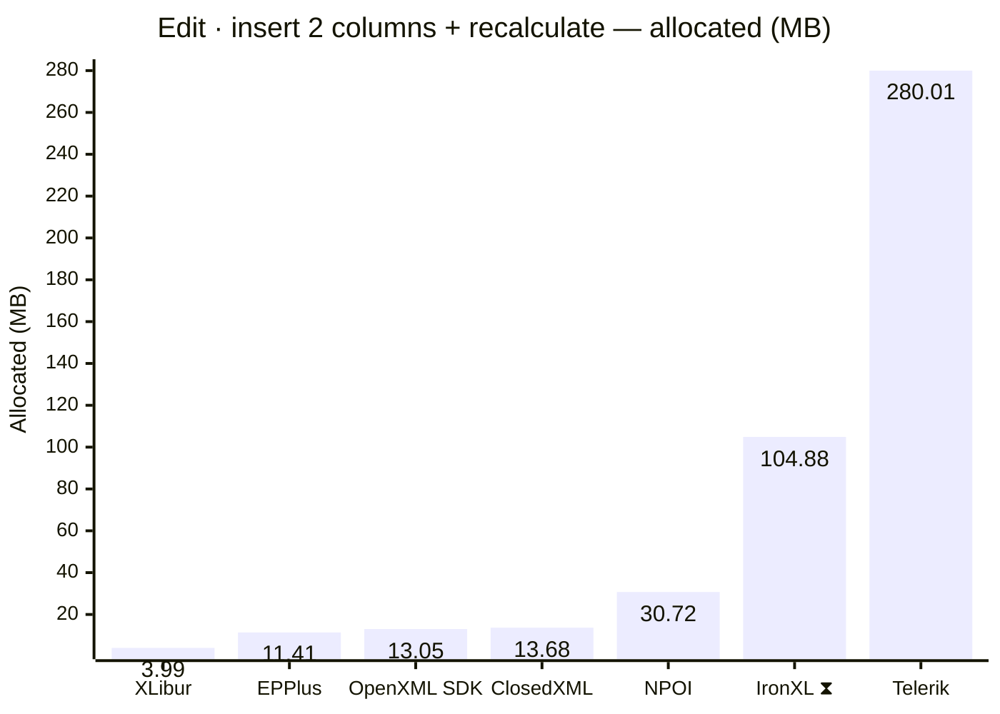
```mermaid
---
config:
  xyChart:
    showDataLabel: true
---
xychart-beta
    title "Edit · insert 2 columns + recalculate — allocated (MB)"
    x-axis ["XLibur", "EPPlus", "OpenXML SDK", "ClosedXML", "NPOI", "IronXL ⧗", "Telerik"]
    y-axis "Allocated (MB)"
    bar [3.99, 11.41, 13.05, 13.68, 30.72, 104.88, 280.01]
```

## Detailed results


```

BenchmarkDotNet v0.15.8, Windows 11 (10.0.22631.6199/23H2/2023Update/SunValley3)
AMD Ryzen 9 5950X 3.40GHz, 1 CPU, 32 logical and 16 physical cores
.NET SDK 10.0.401
  [Host]     : .NET 10.0.12 (10.0.12, 10.0.1226.42308), X64 RyuJIT x86-64-v3
  DefaultJob : .NET 10.0.12 (10.0.12, 10.0.1226.42308), X64 RyuJIT x86-64-v3


```

### Read · open + set properties + save

| Library     | Type                      | Method                      | Mean         | Error       | StdDev      | Gen0         | Gen1        | Gen2       | Allocated  |
|------------ |-------------------------- |---------------------------- |-------------:|------------:|------------:|-------------:|------------:|-----------:|-----------:|
| NPOI        | NpoiReadBenchmarks        | OpenAmendPropertiesAndSave  |     8.766 ms |   0.1699 ms |   0.2381 ms |      62.5000 |     31.2500 |          - |    1.89 MB |
| XLibur      | XLiburReadBenchmarks      | OpenAmendPropertiesAndSave  |    15.557 ms |   0.3055 ms |   0.3269 ms |            - |           - |          - |    1.73 MB |
| EPPlus      | EpPlusReadBenchmarks      | OpenAmendPropertiesAndSave  |    24.297 ms |   0.4817 ms |   0.5916 ms |    1000.0000 |   1000.0000 |  1000.0000 |   13.81 MB |
| ClosedXML   | ClosedXmlReadBenchmarks   | OpenAmendPropertiesAndSave  |    33.934 ms |   0.6605 ms |   0.5855 ms |     666.6667 |    333.3333 |          - |   13.18 MB |
| Telerik     | TelerikReadBenchmarks     | OpenAmendPropertiesAndSave  |    83.925 ms |   1.5700 ms |   1.6123 ms |   10666.6667 |   1000.0000 |   666.6667 |  185.61 MB |
| IronXL ⧗ | IronXlReadBenchmarks | OpenAmendPropertiesAndSave | 208.746 ms | 155.7570 ms | 92.6885 ms | 9000.0000 | 2000.0000 | - | 152.81 MB |

### Read · open + read all cells

| Library     | Type                      | Method                      | Mean         | Error       | StdDev      | Gen0         | Gen1        | Gen2       | Allocated  |
|------------ |-------------------------- |---------------------------- |-------------:|------------:|------------:|-------------:|------------:|-----------:|-----------:|
| MiniExcel   | MiniExcelReadBenchmarks   | OpenAndReadAll              |   762.200 ms |  11.2987 ms |  10.5688 ms |   50000.0000 |   3000.0000 |          - |  806.68 MB |
| XLibur      | XLiburReadBenchmarks      | OpenAndReadAll              |   929.794 ms |  18.4741 ms |  20.5339 ms |   13000.0000 |   8000.0000 |  2000.0000 |  201.35 MB |
| OpenXML SDK | OpenXmlReadBenchmarks     | OpenAndReadAll              | 1,158.821 ms |  17.8879 ms |  15.8571 ms |   40000.0000 |   6000.0000 |  1000.0000 |  627.82 MB |
| EPPlus      | EpPlusReadBenchmarks      | OpenAndReadAll              | 1,197.995 ms |  22.1133 ms |  56.2854 ms |   49000.0000 |  14000.0000 |  7000.0000 |  925.21 MB |
| NPOI        | NpoiReadBenchmarks        | OpenAndReadAll              | 2,502.545 ms |  45.2512 ms |  42.3280 ms |   68000.0000 |  62000.0000 |  6000.0000 | 1075.67 MB |
| Telerik     | TelerikReadBenchmarks     | OpenAndReadAll              | 5,741.211 ms | 111.0687 ms | 109.0843 ms |  251000.0000 |  51000.0000 |  6000.0000 | 4136.75 MB |
| ClosedXML   | ClosedXmlReadBenchmarks   | OpenAndReadAll              | 6,128.402 ms |  66.5220 ms |  62.2247 ms |   60000.0000 |  24000.0000 |  4000.0000 | 1074.14 MB |
| IronXL ⧗ | IronXlReadBenchmarks | OpenAndReadAll | 9,318.107 ms | 477.3336 ms | 315.7266 ms | 393000.0000 | 202000.0000 | 10000.0000 | 6333.04 MB |

### Write · create + save

| Library     | Type                      | Method                      | Mean         | Error       | StdDev      | Gen0         | Gen1        | Gen2       | Allocated  |
|------------ |-------------------------- |---------------------------- |-------------:|------------:|------------:|-------------:|------------:|-----------:|-----------:|
| MiniExcel   | MiniExcelWriteBenchmarks  | CreateAndSave               |    61.597 ms |   1.2282 ms |   1.6396 ms |    5666.6667 |   1777.7778 |  1666.6667 |   84.59 MB |
| OpenXML SDK | OpenXmlWriteBenchmarks    | CreateAndSave               |   165.231 ms |   3.3018 ms |   6.3614 ms |    8750.0000 |   2000.0000 |  2000.0000 |  134.19 MB |
| XLibur      | XLiburWriteBenchmarks     | CreateAndSave               |   231.074 ms |   4.5768 ms |   6.8503 ms |    3000.0000 |   2000.0000 |  2000.0000 |    60.5 MB |
| ClosedXML   | ClosedXmlWriteBenchmarks  | CreateAndSave               |   407.462 ms |   8.0331 ms |   7.8896 ms |   10000.0000 |   5000.0000 |  2000.0000 |  181.09 MB |
| EPPlus      | EpPlusWriteBenchmarks     | CreateAndSave               |   450.042 ms |   8.7876 ms |  12.3190 ms |   20000.0000 |   9000.0000 |  3000.0000 |  322.83 MB |
| NPOI        | NpoiWriteBenchmarks       | CreateAndSave               |   694.980 ms |  13.3576 ms |  17.3687 ms |   16000.0000 |  12000.0000 |  3000.0000 |  246.16 MB |
| IronXL ⧗ | IronXlWriteBenchmarks | CreateAndSave | 943.137 ms | 18.5191 ms | 11.0204 ms | 48000.0000 | 16000.0000 | 3000.0000 | 797.63 MB |
| Telerik     | TelerikWriteBenchmarks    | CreateAndSave               | 1,787.880 ms |  35.3643 ms |  68.9753 ms |  130000.0000 |  13000.0000 |  5000.0000 | 2097.04 MB |

### Report · data + conditional formatting + chart

| Library     | Type                      | Method                      | Mean         | Error       | StdDev      | Gen0         | Gen1        | Gen2       | Allocated  |
|------------ |-------------------------- |---------------------------- |-------------:|------------:|------------:|-------------:|------------:|-----------:|-----------:|
| OpenXML SDK | OpenXmlReportBenchmarks   | CreateStockReport           |     8.147 ms |   0.1396 ms |   0.1371 ms |     375.0000 |    359.3750 |   187.5000 |    4.92 MB |
| XLibur      | XLiburReportBenchmarks    | CreateStockReport           |     9.373 ms |   0.1809 ms |   0.3263 ms |     187.5000 |    187.5000 |   187.5000 |    3.35 MB |
| EPPlus      | EpPlusReportBenchmarks    | CreateStockReport           |    15.315 ms |   0.3003 ms |   0.4676 ms |    1000.0000 |   1000.0000 |  1000.0000 |   13.92 MB |
| ClosedXML   | ClosedXmlReportBenchmarks | CreateStockReport           |    16.688 ms |   0.2664 ms |   0.2492 ms |     468.7500 |    187.5000 |    31.2500 |    8.02 MB |
| NPOI        | NpoiReportBenchmarks      | CreateStockReport           |    32.175 ms |   0.6421 ms |   1.0550 ms |     833.3333 |    666.6667 |   333.3333 |   16.43 MB |
| Telerik     | TelerikReportBenchmarks   | CreateStockReport           |   147.182 ms |   3.5537 ms |  10.0232 ms |   27000.0000 |   6000.0000 |  2000.0000 |   432.4 MB |
| IronXL ⧗ | IronXlReportBenchmarks | CreateStockReport | 387.849 ms | 36.5456 ms | 24.1726 ms | 14000.0000 | 3000.0000 | - | 237.38 MB |

### Edit · delete rows + set column + recalculate

| Library     | Type                      | Method                      | Mean         | Error       | StdDev      | Gen0         | Gen1        | Gen2       | Allocated  |
|------------ |-------------------------- |---------------------------- |-------------:|------------:|------------:|-------------:|------------:|-----------:|-----------:|
| XLibur      | XLiburEditBenchmarks      | EditAndRecalculate          |    11.689 ms |   0.1505 ms |   0.1334 ms |     218.7500 |     93.7500 |          - |    3.63 MB |
| OpenXML SDK | OpenXmlEditBenchmarks     | EditAndRecalculate          |    25.834 ms |   0.5166 ms |   1.1339 ms |     500.0000 |    333.3333 |   166.6667 |    9.85 MB |
| EPPlus      | EpPlusEditBenchmarks      | EditAndRecalculate          |    89.897 ms |   1.6981 ms |   2.2669 ms |    9000.0000 |   1200.0000 |  1000.0000 |  142.49 MB |
| ClosedXML   | ClosedXmlEditBenchmarks   | EditAndRecalculate          |   361.728 ms |   7.2054 ms |   6.0168 ms |   21000.0000 |   1000.0000 |          - |  340.72 MB |
| NPOI        | NpoiEditBenchmarks        | EditAndRecalculate          |   431.549 ms |   8.5152 ms |  11.9372 ms |   25000.0000 |   1000.0000 |          - |  413.44 MB |
| IronXL ⧗ | IronXlEditBenchmarks | EditAndRecalculate | 1,577.273 ms | 62.9583 ms | 41.6430 ms | 57000.0000 | 36000.0000 | 15000.0000 | 753.86 MB |
| Telerik     | TelerikEditBenchmarks     | EditAndRecalculate          | 6,324.933 ms | 125.0163 ms | 166.8932 ms | 1061000.0000 | 241000.0000 | 76000.0000 | 16843.7 MB |

### Edit · insert 2 columns + recalculate

| Library     | Type                      | Method                      | Mean         | Error       | StdDev      | Gen0         | Gen1        | Gen2       | Allocated  |
|------------ |-------------------------- |---------------------------- |-------------:|------------:|------------:|-------------:|------------:|-----------:|-----------:|
| XLibur      | XLiburInsertBenchmarks    | InsertColumnsAndRecalculate |    13.354 ms |   0.2457 ms |   0.4963 ms |     250.0000 |    125.0000 |          - |    3.99 MB |
| EPPlus      | EpPlusInsertBenchmarks    | InsertColumnsAndRecalculate |    16.162 ms |   0.3041 ms |   0.7168 ms |    1000.0000 |   1000.0000 |  1000.0000 |   11.41 MB |
| ClosedXML   | ClosedXmlInsertBenchmarks | InsertColumnsAndRecalculate |    26.557 ms |   0.5159 ms |   0.6142 ms |     750.0000 |    250.0000 |          - |   13.68 MB |
| OpenXML SDK | OpenXmlInsertBenchmarks   | InsertColumnsAndRecalculate |    33.808 ms |   0.6355 ms |   0.7064 ms |     750.0000 |    500.0000 |   250.0000 |   13.05 MB |
| NPOI        | NpoiInsertBenchmarks      | InsertColumnsAndRecalculate |    37.268 ms |   0.7450 ms |   1.8552 ms |    2000.0000 |   1333.3333 |   500.0000 |   30.72 MB |
| IronXL ⧗ | IronXlInsertBenchmarks | InsertColumnsAndRecalculate | 113.284 ms | 41.9750 ms | 27.7638 ms | 7000.0000 | 2500.0000 | 750.0000 | 104.88 MB |
| Telerik     | TelerikInsertBenchmarks   | InsertColumnsAndRecalculate |   188.835 ms |   3.7544 ms |  10.3406 ms |   18000.0000 |   6000.0000 |  2000.0000 |  280.01 MB |


<script type="module">
  import mermaid from 'https://cdn.jsdelivr.net/npm/mermaid@11/dist/mermaid.esm.min.mjs';
  const blocks = document.querySelectorAll('.language-mermaid');
  blocks.forEach(el => {
    const code = el.querySelector('code') || el;
    const pre = document.createElement('pre');
    pre.className = 'mermaid';
    pre.textContent = code.textContent;
    el.replaceWith(pre);
  });
  if (blocks.length) {
    mermaid.initialize({ startOnLoad: false });
    await mermaid.run({ querySelector: 'pre.mermaid' });
  }
</script>

<script>
(function () {
  const parse = s => { const n = parseFloat(String(s).replace(/,/g, '')); return Number.isFinite(n) ? n : null; };
  document.querySelectorAll('table').forEach(table => {
    if (!table.tHead || !table.tBodies[0]) return;
    const heads = [...table.tHead.rows[0].cells].map(c => c.textContent.trim().toLowerCase());
    if (!heads.includes('mean')) return;
    const metricCols = heads.map((h, i) => /^(mean|allocated|gen0|gen1|gen2)$/.test(h) ? i : -1).filter(i => i >= 0);
    const rows = [...table.tBodies[0].rows];
    for (const c of metricCols) {
      const vals = rows.map(r => parse(r.cells[c]?.textContent));
      const nums = vals.filter(v => v !== null);
      if (nums.length < 2) continue;
      const min = Math.min(...nums), max = Math.max(...nums);
      if (max === min) continue;
      rows.forEach((r, i) => {
        const v = vals[i]; if (v === null) return;
        const ratio = (v - min) / (max - min);
        r.cells[c].style.backgroundColor = `hsla(${120 - 120 * ratio}, 70%, 50%, 0.45)`;
      });
    }
  });
})();
</script>
