<style>
  .main-content { max-width: 90% !important; padding-left: 2rem !important; padding-right: 2rem !important; }
</style>
<!-- Generated by XLBench. Do not edit by hand; re-run scripts/run-benchmarks.ps1. -->
# XLBench Results

Each section below embeds the full BenchmarkDotNet environment block (OS, CPU,
.NET SDK and runtime). Timings are hardware-specific; treat the allocation/GC
columns as the most portable signal across machines. Regenerate locally with
`scripts/run-benchmarks.ps1`.

📈 **[Interactive charts](charts.html)** (GitHub Pages). Static charts and the full tables follow.

Each results table (one per test method) is heat-mapped independently on the Pages site (🟩 best → 🟥 worst).

> ⧗ **Carried over from an earlier run.** The rows and chart points below marked with this symbol were not measured here — the library is commercial and needs a licence key this run did not have — so they are replayed from `snapshots/`. Compare them as indicative rather than like-for-like, and see the repository README for how to refresh a snapshot.
>
> - **IronXL** 2026.8.1, Job-HTCPYF job, captured 2026-08-03 on same hardware as this run.

## Libraries under test

| Library | Version | Source |
| --- | --- | --- |
| ClosedXML | 0.105.1 | this run |
| EPPlus | 8.7.2 | this run |
| OpenXML SDK | 3.5.1 | this run |
| NPOI | 2.8.1 | this run |
| MiniExcel | 1.46.0 | this run |
| Sylvan | 0.5.8 | this run |
| XLibur | 0.800.0 | this run |
| OfficeIMO | 3.5.3 | this run |
| Telerik | 2026.3.1027.100 | this run |
| IronXL ⧗ | 2026.8.1 | snapshot (2026.8.1, Job-HTCPYF, captured 2026-08-03) |

## Comparison charts

_Lower is better. Charts render in the GitHub file view; the Pages site has interactive versions._

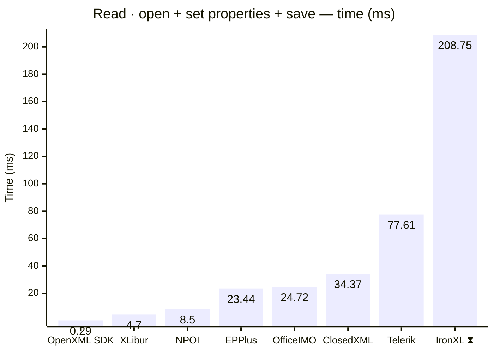
```mermaid
---
config:
  xyChart:
    showDataLabel: true
---
xychart-beta
    title "Read · open + set properties + save — time (ms)"
    x-axis ["OpenXML SDK", "XLibur", "NPOI", "EPPlus", "OfficeIMO", "ClosedXML", "Telerik", "IronXL ⧗"]
    y-axis "Time (ms)"
    bar [0.29, 4.7, 8.5, 23.44, 24.72, 34.37, 77.61, 208.75]
```

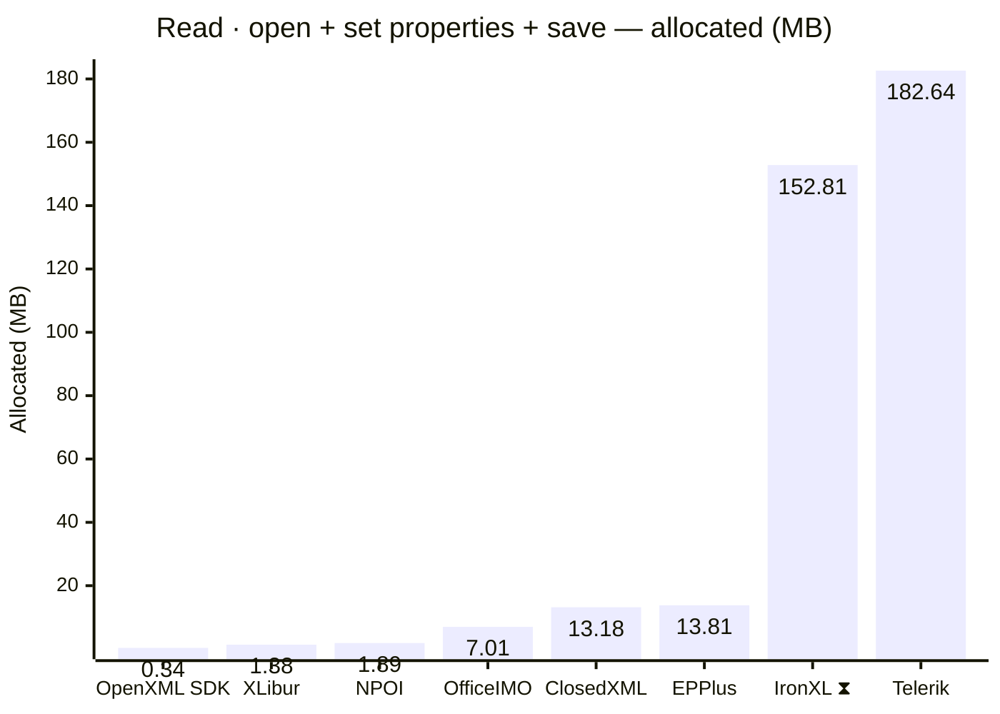
```mermaid
---
config:
  xyChart:
    showDataLabel: true
---
xychart-beta
    title "Read · open + set properties + save — allocated (MB)"
    x-axis ["OpenXML SDK", "XLibur", "NPOI", "OfficeIMO", "ClosedXML", "EPPlus", "IronXL ⧗", "Telerik"]
    y-axis "Allocated (MB)"
    bar [0.34, 1.38, 1.89, 7.01, 13.18, 13.81, 152.81, 182.64]
```

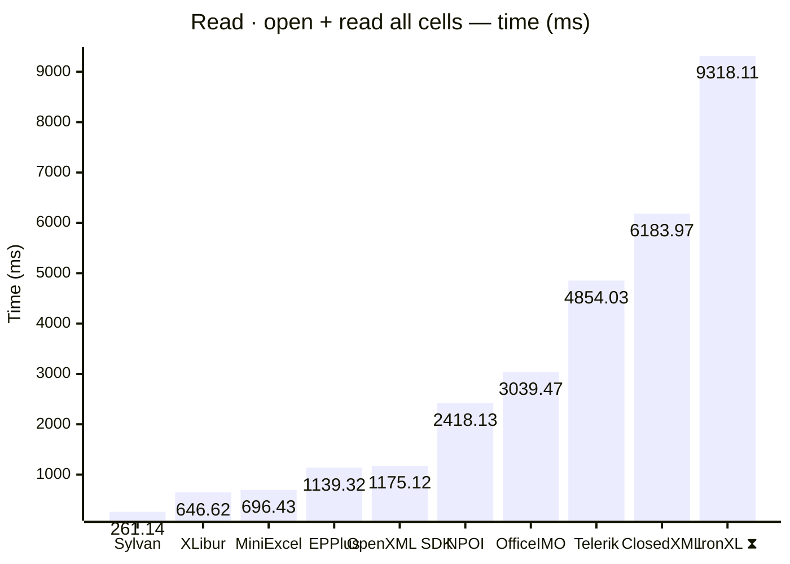
```mermaid
---
config:
  xyChart:
    showDataLabel: true
---
xychart-beta
    title "Read · open + read all cells — time (ms)"
    x-axis ["Sylvan", "XLibur", "MiniExcel", "EPPlus", "OpenXML SDK", "NPOI", "OfficeIMO", "Telerik", "ClosedXML", "IronXL ⧗"]
    y-axis "Time (ms)"
    bar [261.14, 646.62, 696.43, 1139.32, 1175.12, 2418.13, 3039.47, 4854.03, 6183.97, 9318.11]
```

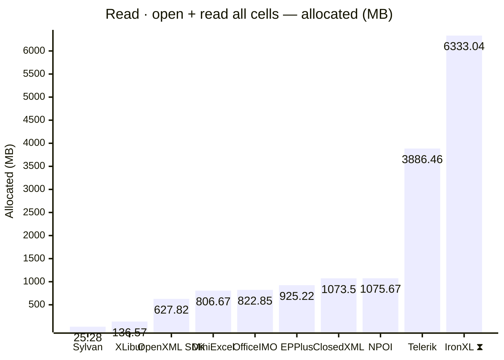
```mermaid
---
config:
  xyChart:
    showDataLabel: true
---
xychart-beta
    title "Read · open + read all cells — allocated (MB)"
    x-axis ["Sylvan", "XLibur", "OpenXML SDK", "MiniExcel", "OfficeIMO", "EPPlus", "ClosedXML", "NPOI", "Telerik", "IronXL ⧗"]
    y-axis "Allocated (MB)"
    bar [25.28, 136.57, 627.82, 806.67, 822.85, 925.22, 1073.5, 1075.67, 3886.46, 6333.04]
```

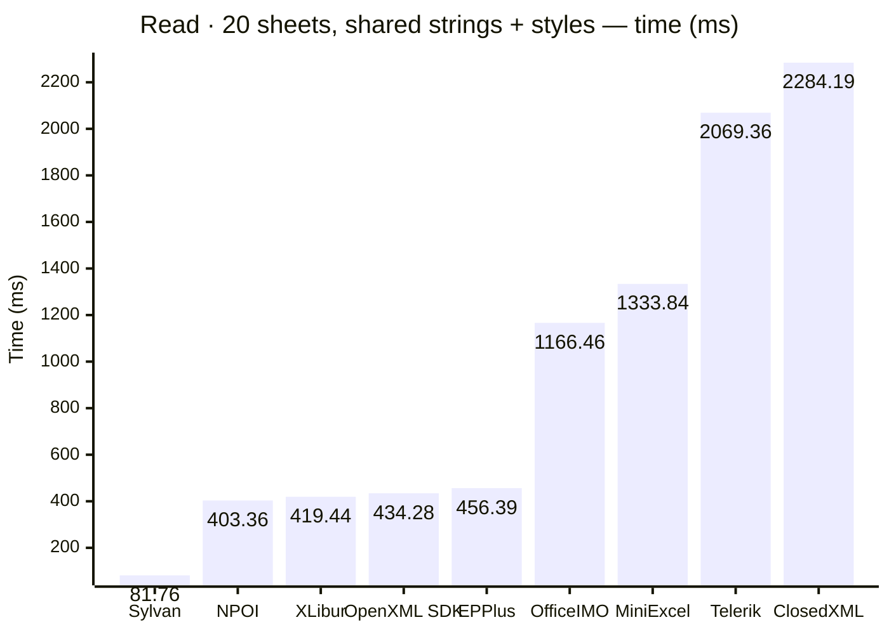
```mermaid
---
config:
  xyChart:
    showDataLabel: true
---
xychart-beta
    title "Read · 20 sheets, shared strings + styles — time (ms)"
    x-axis ["Sylvan", "NPOI", "XLibur", "OpenXML SDK", "EPPlus", "OfficeIMO", "MiniExcel", "Telerik", "ClosedXML"]
    y-axis "Time (ms)"
    bar [81.76, 403.36, 419.44, 434.28, 456.39, 1166.46, 1333.84, 2069.36, 2284.19]
```

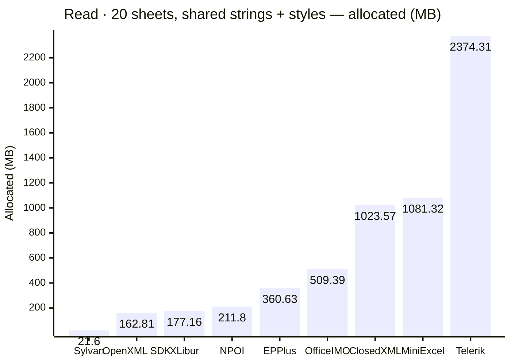
```mermaid
---
config:
  xyChart:
    showDataLabel: true
---
xychart-beta
    title "Read · 20 sheets, shared strings + styles — allocated (MB)"
    x-axis ["Sylvan", "OpenXML SDK", "XLibur", "NPOI", "EPPlus", "OfficeIMO", "ClosedXML", "MiniExcel", "Telerik"]
    y-axis "Allocated (MB)"
    bar [21.6, 162.81, 177.16, 211.8, 360.63, 509.39, 1023.57, 1081.32, 2374.31]
```

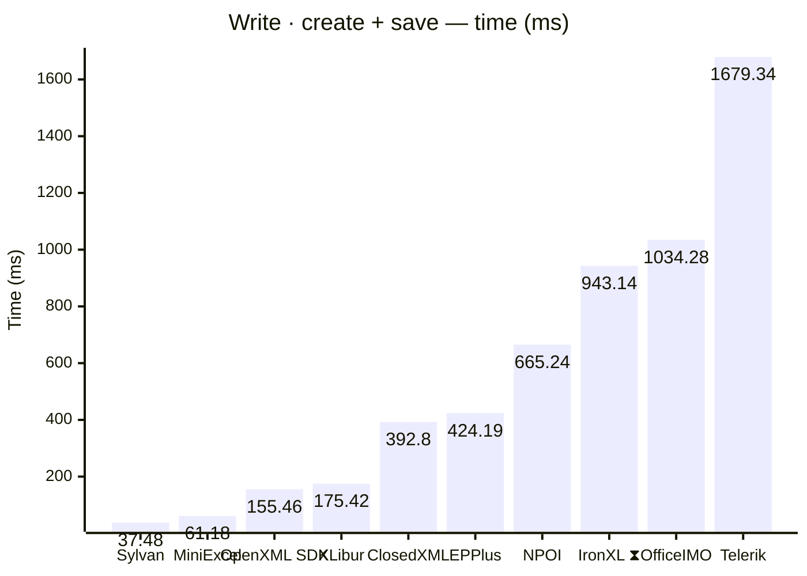
```mermaid
---
config:
  xyChart:
    showDataLabel: true
---
xychart-beta
    title "Write · create + save — time (ms)"
    x-axis ["Sylvan", "MiniExcel", "OpenXML SDK", "XLibur", "ClosedXML", "EPPlus", "NPOI", "IronXL ⧗", "OfficeIMO", "Telerik"]
    y-axis "Time (ms)"
    bar [37.48, 61.18, 155.46, 175.42, 392.8, 424.19, 665.24, 943.14, 1034.28, 1679.34]
```


```mermaid
---
config:
  xyChart:
    showDataLabel: true
---
xychart-beta
    title "Write · create + save — allocated (MB)"
    x-axis ["Sylvan", "XLibur", "MiniExcel", "OpenXML SDK", "ClosedXML", "NPOI", "EPPlus", "OfficeIMO", "IronXL ⧗", "Telerik"]
    y-axis "Allocated (MB)"
    bar [13.27, 60.19, 84.59, 134.19, 181.1, 246.27, 322.83, 406.69, 797.63, 1983.49]
```

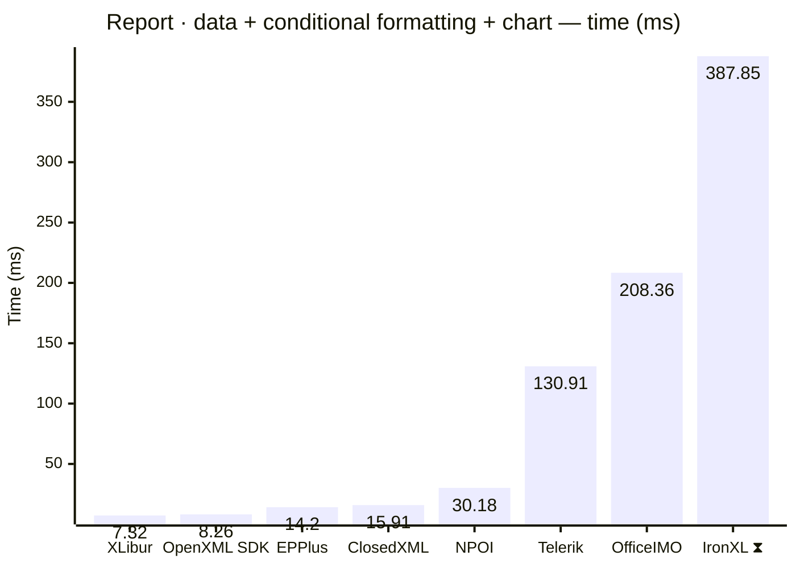
```mermaid
---
config:
  xyChart:
    showDataLabel: true
---
xychart-beta
    title "Report · data + conditional formatting + chart — time (ms)"
    x-axis ["XLibur", "OpenXML SDK", "EPPlus", "ClosedXML", "NPOI", "Telerik", "OfficeIMO", "IronXL ⧗"]
    y-axis "Time (ms)"
    bar [7.32, 8.26, 14.2, 15.91, 30.18, 130.91, 208.36, 387.85]
```

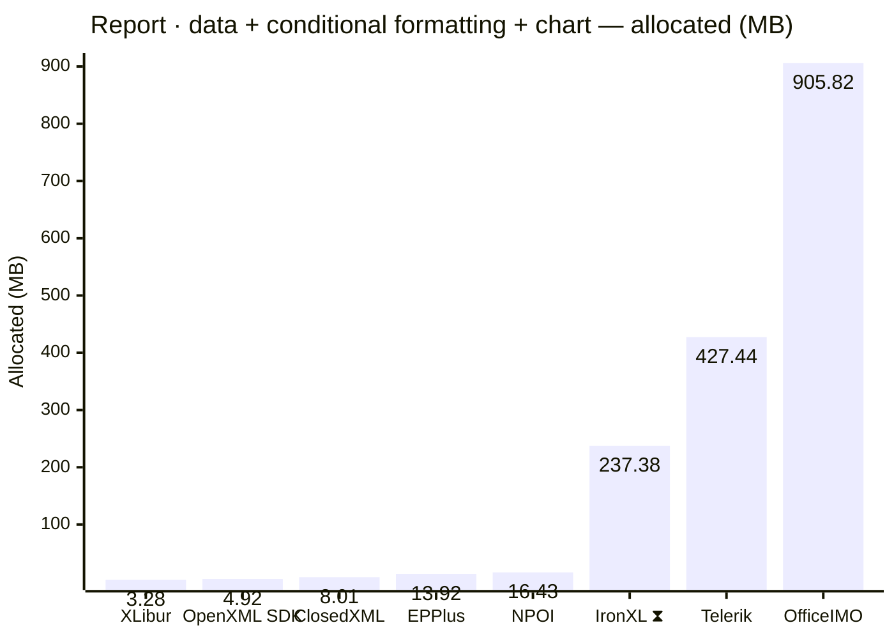
```mermaid
---
config:
  xyChart:
    showDataLabel: true
---
xychart-beta
    title "Report · data + conditional formatting + chart — allocated (MB)"
    x-axis ["XLibur", "OpenXML SDK", "ClosedXML", "EPPlus", "NPOI", "IronXL ⧗", "Telerik", "OfficeIMO"]
    y-axis "Allocated (MB)"
    bar [3.28, 4.92, 8.01, 13.92, 16.43, 237.38, 427.44, 905.82]
```


```mermaid
---
config:
  xyChart:
    showDataLabel: true
---
xychart-beta
    title "Edit · delete rows + set column + recalculate — time (ms)"
    x-axis ["XLibur", "OpenXML SDK", "EPPlus", "ClosedXML", "NPOI", "IronXL ⧗", "OfficeIMO", "Telerik"]
    y-axis "Time (ms)"
    bar [7.41, 24.45, 85.15, 333.92, 389.85, 1577.27, 2734.66, 5362.54]
```


```mermaid
---
config:
  xyChart:
    showDataLabel: true
---
xychart-beta
    title "Edit · delete rows + set column + recalculate — allocated (MB)"
    x-axis ["XLibur", "OpenXML SDK", "EPPlus", "ClosedXML", "NPOI", "OfficeIMO", "IronXL ⧗", "Telerik"]
    y-axis "Allocated (MB)"
    bar [2.68, 9.8, 142.49, 337.66, 413.38, 494.08, 753.86, 16624.97]
```

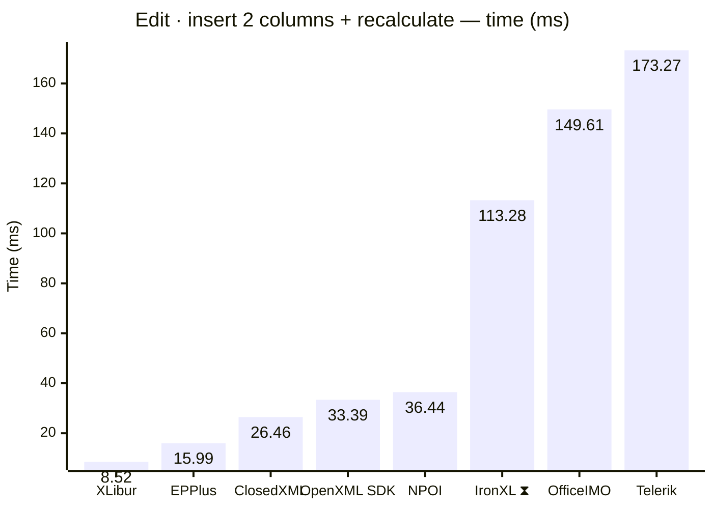
```mermaid
---
config:
  xyChart:
    showDataLabel: true
---
xychart-beta
    title "Edit · insert 2 columns + recalculate — time (ms)"
    x-axis ["XLibur", "EPPlus", "ClosedXML", "OpenXML SDK", "NPOI", "IronXL ⧗", "OfficeIMO", "Telerik"]
    y-axis "Time (ms)"
    bar [8.52, 15.99, 26.46, 33.39, 36.44, 113.28, 149.61, 173.27]
```

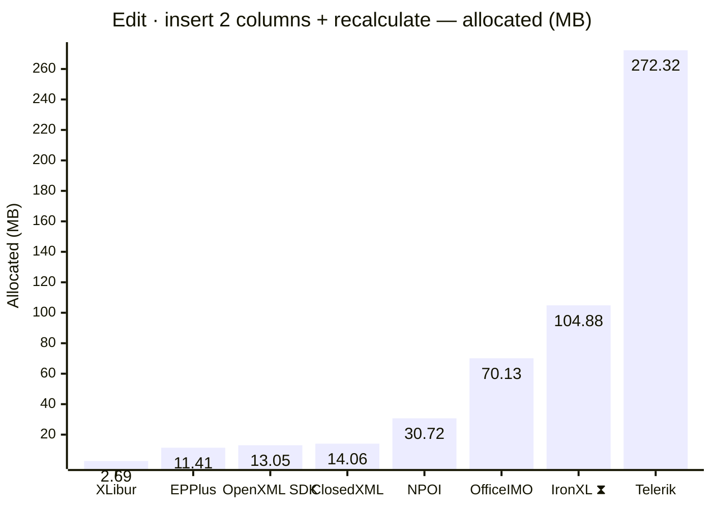
```mermaid
---
config:
  xyChart:
    showDataLabel: true
---
xychart-beta
    title "Edit · insert 2 columns + recalculate — allocated (MB)"
    x-axis ["XLibur", "EPPlus", "OpenXML SDK", "ClosedXML", "NPOI", "OfficeIMO", "IronXL ⧗", "Telerik"]
    y-axis "Allocated (MB)"
    bar [2.69, 11.41, 13.05, 14.06, 30.72, 70.13, 104.88, 272.32]
```

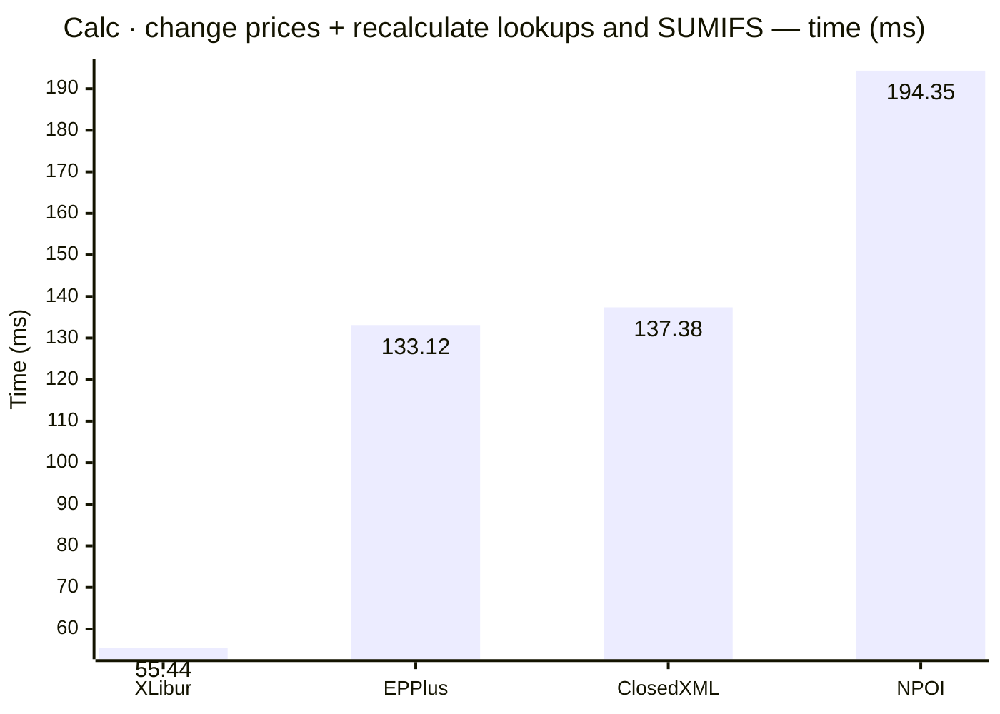
```mermaid
---
config:
  xyChart:
    showDataLabel: true
---
xychart-beta
    title "Calc · change prices + recalculate lookups and SUMIFS — time (ms)"
    x-axis ["XLibur", "EPPlus", "ClosedXML", "NPOI"]
    y-axis "Time (ms)"
    bar [55.44, 133.12, 137.38, 194.35]
```

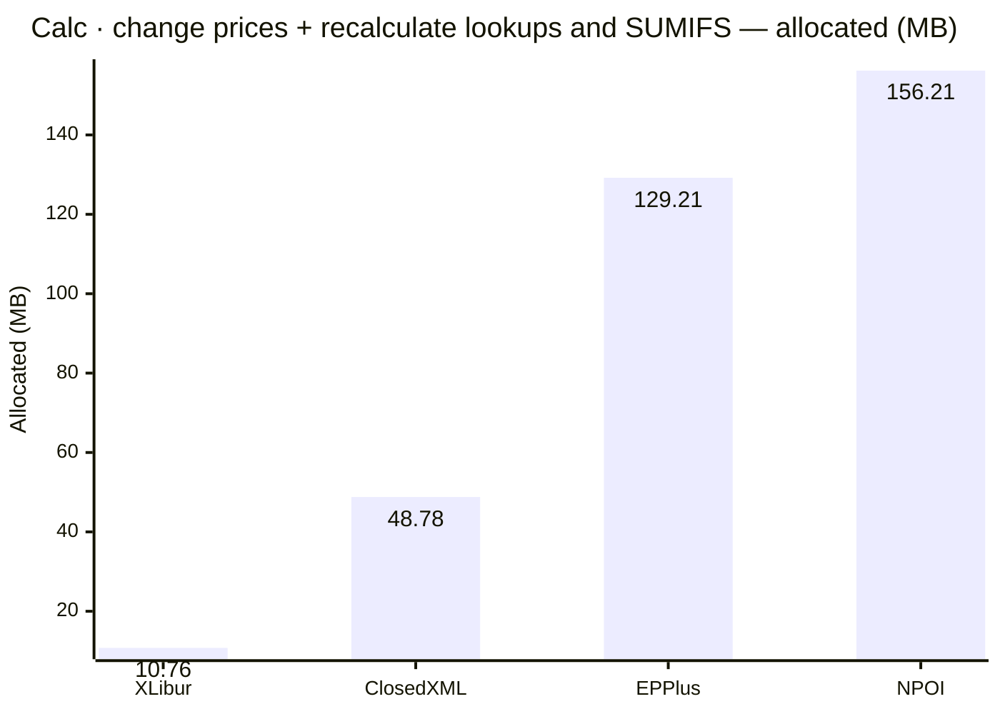
```mermaid
---
config:
  xyChart:
    showDataLabel: true
---
xychart-beta
    title "Calc · change prices + recalculate lookups and SUMIFS — allocated (MB)"
    x-axis ["XLibur", "ClosedXML", "EPPlus", "NPOI"]
    y-axis "Allocated (MB)"
    bar [10.76, 48.78, 129.21, 156.21]
```

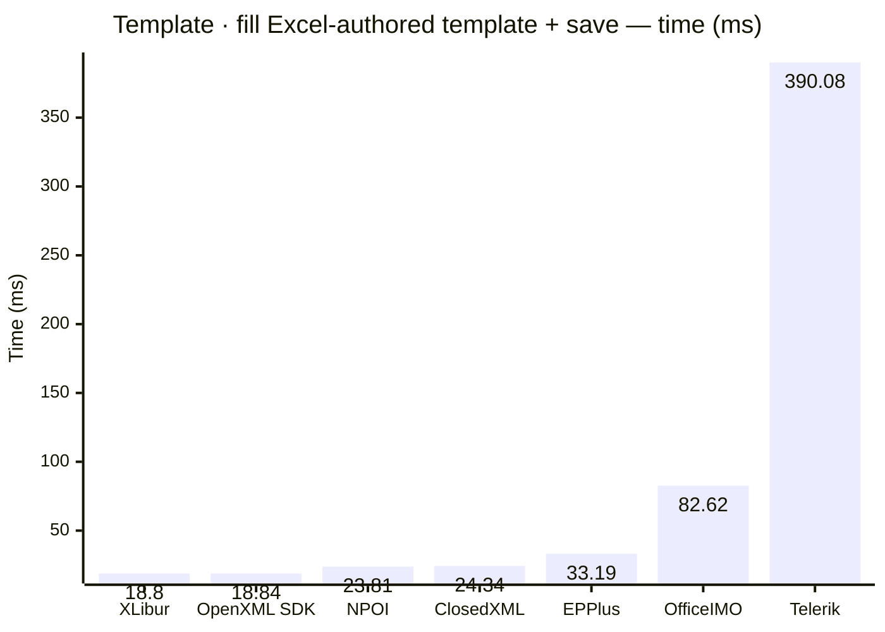
```mermaid
---
config:
  xyChart:
    showDataLabel: true
---
xychart-beta
    title "Template · fill Excel-authored template + save — time (ms)"
    x-axis ["XLibur", "OpenXML SDK", "NPOI", "ClosedXML", "EPPlus", "OfficeIMO", "Telerik"]
    y-axis "Time (ms)"
    bar [18.8, 18.84, 23.81, 24.34, 33.19, 82.62, 390.08]
```

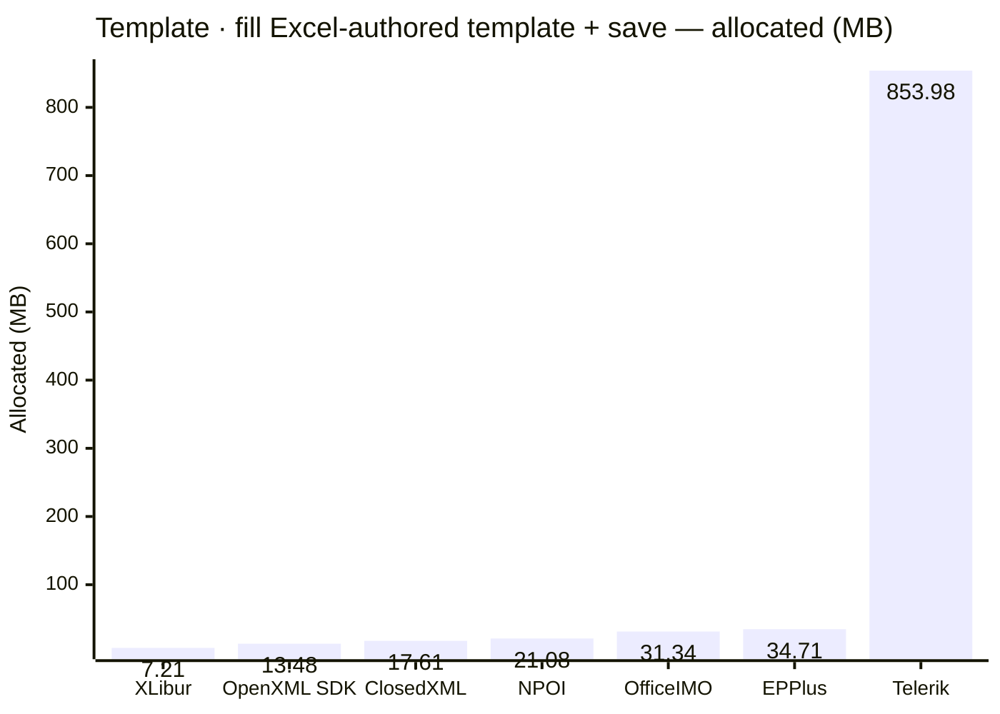
```mermaid
---
config:
  xyChart:
    showDataLabel: true
---
xychart-beta
    title "Template · fill Excel-authored template + save — allocated (MB)"
    x-axis ["XLibur", "OpenXML SDK", "ClosedXML", "NPOI", "OfficeIMO", "EPPlus", "Telerik"]
    y-axis "Allocated (MB)"
    bar [7.21, 13.48, 17.61, 21.08, 31.34, 34.71, 853.98]
```

## Detailed results


```

BenchmarkDotNet v0.15.8, Windows 11 (10.0.22631.6199/23H2/2023Update/SunValley3)
AMD Ryzen 9 5950X 3.40GHz, 1 CPU, 32 logical and 16 physical cores
.NET SDK 10.0.403
  [Host]     : .NET 10.0.14 (10.0.14, 10.0.1426.52326), X64 RyuJIT x86-64-v3
  DefaultJob : .NET 10.0.14 (10.0.14, 10.0.1426.52326), X64 RyuJIT x86-64-v3


```

### Read · open + set properties + save

| Library     | Type                        | Method                      | Mean          | Error      | StdDev      | Median        | Gen0         | Gen1        | Gen2       | Allocated   |
|------------ |---------------------------- |---------------------------- |--------------:|-----------:|------------:|--------------:|-------------:|------------:|-----------:|------------:|
| OpenXML SDK | OpenXmlReadBenchmarks       | OpenAmendPropertiesAndSave  |     0.2908 ms |  0.0057 ms |   0.0124 ms |     0.2908 ms |      29.2969 |     19.0430 |    15.6250 |     0.34 MB |
| XLibur      | XLiburReadBenchmarks        | OpenAmendPropertiesAndSave  |     4.6953 ms |  0.0919 ms |   0.1560 ms |     4.6679 ms |      62.5000 |     31.2500 |          - |     1.38 MB |
| NPOI        | NpoiReadBenchmarks          | OpenAmendPropertiesAndSave  |     8.4984 ms |  0.1073 ms |   0.0951 ms |     8.4933 ms |      62.5000 |     31.2500 |          - |     1.89 MB |
| EPPlus      | EpPlusReadBenchmarks        | OpenAmendPropertiesAndSave  |    23.4438 ms |  0.4644 ms |   0.6199 ms |    23.3269 ms |    1000.0000 |   1000.0000 |  1000.0000 |    13.81 MB |
| OfficeIMO   | OfficeImoReadBenchmarks     | OpenAmendPropertiesAndSave  |    24.7154 ms |  0.4282 ms |   0.3343 ms |    24.6448 ms |     625.0000 |    500.0000 |   437.5000 |     7.01 MB |
| ClosedXML   | ClosedXmlReadBenchmarks     | OpenAmendPropertiesAndSave  |    34.3729 ms |  0.6735 ms |   0.6615 ms |    34.3704 ms |     666.6667 |    333.3333 |          - |    13.18 MB |
| Telerik     | TelerikReadBenchmarks       | OpenAmendPropertiesAndSave  |    77.6071 ms |  1.5390 ms |   3.3129 ms |    78.5900 ms |   10666.6667 |   1000.0000 |   666.6667 |   182.64 MB |
| IronXL ⧗ | IronXlReadBenchmarks | OpenAmendPropertiesAndSave | 208.746 ms | 155.7570 ms | 92.6885 ms | 168.705 ms | 9000.0000 | 2000.0000 | - | 152.81 MB |

### Read · open + read all cells

| Library     | Type                        | Method                      | Mean          | Error      | StdDev      | Median        | Gen0         | Gen1        | Gen2       | Allocated   |
|------------ |---------------------------- |---------------------------- |--------------:|-----------:|------------:|--------------:|-------------:|------------:|-----------:|------------:|
| Sylvan      | SylvanReadBenchmarks        | OpenAndReadAll              |   261.1429 ms |  5.1951 ms |   5.7743 ms |   260.5104 ms |    1666.6667 |   1000.0000 |   333.3333 |    25.28 MB |
| XLibur      | XLiburReadBenchmarks        | OpenAndReadAll              |   646.6196 ms |  8.0076 ms |   7.0985 ms |   647.1690 ms |    8000.0000 |   5000.0000 |  1000.0000 |   136.57 MB |
| MiniExcel   | MiniExcelReadBenchmarks     | OpenAndReadAll              |   696.4268 ms | 13.2910 ms |  16.3226 ms |   697.2671 ms |   51000.0000 |   4000.0000 |  1000.0000 |   806.67 MB |
| EPPlus      | EpPlusReadBenchmarks        | OpenAndReadAll              | 1,139.3158 ms | 13.6735 ms |  11.4180 ms | 1,139.9414 ms |   49000.0000 |  14000.0000 |  7000.0000 |   925.22 MB |
| OpenXML SDK | OpenXmlReadBenchmarks       | OpenAndReadAll              | 1,175.1180 ms | 22.8754 ms |  20.2785 ms | 1,172.2126 ms |   40000.0000 |   6000.0000 |  1000.0000 |   627.82 MB |
| NPOI        | NpoiReadBenchmarks          | OpenAndReadAll              | 2,418.1285 ms | 47.9034 ms |  65.5707 ms | 2,398.9320 ms |   68000.0000 |  62000.0000 |  6000.0000 |  1075.67 MB |
| OfficeIMO   | OfficeImoReadBenchmarks     | OpenAndReadAll              | 3,039.4694 ms | 38.0543 ms |  35.5960 ms | 3,045.7379 ms |   52000.0000 |  39000.0000 |  5000.0000 |   822.85 MB |
| Telerik     | TelerikReadBenchmarks       | OpenAndReadAll              | 4,854.0350 ms | 96.9243 ms | 122.5783 ms | 4,846.9293 ms |  236000.0000 |  47000.0000 |  6000.0000 |  3886.46 MB |
| ClosedXML   | ClosedXmlReadBenchmarks     | OpenAndReadAll              | 6,183.9702 ms | 40.7459 ms |  36.1202 ms | 6,186.0931 ms |   60000.0000 |  24000.0000 |  4000.0000 |   1073.5 MB |
| IronXL ⧗ | IronXlReadBenchmarks | OpenAndReadAll | 9,318.107 ms | 477.3336 ms | 315.7266 ms | 9,377.407 ms | 393000.0000 | 202000.0000 | 10000.0000 | 6333.04 MB |

### Read · 20 sheets, shared strings + styles

| Library     | Type                        | Method                      | Mean          | Error      | StdDev      | Median        | Gen0         | Gen1        | Gen2       | Allocated   |
|------------ |---------------------------- |---------------------------- |--------------:|-----------:|------------:|--------------:|-------------:|------------:|-----------:|------------:|
| Sylvan      | SylvanSheetsBenchmarks      | OpenAndReadAllSheets        |    81.7618 ms |  0.9236 ms |   0.8187 ms |    81.9120 ms |    1000.0000 |    500.0000 |          - |     21.6 MB |
| NPOI        | NpoiSheetsBenchmarks        | OpenAndReadAllSheets        |   403.3621 ms |  8.0279 ms |  19.0791 ms |   403.6969 ms |   14000.0000 |  13000.0000 |  3000.0000 |    211.8 MB |
| XLibur      | XLiburSheetsBenchmarks      | OpenAndReadAllSheets        |   419.4416 ms |  8.3626 ms |  17.2703 ms |   417.0770 ms |   11000.0000 |   5000.0000 |  1000.0000 |   177.16 MB |
| OpenXML SDK | OpenXmlSheetsBenchmarks     | OpenAndReadAllSheets        |   434.2849 ms |  7.2414 ms |   6.0469 ms |   433.5397 ms |   11000.0000 |   6000.0000 |  1000.0000 |   162.81 MB |
| EPPlus      | EpPlusSheetsBenchmarks      | OpenAndReadAllSheets        |   456.3914 ms |  9.1119 ms |  22.8599 ms |   452.7239 ms |   24000.0000 |  10000.0000 |  5000.0000 |   360.63 MB |
| OfficeIMO   | OfficeImoSheetsBenchmarks   | OpenAndReadAllSheets        | 1,166.4598 ms | 19.6000 ms |  18.3338 ms | 1,165.1364 ms |   33000.0000 |  18000.0000 |  4000.0000 |   509.39 MB |
| MiniExcel   | MiniExcelSheetsBenchmarks   | OpenAndReadAllSheets        | 1,333.8389 ms | 16.9399 ms |  14.1456 ms | 1,329.8112 ms |   67000.0000 |  20000.0000 |          - |  1081.32 MB |
| Telerik     | TelerikSheetsBenchmarks     | OpenAndReadAllSheets        | 2,069.3628 ms | 40.3748 ms |  51.0611 ms | 2,064.2183 ms |  143000.0000 |  22000.0000 |  5000.0000 |  2374.31 MB |
| ClosedXML   | ClosedXmlSheetsBenchmarks   | OpenAndReadAllSheets        | 2,284.1868 ms | 44.8972 ms |  53.4470 ms | 2,277.3245 ms |   64000.0000 |  29000.0000 |  2000.0000 |  1023.57 MB |

### Write · create + save

| Library     | Type                        | Method                      | Mean          | Error      | StdDev      | Median        | Gen0         | Gen1        | Gen2       | Allocated   |
|------------ |---------------------------- |---------------------------- |--------------:|-----------:|------------:|--------------:|-------------:|------------:|-----------:|------------:|
| Sylvan      | SylvanWriteBenchmarks       | CreateAndSave               |    37.4788 ms |  0.2787 ms |   0.2176 ms |    37.5254 ms |    1714.2857 |   1642.8571 |  1500.0000 |    13.27 MB |
| MiniExcel   | MiniExcelWriteBenchmarks    | CreateAndSave               |    61.1806 ms |  1.1878 ms |   1.8138 ms |    60.9155 ms |    5111.1111 |   1222.2222 |  1111.1111 |    84.59 MB |
| OpenXML SDK | OpenXmlWriteBenchmarks      | CreateAndSave               |   155.4601 ms |  2.6248 ms |   2.4552 ms |   155.7016 ms |    8000.0000 |   2000.0000 |  2000.0000 |   134.19 MB |
| XLibur      | XLiburWriteBenchmarks       | CreateAndSave               |   175.4194 ms |  2.7854 ms |   2.6055 ms |   174.8856 ms |    3000.0000 |   2500.0000 |  2000.0000 |    60.19 MB |
| ClosedXML   | ClosedXmlWriteBenchmarks    | CreateAndSave               |   392.8038 ms |  7.8292 ms |  17.0200 ms |   386.0446 ms |   11000.0000 |   6000.0000 |  3000.0000 |    181.1 MB |
| EPPlus      | EpPlusWriteBenchmarks       | CreateAndSave               |   424.1948 ms |  8.1982 ms |   7.2675 ms |   423.9205 ms |   20000.0000 |   9000.0000 |  3000.0000 |   322.83 MB |
| NPOI        | NpoiWriteBenchmarks         | CreateAndSave               |   665.2353 ms | 12.5054 ms |  21.9021 ms |   662.3880 ms |   16000.0000 |  12000.0000 |  3000.0000 |   246.27 MB |
| IronXL ⧗ | IronXlWriteBenchmarks | CreateAndSave | 943.137 ms | 18.5191 ms | 11.0204 ms | 938.999 ms | 48000.0000 | 16000.0000 | 3000.0000 | 797.63 MB |
| OfficeIMO   | OfficeImoWriteBenchmarks    | CreateAndSave               | 1,034.2755 ms | 12.9584 ms |  12.1213 ms | 1,031.8634 ms |   22000.0000 |  16000.0000 |  3000.0000 |   406.69 MB |
| Telerik     | TelerikWriteBenchmarks      | CreateAndSave               | 1,679.3424 ms | 33.3423 ms |  46.7412 ms | 1,670.3924 ms |  123000.0000 |  14000.0000 |  5000.0000 |  1983.49 MB |

### Report · data + conditional formatting + chart

| Library     | Type                        | Method                      | Mean          | Error      | StdDev      | Median        | Gen0         | Gen1        | Gen2       | Allocated   |
|------------ |---------------------------- |---------------------------- |--------------:|-----------:|------------:|--------------:|-------------:|------------:|-----------:|------------:|
| XLibur      | XLiburReportBenchmarks      | CreateStockReport           |     7.3199 ms |  0.1260 ms |   0.1179 ms |     7.3397 ms |     187.5000 |    187.5000 |   187.5000 |     3.28 MB |
| OpenXML SDK | OpenXmlReportBenchmarks     | CreateStockReport           |     8.2564 ms |  0.1530 ms |   0.1503 ms |     8.2724 ms |     375.0000 |    359.3750 |   187.5000 |     4.92 MB |
| EPPlus      | EpPlusReportBenchmarks      | CreateStockReport           |    14.2037 ms |  0.2736 ms |   0.3258 ms |    14.1247 ms |    1000.0000 |   1000.0000 |  1000.0000 |    13.92 MB |
| ClosedXML   | ClosedXmlReportBenchmarks   | CreateStockReport           |    15.9092 ms |  0.2310 ms |   0.2048 ms |    15.8899 ms |     468.7500 |    187.5000 |    31.2500 |     8.01 MB |
| NPOI        | NpoiReportBenchmarks        | CreateStockReport           |    30.1750 ms |  0.4662 ms |   0.4361 ms |    30.2801 ms |     875.0000 |    750.0000 |   375.0000 |    16.43 MB |
| Telerik     | TelerikReportBenchmarks     | CreateStockReport           |   130.9143 ms |  2.9760 ms |   8.4425 ms |   130.7939 ms |   28000.0000 |   8000.0000 |  3000.0000 |   427.44 MB |
| OfficeIMO   | OfficeImoReportBenchmarks   | CreateStockReport           |   208.3607 ms |  4.1515 ms |   7.8987 ms |   207.7241 ms |   56000.0000 |   2000.0000 |          - |   905.82 MB |
| IronXL ⧗ | IronXlReportBenchmarks | CreateStockReport | 387.849 ms | 36.5456 ms | 24.1726 ms | 384.092 ms | 14000.0000 | 3000.0000 | - | 237.38 MB |

### Edit · delete rows + set column + recalculate

| Library     | Type                        | Method                      | Mean          | Error      | StdDev      | Median        | Gen0         | Gen1        | Gen2       | Allocated   |
|------------ |---------------------------- |---------------------------- |--------------:|-----------:|------------:|--------------:|-------------:|------------:|-----------:|------------:|
| XLibur      | XLiburEditBenchmarks        | EditAndRecalculate          |     7.4080 ms |  0.1218 ms |   0.1139 ms |     7.3788 ms |     156.2500 |     78.1250 |          - |     2.68 MB |
| OpenXML SDK | OpenXmlEditBenchmarks       | EditAndRecalculate          |    24.4471 ms |  0.3418 ms |   0.3030 ms |    24.4402 ms |     718.7500 |    656.2500 |   156.2500 |      9.8 MB |
| EPPlus      | EpPlusEditBenchmarks        | EditAndRecalculate          |    85.1509 ms |  1.6920 ms |   2.2000 ms |    84.8083 ms |    9000.0000 |   1200.0000 |  1000.0000 |   142.49 MB |
| ClosedXML   | ClosedXmlEditBenchmarks     | EditAndRecalculate          |   333.9201 ms |  5.6627 ms |   5.0199 ms |   332.7149 ms |   21000.0000 |   1000.0000 |          - |   337.66 MB |
| NPOI        | NpoiEditBenchmarks          | EditAndRecalculate          |   389.8514 ms |  6.5800 ms |   5.8330 ms |   388.4880 ms |   25000.0000 |   1000.0000 |          - |   413.38 MB |
| IronXL ⧗ | IronXlEditBenchmarks | EditAndRecalculate | 1,577.273 ms | 62.9583 ms | 41.6430 ms | 1,583.098 ms | 57000.0000 | 36000.0000 | 15000.0000 | 753.86 MB |
| OfficeIMO   | OfficeImoEditBenchmarks     | EditAndRecalculate          | 2,734.6626 ms | 25.8086 ms |  22.8787 ms | 2,739.6014 ms |   30000.0000 |   1000.0000 |          - |   494.08 MB |
| Telerik     | TelerikEditBenchmarks       | EditAndRecalculate          | 5,362.5360 ms | 87.0735 ms |  81.4486 ms | 5,350.9402 ms | 1052000.0000 | 243000.0000 | 80000.0000 | 16624.97 MB |

### Edit · insert 2 columns + recalculate

| Library     | Type                        | Method                      | Mean          | Error      | StdDev      | Median        | Gen0         | Gen1        | Gen2       | Allocated   |
|------------ |---------------------------- |---------------------------- |--------------:|-----------:|------------:|--------------:|-------------:|------------:|-----------:|------------:|
| XLibur      | XLiburInsertBenchmarks      | InsertColumnsAndRecalculate |     8.5158 ms |  0.1672 ms |   0.3841 ms |     8.4298 ms |     100.0000 |           - |          - |     2.69 MB |
| EPPlus      | EpPlusInsertBenchmarks      | InsertColumnsAndRecalculate |    15.9870 ms |  0.3153 ms |   0.2949 ms |    16.0907 ms |    1000.0000 |   1000.0000 |  1000.0000 |    11.41 MB |
| ClosedXML   | ClosedXmlInsertBenchmarks   | InsertColumnsAndRecalculate |    26.4606 ms |  0.4923 ms |   0.6401 ms |    26.4908 ms |     800.0000 |    400.0000 |          - |    14.06 MB |
| OpenXML SDK | OpenXmlInsertBenchmarks     | InsertColumnsAndRecalculate |    33.3861 ms |  0.6637 ms |   0.6518 ms |    33.3876 ms |    1125.0000 |   1000.0000 |   437.5000 |    13.05 MB |
| NPOI        | NpoiInsertBenchmarks        | InsertColumnsAndRecalculate |    36.4448 ms |  0.7236 ms |   2.0050 ms |    36.7718 ms |    2000.0000 |   1333.3333 |   500.0000 |    30.72 MB |
| IronXL ⧗ | IronXlInsertBenchmarks | InsertColumnsAndRecalculate | 113.284 ms | 41.9750 ms | 27.7638 ms | 97.052 ms | 7000.0000 | 2500.0000 | 750.0000 | 104.88 MB |
| OfficeIMO   | OfficeImoInsertBenchmarks   | InsertColumnsAndRecalculate |   149.6058 ms |  1.8383 ms |   3.4075 ms |   150.4098 ms |    5000.0000 |   2000.0000 |  1000.0000 |    70.13 MB |
| Telerik     | TelerikInsertBenchmarks     | InsertColumnsAndRecalculate |   173.2672 ms |  3.4346 ms |   7.5391 ms |   176.1002 ms |   17000.0000 |   6000.0000 |  2000.0000 |   272.32 MB |

### Calc · change prices + recalculate lookups and SUMIFS

| Library     | Type                        | Method                      | Mean          | Error      | StdDev      | Median        | Gen0         | Gen1        | Gen2       | Allocated   |
|------------ |---------------------------- |---------------------------- |--------------:|-----------:|------------:|--------------:|-------------:|------------:|-----------:|------------:|
| XLibur      | XLiburCalcBenchmarks        | ChangePricesAndRecalculate  |    55.4447 ms |  0.9510 ms |   2.4377 ms |    54.9451 ms |            - |           - |          - |    10.76 MB |
| EPPlus      | EpPlusCalcBenchmarks        | ChangePricesAndRecalculate  |   133.1239 ms |  2.5036 ms |   2.7827 ms |   132.9313 ms |    8000.0000 |   2000.0000 |  1000.0000 |   129.21 MB |
| ClosedXML   | ClosedXmlCalcBenchmarks     | ChangePricesAndRecalculate  |   137.3774 ms |  1.7262 ms |   1.4415 ms |   137.7337 ms |    2000.0000 |   1000.0000 |          - |    48.78 MB |
| NPOI        | NpoiCalcBenchmarks          | ChangePricesAndRecalculate  |   194.3474 ms |  3.4865 ms |   5.9203 ms |   194.5446 ms |   10000.0000 |   4000.0000 |  1000.0000 |   156.21 MB |

### Template · fill Excel-authored template + save

| Library     | Type                        | Method                      | Mean          | Error      | StdDev      | Median        | Gen0         | Gen1        | Gen2       | Allocated   |
|------------ |---------------------------- |---------------------------- |--------------:|-----------:|------------:|--------------:|-------------:|------------:|-----------:|------------:|
| XLibur      | XLiburTemplateBenchmarks    | FillTemplateAndSave         |    18.7971 ms |  0.4563 ms |   1.2946 ms |    18.6817 ms |     750.0000 |    625.0000 |   500.0000 |     7.21 MB |
| OpenXML SDK | OpenXmlTemplateBenchmarks   | FillTemplateAndSave         |    18.8388 ms |  0.3727 ms |   0.7269 ms |    18.8792 ms |    1187.5000 |   1125.0000 |   500.0000 |    13.48 MB |
| NPOI        | NpoiTemplateBenchmarks      | FillTemplateAndSave         |    23.8126 ms |  0.4761 ms |   0.9059 ms |    23.4041 ms |    1222.2222 |    888.8889 |   333.3333 |    21.08 MB |
| ClosedXML   | ClosedXmlTemplateBenchmarks | FillTemplateAndSave         |    24.3357 ms |  0.4736 ms |   0.9568 ms |    24.1373 ms |    1000.0000 |    333.3333 |   166.6667 |    17.61 MB |
| EPPlus      | EpPlusTemplateBenchmarks    | FillTemplateAndSave         |    33.1917 ms |  0.6145 ms |   0.5748 ms |    33.1718 ms |    3000.0000 |   1166.6667 |  1000.0000 |    34.71 MB |
| OfficeIMO   | OfficeImoTemplateBenchmarks | FillTemplateAndSave         |    82.6197 ms |  1.1336 ms |   1.6258 ms |    82.5140 ms |    3000.0000 |   2666.6667 |  2000.0000 |    31.34 MB |
| Telerik     | TelerikTemplateBenchmarks   | FillTemplateAndSave         |   390.0776 ms |  7.7005 ms |   7.5629 ms |   389.0919 ms |   54000.0000 |  12000.0000 |  3000.0000 |   853.98 MB |


<script type="module">
  import mermaid from 'https://cdn.jsdelivr.net/npm/mermaid@11/dist/mermaid.esm.min.mjs';
  const blocks = document.querySelectorAll('.language-mermaid');
  blocks.forEach(el => {
    const code = el.querySelector('code') || el;
    const pre = document.createElement('pre');
    pre.className = 'mermaid';
    pre.textContent = code.textContent;
    el.replaceWith(pre);
  });
  if (blocks.length) {
    mermaid.initialize({ startOnLoad: false });
    await mermaid.run({ querySelector: 'pre.mermaid' });
  }
</script>

<script>
(function () {
  const parse = s => { const n = parseFloat(String(s).replace(/,/g, '')); return Number.isFinite(n) ? n : null; };
  document.querySelectorAll('table').forEach(table => {
    if (!table.tHead || !table.tBodies[0]) return;
    const heads = [...table.tHead.rows[0].cells].map(c => c.textContent.trim().toLowerCase());
    if (!heads.includes('mean')) return;
    const metricCols = heads.map((h, i) => /^(mean|allocated|gen0|gen1|gen2)$/.test(h) ? i : -1).filter(i => i >= 0);
    const rows = [...table.tBodies[0].rows];
    for (const c of metricCols) {
      const vals = rows.map(r => parse(r.cells[c]?.textContent));
      const nums = vals.filter(v => v !== null);
      if (nums.length < 2) continue;
      const min = Math.min(...nums), max = Math.max(...nums);
      if (max === min) continue;
      rows.forEach((r, i) => {
        const v = vals[i]; if (v === null) return;
        const ratio = (v - min) / (max - min);
        r.cells[c].style.backgroundColor = `hsla(${120 - 120 * ratio}, 70%, 50%, 0.45)`;
      });
    }
  });
})();
</script>
