<style>
  .main-content { max-width: 90% !important; padding-left: 2rem !important; padding-right: 2rem !important; }
</style>
<!-- Generated by XLBench. Do not edit by hand; re-run scripts/run-benchmarks.ps1. -->
# XLBench Results

Each section below embeds the full BenchmarkDotNet environment block (OS, CPU,
.NET SDK and runtime). Timings are hardware-specific; treat the allocation/GC
columns as the most portable signal across machines. Regenerate locally with
`scripts/run-benchmarks.ps1`.

📈 **[Interactive charts](charts.html)** (GitHub Pages). Static charts and the full tables follow.

Each results table (one per test method) is heat-mapped independently on the Pages site (🟩 best → 🟥 worst).

> ⧗ **Carried over from an earlier run.** The rows and chart points below marked with this symbol were not measured here — the library is commercial and needs a licence key this run did not have — so they are replayed from `snapshots/`. Compare them as indicative rather than like-for-like, and see the repository README for how to refresh a snapshot.
>
> - **IronXL** 2026.8.1, Job-HTCPYF job, captured 2026-08-03 on same hardware as this run.

## Libraries under test

| Library | Version | Source |
| --- | --- | --- |
| ClosedXML | 0.105.1 | this run |
| EPPlus | 8.7.2 | this run |
| OpenXML SDK | 3.5.1 | this run |
| NPOI | 2.8.1 | this run |
| MiniExcel | 1.46.0 | this run |
| Sylvan | 0.5.8 | this run |
| XLibur | 0.730.0 | this run |
| OfficeIMO | 3.5.3 | this run |
| Telerik | 2026.3.1027.100 | this run |
| IronXL ⧗ | 2026.8.1 | snapshot (2026.8.1, Job-HTCPYF, captured 2026-08-03) |

## Comparison charts

_Lower is better. Charts render in the GitHub file view; the Pages site has interactive versions._

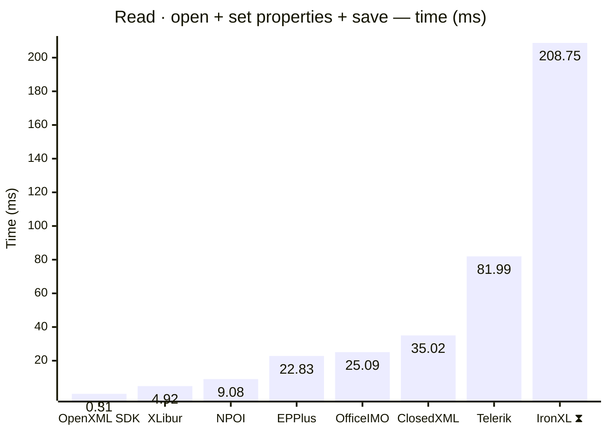
```mermaid
---
config:
  xyChart:
    showDataLabel: true
---
xychart-beta
    title "Read · open + set properties + save — time (ms)"
    x-axis ["OpenXML SDK", "XLibur", "NPOI", "EPPlus", "OfficeIMO", "ClosedXML", "Telerik", "IronXL ⧗"]
    y-axis "Time (ms)"
    bar [0.31, 4.92, 9.08, 22.83, 25.09, 35.02, 81.99, 208.75]
```

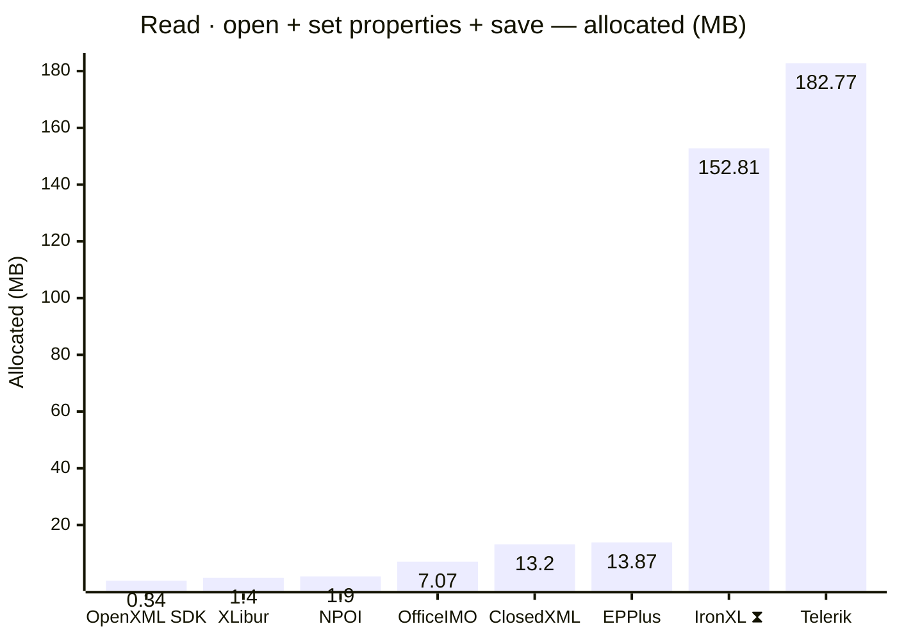
```mermaid
---
config:
  xyChart:
    showDataLabel: true
---
xychart-beta
    title "Read · open + set properties + save — allocated (MB)"
    x-axis ["OpenXML SDK", "XLibur", "NPOI", "OfficeIMO", "ClosedXML", "EPPlus", "IronXL ⧗", "Telerik"]
    y-axis "Allocated (MB)"
    bar [0.34, 1.4, 1.9, 7.07, 13.2, 13.87, 152.81, 182.77]
```

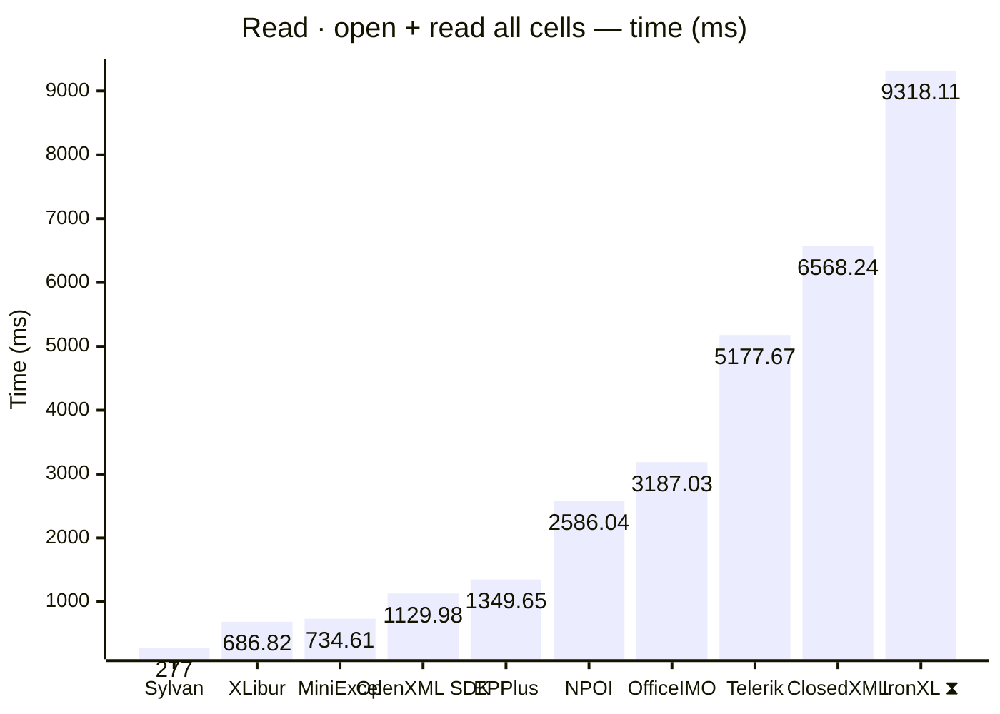
```mermaid
---
config:
  xyChart:
    showDataLabel: true
---
xychart-beta
    title "Read · open + read all cells — time (ms)"
    x-axis ["Sylvan", "XLibur", "MiniExcel", "OpenXML SDK", "EPPlus", "NPOI", "OfficeIMO", "Telerik", "ClosedXML", "IronXL ⧗"]
    y-axis "Time (ms)"
    bar [277, 686.82, 734.61, 1129.98, 1349.65, 2586.04, 3187.03, 5177.67, 6568.24, 9318.11]
```

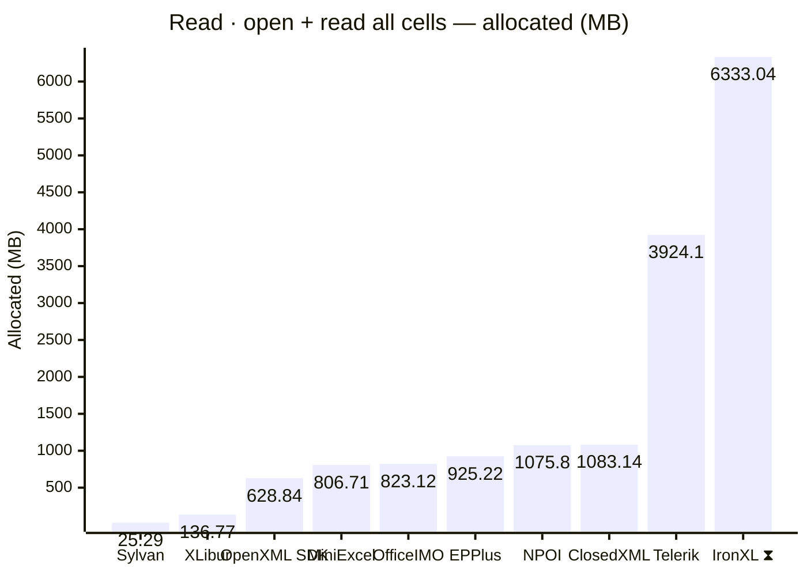
```mermaid
---
config:
  xyChart:
    showDataLabel: true
---
xychart-beta
    title "Read · open + read all cells — allocated (MB)"
    x-axis ["Sylvan", "XLibur", "OpenXML SDK", "MiniExcel", "OfficeIMO", "EPPlus", "NPOI", "ClosedXML", "Telerik", "IronXL ⧗"]
    y-axis "Allocated (MB)"
    bar [25.29, 136.77, 628.84, 806.71, 823.12, 925.22, 1075.8, 1083.14, 3924.1, 6333.04]
```

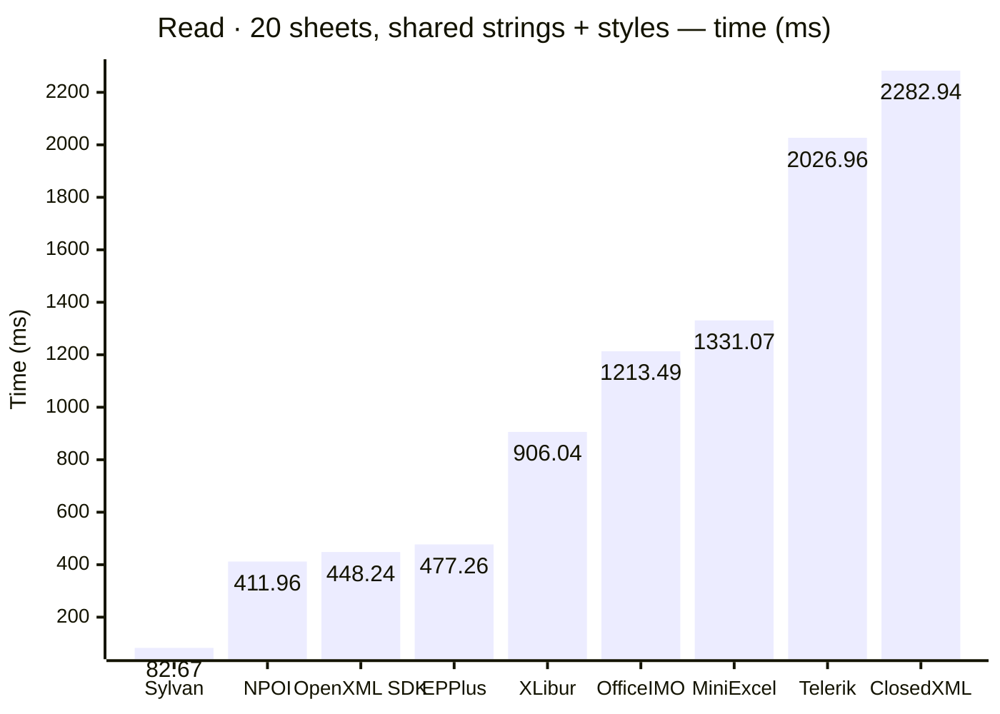
```mermaid
---
config:
  xyChart:
    showDataLabel: true
---
xychart-beta
    title "Read · 20 sheets, shared strings + styles — time (ms)"
    x-axis ["Sylvan", "NPOI", "OpenXML SDK", "EPPlus", "XLibur", "OfficeIMO", "MiniExcel", "Telerik", "ClosedXML"]
    y-axis "Time (ms)"
    bar [82.67, 411.96, 448.24, 477.26, 906.04, 1213.49, 1331.07, 2026.96, 2282.94]
```

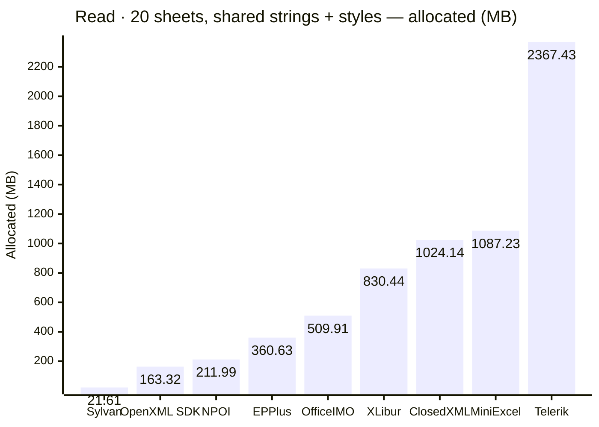
```mermaid
---
config:
  xyChart:
    showDataLabel: true
---
xychart-beta
    title "Read · 20 sheets, shared strings + styles — allocated (MB)"
    x-axis ["Sylvan", "OpenXML SDK", "NPOI", "EPPlus", "OfficeIMO", "XLibur", "ClosedXML", "MiniExcel", "Telerik"]
    y-axis "Allocated (MB)"
    bar [21.61, 163.32, 211.99, 360.63, 509.91, 830.44, 1024.14, 1087.23, 2367.43]
```

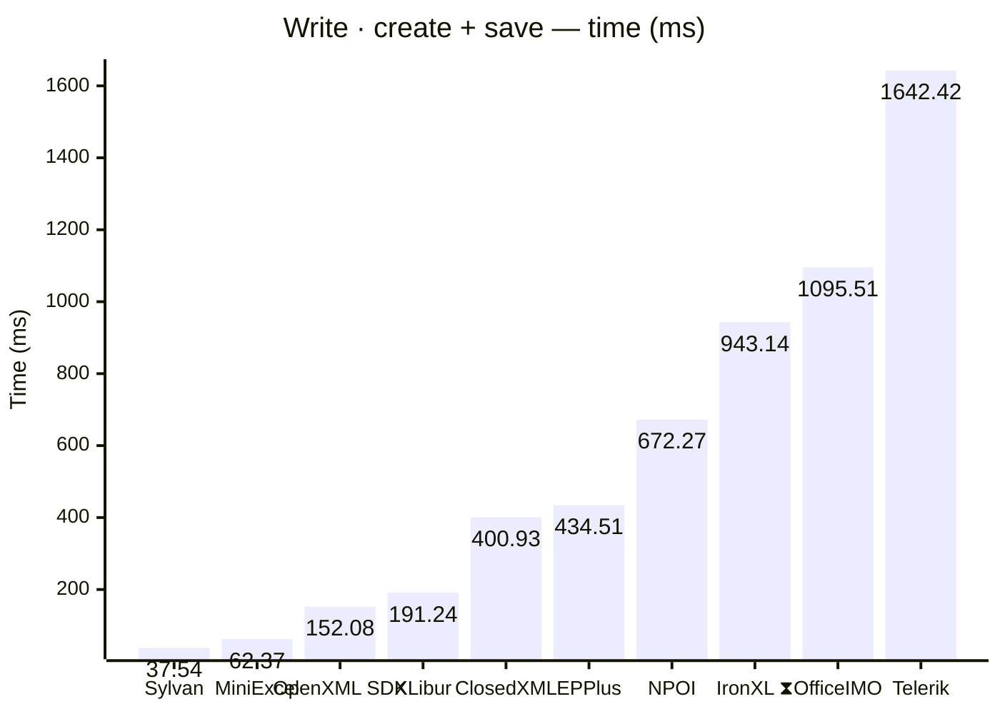
```mermaid
---
config:
  xyChart:
    showDataLabel: true
---
xychart-beta
    title "Write · create + save — time (ms)"
    x-axis ["Sylvan", "MiniExcel", "OpenXML SDK", "XLibur", "ClosedXML", "EPPlus", "NPOI", "IronXL ⧗", "OfficeIMO", "Telerik"]
    y-axis "Time (ms)"
    bar [37.54, 62.37, 152.08, 191.24, 400.93, 434.51, 672.27, 943.14, 1095.51, 1642.42]
```

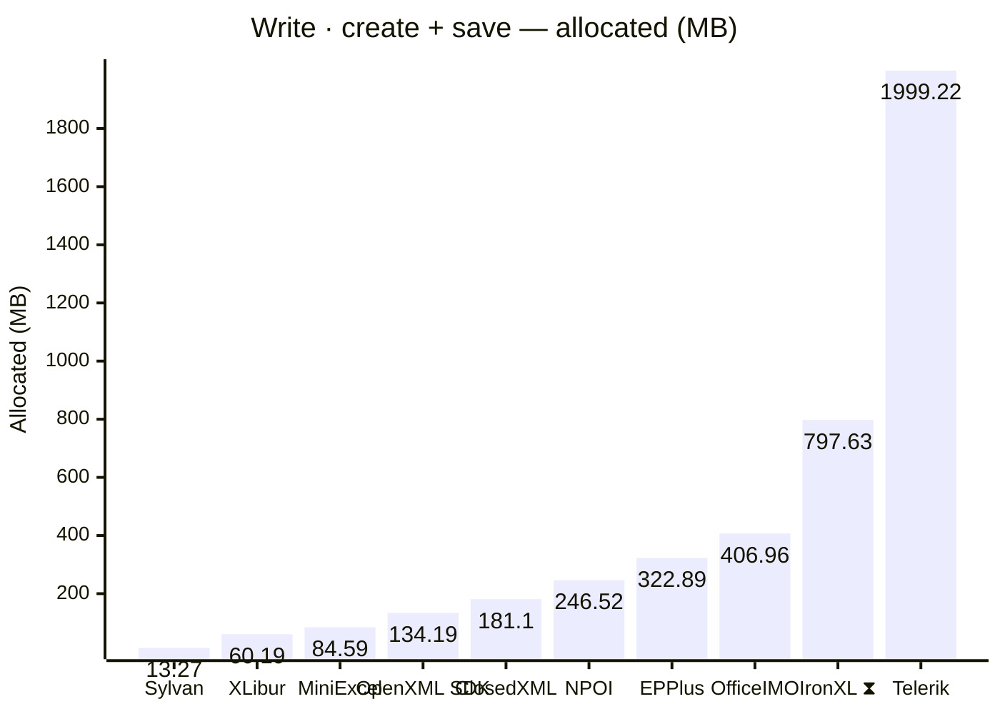
```mermaid
---
config:
  xyChart:
    showDataLabel: true
---
xychart-beta
    title "Write · create + save — allocated (MB)"
    x-axis ["Sylvan", "XLibur", "MiniExcel", "OpenXML SDK", "ClosedXML", "NPOI", "EPPlus", "OfficeIMO", "IronXL ⧗", "Telerik"]
    y-axis "Allocated (MB)"
    bar [13.27, 60.19, 84.59, 134.19, 181.1, 246.52, 322.89, 406.96, 797.63, 1999.22]
```

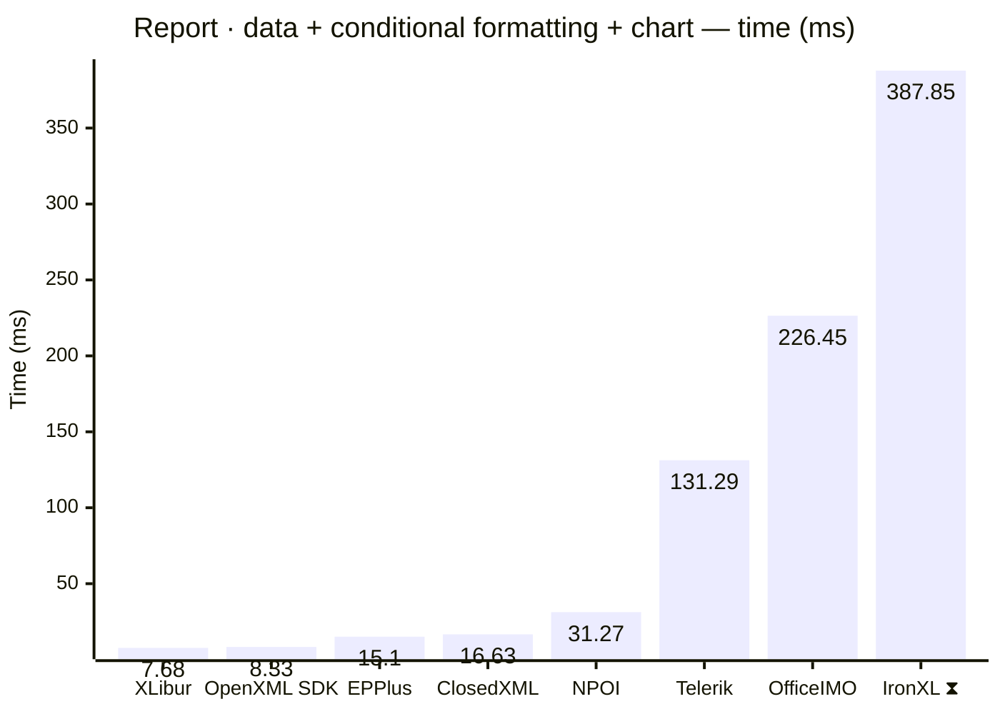
```mermaid
---
config:
  xyChart:
    showDataLabel: true
---
xychart-beta
    title "Report · data + conditional formatting + chart — time (ms)"
    x-axis ["XLibur", "OpenXML SDK", "EPPlus", "ClosedXML", "NPOI", "Telerik", "OfficeIMO", "IronXL ⧗"]
    y-axis "Time (ms)"
    bar [7.68, 8.33, 15.1, 16.63, 31.27, 131.29, 226.45, 387.85]
```


```mermaid
---
config:
  xyChart:
    showDataLabel: true
---
xychart-beta
    title "Report · data + conditional formatting + chart — allocated (MB)"
    x-axis ["XLibur", "OpenXML SDK", "ClosedXML", "EPPlus", "NPOI", "IronXL ⧗", "Telerik", "OfficeIMO"]
    y-axis "Allocated (MB)"
    bar [3.35, 4.92, 8.01, 13.99, 16.46, 237.38, 426.53, 905.97]
```

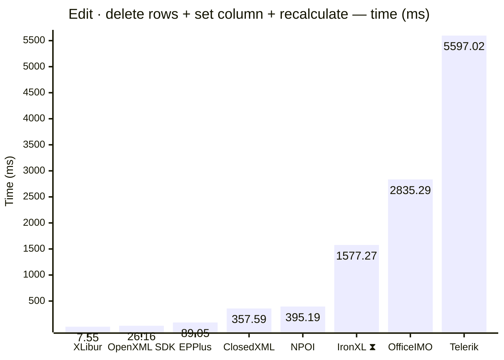
```mermaid
---
config:
  xyChart:
    showDataLabel: true
---
xychart-beta
    title "Edit · delete rows + set column + recalculate — time (ms)"
    x-axis ["XLibur", "OpenXML SDK", "EPPlus", "ClosedXML", "NPOI", "IronXL ⧗", "OfficeIMO", "Telerik"]
    y-axis "Time (ms)"
    bar [7.55, 26.16, 89.05, 357.59, 395.19, 1577.27, 2835.29, 5597.02]
```

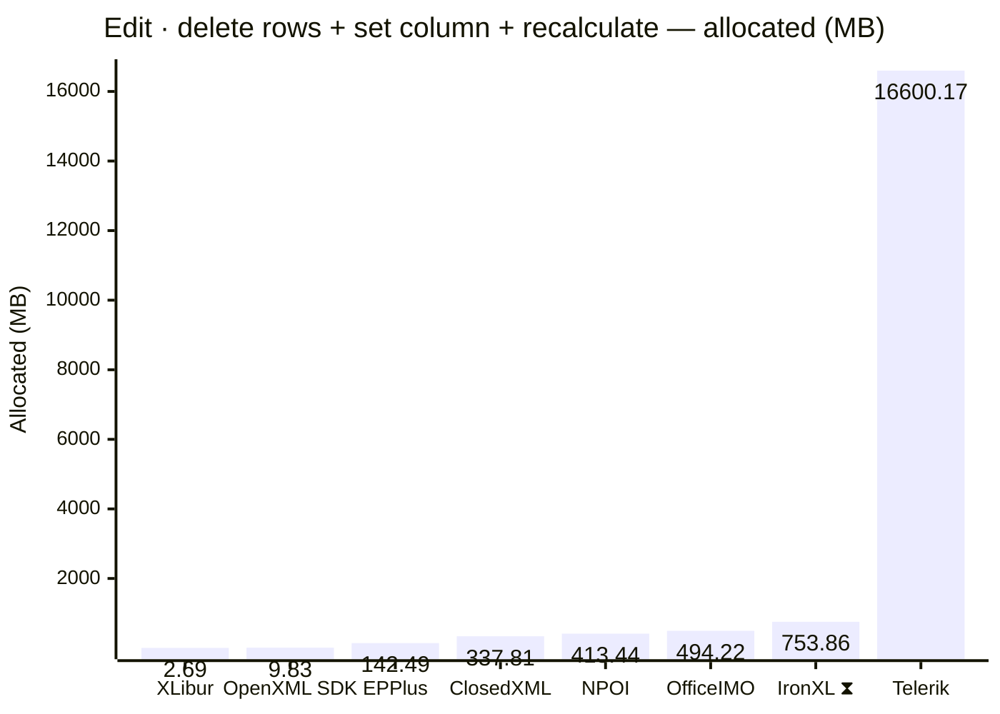
```mermaid
---
config:
  xyChart:
    showDataLabel: true
---
xychart-beta
    title "Edit · delete rows + set column + recalculate — allocated (MB)"
    x-axis ["XLibur", "OpenXML SDK", "EPPlus", "ClosedXML", "NPOI", "OfficeIMO", "IronXL ⧗", "Telerik"]
    y-axis "Allocated (MB)"
    bar [2.69, 9.83, 142.49, 337.81, 413.44, 494.22, 753.86, 16600.17]
```

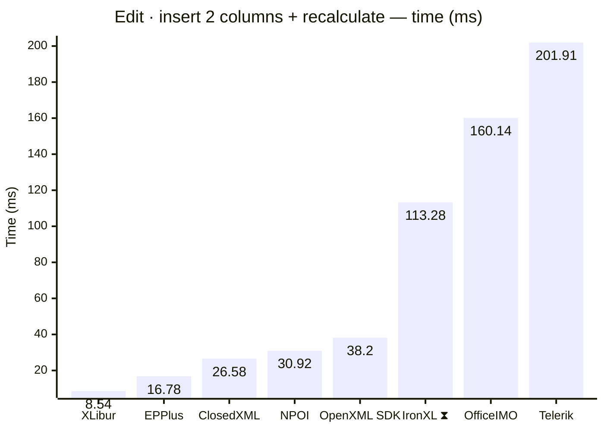
```mermaid
---
config:
  xyChart:
    showDataLabel: true
---
xychart-beta
    title "Edit · insert 2 columns + recalculate — time (ms)"
    x-axis ["XLibur", "EPPlus", "ClosedXML", "NPOI", "OpenXML SDK", "IronXL ⧗", "OfficeIMO", "Telerik"]
    y-axis "Time (ms)"
    bar [8.54, 16.78, 26.58, 30.92, 38.2, 113.28, 160.14, 201.91]
```


```mermaid
---
config:
  xyChart:
    showDataLabel: true
---
xychart-beta
    title "Edit · insert 2 columns + recalculate — allocated (MB)"
    x-axis ["XLibur", "EPPlus", "OpenXML SDK", "ClosedXML", "NPOI", "OfficeIMO", "IronXL ⧗", "Telerik"]
    y-axis "Allocated (MB)"
    bar [2.72, 11.41, 13.11, 13.67, 30.77, 70.3, 104.88, 272.63]
```

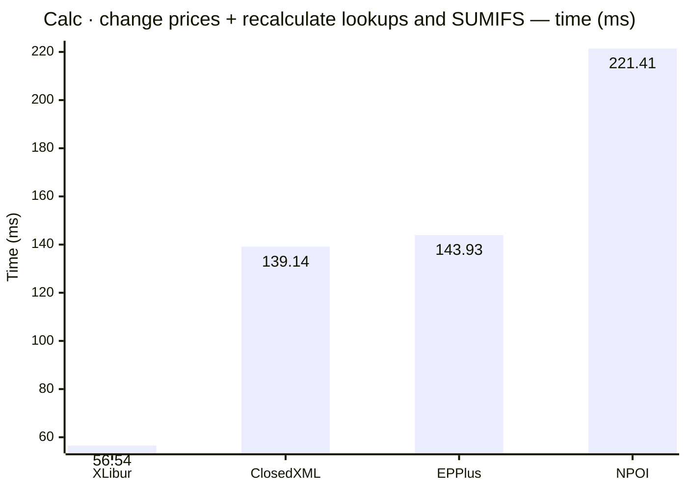
```mermaid
---
config:
  xyChart:
    showDataLabel: true
---
xychart-beta
    title "Calc · change prices + recalculate lookups and SUMIFS — time (ms)"
    x-axis ["XLibur", "ClosedXML", "EPPlus", "NPOI"]
    y-axis "Time (ms)"
    bar [56.54, 139.14, 143.93, 221.41]
```

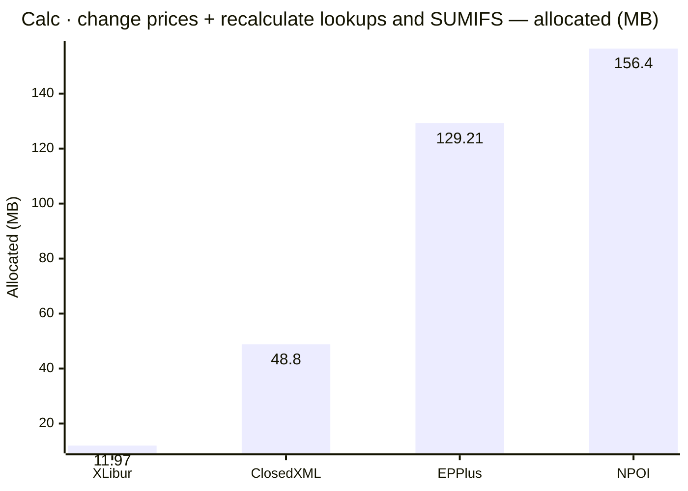
```mermaid
---
config:
  xyChart:
    showDataLabel: true
---
xychart-beta
    title "Calc · change prices + recalculate lookups and SUMIFS — allocated (MB)"
    x-axis ["XLibur", "ClosedXML", "EPPlus", "NPOI"]
    y-axis "Allocated (MB)"
    bar [11.97, 48.8, 129.21, 156.4]
```

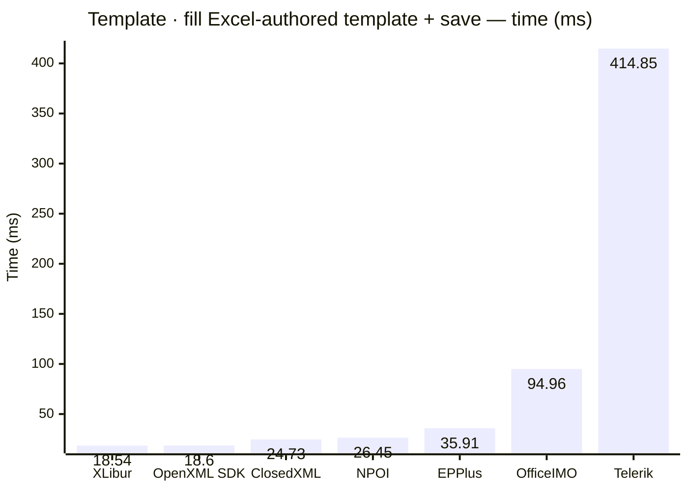
```mermaid
---
config:
  xyChart:
    showDataLabel: true
---
xychart-beta
    title "Template · fill Excel-authored template + save — time (ms)"
    x-axis ["XLibur", "OpenXML SDK", "ClosedXML", "NPOI", "EPPlus", "OfficeIMO", "Telerik"]
    y-axis "Time (ms)"
    bar [18.54, 18.6, 24.73, 26.45, 35.91, 94.96, 414.85]
```

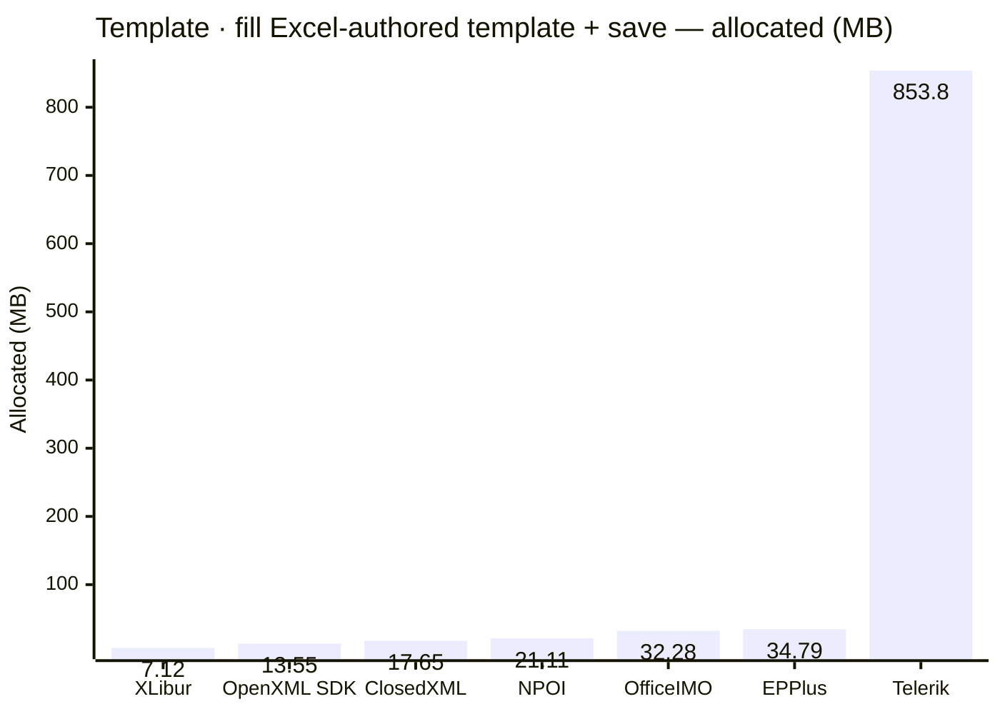
```mermaid
---
config:
  xyChart:
    showDataLabel: true
---
xychart-beta
    title "Template · fill Excel-authored template + save — allocated (MB)"
    x-axis ["XLibur", "OpenXML SDK", "ClosedXML", "NPOI", "OfficeIMO", "EPPlus", "Telerik"]
    y-axis "Allocated (MB)"
    bar [7.12, 13.55, 17.65, 21.11, 32.28, 34.79, 853.8]
```

## Detailed results


```

BenchmarkDotNet v0.15.8, Windows 11 (10.0.22631.6199/23H2/2023Update/SunValley3)
AMD Ryzen 9 5950X 3.40GHz, 1 CPU, 32 logical and 16 physical cores
.NET SDK 10.0.403
  [Host]     : .NET 10.0.14 (10.0.14, 10.0.1426.52326), X64 RyuJIT x86-64-v3
  DefaultJob : .NET 10.0.14 (10.0.14, 10.0.1426.52326), X64 RyuJIT x86-64-v3


```

### Read · open + set properties + save

| Library     | Type                        | Method                      | Mean          | Error       | StdDev      | Median        | Gen0         | Gen1        | Gen2       | Allocated   |
|------------ |---------------------------- |---------------------------- |--------------:|------------:|------------:|--------------:|-------------:|------------:|-----------:|------------:|
| OpenXML SDK | OpenXmlReadBenchmarks       | OpenAmendPropertiesAndSave  |     0.3085 ms |   0.0076 ms |   0.0221 ms |     0.3057 ms |      29.2969 |     20.5078 |    15.6250 |     0.34 MB |
| XLibur      | XLiburReadBenchmarks        | OpenAmendPropertiesAndSave  |     4.9177 ms |   0.0960 ms |   0.1314 ms |     4.9266 ms |      62.5000 |     31.2500 |          - |      1.4 MB |
| NPOI        | NpoiReadBenchmarks          | OpenAmendPropertiesAndSave  |     9.0836 ms |   0.1259 ms |   0.1178 ms |     9.1248 ms |      62.5000 |     31.2500 |          - |      1.9 MB |
| EPPlus      | EpPlusReadBenchmarks        | OpenAmendPropertiesAndSave  |    22.8295 ms |   0.4498 ms |   0.8983 ms |    22.5880 ms |    1000.0000 |   1000.0000 |  1000.0000 |    13.87 MB |
| OfficeIMO   | OfficeImoReadBenchmarks     | OpenAmendPropertiesAndSave  |    25.0890 ms |   0.3366 ms |   0.2811 ms |    25.1236 ms |     593.7500 |    500.0000 |   406.2500 |     7.07 MB |
| ClosedXML   | ClosedXmlReadBenchmarks     | OpenAmendPropertiesAndSave  |    35.0162 ms |   0.6993 ms |   1.2610 ms |    34.9124 ms |     666.6667 |    333.3333 |          - |     13.2 MB |
| Telerik     | TelerikReadBenchmarks       | OpenAmendPropertiesAndSave  |    81.9860 ms |   1.6267 ms |   2.7623 ms |    81.8291 ms |   10666.6667 |   1000.0000 |   666.6667 |   182.77 MB |
| IronXL ⧗ | IronXlReadBenchmarks | OpenAmendPropertiesAndSave | 208.746 ms | 155.7570 ms | 92.6885 ms | 168.705 ms | 9000.0000 | 2000.0000 | - | 152.81 MB |

### Read · open + read all cells

| Library     | Type                        | Method                      | Mean          | Error       | StdDev      | Median        | Gen0         | Gen1        | Gen2       | Allocated   |
|------------ |---------------------------- |---------------------------- |--------------:|------------:|------------:|--------------:|-------------:|------------:|-----------:|------------:|
| Sylvan      | SylvanReadBenchmarks        | OpenAndReadAll              |   277.0038 ms |   4.8887 ms |   4.5729 ms |   276.7233 ms |    1000.0000 |    500.0000 |          - |    25.29 MB |
| XLibur      | XLiburReadBenchmarks        | OpenAndReadAll              |   686.8161 ms |  13.6010 ms |  13.3580 ms |   688.7968 ms |    8000.0000 |   5000.0000 |  1000.0000 |   136.77 MB |
| MiniExcel   | MiniExcelReadBenchmarks     | OpenAndReadAll              |   734.6061 ms |  12.3349 ms |  10.9346 ms |   732.2890 ms |   51000.0000 |   4000.0000 |  1000.0000 |   806.71 MB |
| OpenXML SDK | OpenXmlReadBenchmarks       | OpenAndReadAll              | 1,129.9806 ms |   6.1920 ms |   5.1706 ms | 1,129.4281 ms |   40000.0000 |   7000.0000 |  1000.0000 |   628.84 MB |
| EPPlus      | EpPlusReadBenchmarks        | OpenAndReadAll              | 1,349.6463 ms |  65.8130 ms | 189.8856 ms | 1,280.8345 ms |   49000.0000 |  14000.0000 |  7000.0000 |   925.22 MB |
| NPOI        | NpoiReadBenchmarks          | OpenAndReadAll              | 2,586.0364 ms |  51.1914 ms |  62.8677 ms | 2,592.9976 ms |   68000.0000 |  62000.0000 |  6000.0000 |   1075.8 MB |
| OfficeIMO   | OfficeImoReadBenchmarks     | OpenAndReadAll              | 3,187.0334 ms |  52.6152 ms |  46.6420 ms | 3,191.2404 ms |   52000.0000 |  39000.0000 |  5000.0000 |   823.12 MB |
| Telerik     | TelerikReadBenchmarks       | OpenAndReadAll              | 5,177.6671 ms | 100.0742 ms | 136.9828 ms | 5,177.8239 ms |  238000.0000 |  47000.0000 |  6000.0000 |   3924.1 MB |
| ClosedXML   | ClosedXmlReadBenchmarks     | OpenAndReadAll              | 6,568.2379 ms |  92.7568 ms |  86.7648 ms | 6,560.6846 ms |   59000.0000 |  23000.0000 |  3000.0000 |  1083.14 MB |
| IronXL ⧗ | IronXlReadBenchmarks | OpenAndReadAll | 9,318.107 ms | 477.3336 ms | 315.7266 ms | 9,377.407 ms | 393000.0000 | 202000.0000 | 10000.0000 | 6333.04 MB |

### Read · 20 sheets, shared strings + styles

| Library     | Type                        | Method                      | Mean          | Error       | StdDev      | Median        | Gen0         | Gen1        | Gen2       | Allocated   |
|------------ |---------------------------- |---------------------------- |--------------:|------------:|------------:|--------------:|-------------:|------------:|-----------:|------------:|
| Sylvan      | SylvanSheetsBenchmarks      | OpenAndReadAllSheets        |    82.6702 ms |   1.0947 ms |   1.0240 ms |    82.9547 ms |    1000.0000 |           - |          - |    21.61 MB |
| NPOI        | NpoiSheetsBenchmarks        | OpenAndReadAllSheets        |   411.9643 ms |   8.0762 ms |  20.2616 ms |   407.3041 ms |   14000.0000 |  13000.0000 |  3000.0000 |   211.99 MB |
| OpenXML SDK | OpenXmlSheetsBenchmarks     | OpenAndReadAllSheets        |   448.2384 ms |   6.7939 ms |   6.3550 ms |   447.9799 ms |   11000.0000 |   6000.0000 |  1000.0000 |   163.32 MB |
| EPPlus      | EpPlusSheetsBenchmarks      | OpenAndReadAllSheets        |   477.2647 ms |   9.3955 ms |  15.9543 ms |   473.8828 ms |   24000.0000 |  10000.0000 |  5000.0000 |   360.63 MB |
| XLibur      | XLiburSheetsBenchmarks      | OpenAndReadAllSheets        |   906.0419 ms |  17.1902 ms |  16.0797 ms |   909.6369 ms |   52000.0000 |  15000.0000 |  1000.0000 |   830.44 MB |
| OfficeIMO   | OfficeImoSheetsBenchmarks   | OpenAndReadAllSheets        | 1,213.4904 ms |  22.3875 ms |  23.9544 ms | 1,213.0687 ms |   33000.0000 |  18000.0000 |  4000.0000 |   509.91 MB |
| MiniExcel   | MiniExcelSheetsBenchmarks   | OpenAndReadAllSheets        | 1,331.0737 ms |  16.8730 ms |  14.0897 ms | 1,332.2137 ms |   67000.0000 |  20000.0000 |          - |  1087.23 MB |
| Telerik     | TelerikSheetsBenchmarks     | OpenAndReadAllSheets        | 2,026.9639 ms |  30.7426 ms |  28.7566 ms | 2,037.7069 ms |  143000.0000 |  22000.0000 |  5000.0000 |  2367.43 MB |
| ClosedXML   | ClosedXmlSheetsBenchmarks   | OpenAndReadAllSheets        | 2,282.9373 ms |  44.2630 ms |  47.3609 ms | 2,274.2922 ms |   64000.0000 |  29000.0000 |  2000.0000 |  1024.14 MB |

### Write · create + save

| Library     | Type                        | Method                      | Mean          | Error       | StdDev      | Median        | Gen0         | Gen1        | Gen2       | Allocated   |
|------------ |---------------------------- |---------------------------- |--------------:|------------:|------------:|--------------:|-------------:|------------:|-----------:|------------:|
| Sylvan      | SylvanWriteBenchmarks       | CreateAndSave               |    37.5445 ms |   0.5761 ms |   0.5107 ms |    37.4370 ms |    1714.2857 |   1642.8571 |  1500.0000 |    13.27 MB |
| MiniExcel   | MiniExcelWriteBenchmarks    | CreateAndSave               |    62.3681 ms |   1.2277 ms |   1.5078 ms |    62.7481 ms |    5111.1111 |   1222.2222 |  1111.1111 |    84.59 MB |
| OpenXML SDK | OpenXmlWriteBenchmarks      | CreateAndSave               |   152.0769 ms |   1.2148 ms |   1.0769 ms |   152.1312 ms |    8000.0000 |   2000.0000 |  2000.0000 |   134.19 MB |
| XLibur      | XLiburWriteBenchmarks       | CreateAndSave               |   191.2420 ms |   3.4948 ms |   4.4198 ms |   191.1535 ms |    3000.0000 |   2000.0000 |  2000.0000 |    60.19 MB |
| ClosedXML   | ClosedXmlWriteBenchmarks    | CreateAndSave               |   400.9313 ms |   7.2383 ms |  16.4852 ms |   400.5464 ms |   10000.0000 |   5000.0000 |  2000.0000 |    181.1 MB |
| EPPlus      | EpPlusWriteBenchmarks       | CreateAndSave               |   434.5143 ms |   8.1816 ms |   7.2528 ms |   433.5673 ms |   20000.0000 |   9000.0000 |  3000.0000 |   322.89 MB |
| NPOI        | NpoiWriteBenchmarks         | CreateAndSave               |   672.2707 ms |  13.1677 ms |  20.1085 ms |   672.8720 ms |   16000.0000 |  12000.0000 |  3000.0000 |   246.52 MB |
| IronXL ⧗ | IronXlWriteBenchmarks | CreateAndSave | 943.137 ms | 18.5191 ms | 11.0204 ms | 938.999 ms | 48000.0000 | 16000.0000 | 3000.0000 | 797.63 MB |
| OfficeIMO   | OfficeImoWriteBenchmarks    | CreateAndSave               | 1,095.5115 ms |  20.6025 ms |  18.2636 ms | 1,093.0314 ms |   22000.0000 |  16000.0000 |  3000.0000 |   406.96 MB |
| Telerik     | TelerikWriteBenchmarks      | CreateAndSave               | 1,642.4208 ms |  29.1400 ms |  29.9247 ms | 1,634.0082 ms |  124000.0000 |  14000.0000 |  5000.0000 |  1999.22 MB |

### Report · data + conditional formatting + chart

| Library     | Type                        | Method                      | Mean          | Error       | StdDev      | Median        | Gen0         | Gen1        | Gen2       | Allocated   |
|------------ |---------------------------- |---------------------------- |--------------:|------------:|------------:|--------------:|-------------:|------------:|-----------:|------------:|
| XLibur      | XLiburReportBenchmarks      | CreateStockReport           |     7.6760 ms |   0.1523 ms |   0.2935 ms |     7.6600 ms |     187.5000 |    187.5000 |   187.5000 |     3.35 MB |
| OpenXML SDK | OpenXmlReportBenchmarks     | CreateStockReport           |     8.3320 ms |   0.1351 ms |   0.1263 ms |     8.3548 ms |     375.0000 |    359.3750 |   187.5000 |     4.92 MB |
| EPPlus      | EpPlusReportBenchmarks      | CreateStockReport           |    15.0995 ms |   0.2800 ms |   0.5259 ms |    15.0264 ms |    1000.0000 |   1000.0000 |  1000.0000 |    13.99 MB |
| ClosedXML   | ClosedXmlReportBenchmarks   | CreateStockReport           |    16.6265 ms |   0.2806 ms |   0.2625 ms |    16.5196 ms |     468.7500 |    187.5000 |    31.2500 |     8.01 MB |
| NPOI        | NpoiReportBenchmarks        | CreateStockReport           |    31.2744 ms |   0.3953 ms |   0.3697 ms |    31.1772 ms |     875.0000 |    750.0000 |   375.0000 |    16.46 MB |
| Telerik     | TelerikReportBenchmarks     | CreateStockReport           |   131.2860 ms |   3.7645 ms |  10.4314 ms |   131.8511 ms |   28000.0000 |   8000.0000 |  3000.0000 |   426.53 MB |
| OfficeIMO   | OfficeImoReportBenchmarks   | CreateStockReport           |   226.4484 ms |   4.4453 ms |   7.4272 ms |   226.9439 ms |   56000.0000 |   2000.0000 |          - |   905.97 MB |
| IronXL ⧗ | IronXlReportBenchmarks | CreateStockReport | 387.849 ms | 36.5456 ms | 24.1726 ms | 384.092 ms | 14000.0000 | 3000.0000 | - | 237.38 MB |

### Edit · delete rows + set column + recalculate

| Library     | Type                        | Method                      | Mean          | Error       | StdDev      | Median        | Gen0         | Gen1        | Gen2       | Allocated   |
|------------ |---------------------------- |---------------------------- |--------------:|------------:|------------:|--------------:|-------------:|------------:|-----------:|------------:|
| XLibur      | XLiburEditBenchmarks        | EditAndRecalculate          |     7.5549 ms |   0.1463 ms |   0.2003 ms |     7.5169 ms |     156.2500 |     78.1250 |          - |     2.69 MB |
| OpenXML SDK | OpenXmlEditBenchmarks       | EditAndRecalculate          |    26.1605 ms |   0.3457 ms |   0.3234 ms |    26.1868 ms |     687.5000 |    593.7500 |   156.2500 |     9.83 MB |
| EPPlus      | EpPlusEditBenchmarks        | EditAndRecalculate          |    89.0549 ms |   1.7120 ms |   1.6014 ms |    89.1416 ms |    9000.0000 |   1200.0000 |  1000.0000 |   142.49 MB |
| ClosedXML   | ClosedXmlEditBenchmarks     | EditAndRecalculate          |   357.5909 ms |   7.0587 ms |   8.4028 ms |   357.7613 ms |   21000.0000 |   1000.0000 |          - |   337.81 MB |
| NPOI        | NpoiEditBenchmarks          | EditAndRecalculate          |   395.1910 ms |   7.8376 ms |   8.7115 ms |   394.4867 ms |   25000.0000 |   1000.0000 |          - |   413.44 MB |
| IronXL ⧗ | IronXlEditBenchmarks | EditAndRecalculate | 1,577.273 ms | 62.9583 ms | 41.6430 ms | 1,583.098 ms | 57000.0000 | 36000.0000 | 15000.0000 | 753.86 MB |
| OfficeIMO   | OfficeImoEditBenchmarks     | EditAndRecalculate          | 2,835.2851 ms |  53.8691 ms |  59.8754 ms | 2,827.8323 ms |   30000.0000 |   1000.0000 |          - |   494.22 MB |
| Telerik     | TelerikEditBenchmarks       | EditAndRecalculate          | 5,597.0225 ms | 108.2309 ms | 101.2392 ms | 5,642.8971 ms | 1050000.0000 | 243000.0000 | 80000.0000 | 16600.17 MB |

### Edit · insert 2 columns + recalculate

| Library     | Type                        | Method                      | Mean          | Error       | StdDev      | Median        | Gen0         | Gen1        | Gen2       | Allocated   |
|------------ |---------------------------- |---------------------------- |--------------:|------------:|------------:|--------------:|-------------:|------------:|-----------:|------------:|
| XLibur      | XLiburInsertBenchmarks      | InsertColumnsAndRecalculate |     8.5437 ms |   0.1686 ms |   0.2674 ms |     8.5443 ms |     156.2500 |     62.5000 |          - |     2.72 MB |
| EPPlus      | EpPlusInsertBenchmarks      | InsertColumnsAndRecalculate |    16.7845 ms |   0.3217 ms |   0.3442 ms |    16.8305 ms |    1000.0000 |   1000.0000 |  1000.0000 |    11.41 MB |
| ClosedXML   | ClosedXmlInsertBenchmarks   | InsertColumnsAndRecalculate |    26.5844 ms |   0.5241 ms |   0.6997 ms |    26.5201 ms |     750.0000 |    250.0000 |          - |    13.67 MB |
| NPOI        | NpoiInsertBenchmarks        | InsertColumnsAndRecalculate |    30.9175 ms |   0.8179 ms |   2.3730 ms |    30.6492 ms |    1833.3333 |   1333.3333 |   666.6667 |    30.77 MB |
| OpenXML SDK | OpenXmlInsertBenchmarks     | InsertColumnsAndRecalculate |    38.1979 ms |   0.7617 ms |   1.8827 ms |    37.4953 ms |     750.0000 |    500.0000 |   250.0000 |    13.11 MB |
| IronXL ⧗ | IronXlInsertBenchmarks | InsertColumnsAndRecalculate | 113.284 ms | 41.9750 ms | 27.7638 ms | 97.052 ms | 7000.0000 | 2500.0000 | 750.0000 | 104.88 MB |
| OfficeIMO   | OfficeImoInsertBenchmarks   | InsertColumnsAndRecalculate |   160.1425 ms |   3.5812 ms |  10.4466 ms |   162.4903 ms |    5000.0000 |   2000.0000 |  1000.0000 |     70.3 MB |
| Telerik     | TelerikInsertBenchmarks     | InsertColumnsAndRecalculate |   201.9094 ms |   6.7912 ms |  19.5942 ms |   201.1065 ms |   22000.0000 |  11000.0000 |  3000.0000 |   272.63 MB |

### Calc · change prices + recalculate lookups and SUMIFS

| Library     | Type                        | Method                      | Mean          | Error       | StdDev      | Median        | Gen0         | Gen1        | Gen2       | Allocated   |
|------------ |---------------------------- |---------------------------- |--------------:|------------:|------------:|--------------:|-------------:|------------:|-----------:|------------:|
| XLibur      | XLiburCalcBenchmarks        | ChangePricesAndRecalculate  |    56.5413 ms |   0.9022 ms |   2.2965 ms |    55.9787 ms |            - |           - |          - |    11.97 MB |
| ClosedXML   | ClosedXmlCalcBenchmarks     | ChangePricesAndRecalculate  |   139.1373 ms |   2.5551 ms |   5.0436 ms |   138.0613 ms |    2000.0000 |   1000.0000 |          - |     48.8 MB |
| EPPlus      | EpPlusCalcBenchmarks        | ChangePricesAndRecalculate  |   143.9335 ms |   2.7612 ms |   5.1862 ms |   143.1672 ms |    8000.0000 |   2000.0000 |  1000.0000 |   129.21 MB |
| NPOI        | NpoiCalcBenchmarks          | ChangePricesAndRecalculate  |   221.4054 ms |   4.3783 ms |   7.3152 ms |   223.4820 ms |   11000.0000 |   5000.0000 |  2000.0000 |    156.4 MB |

### Template · fill Excel-authored template + save

| Library     | Type                        | Method                      | Mean          | Error       | StdDev      | Median        | Gen0         | Gen1        | Gen2       | Allocated   |
|------------ |---------------------------- |---------------------------- |--------------:|------------:|------------:|--------------:|-------------:|------------:|-----------:|------------:|
| XLibur      | XLiburTemplateBenchmarks    | FillTemplateAndSave         |    18.5370 ms |   0.3666 ms |   0.6976 ms |    18.4567 ms |     714.2857 |    714.2857 |   571.4286 |     7.12 MB |
| OpenXML SDK | OpenXmlTemplateBenchmarks   | FillTemplateAndSave         |    18.6010 ms |   0.3658 ms |   0.8030 ms |    18.4714 ms |    1153.8462 |   1000.0000 |   538.4615 |    13.55 MB |
| ClosedXML   | ClosedXmlTemplateBenchmarks | FillTemplateAndSave         |    24.7269 ms |   0.4899 ms |   1.0226 ms |    24.7124 ms |    1125.0000 |    500.0000 |   250.0000 |    17.65 MB |
| NPOI        | NpoiTemplateBenchmarks      | FillTemplateAndSave         |    26.4532 ms |   0.6051 ms |   1.7166 ms |    26.0386 ms |    1166.6667 |    833.3333 |   333.3333 |    21.11 MB |
| EPPlus      | EpPlusTemplateBenchmarks    | FillTemplateAndSave         |    35.9145 ms |   0.9081 ms |   2.5762 ms |    35.0042 ms |    3000.0000 |   1285.7143 |  1000.0000 |    34.79 MB |
| OfficeIMO   | OfficeImoTemplateBenchmarks | FillTemplateAndSave         |    94.9605 ms |   1.8821 ms |   4.3994 ms |    94.9057 ms |    2666.6667 |   1666.6667 |  1666.6667 |    32.28 MB |
| Telerik     | TelerikTemplateBenchmarks   | FillTemplateAndSave         |   414.8473 ms |   8.2295 ms |  15.6575 ms |   414.4579 ms |   54000.0000 |  12000.0000 |  3000.0000 |    853.8 MB |


<script type="module">
  import mermaid from 'https://cdn.jsdelivr.net/npm/mermaid@11/dist/mermaid.esm.min.mjs';
  const blocks = document.querySelectorAll('.language-mermaid');
  blocks.forEach(el => {
    const code = el.querySelector('code') || el;
    const pre = document.createElement('pre');
    pre.className = 'mermaid';
    pre.textContent = code.textContent;
    el.replaceWith(pre);
  });
  if (blocks.length) {
    mermaid.initialize({ startOnLoad: false });
    await mermaid.run({ querySelector: 'pre.mermaid' });
  }
</script>

<script>
(function () {
  const parse = s => { const n = parseFloat(String(s).replace(/,/g, '')); return Number.isFinite(n) ? n : null; };
  document.querySelectorAll('table').forEach(table => {
    if (!table.tHead || !table.tBodies[0]) return;
    const heads = [...table.tHead.rows[0].cells].map(c => c.textContent.trim().toLowerCase());
    if (!heads.includes('mean')) return;
    const metricCols = heads.map((h, i) => /^(mean|allocated|gen0|gen1|gen2)$/.test(h) ? i : -1).filter(i => i >= 0);
    const rows = [...table.tBodies[0].rows];
    for (const c of metricCols) {
      const vals = rows.map(r => parse(r.cells[c]?.textContent));
      const nums = vals.filter(v => v !== null);
      if (nums.length < 2) continue;
      const min = Math.min(...nums), max = Math.max(...nums);
      if (max === min) continue;
      rows.forEach((r, i) => {
        const v = vals[i]; if (v === null) return;
        const ratio = (v - min) / (max - min);
        r.cells[c].style.backgroundColor = `hsla(${120 - 120 * ratio}, 70%, 50%, 0.45)`;
      });
    }
  });
})();
</script>
