<style>
  .main-content { max-width: 90% !important; padding-left: 2rem !important; padding-right: 2rem !important; }
</style>
<!-- Generated by XLBench. Do not edit by hand; re-run scripts/run-benchmarks.ps1. -->
# XLBench Results

Each section below embeds the full BenchmarkDotNet environment block (OS, CPU,
.NET SDK and runtime). Timings are hardware-specific; treat the allocation/GC
columns as the most portable signal across machines. Regenerate locally with
`scripts/run-benchmarks.ps1`.

📈 **[Interactive charts](charts.html)** (GitHub Pages). Static charts and the full tables follow.

Each results table (one per test method) is heat-mapped independently on the Pages site (🟩 best → 🟥 worst).

> ⧗ **Carried over from an earlier run.** The rows and chart points below marked with this symbol were not measured here — the library is commercial and needs a licence key this run did not have — so they are replayed from `snapshots/`. Compare them as indicative rather than like-for-like, and see the repository README for how to refresh a snapshot.
>
> - **IronXL** 2026.8.1, Job-HTCPYF job, captured 2026-08-03 on same hardware as this run.

## Libraries under test

| Library | Version | Source |
| --- | --- | --- |
| ClosedXML | 0.105.1 | this run |
| EPPlus | 8.7.3 | this run |
| OpenXML SDK | 3.5.1 | this run |
| NPOI | 2.8.1 | this run |
| MiniExcel | 2.0.0 | this run |
| Sylvan | 0.5.8 | this run |
| XLibur | 0.900.0 | this run |
| OfficeIMO | 3.6.2 | this run |
| Telerik | 2026.4.1127.100 | this run |
| IronXL ⧗ | 2026.8.1 | snapshot (2026.8.1, Job-HTCPYF, captured 2026-08-03) |

## Comparison charts

_Lower is better. Charts render in the GitHub file view; the Pages site has interactive versions._

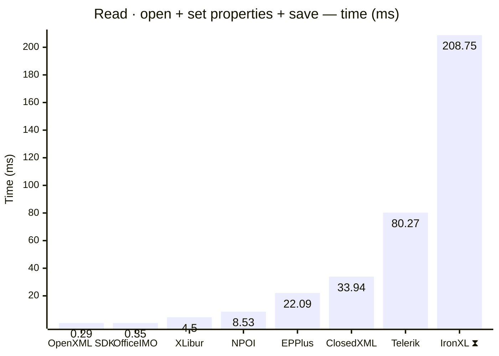
```mermaid
---
config:
  xyChart:
    showDataLabel: true
---
xychart-beta
    title "Read · open + set properties + save — time (ms)"
    x-axis ["OpenXML SDK", "OfficeIMO", "XLibur", "NPOI", "EPPlus", "ClosedXML", "Telerik", "IronXL ⧗"]
    y-axis "Time (ms)"
    bar [0.29, 0.35, 4.5, 8.53, 22.09, 33.94, 80.27, 208.75]
```

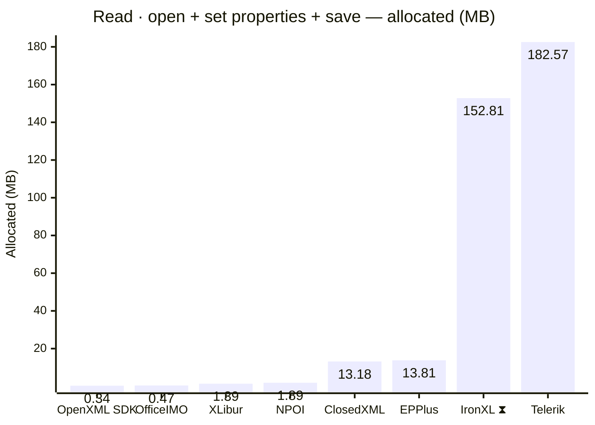
```mermaid
---
config:
  xyChart:
    showDataLabel: true
---
xychart-beta
    title "Read · open + set properties + save — allocated (MB)"
    x-axis ["OpenXML SDK", "OfficeIMO", "XLibur", "NPOI", "ClosedXML", "EPPlus", "IronXL ⧗", "Telerik"]
    y-axis "Allocated (MB)"
    bar [0.34, 0.47, 1.39, 1.89, 13.18, 13.81, 152.81, 182.57]
```

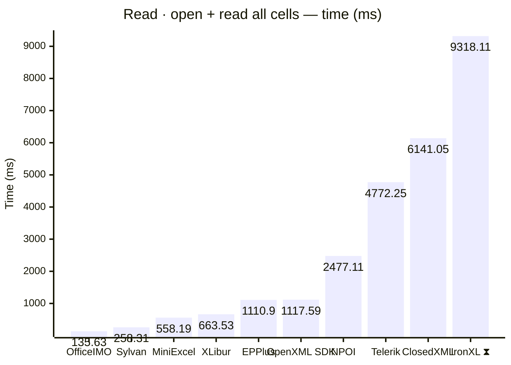
```mermaid
---
config:
  xyChart:
    showDataLabel: true
---
xychart-beta
    title "Read · open + read all cells — time (ms)"
    x-axis ["OfficeIMO", "Sylvan", "MiniExcel", "XLibur", "EPPlus", "OpenXML SDK", "NPOI", "Telerik", "ClosedXML", "IronXL ⧗"]
    y-axis "Time (ms)"
    bar [135.63, 258.31, 558.19, 663.53, 1110.9, 1117.59, 2477.11, 4772.25, 6141.05, 9318.11]
```

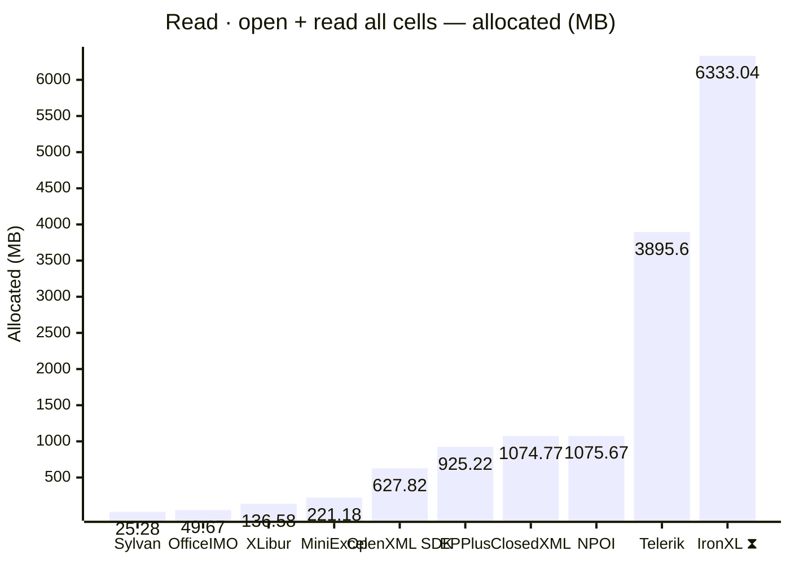
```mermaid
---
config:
  xyChart:
    showDataLabel: true
---
xychart-beta
    title "Read · open + read all cells — allocated (MB)"
    x-axis ["Sylvan", "OfficeIMO", "XLibur", "MiniExcel", "OpenXML SDK", "EPPlus", "ClosedXML", "NPOI", "Telerik", "IronXL ⧗"]
    y-axis "Allocated (MB)"
    bar [25.28, 49.67, 136.58, 221.18, 627.82, 925.22, 1074.77, 1075.67, 3895.6, 6333.04]
```

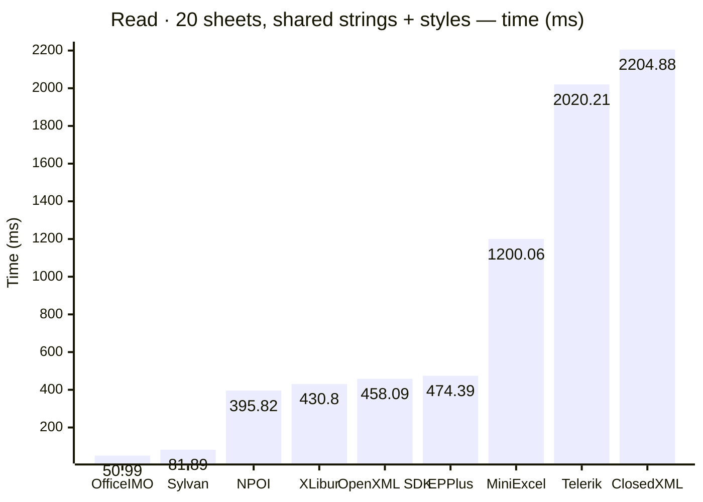
```mermaid
---
config:
  xyChart:
    showDataLabel: true
---
xychart-beta
    title "Read · 20 sheets, shared strings + styles — time (ms)"
    x-axis ["OfficeIMO", "Sylvan", "NPOI", "XLibur", "OpenXML SDK", "EPPlus", "MiniExcel", "Telerik", "ClosedXML"]
    y-axis "Time (ms)"
    bar [50.99, 81.89, 395.82, 430.8, 458.09, 474.39, 1200.06, 2020.21, 2204.88]
```

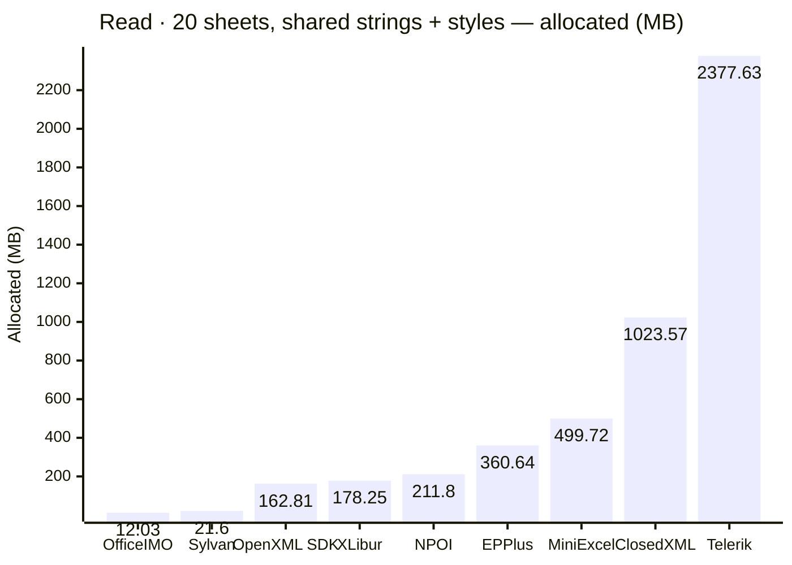
```mermaid
---
config:
  xyChart:
    showDataLabel: true
---
xychart-beta
    title "Read · 20 sheets, shared strings + styles — allocated (MB)"
    x-axis ["OfficeIMO", "Sylvan", "OpenXML SDK", "XLibur", "NPOI", "EPPlus", "MiniExcel", "ClosedXML", "Telerik"]
    y-axis "Allocated (MB)"
    bar [12.03, 21.6, 162.81, 178.25, 211.8, 360.64, 499.72, 1023.57, 2377.63]
```

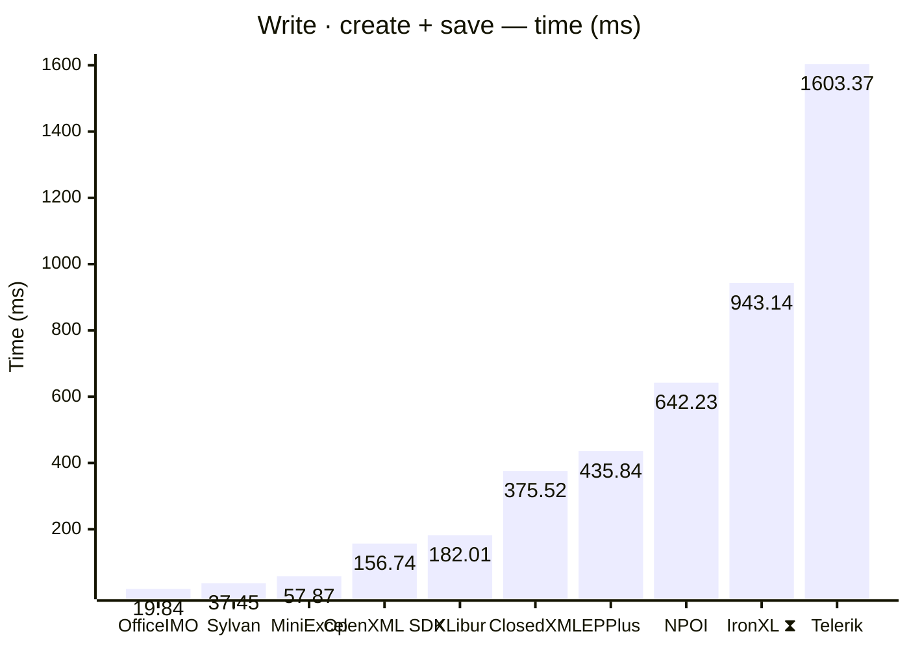
```mermaid
---
config:
  xyChart:
    showDataLabel: true
---
xychart-beta
    title "Write · create + save — time (ms)"
    x-axis ["OfficeIMO", "Sylvan", "MiniExcel", "OpenXML SDK", "XLibur", "ClosedXML", "EPPlus", "NPOI", "IronXL ⧗", "Telerik"]
    y-axis "Time (ms)"
    bar [19.84, 37.45, 57.87, 156.74, 182.01, 375.52, 435.84, 642.23, 943.14, 1603.37]
```

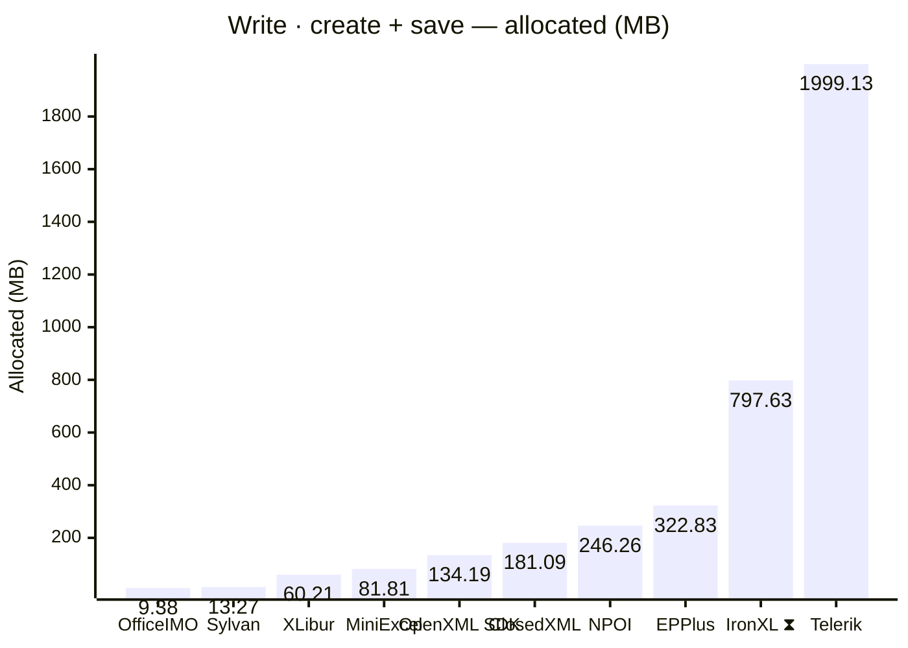
```mermaid
---
config:
  xyChart:
    showDataLabel: true
---
xychart-beta
    title "Write · create + save — allocated (MB)"
    x-axis ["OfficeIMO", "Sylvan", "XLibur", "MiniExcel", "OpenXML SDK", "ClosedXML", "NPOI", "EPPlus", "IronXL ⧗", "Telerik"]
    y-axis "Allocated (MB)"
    bar [9.38, 13.27, 60.21, 81.81, 134.19, 181.09, 246.26, 322.83, 797.63, 1999.13]
```

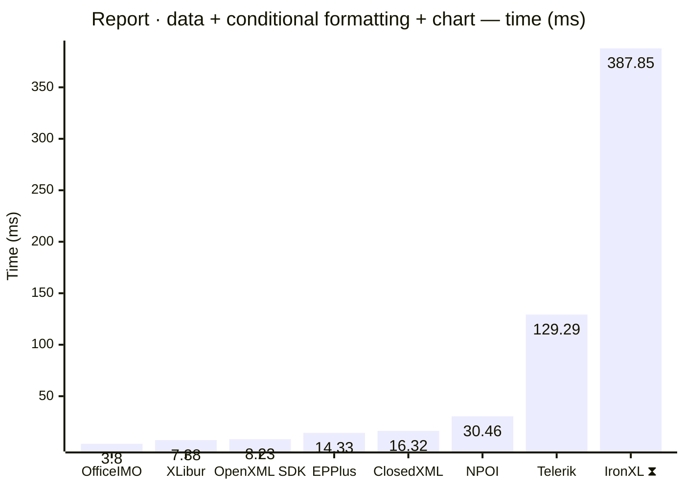
```mermaid
---
config:
  xyChart:
    showDataLabel: true
---
xychart-beta
    title "Report · data + conditional formatting + chart — time (ms)"
    x-axis ["OfficeIMO", "XLibur", "OpenXML SDK", "EPPlus", "ClosedXML", "NPOI", "Telerik", "IronXL ⧗"]
    y-axis "Time (ms)"
    bar [3.8, 7.38, 8.23, 14.33, 16.32, 30.46, 129.29, 387.85]
```

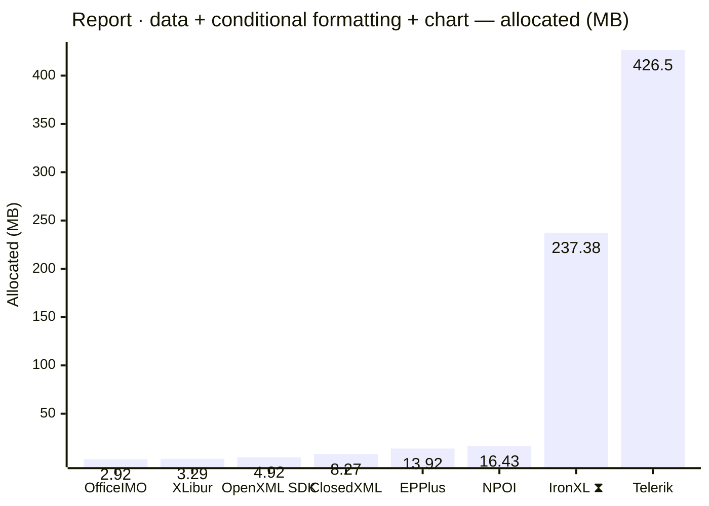
```mermaid
---
config:
  xyChart:
    showDataLabel: true
---
xychart-beta
    title "Report · data + conditional formatting + chart — allocated (MB)"
    x-axis ["OfficeIMO", "XLibur", "OpenXML SDK", "ClosedXML", "EPPlus", "NPOI", "IronXL ⧗", "Telerik"]
    y-axis "Allocated (MB)"
    bar [2.92, 3.29, 4.92, 8.27, 13.92, 16.43, 237.38, 426.5]
```

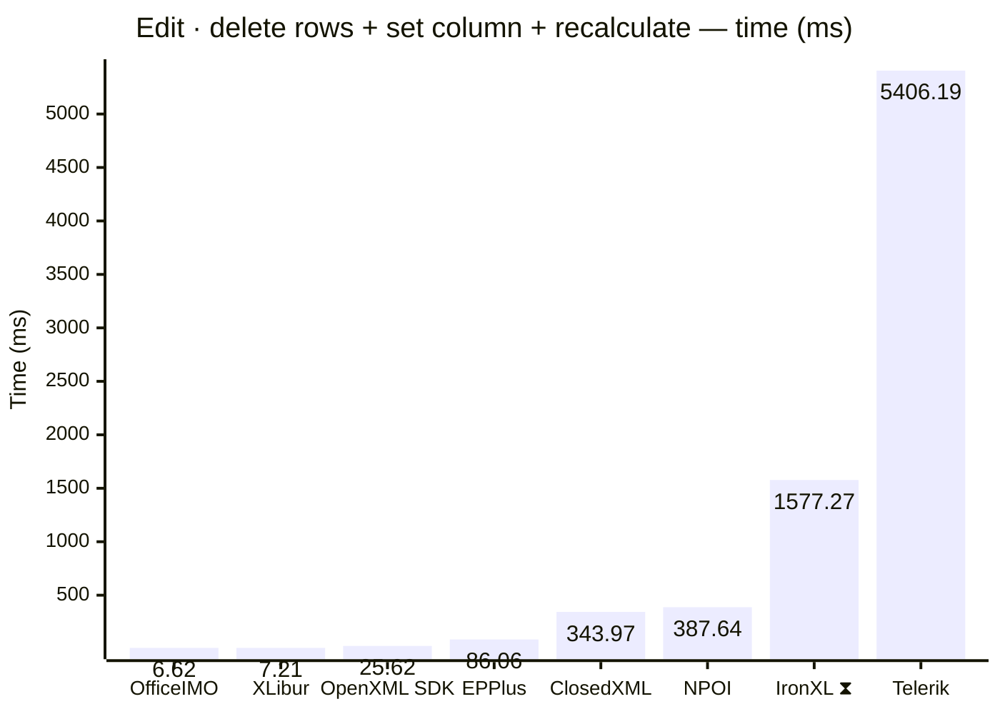
```mermaid
---
config:
  xyChart:
    showDataLabel: true
---
xychart-beta
    title "Edit · delete rows + set column + recalculate — time (ms)"
    x-axis ["OfficeIMO", "XLibur", "OpenXML SDK", "EPPlus", "ClosedXML", "NPOI", "IronXL ⧗", "Telerik"]
    y-axis "Time (ms)"
    bar [6.62, 7.21, 25.62, 86.06, 343.97, 387.64, 1577.27, 5406.19]
```

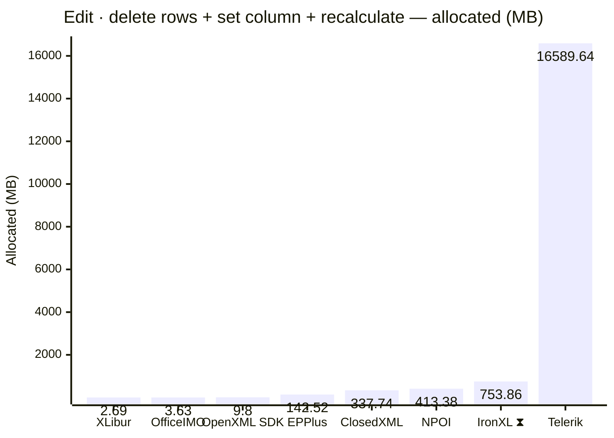
```mermaid
---
config:
  xyChart:
    showDataLabel: true
---
xychart-beta
    title "Edit · delete rows + set column + recalculate — allocated (MB)"
    x-axis ["XLibur", "OfficeIMO", "OpenXML SDK", "EPPlus", "ClosedXML", "NPOI", "IronXL ⧗", "Telerik"]
    y-axis "Allocated (MB)"
    bar [2.69, 3.63, 9.8, 142.52, 337.74, 413.38, 753.86, 16589.64]
```

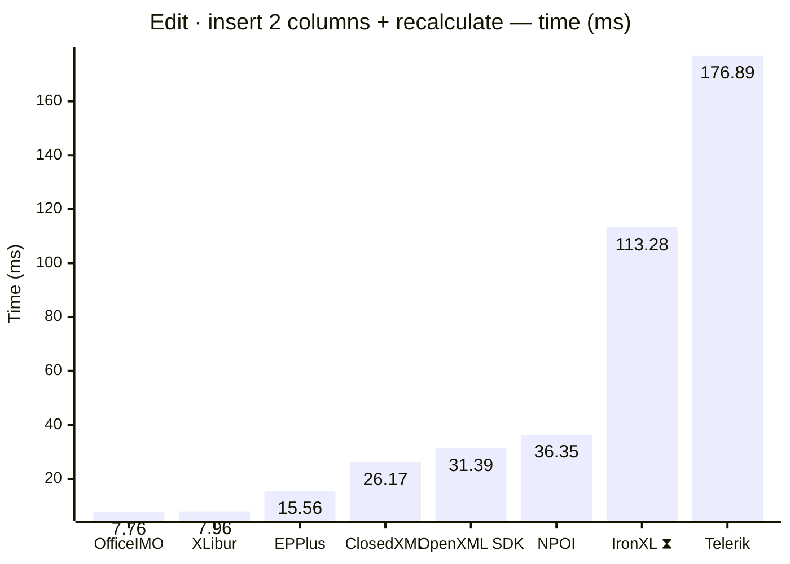
```mermaid
---
config:
  xyChart:
    showDataLabel: true
---
xychart-beta
    title "Edit · insert 2 columns + recalculate — time (ms)"
    x-axis ["OfficeIMO", "XLibur", "EPPlus", "ClosedXML", "OpenXML SDK", "NPOI", "IronXL ⧗", "Telerik"]
    y-axis "Time (ms)"
    bar [7.76, 7.96, 15.56, 26.17, 31.39, 36.35, 113.28, 176.89]
```

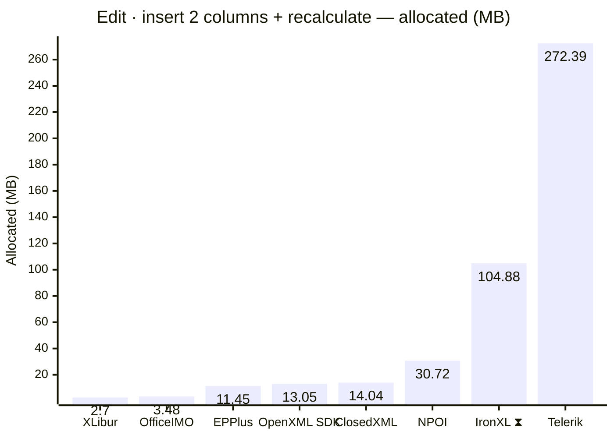
```mermaid
---
config:
  xyChart:
    showDataLabel: true
---
xychart-beta
    title "Edit · insert 2 columns + recalculate — allocated (MB)"
    x-axis ["XLibur", "OfficeIMO", "EPPlus", "OpenXML SDK", "ClosedXML", "NPOI", "IronXL ⧗", "Telerik"]
    y-axis "Allocated (MB)"
    bar [2.7, 3.48, 11.45, 13.05, 14.04, 30.72, 104.88, 272.39]
```

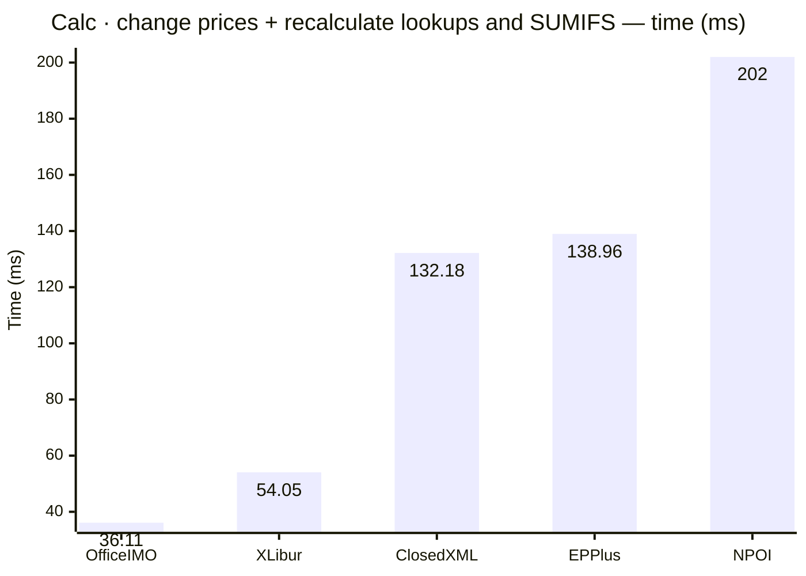
```mermaid
---
config:
  xyChart:
    showDataLabel: true
---
xychart-beta
    title "Calc · change prices + recalculate lookups and SUMIFS — time (ms)"
    x-axis ["OfficeIMO", "XLibur", "ClosedXML", "EPPlus", "NPOI"]
    y-axis "Time (ms)"
    bar [36.11, 54.05, 132.18, 138.96, 202]
```

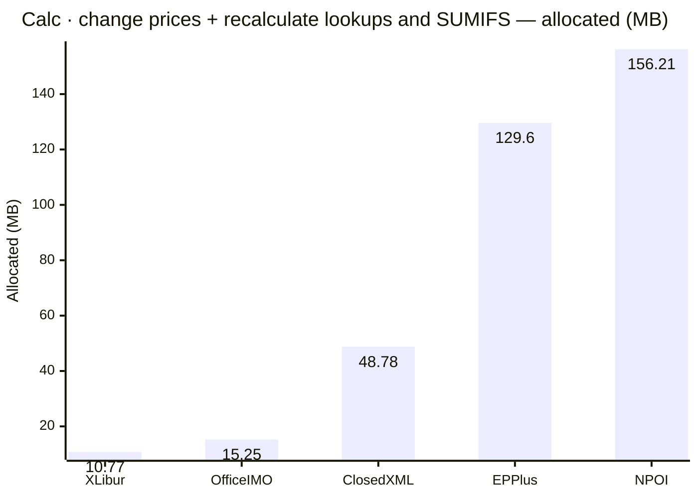
```mermaid
---
config:
  xyChart:
    showDataLabel: true
---
xychart-beta
    title "Calc · change prices + recalculate lookups and SUMIFS — allocated (MB)"
    x-axis ["XLibur", "OfficeIMO", "ClosedXML", "EPPlus", "NPOI"]
    y-axis "Allocated (MB)"
    bar [10.77, 15.25, 48.78, 129.6, 156.21]
```

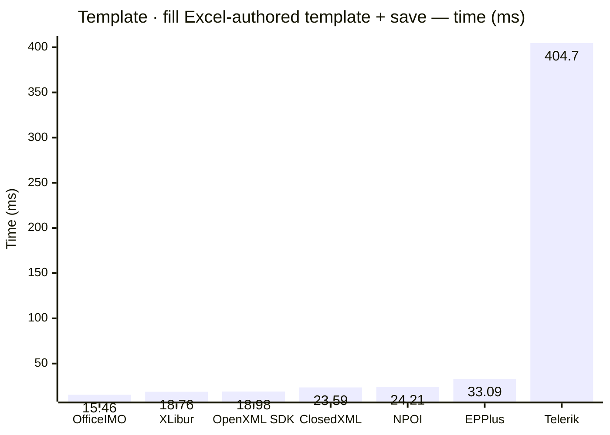
```mermaid
---
config:
  xyChart:
    showDataLabel: true
---
xychart-beta
    title "Template · fill Excel-authored template + save — time (ms)"
    x-axis ["OfficeIMO", "XLibur", "OpenXML SDK", "ClosedXML", "NPOI", "EPPlus", "Telerik"]
    y-axis "Time (ms)"
    bar [15.46, 18.76, 18.98, 23.59, 24.21, 33.09, 404.7]
```

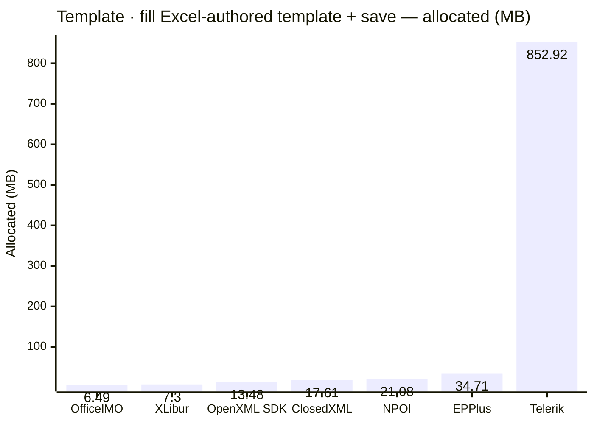
```mermaid
---
config:
  xyChart:
    showDataLabel: true
---
xychart-beta
    title "Template · fill Excel-authored template + save — allocated (MB)"
    x-axis ["OfficeIMO", "XLibur", "OpenXML SDK", "ClosedXML", "NPOI", "EPPlus", "Telerik"]
    y-axis "Allocated (MB)"
    bar [6.49, 7.3, 13.48, 17.61, 21.08, 34.71, 852.92]
```

## Detailed results


```

BenchmarkDotNet v0.15.8, Windows 11 (10.0.22631.6199/23H2/2023Update/SunValley3)
AMD Ryzen 9 5950X 3.40GHz, 1 CPU, 32 logical and 16 physical cores
.NET SDK 10.0.404
  [Host]     : .NET 10.0.15 (10.0.15, 10.0.1526.53008), X64 RyuJIT x86-64-v3
  DefaultJob : .NET 10.0.15 (10.0.15, 10.0.1526.53008), X64 RyuJIT x86-64-v3


```

### Read · open + set properties + save

| Library     | Type                        | Method                      | Mean          | Error       | StdDev     | Median        | Gen0         | Gen1        | Gen2       | Allocated   |
|------------ |---------------------------- |---------------------------- |--------------:|------------:|-----------:|--------------:|-------------:|------------:|-----------:|------------:|
| OpenXML SDK | OpenXmlReadBenchmarks       | OpenAmendPropertiesAndSave  |     0.2865 ms |   0.0055 ms |  0.0120 ms |     0.2842 ms |      29.2969 |     19.0430 |    15.6250 |     0.34 MB |
| OfficeIMO   | OfficeImoReadBenchmarks     | OpenAmendPropertiesAndSave  |     0.3516 ms |   0.0049 ms |  0.0046 ms |     0.3523 ms |      29.2969 |      6.8359 |          - |     0.47 MB |
| XLibur      | XLiburReadBenchmarks        | OpenAmendPropertiesAndSave  |     4.5019 ms |   0.0888 ms |  0.1579 ms |     4.4421 ms |      62.5000 |     31.2500 |          - |     1.39 MB |
| NPOI        | NpoiReadBenchmarks          | OpenAmendPropertiesAndSave  |     8.5275 ms |   0.1269 ms |  0.1125 ms |     8.4956 ms |      62.5000 |     31.2500 |          - |     1.89 MB |
| EPPlus      | EpPlusReadBenchmarks        | OpenAmendPropertiesAndSave  |    22.0946 ms |   0.4331 ms |  0.6071 ms |    22.0110 ms |    1000.0000 |   1000.0000 |  1000.0000 |    13.81 MB |
| ClosedXML   | ClosedXmlReadBenchmarks     | OpenAmendPropertiesAndSave  |    33.9449 ms |   0.5766 ms |  0.5112 ms |    33.8225 ms |     666.6667 |    333.3333 |          - |    13.18 MB |
| Telerik     | TelerikReadBenchmarks       | OpenAmendPropertiesAndSave  |    80.2743 ms |   1.5857 ms |  2.8593 ms |    80.2083 ms |   10666.6667 |   1000.0000 |   666.6667 |   182.57 MB |
| IronXL ⧗ | IronXlReadBenchmarks | OpenAmendPropertiesAndSave | 208.746 ms | 155.7570 ms | 92.6885 ms | 168.705 ms | 9000.0000 | 2000.0000 | - | 152.81 MB |

### Read · open + read all cells

| Library     | Type                        | Method                      | Mean          | Error       | StdDev     | Median        | Gen0         | Gen1        | Gen2       | Allocated   |
|------------ |---------------------------- |---------------------------- |--------------:|------------:|-----------:|--------------:|-------------:|------------:|-----------:|------------:|
| OfficeIMO   | OfficeImoReadBenchmarks     | OpenAndReadAll              |   135.6271 ms |   2.6005 ms |  2.9947 ms |   134.8602 ms |    2000.0000 |   1000.0000 |          - |    49.67 MB |
| Sylvan      | SylvanReadBenchmarks        | OpenAndReadAll              |   258.3125 ms |   4.4591 ms |  4.1710 ms |   257.8166 ms |    1666.6667 |   1000.0000 |   333.3333 |    25.28 MB |
| MiniExcel   | MiniExcelReadBenchmarks     | OpenAndReadAll              |   558.1909 ms |   9.2752 ms |  9.5249 ms |   556.5854 ms |   13000.0000 |   2000.0000 |          - |   221.18 MB |
| XLibur      | XLiburReadBenchmarks        | OpenAndReadAll              |   663.5341 ms |   9.4425 ms |  8.3705 ms |   663.1778 ms |    8000.0000 |   5000.0000 |  1000.0000 |   136.58 MB |
| EPPlus      | EpPlusReadBenchmarks        | OpenAndReadAll              | 1,110.8959 ms |  16.8708 ms | 15.7809 ms | 1,111.9538 ms |   49000.0000 |  14000.0000 |  7000.0000 |   925.22 MB |
| OpenXML SDK | OpenXmlReadBenchmarks       | OpenAndReadAll              | 1,117.5884 ms |   9.5670 ms |  7.9889 ms | 1,118.5153 ms |   40000.0000 |   6000.0000 |  1000.0000 |   627.82 MB |
| NPOI        | NpoiReadBenchmarks          | OpenAndReadAll              | 2,477.1063 ms |  47.9355 ms | 57.0637 ms | 2,456.1431 ms |   68000.0000 |  62000.0000 |  6000.0000 |  1075.67 MB |
| Telerik     | TelerikReadBenchmarks       | OpenAndReadAll              | 4,772.2521 ms |  72.0259 ms | 63.8491 ms | 4,754.6646 ms |  237000.0000 |  47000.0000 |  6000.0000 |   3895.6 MB |
| ClosedXML   | ClosedXmlReadBenchmarks     | OpenAndReadAll              | 6,141.0499 ms | 103.2854 ms | 96.6133 ms | 6,131.5126 ms |   60000.0000 |  24000.0000 |  4000.0000 |  1074.77 MB |
| IronXL ⧗ | IronXlReadBenchmarks | OpenAndReadAll | 9,318.107 ms | 477.3336 ms | 315.7266 ms | 9,377.407 ms | 393000.0000 | 202000.0000 | 10000.0000 | 6333.04 MB |

### Read · 20 sheets, shared strings + styles

| Library     | Type                        | Method                      | Mean          | Error       | StdDev     | Median        | Gen0         | Gen1        | Gen2       | Allocated   |
|------------ |---------------------------- |---------------------------- |--------------:|------------:|-----------:|--------------:|-------------:|------------:|-----------:|------------:|
| OfficeIMO   | OfficeImoSheetsBenchmarks   | OpenAndReadAllSheets        |    50.9883 ms |   0.9383 ms |  1.1866 ms |    50.9038 ms |     333.3333 |           - |          - |    12.03 MB |
| Sylvan      | SylvanSheetsBenchmarks      | OpenAndReadAllSheets        |    81.8915 ms |   1.5830 ms |  2.0020 ms |    81.5165 ms |    1000.0000 |           - |          - |     21.6 MB |
| NPOI        | NpoiSheetsBenchmarks        | OpenAndReadAllSheets        |   395.8203 ms |   7.8348 ms | 13.7220 ms |   396.3274 ms |   14000.0000 |  13000.0000 |  3000.0000 |    211.8 MB |
| XLibur      | XLiburSheetsBenchmarks      | OpenAndReadAllSheets        |   430.7951 ms |   8.5335 ms | 20.7717 ms |   428.3761 ms |   11000.0000 |   5000.0000 |  1000.0000 |   178.25 MB |
| OpenXML SDK | OpenXmlSheetsBenchmarks     | OpenAndReadAllSheets        |   458.0886 ms |   9.1102 ms |  8.9474 ms |   458.4516 ms |   11000.0000 |   6000.0000 |  1000.0000 |   162.81 MB |
| EPPlus      | EpPlusSheetsBenchmarks      | OpenAndReadAllSheets        |   474.3882 ms |   9.4788 ms | 25.4641 ms |   470.0372 ms |   24000.0000 |  10000.0000 |  5000.0000 |   360.64 MB |
| MiniExcel   | MiniExcelSheetsBenchmarks   | OpenAndReadAllSheets        | 1,200.0587 ms |  12.2370 ms | 11.4465 ms | 1,195.7654 ms |   31000.0000 |  10000.0000 |          - |   499.72 MB |
| Telerik     | TelerikSheetsBenchmarks     | OpenAndReadAllSheets        | 2,020.2096 ms |  33.2017 ms | 36.9036 ms | 2,025.4820 ms |  143000.0000 |  22000.0000 |  5000.0000 |  2377.63 MB |
| ClosedXML   | ClosedXmlSheetsBenchmarks   | OpenAndReadAllSheets        | 2,204.8786 ms |  40.7057 ms | 36.0846 ms | 2,190.9360 ms |   64000.0000 |  29000.0000 |  2000.0000 |  1023.57 MB |

### Write · create + save

| Library     | Type                        | Method                      | Mean          | Error       | StdDev     | Median        | Gen0         | Gen1        | Gen2       | Allocated   |
|------------ |---------------------------- |---------------------------- |--------------:|------------:|-----------:|--------------:|-------------:|------------:|-----------:|------------:|
| OfficeIMO   | OfficeImoWriteBenchmarks    | CreateAndSave               |    19.8374 ms |   0.2957 ms |  0.2766 ms |    19.7458 ms |    1125.0000 |   1093.7500 |   937.5000 |     9.38 MB |
| Sylvan      | SylvanWriteBenchmarks       | CreateAndSave               |    37.4491 ms |   0.4807 ms |  0.4261 ms |    37.5315 ms |    1714.2857 |   1642.8571 |  1500.0000 |    13.27 MB |
| MiniExcel   | MiniExcelWriteBenchmarks    | CreateAndSave               |    57.8683 ms |   1.1397 ms |  1.8077 ms |    58.1549 ms |    5444.4444 |   1444.4444 |  1444.4444 |    81.81 MB |
| OpenXML SDK | OpenXmlWriteBenchmarks      | CreateAndSave               |   156.7422 ms |   2.2800 ms |  2.0212 ms |   156.4591 ms |    8000.0000 |   2000.0000 |  2000.0000 |   134.19 MB |
| XLibur      | XLiburWriteBenchmarks       | CreateAndSave               |   182.0107 ms |   3.5084 ms |  4.6836 ms |   180.5449 ms |    3000.0000 |   2000.0000 |  2000.0000 |    60.21 MB |
| ClosedXML   | ClosedXmlWriteBenchmarks    | CreateAndSave               |   375.5217 ms |   7.4405 ms |  6.9599 ms |   372.0376 ms |   10000.0000 |   5000.0000 |  2000.0000 |   181.09 MB |
| EPPlus      | EpPlusWriteBenchmarks       | CreateAndSave               |   435.8362 ms |   8.6679 ms | 12.4313 ms |   435.6581 ms |   20000.0000 |   9000.0000 |  3000.0000 |   322.83 MB |
| NPOI        | NpoiWriteBenchmarks         | CreateAndSave               |   642.2316 ms |  12.6155 ms | 11.8006 ms |   642.1321 ms |   16000.0000 |  12000.0000 |  3000.0000 |   246.26 MB |
| IronXL ⧗ | IronXlWriteBenchmarks | CreateAndSave | 943.137 ms | 18.5191 ms | 11.0204 ms | 938.999 ms | 48000.0000 | 16000.0000 | 3000.0000 | 797.63 MB |
| Telerik     | TelerikWriteBenchmarks      | CreateAndSave               | 1,603.3713 ms |  16.5849 ms | 13.8492 ms | 1,609.4191 ms |  124000.0000 |  14000.0000 |  5000.0000 |  1999.13 MB |

### Report · data + conditional formatting + chart

| Library     | Type                        | Method                      | Mean          | Error       | StdDev     | Median        | Gen0         | Gen1        | Gen2       | Allocated   |
|------------ |---------------------------- |---------------------------- |--------------:|------------:|-----------:|--------------:|-------------:|------------:|-----------:|------------:|
| OfficeIMO   | OfficeImoReportBenchmarks   | CreateStockReport           |     3.7989 ms |   0.0750 ms |  0.0834 ms |     3.8070 ms |     171.8750 |     78.1250 |          - |     2.92 MB |
| XLibur      | XLiburReportBenchmarks      | CreateStockReport           |     7.3844 ms |   0.1425 ms |  0.1853 ms |     7.3603 ms |     187.5000 |    187.5000 |   187.5000 |     3.29 MB |
| OpenXML SDK | OpenXmlReportBenchmarks     | CreateStockReport           |     8.2311 ms |   0.1469 ms |  0.1374 ms |     8.1589 ms |     375.0000 |    359.3750 |   187.5000 |     4.92 MB |
| EPPlus      | EpPlusReportBenchmarks      | CreateStockReport           |    14.3296 ms |   0.2785 ms |  0.4335 ms |    14.2913 ms |    1000.0000 |   1000.0000 |  1000.0000 |    13.92 MB |
| ClosedXML   | ClosedXmlReportBenchmarks   | CreateStockReport           |    16.3176 ms |   0.2950 ms |  0.2759 ms |    16.3599 ms |     500.0000 |    187.5000 |    31.2500 |     8.27 MB |
| NPOI        | NpoiReportBenchmarks        | CreateStockReport           |    30.4644 ms |   0.6031 ms |  0.6703 ms |    30.2787 ms |     833.3333 |    666.6667 |   333.3333 |    16.43 MB |
| Telerik     | TelerikReportBenchmarks     | CreateStockReport           |   129.2867 ms |   3.4617 ms |  9.6498 ms |   125.9253 ms |   26000.0000 |   3000.0000 |  1000.0000 |    426.5 MB |
| IronXL ⧗ | IronXlReportBenchmarks | CreateStockReport | 387.849 ms | 36.5456 ms | 24.1726 ms | 384.092 ms | 14000.0000 | 3000.0000 | - | 237.38 MB |

### Edit · delete rows + set column + recalculate

| Library     | Type                        | Method                      | Mean          | Error       | StdDev     | Median        | Gen0         | Gen1        | Gen2       | Allocated   |
|------------ |---------------------------- |---------------------------- |--------------:|------------:|-----------:|--------------:|-------------:|------------:|-----------:|------------:|
| OfficeIMO   | OfficeImoEditBenchmarks     | EditAndRecalculate          |     6.6225 ms |   0.1316 ms |  0.2406 ms |     6.6618 ms |     328.1250 |    265.6250 |   156.2500 |     3.63 MB |
| XLibur      | XLiburEditBenchmarks        | EditAndRecalculate          |     7.2083 ms |   0.1393 ms |  0.1711 ms |     7.1982 ms |     156.2500 |     78.1250 |          - |     2.69 MB |
| OpenXML SDK | OpenXmlEditBenchmarks       | EditAndRecalculate          |    25.6174 ms |   0.2825 ms |  0.2642 ms |    25.5361 ms |     718.7500 |    656.2500 |   156.2500 |      9.8 MB |
| EPPlus      | EpPlusEditBenchmarks        | EditAndRecalculate          |    86.0556 ms |   1.7048 ms |  2.4450 ms |    85.3657 ms |    9000.0000 |   1200.0000 |  1000.0000 |   142.52 MB |
| ClosedXML   | ClosedXmlEditBenchmarks     | EditAndRecalculate          |   343.9737 ms |   6.7520 ms |  8.7796 ms |   344.2532 ms |   21000.0000 |   1000.0000 |          - |   337.74 MB |
| NPOI        | NpoiEditBenchmarks          | EditAndRecalculate          |   387.6422 ms |   7.1046 ms | 10.6338 ms |   383.4543 ms |   25000.0000 |   1000.0000 |          - |   413.38 MB |
| IronXL ⧗ | IronXlEditBenchmarks | EditAndRecalculate | 1,577.273 ms | 62.9583 ms | 41.6430 ms | 1,583.098 ms | 57000.0000 | 36000.0000 | 15000.0000 | 753.86 MB |
| Telerik     | TelerikEditBenchmarks       | EditAndRecalculate          | 5,406.1940 ms |  47.3266 ms | 44.2693 ms | 5,403.9858 ms | 1054000.0000 | 248000.0000 | 83000.0000 | 16589.64 MB |

### Edit · insert 2 columns + recalculate

| Library     | Type                        | Method                      | Mean          | Error       | StdDev     | Median        | Gen0         | Gen1        | Gen2       | Allocated   |
|------------ |---------------------------- |---------------------------- |--------------:|------------:|-----------:|--------------:|-------------:|------------:|-----------:|------------:|
| OfficeIMO   | OfficeImoInsertBenchmarks   | InsertColumnsAndRecalculate |     7.7611 ms |   0.1485 ms |  0.1458 ms |     7.7163 ms |     328.1250 |    234.3750 |   156.2500 |     3.48 MB |
| XLibur      | XLiburInsertBenchmarks      | InsertColumnsAndRecalculate |     7.9635 ms |   0.1204 ms |  0.0940 ms |     7.9917 ms |     156.2500 |     62.5000 |          - |      2.7 MB |
| EPPlus      | EpPlusInsertBenchmarks      | InsertColumnsAndRecalculate |    15.5583 ms |   0.2882 ms |  0.2555 ms |    15.4554 ms |    1000.0000 |   1000.0000 |  1000.0000 |    11.45 MB |
| ClosedXML   | ClosedXmlInsertBenchmarks   | InsertColumnsAndRecalculate |    26.1699 ms |   0.5219 ms |  0.6600 ms |    25.8876 ms |     800.0000 |    400.0000 |          - |    14.04 MB |
| OpenXML SDK | OpenXmlInsertBenchmarks     | InsertColumnsAndRecalculate |    31.3851 ms |   0.6054 ms |  0.5367 ms |    31.3625 ms |    1000.0000 |    800.0000 |   400.0000 |    13.05 MB |
| NPOI        | NpoiInsertBenchmarks        | InsertColumnsAndRecalculate |    36.3515 ms |   0.7259 ms |  1.9871 ms |    36.2536 ms |    2000.0000 |   1333.3333 |   500.0000 |    30.72 MB |
| IronXL ⧗ | IronXlInsertBenchmarks | InsertColumnsAndRecalculate | 113.284 ms | 41.9750 ms | 27.7638 ms | 97.052 ms | 7000.0000 | 2500.0000 | 750.0000 | 104.88 MB |
| Telerik     | TelerikInsertBenchmarks     | InsertColumnsAndRecalculate |   176.8901 ms |   3.5001 ms |  6.2214 ms |   178.9186 ms |   17000.0000 |   6000.0000 |  2000.0000 |   272.39 MB |

### Calc · change prices + recalculate lookups and SUMIFS

| Library     | Type                        | Method                      | Mean          | Error       | StdDev     | Median        | Gen0         | Gen1        | Gen2       | Allocated   |
|------------ |---------------------------- |---------------------------- |--------------:|------------:|-----------:|--------------:|-------------:|------------:|-----------:|------------:|
| OfficeIMO   | OfficeImoCalcBenchmarks     | ChangePricesAndRecalculate  |    36.1127 ms |   0.7186 ms |  0.7988 ms |    36.0571 ms |    1076.9231 |    923.0769 |   230.7692 |    15.25 MB |
| XLibur      | XLiburCalcBenchmarks        | ChangePricesAndRecalculate  |    54.0494 ms |   1.5618 ms |  4.0593 ms |    52.8659 ms |            - |           - |          - |    10.77 MB |
| ClosedXML   | ClosedXmlCalcBenchmarks     | ChangePricesAndRecalculate  |   132.1806 ms |   2.2320 ms |  3.7291 ms |   131.6615 ms |    2000.0000 |   1000.0000 |          - |    48.78 MB |
| EPPlus      | EpPlusCalcBenchmarks        | ChangePricesAndRecalculate  |   138.9640 ms |   2.4129 ms |  3.6848 ms |   137.7433 ms |    9000.0000 |   3000.0000 |  1000.0000 |    129.6 MB |
| NPOI        | NpoiCalcBenchmarks          | ChangePricesAndRecalculate  |   202.0008 ms |   4.0126 ms |  7.6344 ms |   201.9566 ms |   10000.0000 |   4000.0000 |  1000.0000 |   156.21 MB |

### Template · fill Excel-authored template + save

| Library     | Type                        | Method                      | Mean          | Error       | StdDev     | Median        | Gen0         | Gen1        | Gen2       | Allocated   |
|------------ |---------------------------- |---------------------------- |--------------:|------------:|-----------:|--------------:|-------------:|------------:|-----------:|------------:|
| OfficeIMO   | OfficeImoTemplateBenchmarks | FillTemplateAndSave         |    15.4580 ms |   0.3037 ms |  0.6136 ms |    15.4162 ms |     531.2500 |    437.5000 |   250.0000 |     6.49 MB |
| XLibur      | XLiburTemplateBenchmarks    | FillTemplateAndSave         |    18.7611 ms |   0.4630 ms |  1.3059 ms |    18.7898 ms |     714.2857 |    571.4286 |   428.5714 |      7.3 MB |
| OpenXML SDK | OpenXmlTemplateBenchmarks   | FillTemplateAndSave         |    18.9833 ms |   0.3734 ms |  0.7013 ms |    18.9473 ms |    1187.5000 |   1125.0000 |   500.0000 |    13.48 MB |
| ClosedXML   | ClosedXmlTemplateBenchmarks | FillTemplateAndSave         |    23.5925 ms |   0.4329 ms |  0.5475 ms |    23.6975 ms |    1000.0000 |    428.5714 |   142.8571 |    17.61 MB |
| NPOI        | NpoiTemplateBenchmarks      | FillTemplateAndSave         |    24.2127 ms |   0.4758 ms |  1.3499 ms |    23.8089 ms |    1142.8571 |    857.1429 |   285.7143 |    21.08 MB |
| EPPlus      | EpPlusTemplateBenchmarks    | FillTemplateAndSave         |    33.0921 ms |   0.6246 ms |  0.8549 ms |    32.9358 ms |    3000.0000 |   1285.7143 |  1000.0000 |    34.71 MB |
| Telerik     | TelerikTemplateBenchmarks   | FillTemplateAndSave         |   404.7013 ms |   8.0661 ms | 12.5579 ms |   405.5037 ms |   54000.0000 |  12000.0000 |  3000.0000 |   852.92 MB |


<script type="module">
  import mermaid from 'https://cdn.jsdelivr.net/npm/mermaid@11/dist/mermaid.esm.min.mjs';
  const blocks = document.querySelectorAll('.language-mermaid');
  blocks.forEach(el => {
    const code = el.querySelector('code') || el;
    const pre = document.createElement('pre');
    pre.className = 'mermaid';
    pre.textContent = code.textContent;
    el.replaceWith(pre);
  });
  if (blocks.length) {
    mermaid.initialize({ startOnLoad: false });
    await mermaid.run({ querySelector: 'pre.mermaid' });
  }
</script>

<script>
(function () {
  const parse = s => { const n = parseFloat(String(s).replace(/,/g, '')); return Number.isFinite(n) ? n : null; };
  document.querySelectorAll('table').forEach(table => {
    if (!table.tHead || !table.tBodies[0]) return;
    const heads = [...table.tHead.rows[0].cells].map(c => c.textContent.trim().toLowerCase());
    if (!heads.includes('mean')) return;
    const metricCols = heads.map((h, i) => /^(mean|allocated|gen0|gen1|gen2)$/.test(h) ? i : -1).filter(i => i >= 0);
    const rows = [...table.tBodies[0].rows];
    for (const c of metricCols) {
      const vals = rows.map(r => parse(r.cells[c]?.textContent));
      const nums = vals.filter(v => v !== null);
      if (nums.length < 2) continue;
      const min = Math.min(...nums), max = Math.max(...nums);
      if (max === min) continue;
      rows.forEach((r, i) => {
        const v = vals[i]; if (v === null) return;
        const ratio = (v - min) / (max - min);
        r.cells[c].style.backgroundColor = `hsla(${120 - 120 * ratio}, 70%, 50%, 0.45)`;
      });
    }
  });
})();
</script>
